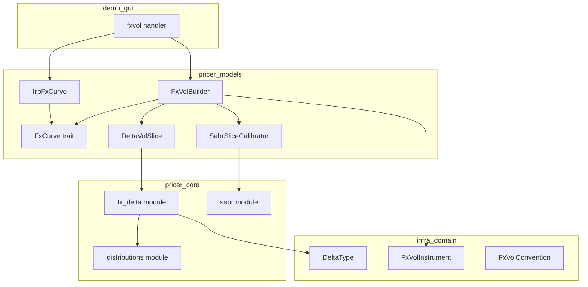
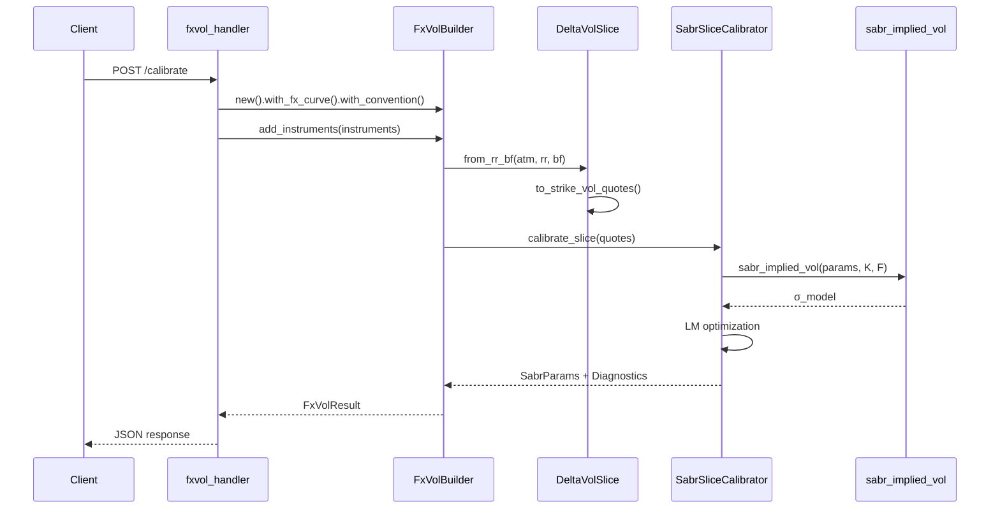

# Technical Design: FX Volatility Calibration Migration

## Overview

**Purpose**: FXボラティリティサーフェスのキャリブレーションロジックを `demo/gui` から適切なクレート（`pricer_core`、`pricer_models`）へ移行し、A-I-P-Sアーキテクチャに準拠させる。

**Users**: 量的開発者、リスク管理者がFXボラティリティサーフェスの構築とキャリブレーションを行う際に使用する。

**Impact**: demo_gui のキャリブレーションロジック（約600行）を削除し、pricer_core/pricer_models に数学的計算とビジネスロジックを適切に配置する。

### Goals

- Delta-Strike 変換関数を pricer_core に実装し、FXデルタクォートの変換を標準化
- FXフォワードカーブ（IrpFxCurve）を pricer_models に実装
- SabrSliceCalibrator を完全実装し、Levenberg-Marquardt による最適化を提供
- FxVolBuilder を拡張し、FxVolInstrument を直接受け取れるようにする
- demo_gui を薄いHTTPハンドラー層として再構築

### Non-Goals

- 新しいボラティリティモデル（SVI、Vanna-Volga等）の追加
- リアルタイム市場データフィードとの統合
- パフォーマンス最適化（SIMD、並列化）— 将来の検討事項
- Python binding の更新 — 別仕様で対応

---

## Architecture

### Existing Architecture Analysis

**現在の依存グラフ**:
```
infra_domain ← pricer_core ← pricer_models ← demo_gui
```

**A-I-P-S違反の現状**:
- demo_gui (Service層) にビジネスロジック（delta_to_strike, RR/BF変換, SABR calibration）が存在
- pricer_models の SabrSliceCalibrator はプレースホルダー実装

**維持すべきパターン**:
- `<T: Float>` ジェネリクスによるAD互換性
- enum ベースの静的ディスパッチ（Enzyme互換性）
- CalibrationError による統一エラーハンドリング

### Architecture Pattern & Boundary Map



**Architecture Integration**:
- **Selected pattern**: レイヤード・アーキテクチャ（A-I-P-S）の維持と拡張
- **Domain boundaries**:
  - pricer_core: 純粋な数学的計算（delta_to_strike, SABR implied vol）
  - pricer_models: ビジネスロジック（FxCurve, FxVolBuilder, calibration）
  - demo_gui: HTTP ハンドラーのみ
- **Existing patterns preserved**: Float ジェネリクス、enum ディスパッチ、CalibrationError
- **New components rationale**:
  - fx_delta: デルタ変換の標準化と再利用
  - FxCurve/IrpFxCurve: FXフォワード計算の抽象化
  - DeltaVolSlice: RR/BF からストライクベースへの変換

### Technology Stack

| Layer | Choice / Version | Role in Feature | Notes |
|-------|------------------|-----------------|-------|
| Core Math | pricer_core | delta_to_strike, SABR vol | Float ジェネリクス |
| Models | pricer_models | FxCurve, FxVolBuilder, Calibrator | levenberg-marquardt 使用 |
| Types | infra_domain | DeltaType, FxVolInstrument | 既存型を活用 |
| Optimisation | levenberg-marquardt crate | SABR parameter fitting | workspace 既存依存 |
| HTTP | demo_gui (axum) | API endpoints | 薄いハンドラー層 |

---

## Requirements Traceability

| Requirement | Summary | Components | Interfaces | Flows |
|-------------|---------|------------|------------|-------|
| 1.1-1.6 | Delta-Strike変換 | fx_delta module | delta_to_strike(), strike_to_delta() | - |
| 2.1-2.5 | FXフォワードカーブ | FxCurve, IrpFxCurve | FxCurve trait | - |
| 3.1-3.6 | RR/BF変換 | DeltaVolSlice | from_rr_bf(), to_strike_vol_quotes() | - |
| 4.1-4.6 | SABRキャリブレーション | SabrSliceCalibrator | calibrate_slice() | Calibration Flow |
| 5.1-5.6 | FxVolBuilder拡張 | FxVolBuilder | with_fx_curve(), add_instrument() | - |
| 6.1-6.5 | 診断情報 | SliceCalibrationDiagnostics | - | - |
| 7.1-7.7 | demo_gui簡略化 | fxvol handler | HTTP endpoints | API Flow |

---

## System Flows

### SABR Calibration Flow



**Key Decisions**:
- FxVolInstrument → DeltaVolSlice → VolQuote の変換パイプライン
- LM 最適化は calibrate_slice 内で完結
- 診断情報（iterations, residual, converged）は結果に含める

---

## Components and Interfaces

### Component Summary

| Component | Domain/Layer | Intent | Req Coverage | Key Dependencies | Contracts |
|-----------|--------------|--------|--------------|------------------|-----------|
| fx_delta | pricer_core/math | Delta-Strike 双方向変換 | 1.1-1.6 | distributions, DeltaType (P0) | Service |
| FxCurve | pricer_models/market | FXフォワード計算トレイト | 2.1-2.5 | YieldCurve (P0) | Service |
| IrpFxCurve | pricer_models/market | IRP ベースのフォワード実装 | 2.1-2.5 | FxCurve, YieldCurve (P0) | Service |
| FxCurveEnum | pricer_models/market | FxCurve 静的ディスパッチラッパー | 2.1-2.5, 5.1 | IrpFxCurve (P0) | Service |
| DeltaVolSlice | pricer_models/builder/vol | RR/BF → ストライクボラティリティ変換 | 3.1-3.6 | fx_delta (P0), FxCurveEnum (P1) | Service |
| SabrSliceCalibrator | pricer_models/builder/vol | SABR パラメータ最適化 | 4.1-4.6 | sabr_implied_vol (P0), LM (P0) | Service |
| SliceCalibrationDiagnostics | pricer_models/builder/vol | キャリブレーション診断情報 | 6.1-6.5 | - | State |
| FxVolBuilder | pricer_models/builder/vol | FX vol サーフェス構築 | 5.1-5.6 | DeltaVolSlice (P0), FxCurveEnum (P0), Calibrator (P0) | Service |
| fxvol_handler | demo_gui/handlers | HTTP エンドポイント | 7.1-7.7 | FxVolBuilder (P0) | API |

---

### pricer_core / math

#### fx_delta module

| Field | Detail |
|-------|--------|
| Intent | FXオプションのデルタ値とストライク価格の双方向変換を提供 |
| Requirements | 1.1, 1.2, 1.3, 1.4, 1.5, 1.6 |

**Responsibilities & Constraints**:
- DeltaType（SpotDelta, ForwardDelta, PremiumAdjusted）に応じた変換ロジック
- `<T: Float>` ジェネリクスによるAD互換性
- PremiumAdjusted は反復解法を使用

**Dependencies**:
- Inbound: pricer_models::DeltaVolSlice — デルタ→ストライク変換 (P0)
- Outbound: distributions::norm_cdf_inv — 逆正規分布 (P0)
- External: infra_domain::DeltaType — デルタタイプ定義 (P0)

**Contracts**: Service [x]

##### Service Interface

```rust
/// Delta からストライク価格を計算する
pub fn delta_to_strike<T: Float>(
    delta: T,           // デルタ値（正: Call, 負: Put）
    spot: T,            // スポット価格
    domestic_rate: T,   // 国内金利
    foreign_rate: T,    // 外国金利
    expiry: T,          // 満期（年）
    volatility: T,      // インプライドボラティリティ
    delta_type: DeltaType,
) -> Result<T, FormulaError>;

/// ストライク価格からデルタを計算する
pub fn strike_to_delta<T: Float>(
    strike: T,
    spot: T,
    domestic_rate: T,
    foreign_rate: T,
    expiry: T,
    volatility: T,
    is_call: bool,
    delta_type: DeltaType,
) -> Result<T, FormulaError>;
```

- **Preconditions**: spot > 0, volatility > 0, expiry > 0
- **Postconditions**: 有効なストライク/デルタ値を返す
- **Invariants**: delta_to_strike と strike_to_delta は逆関数関係

**Implementation Notes**:
- SpotDelta/ForwardDelta は閉形式、PremiumAdjusted は Newton-Raphson
- norm_cdf_inv は Moro アルゴリズムまたは既存実装を使用
- 収束失敗時は FormulaError::ConvergenceFailure を返す

---

### pricer_models / market

#### FxCurve trait

| Field | Detail |
|-------|--------|
| Intent | FXスポットとフォワード価格のアクセスを抽象化 |
| Requirements | 2.1 |

**Contracts**: Service [x]

##### Service Interface

```rust
pub trait FxCurve<T: Float> {
    /// スポット価格を返す
    fn spot(&self) -> T;

    /// 指定満期のフォワード価格を返す
    fn forward(&self, expiry: T) -> Result<T, MarketDataError>;

    /// 通貨ペアを返す
    fn currency_pair(&self) -> &CurrencyPair;
}
```

---

#### IrpFxCurve

| Field | Detail |
|-------|--------|
| Intent | Interest Rate Parity に基づく FX フォワード計算 |
| Requirements | 2.2, 2.3, 2.4, 2.5 |

**Dependencies**:
- Inbound: FxVolBuilder — フォワード計算 (P0)
- Outbound: YieldCurve — 割引率計算 (P0)

**Contracts**: Service [x]

##### Service Interface

```rust
pub struct IrpFxCurve<T: Float, D: YieldCurve<T>, F: YieldCurve<T>> {
    currency_pair: CurrencyPair,
    spot: T,
    domestic_curve: D,
    foreign_curve: F,
}

impl<T, D, F> FxCurve<T> for IrpFxCurve<T, D, F>
where
    T: Float,
    D: YieldCurve<T>,
    F: YieldCurve<T>,
{
    fn spot(&self) -> T { self.spot }

    fn forward(&self, expiry: T) -> Result<T, MarketDataError> {
        // F = S × df_foreign(T) / df_domestic(T)
    }

    fn currency_pair(&self) -> &CurrencyPair { &self.currency_pair }
}
```

- **Preconditions**: spot > 0, domestic_curve と foreign_curve が有効
- **Postconditions**: forward > 0
- **Invariants**: forward(0) = spot

---

#### FxCurveEnum

| Field | Detail |
|-------|--------|
| Intent | FxCurve の静的ディスパッチラッパー（Enzyme互換性） |
| Requirements | 2.1-2.5, 5.1 |

**Design Rationale**:
Enzyme AAD との互換性を維持するため、`Box<dyn FxCurve<T>>` ではなく enum ベースの静的ディスパッチを採用。これにより、コンパイル時に全ての型が確定し、Enzyme による自動微分が可能となる。

**Contracts**: Service [x]

##### Service Interface

```rust
/// FxCurve の静的ディスパッチ用 enum（Enzyme互換性）
pub enum FxCurveEnum<T: Float> {
    /// Interest Rate Parity ベースのカーブ（FlatCurve 使用）
    IrpFlat(IrpFxCurve<T, FlatCurve<T>, FlatCurve<T>>),
    /// Interest Rate Parity ベースのカーブ（BootstrappedCurve 使用）
    IrpBootstrapped(IrpFxCurve<T, BootstrappedCurve<T>, BootstrappedCurve<T>>),
    /// Interest Rate Parity ベースのカーブ（CurveEnum 使用）
    Irp(IrpFxCurve<T, CurveEnum<T>, CurveEnum<T>>),
}

impl<T: Float> FxCurveEnum<T> {
    /// スポット価格を返す
    pub fn spot(&self) -> T {
        match self {
            Self::IrpFlat(c) => c.spot(),
            Self::IrpBootstrapped(c) => c.spot(),
            Self::Irp(c) => c.spot(),
        }
    }

    /// 指定満期のフォワード価格を返す
    pub fn forward(&self, expiry: T) -> Result<T, MarketDataError> {
        match self {
            Self::IrpFlat(c) => c.forward(expiry),
            Self::IrpBootstrapped(c) => c.forward(expiry),
            Self::Irp(c) => c.forward(expiry),
        }
    }

    /// 通貨ペアを返す
    pub fn currency_pair(&self) -> &CurrencyPair {
        match self {
            Self::IrpFlat(c) => c.currency_pair(),
            Self::IrpBootstrapped(c) => c.currency_pair(),
            Self::Irp(c) => c.currency_pair(),
        }
    }
}
```

**Implementation Notes**:
- 新しい FxCurve 実装が追加された場合、enum バリアントを追加する
- CurveEnum パターンに準拠（既存の YieldCurve 静的ディスパッチと一貫性を維持）

---

### pricer_models / builder / vol

#### DeltaVolSlice

| Field | Detail |
|-------|--------|
| Intent | 特定満期のデルタボラティリティデータを保持し、ストライクベースに変換 |
| Requirements | 3.1, 3.2, 3.3, 3.4, 3.5, 3.6 |

**Dependencies**:
- Inbound: FxVolBuilder — スライス構築 (P0)
- Outbound: fx_delta::delta_to_strike — ストライク計算 (P0)
- Outbound: FxCurve::forward — フォワード価格取得 (P1)

**Contracts**: Service [x]

##### Service Interface

```rust
pub struct DeltaVolSlice<T: Float> {
    pub expiry: T,
    pub forward: T,
    pub atm_vol: T,
    pub vol_25d_call: T,
    pub vol_25d_put: T,
    pub vol_10d_call: Option<T>,
    pub vol_10d_put: Option<T>,
}

impl<T: Float> DeltaVolSlice<T> {
    /// RR/BF クォートからインスタンスを構築
    pub fn from_rr_bf(
        expiry: T,
        forward: T,
        atm_vol: T,
        rr_25d: T,
        bf_25d: T,
        rr_10d: Option<T>,
        bf_10d: Option<T>,
    ) -> Self;

    /// ストライクベースの VolQuote に変換
    pub fn to_strike_vol_quotes(
        &self,
        spot: T,
        domestic_rate: T,
        foreign_rate: T,
        delta_type: DeltaType,
    ) -> Result<Vec<VolQuote<T>>, CalibrationError>;
}
```

- **Preconditions**: atm_vol > 0, forward > 0
- **Postconditions**: 3〜5個の VolQuote を返す
- **Invariants**: vol_25d_call = atm + bf_25d + rr_25d / 2

---

#### SabrSliceCalibrator

| Field | Detail |
|-------|--------|
| Intent | SABR パラメータ（α, ρ, ν）を Levenberg-Marquardt で最適化 |
| Requirements | 4.1, 4.2, 4.3, 4.4, 4.5, 4.6 |

**Dependencies**:
- Inbound: FxVolBuilder — スライスキャリブレーション (P0)
- Outbound: sabr_implied_vol — モデルボラティリティ計算 (P0)
- External: levenberg-marquardt — LM ソルバー (P0)

**Contracts**: Service [x] / State [x]

##### Service Interface

```rust
impl<T: Float> SabrSliceCalibrator<T> {
    /// スライスをキャリブレーションし、SABR パラメータと診断情報を返す
    pub fn calibrate_slice(
        &self,
        quotes: &[VolQuote<T>],
        config: &SliceCalibrationConfig<T>,
    ) -> Result<(SabrParams<T>, SliceCalibrationDiagnostics<T>), CalibrationError>;
}
```

- **Preconditions**: quotes.len() >= 3, config.max_iterations > 0
- **Postconditions**: α > 0, -1 < ρ < 1, ν > 0
- **Invariants**: diagnostics.converged == true の場合、residual < config.tolerance

##### State Management

```rust
pub struct SliceCalibrationDiagnostics<T: Float> {
    pub expiry: T,
    pub residual: T,      // 最終残差 (SSE)
    pub iterations: usize,
    pub converged: bool,
}
```

**Implementation Notes**:
- 初期推定値: α = σ_ATM × F^(1-β), ρ = -0.2, ν = 0.3
- パラメータ境界はクリッピングで適用（LM 後処理）
- 収束失敗時は CalibrationError::NonConvergence を返す

---

#### FxVolBuilder

| Field | Detail |
|-------|--------|
| Intent | FX vol サーフェスを FxVolInstrument から構築 |
| Requirements | 5.1, 5.2, 5.3, 5.4, 5.5, 5.6 |

**Dependencies**:
- Inbound: demo_gui/fxvol_handler — サーフェス構築 (P0)
- Outbound: DeltaVolSlice — RR/BF 変換 (P0)
- Outbound: SabrSliceCalibrator — キャリブレーション (P0)
- Outbound: FxCurve — フォワード計算 (P1)
- External: FxVolInstrument, FxVolConvention — 型定義 (P0)

**Contracts**: Service [x]

##### Service Interface

```rust
pub struct FxVolBuilder<T: Float> {
    config: SliceCalibrationConfig<T>,
    fx_curve: Option<FxCurveEnum<T>>,  // 静的ディスパッチ（Enzyme互換性）
    convention: Option<FxVolConvention>,
    instruments: BTreeMap<OrderedFloat<T>, Vec<FxVolInstrument<T>>>,
    calibrator: SabrSliceCalibrator<T>,
}

impl<T: Float> FxVolBuilder<T> {
    pub fn new(config: SliceCalibrationConfig<T>) -> Self;

    /// FX カーブを設定（FxCurveEnum による静的ディスパッチ）
    pub fn with_fx_curve(self, curve: FxCurveEnum<T>) -> Self;

    /// デルタ慣行を設定
    pub fn with_convention(self, convention: FxVolConvention) -> Self;

    /// 単一インストゥルメントを追加
    pub fn add_instrument(&mut self, instrument: FxVolInstrument<T>) -> &mut Self;

    /// 複数インストゥルメントを追加
    pub fn add_instruments(&mut self, instruments: &[FxVolInstrument<T>]) -> &mut Self;

    /// キャリブレーションを実行
    pub fn calibrate(self) -> Result<FxVolResult<T>, CalibrationError>;
}

pub struct FxVolResult<T: Float> {
    pub params: BTreeMap<OrderedFloat<T>, SabrParams<T>>,
    pub diagnostics: Vec<SliceCalibrationDiagnostics<T>>,
}
```

- **Preconditions**: fx_curve と convention が設定済み、instruments が空でない
- **Postconditions**: 各 expiry に対して SabrParams が計算される

**Design Decision**: `FxCurveEnum<T>` を使用することで、Enzyme AAD との互換性を維持しつつ型安全性を確保。ジェネリクス `<C: FxCurve<T>>` ではなく enum ラッパーを採用し、静的ディスパッチパターン（CurveEnum と同様）に準拠。

---

### demo_gui / handlers

#### fxvol_handler

| Field | Detail |
|-------|--------|
| Intent | FX vol キャリブレーション API エンドポイント |
| Requirements | 7.1, 7.2, 7.3, 7.4, 7.5, 7.6, 7.7 |

**Dependencies**:
- Outbound: FxVolBuilder — キャリブレーション実行 (P0)
- Outbound: IrpFxCurve — フォワードカーブ構築 (P0)
- Outbound: FxVolInstrumentBuilder — インストゥルメント構築 (P0)

**Contracts**: API [x]

##### API Contract

| Method | Endpoint | Request | Response | Errors |
|--------|----------|---------|----------|--------|
| POST | /api/fxvol/calibrate | CalibrateRequest | CalibrateResponse | 400, 422, 500 |

**Implementation Notes**:
- 削除対象: to_delta_vols, DeltaVols, delta_to_strike, フォワード計算のインラインコード
- リクエストから FxVolInstrument を構築し、FxVolBuilder に委譲
- CalibrationError を適切な HTTP ステータスに変換

---

## Data Models

### Domain Model

**Aggregates**:
- `FxVolBuilder`: サーフェス構築のルートエンティティ
- `DeltaVolSlice`: 満期ごとのデルタボラティリティデータ

**Value Objects**:
- `SabrParams<T>`: SABR パラメータ（α, β, ρ, ν）
- `VolQuote<T>`: ストライク/ボラティリティペア
- `SliceCalibrationDiagnostics<T>`: キャリブレーション診断情報

**Business Rules**:
- α > 0, -1 < ρ < 1, ν > 0（SABR パラメータ制約）
- vol_25d_call = atm + bf_25d + rr_25d / 2（RR/BF 変換式）

---

## Error Handling

### Error Categories and Responses

**Calibration Errors (422)**:
- `InsufficientData`: クォート数不足 → 最低3点必要と案内
- `NonConvergence`: 収束失敗 → 診断情報と共に返却
- `InvalidParameters`: パラメータ制約違反 → 境界値を案内

**Input Errors (400)**:
- 無効な DeltaType
- 負のボラティリティ
- 不正な通貨ペア

**System Errors (500)**:
- 内部計算エラー → ログ記録、汎用エラーレスポンス

### Monitoring

- キャリブレーション失敗率のトラッキング
- 収束イテレーション数の分布
- 残差の統計情報

---

## Testing Strategy

### Unit Tests
- `delta_to_strike` / `strike_to_delta` の往復変換テスト
- 各 DeltaType（SpotDelta, ForwardDelta, PremiumAdjusted）の計算検証
- IrpFxCurve のフォワード計算テスト
- DeltaVolSlice の RR/BF 変換テスト

### Integration Tests
- FxVolBuilder → SabrSliceCalibrator の統合フロー
- 複数満期のキャリブレーション
- demo_gui エンドポイントのE2Eテスト

### Calibration Tests
- 既知の SABR パラメータからクォート生成 → キャリブレーション → パラメータ一致確認
- 収束失敗ケースのエラーハンドリング確認
- 市場データに対する再現性テスト
