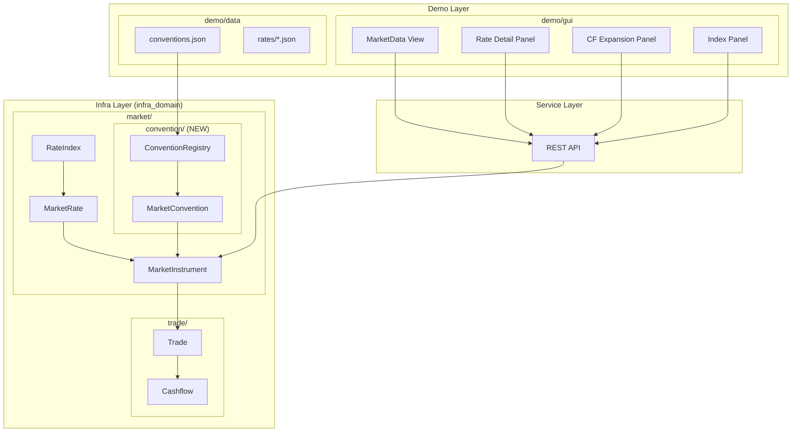
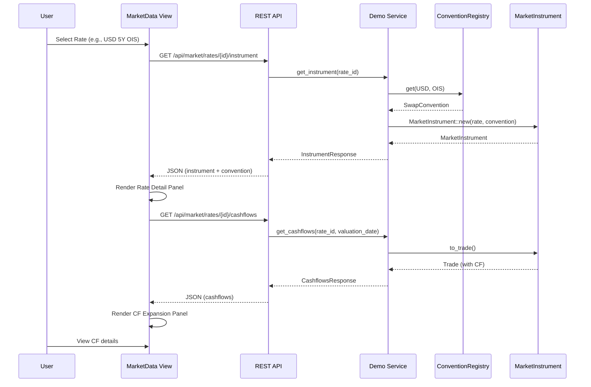
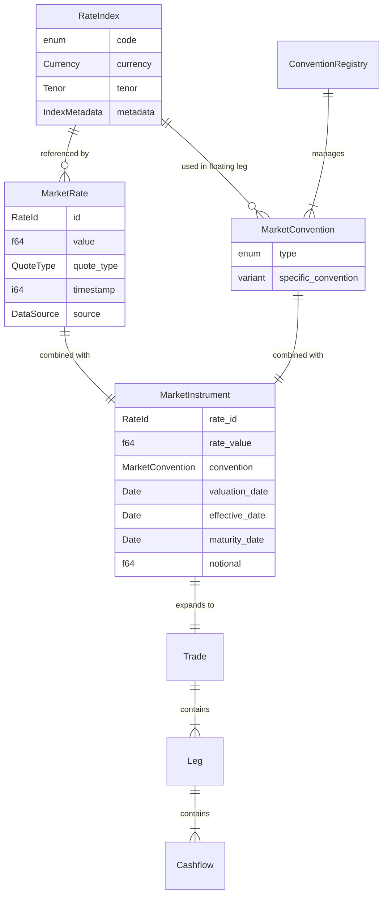
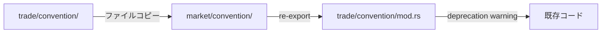

# Design Document: market-convention-instrument

## Overview

**Purpose:** 本機能は MarketRate と MarketConvention を統合し、CF 展開可能な MarketInstrument として統一的に扱うアーキテクチャを提供する。これにより、デモユーザーは MarketData 画面でレート選択時に Instrument 詳細とキャッシュフロー展開を直接確認できる。

**Users:**
- 開発者: 型安全な Rate-Convention-Instrument 変換パイプラインを利用
- デモユーザー: MarketData 画面での統合的なマーケットデータ閲覧

**Impact:** `infra_domain` クレートの market モジュール拡張、convention モジュールの移動、Demo GUI の MarketData 画面強化、TradeExpand 画面の廃止。

### Goals

- MarketRate + MarketConvention = MarketInstrument の統一モデル確立
- RateIndex を起点とした関連データ（Rate, Convention, Instrument）のナビゲーション
- Demo GUI での Rate 選択 → CF 展開までのシームレスな体験
- 新規通貨・商品追加を JSON 設定のみで実現

### Non-Goals

- 本番環境向けのパフォーマンス最適化
- リアルタイムマーケットデータフィード統合
- 複雑なエキゾチック商品の Convention 定義
- Enzyme AD との統合

## Architecture

> 詳細な調査結果は [research.md](research.md) を参照。

### Existing Architecture Analysis

現在の `infra_domain` クレートは以下の構造を持つ:

- `market/`: MarketRate, RateId, RateIndex, MarketRateSet 等のマーケットデータ型
- `trade/convention/`: SwapConvention, FraConvention 等の商品慣行定義
- `trade/`: Trade, Leg, Cashflow 等のトレード表現

**課題:**
1. Convention が `trade/` 配下にあり、MarketRate との概念的関連性が弱い
2. MarketRate から直接 Instrument への変換パスがない
3. RateIndex と Convention の関係が明示的でない

### Architecture Pattern & Boundary Map



**Architecture Integration:**
- **選択パターン:** Facade + Registry パターン
- **ドメイン境界:** market/ が MarketRate から MarketInstrument への変換を担当、trade/ は CF 展開のみを担当
- **既存パターン維持:** A-I-P-S 単方向データフロー
- **新コンポーネント根拠:**
  - `MarketConvention`: 商品慣行の統一表現
  - `MarketInstrument`: Rate + Convention の結合型
  - `ConventionRegistry`: JSON 駆動の Convention 管理
- **Steering 準拠:** Infra レイヤーに閉じた変更、Pricer/Service への依存なし

### Technology Stack

| Layer | Choice / Version | Role in Feature | Notes |
|-------|------------------|-----------------|-------|
| Backend | Rust (infra_domain) | 型定義、変換ロジック | 既存クレート拡張 |
| Data | JSON files | Convention 定義、Demo data | serde による deserialize |
| Frontend | TypeScript + Vite | MarketData UI 拡張 | 既存コンポーネント改修 |
| API | Axum REST | 新規エンドポイント | demo/gui/web/ handlers |

## System Flows

### Rate Selection → CF Expansion Flow



**フロー説明:**
- Rate 選択後、即座に Instrument 情報を取得
- CF 展開は別リクエストで遅延ロード（パフォーマンス考慮）
- Convention が見つからない場合は 422 エラーを返却

## Requirements Traceability

| Requirement | Summary | Components | Interfaces | Flows |
|-------------|---------|------------|------------|-------|
| 1 | MarketConvention 型定義 | MarketConvention, DepositConvention, SwapConvention | - | - |
| 2 | MarketInstrument 型定義 | MarketInstrument | to_trade() | Rate→Instrument |
| 3 | MarketRateSet 変換 | MarketRateSet | to_instruments() | Batch conversion |
| 4 | EventInstrument | EventInstrument | impact_on_curve() | - |
| 5 | 多通貨 Demo データ | - | - | Data loading |
| 6 | conventions.json | ConventionRegistry | from_json() | Registry init |
| 7 | Rate Detail 表示 | RateDetailPanel | - | Selection flow |
| 8 | CF 展開表示 | CashflowPanel | - | Selection flow |
| 9 | TradeExpand 廃止 | main.ts 修正 | - | Navigation |
| 10 | API エンドポイント | handlers/market.rs | REST API | API calls |
| 11 | Convention 検索 | ConventionBrowser | - | Filter/search |
| 12 | ConventionRegistry | ConventionRegistry | get(), keys() | Lookup |
| 13 | Convention モジュール移動 | market/convention/ | re-export | Migration |
| 14 | RateIndex 一覧表示 | IndexPanel | - | Index nav |
| 15 | RateIndex API | handlers/market.rs | REST API | Index API |

## Components and Interfaces

### Summary

| Component | Domain/Layer | Intent | Req Coverage | Key Dependencies | Contracts |
|-----------|--------------|--------|--------------|------------------|-----------|
| MarketConvention | infra_domain/market | 商品慣行の統一表現 | 1, 6, 12 | RateIndex, DayCounter | Type |
| MarketInstrument | infra_domain/market | Rate+Convention 結合型 | 2, 3 | MarketConvention, MarketRate | Service |
| ConventionRegistry | infra_domain/market | Convention の JSON 駆動管理 | 6, 11, 12 | serde_json | Service |
| EventInstrument | infra_domain/market | イベントの Instrument 表現 | 4 | RateIndex, Date | Type |
| MarketDataView | demo/gui | MarketData 画面 | 7, 8, 9, 14 | API client | State |
| RateDetailPanel | demo/gui | Rate 詳細表示 | 7 | MarketDataView | UI |
| CashflowPanel | demo/gui | CF 展開表示 | 8 | MarketDataView | UI |
| IndexPanel | demo/gui | RateIndex 一覧・詳細 | 14 | MarketDataView | UI |
| market handlers | service_gateway | REST API ハンドラー | 10, 15 | DemoService | API |

---

### Infra Layer (infra_domain)

#### MarketConvention

| Field | Detail |
|-------|--------|
| Intent | 商品種別に対応する市場慣行を統一的に表現 |
| Requirements | 1, 6, 12 |

**Responsibilities & Constraints**
- RateType ごとの Convention variant を提供
- 各 variant は完全なメタデータを保持（DayCount, Frequency, Calendar, SpotLag）
- immutable 設計

**Dependencies**
- Inbound: ConventionRegistry — Convention 取得 (P0)
- Inbound: MarketInstrument — Instrument 構築 (P0)

**Contracts**: Type [ ]

##### Type Definition

```rust
/// 商品種別に対応する市場慣行
#[derive(Debug, Clone, PartialEq)]
#[cfg_attr(feature = "serde", derive(serde::Serialize, serde::Deserialize))]
#[serde(tag = "type", rename_all = "snake_case")]
pub enum MarketConvention {
    /// 短期預金
    Deposit(DepositConvention),
    /// Interest Rate Swap (IRS)
    Swap(SwapConvention),
    /// Overnight Index Swap (OIS)
    Ois(SwapConvention),
    /// Forward Rate Agreement
    Fra(FraConvention),
    /// 金利先物
    Futures(FuturesConvention),
    /// Cross-Currency Basis Swap
    XCcyBasis(XCcyBasisConvention),
    /// FX Forward
    FxForward(FxConvention),
    /// FX Swap
    FxSwap(FxSwapConvention),
}

/// Deposit 商品の Convention
#[derive(Debug, Clone, PartialEq)]
#[cfg_attr(feature = "serde", derive(serde::Serialize, serde::Deserialize))]
pub struct DepositConvention {
    pub day_count: DayCounter,
    pub calendar: CalendarId,
    pub business_day_convention: BusinessDayConvention,
    pub spot_lag: u32,
}

impl MarketConvention {
    /// RateId から適切な Convention を導出
    pub fn for_rate_id(rate_id: &RateId) -> Option<Self>;

    /// Convention の商品種別名を返す
    pub fn instrument_type_name(&self) -> &'static str;
}
```

---

#### MarketInstrument

| Field | Detail |
|-------|--------|
| Intent | MarketRate と MarketConvention を統合し、CF 展開可能な Instrument を表現 |
| Requirements | 2, 3 |

**Responsibilities & Constraints**
- MarketRate + MarketConvention からの構築
- valuation_date からの effective_date, maturity_date 計算
- Trade への変換（CF 展開）

**Dependencies**
- Inbound: Demo Service — Instrument 取得 (P0)
- Outbound: Trade — CF 展開結果 (P0)
- External: MarketConvention — Convention データ (P0)

**Contracts**: Service [x]

##### Service Interface

```rust
impl MarketInstrument {
    /// MarketRate と MarketConvention から構築
    pub fn new(
        rate: &MarketRate,
        convention: MarketConvention,
        valuation_date: Date,
    ) -> Result<Self, MarketInstrumentError>;

    /// CF 展開された Trade を生成
    pub fn to_trade(&self) -> Result<Trade, MarketInstrumentError>;

    /// Effective date を返す
    pub fn effective_date(&self) -> Date;

    /// Maturity date を返す
    pub fn maturity_date(&self) -> Date;
}
```

- Preconditions: rate.value が有限値、convention が rate_type に適合
- Postconditions: 有効な MarketInstrument または詳細なエラー
- Invariants: effective_date < maturity_date

---

#### ConventionRegistry

| Field | Detail |
|-------|--------|
| Intent | (Currency, RateType) から MarketConvention への型安全なマッピング |
| Requirements | 6, 11, 12 |

**Responsibilities & Constraints**
- JSON ファイルからの初期化
- O(1) ルックアップ
- 全キーの列挙

**Dependencies**
- Inbound: Demo Service — Convention 取得 (P0)
- External: serde_json — JSON パース (P0)

**Contracts**: Service [x]

##### Service Interface

```rust
impl ConventionRegistry {
    /// JSON ファイルから初期化
    pub fn from_json(path: &Path) -> Result<Self, ConventionRegistryError>;

    /// 通貨とレートタイプから Convention を取得
    pub fn get(&self, currency: Currency, rate_type: RateType) -> Option<&MarketConvention>;

    /// 登録済みの全キーを列挙
    pub fn keys(&self) -> impl Iterator<Item = &(Currency, RateType)>;

    /// 登録数を返す
    pub fn len(&self) -> usize;
}
```

- Preconditions: JSON ファイルが存在し、スキーマに準拠
- Postconditions: 有効な Registry または行/列情報付きエラー
- Invariants: キーの一意性

---

#### EventInstrument

| Field | Detail |
|-------|--------|
| Intent | 中央銀行イベント等を Spread を持つ Instrument として表現 |
| Requirements | 4 |

**Responsibilities & Constraints**
- イベント日付と期待スプレッドの保持
- イールドカーブへのインパクト計算

**Dependencies**
- Inbound: Demo Service — Event 取得 (P1)
- External: RateIndex — 関連インデックス (P1)

**Contracts**: Type [ ]

##### Type Definition

```rust
/// イベントの Instrument 表現
#[derive(Debug, Clone, PartialEq)]
#[cfg_attr(feature = "serde", derive(serde::Serialize, serde::Deserialize))]
pub struct EventInstrument {
    /// イベント日付
    pub event_date: Date,
    /// イベント種別
    pub event_type: EventType,
    /// 期待スプレッド/変化量 (bps)
    pub expected_spread: Option<f64>,
    /// 信頼度 (0.0-1.0)
    pub confidence: Option<f64>,
    /// 関連する RateIndex
    pub rate_index: Option<RateIndex>,
}

impl EventInstrument {
    /// イールドカーブへの期待インパクト (bps) を返す
    ///
    /// 現時点では `expected_spread` をそのまま返す。
    /// 将来的にはモデルベースの変換ロジックを追加する可能性あり。
    pub fn impact_on_curve(&self) -> Option<f64> {
        self.expected_spread
    }
}
```

---

### Demo Layer (demo/gui)

#### MarketDataView (拡張)

| Field | Detail |
|-------|--------|
| Intent | MarketData 画面の統合管理、Rate/Index/Convention の表示・選択 |
| Requirements | 7, 8, 9, 14 |

**Responsibilities & Constraints**
- 既存の Rates/FX/IRVol/FXVol/Events タブの維持
- Index パネルの追加
- Rate 選択時の Detail + CF 展開表示
- TradeExpand への navigation 削除

**Dependencies**
- Inbound: User — 操作 (P0)
- Outbound: REST API — データ取得 (P0)
- Internal: RateDetailPanel, CashflowPanel, IndexPanel (P0)

**Contracts**: State [x]

##### State Management

```typescript
interface MarketDataState {
  // 既存
  rates: MarketRate[];
  filteredRates: MarketRate[];
  selectedRateId: string | null;
  assetClass: AssetClass;
  allConventions: Convention[];

  // 新規追加
  selectedInstrument: MarketInstrument | null;
  instrumentCashflows: Cashflow[] | null;
  rateIndices: RateIndexInfo[];
  selectedIndexCode: string | null;
  indexAssociatedRates: MarketRate[];
  indexAssociatedConventions: Convention[];
  isLoadingInstrument: boolean;
  isLoadingCashflows: boolean;
}
```

**Implementation Notes**
- Rate 選択後に非同期で Instrument 取得、CF 展開は遅延ロード
- Index 選択時は関連 Rate/Convention をフィルタ表示
- TradeExpand view への navigate を削除し、該当 nav-item を非表示化

---

### Service Layer (service_gateway)

#### Market API Handlers

| Field | Detail |
|-------|--------|
| Intent | MarketInstrument, Cashflow, RateIndex の REST API 提供 |
| Requirements | 10, 15 |

**Responsibilities & Constraints**
- 既存 `/api/market/*` エンドポイントの拡張
- 新規エンドポイントの追加
- エラーハンドリングと適切な HTTP ステータス

**Dependencies**
- Inbound: GUI — API 呼び出し (P0)
- Outbound: DemoService — ビジネスロジック (P0)

**Contracts**: API [x]

##### API Contract

| Method | Endpoint | Request | Response | Errors |
|--------|----------|---------|----------|--------|
| GET | `/api/market/rates/{id}/instrument` | `?valuation_date=` | `InstrumentResponse` | 404, 422, 500 |
| GET | `/api/market/rates/{id}/cashflows` | `?valuation_date=` | `CashflowsResponse` | 404, 422, 500 |
| GET | `/api/market/indices` | `?currency=` | `IndicesResponse` | 500 |
| GET | `/api/market/indices/{code}` | - | `IndexDetailResponse` | 404, 500 |
| GET | `/api/market/indices/{code}/rates` | - | `IndexRatesResponse` | 404, 500 |
| GET | `/api/market/indices/{code}/conventions` | - | `IndexConventionsResponse` | 404, 500 |

##### Response Types

```typescript
// GET /api/market/rates/{id}/instrument
interface InstrumentResponse {
  rateId: string;
  rateValue: number;
  instrumentType: string;
  convention: ConventionDetail;
  effectiveDate: string;
  maturityDate: string;
  notional: number;
  processingTimeMs: number;
}

// GET /api/market/rates/{id}/cashflows
interface CashflowsResponse {
  rateId: string;
  legs: LegCashflows[];
  processingTimeMs: number;
}

interface LegCashflows {
  legType: 'Fixed' | 'Floating';
  direction: 'Payer' | 'Receiver';
  cashflows: CashflowDetail[];
}

interface CashflowDetail {
  paymentDate: string;
  accrualStart: string;
  accrualEnd: string;
  yearFraction: number;
  notional: number;
  rate: number | null;
  spread: number | null;
  payoffType: string;
}

// GET /api/market/indices
interface IndicesResponse {
  indices: IndexInfo[];
}

interface IndexInfo {
  code: string;
  name: string;
  currency: string;
  tenor: string;
  dayCounter: string;
  isOvernight: boolean;
  associatedRatesCount: number;
  associatedConventionsCount: number;
}

// GET /api/market/indices/{code}
interface IndexDetailResponse {
  code: string;
  name: string;
  currency: string;
  tenor: string;
  metadata: IndexMetadata;
  associatedRates: string[];
  associatedConventions: string[];
}
```

---

## Data Models

### Domain Model



### Logical Data Model

**ConventionRegistry キー:**
- Primary key: `(Currency, RateType)` タプル
- 一意性制約あり

**MarketInstrument:**
- Source: MarketRate + MarketConvention
- Derived: effective_date, maturity_date (tenor から計算)

### Data Contracts & Integration

**conventions.json スキーマ:**

```json
{
  "$schema": "http://json-schema.org/draft-07/schema#",
  "type": "object",
  "properties": {
    "conventions": {
      "type": "array",
      "items": {
        "type": "object",
        "required": ["currency", "rateType", "convention"],
        "properties": {
          "currency": { "type": "string" },
          "rateType": { "type": "string" },
          "convention": {
            "type": "object",
            "required": ["type"],
            "properties": {
              "type": { "type": "string" }
            }
          }
        }
      }
    }
  }
}
```

---

## Error Handling

### Error Categories and Responses

**User Errors (4xx):**
- 404 Not Found: 指定された Rate ID または Index code が存在しない
- 422 Unprocessable Entity: Rate に対応する Convention が存在しない、または変換エラー

**System Errors (5xx):**
- 500 Internal Server Error: JSON パースエラー、予期しない例外

### Error Types

```rust
#[derive(Debug, thiserror::Error)]
pub enum MarketInstrumentError {
    #[error("Convention not found for rate type: {rate_type:?}")]
    ConventionNotFound { rate_type: RateType },

    #[error("Invalid rate value: {value}")]
    InvalidRateValue { value: f64, reason: String },

    #[error("Date calculation error: {0}")]
    DateCalculation(String),

    #[error("Trade expansion error: {0}")]
    TradeExpansion(#[from] TradeError),
}

#[derive(Debug, thiserror::Error)]
pub enum ConventionRegistryError {
    #[error("Failed to read conventions file: {0}")]
    IoError(#[from] std::io::Error),

    #[error("JSON parse error at line {line}, column {column}: {message}")]
    ParseError { line: usize, column: usize, message: String },

    #[error("Invalid convention schema: {0}")]
    SchemaError(String),
}
```

---

## Testing Strategy

### Unit Tests

1. **MarketConvention::for_rate_id()**: 全 (Currency, RateType) 組み合わせのマッピング検証
2. **MarketInstrument::new()**: 有効/無効な入力での構築テスト
3. **MarketInstrument::to_trade()**: CF 展開の正確性（日付、金額、頻度）
4. **ConventionRegistry::from_json()**: 正常/異常 JSON のパーステスト
5. **EventInstrument::impact_on_curve()**: インパクト計算ロジック

### Integration Tests

1. **Demo データ一括変換**: 全通貨の rates/*.json → MarketInstrument 変換
2. **API エンドポイント E2E**: `/api/market/rates/{id}/instrument` の完全フロー
3. **Registry + Instrument 統合**: JSON ロード → Convention 取得 → Instrument 構築

### E2E/UI Tests

1. **Rate 選択 → Detail 表示**: MarketData 画面で Rate クリック → Detail パネル表示
2. **CF 展開表示**: Rate 選択 → CF テーブル表示（両レッグ）
3. **Index ナビゲーション**: Index 選択 → 関連 Rate ハイライト → Rate 選択 → Detail
4. **TradeExpand 廃止確認**: nav-item 非表示、URL 直接アクセス時のリダイレクト

---

## Migration Strategy

### Phase 1: Convention Module Migration



1. `market/convention/` ディレクトリ作成
2. 全 convention ファイルをコピー
3. `market/mod.rs` に `pub mod convention` 追加
4. `trade/convention/mod.rs` を deprecation 付き re-export に変更
5. `cargo build` で deprecation 警告確認

### Phase 2: New Types Implementation

1. `DepositConvention` 追加（既存 convention を参考）
2. `XCcyBasisConvention` 新規作成（cross-currency basis swap 用）
3. `FxSwapConvention` 新規作成（FX swap 用）
4. `MarketConvention` enum 定義
5. `MarketInstrument` struct 定義
6. `ConventionRegistry` 実装
7. 単体テスト作成・実行

### Phase 3: Demo Data & API

1. `conventions.json` 作成（USD, EUR, GBP, JPY 対応）
2. 追加通貨の rates/*.json 作成（CHF, AUD, CAD）
3. REST API ハンドラー実装
4. 統合テスト作成・実行

### Phase 4: GUI Updates

1. MarketDataView に Index パネル追加
2. Rate Detail パネル拡張（Convention 詳細表示）
3. CF Expansion パネル追加
4. TradeExpand navigation 削除
5. E2E テスト作成・実行

---

## Supporting References

詳細な調査ノート、既存コードパターン分析は [research.md](research.md) を参照。
