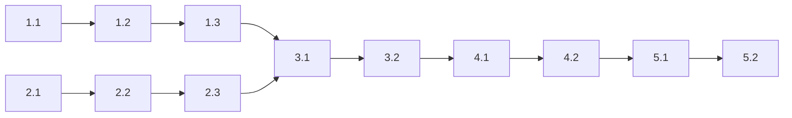

# Implementation Plan

## Tasks

- [ ] 1. 確率過程モジュール (stochastic/) の構築
- [ ] 1.1 (P) stochastic モジュールの基盤を作成
  - 確率過程専用のモジュールエントリーポイントを設定する
  - StochasticModel trait と状態型の公開構成を定義する
  - モジュールレベルドキュメントを追加する
  - _Requirements: 1.1, 4.2, 6.3_

- [ ] 1.2 既存の確率過程モデルを移動
  - GBM, Heston, Hull-White, CIR, Correlated の各モデルを新モジュールに移動する
  - 内部参照パスを更新する
  - stochastic.rs と validation.rs を適切に配置する
  - _Requirements: 1.1, 4.2_

- [ ] 1.3 model_enum から SABR variant を除去
  - 静的ディスパッチ enum から未使用の SABR variant を削除する
  - 関連する match 分岐を整理する
  - feature flag との整合性を確認する
  - _Requirements: 1.3, 3.1_

- [ ] 2. 閉形式公式モジュール (formulas/) の構築
- [ ] 2.1 (P) formulas モジュールの基盤を作成
  - 閉形式解析公式専用のモジュールエントリーポイントを設定する
  - BlackScholes, Bachelier, GarmanKohlhagen の公開構成を定義する
  - モジュールレベルドキュメントを追加する
  - _Requirements: 1.2, 4.2, 6.3_

- [ ] 2.2 既存の閉形式公式を移動
  - Black-Scholes, Bachelier, Garman-Kohlhagen の各ファイルを新モジュールに移動する
  - error.rs を formulas/ に配置する
  - 内部参照パスを更新する
  - _Requirements: 1.2, 4.2_

- [ ] 2.3 SABR Hagan 公式を独立モジュールとして抽出
  - 既存 sabr.rs から Hagan 公式部分のみを抽出する
  - SabrParams, SabrImpliedVol, SabrError の各型を定義する
  - atm_vol() と implied_vol() のインターフェースを実装する
  - StochasticModel 実装は含めない
  - 既存テストを移行する
  - _Requirements: 1.3, 3.2, 3.3, 3.4_

- [ ] 3. 参照と依存関係の更新
- [ ] 3.1 distributions 参照を pricer_core に統一
  - formulas/ 内の各ファイルで pricer_core::math::distributions を直接参照する
  - distributions.rs ファイルを削除する
  - _Requirements: 2.1, 2.2, 4.3_

- [ ] 3.2 market モジュールの SABR 参照を更新
  - volcube が新しい SabrImpliedVol を参照するよう変更する
  - calibration/sabr が新しいモジュールを参照するよう変更する
  - インポートパスの一貫性を確認する
  - _Requirements: 1.3, 4.3_

- [ ] 4. 後方互換性と旧モジュール整理
- [ ] 4.1 deprecated re-export を追加
  - lib.rs に models → stochastic の deprecated 再エクスポートを追加する
  - lib.rs に analytical → formulas の deprecated 再エクスポートを追加する
  - SABRParams, SABRModel, SABRError の互換エイリアスを追加する
  - distributions の deprecated 再エクスポートを追加する
  - バージョン番号を確定する
  - _Requirements: 5.1, 5.2, 5.3, 5.4_

- [ ] 4.2 旧モジュールディレクトリを削除
  - models/ ディレクトリを削除する
  - analytical/ ディレクトリを削除する
  - 残存参照がないことを確認する
  - _Requirements: 1.1, 1.2_

- [ ] 5. 検証とドキュメント整備
- [ ] 5.1 全テストの実行と検証
  - cargo test --all-features を実行しすべてのテストが通過することを確認する
  - cargo clippy --all-features で警告がないことを確認する
  - deprecated 警告が適切に発生することを確認する
  - _Requirements: 6.1_

- [ ] 5.2 ドキュメントの更新と確認
  - cargo doc でドキュメントリンクが正常であることを確認する
  - モジュールドキュメントの整合性を確認する
  - _Requirements: 6.2, 6.3_

---

## Requirements Coverage

| Requirement | Tasks |
|-------------|-------|
| 1.1 | 1.1, 1.2, 4.2 |
| 1.2 | 2.1, 2.2, 4.2 |
| 1.3 | 1.3, 2.3, 3.2 |
| 1.4 | (pricer_core 変更なし) |
| 2.1 | 3.1 |
| 2.2 | 3.1 |
| 2.3 | (pricer_core 変更なし) |
| 3.1 | 1.3 (※設計決定により SABR SDE は未使用のため削除) |
| 3.2 | 2.3 |
| 3.3 | 2.3, 4.1 |
| 3.4 | 2.3 |
| 4.1 | (pricer_core 変更なし) |
| 4.2 | 1.1, 1.2, 2.1, 2.2 |
| 4.3 | 3.1, 3.2 |
| 4.4 | 2.1, 2.2 |
| 5.1 | 4.1 |
| 5.2 | 4.1 |
| 5.3 | 4.1 |
| 5.4 | 4.1 |
| 6.1 | 5.1 |
| 6.2 | 5.2 |
| 6.3 | 1.1, 2.1, 5.2 |

---

## Task Dependencies

**並列実行可能**:
- 1.1 (P) と 2.1 (P) は同時実行可能（異なるディレクトリ、ファイル競合なし）

**順次実行必須**:
- タスク 3 以降は タスク 1, 2 の完了に依存
- タスク 4 は タスク 3 の完了に依存
- タスク 5 は タスク 4 の完了に依存

---

## Notes

- **Requirement 3.1 の変更**: requirements.md では「SABRModel（MC用）を提供する」とあるが、research.md の調査結果により SABR SDE 実装は外部から使用されていないことが判明。設計決定により削除とした。
- **バージョン番号**: deprecated 属性の `since` フィールドはタスク 4.1 実行時に確定する。
