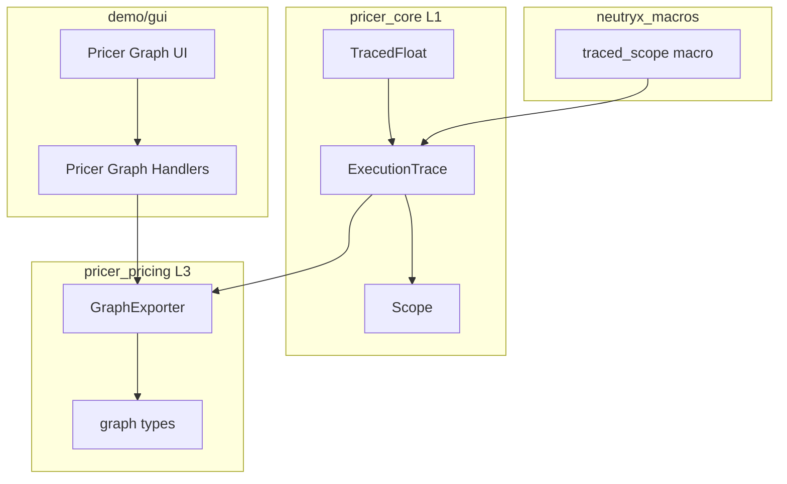
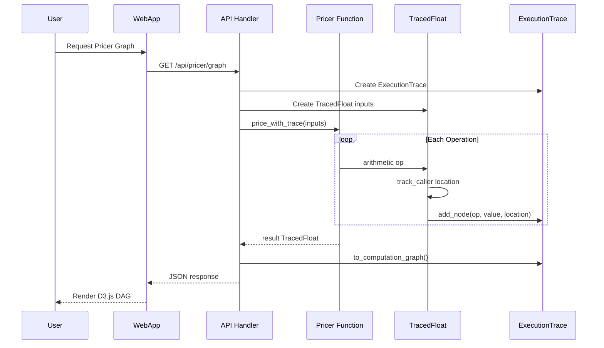
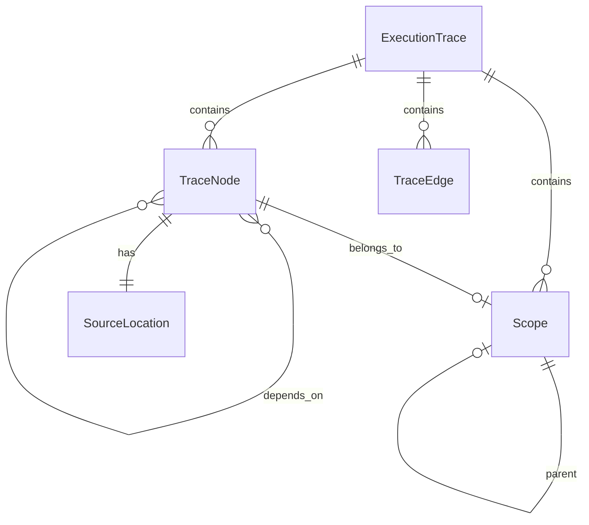

# Technical Design: Pricer Computation Graph

## Overview

**Purpose**: PV計算時の計算グラフを自動取得・可視化し、デバッグと検証を効率化する。

**Users**: クオンツ開発者、リスク管理者、トレーダーがPricer Graphページで計算フローを確認し、ソースコード位置へのジャンプやスコープ単位の折り畳み表示を利用する。

**Impact**: 既存の`pricer_pricing::graph`モジュールを拡張し、WebAppの「Instrument Graph」を「Pricer Graph」に改名。TracedFloat型により既存の価格計算関数を変更せずにグラフ取得を実現。

### Goals
- TracedFloat型による計算グラフの自動取得（既存コード変更なし）
- `#[track_caller]`によるソースコード位置の自動マッピング
- `#[traced_scope]`属性マクロによる関数境界での自動スコープ生成
- Operation/Scopeレベルの詳細度切り替え
- D3.js互換のREST APIエンドポイント

### Non-Goals
- Enzymeの静的グラフ解析（技術的負債リスク大のため却下）
- マルチスレッド共有グラフの自動構築（明示的なArc版で対応）
- リアルタイムWebSocket更新（将来拡張）

## Architecture

### Existing Architecture Analysis

- **既存graph型**: `pricer_pricing::graph`に`GraphNode`, `GraphEdge`, `ComputationGraph`が存在
- **既存パターン**: `num_traits::Float`ジェネリクスによるAD互換設計
- **依存関係**: A-I-P-S単方向フロー（L1 → L2 → L3 → L4）
- **WebApp**: `demo/gui`の「Instrument Graph」ページが存在

### Architecture Pattern & Boundary Map



**Architecture Integration**:
- **Selected pattern**: Wrapper Type（TracedFloat）による透過的トレース
- **Domain boundaries**: L1でTracedFloat定義、L3でグラフエクスポート、Demoで表示
- **Existing patterns preserved**: `T: Float`ジェネリクス、D3.js互換JSON
- **New components rationale**: TracedFloatは数値型としてL1に配置、proc-macroは独立クレート
- **Steering compliance**: A-I-P-S依存ルール遵守、feature flagによる分離

### Technology Stack

| Layer | Choice / Version | Role in Feature | Notes |
|-------|------------------|-----------------|-------|
| Core Types | `pricer_core` + `num-traits 0.2` | TracedFloat型、Float実装 | feature: `execution-trace` |
| Macros | `neutryx_macros` + `syn 2.0`, `quote 1.0` | `#[traced_scope]`属性マクロ | 新規クレート |
| Graph Types | `pricer_pricing::graph` | GraphNode/Edge/ComputationGraph拡張 | 既存拡張 |
| Web API | `axum 0.7` | REST API `/api/pricer/graph` | 既存拡張 |
| Frontend | D3.js | DAGグラフ描画 | 既存拡張 |

## System Flows

### 計算グラフ取得フロー



**Key Decisions**:
- TracedFloatは演算ごとに`#[track_caller]`でソース位置を取得
- ExecutionTraceはノードとエッジをベクターに蓄積
- エクスポート時にComputationGraph形式に変換

## Requirements Traceability

| Requirement | Summary | Components | Interfaces | Flows |
|-------------|---------|------------|------------|-------|
| 1.1-1.6 | TracedFloat型によるグラフ取得 | TracedFloat, ExecutionTrace | Float trait | 計算グラフ取得フロー |
| 2.1-2.5 | ソースコード位置マッピング | TracedFloat, TraceNode | SourceLocation | 計算グラフ取得フロー |
| 3.1-3.8 | `#[traced_scope]`マクロ | traced_scope, Scope | - | スコープ管理 |
| 4.1-4.5 | 詳細度切り替え | GraphExporter | DetailLevel | APIレスポンス |
| 5.1-5.7 | WebApp UI | PricerGraphHandler | REST API | 全体 |
| 6.1-6.4 | REST APIエンドポイント | pricer_graph_handlers | PricerGraphRequest/Response | 計算グラフ取得フロー |
| 7.1-7.6 | 既存構造維持 | 全コンポーネント | feature flag | - |

## Components and Interfaces

| Component | Domain/Layer | Intent | Req Coverage | Key Dependencies | Contracts |
|-----------|--------------|--------|--------------|------------------|-----------|
| TracedFloat | pricer_core/L1 | 演算トレース付き浮動小数点型 | 1, 2 | num-traits (P0) | Service |
| ExecutionTrace | pricer_core/L1 | グラフノード/エッジ蓄積 | 1, 3 | - | State |
| Scope | pricer_core/L1 | スコープ階層管理 | 3 | - | State |
| traced_scope | neutryx_macros | 関数境界スコープ生成 | 3 | syn, quote (P0) | - |
| GraphExporter | pricer_pricing/L3 | ComputationGraph変換 | 4, 7 | graph types (P0) | Service |
| PricerGraphHandler | demo/gui | REST APIハンドラ | 5, 6 | axum (P0) | API |

### pricer_core Layer

#### TracedFloat

| Field | Detail |
|-------|--------|
| Intent | `num_traits::Float`を実装し、全演算でグラフノードを自動生成 |
| Requirements | 1.1, 1.2, 1.3, 1.4, 2.1, 2.2 |

**Responsibilities & Constraints**
- `f64`値のラップと全Float演算の委譲
- 各演算で`#[track_caller]`によりソース位置を取得
- ExecutionTraceへのノード追加とエッジ生成
- 入力ノードへのラベル付与機能

**Dependencies**
- Outbound: ExecutionTrace — ノード/エッジ登録 (P0)
- External: num-traits — Float trait (P0)

**Contracts**: Service [x] / State [x]

##### Service Interface

```rust
/// TracedFloat - 計算グラフを自動構築する浮動小数点型
pub struct TracedFloat {
    value: f64,
    node_id: NodeId,
    trace: Rc<RefCell<ExecutionTrace>>,
}

impl TracedFloat {
    /// ラベル付き入力値を作成
    pub fn input(value: f64, label: &str, trace: &Rc<RefCell<ExecutionTrace>>) -> Self;

    /// 値を取得
    pub fn value(&self) -> f64;

    /// ノードIDを取得
    pub fn node_id(&self) -> NodeId;
}

impl Float for TracedFloat {
    // 全Floatメソッドを実装（約75メソッド）
    // 各演算メソッドに #[track_caller] を付与
}

impl Add for TracedFloat { /* ... */ }
impl Sub for TracedFloat { /* ... */ }
impl Mul for TracedFloat { /* ... */ }
impl Div for TracedFloat { /* ... */ }
// 他の演算子も同様
```

##### State Management
- `Rc<RefCell<ExecutionTrace>>`で内部状態を共有
- シングルスレッド前提（マルチスレッドは`TracedFloatSync`を別途提供）
- ノードIDはExecutionTrace内でインクリメンタルに生成

---

#### ExecutionTrace

| Field | Detail |
|-------|--------|
| Intent | 計算グラフのノードとエッジを蓄積し、ComputationGraphへ変換 |
| Requirements | 1.3, 1.5, 2.3, 3.2, 3.3, 3.6 |

**Responsibilities & Constraints**
- ノードとエッジのベクター管理
- スコープスタックによる階層管理
- ComputationGraph形式へのエクスポート

**Dependencies**
- Inbound: TracedFloat — ノード追加 (P0)
- Inbound: traced_scope — スコープ開始/終了 (P1)

**Contracts**: State [x]

##### Service Interface

```rust
/// ExecutionTrace - 計算グラフの蓄積構造
pub struct ExecutionTrace {
    nodes: Vec<TraceNode>,
    edges: Vec<TraceEdge>,
    scopes: Vec<Scope>,
    scope_stack: Vec<ScopeId>,
    next_node_id: u64,
    next_scope_id: u64,
}

/// トレースノード
pub struct TraceNode {
    pub id: NodeId,
    pub operation: Operation,
    pub value: f64,
    pub source_location: SourceLocation,
    pub scope_id: Option<ScopeId>,
    pub input_ids: Vec<NodeId>,
    pub label: Option<String>,
}

/// ソースコード位置
pub struct SourceLocation {
    pub file: &'static str,
    pub line: u32,
    pub column: u32,
}

/// 演算タイプ
pub enum Operation {
    Input,
    Add,
    Sub,
    Mul,
    Div,
    Sqrt,
    Exp,
    Ln,
    Sin,
    Cos,
    // ... 他のFloat演算
}

impl ExecutionTrace {
    /// 新しいトレースを作成
    pub fn new() -> Self;

    /// ノードを追加
    pub fn add_node(
        &mut self,
        operation: Operation,
        value: f64,
        location: &'static Location<'static>,
        input_ids: Vec<NodeId>,
    ) -> NodeId;

    /// スコープを開始
    pub fn enter_scope(&mut self, name: &str) -> ScopeId;

    /// スコープを終了
    pub fn exit_scope(&mut self);

    /// ComputationGraphに変換
    pub fn to_computation_graph(&self) -> ComputationGraph;

    /// 詳細度を指定してComputationGraphに変換
    pub fn to_computation_graph_with_detail(&self, level: DetailLevel) -> ComputationGraph;
}
```

##### State Management
- ノードはベクターに追加順で格納（O(1)追加）
- スコープスタックで現在のスコープを追跡
- エクスポート時にスコープ集約処理を実行

---

#### Scope

| Field | Detail |
|-------|--------|
| Intent | 計算グラフの論理的な階層単位を表現 |
| Requirements | 3.3, 3.4, 3.6 |

**Contracts**: State [x]

```rust
/// スコープ定義
pub struct Scope {
    pub id: ScopeId,
    pub name: String,
    pub parent_id: Option<ScopeId>,
}

/// スコープID（ニュータイプ）
#[derive(Clone, Copy, PartialEq, Eq, Hash)]
pub struct ScopeId(u64);
```

---

### neutryx_macros Layer

#### traced_scope Macro

| Field | Detail |
|-------|--------|
| Intent | 関数境界で自動的にスコープを生成するproc macro |
| Requirements | 3.1, 3.2, 3.5, 3.8 |

**Responsibilities & Constraints**
- 関数本体をスコープ開始/終了でラップ
- 関数名をデフォルトスコープ名として使用
- feature flag無効時はno-op展開

**Dependencies**
- External: syn 2.0 — トークンパーシング (P0)
- External: quote 1.0 — コード生成 (P0)

**Contracts**: - (proc macro)

##### Macro Interface

```rust
/// #[traced_scope] 属性マクロ
///
/// # 基本使用
/// ```rust
/// #[traced_scope]
/// fn calculate_payoff<T: Float>(spot: T, strike: T) -> T {
///     // 関数名 "calculate_payoff" がスコープ名になる
///     smooth_max(spot - strike, T::zero(), T::from(1e-6).unwrap())
/// }
/// ```
///
/// # カスタム名
/// ```rust
/// #[traced_scope(name = "Payoff Calculation")]
/// fn calculate_payoff<T: Float>(spot: T, strike: T) -> T {
///     // ...
/// }
/// ```
#[proc_macro_attribute]
pub fn traced_scope(attr: TokenStream, item: TokenStream) -> TokenStream;
```

**Implementation Notes**
- feature `execution-trace` 無効時は入力をそのまま返す
- スコープ名はマクロ属性または関数名から取得
- `TRACE_CONTEXT`スレッドローカル変数を使用してスコープを管理

---

### pricer_pricing Layer

#### GraphExporter

| Field | Detail |
|-------|--------|
| Intent | ExecutionTraceをComputationGraph形式に変換 |
| Requirements | 4.1, 4.2, 4.3, 4.4, 7.5 |

**Responsibilities & Constraints**
- TraceNodeからGraphNodeへの変換
- DetailLevelに応じたスコープ集約
- 既存graph型との互換性維持

**Dependencies**
- Inbound: ExecutionTrace — トレースデータ (P0)
- Outbound: graph types — 出力型 (P0)

**Contracts**: Service [x]

##### Service Interface

```rust
/// 詳細度レベル
pub enum DetailLevel {
    /// 四則演算レベル（全ノード表示）
    Operation,
    /// スコープレベル（スコープを1ノードに集約）
    Scope,
}

/// グラフエクスポーター
pub struct GraphExporter;

impl GraphExporter {
    /// ExecutionTraceをComputationGraphに変換
    pub fn export(trace: &ExecutionTrace, level: DetailLevel) -> ComputationGraph;

    /// スコープ集約されたグラフを生成
    fn aggregate_scopes(trace: &ExecutionTrace) -> ComputationGraph;
}
```

---

### demo/gui Layer

#### PricerGraphHandler

| Field | Detail |
|-------|--------|
| Intent | REST APIでPricer Graphを提供 |
| Requirements | 5.1, 6.1, 6.2, 6.3, 6.4 |

**Responsibilities & Constraints**
- 計算パラメータの受け取りとバリデーション
- TracedFloatを使用した計算の実行
- ComputationGraphのJSON返却

**Dependencies**
- Outbound: TracedFloat — 計算実行 (P0)
- Outbound: GraphExporter — グラフ変換 (P0)
- External: axum — HTTPフレームワーク (P0)

**Contracts**: API [x]

##### API Contract

| Method | Endpoint | Request | Response | Errors |
|--------|----------|---------|----------|--------|
| POST | /api/pricer/graph | PricerGraphRequest | PricerGraphResponse | 400, 500 |

```rust
/// リクエスト型
#[derive(Deserialize)]
pub struct PricerGraphRequest {
    /// 計算パラメータ
    pub params: PricingParams,
    /// 詳細度レベル（デフォルト: Operation）
    #[serde(default)]
    pub detail_level: DetailLevel,
}

/// レスポンス型（D3.js互換）
#[derive(Serialize)]
pub struct PricerGraphResponse {
    /// ノード配列
    pub nodes: Vec<GraphNodeDto>,
    /// エッジ配列（D3.js互換のため "links" としてシリアライズ）
    #[serde(rename = "links")]
    pub edges: Vec<GraphEdgeDto>,
    /// スコープ配列
    pub scopes: Vec<ScopeDto>,
    /// メタデータ
    pub metadata: GraphMetadataDto,
}

/// ノードDTO（source_location, scope_id追加）
#[derive(Serialize)]
pub struct GraphNodeDto {
    pub id: String,
    #[serde(rename = "type")]
    pub node_type: String,
    pub label: String,
    pub value: Option<f64>,
    pub source_location: Option<SourceLocationDto>,
    pub scope_id: Option<String>,
}

/// ソース位置DTO
#[derive(Serialize)]
pub struct SourceLocationDto {
    pub file: String,
    pub line: u32,
    pub column: u32,
}

/// スコープDTO
#[derive(Serialize)]
pub struct ScopeDto {
    pub id: String,
    pub name: String,
    pub parent_id: Option<String>,
}
```

**Implementation Notes**
- 既存の`/api/graph`から`/api/pricer/graph`への移行
- レガシーエンドポイントは一時的にリダイレクト

## Data Models

### Domain Model



**Aggregates**:
- `ExecutionTrace`: トレースセッションのルート集約
- `TraceNode`: 個別計算ノード（不変）
- `Scope`: 論理グループ

**Invariants**:
- ノードIDは一意
- エッジのsource/targetは存在するノードを参照
- スコープのparent_idは存在するスコープを参照（またはnull）

### Data Contracts & Integration

**API Response Schema**:
```json
{
  "nodes": [
    {
      "id": "N1",
      "type": "input",
      "label": "spot",
      "value": 100.0,
      "source_location": { "file": "pricing.rs", "line": 45, "column": 12 },
      "scope_id": "S1"
    }
  ],
  "links": [
    { "source": "N1", "target": "N2" }
  ],
  "scopes": [
    { "id": "S1", "name": "calculate_payoff", "parent_id": null }
  ],
  "metadata": {
    "node_count": 150,
    "edge_count": 200,
    "depth": 12,
    "generated_at": "2026-01-26T12:00:00Z"
  }
}
```

## Error Handling

### Error Categories and Responses

**User Errors (4xx)**:
- 400: 不正なリクエストパラメータ（バリデーションエラー詳細を返却）

**System Errors (5xx)**:
- 500: 計算エラー、グラフ生成エラー

**Business Logic Errors (422)**:
- TracedFloat演算でのオーバーフロー/アンダーフロー → NaN/Infとしてノードに記録

### Monitoring
- グラフ生成時間のメトリクス（既存Prometheusエンドポイントに追加）
- ノード数/エッジ数のヒストグラム

## Testing Strategy

### Unit Tests
- TracedFloat: 全Float演算の正確性検証（f64との比較）
- ExecutionTrace: ノード追加、スコープ管理、エクスポート
- GraphExporter: DetailLevel別の変換テスト
- traced_scope: マクロ展開の正確性

### Integration Tests
- 既存価格計算関数にTracedFloatを渡してグラフ取得
- REST APIエンドツーエンドテスト
- WebApp UIからのグラフ表示テスト

### Performance Tests
- 10,000ノードのグラフ生成が1秒以内
- 通常f64計算に対するオーバーヘッド測定（目標: トレース時のみ影響）

## Optional Sections

### Performance & Scalability
- **Target**: 10,000ノードのグラフ生成 < 1秒
- **Scaling**: シングルスレッド前提、並列Portfolio計算では各スレッドが独立したトレース
- **Memory**: ノード1件あたり約200バイト、10,000ノードで約2MB

### Migration Strategy
1. **Phase 1**: TracedFloat型とExecutionTrace実装（feature flag: `execution-trace`）
2. **Phase 2**: `#[traced_scope]`マクロ実装
3. **Phase 3**: REST API `/api/pricer/graph` 追加
4. **Phase 4**: WebApp UI改名（Instrument Graph → Pricer Graph）
5. **Phase 5**: レガシーエンドポイント廃止（リダイレクト削除）
