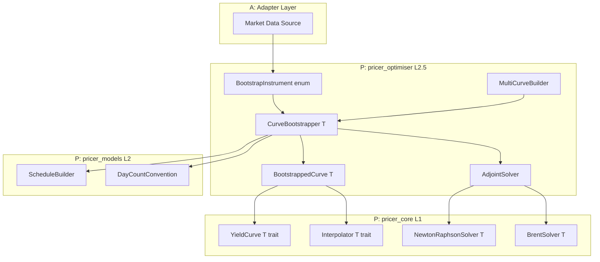
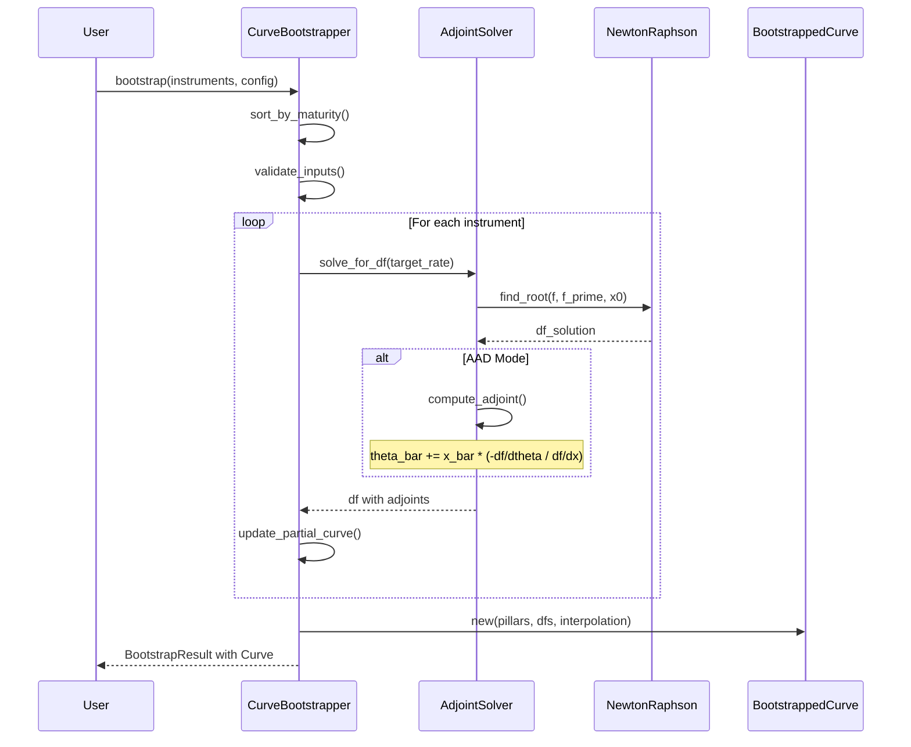
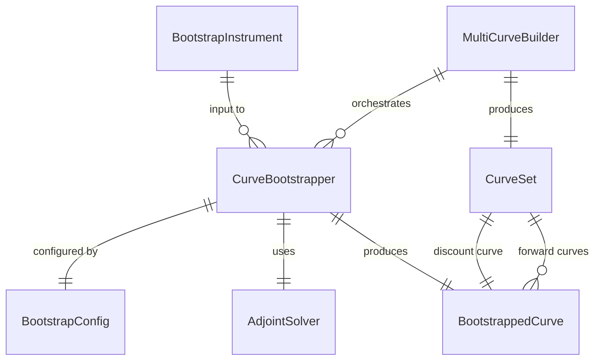

# Design Document: AAD Yield Curve Bootstrapper

## Overview

**Purpose**: 市場商品（OIS、IRS、FRA、先物）から割引カーブを構築し、AAD（随伴アルゴリズム微分）により入力レートに対するカーブ感応度を効率的に計算する機能を提供する。

**Users**: クオンツ開発者、リスク管理者、金利トレーダーが、カーブ構築とリスク計算のワークフローで使用する。

**Impact**: 既存の `pricer_optimiser::bootstrapping` モジュールを拡張し、ジェネリック型サポート、複数市場商品タイプ、AAD 対応を追加する。

### Goals

- 複数の市場商品タイプ（OIS、IRS、FRA、先物）からのカーブ構築
- 陰関数定理による効率的な AAD 感応度計算（O(1) コスト）
- マルチカーブ・フレームワーク（OIS 割引 + テナーカーブ）のサポート
- 既存 `YieldCurve<T>` トレイトとの完全互換性

### Non-Goals

- リアルタイム市場データフィードとの統合（Adapter 層の責務）
- GUI/可視化機能（Demo 層の責務）
- クレジットカーブのブートストラップ（別仕様で対応）

## Architecture

### Existing Architecture Analysis

既存システムの構造と統合ポイント:

- **pricer_core (L1)**: `YieldCurve<T>` トレイト、`InterpolatedCurve<T>`、Newton-Raphson/Brent ソルバー
- **pricer_optimiser (L2.5)**: `CurveBootstrapper`（f64 のみ）、`BootstrapConfig`、`BootstrapResult`
- **pricer_models (L2)**: `ScheduleBuilder` for IRS キャッシュフロー生成

現在の `CurveBootstrapper` は単純な逐次ストリッピングのみで、AAD 非対応、f64 固定。

### Architecture Pattern & Boundary Map



**Architecture Integration**:
- **Selected pattern**: Extension Pattern — 既存 `bootstrapping` モジュールを拡張
- **Domain boundaries**: `pricer_optimiser` 内でブートストラップロジックを完結
- **Existing patterns preserved**: 静的ディスパッチ（enum）、`T: Float` ジェネリック
- **New components rationale**: `AdjointSolver` で陰関数定理 AAD をカプセル化
- **Steering compliance**: A-I-P-S 依存ルール、British English 命名規則を遵守

### Technology Stack

| Layer | Choice / Version | Role in Feature | Notes |
|-------|------------------|-----------------|-------|
| Backend | Rust Edition 2021 | コア実装 | `pricer_optimiser` クレート |
| Numeric | `num-traits`, `num-dual` | ジェネリック数値型、Forward-mode AD | `T: Float` 境界 |
| AD Backend | Enzyme LLVM plugin | Reverse-mode AAD | `enzyme-mode` フィーチャー |
| Date/Time | `chrono` | 日付計算、営業日調整 | `infra_master` 経由 |
| Error Handling | `thiserror` | 構造化エラー型 | `BootstrapError` |

## System Flows

### ブートストラップ処理フロー



**Key Decisions**:
- 逐次ブートストラップ（短期→長期）により各ポイントを順次解決
- AAD モードでは陰関数定理により反復を記録せず最終関係のみ保持
- Newton-Raphson 失敗時は Brent 法にフォールバック

## Requirements Traceability

| Requirement | Summary | Components | Interfaces | Flows |
|-------------|---------|------------|------------|-------|
| 1.1-1.6 | 市場商品入力 | BootstrapInstrument | BootstrapInstrument enum | bootstrap() |
| 2.1-2.6 | カーブ構築アルゴリズム | CurveBootstrapper | bootstrap(), BootstrapConfig | ブートストラップ処理 |
| 3.1-3.8 | AAD サポート | AdjointSolver | solve_with_adjoint() | AAD 逆伝播 |
| 4.1-4.6 | 補間方式 | BootstrappedCurve | InterpolationMethod enum | discount_factor() |
| 5.1-5.5 | マルチカーブ | MultiCurveBuilder | build_multi_curve() | マルチカーブ構築 |
| 6.1-6.5 | 日付計算 | DateCalculator | adjust_date(), year_fraction() | 日付処理 |
| 7.1-7.6 | エラー処理 | BootstrapError | Error enum | エラーハンドリング |
| 8.1-8.5 | パフォーマンス | CurveBootstrapper | parallel_bootstrap() | 並列処理 |
| 9.1-9.5 | 既存統合 | BootstrappedCurve | YieldCurve impl | カーブ使用 |

## Components and Interfaces

### Summary

| Component | Domain/Layer | Intent | Req Coverage | Key Dependencies | Contracts |
|-----------|--------------|--------|--------------|------------------|-----------|
| BootstrapInstrument | L2.5/Input | 市場商品の統一表現 | 1.1-1.6 | None | Service |
| CurveBootstrapper | L2.5/Core | ブートストラップ実行エンジン | 2.1-2.6, 8.1-8.5 | AdjointSolver (P0), ScheduleBuilder (P1) | Service |
| AdjointSolver | L2.5/AAD | 陰関数定理 AAD ソルバー | 3.1-3.8 | NewtonRaphsonSolver (P0), BrentSolver (P1) | Service |
| BootstrappedCurve | L2.5/Output | ブートストラップ結果カーブ | 4.1-4.6, 9.1-9.5 | Interpolator (P0) | Service, State |
| MultiCurveBuilder | L2.5/Multi | マルチカーブ構築 | 5.1-5.5 | CurveBootstrapper (P0) | Service |
| BootstrapConfig | L2.5/Config | 設定パラメータ | 2.6 | None | State |
| BootstrapError | L2.5/Error | エラー型定義 | 7.1-7.6 | None | Service |

### L2.5 Bootstrapping Domain

#### BootstrapInstrument

| Field | Detail |
|-------|--------|
| Intent | 市場商品（OIS、IRS、FRA、先物）を統一的に表現する enum |
| Requirements | 1.1, 1.2, 1.3, 1.4 |

**Responsibilities & Constraints**
- 各商品タイプのレートと満期を保持
- 商品タイプごとのキャッシュフロー計算ロジックを提供
- 静的ディスパッチ（Enzyme 最適化）を維持

**Dependencies**
- Outbound: `pricer_models::schedules::ScheduleBuilder` — IRS キャッシュフロー生成 (P1)
- Outbound: `infra_master::calendars::Calendar` — 営業日調整 (P1)

**Contracts**: Service [x]

##### Service Interface

```rust
/// 市場商品を表す enum（静的ディスパッチ用）
#[derive(Debug, Clone)]
pub enum BootstrapInstrument<T: Float> {
    /// Overnight Index Swap
    Ois {
        maturity: T,
        rate: T,
        payment_frequency: Frequency,
    },
    /// Interest Rate Swap
    Irs {
        maturity: T,
        rate: T,
        fixed_frequency: Frequency,
        float_frequency: Frequency,
    },
    /// Forward Rate Agreement
    Fra {
        start: T,
        end: T,
        rate: T,
    },
    /// Interest Rate Future
    Future {
        maturity: T,
        price: T,
        convexity_adjustment: T,
    },
}

impl<T: Float> BootstrapInstrument<T> {
    /// 商品の満期を取得
    fn maturity(&self) -> T;

    /// 商品のレートを取得
    fn rate(&self) -> T;

    /// 残差関数: f(df) = implied_rate(df) - market_rate
    fn residual<C: YieldCurve<T>>(&self, df: T, curve: &C) -> T;

    /// 残差関数の df に対する導関数
    fn residual_derivative<C: YieldCurve<T>>(&self, df: T, curve: &C) -> T;
}
```

- Preconditions: `maturity > 0`, `rate` は有効な数値
- Postconditions: `residual()` は解で 0 を返す
- Invariants: 商品パラメータは不変

#### CurveBootstrapper

| Field | Detail |
|-------|--------|
| Intent | 市場商品からイールドカーブをブートストラップするエンジン |
| Requirements | 2.1, 2.2, 2.3, 2.4, 2.5, 2.6, 8.1, 8.2, 8.3, 8.4, 8.5 |

**Responsibilities & Constraints**
- 商品を満期順にソートして逐次ブートストラップ
- Newton-Raphson 優先、失敗時 Brent フォールバック
- 入力レートの 1bp 以内の再現精度を保証

**Dependencies**
- Inbound: `BootstrapInstrument<T>` — 入力商品 (P0)
- Outbound: `AdjointSolver<T>` — 求根計算 (P0)
- Outbound: `ScheduleBuilder` — スケジュール生成 (P1)

**Contracts**: Service [x]

##### Service Interface

```rust
/// カーブブートストラッパー
pub struct CurveBootstrapper<T: Float> {
    config: BootstrapConfig<T>,
}

impl<T: Float> CurveBootstrapper<T> {
    /// 新規作成
    pub fn new(config: BootstrapConfig<T>) -> Self;

    /// デフォルト設定で作成
    pub fn with_defaults() -> Self;

    /// カーブをブートストラップ
    pub fn bootstrap(
        &self,
        instruments: &[BootstrapInstrument<T>],
    ) -> Result<BootstrapResult<T>, BootstrapError>;

    /// AAD モードでブートストラップ（感応度付き）
    #[cfg(feature = "num-dual-mode")]
    pub fn bootstrap_with_sensitivities(
        &self,
        instruments: &[BootstrapInstrument<f64>],
    ) -> Result<BootstrapResultWithSensitivities, BootstrapError>;

    /// 並列ブートストラップ（複数カーブ）
    pub fn parallel_bootstrap(
        &self,
        instrument_sets: &[Vec<BootstrapInstrument<T>>],
    ) -> Result<Vec<BootstrapResult<T>>, BootstrapError>;
}
```

- Preconditions: `instruments` が空でない、満期重複なし
- Postconditions: 構築カーブが入力レートを 1bp 以内で再現
- Invariants: config は変更不可

#### AdjointSolver

| Field | Detail |
|-------|--------|
| Intent | 陰関数定理を用いた AAD 対応求根ソルバー |
| Requirements | 3.1, 3.2, 3.3, 3.4, 3.5, 3.6, 3.7, 3.8 |

**Responsibilities & Constraints**
- Newton-Raphson/Brent で求根
- ソルバー反復をテープに記録しない
- 陰関数定理で最終結果から勾配計算

**Dependencies**
- Outbound: `pricer_core::math::solvers::NewtonRaphsonSolver<T>` — 求根 (P0)
- Outbound: `pricer_core::math::solvers::BrentSolver<T>` — フォールバック (P1)

**Contracts**: Service [x]

##### Service Interface

```rust
/// 陰関数定理 AAD ソルバー
pub struct AdjointSolver<T: Float> {
    newton: NewtonRaphsonSolver<T>,
    brent: BrentSolver<T>,
    config: SolverConfig<T>,
}

/// 求根結果（アジョイント情報付き）
pub struct SolveResult<T: Float> {
    /// 解
    pub solution: T,
    /// 入力パラメータに対する感応度 (df/dtheta / df/dx)
    pub adjoint_factor: Option<T>,
    /// 使用したソルバー
    pub solver_used: SolverType,
    /// 反復回数
    pub iterations: usize,
}

impl<T: Float> AdjointSolver<T> {
    /// 新規作成
    pub fn new(config: SolverConfig<T>) -> Self;

    /// f(x, theta) = 0 を x について解く
    pub fn solve<F, G>(
        &self,
        f: F,
        f_prime: G,
        x0: T,
    ) -> Result<SolveResult<T>, SolverError>
    where
        F: Fn(T) -> T,
        G: Fn(T) -> T;

    /// AAD モードで解く（陰関数定理適用）
    #[cfg(feature = "num-dual-mode")]
    pub fn solve_with_adjoint<F>(
        &self,
        f: F,
        x0: f64,
        theta: &[f64],
    ) -> Result<SolveResultWithAdjoint, SolverError>
    where
        F: Fn(Dual64, &[Dual64]) -> Dual64;
}

/// AAD 結果
pub struct SolveResultWithAdjoint {
    pub solution: f64,
    /// theta[i] に対する x の感応度
    pub sensitivities: Vec<f64>,
}
```

- Preconditions: 初期推定が適切、関数が微分可能
- Postconditions: |f(solution)| < tolerance
- Invariants: 反復がテープに記録されない

**Implementation Notes**
- Integration: Newton-Raphson 失敗時は自動的に Brent にフォールバック
- Validation: 収束判定後に residual を検証
- Risks: 導関数が 0 に近い場合の数値不安定性

#### BootstrappedCurve

| Field | Detail |
|-------|--------|
| Intent | ブートストラップ結果を保持し YieldCurve トレイトを実装 |
| Requirements | 4.1, 4.2, 4.3, 4.4, 4.5, 4.6, 9.1, 9.4, 9.5 |

**Responsibilities & Constraints**
- ピラーポイントとディスカウント・ファクターを保持
- 複数補間方式をサポート
- `YieldCurve<T>` トレイトを実装

**Dependencies**
- Outbound: `pricer_core::math::interpolators::*` — 補間計算 (P0)

**Contracts**: Service [x] / State [x]

##### Service Interface

```rust
/// ブートストラップ補間方式
#[derive(Debug, Clone, Copy, PartialEq, Eq)]
pub enum BootstrapInterpolation {
    /// ログ線形（デフォルト）
    LogLinear,
    /// 線形（ゼロレート）
    LinearZeroRate,
    /// 三次スプライン
    CubicSpline,
    /// モノトニック・キュービック
    MonotonicCubic,
    /// フラット・フォワード
    FlatForward,
}

/// ブートストラップ結果カーブ
#[derive(Debug, Clone)]
pub struct BootstrappedCurve<T: Float> {
    pillars: Vec<T>,
    discount_factors: Vec<T>,
    interpolation: BootstrapInterpolation,
}

impl<T: Float> BootstrappedCurve<T> {
    /// 新規作成
    pub fn new(
        pillars: Vec<T>,
        discount_factors: Vec<T>,
        interpolation: BootstrapInterpolation,
    ) -> Result<Self, BootstrapError>;

    /// ピラーポイントを取得
    pub fn pillars(&self) -> &[T];

    /// ディスカウント・ファクターを取得
    pub fn discount_factors(&self) -> &[T];

    /// 補間方式を取得
    pub fn interpolation(&self) -> BootstrapInterpolation;
}

impl<T: Float> YieldCurve<T> for BootstrappedCurve<T> {
    fn discount_factor(&self, t: T) -> Result<T, MarketDataError>;
    fn zero_rate(&self, t: T) -> Result<T, MarketDataError>;
    fn forward_rate(&self, t1: T, t2: T) -> Result<T, MarketDataError>;
}
```

##### State Management

- State model: イミュータブル構造体（作成後は変更不可）
- Persistence: メモリ内のみ（永続化は上位層の責務）
- Concurrency: `Clone` による値コピーで並列アクセス安全

#### MultiCurveBuilder

| Field | Detail |
|-------|--------|
| Intent | OIS 割引 + テナーカーブのマルチカーブ構築 |
| Requirements | 5.1, 5.2, 5.3, 5.4, 5.5 |

**Responsibilities & Constraints**
- OIS 割引カーブを先に構築
- テナーカーブ構築時に割引カーブを参照
- 依存関係の正しい順序を保証

**Dependencies**
- Outbound: `CurveBootstrapper<T>` — 個別カーブ構築 (P0)

**Contracts**: Service [x]

##### Service Interface

```rust
/// マルチカーブセット
pub struct CurveSet<T: Float> {
    /// OIS 割引カーブ
    pub discount_curve: BootstrappedCurve<T>,
    /// テナー別フォワードカーブ
    pub forward_curves: HashMap<Tenor, BootstrappedCurve<T>>,
}

/// テナー定義
#[derive(Debug, Clone, Copy, PartialEq, Eq, Hash)]
pub enum Tenor {
    Overnight,
    OneMonth,
    ThreeMonth,
    SixMonth,
    TwelveMonth,
}

/// マルチカーブビルダー
pub struct MultiCurveBuilder<T: Float> {
    bootstrapper: CurveBootstrapper<T>,
}

impl<T: Float> MultiCurveBuilder<T> {
    /// 新規作成
    pub fn new(config: BootstrapConfig<T>) -> Self;

    /// マルチカーブセットを構築
    pub fn build(
        &self,
        discount_instruments: &[BootstrapInstrument<T>],
        forward_instruments: &[(Tenor, Vec<BootstrapInstrument<T>>)],
    ) -> Result<CurveSet<T>, BootstrapError>;

    /// 単一カーブモード（割引カーブ未指定時）
    pub fn build_single_curve(
        &self,
        instruments: &[BootstrapInstrument<T>],
    ) -> Result<BootstrappedCurve<T>, BootstrapError>;
}
```

#### BootstrapConfig

| Field | Detail |
|-------|--------|
| Intent | ブートストラップ設定パラメータ |
| Requirements | 2.6 |

**Contracts**: State [x]

```rust
/// ブートストラップ設定
#[derive(Debug, Clone)]
pub struct BootstrapConfig<T: Float> {
    /// 収束許容誤差（デフォルト: 1e-12）
    pub tolerance: T,
    /// 最大反復回数（デフォルト: 100）
    pub max_iterations: usize,
    /// 補間方式（デフォルト: LogLinear）
    pub interpolation: BootstrapInterpolation,
    /// 外挿許可（デフォルト: true）
    pub allow_extrapolation: bool,
    /// 負レート許可（デフォルト: false）
    pub allow_negative_rates: bool,
}

impl<T: Float> Default for BootstrapConfig<T> {
    fn default() -> Self {
        Self {
            tolerance: T::from(1e-12).unwrap(),
            max_iterations: 100,
            interpolation: BootstrapInterpolation::LogLinear,
            allow_extrapolation: true,
            allow_negative_rates: false,
        }
    }
}
```

#### BootstrapError

| Field | Detail |
|-------|--------|
| Intent | ブートストラップ固有のエラー型 |
| Requirements | 7.1, 7.2, 7.3, 7.4, 7.5, 7.6 |

**Contracts**: Service [x]

```rust
/// ブートストラップエラー
#[derive(Error, Debug)]
pub enum BootstrapError {
    /// 収束失敗
    #[error("Failed to converge at maturity {maturity}: residual = {residual}")]
    ConvergenceFailure {
        maturity: f64,
        residual: f64,
        iterations: usize,
    },

    /// 満期重複
    #[error("Duplicate maturity detected: {maturity}")]
    DuplicateMaturity { maturity: f64 },

    /// 入力データ不足
    #[error("Insufficient instruments: need at least {required}, got {provided}")]
    InsufficientData { required: usize, provided: usize },

    /// 負レート検出
    #[error("Negative rate detected at maturity {maturity}: rate = {rate}")]
    NegativeRate { maturity: f64, rate: f64 },

    /// アービトラージ検出
    #[error("Arbitrage detected: discount factor not monotonically decreasing at {maturity}")]
    ArbitrageDetected { maturity: f64 },

    /// ソルバーエラー
    #[error("Solver error: {0}")]
    SolverError(#[from] SolverError),

    /// 市場データエラー
    #[error("Market data error: {0}")]
    MarketDataError(#[from] MarketDataError),
}
```

## Data Models

### Domain Model



**Aggregates**:
- `CurveSet`: マルチカーブ構築の集約ルート
- `BootstrappedCurve`: 単一カーブの集約ルート

**Business Rules**:
- ディスカウント・ファクターは単調減少
- ピラーポイントは昇順ソート済み
- 満期重複は許可されない

### Logical Data Model

**BootstrappedCurve Structure**:
- `pillars: Vec<T>` — 満期点（年）、昇順
- `discount_factors: Vec<T>` — 対応するディスカウント・ファクター
- `interpolation: BootstrapInterpolation` — 補間方式

**Invariants**:
- `pillars.len() == discount_factors.len()`
- `pillars` は厳密に昇順
- `discount_factors[0] <= 1.0`（t > 0 の場合）
- `discount_factors[i] >= discount_factors[i+1]`（アービトラージ・フリー）

## Error Handling

### Error Strategy

1. **早期検証**: 入力データの妥当性を構築前に検証
2. **グレースフル・デグラデーション**: Newton-Raphson 失敗時に Brent へフォールバック
3. **詳細エラー情報**: 失敗ポイントの満期と残差を報告

### Error Categories and Responses

**Input Errors** (BootstrapError):
- `DuplicateMaturity` → 重複ポイントを削除または置換
- `InsufficientData` → 必要な最小商品数を報告
- `NegativeRate` → 警告付きで処理継続オプション

**Calculation Errors**:
- `ConvergenceFailure` → 収束失敗点と残差を報告、部分カーブ返却オプション
- `ArbitrageDetected` → アービトラージ条件違反を報告

**System Errors**:
- `SolverError` → 下位ソルバーエラーを伝播
- `MarketDataError` → 市場データ構造エラーを伝播

### Monitoring

- ブートストラップ処理時間のログ出力
- 各ピラーでの反復回数と残差の記録
- 警告レベルでの負レート検出通知

## Testing Strategy

### Unit Tests

- `BootstrapInstrument::residual()` — 各商品タイプの残差計算
- `AdjointSolver::solve()` — 陰関数定理による勾配計算精度
- `BootstrappedCurve::discount_factor()` — 各補間方式の精度
- `BootstrapConfig::default()` — デフォルト値の検証

### Integration Tests

- `CurveBootstrapper::bootstrap()` — 完全なブートストラップフロー
- `MultiCurveBuilder::build()` — マルチカーブ構築フロー
- Bump-and-Revalue vs AAD 感応度の比較検証
- 入力レート再現精度テスト（1bp 以内）

### Performance Tests

- 100 ポイントカーブの構築時間（< 10ms 目標）
- AAD 感応度計算のスケーラビリティ
- 並列ブートストラップのスループット

## Performance & Scalability

### Target Metrics

- **単一カーブ構築**: 100 ポイントで 10ms 以内
- **AAD 感応度**: 入力数に対し O(1) コスト
- **メモリ使用量**: AAD 計算時に動的アロケーション最小化

### Optimization Techniques

- 静的ディスパッチ（enum）による仮想関数呼び出し排除
- 事前アロケートされたバッファでの中間結果保持
- Rayon による複数カーブの並列構築
