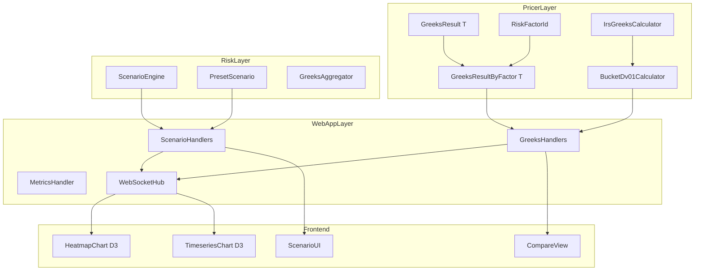
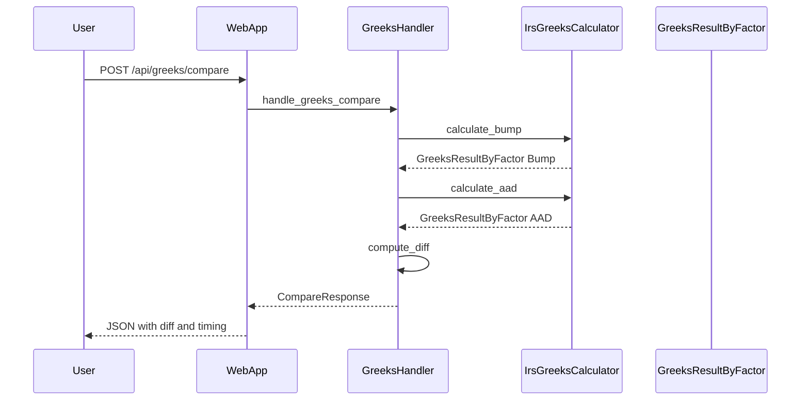
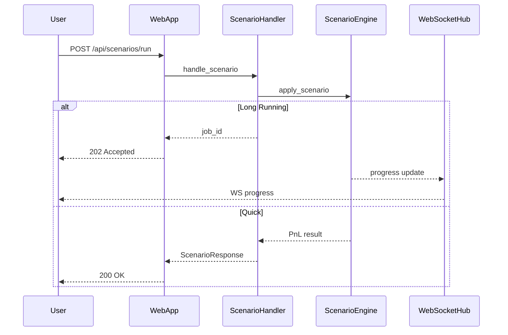
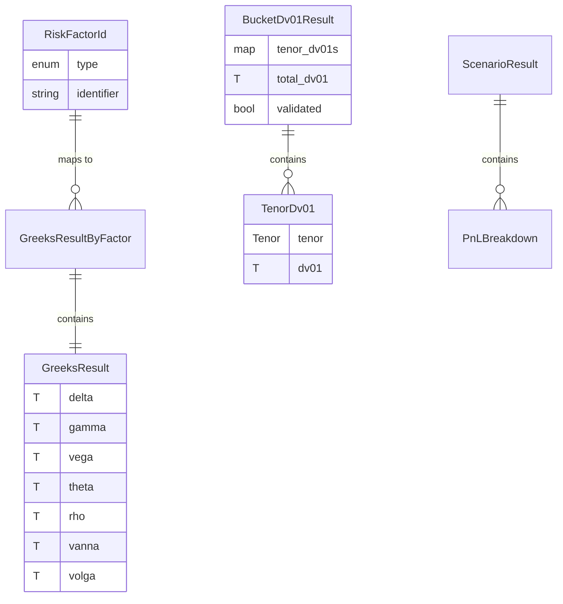

# Technical Design Document

## Overview

**Purpose**: 本機能は、Neutryx デリバティブ価格計算ライブラリにおける Sensitivity（Greeks）計算の精度向上と WebApp（FrictionalBank）の機能拡張を提供する。

**Users**: クオンツアナリスト、リスクマネージャー、トレーダー、DevOps エンジニアが、リスクファクター毎の Greeks 計算、バケット DV01、インタラクティブなシナリオ分析、Bump vs AAD 比較可視化を利用する。

**Impact**: 既存の `GreeksResult<T>` および `IrsGreeksCalculator` を拡張し、WebApp に新規可視化エンドポイントと監視機能を追加する。

### Goals

- リスクファクター毎の一次・二次 Greeks 計算と集計
- バケット DV01 および Key Rate Duration の計算
- Bump vs AAD 比較結果のインタラクティブ可視化
- Greeks ヒートマップ・時系列チャートの提供
- シナリオ分析 UI とプリセットシナリオ連携
- Prometheus 形式メトリクスによる運用監視

### Non-Goals

- クロス Greeks（金利-FX、金利-Vol 等）の実装（将来スコープ）
- モバイル UI 対応
- リアルタイムマーケットデータフィード統合
- 新規 AD バックエンド（JAX 等）の追加

---

## Architecture

### Existing Architecture Analysis

本プロジェクトは A-I-P-S アーキテクチャに従い、Pricer Layer（L1-L4）と Demo Layer（FrictionalBank WebApp）で構成される。

**既存パターン**:
- 3-Stage Rocket: Definition (L2) → Linking (PricingContext) → Execution
- Static Dispatch: enum-based（Enzyme 最適化）
- Feature Flags: `enzyme-ad`, `l1l2-integration`, `serde`

**維持すべき統合ポイント**:
- `GreeksResult<T>` の AD 互換性（ジェネリック `T: Float`）
- `IrsGreeksCalculator` のテナー毎計算パターン
- `handlers.rs` の Axum ハンドラパターン
- WebSocket の broadcast channel パターン

### Architecture Pattern & Boundary Map



**Architecture Integration**:
- **選択パターン**: ハイブリッドアプローチ（既存拡張 + 段階的分割）
- **ドメイン境界**: Pricer（計算）→ Risk（集計）→ WebApp（API/UI）
- **維持するパターン**: Static dispatch、3-Stage Rocket、Feature flags
- **新規コンポーネント根拠**: `RiskFactorId` は Greeks 集計の識別に必須、`BucketDv01` は金利リスク詳細化に必須
- **Steering 準拠**: A-I-P-S 依存ルール維持、Pricer は Service に依存しない

### Technology Stack

| Layer | Choice / Version | Role in Feature | Notes |
|-------|------------------|-----------------|-------|
| Backend | Rust nightly-2025-01-15 | Greeks 計算、API サーバー | Enzyme AD 必須 |
| Web Framework | Axum 0.7 | REST API ハンドラ | 既存パターン継続 |
| WebSocket | tokio-tungstenite | リアルタイム更新 | 既存統合 |
| OpenAPI | utoipa + utoipa-swagger-ui | API ドキュメント生成 | 新規追加 |
| Metrics | metrics + metrics-exporter-prometheus | Prometheus 出力 | 新規追加 |
| Frontend | D3.js | ヒートマップ、チャート | 既存パターン拡張 |

---

## System Flows

### Greeks 計算・比較フロー



### シナリオ分析フロー



---

## Requirements Traceability

| Requirement | Summary | Components | Interfaces | Flows |
|-------------|---------|------------|------------|-------|
| 1.1, 1.2 | リスクファクター毎 Greeks | `RiskFactorId`, `GreeksResultByFactor` | `GreeksCalculator` trait | Greeks 計算フロー |
| 1.3 | リスクファクター集計 | `GreeksAggregator` | `aggregate_by_factor()` | - |
| 1.4, 1.5 | AAD vs Bump 比較 | `IrsGreeksCalculator` | `compare()` | 比較フロー |
| 2.1, 2.2 | バケット DV01/KRD | `BucketDv01Calculator` | `calculate_bucket_dv01()` | - |
| 2.3, 2.4 | カーブシフト | `CurveShifter` | `apply_parallel_shift()` | - |
| 3.1-3.5 | パフォーマンス最適化 | `ThreadLocalWorkspacePool` | 既存 | - |
| 4.1-4.6 | IRS Greeks 統合 | `GreeksHandlers` | `/api/greeks/compare` | 比較フロー |
| 5.1-5.5 | Greeks 可視化 | `HeatmapHandler`, `TimeseriesHandler` | `/api/greeks/heatmap` | WebSocket |
| 6.1-6.5 | シナリオ UI | `ScenarioHandlers` | `/api/scenarios/*` | シナリオフロー |
| 7.1-7.6 | API エンドポイント | 各 Handler | `/api/v1/*` | - |
| 8.1-8.4 | メトリクス/監視 | `MetricsHandler` | `/metrics` | - |

---

## Components and Interfaces

| Component | Domain/Layer | Intent | Req Coverage | Key Dependencies | Contracts |
|-----------|--------------|--------|--------------|------------------|-----------|
| `RiskFactorId` | Pricer/greeks | リスクファクター識別 | 1.3 | - | State |
| `GreeksResultByFactor<T>` | Pricer/greeks | ファクター毎 Greeks 集計 | 1.1, 1.2, 1.3 | `RiskFactorId`, `GreeksResult` (P0) | State |
| `BucketDv01Calculator` | Pricer/irs_greeks | バケット DV01/KRD 計算 | 2.1, 2.2, 2.3, 2.4 | `IrsGreeksCalculator` (P0) | Service |
| `GreeksHandlers` | WebApp/handlers | Greeks API エンドポイント | 4, 5, 7 | `IrsGreeksCalculator` (P0), `GreeksResultByFactor` (P0) | API |
| `ScenarioHandlers` | WebApp/handlers | シナリオ分析 API | 6 | `ScenarioEngine` (P0), `PresetScenario` (P1) | API |
| `JobManager` | WebApp/jobs | 非同期ジョブ管理 | 7.6 | tokio (P0) | Service |
| `MetricsHandler` | WebApp/metrics | Prometheus メトリクス出力 | 8.2 | `metrics` crate (P0) | API |

### Pricer Layer

#### RiskFactorId

| Field | Detail |
|-------|--------|
| Intent | リスクファクターを一意に識別する enum |
| Requirements | 1.3 |

**Responsibilities & Constraints**
- 原資産、カーブ、ボラティリティサーフェスの識別
- `Display`, `Hash`, `Eq` trait 実装
- Serde 互換（JSON シリアライズ）

**Contracts**: State [x]

##### State Management

```rust
#[derive(Debug, Clone, PartialEq, Eq, Hash)]
#[cfg_attr(feature = "serde", derive(Serialize, Deserialize))]
pub enum RiskFactorId {
    /// 原資産識別子（例: "USDJPY", "SPX"）
    Underlying(String),
    /// イールドカーブ識別子（例: "USD-OIS", "JPY-LIBOR"）
    Curve(String),
    /// ボラティリティサーフェス識別子（例: "SPX-Vol", "USDJPY-Vol"）
    VolSurface(String),
}
```

#### GreeksResultByFactor

| Field | Detail |
|-------|--------|
| Intent | リスクファクター毎の Greeks 計算結果を保持 |
| Requirements | 1.1, 1.2, 1.3 |

**Responsibilities & Constraints**
- `HashMap<RiskFactorId, GreeksResult<T>>` をラップ
- 総合 Greeks（全ファクター合計）の計算メソッド提供
- AD 互換性維持（ジェネリック `T: Float`）

**Dependencies**
- Inbound: `IrsGreeksCalculator` — 計算結果の生成元 (P0)
- Outbound: `GreeksHandlers` — API レスポンス (P0)

**Contracts**: State [x] / Service [x]

##### State Management

```rust
#[derive(Debug, Clone)]
#[cfg_attr(feature = "serde", derive(Serialize))]
pub struct GreeksResultByFactor<T: Float> {
    /// リスクファクター毎の Greeks
    pub by_factor: HashMap<RiskFactorId, GreeksResult<T>>,
    /// 計算モード（AAD or Bump）
    pub mode: GreeksMode,
    /// 計算時間（ナノ秒）
    pub computation_time_ns: u64,
}

impl<T: Float> GreeksResultByFactor<T> {
    /// 全ファクターの合計 Greeks を計算
    pub fn total(&self) -> GreeksResult<T>;

    /// 指定ファクターの Greeks を取得
    pub fn get(&self, factor: &RiskFactorId) -> Option<&GreeksResult<T>>;

    /// ファクター数を返却
    pub fn len(&self) -> usize;
}
```

#### BucketDv01Calculator

| Field | Detail |
|-------|--------|
| Intent | テナーポイント毎のバケット DV01 および Key Rate Duration を計算 |
| Requirements | 2.1, 2.2, 2.3, 2.4 |

**Responsibilities & Constraints**
- 標準テナーポイント（1M, 3M, 6M, 1Y, 2Y, 5Y, 10Y, 20Y, 30Y）に対する感応度計算
- バケット合計と総 DV01 の整合性検証
- パラレルシフト、バタフライシフトのサポート

**Dependencies**
- Inbound: `IrsGreeksCalculator` — 基盤計算エンジン (P0)
- Outbound: `GreeksHandlers` — API レスポンス (P0)
- External: `CurveSet` — イールドカーブ (P0)

**Contracts**: Service [x]

##### Service Interface

```rust
pub struct BucketDv01Calculator {
    config: BucketDv01Config,
}

impl BucketDv01Calculator {
    /// バケット DV01 を計算
    pub fn calculate_bucket_dv01<T: Float>(
        &self,
        swap: &InterestRateSwap<T>,
        curves: &CurveSet<T>,
        valuation_date: Date,
    ) -> Result<BucketDv01Result<T>, IrsGreeksError>;

    /// Key Rate Duration を計算
    pub fn calculate_krd<T: Float>(
        &self,
        swap: &InterestRateSwap<T>,
        curves: &CurveSet<T>,
        valuation_date: Date,
        key_rates: &[Tenor],
    ) -> Result<KeyRateDurationResult<T>, IrsGreeksError>;

    /// パラレルシフトを適用
    pub fn apply_parallel_shift<T: Float>(
        &self,
        curves: &CurveSet<T>,
        shift_bps: T,
    ) -> CurveSet<T>;

    /// バタフライシフトを適用
    pub fn apply_butterfly_shift<T: Float>(
        &self,
        curves: &CurveSet<T>,
        short_shift_bps: T,
        long_shift_bps: T,
    ) -> CurveSet<T>;
}
```

- Preconditions: 有効な IRS 定義、カーブセット
- Postconditions: バケット合計 ≈ 総 DV01（許容誤差内）
- Invariants: テナーポイントは昇順

### WebApp Layer

#### GreeksHandlers

| Field | Detail |
|-------|--------|
| Intent | Greeks 計算 API エンドポイントを提供 |
| Requirements | 4, 5, 7.1, 7.2, 7.3 |

**Responsibilities & Constraints**
- 一次/二次 Greeks、バケット DV01、比較結果の API 提供
- Bump vs AAD の並列計算と差分算出
- WebSocket を通じたリアルタイム更新配信

**Dependencies**
- Inbound: HTTP Client — API リクエスト (P0)
- Outbound: `IrsGreeksCalculator` — 計算実行 (P0)
- Outbound: `WebSocketHub` — リアルタイム配信 (P1)
- External: `utoipa` — OpenAPI 生成 (P1)

**Contracts**: API [x]

##### API Contract

| Method | Endpoint | Request | Response | Errors |
|--------|----------|---------|----------|--------|
| POST | `/api/v1/greeks/first-order` | `GreeksRequest` | `GreeksResultByFactor` | 400, 500 |
| POST | `/api/v1/greeks/second-order` | `GreeksRequest` | `GreeksResultByFactor` | 400, 500 |
| POST | `/api/v1/greeks/bucket-dv01` | `BucketDv01Request` | `BucketDv01Result` | 400, 500 |
| POST | `/api/greeks/compare` | `CompareRequest` | `CompareResponse` | 400, 500 |
| GET | `/api/greeks/heatmap` | Query params | `HeatmapData` | 400, 500 |
| GET | `/api/greeks/timeseries` | Query params | `TimeseriesData` | 400, 500 |

**Implementation Notes**
- Integration: 既存 `handlers.rs` パターン踏襲、段階的に `handlers/greeks.rs` へ分離
- Validation: `validator` crate でリクエスト検証
- Risks: `handlers.rs` 肥大化 → 分離計画で緩和

#### ScenarioHandlers

| Field | Detail |
|-------|--------|
| Intent | シナリオ分析 API エンドポイントを提供 |
| Requirements | 6 |

**Responsibilities & Constraints**
- プリセットシナリオ一覧取得
- カスタムシナリオ実行
- シナリオ結果の PnL 比較

**Dependencies**
- Inbound: HTTP Client — API リクエスト (P0)
- Outbound: `ScenarioEngine` — シナリオ実行 (P0)
- Outbound: `JobManager` — 長時間計算 (P1)

**Contracts**: API [x]

##### API Contract

| Method | Endpoint | Request | Response | Errors |
|--------|----------|---------|----------|--------|
| GET | `/api/scenarios/presets` | - | `Vec<PresetScenario>` | 500 |
| POST | `/api/scenarios/run` | `ScenarioRequest` | `ScenarioResponse` or `JobId` | 400, 500 |
| GET | `/api/v1/jobs/{id}` | - | `JobStatus` | 404, 500 |

#### JobManager

| Field | Detail |
|-------|--------|
| Intent | 非同期ジョブの管理と進捗追跡 |
| Requirements | 7.6 |

**Responsibilities & Constraints**
- ジョブ ID 生成（UUID）
- 進捗状態管理（Pending, Running, Completed, Failed）
- TTL 付きジョブ結果キャッシュ

**Dependencies**
- Inbound: `ScenarioHandlers`, `GreeksHandlers` — ジョブ登録 (P0)
- Outbound: `WebSocketHub` — 進捗通知 (P1)

**Contracts**: Service [x] / State [x]

##### State Management

```rust
#[derive(Debug, Clone, Serialize)]
pub enum JobStatus {
    Pending,
    Running { progress_percent: u8 },
    Completed { result: serde_json::Value },
    Failed { error: String },
}

pub struct JobManager {
    jobs: Arc<RwLock<HashMap<Uuid, JobEntry>>>,
}

impl JobManager {
    /// 新規ジョブを登録
    pub fn create_job(&self) -> Uuid;

    /// ジョブ進捗を更新
    pub fn update_progress(&self, job_id: Uuid, percent: u8);

    /// ジョブ完了を記録
    pub fn complete_job(&self, job_id: Uuid, result: serde_json::Value);

    /// ジョブ状態を取得
    pub fn get_status(&self, job_id: Uuid) -> Option<JobStatus>;
}
```

#### MetricsHandler

| Field | Detail |
|-------|--------|
| Intent | Prometheus 形式メトリクスを出力 |
| Requirements | 8.2, 8.4 |

**Responsibilities & Constraints**
- Counter: API リクエスト数、エラー数
- Histogram: レスポンスタイム
- Gauge: アクティブ接続数、メモリ使用量

**Dependencies**
- External: `metrics` + `metrics-exporter-prometheus` (P0)

**Contracts**: API [x]

##### API Contract

| Method | Endpoint | Request | Response | Errors |
|--------|----------|---------|----------|--------|
| GET | `/metrics` | - | Prometheus text format | 500 |

---

## Data Models

### Domain Model



### Data Contracts & Integration

**API Request/Response Schemas**

```rust
// Greeks Request
#[derive(Debug, Deserialize)]
#[cfg_attr(feature = "utoipa", derive(ToSchema))]
pub struct GreeksRequest {
    pub swap: IrsDefinition,
    pub valuation_date: String, // ISO 8601
    pub mode: Option<GreeksMode>,
}

// Compare Response
#[derive(Debug, Serialize)]
#[cfg_attr(feature = "utoipa", derive(ToSchema))]
pub struct CompareResponse {
    pub bump_result: GreeksResultByFactor<f64>,
    pub aad_result: GreeksResultByFactor<f64>,
    pub diff: GreeksDiff,
    pub timing: TimingComparison,
}

// Heatmap Data (D3.js compatible)
#[derive(Debug, Serialize)]
pub struct HeatmapData {
    pub x_axis: Vec<String>,  // tenors
    pub y_axis: Vec<String>,  // strikes
    pub values: Vec<Vec<f64>>,
    pub greek_type: String,
}

// Timeseries Data
#[derive(Debug, Serialize)]
pub struct TimeseriesData {
    pub timestamps: Vec<String>,
    pub series: Vec<TimeseriesSeries>,
}
```

---

## Error Handling

### Error Strategy

- **User Errors (4xx)**: 不正なリクエストパラメータ → 詳細なバリデーションエラー
- **System Errors (5xx)**: 計算エラー、内部障害 → 構造化エラーレスポンス
- **Business Logic Errors (422)**: NaN/Inf 発生、整合性検証失敗 → 専用エラーコード

### Error Categories and Responses

```rust
#[derive(Debug, Serialize)]
pub struct ApiError {
    pub code: String,
    pub message: String,
    pub details: Option<serde_json::Value>,
}

// Error codes
pub const ERR_INVALID_REQUEST: &str = "INVALID_REQUEST";
pub const ERR_COMPUTATION_FAILED: &str = "COMPUTATION_FAILED";
pub const ERR_NAN_DETECTED: &str = "NAN_DETECTED";
pub const ERR_JOB_NOT_FOUND: &str = "JOB_NOT_FOUND";
```

### Monitoring

- エラー発生時は `tracing::error!` でログ出力
- Prometheus カウンター `api_errors_total{code="..."}` でエラー集計
- レスポンスタイム閾値超過時は `tracing::warn!` で警告

---

## Testing Strategy

### Unit Tests

- `RiskFactorId` の `Display`, `Hash`, `Eq` 実装
- `GreeksResultByFactor::total()` の集計正確性
- `BucketDv01Calculator` のバケット合計整合性
- `JobManager` の状態遷移

### Integration Tests

- `/api/greeks/compare` エンドポイントの Bump vs AAD 一致検証
- `/api/greeks/heatmap` のレスポンスフォーマット検証
- WebSocket 進捗通知の配信検証
- `/metrics` エンドポイントの Prometheus 形式検証

### Performance Tests

- 1000 トレードポートフォリオの Greeks 計算時間
- AAD vs Bump の速度比（5倍目標）
- 並列計算時のメモリ使用量

---

## Performance & Scalability

**Target Metrics**:
- AAD モード: Bump-and-Revalue 比 5倍以上の速度向上
- API レスポンス: p95 < 500ms（単一 IRS Greeks）
- WebSocket レイテンシ: < 100ms

**Scaling Approaches**:
- Rayon 並列処理（ポートフォリオレベル）
- `ThreadLocalWorkspacePool` によるメモリ効率化
- ジョブキューによる長時間計算の非同期化

**Caching Strategies**:
- `IrsLazyEvaluator` によるキャッシュ（既存）
- ジョブ結果の TTL キャッシュ（5分）
