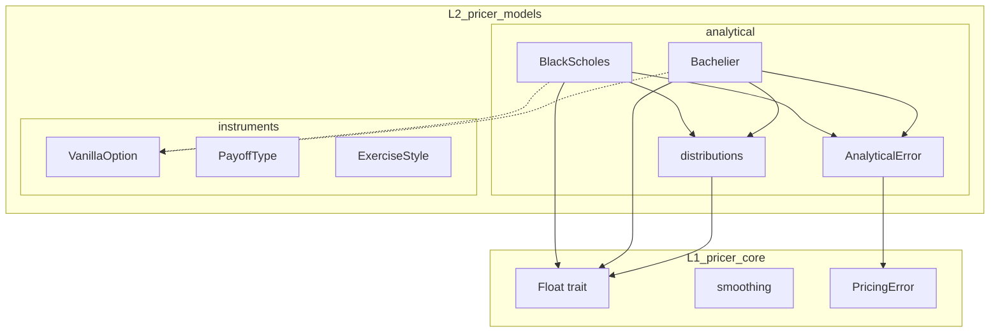

# 技術設計書: analytical-models

## Overview

**目的**: 本機能は、ヨーロピアンオプションの解析的プライシングモデル（Black-Scholes および Bachelier）を提供し、クオンツ開発者が閉形式解によるオプション価格およびグリークス計算を効率的に行えるようにする。

**ユーザー**: クオンツ開発者、リスク管理者が、デリバティブ価格計算、感度分析、および Monte Carlo 結果の検証に使用する。

**影響**: `pricer_models` クレート (L2) の `analytical` モジュールを拡張し、`pricer_core` の既存トレイト・型と統合する。

### Goals

- Black-Scholes および Bachelier モデルによる閉形式オプション価格計算
- 解析的グリークス（Delta, Gamma, Vega, Theta, Rho）の効率的な計算
- AD 互換性のための `T: Float` ジェネリクス対応
- 既存 `VanillaOption` 構造体との統合インターフェース

### Non-Goals

- American/Bermudan オプションの解析的プライシング（早期行使は対象外）
- 確率的ボラティリティモデル（Heston, SABR 等）
- バリアオプション等のエキゾチックオプション（別仕様で対応）

## Architecture

### Existing Architecture Analysis

**現行構造**:
- `pricer_models/src/analytical/mod.rs` - 空のプレースホルダー
- `pricer_models/src/instruments/` - `VanillaOption`, `PayoffType`, `ExerciseStyle` が定義済み
- `pricer_core/src/math/smoothing.rs` - AD 互換な滑らかな近似関数群

**統合ポイント**:
- `VanillaOption<T>` の `strike()`, `expiry()`, `payoff_type()` を使用
- `ExerciseStyle::is_european()` で対応可否を判定
- `PricingError` との統合（`From` トレイト実装）

### Architecture Pattern & Boundary Map



**Architecture Integration**:
- **選択したパターン**: Module-based with struct per model（シンプルで拡張可能）
- **ドメイン境界**: `analytical` モジュールは L2 内で自己完結、L1 から Float/PricingError のみ依存
- **維持する既存パターン**: enum-based instruments, `T: Float` ジェネリクス, thiserror
- **新規コンポーネントの根拠**: `BlackScholes`, `Bachelier`, `distributions`, `AnalyticalError`
- **Steering 準拠**: L2 Business Logic 層への配置、static dispatch 優先

### Technology Stack

| レイヤー | 選択 / バージョン | 機能での役割 | 備考 |
|---------|------------------|-------------|------|
| Backend | Rust Edition 2021 | 全実装 | Stable toolchain |
| Numeric | num-traits 0.2.x | Float トレイト、erfc | 既存依存 |
| Error | thiserror 1.x | AnalyticalError derive | 既存パターン |
| Testing | approx 0.5.x, proptest | 数値比較、property-based | 既存依存 |

## Requirements Traceability

| 要件 | 概要 | コンポーネント | インターフェース | フロー |
|------|------|---------------|----------------|-------|
| 1.1-1.5 | Black-Scholes モデル定義 | BlackScholes | new, price_call, price_put | 価格計算 |
| 2.1-2.5 | Bachelier モデル定義 | Bachelier | new, price_call, price_put | 価格計算 |
| 3.1-3.5 | 解析的 Greeks | BlackScholes | delta, gamma, vega, theta, rho | Greeks 計算 |
| 4.1-4.5 | 累積正規分布 | distributions | norm_cdf, norm_pdf | 内部計算 |
| 5.1-5.5 | ジェネリック型互換性 | All | `T: Float` | AD 検証 |
| 6.1-6.5 | オプション価格インターフェース | BlackScholes, Bachelier | price_option | VanillaOption 統合 |
| 7.1-7.5 | エラーハンドリング | AnalyticalError | From<AnalyticalError> | エラー変換 |
| 8.1-8.5 | d1/d2 項計算 | BlackScholes | d1, d2 | 内部計算 |

## Components and Interfaces

| Component | Domain/Layer | Intent | Req Coverage | Key Dependencies | Contracts |
|-----------|--------------|--------|--------------|------------------|-----------|
| BlackScholes | analytical/L2 | Black-Scholes 価格・Greeks 計算 | 1.1-1.5, 3.1-3.5, 8.1-8.5 | Float, distributions (P0) | Service |
| Bachelier | analytical/L2 | Bachelier 価格計算 | 2.1-2.5 | Float, distributions (P0) | Service |
| distributions | analytical/L2 | 正規分布関数 | 4.1-4.5 | Float (P0) | Service |
| AnalyticalError | analytical/L2 | エラー型定義 | 7.1-7.5 | PricingError (P0) | - |

---

### analytical/distributions

#### distributions module

| Field | Detail |
|-------|--------|
| Intent | 標準正規分布の CDF/PDF を提供 |
| Requirements | 4.1, 4.2, 4.3, 4.4, 4.5 |

**Responsibilities & Constraints**
- 標準正規分布の累積分布関数 (CDF) および確率密度関数 (PDF) を計算
- AD 互換性のため条件分岐を回避
- 極端な入力 (|x| > 8) でも数値安定性を確保

**Dependencies**
- Inbound: BlackScholes, Bachelier — d1/d2 の確率計算 (P0)
- External: num_traits::Float — erfc メソッド (P0)

**Contracts**: Service [x]

##### Service Interface

```rust
/// 標準正規分布の累積分布関数。
///
/// # Mathematical Definition
/// Φ(x) = (1/2) * erfc(-x / sqrt(2))
///
/// # Arguments
/// * `x` - 入力値
///
/// # Returns
/// P(X ≤ x) where X ~ N(0, 1)
pub fn norm_cdf<T: Float>(x: T) -> T;

/// 標準正規分布の確率密度関数。
///
/// # Mathematical Definition
/// φ(x) = (1 / sqrt(2π)) * exp(-x² / 2)
///
/// # Arguments
/// * `x` - 入力値
///
/// # Returns
/// 標準正規分布の密度値
pub fn norm_pdf<T: Float>(x: T) -> T;
```

- Preconditions: None (全ての有限値 x を受け付ける)
- Postconditions: `norm_cdf` は [0, 1] の範囲を返す; `norm_pdf` は非負値を返す
- Invariants: 対称性 `norm_cdf(-x) + norm_cdf(x) ≈ 1`

**Implementation Notes**
- `erfc` ベースの実装で数値安定性を確保
- 条件分岐なしで AD テープの一貫性を維持

---

### analytical/models

#### BlackScholes

| Field | Detail |
|-------|--------|
| Intent | Black-Scholes モデルによる European オプション価格・Greeks 計算 |
| Requirements | 1.1, 1.2, 1.3, 1.4, 1.5, 3.1, 3.2, 3.3, 3.4, 3.5, 6.1, 6.2, 6.3, 6.4, 6.5, 8.1, 8.2, 8.3, 8.4, 8.5 |

**Responsibilities & Constraints**
- 市場パラメータ (spot, rate, volatility) を保持
- 閉形式 Black-Scholes 公式による価格計算
- 解析的グリークス計算
- expiry ≈ 0 のケースで intrinsic value を返す
- volatility > 0, spot > 0 を検証

**Dependencies**
- Inbound: None (エントリーポイント)
- Outbound: distributions — norm_cdf, norm_pdf (P0)
- External: num_traits::Float (P0)

**Contracts**: Service [x] / State [x]

##### Service Interface

```rust
/// Black-Scholes モデル。
///
/// # Type Parameters
/// * `T` - Float を実装する数値型 (f64, Dual64 等)
#[derive(Debug, Clone)]
pub struct BlackScholes<T: Float> {
    spot: T,
    rate: T,
    volatility: T,
}

impl<T: Float> BlackScholes<T> {
    /// 新規インスタンスを作成。
    ///
    /// # Errors
    /// - `AnalyticalError::InvalidSpot` if spot <= 0
    /// - `AnalyticalError::InvalidVolatility` if volatility <= 0
    pub fn new(spot: T, rate: T, volatility: T) -> Result<Self, AnalyticalError>;

    /// European call オプション価格を計算。
    ///
    /// # Arguments
    /// * `strike` - 行使価格
    /// * `expiry` - 満期までの時間（年）
    ///
    /// # Returns
    /// コールオプションの理論価格
    pub fn price_call(&self, strike: T, expiry: T) -> T;

    /// European put オプション価格を計算。
    pub fn price_put(&self, strike: T, expiry: T) -> T;

    /// VanillaOption を使用してオプション価格を計算。
    ///
    /// # Errors
    /// - `AnalyticalError::UnsupportedExerciseStyle` if not European
    pub fn price_option(&self, option: &VanillaOption<T>) -> Result<T, AnalyticalError>;

    /// Delta (∂V/∂S) を計算。
    pub fn delta(&self, strike: T, expiry: T, is_call: bool) -> T;

    /// Gamma (∂²V/∂S²) を計算。
    pub fn gamma(&self, strike: T, expiry: T) -> T;

    /// Vega (∂V/∂σ) を計算。
    pub fn vega(&self, strike: T, expiry: T) -> T;

    /// Theta (∂V/∂t) を計算。
    pub fn theta(&self, strike: T, expiry: T, is_call: bool) -> T;

    /// Rho (∂V/∂r) を計算。
    pub fn rho(&self, strike: T, expiry: T, is_call: bool) -> T;

    /// d1 項を計算（内部使用）。
    fn d1(&self, strike: T, expiry: T) -> T;

    /// d2 項を計算（内部使用）。
    fn d2(&self, strike: T, expiry: T) -> T;
}
```

- Preconditions: spot > 0, volatility > 0, expiry >= 0, strike > 0
- Postconditions:
  - put-call parity: `C - P = S - K * exp(-r * T)` (数値許容範囲内)
  - expiry = 0 の場合 intrinsic value を返す
- Invariants: パラメータは immutable

##### State Management

- State model: `BlackScholes<T>` は immutable struct
- Persistence: なし（インメモリのみ）
- Concurrency: `Clone + Send + Sync` (T が Send + Sync の場合)

**Implementation Notes**
- d1/d2 計算で `sqrt(expiry)` をキャッシュして効率化
- expiry が非常に小さい場合のリミットケース処理
- AD 互換性のため Float 値に対する条件分岐を回避

---

#### Bachelier

| Field | Detail |
|-------|--------|
| Intent | Bachelier (正規) モデルによる European オプション価格計算 |
| Requirements | 2.1, 2.2, 2.3, 2.4, 2.5, 6.1, 6.2, 6.3, 6.4, 6.5 |

**Responsibilities & Constraints**
- 市場パラメータ (forward, volatility) を保持
- 正規モデル公式による価格計算
- 負のフォワード価格をサポート（金利市場向け）
- volatility > 0 を検証

**Dependencies**
- Inbound: None (エントリーポイント)
- Outbound: distributions — norm_cdf, norm_pdf (P0)
- External: num_traits::Float (P0)

**Contracts**: Service [x] / State [x]

##### Service Interface

```rust
/// Bachelier (正規) モデル。
///
/// 金利市場等で負のフォワード価格が発生する場合に使用。
#[derive(Debug, Clone)]
pub struct Bachelier<T: Float> {
    forward: T,
    volatility: T,
}

impl<T: Float> Bachelier<T> {
    /// 新規インスタンスを作成。
    ///
    /// # Arguments
    /// * `forward` - フォワード価格（負の値も許容）
    /// * `volatility` - ボラティリティ（正の値）
    ///
    /// # Errors
    /// - `AnalyticalError::InvalidVolatility` if volatility <= 0
    pub fn new(forward: T, volatility: T) -> Result<Self, AnalyticalError>;

    /// European call オプション価格を計算。
    pub fn price_call(&self, strike: T, expiry: T) -> T;

    /// European put オプション価格を計算。
    pub fn price_put(&self, strike: T, expiry: T) -> T;

    /// VanillaOption を使用してオプション価格を計算。
    pub fn price_option(&self, option: &VanillaOption<T>) -> Result<T, AnalyticalError>;
}
```

- Preconditions: volatility > 0, expiry >= 0
- Postconditions: put-call parity: `C - P = F - K`
- Invariants: パラメータは immutable

---

### analytical/error

#### AnalyticalError

| Field | Detail |
|-------|--------|
| Intent | analytical モジュール専用のエラー型 |
| Requirements | 7.1, 7.2, 7.3, 7.4, 7.5 |

**Responsibilities & Constraints**
- analytical モジュール固有のエラーを定義
- `PricingError` への変換を提供
- `thiserror` を使用した derive パターン

**Dependencies**
- Outbound: PricingError — エラー変換 (P0)

**Contracts**: None (pure data type)

##### Service Interface

```rust
use thiserror::Error;

/// Analytical pricing errors.
#[derive(Debug, Clone, Error)]
pub enum AnalyticalError {
    /// Invalid volatility (non-positive).
    #[error("Invalid volatility: σ = {volatility}")]
    InvalidVolatility { volatility: f64 },

    /// Invalid spot price (non-positive for Black-Scholes).
    #[error("Invalid spot price: S = {spot}")]
    InvalidSpot { spot: f64 },

    /// Unsupported exercise style.
    #[error("Unsupported exercise style: {style}")]
    UnsupportedExerciseStyle { style: String },

    /// Numerical instability during computation.
    #[error("Numerical instability: {message}")]
    NumericalInstability { message: String },
}

impl From<AnalyticalError> for PricingError {
    fn from(err: AnalyticalError) -> Self {
        match err {
            AnalyticalError::InvalidVolatility { .. } |
            AnalyticalError::InvalidSpot { .. } => {
                PricingError::InvalidInput(err.to_string())
            }
            AnalyticalError::UnsupportedExerciseStyle { .. } => {
                PricingError::UnsupportedInstrument(err.to_string())
            }
            AnalyticalError::NumericalInstability { .. } => {
                PricingError::NumericalInstability(err.to_string())
            }
        }
    }
}
```

## Data Models

### Domain Model

**Aggregates**:
- `BlackScholes<T>`: spot, rate, volatility を保持する value object
- `Bachelier<T>`: forward, volatility を保持する value object

**Value Objects**:
- Greeks 結果（個別の T 値として返却、専用構造体は作成しない）

**Business Rules**:
- Put-call parity: `C - P = S - K * exp(-r * T)` (Black-Scholes)
- Put-call parity: `C - P = F - K` (Bachelier)
- Intrinsic value at expiry = 0

### Logical Data Model

**BlackScholes State**:
```
BlackScholes<T>
├── spot: T          [required, > 0]
├── rate: T          [required, any real]
└── volatility: T    [required, > 0]
```

**Bachelier State**:
```
Bachelier<T>
├── forward: T       [required, any real]
└── volatility: T    [required, > 0]
```

## Error Handling

### Error Strategy

入力検証はコンストラクタで行い、無効なパラメータは即座に `AnalyticalError` を返す。計算中の数値不安定性（例: expiry ≈ 0 での d1/d2 計算）は特別処理で対応。

### Error Categories and Responses

**User Errors (Invalid Input)**:
- `InvalidVolatility`: volatility <= 0 → 構築時にエラー返却
- `InvalidSpot`: spot <= 0 (Black-Scholes) → 構築時にエラー返却

**Business Logic Errors**:
- `UnsupportedExerciseStyle`: non-European exercise → `price_option` でエラー返却

**System Errors**:
- `NumericalInstability`: 極端なパラメータ組み合わせ → 計算時にエラー返却（現行設計では発生しにくい）

## Testing Strategy

### Unit Tests

1. **BlackScholes price_call/price_put**: 既知のパラメータで計算結果を検証
2. **Put-call parity**: `C - P = S - K * exp(-r * T)` の検証
3. **Greeks accuracy**: 解析的 Greeks vs 有限差分の比較
4. **norm_cdf accuracy**: 参照値との比較 (|error| < 1e-7)
5. **Edge cases**: expiry = 0, ATM, deep ITM/OTM

### Integration Tests

1. **VanillaOption integration**: `price_option` メソッドの統合テスト
2. **Error propagation**: `AnalyticalError` → `PricingError` 変換
3. **AD compatibility**: `Dual64` 型での価格・Greeks 計算

### Property-Based Tests

1. **Put-call parity invariant**: 任意のパラメータで parity 成立
2. **Greeks sign**: call delta ∈ [0, 1], put delta ∈ [-1, 0]
3. **norm_cdf bounds**: 結果が [0, 1] の範囲内
4. **norm_cdf symmetry**: `norm_cdf(-x) + norm_cdf(x) ≈ 1`

## Performance & Scalability

**Target Metrics**:
- 単一オプション価格計算: < 100 ns
- 全グリークス計算（1オプション）: < 500 ns

**Optimization Techniques**:
- d1/d2 計算で `sqrt(expiry)` を事前計算
- Greeks 計算で共通項を再利用
- インライン化 (`#[inline]`) の適切な使用
