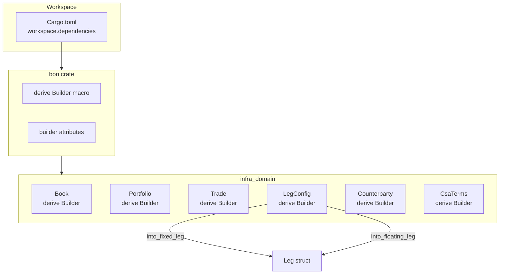
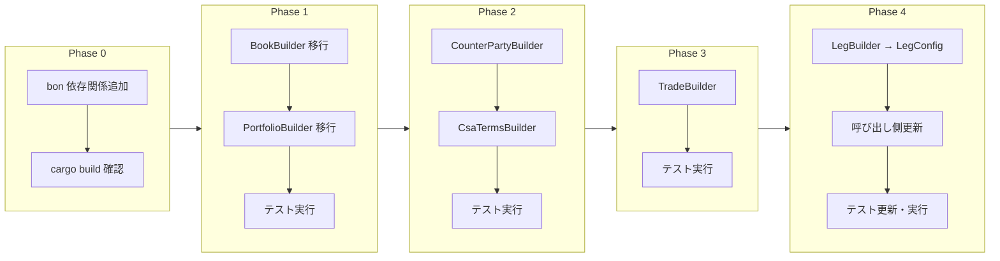
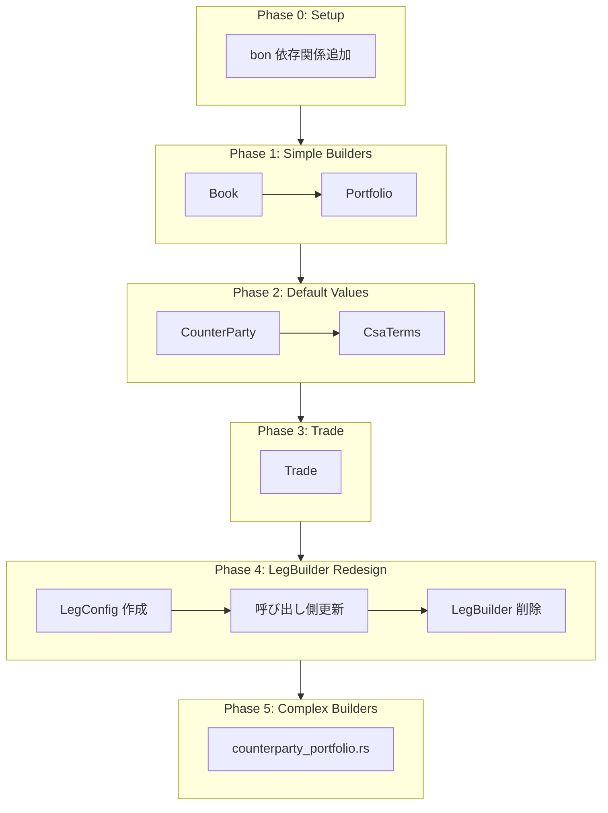

# Design Document: boilerplate-reduction

## Overview

**Purpose**: 本機能は、neutryx-rust プロジェクトにおける手書き Builder パターンのボイラープレートコードを `bon` クレートの `#[derive(Builder)]` マクロで置き換え、約3,000行のコード削減と保守性向上を実現する。

**Users**: neutryx-rust の開発者が、Trade、Leg、Counterparty 等の構造体を構築する際に、型安全かつ簡潔な Builder API を利用できるようになる。

**Impact**: `infra_domain` クレートを中心に31個の手書き Builder を段階的に置き換え、コードベースの一貫性と保守性を向上させる。

### Goals

- `bon` クレートをワークスペース依存関係に追加し、統一バージョン管理を実現
- `infra_domain` の主要 Builder（Trade、Leg、Book、Portfolio、Counterparty 関連）を bon 化
- 既存テストとの互換性を維持しながら移行
- 約3,000行のボイラープレート削減

### Non-Goals

- `pricer_core`、`pricer_models` のジェネリック Builder は本フェーズの対象外（Phase 2 以降）
- `service_*` クレートへの適用（現在一時的に無効化中）
- 他のボイラープレート削減クレート（strum 拡張、derive_more 等）の導入

---

## Architecture

### Existing Architecture Analysis

**現在の Builder パターン**:

```rust
// 手書き Builder の典型的パターン
pub struct BookBuilder {
    book_id: BookId,
    name: String,
    description: Option<String>,
    // ... 多数のフィールド
}

impl BookBuilder {
    pub fn new(id: impl Into<BookId>, name: impl Into<String>) -> Self { ... }
    pub fn description(mut self, desc: impl Into<String>) -> Self { ... }
    // ... 各フィールドの setter メソッド（各5-10行）
    pub fn build(self) -> Book { ... }
}
```

**課題**:
- 各 Builder につき 50-200行のボイラープレート
- setter メソッドの繰り返しパターン
- メンテナンス負荷（フィールド追加時に Builder も更新必要）

### Architecture Pattern & Boundary Map



**Architecture Integration**:

| 項目 | 決定 |
|------|------|
| 選択パターン | Derive Macro による Builder 自動生成 |
| ドメイン境界 | `infra_domain` クレート内で完結、外部 API 変更なし |
| 既存パターン維持 | `builder()` → setter chain → `build()` の呼び出しパターンは維持 |
| 新コンポーネント | `LegConfig` 構造体（`LegBuilder` の代替として設計変更） |
| Steering 準拠 | A-I-P-S 依存ルール順守、Infra 層から段階的に移行 |

### Technology Stack

| Layer | Choice / Version | Role in Feature | Notes |
|-------|------------------|-----------------|-------|
| Build System | Cargo workspace | bon 依存関係管理 | `[workspace.dependencies]` に追加 |
| Macro Crate | bon ^3.6 | Builder 自動生成 | typestate パターンで型安全性保証 |
| Target Crate | infra_domain | Builder 移行対象 | 14個の Builder を段階的移行 |

---

## System Flows

### Builder 移行フロー



**Key Decisions**:
- 各フェーズ完了後にテストスイート全体を実行し、リグレッションを検出
- Phase 4 は API 変更を伴うため、呼び出し側の更新が必要

---

## Requirements Traceability

| Requirement | Summary | Components | Interfaces | Flows |
|-------------|---------|------------|------------|-------|
| 1.1 | bon 依存関係追加 | Cargo.toml | - | Phase 0 |
| 1.2 | dependency-management 準拠 | Cargo.toml | workspace inheritance | Phase 0 |
| 1.3 | ビルド成功確認 | - | cargo build | Phase 0 |
| 2.1 | Trade に derive Builder | Trade | TradeBuilder API | Phase 3 |
| 2.2 | Leg に derive Builder | LegConfig | into_fixed_leg, into_floating_leg | Phase 4 |
| 2.3 | Cashflow に derive Builder | Cashflow | - | Out of scope |
| 2.4 | バリデーション保持 | LegConfig | validate() | Phase 4 |
| 2.5 | 既存 builder.rs 削除 | - | - | Phase 4 |
| 3.1 | default 属性使用 | All Builders | #[builder(default)] | Phase 1-4 |
| 3.2 | into 属性使用 | All Builders | #[builder(into)] | Phase 1-4 |
| 3.3 | skip 属性使用 | 対象なし | - | - |
| 3.4 | 型安全性確保 | All Builders | compile-time check | Phase 1-4 |
| 4.1 | テスト互換性 | Tests | - | Phase 1-4 |
| 4.2 | 呼び出し側更新 | All call sites | - | Phase 4 |
| 4.3 | ランタイム動作維持 | - | - | Phase 1-4 |
| 4.4 | ビルド可能維持 | - | cargo build | Phase 1-4 |
| 5.1 | doc コメント整備 | All Builders | /// docs | Phase 1-4 |
| 5.2 | インラインコメント | Complex attrs | // comments | Phase 1-4 |
| 5.3 | steering 更新 | dependency-management.md | - | Phase 0 |
| 6.1 | 拡張対象特定 | research.md | - | 完了 |
| 6.2 | 高インパクト優先 | 優先度マトリクス | - | 完了 |
| 6.3 | A-I-P-S 順守 | - | - | Phase 1-4 |

---

## Components and Interfaces

### Component Summary

| Component | Domain/Layer | Intent | Req Coverage | Key Dependencies | Contracts |
|-----------|--------------|--------|--------------|------------------|-----------|
| Cargo.toml (workspace) | Build | bon 依存関係管理 | 1.1, 1.2 | bon ^3.6 (P0) | - |
| Book | infra_domain/book | トレーディングブック定義 | 3.1, 3.2, 4.1 | - | State |
| Portfolio | infra_domain/portfolio | ポートフォリオ定義 | 3.1, 3.2, 4.1 | - | State |
| CounterParty | infra_domain/counterparty | 取引相手定義 | 3.1, 3.2, 4.1 | - | State |
| CsaTerms | infra_domain/counterparty | CSA条件定義 | 3.1, 3.2, 4.1 | - | State |
| Trade | infra_domain/trade | 取引定義 | 2.1, 3.1, 3.2, 4.1 | Leg (P0) | State |
| LegConfig | infra_domain/trade | Leg構築設定 | 2.2, 2.4, 4.2 | - | Service, State |

### infra_domain/book

#### Book

| Field | Detail |
|-------|--------|
| Intent | トレーディングブックのビルダー自動生成 |
| Requirements | 3.1, 3.2, 4.1 |

**Responsibilities & Constraints**
- `BookBuilder` の手書き実装を `#[derive(bon::Builder)]` で置換
- 既存の `builder()` → `build()` API パターンを維持
- フィールドのデフォルト値は `#[builder(default)]` で表現

**Dependencies**
- Inbound: None
- Outbound: BookId, BookType, BookMetadata — 型定義 (P0)
- External: bon — Builder マクロ (P0)

**Contracts**: State [x]

##### State Management

**Before (手書き)**:
```rust
pub struct BookBuilder {
    book_id: BookId,
    name: String,
    description: Option<String>,
    book_type: BookType,
    // ...
}

impl BookBuilder {
    pub fn new(id: impl Into<BookId>, name: impl Into<String>) -> Self { ... }
    pub fn description(mut self, description: impl Into<String>) -> Self { ... }
    // ... 10+ setter methods
    pub fn build(self) -> Book { ... }
}
```

**After (bon)**:
```rust
use bon::Builder;

#[derive(Builder)]
pub struct Book {
    #[builder(into)]
    book_id: BookId,
    #[builder(into)]
    name: String,
    #[builder(into, default)]
    description: Option<String>,
    #[builder(default)]
    book_type: BookType,
    #[builder(default)]
    regulatory_type: Option<RegulatoryBookType>,
    #[builder(default)]
    ownership: Option<BookOwnership>,
    #[builder(default)]
    metadata: BookMetadata,
}
```

**Implementation Notes**
- Integration: 既存の `Book::builder()` 呼び出しは変更不要
- Validation: `Book` 自体にバリデーションなし、移行は直接的
- Risks: 低 — 単純な構造体

---

### infra_domain/trade

#### LegConfig

| Field | Detail |
|-------|--------|
| Intent | Leg 構築のための設定を保持し、fixed/floating への変換メソッドを提供 |
| Requirements | 2.2, 2.4, 4.2 |

**Responsibilities & Constraints**
- 既存 `LegBuilder` の `build_fixed()` / `build_floating()` パターンを置換
- バリデーションは `validate()` メソッドで実行
- `into_fixed_leg()` / `into_floating_leg()` で Leg を生成

**Dependencies**
- Inbound: TradeBuilder — Leg 構築時に使用 (P0)
- Outbound: Leg, Cashflow, Payoff — 生成対象 (P0)
- External: bon — Builder マクロ (P0)

**Contracts**: Service [x] / State [x]

##### Service Interface

```rust
use bon::Builder;

#[derive(Builder)]
pub struct LegConfig {
    schedule: Vec<Date>,
    notional: f64,
    currency: Currency,
    #[builder(default)]
    direction: Direction,
    #[builder(default)]
    day_count: DayCounter,
}

impl LegConfig {
    /// Validates the configuration.
    ///
    /// # Errors
    /// Returns `TradeError::InvalidSchedule` if schedule has fewer than 2 dates.
    /// Returns `TradeError::InvalidNotional` if notional is negative.
    pub fn validate(&self) -> Result<(), TradeError> {
        if self.schedule.len() < 2 {
            return Err(TradeError::InvalidSchedule(
                "Schedule must have at least 2 dates".into(),
            ));
        }
        if self.notional < 0.0 {
            return Err(TradeError::InvalidNotional(self.notional));
        }
        Ok(())
    }

    /// Converts to a fixed rate leg.
    ///
    /// # Arguments
    /// * `rate` - Fixed rate as decimal (e.g., 0.05 for 5%)
    pub fn into_fixed_leg(self, rate: f64) -> Leg { ... }

    /// Converts to a floating rate leg.
    ///
    /// # Arguments
    /// * `index` - Rate index for the floating leg
    /// * `spread` - Spread over the index as decimal
    pub fn into_floating_leg(self, index: RateIndex, spread: f64) -> Leg { ... }
}
```

- Preconditions: `schedule`, `notional`, `currency` は必須
- Postconditions: `into_*_leg()` は有効な `Leg` を返す
- Invariants: `schedule.len() >= 2`, `notional >= 0.0`

##### State Management

- State model: Immutable configuration struct
- Persistence: なし（一時的な構築用オブジェクト）
- Concurrency: 単一スレッドでの構築を想定

**Implementation Notes**
- Integration: 既存 `LegBuilder::new(...).build_fixed(rate)` → `LegConfig::builder()...build().into_fixed_leg(rate)`
- Validation: `validate()` を明示的に呼び出すか、`into_*_leg()` 内で呼び出すかは実装時に決定
- Risks: 中 — API 変更を伴うため、呼び出し側の更新が必要

---

## Data Models

### Domain Model

**変更なし**: 本機能は Builder の実装パターンを変更するのみで、ドメインモデル（Trade, Leg, Cashflow 等）自体は変更しない。

### Logical Data Model

**構造体フィールドへの属性追加**:

| Struct | Field | bon Attribute | Purpose |
|--------|-------|---------------|---------|
| Book | book_id | `#[builder(into)]` | `impl Into<BookId>` 受け入れ |
| Book | name | `#[builder(into)]` | `impl Into<String>` 受け入れ |
| Book | description | `#[builder(into, default)]` | オプショナル、デフォルト None |
| Book | book_type | `#[builder(default)]` | デフォルト値使用 |
| LegConfig | direction | `#[builder(default)]` | デフォルト `Direction::Receiver` |
| LegConfig | day_count | `#[builder(default)]` | デフォルト `DayCounter::Actual365Fixed` |
| CsaTerms | mpor_days | `#[builder(default = 10)]` | デフォルト 10日 |
| CsaTerms | margin_currency | `#[builder(default = Currency::USD)]` | デフォルト USD |

---

## Error Handling

### Error Strategy

- **コンパイル時エラー**: bon の typestate パターンにより、必須フィールド未設定時はコンパイルエラー
- **ランタイムバリデーション**: `validate()` メソッドで明示的なバリデーション

### Error Categories and Responses

**User Errors (バリデーション失敗)**:
- `TradeError::InvalidSchedule` — スケジュールが不正
- `TradeError::InvalidNotional` — 想定元本が負値

**コンパイル時エラー**:
- 必須フィールド未設定 → bon がコンパイルエラーを生成

---

## Testing Strategy

### Unit Tests

1. **Builder 基本機能**: 各構造体の `builder()` → `build()` フローが正常動作
2. **デフォルト値**: `#[builder(default)]` 付きフィールドが期待値で初期化
3. **into 変換**: `#[builder(into)]` で `&str` → `String` 等が正常変換
4. **バリデーション**: `LegConfig::validate()` が不正入力を適切に拒否
5. **固定/変動 Leg 変換**: `into_fixed_leg()` / `into_floating_leg()` が正しい Leg を生成

### Integration Tests

1. **TradeBuilder + LegConfig**: Trade 構築フロー全体の動作確認
2. **counterparty 階層**: NettingSet → IsdaMasterAgreement → CounterpartyPortfolio の構築フロー
3. **既存テスト互換性**: `infra_domain` の既存テストスイートが全パス

### Regression Tests

- 各 Phase 完了後に `cargo test -p infra_domain` を実行
- API 変更を伴う Phase 4 では呼び出し側のテストも更新

---

## Optional Sections

### Migration Strategy



**ロールバックトリガー**:
- 各 Phase でテスト失敗が発生した場合、該当 Phase の変更を revert
- Phase 4 でのみ API 変更があるため、特に注意が必要

**検証チェックポイント**:
- `cargo build --workspace` 成功
- `cargo test -p infra_domain` 全パス
- `cargo clippy --workspace` 警告なし

---

## Supporting References

詳細な調査結果は [research.md](./research.md) を参照。

- bon 属性一覧と使用例
- 移行優先度マトリクス
- リスク評価と緩和策
