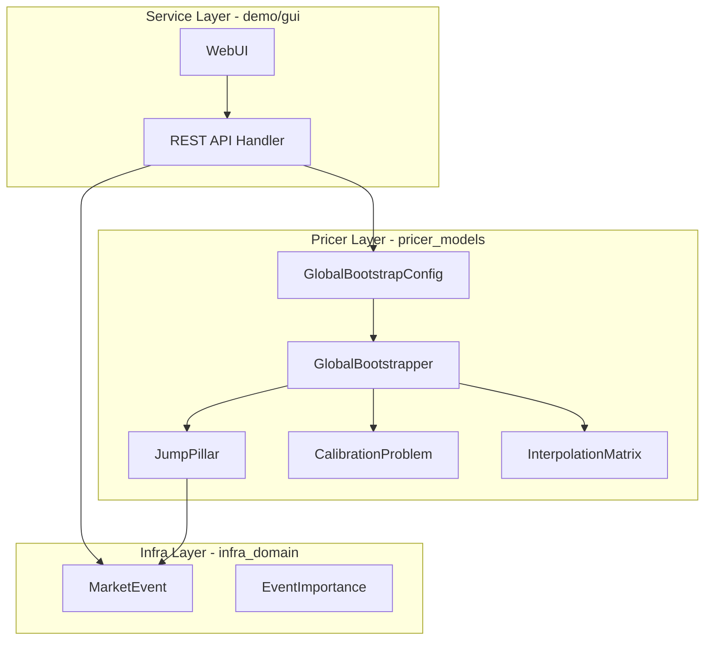
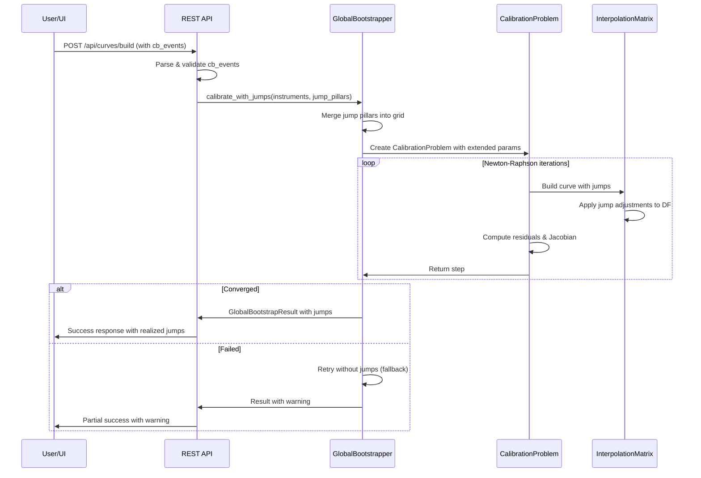
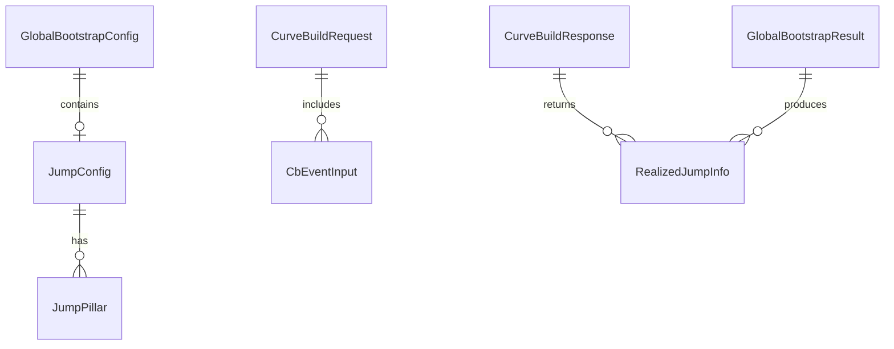

# Technical Design: CB Meeting Jump Calibration

## Overview

**Purpose**: 本機能は、CurveBuilder/GlobalSolverにおいて中央銀行会合(CB Meeting)日のフォワードレートジャンプを考慮したカリブレーション機能を提供する。これにより、政策金利決定日前後の不連続性を正確にモデル化し、プライシング精度を向上させる。

**Users**: クオンツ開発者およびトレーダー/リスク管理者がCurveBuilder WebUIを通じて、ジャンプ付きカリブレーションを実行し結果を視覚的に確認する。

**Impact**: GlobalBootstrapperの拡張により、既存の滑らかなカーブ生成に加え、CB Meeting日でのジャンプを含むカーブ生成が可能となる。既存ワークフローへの影響はなし（後方互換）。

### Goals

- CB Meeting日におけるフォワードレートジャンプのカリブレーション対応
- 期待ジャンプ幅のUI入力とAPI受付
- ジャンプ付きカーブの視覚的表示（マーカー、ツールチップ）
- 既存カリブレーションワークフローの完全な後方互換性維持

### Non-Goals

- CB Meeting以外のイベント（経済指標発表等）のジャンプ対応
- リアルタイム市場データからのジャンプ幅自動推定
- 複数通貨間のジャンプ相関モデリング
- ジャンプパラメータのヒストリカル分析機能

## Architecture

### Existing Architecture Analysis

**現行アーキテクチャパターンと制約**:

- **A-I-P-S階層**: Adapter → Infra → Pricer → Service の依存方向を厳守
- **GlobalBootstrapper**: Newton-Raphson法による多次元カリブレーション（788行）
- **CalibrationProblem**: SystemOfEquations traitによるソルバー抽象化
- **InterpolationMatrix**: ピラー間Log-Linear補間（スムース前提）

**維持すべき統合ポイント**:

- `CalibrationInstrument` trait: pricing_errorメソッドのシグネチャ不変
- `GlobalBootstrapConfig`: builderパターン（with_*メソッド群）
- `CurveBuildRequest`: Serde JSONデシリアライゼーション

**対処する技術的負債**:

- なし（既存実装は堅牢）

### Architecture Pattern & Boundary Map



**Architecture Integration**:

- **Selected pattern**: ハイブリッドアプローチ — 既存コンポーネント拡張＋ジャンプ専用構造体追加
- **Domain/feature boundaries**: Infra層（MarketEvent拡張）→ Pricer層（ジャンプカリブレーション）→ Service層（API/UI）
- **Existing patterns preserved**: builder pattern、SystemOfEquations trait、CalibrationInstrument trait
- **New components rationale**:
  - `JumpPillar`: ジャンプ日付とパラメータを管理する値オブジェクト
  - `JumpConfig`: ジャンプカリブレーション設定をカプセル化
- **Steering compliance**: A-I-P-S依存方向厳守、British English命名、型安全性

### Technology Stack

| Layer | Choice / Version | Role in Feature | Notes |
|-------|------------------|-----------------|-------|
| Backend / Services | Rust + axum | REST APIハンドラ拡張 | 既存スタック維持 |
| Pricer | pricer_models crate | GlobalBootstrapper拡張 | Newton-Raphson + ジャンプ |
| Infra | infra_domain crate | MarketEvent拡張 | expected_jump_bps追加 |
| Frontend | Vanilla JS + Chart.js | ジャンプマーカー表示 | 既存UI拡張 |
| Data | JSON files | CB Meetingデータ | 既存スキーマ維持 |

## System Flows

### ジャンプ付きカーブカリブレーションフロー



**Key Decisions**:

- ジャンプピラーはカリブレーショングリッドに自動追加
- 収束失敗時はジャンプなしでフォールバック
- 結果にはrealized_jumps（実現ジャンプ値）を含む

## Requirements Traceability

| Requirement | Summary | Components | Interfaces | Flows |
|-------------|---------|------------|------------|-------|
| 1.1 | ジャンプ幅入力フィールド表示 | WebUI | - | - |
| 1.2 | MarketEvent.expected_jump_bps | MarketEvent | - | - |
| 1.3 | デフォルト値0使用 | API Handler | CurveBuildRequest | - |
| 1.4 | ±100bpsバリデーション | API Handler | CurveBuildRequest | - |
| 1.5 | JSON形式cb_events受付 | API Handler | CurveBuildRequest | - |
| 2.1 | ジャンプピラーをグリッド追加 | GlobalBootstrapper | JumpPillar | カリブレーションフロー |
| 2.2 | 補間ロジック調整 | InterpolationMatrix | with_jump_pillars | - |
| 2.3 | ジャンプ調整後DF使用 | CalibrationProblem | pricing_error | - |
| 2.4 | 結果にジャンプ情報含む | GlobalBootstrapResult | realized_jumps | - |
| 2.5 | Jacobianにジャンプ偏微分 | CalibrationProblem | jacobian | - |
| 3.1 | jump_pillar_flags列 | CalibrationMatrix | - | - |
| 3.2 | 不連続補間重み | InterpolationMatrix | with_jump_pillars | - |
| 3.3 | 拡張パラメータベクトル | CalibrationProblem | - | - |
| 3.4 | ピラー重複回避 | GlobalBootstrapper | merge_pillars | - |
| 3.5 | グリッド自動追加 | GlobalTimeGrid | - | - |
| 4.1 | cb_eventsパラメータ | API Handler | CurveBuildRequest | - |
| 4.2 | イベントパース | API Handler | CbEventInput | - |
| 4.3 | realized_jumps返却 | API Handler | CurveBuildResponse | - |
| 4.4 | 範囲外イベント警告 | API Handler | - | - |
| 4.5 | 複数通貨対応 | API Handler | - | - |
| 5.1 | ジャンプマーカー表示 | WebUI | - | - |
| 5.2 | ツールチップ表示 | WebUI | - | - |
| 5.3 | 詳細情報表示 | WebUI | - | - |
| 5.4 | トグル切替 | WebUI | - | - |
| 5.5 | 不連続点描画 | WebUI | - | - |
| 6.1 | 日付フォーマットエラー | API Handler | ApiError | - |
| 6.2 | 数値バリデーションエラー | API Handler | ApiError | - |
| 6.3 | 収束失敗フォールバック | GlobalBootstrapper | - | カリブレーションフロー |
| 6.4 | ジャンプエラーバリアント | CalibrationError | JumpCalibrationFailed | - |
| 6.5 | デバッグログ | GlobalBootstrapper | - | - |
| 7.1 | 従来結果の維持 | GlobalBootstrapper | - | - |
| 7.2 | オプショナルパラメータ | API Handler | CurveBuildRequest | - |
| 7.3 | 既存フィールド不変 | MarketEvent | - | - |
| 7.4 | 従来UI維持 | WebUI | - | - |
| 7.5 | デフォルト無効 | GlobalBootstrapConfig | enable_jumps | - |

## Components and Interfaces

| Component | Domain/Layer | Intent | Req Coverage | Key Dependencies | Contracts |
|-----------|--------------|--------|--------------|------------------|-----------|
| MarketEvent | Infra | CB Meetingイベント情報保持 | 1.2, 7.3 | - | State |
| JumpPillar | Pricer | ジャンプ日付とパラメータ管理 | 2.1, 3.4 | MarketEvent (P1) | State |
| JumpConfig | Pricer | ジャンプカリブレーション設定 | 2.1, 7.5 | - | State |
| GlobalBootstrapConfig | Pricer | カリブレーション設定（拡張） | 7.5 | JumpConfig (P1) | State |
| GlobalBootstrapper | Pricer | ジャンプ付きカリブレーション実行 | 2.1-2.5, 6.3, 7.1 | CalibrationProblem (P0), InterpolationMatrix (P0) | Service |
| CalibrationProblem | Pricer | 拡張パラメータ最適化問題 | 2.3, 2.5, 3.3 | InterpolationMatrix (P0) | Service |
| InterpolationMatrix | Pricer | ジャンプ対応補間 | 2.2, 3.2 | - | Service |
| GlobalBootstrapResult | Pricer | カリブレーション結果（拡張） | 2.4 | - | State |
| CurveBuildRequest | Service | APIリクエスト（拡張） | 1.3-1.5, 4.1-4.2, 7.2 | CbEventInput (P1) | API |
| CurveBuildResponse | Service | APIレスポンス（拡張） | 4.3 | - | API |
| CalibrationError | Pricer | エラー型（拡張） | 6.4 | - | State |

### Infra Layer

#### MarketEvent

| Field | Detail |
|-------|--------|
| Intent | CB Meetingイベント情報を保持し、期待ジャンプ幅を追加 |
| Requirements | 1.2, 7.3 |

**Responsibilities & Constraints**:

- CB Meetingイベントの日付、中央銀行情報、重要度を保持
- 新規フィールド`expected_jump_bps`をOptionalで追加（後方互換）
- 既存フィールドのシグネチャ変更禁止

**Dependencies**:

- Inbound: None
- Outbound: EventType, EventImportance, CentralBank — イベント分類 (P1)
- External: None

**Contracts**: State [x]

##### State Management

```rust
pub struct MarketEvent {
    // ... existing fields unchanged ...

    /// Expected jump size in basis points for CB meeting events.
    /// Positive value indicates rate hike expectation.
    /// Range: -100.0 to +100.0 bps.
    #[serde(default, skip_serializing_if = "Option::is_none")]
    pub expected_jump_bps: Option<f64>,
}
```

- **State model**: イミュータブル値オブジェクト
- **Persistence**: JSONファイルからの読み込み（既存）
- **Concurrency**: Read-only、スレッドセーフ

### Pricer Layer

#### JumpPillar

| Field | Detail |
|-------|--------|
| Intent | ジャンプ日付、期待ジャンプ幅、パラメータインデックスを管理 |
| Requirements | 2.1, 3.4 |

**Responsibilities & Constraints**:

- CB Meeting日付を年分数に変換して保持
- 期待ジャンプ幅（bps）を内部表現（absolute rate）に変換
- パラメータベクトル内のインデックスを追跡

**Dependencies**:

- Inbound: GlobalBootstrapper — ジャンプピラー生成 (P0)
- Outbound: None
- External: None

**Contracts**: State [x]

##### State Management

```rust
/// Jump pillar for CB meeting date.
#[derive(Debug, Clone, Copy)]
pub struct JumpPillar<T: Float> {
    /// Time to jump date in years.
    pub time: T,
    /// Expected jump size in absolute rate (converted from bps).
    pub expected_jump: T,
    /// Realized jump size after calibration.
    pub realized_jump: Option<T>,
    /// Index in the extended parameter vector.
    pub param_index: Option<usize>,
}

impl<T: Float> JumpPillar<T> {
    /// Create from date string and expected jump in bps.
    pub fn from_date_bps(
        reference_date: &str,
        jump_date: &str,
        expected_bps: T,
    ) -> Result<Self, CalibrationError>;

    /// Convert bps to absolute rate (bps * 0.0001).
    pub fn bps_to_rate(bps: T) -> T;
}
```

#### JumpConfig

| Field | Detail |
|-------|--------|
| Intent | ジャンプカリブレーション設定をカプセル化 |
| Requirements | 2.1, 7.5 |

**Responsibilities & Constraints**:

- ジャンプ機能の有効/無効フラグ管理
- フォールバック戦略の設定
- ジャンプピラーリスト保持

**Contracts**: State [x]

##### State Management

```rust
/// Configuration for jump-aware calibration.
#[derive(Debug, Clone, Default)]
pub struct JumpConfig<T: Float> {
    /// Enable jump calibration.
    pub enabled: bool,
    /// Jump pillars for CB meeting dates.
    pub jump_pillars: Vec<JumpPillar<T>>,
    /// Fallback to non-jump calibration on convergence failure.
    pub fallback_on_failure: bool,
    /// Damping factor for jump parameters (0.0 to 1.0).
    pub jump_damping: Option<T>,
}

impl<T: Float> JumpConfig<T> {
    pub fn new() -> Self;
    pub fn with_jump_pillars(self, pillars: Vec<JumpPillar<T>>) -> Self;
    pub fn with_fallback(self, enabled: bool) -> Self;
}
```

#### GlobalBootstrapConfig (Extension)

| Field | Detail |
|-------|--------|
| Intent | 既存カリブレーション設定にジャンプ設定を追加 |
| Requirements | 7.5 |

**Responsibilities & Constraints**:

- 既存設定フィールド不変
- `jump_config`フィールドをOptionalで追加
- Builder patternのwith_*メソッド追加

**Contracts**: State [x]

##### State Management

```rust
// Extension to existing GlobalBootstrapConfig
impl<T: Float + RealField + Copy> GlobalBootstrapConfig<T> {
    /// Set jump configuration.
    pub fn with_jump_config(mut self, config: JumpConfig<T>) -> Self {
        self.jump_config = Some(config);
        self
    }

    /// Enable jump calibration with given pillars.
    pub fn with_jumps(mut self, pillars: Vec<JumpPillar<T>>) -> Self {
        self.jump_config = Some(JumpConfig {
            enabled: true,
            jump_pillars: pillars,
            fallback_on_failure: true,
            jump_damping: None,
        });
        self
    }
}
```

#### GlobalBootstrapper (Extension)

| Field | Detail |
|-------|--------|
| Intent | ジャンプ付きカリブレーションを実行 |
| Requirements | 2.1-2.5, 6.3, 7.1 |

**Responsibilities & Constraints**:

- ジャンプピラーをカリブレーショングリッドにマージ
- 拡張パラメータベクトルでNewton-Raphson実行
- 収束失敗時のフォールバック処理

**Dependencies**:

- Inbound: API Handler — calibrate呼び出し (P0)
- Outbound: CalibrationProblem — 最適化問題構築 (P0)
- Outbound: InterpolationMatrix — 補間マトリックス構築 (P0)
- External: None

**Contracts**: Service [x]

##### Service Interface

```rust
impl<T: RealField + Float + Copy> GlobalBootstrapper<T> {
    /// Calibrate with jump pillars.
    pub fn calibrate_with_jumps<I: CalibrationInstrument<T> + Clone>(
        &self,
        instruments: &[I],
        jump_pillars: &[JumpPillar<T>],
    ) -> Result<GlobalBootstrapResult<T>, SolverError>;

    /// Merge regular pillars with jump pillars, avoiding duplicates.
    fn merge_pillars(
        &self,
        regular_pillars: &[T],
        jump_pillars: &[JumpPillar<T>],
        tolerance: T,
    ) -> (Vec<T>, Vec<usize>);

    /// Apply fallback strategy on convergence failure.
    fn fallback_calibrate<I: CalibrationInstrument<T> + Clone>(
        &self,
        instruments: &[I],
    ) -> Result<GlobalBootstrapResult<T>, SolverError>;
}
```

- **Preconditions**: instruments非空、jump_pillars時系列順
- **Postconditions**: 収束成功時residual < tolerance
- **Invariants**: 既存calibrateメソッドの動作不変

#### CalibrationProblem (Extension)

| Field | Detail |
|-------|--------|
| Intent | 拡張パラメータベクトルでの最適化問題定義 |
| Requirements | 2.3, 2.5, 3.3 |

**Responsibilities & Constraints**:

- パラメータベクトル: `[log(DF_1), ..., log(DF_n), jump_1, ..., jump_m]`
- Jacobian行列を`(n+m) × (n+m)`に拡張
- ジャンプ調整後のディスカウントファクター計算

**Contracts**: Service [x]

##### Service Interface

```rust
impl<T, I> CalibrationProblem<T, I>
where
    T: Float + RealField + Copy,
    I: CalibrationInstrument<T> + Clone,
{
    /// Create calibration problem with jump pillars.
    pub fn with_jumps(
        instruments: Vec<I>,
        jump_pillars: Vec<JumpPillar<T>>,
        config: CalibrationProblemConfig<T>,
    ) -> Result<Self, CalibrationError>;

    /// Build curve with jump adjustments applied.
    pub fn build_curve_with_jumps(
        &self,
        log_df: &[T],
        jumps: &[T],
    ) -> Result<BootstrappedCurve<T>, SolverError>;

    /// Compute Jacobian including jump parameter derivatives.
    pub fn compute_jacobian_with_jumps(
        &self,
        log_df: &[T],
        jumps: &[T],
    ) -> Result<DMatrix<T>, CalibrationError>;
}
```

#### InterpolationMatrix (Extension)

| Field | Detail |
|-------|--------|
| Intent | ジャンプピラーでの不連続補間対応 |
| Requirements | 2.2, 3.2 |

**Responsibilities & Constraints**:

- ジャンプ日付を補間区間の境界として扱う
- ジャンプ前後で別々の補間セグメント適用
- 既存from_pillarsメソッドの動作不変

**Contracts**: Service [x]

##### Service Interface

```rust
impl<T: Float + RealField + Copy> InterpolationMatrix<T> {
    /// Create interpolation matrix with jump pillar boundaries.
    pub fn with_jump_pillars(
        pillars: &[T],
        grid: &CalibrationGrid<T>,
        jump_times: &[T],
    ) -> Self;

    /// Interpolate with jump adjustments.
    pub fn interpolate_with_jumps(
        &self,
        pillar_values: &[T],
        jump_values: &[T],
    ) -> Vec<T>;
}
```

#### GlobalBootstrapResult (Extension)

| Field | Detail |
|-------|--------|
| Intent | カリブレーション結果にジャンプ情報を追加 |
| Requirements | 2.4 |

**Contracts**: State [x]

##### State Management

```rust
pub struct GlobalBootstrapResult<T: Float> {
    // ... existing fields unchanged ...

    /// Realized jump values after calibration (in bps).
    pub realized_jumps: Option<Vec<(T, T)>>,  // (time, jump_bps)

    /// Whether fallback was used due to jump calibration failure.
    pub fallback_used: bool,

    /// Jump calibration warnings.
    pub jump_warnings: Vec<String>,
}
```

### Service Layer

#### CurveBuildRequest (Extension)

| Field | Detail |
|-------|--------|
| Intent | APIリクエストにCB Meetingジャンプパラメータを追加 |
| Requirements | 1.3-1.5, 4.1-4.2, 7.2 |

**Contracts**: API [x]

##### API Contract

| Method | Endpoint | Request | Response | Errors |
|--------|----------|---------|----------|--------|
| POST | /api/curves/build | CurveBuildRequest | CurveBuildResponse | 400, 422, 500 |

```rust
/// Extended curve build request with CB meeting jumps.
#[derive(Debug, Clone, Deserialize)]
#[serde(rename_all = "camelCase")]
pub struct CurveBuildRequest {
    // ... existing fields unchanged ...

    /// CB meeting events with expected jumps.
    #[serde(default)]
    pub cb_events: Option<Vec<CbEventInput>>,

    /// Enable jump calibration.
    #[serde(default)]
    pub enable_jumps: bool,
}

/// CB meeting event input.
#[derive(Debug, Clone, Deserialize)]
#[serde(rename_all = "camelCase")]
pub struct CbEventInput {
    /// Meeting date in ISO format (YYYY-MM-DD).
    pub date: String,
    /// Expected jump in basis points (-100 to +100).
    pub expected_jump_bps: f64,
    /// Central bank code (optional, for display).
    #[serde(default)]
    pub central_bank: Option<String>,
}
```

#### CurveBuildResponse (Extension)

| Field | Detail |
|-------|--------|
| Intent | APIレスポンスに実現ジャンプ値を追加 |
| Requirements | 4.3 |

**Contracts**: API [x]

```rust
#[derive(Debug, Clone, Serialize)]
#[serde(rename_all = "camelCase")]
pub struct CurveBuildResponse {
    // ... existing fields unchanged ...

    /// Realized jumps after calibration.
    #[serde(skip_serializing_if = "Option::is_none")]
    pub realized_jumps: Option<Vec<RealizedJumpInfo>>,

    /// Whether jump calibration fallback was used.
    #[serde(skip_serializing_if = "Option::is_none")]
    pub jump_fallback_used: Option<bool>,

    /// Jump-related warnings.
    #[serde(skip_serializing_if = "Vec::is_empty")]
    pub jump_warnings: Vec<String>,
}

#[derive(Debug, Clone, Serialize)]
#[serde(rename_all = "camelCase")]
pub struct RealizedJumpInfo {
    pub date: String,
    pub central_bank: Option<String>,
    pub expected_bps: f64,
    pub realized_bps: f64,
}
```

#### CalibrationError (Extension)

| Field | Detail |
|-------|--------|
| Intent | ジャンプ関連エラーバリアントを追加 |
| Requirements | 6.4 |

**Contracts**: State [x]

```rust
pub enum CalibrationError {
    // ... existing variants unchanged ...

    /// Jump calibration failed to converge.
    JumpCalibrationFailed {
        message: String,
        last_residual: f64,
        iterations: usize,
    },

    /// Invalid jump parameter value.
    InvalidJumpParameter {
        date: String,
        value: f64,
        reason: String,
    },
}
```

## Data Models

### Domain Model

**Aggregates**:

- `GlobalBootstrapResult`: カリブレーション結果の集約ルート
- `JumpConfig`: ジャンプ設定の値オブジェクト集合

**Entities**:

- `JumpPillar`: ジャンプ日付とパラメータを持つエンティティ

**Value Objects**:

- `CbEventInput`: APIからのジャンプ入力
- `RealizedJumpInfo`: 結果としての実現ジャンプ

**Domain Events**: なし（同期処理）

**Business Rules & Invariants**:

- expected_jump_bps ∈ [-100.0, +100.0]
- ジャンプ日付は参照日より未来
- ジャンプピラーは時系列順

### Logical Data Model

**Entity Relationships**:



**Attributes and Types**:

- `JumpPillar.time`: `T: Float` — 年分数
- `JumpPillar.expected_jump`: `T: Float` — absolute rate
- `CbEventInput.expected_jump_bps`: `f64` — basis points
- `CbEventInput.date`: `String` — ISO 8601形式

### Data Contracts & Integration

**API Data Transfer**:

- Request: JSON with optional `cb_events` array
- Response: JSON with optional `realized_jumps` array
- Validation: ±100bps範囲チェック、日付フォーマット検証

**Serialization**:

- camelCase JSON命名（フロントエンド互換）
- skip_serializing_if でnull省略

## Error Handling

### Error Strategy

- **Fail Fast**: 入力バリデーションはAPIレイヤーで即座に実行
- **Graceful Degradation**: カリブレーション失敗時はジャンプなしフォールバック
- **User Context**: エラーメッセージに具体的な修正指示を含む

### Error Categories and Responses

**User Errors (4xx)**:

- 400 Bad Request: 日付フォーマット不正、JSON構造エラー
- 422 Unprocessable Entity: ジャンプ値範囲外（±100bps超過）

**System Errors (5xx)**:

- 500 Internal Server Error: カリブレーション収束失敗（フォールバック後も失敗）

**Business Logic Errors (422)**:

- ジャンプ日付が商品テナー範囲外 → 警告付きで無視

### Monitoring

- ジャンプカリブレーション成功/失敗率
- フォールバック発生率
- 平均収束イテレーション数（ジャンプあり/なし比較）

## Testing Strategy

### Unit Tests

- `JumpPillar::from_date_bps` — 日付変換、bps→rate変換
- `JumpConfig` — builder pattern、デフォルト値
- `InterpolationMatrix::with_jump_pillars` — 不連続補間重み計算
- `CalibrationProblem::compute_jacobian_with_jumps` — Jacobian拡張検証
- バリデーション関数 — 範囲チェック、フォーマット検証

### Integration Tests

- `GlobalBootstrapper::calibrate_with_jumps` — 単一ジャンプ付きOISカリブレーション
- 複数ジャンプ付きカリブレーション — 累積効果検証
- フォールバック発動 — 意図的に収束失敗させてフォールバック確認
- API end-to-end — POST /api/curves/build with cb_events

### E2E/UI Tests

- ジャンプ入力フィールド表示/非表示
- ジャンプマーカー表示（Chart.js）
- トグル切替によるUI更新
- ツールチップ表示確認

### Performance

- ジャンプあり/なしカリブレーション速度比較
- 10ジャンプピラーでの収束イテレーション数

## Performance & Scalability

**Target Metrics**:

- ジャンプ付きカリブレーション: <100ms（10商品、5ジャンプ）
- Jacobian計算: ジャンプ追加による増加 <20%

**Optimization**:

- ジャンプピラーと通常ピラーの重複チェックはO(n log n)
- Jacobianの疎構造を活用（ジャンプ項は対角成分のみ影響）

## Supporting References

詳細な調査ログと設計決定の根拠については `research.md` を参照。
