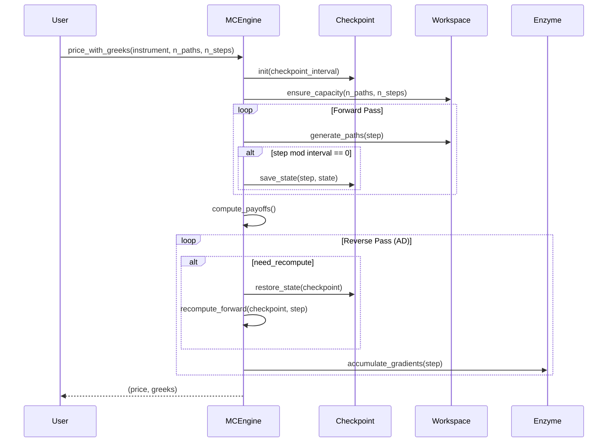
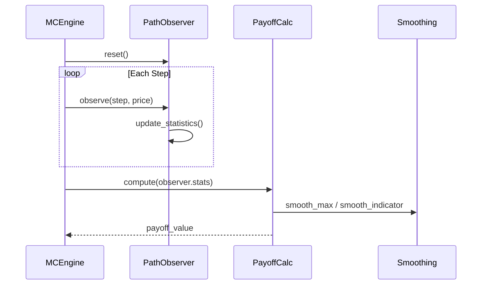
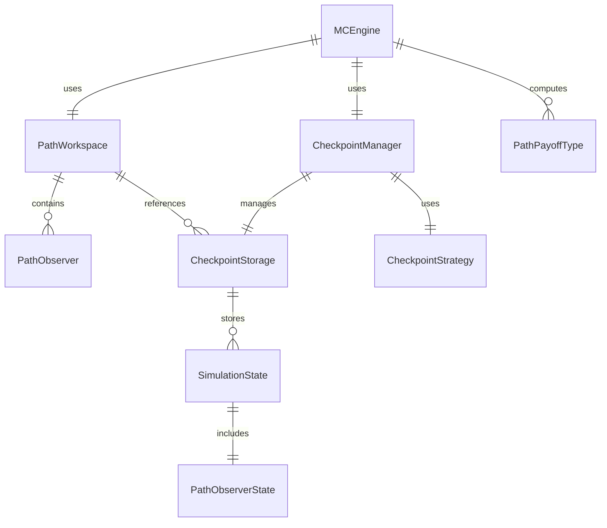

# Technical Design: Checkpointing and Path-Dependent Options

## Overview

**Purpose**: 本機能は、メモリ効率的な自動微分（AD）のためのチェックポイント機構と、パス依存オプション（Asian, Barrier, Lookback）のサポートを提供する。長いモンテカルロシミュレーションパスでもメモリ枯渇なしに勾配計算を可能にし、エキゾチックオプションの価格計算とギリシャ計算を実現する。

**Users**: クオンツ開発者、計算エンジン開発者、パフォーマンスエンジニアが、XVA価格計算とリスク管理のワークフローで本機能を使用する。

**Impact**: Phase 3で完成したモンテカルロカーネルとEnzyme AD基盤を拡張し、L3（pricer_kernel）とL1/L2（pricer_core, pricer_models）の統合により4層アーキテクチャの完全な依存関係フローを実現する。

### Goals

- チェックポイント機構によるAD計算時のメモリ使用量制御
- Asian/Barrier/Lookbackオプションのスムーズペイオフ実装
- L1/L2クレートとの統合による4層アーキテクチャ完成
- 解析解との比較による正確性検証

### Non-Goals

- リアルタイム市場データフィード統合
- Heston/SABRモデルのパス依存オプション対応（GBMのみ）
- GUI/ダッシュボード実装
- 分散計算/マルチノード対応

## Architecture

### Existing Architecture Analysis

**現在のL3（pricer_kernel）状態**:
- `mc/workspace.rs`: PathWorkspace完了（randoms, paths, payoffs バッファ管理）
- `mc/payoff.rs`: European/Asian算術平均smooth payoff実装済み
- `mc/paths.rs`: GBMパス生成完了
- `enzyme/mod.rs`: Activity enum定義、finite difference placeholder
- `checkpoint/mod.rs`: プレースホルダーのみ
- **依存関係**: pricer_*クレートへの依存ゼロ（完全分離）

**L1/L2の再利用可能コンポーネント**:
- `pricer_core::math::smoothing`: smooth_max, smooth_indicator等
- `pricer_core::traits::Float`: num_traits::Float re-export
- `pricer_core::market_data::curves::YieldCurve`: 割引計算trait
- `pricer_models::models::stochastic::StochasticModel`: 統一モデルインターフェース
- `pricer_models::instruments::Instrument`: enum-based static dispatch

### Architecture Pattern & Boundary Map

```mermaid
graph TB
    subgraph L4[L4 pricer_xva]
        XVA[XVA Calculator]
    end

    subgraph L3[L3 pricer_kernel nightly]
        MC[MC Engine]
        CP[Checkpoint Module]
        PD[Path Dependent Module]
        WS[PathWorkspace]
        ENZ[Enzyme AD]
    end

    subgraph L2[L2 pricer_models]
        SM[StochasticModel]
        INST[Instrument]
        ANAL[Analytical]
    end

    subgraph L1[L1 pricer_core]
        SMOOTH[Smoothing]
        FLOAT[Float Trait]
        YC[YieldCurve]
    end

    XVA --> MC
    MC --> CP
    MC --> PD
    MC --> WS
    MC --> ENZ
    CP --> WS
    PD --> SMOOTH
    MC --> SM
    MC --> INST
    MC --> YC
    INST --> SMOOTH
    SM --> FLOAT
    YC --> FLOAT
</mermaid>
```

**Architecture Integration**:
- **Selected pattern**: ハイブリッドアプローチ — L1/L2統合は既存変更、新機能は新規モジュール
- **Domain boundaries**: チェックポイント管理、パス依存ペイオフ、ワークスペース拡張を明確に分離
- **Existing patterns preserved**: enum-based static dispatch、smooth approximations、buffer hoisting
- **New components rationale**: CheckpointManager（メモリ/計算トレードオフ制御）、PathDependentPayoff trait（統一インターフェース）
- **Steering compliance**: 4層分離維持、nightly RustはL3のみ、Enzyme互換静的ディスパッチ

### Technology Stack

| Layer | Choice / Version | Role in Feature | Notes |
|-------|------------------|-----------------|-------|
| L3 Kernel | Rust nightly-2025-01-15 | チェックポイント、パス依存ペイオフ | Enzyme AD互換 |
| L1/L2 Core | Rust stable | smoothing関数、Float trait、YieldCurve | L3から依存追加 |
| AD Backend | Enzyme LLVM 18 | 逆方向勾配計算 | Phase 4でfull統合 |
| Testing | criterion, approx | ベンチマーク、解析解比較 | 既存パターン継続 |

## System Flows

### Monte Carlo with Checkpointing Flow



**Key Decisions**:
- チェックポイント保存はforward pass中に均等間隔で実行
- reverse passで必要に応じてチェックポイントから再計算
- Enzymeがメモリアクセスを追跡し、キャッシュ/再計算を最適化

### Path-Dependent Payoff Flow



## Requirements Traceability

| Requirement | Summary | Components | Interfaces | Flows |
|-------------|---------|------------|------------|-------|
| 1.1-1.5 | チェックポイント基盤 | CheckpointManager, CheckpointStrategy | CheckpointState, MemoryBudget | Checkpointing Flow |
| 2.1-2.6 | パス依存オプション | PathDependentPayoff, PathObserver, Barrier/Lookback | PathPayoffType enum | Path-Dependent Flow |
| 3.1-3.5 | メモリ管理 | PathWorkspace拡張, MemoryBudget | CheckpointStorage | Both Flows |
| 4.1-4.5 | L1/L2統合 | Cargo.toml, imports | Float, YieldCurve, Instrument | - |
| 5.1-5.5 | 検証テスト | verify module拡張, benchmarks | - | - |
| 6.1-6.5 | パフォーマンス | LTO設定, Rayon統合 | ParallelConfig | - |

## Components and Interfaces

| Component | Domain/Layer | Intent | Req Coverage | Key Dependencies | Contracts |
|-----------|--------------|--------|--------------|------------------|-----------|
| CheckpointManager | L3/checkpoint | メモリ効率的AD用状態管理 | 1.1-1.5 | PathWorkspace (P0) | Service, State |
| CheckpointStrategy | L3/checkpoint | チェックポイント間隔戦略 | 1.3, 1.5 | None | Service |
| PathDependentPayoff | L3/path_dependent | パス依存ペイオフtrait | 2.1-2.6 | Smoothing (P0) | Service |
| PathObserver | L3/path_dependent | 経路統計ストリーミング蓄積 | 2.2 | None | State |
| BarrierPayoff | L3/path_dependent | バリアオプションペイオフ | 2.4 | smooth_indicator (P0) | Service |
| LookbackPayoff | L3/path_dependent | ルックバックオプションペイオフ | 2.5 | smooth_max (P0) | Service |
| AsianGeometricPayoff | L3/path_dependent | 幾何平均アジアンペイオフ | 2.3 | smooth_max (P0) | Service |
| MemoryBudget | L3/checkpoint | メモリ予算管理 | 3.4 | PathWorkspace (P1) | Service |
| BarrierAnalytical | L2/analytical | バリア解析解 | 5.3 | YieldCurve (P0) | Service |

### L3 Checkpoint Domain

#### CheckpointManager

| Field | Detail |
|-------|--------|
| Intent | シミュレーション状態の保存・復元によるメモリ効率的AD |
| Requirements | 1.1, 1.2, 1.3, 1.4 |

**Responsibilities & Constraints**
- 設定可能な間隔でシミュレーション状態を保存
- チェックポイントからの順方向再計算を管理
- メモリ使用量と計算時間のトレードオフを制御

**Dependencies**
- Inbound: MCEngine — チェックポイント操作要求 (P0)
- Outbound: CheckpointStorage — 状態永続化 (P0)
- External: None

**Contracts**: Service [x] / State [x]

##### Service Interface

```rust
/// チェックポイント管理サービス
pub struct CheckpointManager<T: Float> {
    strategy: CheckpointStrategy,
    storage: CheckpointStorage<T>,
    memory_budget: Option<MemoryBudget>,
}

impl<T: Float> CheckpointManager<T> {
    /// 新規マネージャー作成
    pub fn new(strategy: CheckpointStrategy) -> Self;

    /// メモリ予算設定
    pub fn with_memory_budget(self, budget: MemoryBudget) -> Self;

    /// 状態保存が必要か判定
    pub fn should_checkpoint(&self, step: usize) -> bool;

    /// 状態保存
    pub fn save_state(&mut self, step: usize, state: &SimulationState<T>) -> Result<(), CheckpointError>;

    /// 状態復元
    pub fn restore_state(&self, step: usize) -> Result<SimulationState<T>, CheckpointError>;

    /// 指定ステップに最も近いチェックポイントを取得
    pub fn nearest_checkpoint(&self, step: usize) -> Option<usize>;

    /// 全チェックポイントクリア
    pub fn clear(&mut self);
}
```

- Preconditions: step >= 0, state is valid
- Postconditions: 状態が正確に保存/復元される
- Invariants: チェックポイント数 <= memory_budget / state_size

##### State Management

```rust
/// シミュレーション状態（チェックポイント用）
#[derive(Clone)]
pub struct SimulationState<T: Float> {
    /// 現在のステップ
    pub step: usize,
    /// RNG状態（再現性のため）
    pub rng_state: RngState,
    /// パス観測統計
    pub observer_state: PathObserverState<T>,
    /// 現在の価格値（パスごと）
    pub current_prices: Vec<T>,
}

/// チェックポイントストレージ
pub struct CheckpointStorage<T: Float> {
    checkpoints: Vec<(usize, SimulationState<T>)>,
    max_checkpoints: usize,
}
```

**Implementation Notes**
- Integration: Enzyme ADと連携し、reverse pass時に自動的にチェックポイントから再計算
- Validation: 状態サイズがメモリ予算内か検証
- Risks: 大きなn_pathsでメモリ使用量増加

#### CheckpointStrategy

| Field | Detail |
|-------|--------|
| Intent | チェックポイント間隔の決定戦略 |
| Requirements | 1.3, 1.5 |

**Contracts**: Service [x]

##### Service Interface

```rust
/// チェックポイント間隔戦略
#[derive(Clone, Copy, Debug)]
pub enum CheckpointStrategy {
    /// 均等間隔（デフォルト）
    Uniform { interval: usize },
    /// 対数間隔（Griewank理論に基づく）
    Logarithmic { base_interval: usize },
    /// 適応的（メモリ圧力に応じて調整）
    Adaptive { target_memory_mb: usize },
    /// チェックポイントなし
    None,
}

impl CheckpointStrategy {
    /// 指定ステップでチェックポイントすべきか判定
    pub fn should_checkpoint(&self, step: usize, total_steps: usize) -> bool;

    /// デフォルト戦略（均等間隔100ステップ）
    pub fn default() -> Self;
}
```

### L3 Path-Dependent Domain

#### PathDependentPayoff Trait

| Field | Detail |
|-------|--------|
| Intent | パス依存オプションの統一ペイオフインターフェース |
| Requirements | 2.1, 2.6 |

**Contracts**: Service [x]

##### Service Interface

```rust
use pricer_core::traits::Float;

/// パス依存ペイオフ計算trait
pub trait PathDependentPayoff<T: Float>: Send + Sync {
    /// パス全体からペイオフ計算
    fn compute(&self, path: &[T], observer: &PathObserver<T>) -> T;

    /// ペイオフに必要な観測タイプを返す
    fn required_observations(&self) -> ObservationType;

    /// スムージングイプシロン
    fn smoothing_epsilon(&self) -> T;
}

/// 観測タイプフラグ
#[derive(Clone, Copy, Debug)]
pub struct ObservationType {
    pub needs_average: bool,
    pub needs_max: bool,
    pub needs_min: bool,
    pub needs_terminal: bool,
}

/// パス依存ペイオフ enum（静的ディスパッチ用）
#[derive(Clone)]
pub enum PathPayoffType<T: Float> {
    AsianArithmetic(AsianArithmeticParams<T>),
    AsianGeometric(AsianGeometricParams<T>),
    BarrierUpIn(BarrierParams<T>),
    BarrierUpOut(BarrierParams<T>),
    BarrierDownIn(BarrierParams<T>),
    BarrierDownOut(BarrierParams<T>),
    LookbackFixedCall(LookbackParams<T>),
    LookbackFixedPut(LookbackParams<T>),
    LookbackFloatingCall(LookbackParams<T>),
    LookbackFloatingPut(LookbackParams<T>),
}

impl<T: Float> PathPayoffType<T> {
    pub fn compute(&self, path: &[T], observer: &PathObserver<T>) -> T {
        match self {
            PathPayoffType::AsianArithmetic(p) => p.compute(path, observer),
            PathPayoffType::AsianGeometric(p) => p.compute(path, observer),
            // ... other variants
        }
    }
}
```

#### PathObserver

| Field | Detail |
|-------|--------|
| Intent | ストリーミング方式での経路統計蓄積 |
| Requirements | 2.2 |

**Contracts**: State [x]

##### State Management

```rust
use pricer_core::traits::Float;

/// 経路観測統計（ストリーミング蓄積）
#[derive(Clone, Debug)]
pub struct PathObserver<T: Float> {
    running_sum: T,
    running_product_log: T, // 幾何平均用: Σ ln(S_i)
    running_max: T,
    running_min: T,
    count: usize,
    terminal: T,
}

impl<T: Float> PathObserver<T> {
    pub fn new() -> Self;

    /// 新しい価格観測を記録
    pub fn observe(&mut self, price: T);

    /// 終端価格を設定
    pub fn set_terminal(&mut self, price: T);

    /// 統計リセット
    pub fn reset(&mut self);

    // Accessors
    pub fn arithmetic_average(&self) -> T;
    pub fn geometric_average(&self) -> T;
    pub fn maximum(&self) -> T;
    pub fn minimum(&self) -> T;
    pub fn terminal(&self) -> T;
    pub fn count(&self) -> usize;
}

/// チェックポイント用観測状態
#[derive(Clone)]
pub struct PathObserverState<T: Float> {
    pub running_sum: T,
    pub running_product_log: T,
    pub running_max: T,
    pub running_min: T,
    pub count: usize,
}
```

#### BarrierPayoff

| Field | Detail |
|-------|--------|
| Intent | バリアオプションのスムーズペイオフ計算 |
| Requirements | 2.4, 2.6 |

**Contracts**: Service [x]

##### Service Interface

```rust
use pricer_core::traits::Float;
use pricer_core::math::smoothing::smooth_indicator;

/// バリアパラメータ
#[derive(Clone, Debug)]
pub struct BarrierParams<T: Float> {
    pub strike: T,
    pub barrier: T,
    pub is_call: bool,
    pub smoothing_epsilon: T,
}

impl<T: Float> BarrierParams<T> {
    /// Up-and-In バリアペイオフ
    /// バリアを超えたことがある場合にペイオフ発生
    pub fn up_in_payoff(&self, observer: &PathObserver<T>) -> T {
        let terminal = observer.terminal();
        let max_price = observer.maximum();

        // バリア超過指標（スムーズ）
        let barrier_hit = smooth_indicator(max_price - self.barrier, self.smoothing_epsilon);

        // ペイオフ計算
        let intrinsic = if self.is_call {
            smooth_max(terminal - self.strike, T::zero(), self.smoothing_epsilon)
        } else {
            smooth_max(self.strike - terminal, T::zero(), self.smoothing_epsilon)
        };

        barrier_hit * intrinsic
    }

    /// Up-and-Out バリアペイオフ
    pub fn up_out_payoff(&self, observer: &PathObserver<T>) -> T {
        let barrier_not_hit = T::one() - smooth_indicator(
            observer.maximum() - self.barrier,
            self.smoothing_epsilon
        );
        // ...
    }

    /// Down-and-In / Down-and-Out も同様
}
```

#### LookbackPayoff

| Field | Detail |
|-------|--------|
| Intent | ルックバックオプションのスムーズペイオフ計算 |
| Requirements | 2.5, 2.6 |

**Contracts**: Service [x]

##### Service Interface

```rust
/// ルックバックパラメータ
#[derive(Clone, Debug)]
pub struct LookbackParams<T: Float> {
    pub strike: Option<T>, // Fixed strikeの場合
    pub smoothing_epsilon: T,
}

impl<T: Float> LookbackParams<T> {
    /// Fixed Strike Call: max(S_max - K, 0)
    pub fn fixed_call_payoff(&self, observer: &PathObserver<T>) -> T {
        let s_max = observer.maximum();
        let k = self.strike.unwrap_or(T::zero());
        smooth_max(s_max - k, T::zero(), self.smoothing_epsilon)
    }

    /// Fixed Strike Put: max(K - S_min, 0)
    pub fn fixed_put_payoff(&self, observer: &PathObserver<T>) -> T {
        let s_min = observer.minimum();
        let k = self.strike.unwrap_or(T::zero());
        smooth_max(k - s_min, T::zero(), self.smoothing_epsilon)
    }

    /// Floating Strike Call: max(S_T - S_min, 0)
    pub fn floating_call_payoff(&self, observer: &PathObserver<T>) -> T {
        let s_t = observer.terminal();
        let s_min = observer.minimum();
        smooth_max(s_t - s_min, T::zero(), self.smoothing_epsilon)
    }

    /// Floating Strike Put: max(S_max - S_T, 0)
    pub fn floating_put_payoff(&self, observer: &PathObserver<T>) -> T {
        let s_max = observer.maximum();
        let s_t = observer.terminal();
        smooth_max(s_max - s_t, T::zero(), self.smoothing_epsilon)
    }
}
```

### L3 Memory Management Domain

#### MemoryBudget

| Field | Detail |
|-------|--------|
| Intent | メモリ使用量の予算管理と自動調整 |
| Requirements | 3.4 |

**Contracts**: Service [x]

##### Service Interface

```rust
/// メモリ予算設定
#[derive(Clone, Debug)]
pub struct MemoryBudget {
    /// 最大メモリ使用量（バイト）
    max_bytes: usize,
    /// 警告閾値（0.0-1.0）
    warning_threshold: f64,
}

impl MemoryBudget {
    pub fn new(max_bytes: usize) -> Self;

    /// MBで指定
    pub fn from_mb(mb: usize) -> Self;

    /// 推奨チェックポイント間隔を計算
    pub fn recommended_interval(
        &self,
        n_paths: usize,
        n_steps: usize,
        state_size_per_path: usize,
    ) -> usize;

    /// 現在のメモリ使用量が予算内か確認
    pub fn is_within_budget(&self, current_usage: usize) -> bool;
}
```

### L2 Analytical Domain

#### BarrierAnalytical

| Field | Detail |
|-------|--------|
| Intent | バリアオプション解析解（検証用） |
| Requirements | 5.3 |

**Contracts**: Service [x]

##### Service Interface

```rust
use pricer_core::traits::Float;
use pricer_core::market_data::curves::YieldCurve;

/// バリアオプション解析価格
pub struct BarrierAnalytical;

impl BarrierAnalytical {
    /// Down-and-Out Call価格（Rubinstein-Reiner公式）
    pub fn down_out_call<T: Float, C: YieldCurve<T>>(
        spot: T,
        strike: T,
        barrier: T,
        expiry: T,
        vol: T,
        curve: &C,
    ) -> Result<T, AnalyticalError>;

    /// Up-and-In Put価格
    pub fn up_in_put<T: Float, C: YieldCurve<T>>(
        spot: T,
        strike: T,
        barrier: T,
        expiry: T,
        vol: T,
        curve: &C,
    ) -> Result<T, AnalyticalError>;

    // 8種類全てのバリアタイプ
}
```

## Data Models

### Domain Model



**Aggregates**:
- `CheckpointManager`: チェックポイント操作のトランザクション境界
- `PathWorkspace`: シミュレーションバッファのトランザクション境界

**Entities**:
- `SimulationState`: チェックポイントごとに一意
- `PathObserver`: パスごとに一意

**Value Objects**:
- `CheckpointStrategy`, `MemoryBudget`, `BarrierParams`, `LookbackParams`

**Invariants**:
- チェックポイント数は常にメモリ予算内
- PathObserverの統計は単調増加（count）
- バリアレベルは正の値

## Error Handling

### Error Strategy

```rust
/// チェックポイントエラー
#[derive(Debug, thiserror::Error)]
pub enum CheckpointError {
    #[error("Checkpoint not found for step {step}")]
    NotFound { step: usize },

    #[error("Memory budget exceeded: {current} > {max}")]
    MemoryExceeded { current: usize, max: usize },

    #[error("Invalid state: {message}")]
    InvalidState { message: String },
}

/// パス依存ペイオフエラー
#[derive(Debug, thiserror::Error)]
pub enum PathPayoffError {
    #[error("Empty path provided")]
    EmptyPath,

    #[error("Invalid barrier level: {barrier} (must be positive)")]
    InvalidBarrier { barrier: f64 },

    #[error("Strike must be positive: {strike}")]
    InvalidStrike { strike: f64 },
}
```

### Monitoring

- チェックポイント保存/復元回数のメトリクス
- メモリ使用量の追跡（MemoryBudget閾値警告）
- 再計算回数のカウント（パフォーマンス最適化指標）

## Testing Strategy

### Unit Tests

- `CheckpointManager::save_state/restore_state`の等価性
- `PathObserver`の算術/幾何平均計算精度
- `BarrierPayoff`のsmooth_indicatorによるバリア判定
- `LookbackPayoff`のmax/min追跡
- `CheckpointStrategy::should_checkpoint`の各戦略

### Integration Tests

- チェックポイント有無での勾配結果等価性
- L1/L2統合後のコンパイル・実行
- パス依存オプションのMC価格計算E2E

### Verification Tests (Analytical Comparison)

- 幾何平均アジアンオプション vs 解析解（σ_G = σ/√3）
- バリアオプション（連続監視） vs Rubinstein-Reiner公式
- European option（既存）との整合性確認

### Performance Tests

- チェックポイント間隔によるメモリ/計算時間トレードオフ
- n_paths, n_stepsスケーリングベンチマーク
- Rayon並列化のスケーラビリティ

## Performance & Scalability

**Target Metrics**:
- チェックポイントなしADと比較して計算時間オーバーヘッド ≤ 2倍
- メモリ使用量削減 ≥ 50%（長いパスの場合）
- 解析解との価格差 ≤ 1% (十分なパス数で)

**Optimization Techniques**:
- チェックポイント状態の効率的シリアライズ（Copyトレイト活用）
- PathObserverのストリーミング集計によるメモリ削減
- Rayon並列化によるスループット向上

---

_生成日: 2026-01-01_
_設計者: Claude Code_
