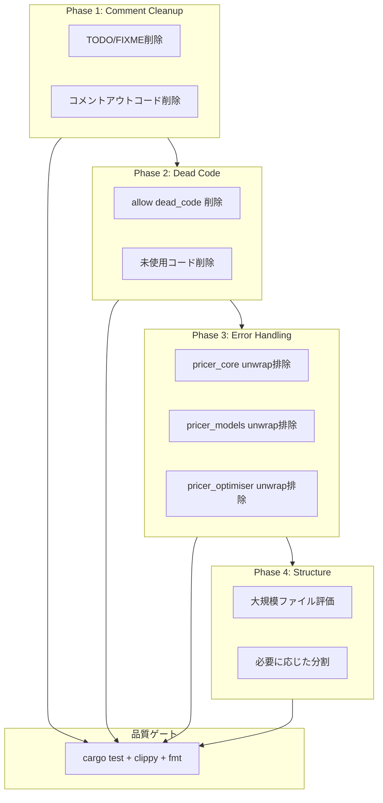
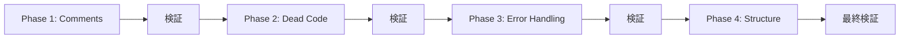

# Design Document: codebase-cleanup-optimisation

## Overview

**Purpose**: Neutryx derivatives pricing libraryのコードベース全体に対するクリーンアップと最適化を実施し、コード品質・保守性・可読性を向上させる。

**Users**: 開発者がコードベースを理解・保守・拡張する際の認知負荷を軽減する。

**Impact**: 264ファイル、107,607行のコードベースから不要なコメント・コード・複雑性を削除し、最小限のコード行数・関数数・ファイル数でA-I-P-Sアーキテクチャ準拠を維持する。

### Goals

- 不要コメント（TODO/FIXME、コメントアウトコード）の完全削除
- unwrap/expect/panicのライブラリコードからの排除（260箇所）
- dead code（未使用関数・型・モジュール）の検出と削除
- ミニマリズム原則に基づくコード最適化
- 既存テスト・CI品質基準の維持

### Non-Goals

- 新機能の追加
- パフォーマンス最適化（アルゴリズム変更）
- APIの破壊的変更
- テストコード内のunwrap/expect排除（テストでは許容）

## Architecture

### Existing Architecture Analysis

Neutryx codebaseは以下の特性を持つ：

- **A-I-P-S階層**: Adapter→Infra→Pricer→Serviceの単方向依存
- **クレート構成**: 15クレート（A:3, I:3, P:5, S:3, D:4）
- **コード規模**: 264ファイル、107,607行
- **既存品質基準**: cargo fmt/clippy準拠、British English

本リファクタリングはこれらの構造を維持しつつ、コード品質を向上させる。

### Architecture Pattern & Boundary Map



**Architecture Integration**:
- **Selected pattern**: 段階的リファクタリング（リスクベース順序）
- **Domain boundaries**: 既存A-I-P-S境界を維持
- **Existing patterns preserved**: クレート構造、依存方向、命名規約
- **Steering compliance**: ai_rules.md（コメント規約）、structure.md（A-I-P-S）準拠

### Technology Stack

| Layer | Choice / Version | Role in Feature | Notes |
|-------|------------------|-----------------|-------|
| Build | Cargo / Rust 2021 | ビルド・テスト実行 | 既存構成維持 |
| Linting | clippy | dead code検出、unwrap警告 | `--warn=unused`活用 |
| Formatting | rustfmt | コードフォーマット検証 | 既存構成維持 |
| Testing | cargo test | 回帰テスト | 各フェーズで実行 |

## Requirements Traceability

| Requirement | Summary | Components | Phase |
|-------------|---------|------------|-------|
| 1.1 | 冗長コメント排除 | 全cratesファイル | Phase 1 |
| 1.2 | TODO/FIXME削除 | service_cli, service_gateway, adapter_fpml, pricer_pricing | Phase 1 |
| 1.3 | コメントアウトコード削除 | pricer_pricing | Phase 1 |
| 1.4 | 有意義コメント保持 | 全crates | Phase 1 |
| 1.5 | 論文引用維持 | pricer_models, pricer_core | Phase 1 |
| 2.1 | 単一責任原則 | 全crates | Phase 4 |
| 2.2 | A-I-P-S依存準拠 | 全crates | 既存準拠 |
| 2.3 | ファイル長500行目安 | 大規模ファイル30件 | Phase 4 |
| 2.4 | サブモジュール分離 | 必要に応じて | Phase 4 |
| 2.5 | mod.rs構造 | 全mod.rs | 既存良好 |
| 3.1 | 関数単一責務 | 全crates | Phase 4 |
| 3.2 | ネスト深度制限 | 全crates | Phase 4 |
| 3.3 | early return適用 | 全crates | Phase 3-4 |
| 3.4 | パラメータ構造体 | 全crates | 既存Builderパターン |
| 3.5 | 共通trait定義 | pricer_core | 既存整備済 |
| 3.6 | 適切なスコープ | 全crates | Phase 2-4 |
| 4.1 | 重複ロジック排除 | 全crates | Phase 2-4 |
| 4.2 | 共通関数抽出 | pricer_core | 既存smooth_*対応済 |
| 4.3 | テストヘルパー整備 | 全crates/tests | Phase 4 |
| 4.4 | 型/定数一元管理 | 全crates | 既存対応済 |
| 4.5 | 共通クレート活用 | pricer_core | 既存対応済 |
| 5.1 | テスト通過 | 全crates | 全Phase |
| 5.2 | cargo fmt合格 | 全crates | 全Phase |
| 5.3 | cargo clippy合格 | 全crates | 全Phase |
| 5.4 | British English | 全crates | 既存対応済 |
| 5.5 | テスト更新 | 変更対象 | Phase 3-4 |
| 5.6 | unwrap/expect排除 | pricer_core, pricer_models, pricer_optimiser | Phase 3 |
| 6.1 | 最小コード行数 | 全crates | 全Phase |
| 6.2 | 不要抽象化排除 | 全crates | Phase 2-4 |
| 6.3 | dead code排除 | 全crates | Phase 2 |
| 6.4 | 既存コード再利用 | 全crates | 全Phase |
| 6.5 | 最小ファイル数 | 全crates | Phase 4 |
| 6.6 | ラッパー関数インライン化 | 全crates | Phase 2 |
| 6.7 | YAGNI準拠 | 全crates | Phase 2 |

## Components and Interfaces

### Component Summary

| Component | Domain | Intent | Req Coverage | Phase | Contracts |
|-----------|--------|--------|--------------|-------|-----------|
| CommentCleaner | 全crates | 不要コメント削除 | 1.1-1.5 | 1 | - |
| DeadCodeRemover | 全crates | 未使用コード削除 | 6.2, 6.3, 6.6, 6.7 | 2 | - |
| ErrorHandlingRefactor | Pricer | unwrap→Result変換 | 5.6, 3.3 | 3 | Service |
| StructureOptimiser | 全crates | ファイル構造最適化 | 2.1-2.5, 3.1-3.2, 6.5 | 4 | - |
| QualityValidator | 全crates | 品質ゲート検証 | 5.1-5.5 | 全Phase | - |

### Phase 1: Comment Cleanup

#### CommentCleaner

| Field | Detail |
|-------|--------|
| Intent | 不要コメントの特定と削除 |
| Requirements | 1.1, 1.2, 1.3, 1.4, 1.5 |

**Responsibilities & Constraints**
- TODO/FIXME/HACKコメントの削除（16件）
- コメントアウトされたコードの削除（6件）
- 数学的導出・論文引用コメントの保持
- テスト内の期待値説明コメントの保持

**対象ファイル**

| ファイル | 種別 | 件数 |
|---------|------|-----|
| service_gateway/src/rest/handlers.rs | TODO | 3 |
| service_gateway/src/main.rs | TODO | 1 |
| service_cli/src/commands/report.rs | TODO | 2 |
| service_cli/src/commands/price.rs | TODO | 4 |
| service_cli/src/commands/calibrate.rs | TODO | 3 |
| adapter_fpml/src/parser.rs | TODO | 1 |
| pricer_pricing/src/irs_greeks/calculator.rs | TODO | 1 |
| pricer_pricing/src/irs_greeks/xva_demo.rs | TODO | 1 |
| pricer_pricing/src/verify_enzyme.rs | コメントアウト | 3 |
| pricer_pricing/src/mc/pricer_checkpoint.rs | コメントアウト | 3 |

**削除基準**
- 削除: `// TODO:`, `// FIXME:`, `// HACK:`, `// XXX:`
- 削除: コメントアウトされたコード行（`// let`, `// fn`, `// for`等）
- 保持: 数学公式説明（`// f(x) = ...`, `// smooth_max(...) = ...`）
- 保持: docstring（`///`, `//!`）
- 保持: 安全性・制約説明コメント

### Phase 2: Dead Code Removal

#### DeadCodeRemover

| Field | Detail |
|-------|--------|
| Intent | 未使用コードの検出と削除 |
| Requirements | 6.2, 6.3, 6.6, 6.7 |

**Responsibilities & Constraints**
- `#[allow(dead_code)]`アトリビュートの削除と検証
- 未使用関数・型・トレイト・モジュールの削除
- 1-2行ラッパー関数のインライン化検討
- YAGNI違反コードの特定と削除

**対象ファイル（#[allow(dead_code)]）**

| ファイル | 件数 |
|---------|-----|
| service_gateway/src/rest/handlers.rs | 3 |
| service_gateway/src/config.rs | 1 |
| service_cli/src/config.rs | 5 |
| pricer_pricing/src/rng/qmc.rs | 2 |
| pricer_pricing/src/enzyme/checkpoint_ad.rs | 1 |
| pricer_optimiser/src/bootstrapping/curve_builder.rs | 1 |
| pricer_models/src/calibration/model_calibrator.rs | 2 |

**検出方法**
```bash
cargo clippy --all-targets -- -W dead_code -W unused_imports -W unused_variables
```

**削除基準**
- 削除: `#[allow(dead_code)]`で抑制された本当に未使用のコード
- 削除: 呼び出されていないpub関数
- 削除: 使用されていない型定義
- 保持: 将来のAPI互換性のために必要な公開インターフェース
- 検討: 1-2行のラッパー関数→インライン化

### Phase 3: Error Handling Refactor

#### ErrorHandlingRefactor

| Field | Detail |
|-------|--------|
| Intent | unwrap/expect/panicをResultベースエラー処理に変換 |
| Requirements | 5.6, 3.3 |

**Responsibilities & Constraints**
- ライブラリコード内のunwrap/expect排除（260箇所）
- テスト/ベンチマークコードは変更対象外
- early returnパターンの適用
- 適切なエラー型の活用

**対象クレートと優先順位**

| クレート | 箇所数 | 優先度 | 理由 |
|---------|-------|-------|------|
| pricer_core | ~150 | P0 | 基盤クレート、他クレートの依存元 |
| pricer_models | ~80 | P1 | pricer_coreに依存 |
| pricer_optimiser | ~30 | P2 | pricer_core/modelsに依存 |

**変換パターン**

| Before | After |
|--------|-------|
| `option.unwrap()` | `option.ok_or(Error::NoneValue)?` |
| `result.expect("msg")` | `result?` または `result.map_err(|e| Error::from(e))?` |
| `vec[index]` | `vec.get(index).ok_or(Error::IndexOutOfBounds)?` |

##### Service Interface（エラー型）

```rust
// pricer_core/src/types/error.rs に統合
pub enum CoreError {
    // 既存エラー型を活用
    InvalidInput { field: &'static str, reason: String },
    IndexOutOfBounds { index: usize, len: usize },
    NoneValue { context: &'static str },
    // ...
}
```

- Preconditions: 入力値の検証
- Postconditions: Result型で成功/失敗を明示
- Invariants: パニックしない、エラーは呼び出し元に伝播

### Phase 4: Structure Optimisation

#### StructureOptimiser

| Field | Detail |
|-------|--------|
| Intent | ファイル構造の評価と最適化 |
| Requirements | 2.1-2.5, 3.1-3.2, 6.5 |

**Responsibilities & Constraints**
- 大規模ファイル（500行超）の構造評価
- 論理的分割の価値がある場合のみ分割
- ミニマリズム原則（最小ファイル数）を優先
- 単一責任原則との両立

**評価対象ファイル（上位10件）**

| ファイル | 行数 | 分割判定 | 理由 |
|---------|-----|---------|------|
| pricer_models/models/sabr.rs | 2,919 | 要評価 | パラメータ/公式/MC/テスト混在 |
| pricer_models/models/heston.rs | 2,673 | 要評価 | 同上 |
| pricer_pricing/irs_greeks/lazy_evaluator.rs | 2,093 | 非分割 | 単一責務（遅延評価） |
| pricer_pricing/irs_greeks/benchmark.rs | 1,649 | 非分割 | ベンチマーク単体 |
| pricer_pricing/mc/pricer.rs | 1,565 | 要評価 | 複数機能混在の可能性 |
| pricer_pricing/irs_greeks/xva_demo.rs | 1,502 | 非分割 | デモコード |
| pricer_pricing/graph/extractor.rs | 1,435 | 非分割 | 単一責務（グラフ抽出） |
| pricer_core/types/time.rs | 1,415 | 要評価 | Date/DayCount/YearFraction |
| pricer_core/math/smoothing.rs | 1,256 | 非分割 | 関連関数群 |
| pricer_models/calibration/heston.rs | 1,178 | 非分割 | キャリブレーション単体 |

**分割基準**
- 分割する: 独立した責務が明確に存在し、それぞれが200行以上
- 分割しない: 関連関数群、ベンチマーク、デモ、テスト
- 分割しない: 分割後のファイルが100行未満になる場合

### Quality Validator

#### QualityValidator

| Field | Detail |
|-------|--------|
| Intent | 各フェーズの品質ゲート検証 |
| Requirements | 5.1, 5.2, 5.3, 5.4, 5.5 |

**検証コマンド**
```bash
# 各フェーズ完了時に実行
cargo fmt --all -- --check
cargo clippy --all-targets -- -D warnings
cargo test --workspace --exclude pricer_pricing
cargo test -p pricer_pricing  # nightly環境
```

**合格基準**
- 全テスト通過（既存テスト数を維持）
- clippy警告ゼロ
- フォーマット差分ゼロ

## Error Handling

### Error Strategy

- Phase 1-2: エラー発生なし（コメント/コード削除のみ）
- Phase 3: 既存エラー型を活用、新規エラーバリアントは最小限
- Phase 4: 構造変更によるコンパイルエラーは即座に修正

### Error Categories and Responses

**コンパイルエラー**: ファイル分割・関数シグネチャ変更時 → 即座に修正
**テスト失敗**: 回帰バグ → 変更をロールバックし原因調査
**clippy警告**: 新規警告 → 警告内容に従い修正

## Testing Strategy

### Unit Tests
- 既存テストの維持（変更なし）
- unwrap排除後の新しいエラーパスのテスト追加

### Integration Tests
- 各フェーズ完了時に`cargo test --workspace`実行
- pricer_pricing専用テスト（nightly環境）

### Regression Tests
- 変更前後でテスト数が減少しないことを確認
- カバレッジの維持（可能であれば測定）

## Performance & Scalability

**目標**: リファクタリングによるパフォーマンス低下なし
**検証**: 既存ベンチマークで確認（criterion）
**許容範囲**: ±5%以内の変動

## Migration Strategy



**Phase 1 (S: 1-2日)**: 不要コメント削除 → 検証
**Phase 2 (S: 1-2日)**: dead code削除 → 検証
**Phase 3 (M: 3-5日)**: unwrap排除（クレート単位） → 各クレート後に検証
**Phase 4 (M: 2-3日)**: 構造評価・最適化 → 検証

**ロールバック戦略**: 各フェーズは独立したコミット/PRとし、問題発生時は該当フェーズのみリバート

## Supporting References

詳細な調査結果と設計判断の根拠は`research.md`を参照。
