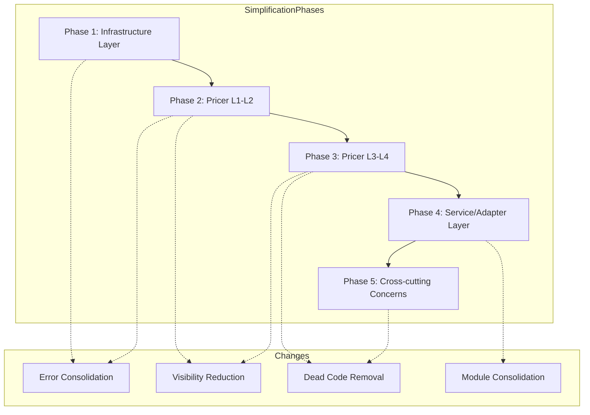
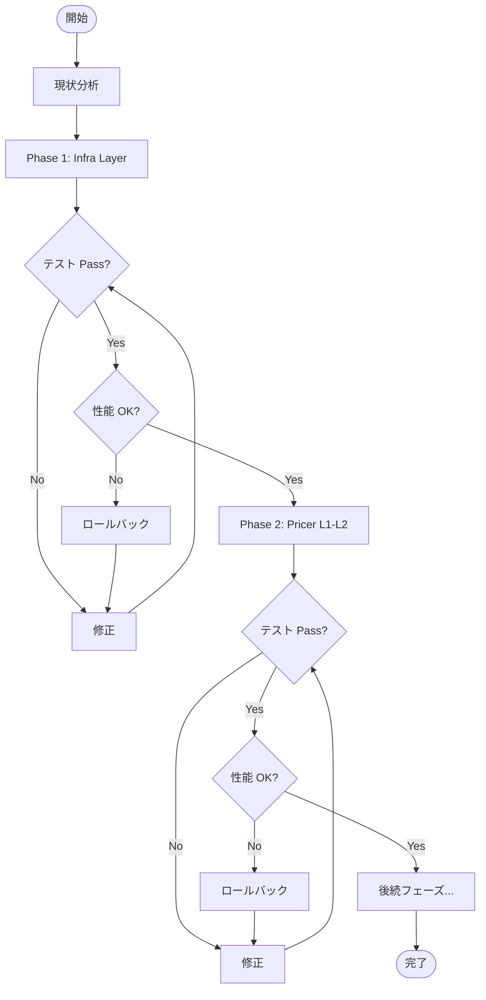
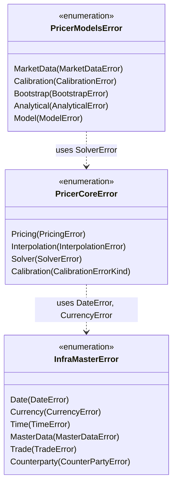

# Technical Design Document

## Overview

**Purpose**: 本機能は、Neutryx デリバティブ価格計算ライブラリのコードベースを簡略化し、保守性と可読性を向上させる。

**Users**: 開発者、ライブラリ利用者、ビルド管理者が、より整理されたコードベースで作業できるようになる。

**Impact**: 既存の A-I-P-S アーキテクチャを維持しながら、コード重複の削減、API 表面の最小化、未使用コードの除去を実施する。

### Goals
- コードベース全体の可読性と保守性の向上
- コンパイル時間の維持または改善
- 機能・性能の完全な維持
- A-I-P-S 依存関係ルールの遵守

### Non-Goals
- 新機能の追加
- アーキテクチャの変更
- API の破壊的変更（非推奨期間なし）
- 外部依存関係の大幅な変更

## Architecture

### Existing Architecture Analysis

現在の A-I-P-S アーキテクチャは維持する:

```text
A: Adapter   → adapter_feeds, adapter_fpml, adapter_loader
I: Infra     → infra_config, infra_domain, infra_store
P: Pricer    → pricer_core (L1), pricer_models (L2), pricer_pricing (L3), pricer_risk (L4)
S: Service   → service_cli, service_gateway, service_python
```

**現状の課題**:
- 44個のエラー型が分散（詳細は `research.md` 参照）
- `pub(crate)` の使用が5箇所のみ
- 小規模モジュール（50行未満）が約30件
- 依存関係の重複（rand, getrandom）

### Architecture Pattern & Boundary Map



**Architecture Integration**:
- **Selected pattern**: 段階的リファクタリング（A-I-P-S 境界でグループ化）
- **Domain boundaries**: 各フェーズは A-I-P-S の依存関係ルールに従い、下位層から上位層へ進行
- **Existing patterns preserved**: A-I-P-S 一方向データフロー、Static Dispatch、thiserror 標準
- **New components rationale**: 新規コンポーネントは追加しない（既存の整理のみ）
- **Steering compliance**: structure.md, tech.md, error-handling.md に準拠

### Technology Stack

| Layer | Choice / Version | Role in Feature | Notes |
|-------|------------------|-----------------|-------|
| Build | Cargo workspace | 依存関係分析、feature 管理 | `cargo tree --duplicates` で重複検出 |
| Lint | Clippy pedantic | 未使用コード検出、品質維持 | `#[allow(dead_code)]` の監視 |
| Test | cargo test | リグレッション検出 | 全テスト必須パス |
| Benchmark | criterion | 性能維持の検証 | 5% 劣化閾値 |

## System Flows

### 段階的リファクタリングフロー



## Requirements Traceability

| Requirement | Summary | Components | Interfaces | Flows |
|-------------|---------|------------|------------|-------|
| 1.1, 1.2, 1.3 | コード重複削減 | ErrorConsolidator, TestHelpers | N/A | Phase 1-3 |
| 2.1, 2.2, 2.3 | API 表面最小化 | VisibilityAnalyzer | N/A | Phase 2-4 |
| 3.1, 3.2, 3.3 | モジュール合理化 | ModuleConsolidator | N/A | Phase 4 |
| 4.1, 4.2, 4.3, 4.4 | 未使用コード除去 | DeadCodeRemover | N/A | Phase 3, 5 |
| 5.1, 5.2, 5.3 | 型定義簡略化 | TypeSimplifier | N/A | Phase 2-3 |
| 6.1, 6.2, 6.3 | エラー処理統一 | ErrorConsolidator | ErrorCategory | Phase 1-3 |
| 7.1, 7.2, 7.3 | Feature フラグ整理 | FeatureAnalyzer | N/A | Phase 5 |
| 8.1, 8.2, 8.3, 8.4, 8.5 | 性能維持 | BenchmarkRunner | N/A | 全フェーズ |
| 9.1, 9.2, 9.3, 9.4 | テストカバレッジ | TestMigrator | N/A | 全フェーズ |
| 10.1, 10.2, 10.3 | ドキュメント簡略化 | DocUpdater | N/A | Phase 5 |

## Components and Interfaces

| Component | Domain/Layer | Intent | Req Coverage | Key Dependencies | Contracts |
|-----------|--------------|--------|--------------|------------------|-----------|
| ErrorConsolidator | Cross-cutting | エラー型の層別統合 | 1, 6 | thiserror (P0) | State |
| VisibilityAnalyzer | Cross-cutting | pub(crate) 適用候補の特定 | 2 | cargo doc (P1) | N/A |
| DeadCodeRemover | Cross-cutting | 未使用コードの特定・削除 | 4 | clippy (P0) | N/A |
| ModuleConsolidator | Cross-cutting | 小規模モジュールの統合 | 3 | N/A | N/A |
| TypeSimplifier | Pricer | 複雑な型定義の簡略化 | 5 | N/A | N/A |
| FeatureAnalyzer | Build | Feature フラグの整理 | 7 | cargo (P0) | N/A |
| BenchmarkRunner | Test | 性能維持の検証 | 8 | criterion (P0) | N/A |
| TestMigrator | Test | テストの移動・更新 | 9 | cargo test (P0) | N/A |

### Cross-cutting Concerns

#### ErrorConsolidator

| Field | Detail |
|-------|--------|
| Intent | エラー型を A-I-P-S 層別に統合し、重複を解消する |
| Requirements | 1.1, 1.2, 6.1, 6.2, 6.3, 6.4, 6.5 |

**Responsibilities & Constraints**
- DateError, CurrencyError の重複解消（infra_domain を正とする）
- 共通エラーカテゴリ（InvalidInput, NotConverged, NumericalError）の抽出
- thiserror を全エラー型で使用
- A-I-P-S 依存関係ルールの遵守

**Dependencies**
- Inbound: 各クレートのエラー型 — 統合対象 (P0)
- External: thiserror — エラー型 derive (P0)

**Contracts**: State [x]

##### State Management

**エラー型の層別配置**:

```text
Infra 層 (infra_domain):
├── DateError        → 日付操作エラー（正規の定義）
├── CurrencyError    → 通貨操作エラー（正規の定義）
├── TimeError        → 時間操作エラー
├── MasterDataError  → マスターデータ全般
├── TradeError       → 取引構築エラー
└── CounterPartyError → カウンターパーティエラー

Pricer Core 層 (pricer_core):
├── PricingError     → 価格計算エラー
├── InterpolationError → 補間エラー
├── SolverError      → ソルバーエラー
└── CalibrationErrorKind → キャリブレーションエラー種別
    （DateError, CurrencyError は infra_domain から re-export）

Pricer Models 層 (pricer_models):
├── MarketDataError  → 市場データエラー
├── CalibrationError → キャリブレーションエラー
├── BootstrapError   → ブートストラップエラー
├── AnalyticalError  → 解析解エラー
└── ModelError (新規) → モデル固有エラー（Heston, SABR, Correlation 統合）

Pricer Pricing 層 (pricer_pricing):
├── MonteCarloConfigError → MC設定エラー
├── GreeksError (新規) → Greeks 関連エラー統合
└── GraphError       → 計算グラフエラー

Pricer Risk 層 (pricer_risk):
├── XvaError         → XVA エラー
├── PortfolioError   → ポートフォリオエラー
└── ScenarioError (新規) → シナリオ関連エラー統合
```

**Implementation Notes**
- Integration: `pub use infra_domain::DateError;` で pricer_core から re-export
- Validation: 全エラー型が `thiserror::Error` を derive していることを確認
- Risks: 既存コードへの影響（From 変換の更新が必要）

#### VisibilityAnalyzer

| Field | Detail |
|-------|--------|
| Intent | 内部実装詳細を `pub(crate)` に変更し、API 表面を最小化する |
| Requirements | 2.1, 2.2, 2.3, 2.4, 2.5 |

**Responsibilities & Constraints**
- 外部クレートからの利用パターン分析
- prelude 以外の内部型を `pub(crate)` に変更
- 破壊的変更が必要な場合は deprecated アノテーション

**可視性変更基準**:

| 現在の可視性 | 条件 | 変更後 |
|-------------|------|--------|
| `pub` | 外部クレートから未使用 | `pub(crate)` |
| `pub` | prelude にエクスポート | 維持 |
| `pub` | ドキュメント化されている | 維持 |
| `pub` | テストからのみ使用 | `pub(crate)` + `#[cfg(test)]` |

**Implementation Notes**
- Integration: `cargo doc` で公開 API を確認、外部利用を分析
- Validation: 変更後に全クレートのビルドが成功することを確認
- Risks: 外部利用者への影響（破壊的変更時は deprecated 期間を設ける）

#### DeadCodeRemover

| Field | Detail |
|-------|--------|
| Intent | 未使用コードを特定し削除する |
| Requirements | 4.1, 4.2, 4.3, 4.4, 4.5 |

**Responsibilities & Constraints**
- `#[allow(dead_code)]` アノテーションの必要性評価
- 未使用 feature フラグの特定
- 未使用依存関係の除去

**削除対象の評価基準**:

```text
#[allow(dead_code)] の評価:
├── 将来の API → 維持（理由をコメントで記載）
├── テスト用 → #[cfg(test)] に移動
├── デモ用 → demo クレートに移動
└── 不要 → 削除

未使用依存関係:
├── dev-dependencies → 維持
├── optional (feature-gated) → feature 使用状況を確認
└── 未使用 → Cargo.toml から削除
```

**Implementation Notes**
- Integration: `cargo clippy -- -W dead_code` で検出
- Validation: 削除後に全テストがパスすることを確認
- Risks: 将来必要になる可能性のあるコードの誤削除

## Data Models

### エラー型統合モデル



## Error Handling

### Error Strategy

既存の thiserror ベースのエラー処理パターンを維持しつつ、以下を改善:

1. **重複エラー型の解消**: DateError, CurrencyError を infra_domain に一元化
2. **From 変換の簡略化**: 過度に複雑な変換チェーンを整理
3. **エラーメッセージの一貫性**: 診断情報を含む構造化エラー

### Error Categories and Responses

**Pricer Layer Errors**:
- `InvalidInput` → パラメータ検証エラー（即座に返却）
- `NotConverged` → 数値計算の収束失敗（反復回数、残差を含む）
- `NumericalError` → 数値不安定性（詳細メッセージ）

## Testing Strategy

### Unit Tests
- エラー型の From 変換テスト
- 可視性変更後のコンパイル確認
- 統合されたモジュールの機能テスト

### Integration Tests
- A-I-P-S 依存関係ルールの遵守確認
- 全クレートのビルド成功
- 既存の統合テスト全てパス

### Performance Tests
- criterion ベンチマーク（既存）の実行
- 5% 以上の劣化がないことを確認
- コンパイル時間の計測

## Performance & Scalability

### Target Metrics

| Metric | Target | Measurement |
|--------|--------|-------------|
| ベンチマーク性能 | 劣化 5% 以内 | criterion |
| インクリメンタルビルド | 維持または改善 | cargo build --timings |
| バイナリサイズ | 増加なし | cargo bloat |
| テスト実行時間 | 維持 | cargo test --timings |

### Optimization Approach

- **ゼロアロケーションホットパス維持**: Monte Carlo シミュレーションのコード変更は最小限
- **Static Dispatch 維持**: enum ベースのディスパッチを継続
- **Rayon 並列処理維持**: 並列処理コードへの変更は避ける

## Migration Strategy

### Phase 1: Infrastructure Layer (infra_*)

1. DateError, CurrencyError を infra_domain に一元化
2. pricer_core から re-export 設定
3. 全クレートのビルド確認
4. テスト実行

### Phase 2: Pricer L1-L2 (pricer_core, pricer_models)

1. 重複エラー型の統合（HestonError, SABRError → ModelError）
2. pub(crate) の適用
3. 小規模モジュールの統合検討
4. ベンチマーク実行

### Phase 3: Pricer L3-L4 (pricer_pricing, pricer_risk)

1. Greeks 関連エラーの統合
2. Scenario 関連エラーの統合
3. 未使用コードの削除
4. ベンチマーク実行

### Phase 4: Service/Adapter Layer

1. モジュール構造の見直し
2. 可視性の調整
3. 全テスト実行

### Phase 5: Cross-cutting Concerns

1. Feature フラグの整理
2. ドキュメントの更新
3. 未使用依存関係の除去
4. 最終ベンチマーク

### Rollback Triggers

- テスト失敗
- 性能劣化 5% 以上
- A-I-P-S 依存関係ルール違反

### Validation Checkpoints

各フェーズ完了時:
1. `cargo test --workspace`
2. `cargo clippy --workspace -- -D warnings`
3. `cargo bench` (該当する場合)
4. `cargo tree --duplicates` (依存関係確認)
