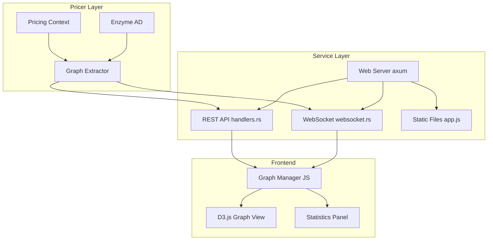
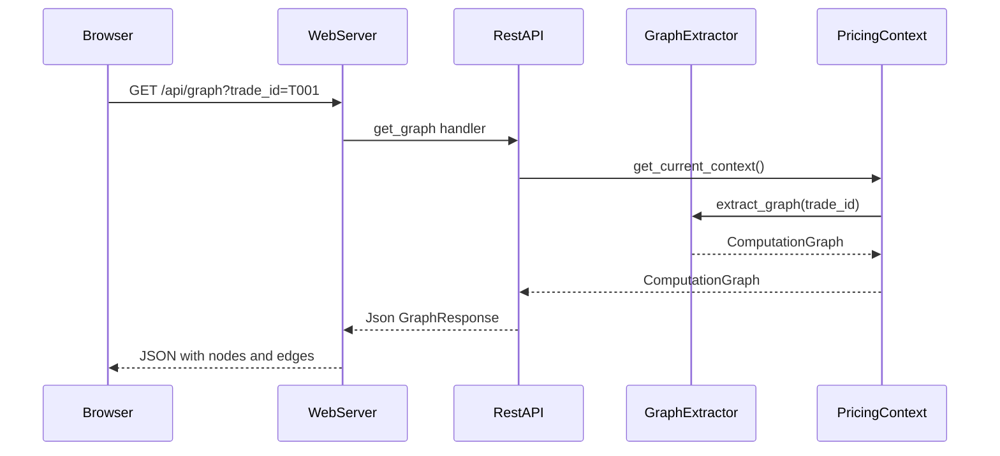
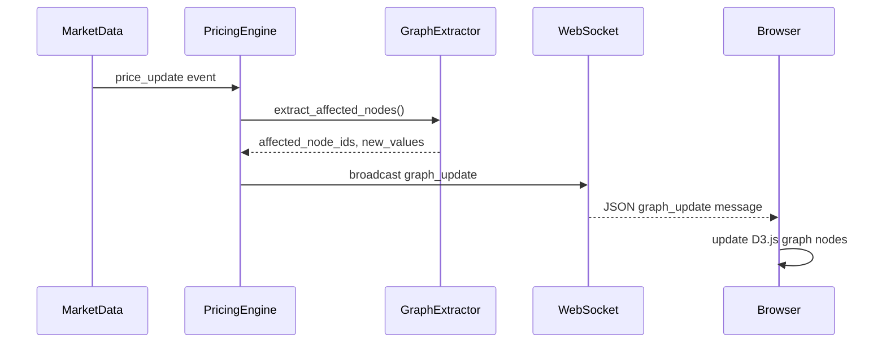
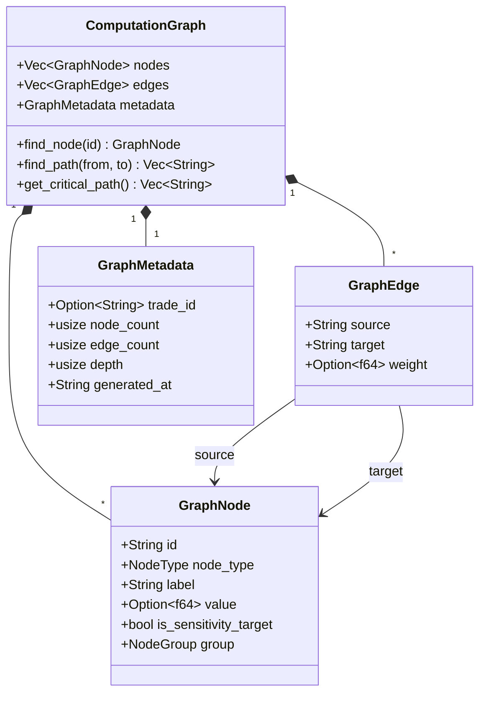

# Design Document

## Overview

**目的**: 本機能は、FrictionalBank デモダッシュボードに計算グラフの動的可視化機能を提供する。Enzyme ベースの自動微分（AD）エンジンが使用する依存関係グラフを、リアルタイムで視覚的に表示することで、クオンツ開発者およびリサーチャーがプライシング計算の構造と感応度パスを直感的に理解・分析できるようにする。

**ユーザー**: クオンツ開発者、クオンツ・リサーチャー、デモ利用者が、プライシングワークフロー（EOD、Intraday、Stress Test）のデバッグ、検証、および教育目的でこの機能を使用する。

**影響**: 既存の FrictionalBank Web ダッシュボード（localhost:3000）に新規「Graph」タブを追加し、REST API エンドポイント（`/api/graph`）および WebSocket メッセージタイプ（`graph_update`）を拡張する。

### Goals

- 計算グラフのノードとエッジを抽出し、JSON 形式で API 経由で提供する
- D3.js force-directed layout による直感的なインタラクティブ可視化
- マーケットデータ更新時のリアルタイムグラフ更新（WebSocket）
- 10,000 ノード規模のグラフを 60fps でレンダリング（Canvas/WebGL 併用）
- 既存ワークフロー（EOD、Intraday、Stress Test）との統合

### Non-Goals

- スタンドアロン CLI での DOT/JSON ファイル出力（本機能のスコープ外）
- Python バインディング経由のグラフアクセス（将来検討）
- Enzyme 内部の LLVM IR レベルのグラフ可視化（抽象化されたプライシンググラフのみ）
- グラフの編集・変更機能（読み取り専用）

## Architecture

> 詳細な調査結果は `research.md` を参照。本ドキュメントでは設計決定と契約を記載する。

### Existing Architecture Analysis

**現行アーキテクチャ**:
- **A-I-P-S 単方向データフロー**: Adapter → Infra → Pricer → Service
- **既存 Web ダッシュボード**: axum REST API + WebSocket + D3.js + Bento Grid レイアウト
- **プライシング基盤**: pricer_pricing (L3) に Monte Carlo + Enzyme AD

**統合ポイント**:
- `demo/gui/src/web/handlers.rs`: REST API ハンドラ追加
- `demo/gui/src/web/websocket.rs`: `graph_update` メッセージタイプ追加
- `demo/gui/static/app.js`: Graph タブとビジュアライゼーション追加
- `crates/pricer_pricing/src/`: グラフ抽出モジュール追加

**既存パターン**:
- `State<Arc<AppState>>` + `Json<Response>` パターン
- `RealTimeUpdate` 構造体による WebSocket メッセージ
- `navigateTo(viewName)` によるタブナビゲーション

### Architecture Pattern & Boundary Map



**アーキテクチャ統合**:
- **採用パターン**: 拡張パターン（既存 FrictionalBank アーキテクチャを拡張）
- **ドメイン境界**: グラフ抽出は Pricer レイヤー、API/UI は Service レイヤー
- **維持される既存パターン**: A-I-P-S 単方向フロー、axum ハンドラパターン、D3.js チャート
- **新規コンポーネントの根拠**: グラフ抽出は AD 計算と密結合のため Pricer に配置
- **ステアリング準拠**: Pricer は Service/Adapter に依存しない

### Technology Stack

| レイヤー | 選択/バージョン | 機能における役割 | 備考 |
|---------|----------------|-----------------|------|
| フロントエンド | D3.js v7 | Force-directed グラフ描画 | 既存依存、Canvas フォールバック追加 |
| バックエンド | axum 0.7 | REST API + WebSocket | 既存依存 |
| シリアライゼーション | serde_json 1.x | グラフデータの JSON 変換 | 既存依存 |
| データ構造 | 新規 Rust 構造体 | ComputationGraph, GraphNode, GraphEdge | pricer_pricing 内 |

## System Flows

### グラフ取得フロー（REST API）



### リアルタイム更新フロー（WebSocket）



**主要な決定事項**:
- REST API でグラフ全体を取得、WebSocket で差分更新のみ送信
- グラフ抽出はプライシング後にオンデマンドで実行（常時抽出ではない）

## Requirements Traceability

| 要件 | 概要 | コンポーネント | インターフェース | フロー |
|------|------|---------------|-----------------|--------|
| 1.1 | グラフノード・エッジ収集 | GraphExtractor | GraphExtractor trait | - |
| 1.2-1.4 | ノード属性（ID、タイプ、ラベル）| GraphNode | - | - |
| 1.5 | JSON シリアライゼーション | ComputationGraph | Serialize derive | REST API |
| 2.1-2.2 | GET /api/graph エンドポイント | RestAPI | get_graph handler | グラフ取得 |
| 2.3 | trade_id フィルタリング | RestAPI | Query parameter | グラフ取得 |
| 2.4 | メタデータ（ノード数、深度）| GraphMetadata | - | - |
| 2.5 | 404 エラー処理 | RestAPI | GraphError | - |
| 2.6 | 500ms 以内レスポンス | GraphExtractor | - | - |
| 3.1-3.3 | graph_update メッセージ | WebSocket | RealTimeUpdate | リアルタイム更新 |
| 3.4-3.5 | サブスクリプション | WebSocket | subscribe_graph | - |
| 4.1 | Graph タブ追加 | D3GraphView | - | - |
| 4.2 | Force-directed layout | D3GraphView | D3.js simulation | - |
| 4.3 | ノードホバー・ツールチップ | D3GraphView | - | - |
| 4.4-4.5 | ズーム・パン・検索 | D3GraphView | - | - |
| 4.6-4.7 | LOD、Sensitivity Path | D3GraphView | - | - |
| 4.8 | ノードタイプ色分け | D3GraphView | - | - |
| 5.1-5.5 | 統計パネル | StatsPanel | - | - |
| 6.1-6.5 | ワークフロー統合 | WorkflowIntegration | - | - |
| 7.1-7.5 | パフォーマンス要件 | GraphExtractor, D3GraphView | - | - |

## Components and Interfaces

### コンポーネント概要

| コンポーネント | ドメイン/レイヤー | 意図 | 要件カバレッジ | 主要依存（P0/P1）| 契約 |
|---------------|-----------------|------|---------------|-----------------|------|
| GraphExtractor | Pricer (L3) | 計算グラフ抽出 | 1.1-1.5, 7.1, 7.3 | PricingContext (P0) | Service |
| GraphNode | Pricer (L3) | ノードデータ構造 | 1.2-1.4 | - | State |
| GraphEdge | Pricer (L3) | エッジデータ構造 | 1.3 | - | State |
| ComputationGraph | Pricer (L3) | グラフ全体構造 | 1.5, 2.4 | GraphNode, GraphEdge (P0) | State, API |
| RestAPI (graph) | Service | /api/graph ハンドラ | 2.1-2.6 | GraphExtractor (P0) | API |
| WebSocket (graph) | Service | graph_update 配信 | 3.1-3.5 | AppState (P0) | Event |
| D3GraphView | Frontend | グラフ可視化 | 4.1-4.8, 7.2, 7.4 | GraphManager (P0) | State |
| StatsPanel | Frontend | 統計表示 | 5.1-5.5 | GraphManager (P0) | State |
| GraphManager | Frontend | 状態管理 | 4.1, 3.4 | - | State |

### Pricer Layer

#### GraphExtractor

| フィールド | 詳細 |
|-----------|------|
| 意図 | プライシングコンテキストから計算グラフを抽出し、JSON シリアライズ可能な形式に変換する |
| 要件 | 1.1, 1.2, 1.3, 1.4, 1.5, 7.1, 7.3 |

**責務と制約**
- プライシング関数実行後の計算グラフ構造を抽出
- 各ノードの演算タイプ、入力変数名、値を収集
- 微分対象パラメータを `is_sensitivity_target: true` でマーク
- 10,000 ノードを 1 秒以内に抽出
- プライシング計算への影響を 5% 以内に制限

**依存関係**
- Inbound: PricingContext — グラフ抽出元 (P0)
- Outbound: ComputationGraph — 抽出結果 (P0)
- External: なし

**契約**: Service [x] / API [ ] / Event [ ] / Batch [ ] / State [ ]

##### Service Interface

```rust
/// 計算グラフ抽出トレイト
pub trait GraphExtractable {
    /// 指定トレードの計算グラフを抽出
    fn extract_graph(&self, trade_id: Option<&str>) -> Result<ComputationGraph, GraphError>;

    /// 更新されたノードのみを抽出（差分更新用）
    fn extract_affected_nodes(&self, trade_id: &str) -> Result<Vec<GraphNodeUpdate>, GraphError>;
}

/// グラフ抽出エラー
#[derive(Debug, Clone, Serialize)]
pub enum GraphError {
    TradeNotFound(String),
    ExtractionFailed(String),
    Timeout,
}
```

- 前提条件: プライシングが実行済みであること
- 事後条件: `ComputationGraph` が有効なノード・エッジを含む
- 不変条件: グラフは DAG（非循環有向グラフ）

**実装ノート**
- 統合: PricingContext の `price_single_trade` 後に呼び出し
- バリデーション: trade_id の存在確認、ノード数上限チェック
- リスク: Enzyme AD の内部状態アクセスが将来変更される可能性

---

#### ComputationGraph

| フィールド | 詳細 |
|-----------|------|
| 意図 | 計算グラフ全体を表現し、JSON シリアライゼーションに対応する |
| 要件 | 1.5, 2.4 |

**責務と制約**
- ノード配列とエッジ配列を保持
- メタデータ（総ノード数、総エッジ数、グラフ深度、生成日時）を提供
- D3.js 互換の `{ nodes: [...], links: [...] }` 形式

**契約**: Service [ ] / API [x] / Event [ ] / Batch [ ] / State [x]

##### State Management

```rust
/// 計算グラフ構造体
#[derive(Debug, Clone, Serialize)]
pub struct ComputationGraph {
    /// ノード配列
    pub nodes: Vec<GraphNode>,
    /// エッジ配列（D3.js 互換で "links" としてシリアライズ）
    #[serde(rename = "links")]
    pub edges: Vec<GraphEdge>,
    /// メタデータ
    pub metadata: GraphMetadata,
}

/// グラフノード
#[derive(Debug, Clone, Serialize)]
pub struct GraphNode {
    /// 一意識別子
    pub id: String,
    /// 演算タイプ（add, mul, exp, log, input, output）
    #[serde(rename = "type")]
    pub node_type: NodeType,
    /// 表示ラベル（変数名または演算名）
    pub label: String,
    /// 現在値（計算結果）
    pub value: Option<f64>,
    /// 微分対象パラメータか
    pub is_sensitivity_target: bool,
    /// ノードグループ（入力、中間、出力）
    pub group: NodeGroup,
}

/// グラフエッジ
#[derive(Debug, Clone, Serialize)]
pub struct GraphEdge {
    /// 入力ノード ID
    pub source: String,
    /// 出力ノード ID
    pub target: String,
    /// エッジの重み（オプション）
    pub weight: Option<f64>,
}

/// グラフメタデータ
#[derive(Debug, Clone, Serialize)]
pub struct GraphMetadata {
    /// トレード ID
    pub trade_id: Option<String>,
    /// 総ノード数
    pub node_count: usize,
    /// 総エッジ数
    pub edge_count: usize,
    /// グラフ深度（最長パス）
    pub depth: usize,
    /// 生成日時（ISO 8601）
    pub generated_at: String,
}

/// ノードタイプ列挙
#[derive(Debug, Clone, Copy, Serialize, PartialEq)]
#[serde(rename_all = "lowercase")]
pub enum NodeType {
    Input,
    Add,
    Mul,
    Exp,
    Log,
    Sqrt,
    Div,
    Output,
    Custom(u8),
}

/// ノードグループ（可視化用）
#[derive(Debug, Clone, Copy, Serialize, PartialEq)]
#[serde(rename_all = "lowercase")]
pub enum NodeGroup {
    Input,
    Intermediate,
    Output,
    Sensitivity,
}
```

---

### Service Layer

#### REST API (Graph)

| フィールド | 詳細 |
|-----------|------|
| 意図 | /api/graph エンドポイントで計算グラフデータを JSON 形式で提供 |
| 要件 | 2.1, 2.2, 2.3, 2.4, 2.5, 2.6 |

**責務と制約**
- `GET /api/graph`: 現在のプライシング計算グラフを返却
- `GET /api/graph?trade_id=xxx`: 特定トレードのグラフを返却
- 404: グラフが存在しない場合
- 500ms 以内のレスポンスタイム

**依存関係**
- Inbound: WebServer — HTTP リクエスト (P0)
- Outbound: GraphExtractor — グラフ抽出 (P0)
- External: なし

**契約**: Service [ ] / API [x] / Event [ ] / Batch [ ] / State [ ]

##### API Contract

| メソッド | エンドポイント | リクエスト | レスポンス | エラー |
|---------|--------------|-----------|-----------|--------|
| GET | /api/graph | Query: trade_id (optional) | GraphResponse | 404, 500 |

```rust
/// グラフ API レスポンス
#[derive(Debug, Serialize)]
pub struct GraphResponse {
    pub nodes: Vec<GraphNode>,
    pub links: Vec<GraphEdge>,
    pub metadata: GraphMetadata,
}

/// グラフ取得ハンドラ
pub async fn get_graph(
    State(state): State<Arc<AppState>>,
    Query(params): Query<GraphQueryParams>,
) -> Result<Json<GraphResponse>, (StatusCode, Json<ErrorResponse>)>;

/// クエリパラメータ
#[derive(Debug, Deserialize)]
pub struct GraphQueryParams {
    pub trade_id: Option<String>,
}
```

**実装ノート**
- 統合: `demo/gui/src/web/handlers.rs` に追加
- バリデーション: trade_id の形式チェック
- リスク: 大規模グラフでのメモリ使用量

---

#### WebSocket (Graph)

| フィールド | 詳細 |
|-----------|------|
| 意図 | graph_update メッセージによるリアルタイムグラフ更新配信 |
| 要件 | 3.1, 3.2, 3.3, 3.4, 3.5 |

**責務と制約**
- 既存 `/api/ws` に `graph_update` メッセージタイプを追加
- マーケットデータ更新時に影響ノードの差分をブロードキャスト
- サブスクリプション機能で特定トレードのみフィルタリング

**依存関係**
- Inbound: PricingEngine — price_update イベント (P0)
- Outbound: WebSocket clients — ブロードキャスト (P0)
- External: なし

**契約**: Service [ ] / API [ ] / Event [x] / Batch [ ] / State [ ]

##### Event Contract

```rust
/// グラフ更新メッセージ
impl RealTimeUpdate {
    /// グラフ更新イベント作成
    pub fn graph_update(
        trade_id: &str,
        updated_nodes: Vec<GraphNodeUpdate>,
    ) -> Self {
        Self {
            update_type: "graph_update".to_string(),
            timestamp: chrono::Utc::now().timestamp_millis(),
            data: serde_json::json!({
                "trade_id": trade_id,
                "updated_nodes": updated_nodes
            }),
        }
    }
}

/// ノード更新情報
#[derive(Debug, Clone, Serialize)]
pub struct GraphNodeUpdate {
    pub id: String,
    pub value: f64,
    pub delta: Option<f64>,  // 変化量
}
```

- 発行イベント: `graph_update`
- 購読イベント: なし（発行のみ）
- 順序保証: 同一トレードへの更新は順序保証

**実装ノート**
- 統合: `demo/gui/src/web/websocket.rs` の `RealTimeUpdate` に追加
- バリデーション: trade_id の存在確認
- リスク: 高頻度更新時のメッセージバッファ溢れ

---

### Frontend

#### D3GraphView

| フィールド | 詳細 |
|-----------|------|
| 意図 | D3.js force-directed layout によるインタラクティブなグラフ可視化 |
| 要件 | 4.1, 4.2, 4.3, 4.4, 4.5, 4.6, 4.7, 4.8, 7.2, 7.4 |

**責務と制約**
- 新規「Graph」タブを Bento Grid レイアウトに追加
- Force-directed layout でノードとエッジを描画
- ホバー時にツールチップ表示
- ズーム、パン、ドラッグ機能
- ノード検索とハイライト
- 500 ノード超で LOD（階層的折りたたみ）
- Sensitivity Path ハイライト
- ノードタイプ別色分け

**契約**: Service [ ] / API [ ] / Event [ ] / Batch [ ] / State [x]

##### State Management

```javascript
// グラフビュー状態
const graphState = {
    nodes: [],           // GraphNode 配列
    links: [],           // GraphEdge 配列
    metadata: {},        // GraphMetadata
    simulation: null,    // D3 force simulation
    svg: null,           // SVG 要素
    zoom: null,          // D3 zoom behavior
    selectedNode: null,  // 選択中ノード
    searchQuery: '',     // 検索クエリ
    highlightPath: [],   // ハイライト中のパス
    lodEnabled: false,   // LOD 有効フラグ
    renderMode: 'svg',   // 'svg' | 'canvas'
};

// ノードタイプ別カラー
const nodeColors = {
    input: '#3b82f6',       // 青
    intermediate: '#6b7280', // グレー
    output: '#22c55e',       // 緑
    sensitivity: '#f97316',  // オレンジ
};
```

**実装ノート**
- 統合: `app.js` に `initGraphView()`, `renderGraph()`, `updateGraphNodes()` 追加
- バリデーション: ノード数に応じてレンダリングモード自動切り替え
- リスク: SVG レンダリングは 10,000 ノードで性能限界

---

#### StatsPanel

| フィールド | 詳細 |
|-----------|------|
| 意図 | グラフ統計情報の表示とクリティカルパス可視化 |
| 要件 | 5.1, 5.2, 5.3, 5.4, 5.5 |

**責務と制約**
- 総ノード数、総エッジ数、グラフ深度を表示
- 演算タイプ別ノード数を棒グラフ/円グラフで表示
- 微分対象パラメータごとの依存ノード数
- クリティカルパス（最長依存チェーン）表示
- クリティカルパスクリックでグラフ上ハイライト

**契約**: Service [ ] / API [ ] / Event [ ] / Batch [ ] / State [x]

##### State Management

```javascript
// 統計パネル状態
const statsState = {
    nodeCount: 0,
    edgeCount: 0,
    depth: 0,
    nodesByType: {},      // { add: 10, mul: 5, ... }
    sensitivityDeps: [],  // [{ param: 'spot', deps: 15 }, ...]
    criticalPath: [],     // ['N1', 'N3', 'N7', 'N12']
};

// 統計パネル更新
function updateStatsPanel(metadata, nodes) {
    // 演算タイプ別集計
    const byType = nodes.reduce((acc, n) => {
        acc[n.type] = (acc[n.type] || 0) + 1;
        return acc;
    }, {});

    // クリティカルパス計算（最長パス）
    const criticalPath = computeCriticalPath(nodes, links);

    // 表示更新
    renderNodeTypeChart(byType);
    renderSensitivityDeps(sensitivityDeps);
    renderCriticalPath(criticalPath);
}
```

---

#### GraphManager

| フィールド | 詳細 |
|-----------|------|
| 意図 | グラフデータの取得・管理と WebSocket 更新のハンドリング |
| 要件 | 4.1, 3.4 |

**責務と制約**
- REST API からグラフデータを取得
- WebSocket `graph_update` メッセージを処理
- トレード ID ベースのサブスクリプション管理
- D3GraphView と StatsPanel への状態更新通知

**契約**: Service [ ] / API [ ] / Event [ ] / Batch [ ] / State [x]

##### State Management

```javascript
class GraphManager {
    constructor() {
        this.graphs = {};           // trade_id -> ComputationGraph
        this.subscriptions = new Set();  // 購読中の trade_id
        this.currentTradeId = null;
    }

    // グラフ取得
    async fetchGraph(tradeId = null) {
        const url = tradeId
            ? `/api/graph?trade_id=${tradeId}`
            : '/api/graph';
        const response = await fetch(url);
        if (!response.ok) throw new Error('Graph fetch failed');
        const data = await response.json();
        this.graphs[tradeId || 'all'] = data;
        return data;
    }

    // WebSocket メッセージ処理
    handleGraphUpdate(message) {
        const { trade_id, updated_nodes } = message.data;
        if (!this.subscriptions.has(trade_id)) return;

        // 差分更新
        const graph = this.graphs[trade_id];
        if (graph) {
            updated_nodes.forEach(update => {
                const node = graph.nodes.find(n => n.id === update.id);
                if (node) node.value = update.value;
            });
        }

        // ビュー更新通知
        this.notifyListeners('graph_update', trade_id);
    }

    // サブスクリプション
    subscribe(tradeId) {
        this.subscriptions.add(tradeId);
    }

    unsubscribe(tradeId) {
        this.subscriptions.delete(tradeId);
    }
}
```

## Data Models

### Domain Model



**不変条件**:
- グラフは DAG（非循環有向グラフ）でなければならない
- 各ノード ID は一意
- エッジの source/target は既存ノード ID を参照

### Data Contracts & Integration

**API レスポンススキーマ** (`GET /api/graph`):

```json
{
  "nodes": [
    {
      "id": "N1",
      "type": "input",
      "label": "spot",
      "value": 100.0,
      "is_sensitivity_target": true,
      "group": "input"
    },
    {
      "id": "N2",
      "type": "mul",
      "label": "spot * vol",
      "value": 25.0,
      "is_sensitivity_target": false,
      "group": "intermediate"
    }
  ],
  "links": [
    { "source": "N1", "target": "N2", "weight": null }
  ],
  "metadata": {
    "trade_id": "T001",
    "node_count": 150,
    "edge_count": 200,
    "depth": 12,
    "generated_at": "2026-01-13T12:00:00Z"
  }
}
```

**WebSocket イベントスキーマ** (`graph_update`):

```json
{
  "type": "graph_update",
  "timestamp": 1704000000000,
  "data": {
    "trade_id": "T001",
    "updated_nodes": [
      { "id": "N1", "value": 101.5, "delta": 1.5 },
      { "id": "N2", "value": 25.375, "delta": 0.375 }
    ]
  }
}
```

## Error Handling

### Error Strategy

グラフ機能固有のエラーは以下のパターンで処理する。

### Error Categories and Responses

**User Errors (4xx)**:
- `GraphNotFound`: トレード ID に対応するグラフが存在しない → 404 + ガイダンスメッセージ
- `InvalidTradeId`: 不正なトレード ID 形式 → 400 + フィールドバリデーション

**System Errors (5xx)**:
- `ExtractionTimeout`: グラフ抽出が 500ms を超過 → 500 + リトライガイダンス
- `InternalError`: 予期しないエラー → 500 + ログ記録

**WebSocket Errors**:
- `SubscriptionFailed`: サブスクリプション失敗 → 再接続ガイダンス

### Monitoring

- グラフ抽出時間のメトリクス記録
- エラー発生率のログ
- WebSocket 接続数の監視

## Testing Strategy

### Unit Tests

- `GraphExtractor::extract_graph`: 正常系、空グラフ、大規模グラフ
- `ComputationGraph::find_path`: パス探索アルゴリズム
- `GraphNode` のシリアライゼーション
- `NodeType`、`NodeGroup` の列挙値

### Integration Tests

- REST API `/api/graph` エンドポイント（正常系、404、タイムアウト）
- WebSocket `graph_update` ブロードキャスト
- PricingContext → GraphExtractor 連携

### E2E/UI Tests

- Graph タブナビゲーション
- ノードホバーでツールチップ表示
- ズーム・パン操作
- 検索機能

### Performance Tests

- 10,000 ノードのグラフ抽出時間 < 1 秒
- 10,000 ノードのレンダリング FPS >= 60
- API レスポンス時間 < 500ms
- WebSocket 更新レイテンシ < 100ms

## Performance & Scalability

**ターゲットメトリクス**:

| メトリクス | ターゲット | 計測方法 |
|-----------|-----------|---------|
| グラフ抽出時間 | < 1 秒（10,000 ノード）| Criterion ベンチマーク |
| API レスポンス | < 500ms | リクエストログ |
| レンダリング FPS | >= 60（10,000 ノード）| requestAnimationFrame |
| プライシング影響 | < 5% | 前後比較ベンチマーク |

**スケーリングアプローチ**:
- 500 ノード以下: SVG レンダリング
- 500-10,000 ノード: Canvas レンダリングに切り替え
- 10,000 ノード超: LOD（階層的折りたたみ）有効化
- ストリーミングレスポンス: 大規模グラフのページネーション

**キャッシング戦略**:
- サーバー側: トレード ID ベースのグラフキャッシュ（TTL: 5 秒）
- クライアント側: GraphManager でメモリキャッシュ
