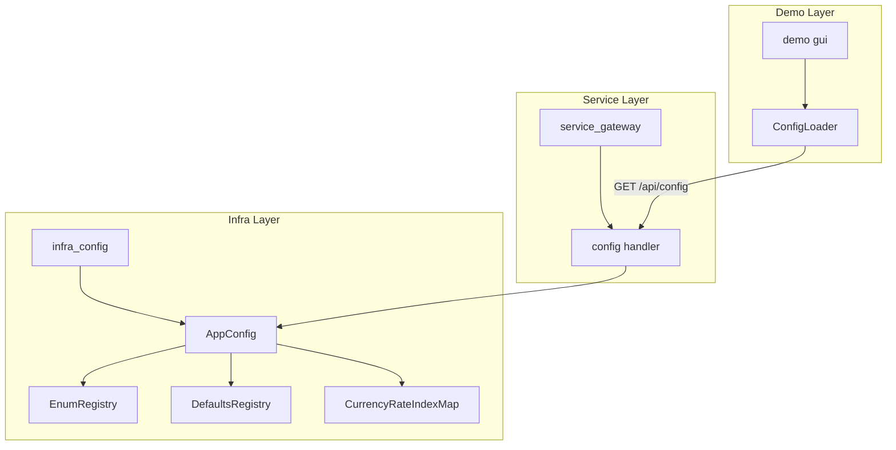
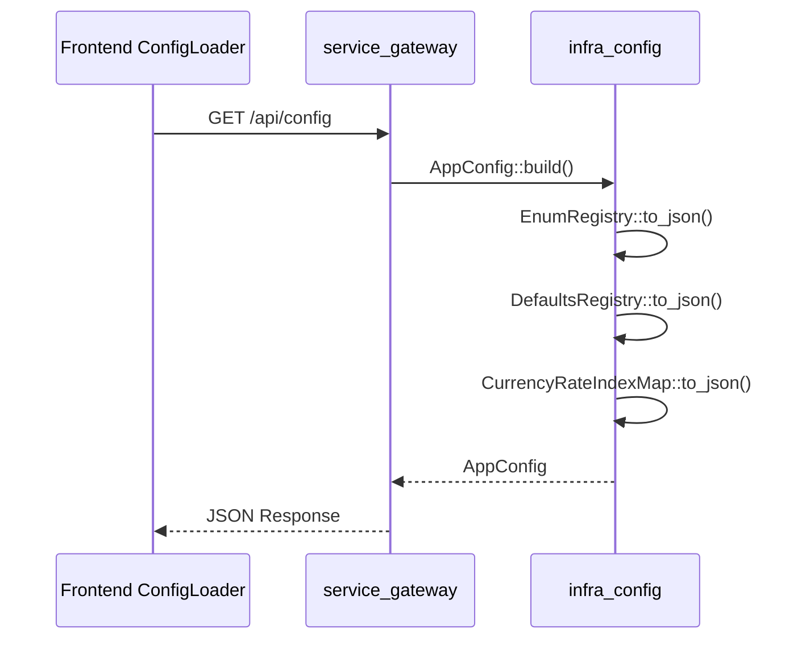
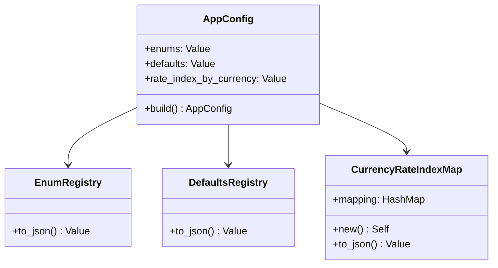

# Technical Design: config-consolidation

## Overview

**Purpose**: `infra_config` クレートを設定の Single Source of Truth として確立し、Rust の Enum 定義とデフォルト値から直接 JSON をエクスポートする機能を提供する。

**Users**: フロントエンド開発者（GUI フォームの Enum ドロップダウンと初期値）、service_gateway 開発者（API エンドポイント実装）

**Impact**: `demo/data/config/` の重複 JSON ファイル（enums.json, gui_defaults.json, rate_index_mapping.json）を非推奨化し、フロントエンドとの同期リスクを解消する。

### Goals
- `strum` マクロを活用して Enum バリアント名を自動エクスポート（コード量最小化）
- 既存の `Default` trait 実装から JSON デフォルト値を自動生成
- `/api/config` エンドポイントで `AppConfig` を一括提供

### Non-Goals
- `demo/data/input/` の市場データファイルの統合
- `demo/data/config/scenarios/` のシナリオファイルの統合
- 既存の `Settings::load()` 機能の変更

## Architecture

### Architecture Pattern & Boundary Map



**Architecture Integration**:
- **Selected pattern**: Facade パターン（`AppConfig` が複数のレジストリを統合）
- **Domain boundaries**: `infra_config`（Iレイヤー）が設定エクスポートを担当、`service_gateway`（Sレイヤー）がHTTP提供
- **Existing patterns preserved**: A-I-P-S 依存ルール（S → I 方向のみ）
- **New components rationale**: `AppConfig` は既存の設定定義を再利用しつつ JSON エクスポート機能を追加
- **Steering compliance**: British English、serde snake_case 設定を維持

### Technology Stack

| Layer | Choice / Version | Role in Feature | Notes |
|-------|------------------|-----------------|-------|
| Backend | `strum` 0.26 + `strum_macros` 0.26 | Enum バリアント名自動列挙 | `VariantNames` derive |
| Backend | `serde_json` (workspace) | Default → JSON 変換 | 既存依存 |
| Backend | `axum` (workspace) | HTTP handler | 既存依存 |

## System Flows



## Requirements Traceability

| Requirement | Summary | Components | Interfaces | Flows |
|-------------|---------|------------|------------|-------|
| 1.1-1.4 | Enum エクスポート | EnumRegistry | `to_json()` | AppConfig build |
| 2.1-2.3 | デフォルト値エクスポート | DefaultsRegistry | `to_json()` | AppConfig build |
| 3.1-3.4 | 通貨マッピング | CurrencyRateIndexMap | `to_json()` | AppConfig build |
| 4.1-4.4 | AppConfig 統合 | AppConfig | `build()`, `Serialize` | - |
| 5.1-5.4 | /api/config | config handler | GET /api/config | Sequence flow |
| 6.1-6.4 | 非推奨化 | - | - | - |

## Components and Interfaces

| Component | Domain/Layer | Intent | Req Coverage | Key Dependencies | Contracts |
|-----------|--------------|--------|--------------|------------------|-----------|
| EnumRegistry | infra_config | 全Enumバリアント名をJSONオブジェクトに集約 | 1.1-1.4 | strum::VariantNames (P0) | Service |
| DefaultsRegistry | infra_config | Default実装済み構造体をJSONオブジェクトに集約 | 2.1-2.3 | serde_json (P0) | Service |
| CurrencyRateIndexMap | infra_config | 通貨→金利インデックスマッピング | 3.1-3.4 | - | Service |
| AppConfig | infra_config | 上記3つを統合した構造体 | 4.1-4.4 | EnumRegistry, DefaultsRegistry, CurrencyRateIndexMap (P0) | Service, API |
| config handler | service_gateway | /api/config エンドポイント | 5.1-5.4 | AppConfig (P0) | API |

### Infra Layer

#### EnumRegistry

| Field | Detail |
|-------|--------|
| Intent | 全エクスポート対象Enumのバリアント名をJSON形式で提供 |
| Requirements | 1.1, 1.2, 1.3, 1.4 |

**Responsibilities & Constraints**
- 対象Enum: `PricingMethod`, `GreeksMethod`, `GreekType`, `TreeType`, `ShiftType`, `SecondOrderMode`
- strum の `VariantNames::VARIANTS` からバリアント名を取得
- snake_case 形式で出力（strum `serialize_all` 設定）

**Dependencies**
- External: strum::VariantNames — Enumバリアント名定数 (P0)

**Contracts**: Service [x]

##### Service Interface
```rust
pub struct EnumRegistry;

impl EnumRegistry {
    /// 全エクスポート対象Enumをキー名→バリアント配列のMapとして返す
    pub fn to_json() -> serde_json::Value;
}
```
- Preconditions: なし（静的データ）
- Postconditions: `{ "pricing_method": ["analytical", "monte_carlo", "tree"], ... }` 形式のJSON
- Invariants: キー名は snake_case、バリアント値も snake_case

---

#### DefaultsRegistry

| Field | Detail |
|-------|--------|
| Intent | Default trait 実装済み構造体のデフォルト値をJSON形式で提供 |
| Requirements | 2.1, 2.2, 2.3 |

**Responsibilities & Constraints**
- 対象構造体: `MonteCarloParams`, `TreeParams`, `BumpSizes`, `RiskConfig`, `PricingConfig`
- `serde_json::to_value(&T::default())` で JSON に変換
- 階層的な JSON オブジェクトとして構造化

**Dependencies**
- External: serde_json — JSON シリアライズ (P0)

**Contracts**: Service [x]

##### Service Interface
```rust
pub struct DefaultsRegistry;

impl DefaultsRegistry {
    /// 全デフォルト値を階層的JSONオブジェクトとして返す
    pub fn to_json() -> serde_json::Value;
}
```
- Preconditions: なし（静的データ）
- Postconditions: `{ "monte_carlo": { "num_paths": 10000, ... }, "bump_sizes": { ... } }` 形式のJSON
- Invariants: 構造体名は snake_case キー

---

#### CurrencyRateIndexMap

| Field | Detail |
|-------|--------|
| Intent | 通貨コードから金利インデックス名へのマッピングを提供 |
| Requirements | 3.1, 3.2, 3.3, 3.4 |

**Responsibilities & Constraints**
- デフォルトマッピング: USD→SOFR, EUR→ESTR, GBP→SONIA, JPY→TONA, CHF→SARON
- 設定ファイルでのオーバーライドをサポート（将来拡張）

**Contracts**: Service [x]

##### Service Interface
```rust
#[derive(Debug, Clone, Default, Serialize)]
pub struct CurrencyRateIndexMap {
    mapping: HashMap<String, String>,
}

impl CurrencyRateIndexMap {
    /// デフォルトマッピングで初期化
    pub fn new() -> Self;

    /// JSONオブジェクトとして返す
    pub fn to_json(&self) -> serde_json::Value;
}
```
- Preconditions: なし
- Postconditions: `{ "USD": "SOFR", "EUR": "ESTR", ... }` 形式のJSON
- Invariants: 通貨コードは大文字

---

#### AppConfig

| Field | Detail |
|-------|--------|
| Intent | EnumRegistry, DefaultsRegistry, CurrencyRateIndexMap を統合した構造体 |
| Requirements | 4.1, 4.2, 4.3, 4.4 |

**Responsibilities & Constraints**
- フロントエンドの `AppConfig` TypeScript 型と互換性を持つ
- `serde::Serialize` で JSON シリアライズ可能

**Dependencies**
- Inbound: EnumRegistry — Enum値 (P0)
- Inbound: DefaultsRegistry — デフォルト値 (P0)
- Inbound: CurrencyRateIndexMap — 通貨マッピング (P0)

**Contracts**: Service [x] / API [x]

##### Service Interface
```rust
#[derive(Debug, Clone, Serialize)]
#[serde(rename_all = "camelCase")]
pub struct AppConfig {
    pub enums: serde_json::Value,
    pub defaults: serde_json::Value,
    pub rate_index_by_currency: serde_json::Value,
}

impl AppConfig {
    /// 全レジストリからAppConfigを構築
    pub fn build() -> Self;
}
```
- Preconditions: なし
- Postconditions: フロントエンド互換のJSON構造
- Invariants: フィールド名は camelCase（フロントエンド互換）

---

### Service Layer

#### config handler

| Field | Detail |
|-------|--------|
| Intent | /api/config エンドポイントで AppConfig を提供 |
| Requirements | 5.1, 5.2, 5.3, 5.4 |

**Responsibilities & Constraints**
- GET /api/config でJSON応答
- エラー時は HTTP 500 + エラーメッセージ

**Dependencies**
- Inbound: axum Router — HTTPルーティング (P0)
- Outbound: infra_config::AppConfig — 設定データ (P0)

**Contracts**: API [x]

##### API Contract

| Method | Endpoint | Request | Response | Errors |
|--------|----------|---------|----------|--------|
| GET | /api/config | - | AppConfig (JSON) | 500 Internal Server Error |

**Implementation Notes**
- Integration: `api_routes()` に `.route("/config", get(handlers::get_config))` を追加
- Validation: なし（静的データ）
- Risks: なし（読み取り専用、副作用なし）

## Data Models

### Domain Model



### Data Contracts & Integration

**API Data Transfer**
```json
{
  "enums": {
    "pricing_method": ["analytical", "monte_carlo", "tree"],
    "greeks_method": ["aad", "bump"],
    "greek_type": ["delta", "gamma", "vega", "theta", "rho", "vanna", "volga"],
    "tree_type": ["binomial", "trinomial"],
    "shift_type": ["absolute", "relative"],
    "second_order_mode": ["parallel", "serial"]
  },
  "defaults": {
    "monte_carlo": { "num_paths": 10000, "num_steps": 252 },
    "tree_params": { "num_steps": 100, "tree_type": "binomial" },
    "bump_sizes": { "rate": 0.0001, "vol": 0.01, "spot": 0.01 }
  },
  "rateIndexByCurrency": {
    "USD": "SOFR",
    "EUR": "ESTR",
    "GBP": "SONIA",
    "JPY": "TONA",
    "CHF": "SARON"
  }
}
```

## Error Handling

### Error Categories and Responses
- **System Errors (5xx)**: `AppConfig::build()` 失敗時 → HTTP 500 + エラーメッセージ
- **Note**: 読み取り専用の静的データのため、ユーザーエラー（4xx）は発生しない

## Testing Strategy

### Unit Tests
- `EnumRegistry::to_json()` が全対象Enumを含むことを検証
- `DefaultsRegistry::to_json()` が期待するデフォルト値を返すことを検証
- `CurrencyRateIndexMap::to_json()` がデフォルトマッピングを含むことを検証
- `AppConfig::build()` がフロントエンド互換の構造を返すことを検証

### Integration Tests
- `GET /api/config` が 200 OK とJSON を返すことを検証
- レスポンスの Content-Type が `application/json` であることを検証
- フロントエンドの TypeScript `AppConfig` 型と互換性があることを検証（スキーマ比較）

## Enum Derive 属性の追加

対象Enumに以下の derive 属性を追加:

```rust
// pricing_config.rs
#[derive(Debug, Clone, Copy, PartialEq, Eq, Deserialize, Serialize, Default)]
#[derive(strum::VariantNames)]  // 追加
#[serde(rename_all = "snake_case")]
#[strum(serialize_all = "snake_case")]  // 追加
pub enum PricingMethod { ... }

#[derive(Debug, Clone, Copy, PartialEq, Eq, Deserialize, Serialize, Default)]
#[derive(strum::VariantNames)]  // 追加
#[serde(rename_all = "snake_case")]
#[strum(serialize_all = "snake_case")]  // 追加
pub enum TreeType { ... }

// risk_config.rs
#[derive(Debug, Clone, Copy, PartialEq, Eq, Deserialize, Serialize, Default)]
#[derive(strum::VariantNames)]  // 追加
#[serde(rename_all = "snake_case")]
#[strum(serialize_all = "snake_case")]  // 追加
pub enum GreeksMethod { ... }

// ... 同様に GreekType, SecondOrderMode, ShiftType
```

## File Changes Summary

| File | Change Type | Description |
|------|-------------|-------------|
| `crates/infra_config/Cargo.toml` | Modify | strum, strum_macros 依存追加 |
| `crates/infra_config/src/lib.rs` | Modify | `mod app_config` 追加、prelude 更新 |
| `crates/infra_config/src/app_config.rs` | **New** | AppConfig, EnumRegistry, DefaultsRegistry, CurrencyRateIndexMap |
| `crates/infra_config/src/pricing_config.rs` | Modify | strum derive 追加 |
| `crates/infra_config/src/risk_config.rs` | Modify | strum derive 追加 |
| `crates/service_gateway/src/rest/handlers/mod.rs` | Modify | `pub mod config` 追加、re-export |
| `crates/service_gateway/src/rest/handlers/config.rs` | **New** | `get_config` handler |
| `crates/service_gateway/src/rest/mod.rs` | Modify | `/api/config` ルート追加 |
| `demo/data/config/enums.json` | Modify | 非推奨コメント追加 |
| `demo/data/config/gui_defaults.json` | Modify | 非推奨コメント追加 |
| `demo/data/config/rate_index_mapping.json` | Modify | 非推奨コメント追加 |

**New Files**: 2
**Modified Files**: 9
**Total**: 11 files
