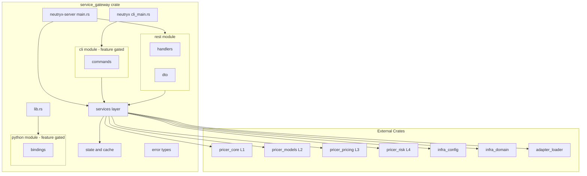
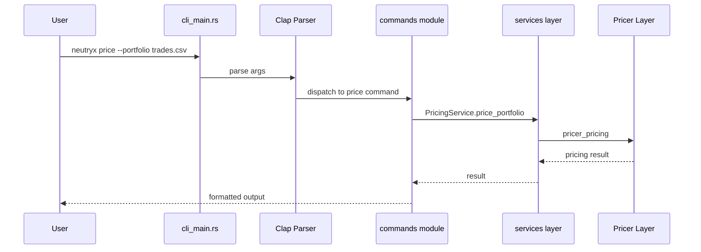

# Design Document: consolidate-service-crates

## Overview

**Purpose**: `service_cli` と `service_python` を feature-gate で `service_gateway` に統合し、Service 層を単一 crate に集約する。

**Users**: 開発者（CLI 操作）、研究者（Python/Jupyter ワークフロー）、CI/CD エンジニア（ビルドパイプライン管理）。

**Impact**: ワークスペースから 2 crate を削除し、`service_gateway` を CLI・Python・REST/gRPC の統合デリバリーポイントに変更する。

### Goals

- CLI コマンド群を feature-gated モジュールとして service_gateway に移植
- PyO3 バインディングを feature-gated モジュールとして service_gateway に移植
- gateway の services 層を CLI から直接利用可能にする
- ワークスペースから旧 crate を除去し簡素化する

### Non-Goals

- CLI コマンドの完全実装（既存スタブの移植のみ）
- Python バインディングの機能拡張
- gRPC 実装の着手
- `infra_store` 依存の導入（将来的に optional 追加を検討）

## Architecture

### Existing Architecture Analysis

現在の Service 層は 3 crate で構成されるが、`service_cli` と `service_python` はワークスペースからコメントアウト済み：

- **service_gateway** — Axum REST API サーバー（`neutryx-server` バイナリ）、Handler → Service → Pricer パターン
- **service_cli** — Clap CLI（`neutryx` バイナリ）、コマンドは殆どスタブ実装
- **service_python** — PyO3 バインディング（`neutryx_py` cdylib）、最小限の API

既存パターン：
- A-I-P-S 依存ルール（S は P, I, A に依存可能）
- Feature-gate によるモジュール制御（`rest`, `grpc`, `risk`, `models`, `volatility`, `demo`）
- `ServerError` + `IntoResponse` による HTTP エラーマッピング
- Workspace dependency inheritance

### Architecture Pattern & Boundary Map



**Architecture Integration**:
- **Selected pattern**: Feature-gated モジュール統合。既存の feature flag パターンを踏襲し `cli`, `python` を追加
- **Domain boundaries**: REST/CLI/Python は services 層を介してのみ Pricer 層にアクセス
- **Existing patterns preserved**: Handler → Service → Pricer、workspace dependency inheritance、feature-gated compilation
- **New components rationale**: `cli/` — CLI コマンドの移植先、`python/` — PyO3 バインディングの移植先、`lib.rs` — cdylib エントリーポイント、`cli_main.rs` — CLI バイナリエントリーポイント
- **Steering compliance**: A-I-P-S 依存ルール維持、British English 命名、thiserror エラー型

### Technology Stack

| Layer | Choice / Version | Role in Feature | Notes |
|-------|------------------|-----------------|-------|
| CLI | `clap` 4.4 (workspace, optional) | CLI 引数解析・サブコマンド定義 | `cli` feature でゲート |
| Python Bindings | `pyo3` 0.22 (workspace, optional) | PyO3 モジュール登録・クラスバインディング | `python` feature でゲート |
| REST API | `axum` 0.7 (workspace) | 既存 REST サーバー | 変更なし |
| Services | 既存 services 層 | CLI コマンドからの共用 | 新規依存なし |
| Build | Cargo `required-features` | CLI バイナリの条件付きビルド | `[[bin]]` セクション追加 |

## System Flows

### CLI コマンド実行フロー



## Requirements Traceability

| Requirement | Summary | Components | Interfaces | Flows |
|-------------|---------|------------|------------|-------|
| 1.1 | CLI モジュール配置 | CliModule | — | — |
| 1.2 | CLI ビルド | CargoConfig | — | — |
| 1.3 | コマンド移植 | CliModule | CliCommands | CLI実行フロー |
| 1.4 | services 層再利用 | CliModule | ServiceInterface | CLI実行フロー |
| 1.5 | CLI コード除外 | CargoConfig | — | — |
| 2.1 | Python モジュール配置 | PythonModule | — | — |
| 2.2 | Python ビルド | CargoConfig, LibEntry | PyModule | — |
| 2.3 | バインディング移植 | PythonModule | PyBindings | — |
| 2.4 | Python コード除外 | CargoConfig | — | — |
| 3.1 | Feature flag 定義 | CargoConfig | — | — |
| 3.2 | デフォルト feature 維持 | CargoConfig | — | — |
| 3.3 | full feature 拡張 | CargoConfig | — | — |
| 3.4 | cdylib crate-type | CargoConfig, LibEntry | — | — |
| 3.5 | clap optional 依存 | CargoConfig | — | — |
| 3.6 | pyo3 optional 依存 | CargoConfig | — | — |
| 3.7 | workspace 依存追加 | CargoConfig | — | — |
| 4.1 | neutryx-server 維持 | ServerBinary | — | — |
| 4.2 | neutryx CLI バイナリ | CliBinary | — | CLI実行フロー |
| 4.3 | CLI feature 無効時 | CargoConfig | — | — |
| 5.1 | ServerError 拡張 | ErrorTypes | — | — |
| 5.2 | thiserror 準拠 | ErrorTypes | — | — |
| 5.3 | CLI エラー表示 | ErrorTypes | CliErrorDisplay | — |
| 5.4 | REST エラー維持 | ErrorTypes | IntoResponse | — |
| 6.1 | workspace エントリ削除 | WorkspaceCleanup | — | — |
| 6.2 | 旧 crate ディレクトリ削除 | WorkspaceCleanup | — | — |
| 6.3 | steering 更新 | SteeringUpdate | — | — |
| 7.1-7.6 | ビルド互換性 | 全コンポーネント | — | — |

## Components and Interfaces

| Component | Domain/Layer | Intent | Req Coverage | Key Dependencies | Contracts |
|-----------|--------------|--------|--------------|-----------------|-----------|
| CargoConfig | Build | Cargo.toml feature flag 定義と依存管理 | 1.2, 1.5, 2.4, 3.1-3.7, 4.1-4.3, 7.5-7.6 | — | — |
| LibEntry | Build | lib.rs エントリーポイント（Python cdylib 登録） | 2.2, 3.4 | pyo3 (P0) | Service |
| CliModule | Service/CLI | CLI コマンドモジュール群 | 1.1, 1.3, 1.4 | clap (P0), services (P0) | Service |
| CliBinary | Service/CLI | neutryx CLI バイナリエントリーポイント | 4.2 | CliModule (P0) | — |
| PythonModule | Service/Python | PyO3 バインディング群 | 2.1, 2.3 | pyo3 (P0), pricer_core (P1) | Service |
| ErrorTypes | Service/Shared | 統合エラー型 | 5.1-5.4 | thiserror (P0) | Service |
| WorkspaceCleanup | Build/Infra | 旧 crate 削除と workspace 整理 | 6.1-6.2 | — | — |
| SteeringUpdate | Documentation | steering ドキュメント更新 | 6.3 | — | — |

### Build Layer

#### CargoConfig

| Field | Detail |
|-------|--------|
| Intent | service_gateway の Cargo.toml を更新し、CLI/Python の feature flag と依存を管理する |
| Requirements | 1.2, 1.5, 2.4, 3.1-3.7, 4.1-4.3, 7.5-7.6 |

**Responsibilities & Constraints**
- Feature flag `cli` と `python` の追加定義
- `clap` と `pyo3` を `optional = true` で追加（workspace inheritance）
- `[[bin]]` セクションに `neutryx` CLI ターゲットを追加（`required-features = ["cli"]`）
- `[lib]` セクションの追加（`crate-type = ["cdylib", "rlib"]`）
- `full` feature の更新

**Contracts**: Service [x]

##### Service Interface

```rust
// Cargo.toml の構造定義（擬似）
// [lib]
// name = "service_gateway"
// crate-type = ["cdylib", "rlib"]

// [[bin]]
// name = "neutryx-server"
// path = "src/main.rs"

// [[bin]]
// name = "neutryx"
// path = "src/cli_main.rs"
// required-features = ["cli"]

// [features]
// default = ["rest"]
// cli = ["dep:clap"]
// python = ["dep:pyo3"]
// full = ["rest", "risk", "models", "volatility", "demo", "cli"]

// [dependencies]
// clap = { workspace = true, optional = true }
// pyo3 = { workspace = true, optional = true }
```

**Implementation Notes**
- `required-features` により `cli` feature 無効時に `neutryx` バイナリはビルド対象外
- `pyo3` の `extension-module` feature はリンカ設定に影響するため、`python` feature 無効時の除外が重要
- 既存の `workspace.dependencies` に `clap` と `pyo3` は定義済み（追加作業不要）

#### LibEntry

| Field | Detail |
|-------|--------|
| Intent | lib.rs を新規作成し、Python モジュール登録と crate 内部モジュールの公開を行う |
| Requirements | 2.2, 3.4 |

**Responsibilities & Constraints**
- `#[cfg(feature = "python")]` で PyO3 `#[pymodule]` をゲート
- 既存の `pub use` エクスポート（`ServerError`, `AppState` 等）を `main.rs` から移動
- Python feature 無効時は空の lib crate として動作

**Contracts**: Service [x]

##### Service Interface

```rust
// src/lib.rs
pub mod config;
pub mod error;
pub mod rest;
pub mod services;
pub mod state;

#[cfg(feature = "cli")]
pub mod cli;

#[cfg(feature = "python")]
pub mod python;

// Re-exports
pub use error::ServerError;
pub use state::AppState;

// Python module registration
#[cfg(feature = "python")]
use pyo3::prelude::*;

#[cfg(feature = "python")]
#[pymodule]
fn neutryx_py(m: &Bound<'_, PyModule>) -> PyResult<()> {
    python::register_module(m)
}
```

**Implementation Notes**
- `main.rs` は `use service_gateway::*` で lib.rs 経由のモジュールを参照する構成に変更
- `cli_main.rs` も同様に lib.rs 経由で `cli` モジュールにアクセス

### Service/CLI Layer

#### CliModule

| Field | Detail |
|-------|--------|
| Intent | service_cli のコマンド群を feature-gated モジュールとして提供し、services 層を再利用する |
| Requirements | 1.1, 1.3, 1.4 |

**Responsibilities & Constraints**
- `src/cli/mod.rs` — Clap CLI 構造体定義（`Cli`, `Commands` enum）
- `src/cli/commands/` — 各コマンド実装（`calibrate.rs`, `price.rs`, `report.rs`, `check.rs`, `demo.rs`）
- 全コマンドモジュールを `#[cfg(feature = "cli")]` でゲート
- services 層（`CurveService`, `PricingService` 等）を直接インポートして利用

**Dependencies**
- Inbound: CliBinary — CLI エントリーポイントから呼び出し (P0)
- Outbound: services 層 — ビジネスロジック委譲 (P0)
- External: clap — 引数解析 (P0)

**Contracts**: Service [x]

##### Service Interface

```rust
// src/cli/mod.rs
use clap::{Parser, Subcommand};

pub mod commands;

#[derive(Parser)]
#[command(name = "neutryx", about = "Neutryx derivatives pricing CLI")]
pub struct Cli {
    #[arg(short, long)]
    pub verbose: bool,
    #[arg(short, long, default_value = "neutryx.toml")]
    pub config: String,
    #[command(subcommand)]
    pub command: Commands,
}

#[derive(Subcommand)]
pub enum Commands {
    Calibrate { /* fields from service_cli */ },
    Price { /* fields from service_cli */ },
    Report { /* fields from service_cli */ },
    Check,
    Demo,
}

pub fn run(cli: Cli) -> Result<(), crate::error::ServerError>;
```

**Implementation Notes**
- 既存 service_cli の `Commands` enum とフィールドをそのまま移植
- `run()` 関数内で `commands::*` モジュールにディスパッチ
- 各コマンドは services 層のインスタンスを生成して呼び出す（スタブ実装を維持）

#### CliBinary

| Field | Detail |
|-------|--------|
| Intent | neutryx CLI のバイナリエントリーポイント |
| Requirements | 4.2 |

**Contracts**: Service [x]

##### Service Interface

```rust
// src/cli_main.rs
use clap::Parser;
use service_gateway::cli::Cli;

fn main() -> Result<(), Box<dyn std::error::Error>> {
    let cli = Cli::parse();
    // tracing 初期化
    service_gateway::cli::run(cli)?;
    Ok(())
}
```

### Service/Python Layer

#### PythonModule

| Field | Detail |
|-------|--------|
| Intent | service_python の PyO3 バインディングを feature-gated モジュールとして提供する |
| Requirements | 2.1, 2.3 |

**Responsibilities & Constraints**
- `src/python/mod.rs` — モジュールエクスポートと `register_module()` 関数
- `src/python/bindings.rs` — `PyVanillaOption`, `PyForward`, `PyHullWhite`, pricing 関数
- `#[cfg(feature = "python")]` でゲート
- `normal_cdf` ヘルパーを含むプライシング関数をそのまま移植

**Dependencies**
- External: pyo3 — Python FFI バインディング (P0)
- Outbound: pricer_core — 将来的な直接統合 (P2)

**Contracts**: Service [x]

##### Service Interface

```rust
// src/python/mod.rs
pub mod bindings;

use pyo3::prelude::*;

pub fn register_module(m: &Bound<'_, PyModule>) -> PyResult<()> {
    m.add_class::<bindings::PyVanillaOption>()?;
    m.add_class::<bindings::PyForward>()?;
    m.add_class::<bindings::PyHullWhite>()?;
    m.add_function(wrap_pyfunction!(bindings::price_black_scholes, m)?)?;
    m.add_function(wrap_pyfunction!(bindings::price_garman_kohlhagen, m)?)?;
    m.add_function(wrap_pyfunction!(bindings::version, m)?)?;
    Ok(())
}
```

### Service/Shared Layer

#### ErrorTypes

| Field | Detail |
|-------|--------|
| Intent | ServerError を拡張し、CLI 固有のエラーバリアントを統合する |
| Requirements | 5.1-5.4 |

**Responsibilities & Constraints**
- 既存の `ServerError` バリアントを維持（後方互換）
- CLI 固有バリアント追加: `Config`, `Io`, `FileNotFound`, `InvalidArgument`, `Parse`
- `IntoResponse` 実装は既存のまま維持（REST コンテキスト）
- CLI コンテキストでは `Display` trait で人間可読テキスト出力

**Contracts**: Service [x]

##### Service Interface

```rust
// error.rs への追加バリアント
#[derive(Error, Debug)]
pub enum ServerError {
    // --- 既存バリアント（変更なし） ---
    #[error("Pricing error: {0}")]
    Pricing(String),
    // ... 他の既存バリアント ...

    // --- CLI 固有バリアント（feature gate なし） ---
    #[error("Configuration error: {0}")]
    Config(String),

    #[error("IO error: {0}")]
    Io(#[from] std::io::Error),

    #[error("File not found: {0}")]
    FileNotFound(String),

    #[error("Invalid argument: {0}")]
    InvalidArgument(String),

    #[error("Parse error: {0}")]
    Parse(String),
}
```

**Implementation Notes**
- 新規バリアントの `IntoResponse` マッピング: `Config` → 500, `Io` → 500, `FileNotFound` → 404, `InvalidArgument` → 400, `Parse` → 400
- CLI コンテキストでは `eprintln!("{err}")` で Display を利用

### Build/Infra Layer

#### WorkspaceCleanup

| Field | Detail |
|-------|--------|
| Intent | 旧 crate の削除とワークスペース設定の整理 |
| Requirements | 6.1, 6.2 |

**Responsibilities & Constraints**
- ルート `Cargo.toml` からコメントアウトされた `service_cli` と `service_python` エントリの削除
- `crates/service_cli/` と `crates/service_python/` ディレクトリの削除
- `Cargo.lock` の自動更新（`cargo update` 不要、ビルド時に自動反映）

#### SteeringUpdate

| Field | Detail |
|-------|--------|
| Intent | steering ドキュメントを統合後の構成に更新する |
| Requirements | 6.3 |

**Responsibilities & Constraints**
- `structure.md` — Service 層セクションを更新（service_cli/service_python の記述を削除、service_gateway の cli/python モジュールを追加）
- `tech.md` — Service 層テクノロジースタック更新（service_cli (paused) → 統合済み、等）
- `roadmap.md` — Service Layer Status 更新、本 spec を completed に追加

## Error Handling

### Error Strategy

既存の `ServerError` を拡張する最小限のアプローチ。CLI バリアントは feature gate なしで追加し、コンテキストに応じた出力を行う。

### Error Categories and Responses

| Context | Error Type | 出力形式 |
|---------|-----------|---------|
| REST API | `ServerError` → `IntoResponse` | JSON `{"error": ..., "code": ...}` + HTTP status |
| CLI | `ServerError` → `Display` | `eprintln!` テキスト出力 + プロセス終了コード |
| Python | `ServerError` → `PyErr` | Python 例外（将来拡張時） |

## Testing Strategy

### Unit Tests

- `cli/mod.rs` — Clap パーサーの引数解析テスト（各コマンドのデフォルト値、必須引数）
- `python/bindings.rs` — PyO3 バインディングの構造体コンストラクタテスト
- `error.rs` — 新規バリアントの Display 出力テスト

### Integration Tests

- `cargo build --workspace` — デフォルト feature でのビルド成功
- `cargo build -p service_gateway --features cli` — CLI feature でのビルド成功
- `cargo build -p service_gateway --features python` — Python feature でのビルド成功
- `cargo test --workspace` — 全テストパス
- `cargo clippy --workspace -- -D warnings` — リントクリーン

### Build Verification

- Feature 無効時: `clap`/`pyo3` がコンパイル対象外であることを依存ツリーで確認
- `required-features`: `cli` feature 無効時に `neutryx` バイナリがビルドされないことを確認
