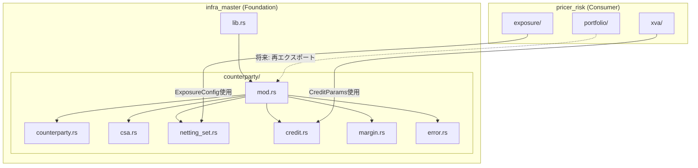
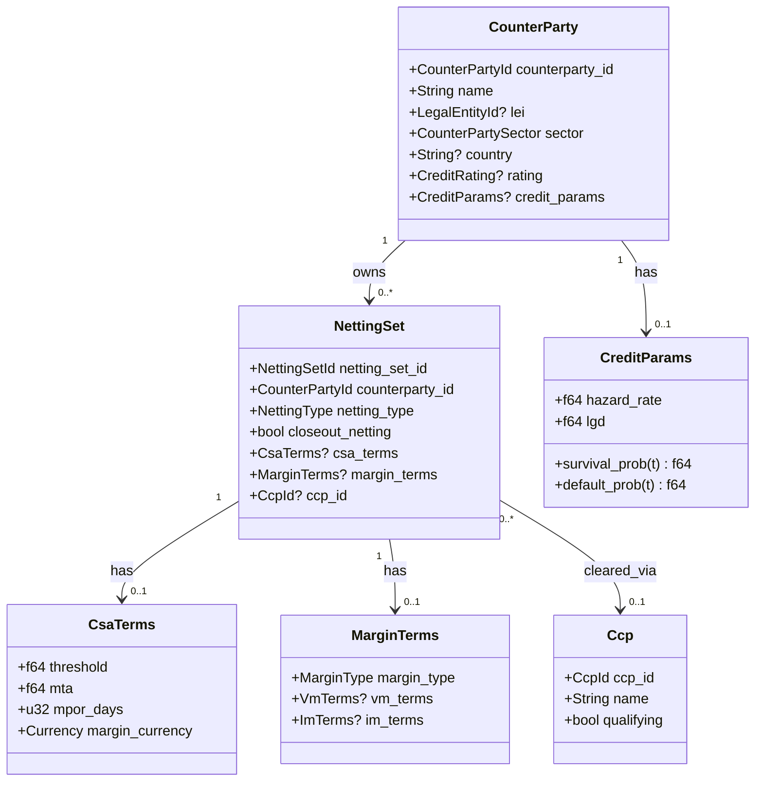
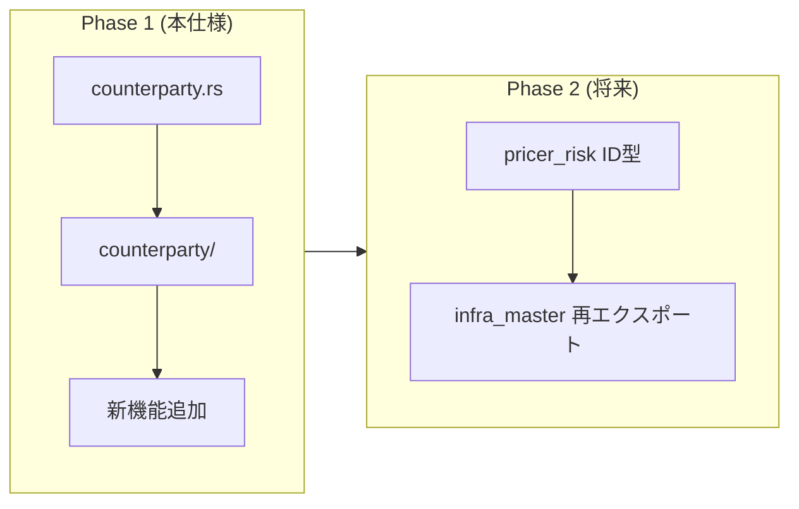

# Design Document: counterparty-netting-module

## Overview

**Purpose**: 本機能は`infra_master`クレート内にCounterParty（取引相手先）とネッティングセット情報を管理するための包括的なモジュール構造を提供する。

**Users**: XVA計算担当者、リスク管理者、コラテラル管理担当者が、取引相手先のクレジットリスク評価、担保管理、Exposure計算の基礎データとして使用する。

**Impact**: 現行の単一ファイル`counterparty.rs`を`counterparty/`フォルダに再編成し、VM/IM/SIMM、Exposure管理、CCP情報を含む拡張機能を追加する。

### Goals

- CounterParty、NettingSet、CSA条件の型を専用モジュールで一元管理
- 型安全なID参照（新型パターン）による開発時エラー防止
- VM/IM/SIMM、Exposure設定、CCP情報のTier-1銀行本番運用対応
- `pricer_risk`との将来的な型統合を可能にする設計

### Non-Goals

- XVA計算ロジックの実装（`pricer_risk`に委譲）
- Exposure計算エンジンの実装（`pricer_risk`に委譲）
- `pricer_risk`の即時移行（Phase 2として将来対応）
- SIMM計算ロジックの実装（設定パラメータのみ）

## Architecture

### Existing Architecture Analysis

**現行実装**:
- `crates/infra_master/src/counterparty.rs`: `CsaTerms`, `NettingSetConfig`を単一ファイルで定義
- `crates/pricer_risk/src/portfolio/`: `CounterpartyId`, `NettingSetId`, `CreditRating`, `CreditParams`, `Counterparty`を独自定義

**技術的負債**:
- ID型が`pricer_risk`と`infra_master`で重複
- CSA条件が`infra_master::CsaTerms`と`pricer_risk::CollateralAgreement`で二重定義
- クレジットパラメータが`pricer_risk`にのみ存在

### Architecture Pattern & Boundary Map



**Architecture Integration**:
- **Selected pattern**: モジュール分割パターン（`time/`, `trade/`, `convention/`と同一）
- **Domain boundaries**: 静的マスターデータ定義のみ、計算ロジックは`pricer_risk`
- **Existing patterns preserved**: 新型パターン、ビルダーパターン、feature-gated serde
- **Steering compliance**: A-I-P-S依存規則（Infraは他に依存しない）

### Technology Stack

| Layer | Choice / Version | Role in Feature | Notes |
|-------|------------------|-----------------|-------|
| Language | Rust (stable) | 型定義、データ構造 | nightly不要 |
| Serialisation | serde (feature-gated) | JSON/YAML設定読み込み | `#[cfg_attr(feature = "serde", ...)]` |
| Error Handling | thiserror | 構造化エラー型 | `CounterPartyError` |
| Validation | 手動実装 | LEI、格付け、パラメータ検証 | ISO 17442準拠 |

## Requirements Traceability

| Requirement | Summary | Components | Interfaces | Files |
|-------------|---------|------------|------------|-------|
| 1 | モジュール構造再編成 | mod.rs | 再エクスポート | 全7ファイル |
| 2 | CounterParty型定義 | counterparty.rs | CounterParty, CounterPartyId | counterparty.rs |
| 3 | クレジットパラメータ | credit.rs | CreditRating, CreditParams | credit.rs |
| 4 | NettingSet拡張 | netting_set.rs | NettingSet, NettingSetId | netting_set.rs |
| 5 | CSA条件拡張 | csa.rs | CsaTerms, EligibleCollateral | csa.rs |
| 6 | VM/IMマージン条件 | margin.rs | MarginTerms, VmTerms, ImTerms | margin.rs |
| 7 | Exposure設定 | netting_set.rs | ExposureConfig | netting_set.rs |
| 8 | CCP情報 | counterparty.rs | Ccp, CcpId | counterparty.rs |
| 9 | エラーハンドリング | error.rs | CounterPartyError | error.rs |
| 10 | 型安全ID | 全ファイル | *Id newtypes | counterparty.rs, netting_set.rs |
| 11 | pricer_risk統合設計 | credit.rs | CreditParams互換 | credit.rs |

## Components and Interfaces

| Component | Domain/Layer | Intent | Req Coverage | Key Dependencies | Contracts |
|-----------|--------------|--------|--------------|------------------|-----------|
| mod.rs | Module Root | サブモジュール集約・再エクスポート | 1 | 全サブモジュール | - |
| counterparty.rs | Entity | CounterParty・CCP定義 | 2, 8 | credit.rs, error.rs | State |
| csa.rs | Value Object | CSA条件・担保設定 | 5 | error.rs | State |
| netting_set.rs | Entity | NettingSet・Exposure設定 | 4, 7 | csa.rs, margin.rs | State |
| credit.rs | Value Object | 格付け・クレジットパラメータ | 3, 11 | error.rs | Service |
| margin.rs | Value Object | VM/IM/SIMMマージン条件 | 6 | error.rs | State |
| error.rs | Infrastructure | エラー型定義 | 9 | thiserror | - |

### counterparty/ Module

#### mod.rs

| Field | Detail |
|-------|--------|
| Intent | サブモジュール宣言と公開API定義 |
| Requirements | 1 |

**Responsibilities & Constraints**
- 全サブモジュールの宣言
- 公開型の再エクスポート
- preludeモジュールの提供
- 後方互換性維持（既存パスからのアクセス）

```rust
//! CounterParty and NettingSet management module.

mod counterparty;
mod csa;
mod credit;
mod error;
mod margin;
mod netting_set;

pub use counterparty::*;
pub use csa::*;
pub use credit::*;
pub use error::*;
pub use margin::*;
pub use netting_set::*;

/// Prelude for commonly used types.
pub mod prelude {
    pub use super::{
        // IDs
        CcpId, CounterPartyId, LegalEntityId, NettingSetId,
        // Entities
        Ccp, CounterParty, NettingSet,
        // Credit
        CreditParams, CreditRating,
        // CSA
        CsaTerms, EligibleCollateral, CollateralHaircut,
        // Margin
        ImModel, ImTerms, MarginTerms, MarginType, VmTerms,
        // Config
        ExposureConfig, NettingType,
        // Error
        CounterPartyError,
    };
}
```

#### counterparty.rs

| Field | Detail |
|-------|--------|
| Intent | CounterParty・CCP・ID型の定義 |
| Requirements | 2, 8, 10 |

**Contracts**: State

##### Type Definitions

```rust
/// Type-safe CounterParty identifier.
#[derive(Clone, Debug, PartialEq, Eq, Hash)]
#[cfg_attr(feature = "serde", derive(serde::Serialize, serde::Deserialize))]
#[cfg_attr(feature = "serde", serde(transparent))]
pub struct CounterPartyId(String);

impl CounterPartyId {
    pub fn new(id: impl Into<String>) -> Self { Self(id.into()) }
    pub fn as_str(&self) -> &str { &self.0 }
}

impl std::fmt::Display for CounterPartyId {
    fn fmt(&self, f: &mut std::fmt::Formatter<'_>) -> std::fmt::Result {
        write!(f, "{}", self.0)
    }
}

impl AsRef<str> for CounterPartyId { fn as_ref(&self) -> &str { &self.0 } }
impl From<String> for CounterPartyId { fn from(s: String) -> Self { Self(s) } }
impl From<&str> for CounterPartyId { fn from(s: &str) -> Self { Self(s.to_string()) } }

/// Legal Entity Identifier (ISO 17442).
#[derive(Clone, Debug, PartialEq, Eq, Hash)]
#[cfg_attr(feature = "serde", derive(serde::Serialize, serde::Deserialize))]
#[cfg_attr(feature = "serde", serde(transparent))]
pub struct LegalEntityId(String);

impl LegalEntityId {
    /// Creates a new LEI with validation.
    pub fn new(lei: impl Into<String>) -> Result<Self, CounterPartyError> {
        let lei = lei.into();
        if lei.len() != 20 || !lei.chars().all(|c| c.is_ascii_alphanumeric()) {
            return Err(CounterPartyError::InvalidLei(lei));
        }
        Ok(Self(lei))
    }

    /// Creates LEI without validation (for trusted sources).
    pub fn new_unchecked(lei: impl Into<String>) -> Self { Self(lei.into()) }
    pub fn as_str(&self) -> &str { &self.0 }
}

/// CounterParty sector classification.
#[derive(Clone, Copy, Debug, PartialEq, Eq, Hash)]
#[cfg_attr(feature = "serde", derive(serde::Serialize, serde::Deserialize))]
pub enum CounterPartySector {
    Banking,
    Investment,
    Securities,
    Insurance,
    Trading,
    AssetManagement,
    HedgeFund,
    Corporate,
    Sovereign,
    Other,
}

/// CounterParty entity with credit parameters.
#[derive(Clone, Debug)]
#[cfg_attr(feature = "serde", derive(serde::Serialize, serde::Deserialize))]
pub struct CounterParty {
    counterparty_id: CounterPartyId,
    name: String,
    lei: Option<LegalEntityId>,
    sector: CounterPartySector,
    country: Option<String>,
    rating: Option<CreditRating>,
    credit_params: Option<CreditParams>,
}

impl CounterParty {
    pub fn builder(id: impl Into<CounterPartyId>, name: impl Into<String>) -> CounterPartyBuilder {
        CounterPartyBuilder::new(id, name)
    }

    // Accessor methods
    pub fn id(&self) -> &CounterPartyId { &self.counterparty_id }
    pub fn name(&self) -> &str { &self.name }
    pub fn lei(&self) -> Option<&LegalEntityId> { self.lei.as_ref() }
    pub fn sector(&self) -> CounterPartySector { self.sector }
    pub fn country(&self) -> Option<&str> { self.country.as_deref() }
    pub fn rating(&self) -> Option<CreditRating> { self.rating }
    pub fn credit_params(&self) -> Option<&CreditParams> { self.credit_params.as_ref() }
}

/// Builder for CounterParty.
#[derive(Clone, Debug)]
pub struct CounterPartyBuilder { /* fields */ }

impl CounterPartyBuilder {
    pub fn new(id: impl Into<CounterPartyId>, name: impl Into<String>) -> Self { /* ... */ }
    pub fn lei(mut self, lei: LegalEntityId) -> Self { /* ... */ }
    pub fn sector(mut self, sector: CounterPartySector) -> Self { /* ... */ }
    pub fn country(mut self, country: impl Into<String>) -> Self { /* ... */ }
    pub fn rating(mut self, rating: CreditRating) -> Self { /* ... */ }
    pub fn credit_params(mut self, params: CreditParams) -> Self { /* ... */ }
    pub fn build(self) -> CounterParty { /* ... */ }
}

/// CCP (Central Counterparty Clearing House) identifier.
#[derive(Clone, Debug, PartialEq, Eq, Hash)]
#[cfg_attr(feature = "serde", derive(serde::Serialize, serde::Deserialize))]
#[cfg_attr(feature = "serde", serde(transparent))]
pub struct CcpId(String);

impl CcpId {
    pub fn new(id: impl Into<String>) -> Self { Self(id.into()) }
    pub fn as_str(&self) -> &str { &self.0 }
}

/// CCP (Central Counterparty Clearing House) entity.
#[derive(Clone, Debug)]
#[cfg_attr(feature = "serde", derive(serde::Serialize, serde::Deserialize))]
pub struct Ccp {
    ccp_id: CcpId,
    name: String,
    country: Option<String>,
    qualifying: bool,
}

impl Ccp {
    pub fn new(id: impl Into<CcpId>, name: impl Into<String>, qualifying: bool) -> Self {
        Self { ccp_id: id.into(), name: name.into(), country: None, qualifying }
    }

    /// Default cleared MPOR (5 business days).
    pub const CLEARED_MPOR_DAYS: u32 = 5;

    pub fn id(&self) -> &CcpId { &self.ccp_id }
    pub fn name(&self) -> &str { &self.name }
    pub fn is_qualifying(&self) -> bool { self.qualifying }
}
```

#### credit.rs

| Field | Detail |
|-------|--------|
| Intent | CreditRating・CreditParams定義（pricer_risk互換） |
| Requirements | 3, 11 |

**Contracts**: Service

##### Service Interface

```rust
/// Credit rating with +/- notches (20 grades).
#[derive(Clone, Copy, Debug, PartialEq, Eq, PartialOrd, Ord, Hash)]
#[cfg_attr(feature = "serde", derive(serde::Serialize, serde::Deserialize))]
pub enum CreditRating {
    Aaa,      // AAA
    AaPlus,   // AA+
    Aa,       // AA
    AaMinus,  // AA-
    APlus,    // A+
    A,        // A
    AMinus,   // A-
    BbbPlus,  // BBB+
    Bbb,      // BBB
    BbbMinus, // BBB-
    BbPlus,   // BB+
    Bb,       // BB
    BbMinus,  // BB-
    BPlus,    // B+
    B,        // B
    BMinus,   // B-
    Ccc,      // CCC
    Cc,       // CC
    C,        // C
    D,        // D (Default)
}

impl CreditRating {
    /// Returns whether this rating is investment grade (BBB- or better).
    pub fn is_investment_grade(&self) -> bool {
        *self <= CreditRating::BbbMinus
    }

    /// Returns indicative hazard rate for this rating (annual).
    pub fn indicative_hazard_rate(&self) -> f64 {
        match self {
            CreditRating::Aaa => 0.0001,      // 1 bp
            CreditRating::AaPlus => 0.0003,   // 3 bp
            CreditRating::Aa => 0.0005,       // 5 bp
            CreditRating::AaMinus => 0.0007,  // 7 bp
            CreditRating::APlus => 0.0008,    // 8 bp
            CreditRating::A => 0.001,         // 10 bp
            CreditRating::AMinus => 0.0012,   // 12 bp
            CreditRating::BbbPlus => 0.0015,  // 15 bp
            CreditRating::Bbb => 0.002,       // 20 bp
            CreditRating::BbbMinus => 0.003,  // 30 bp
            CreditRating::BbPlus => 0.005,    // 50 bp
            CreditRating::Bb => 0.01,         // 100 bp
            CreditRating::BbMinus => 0.015,   // 150 bp
            CreditRating::BPlus => 0.02,      // 200 bp
            CreditRating::B => 0.03,          // 300 bp
            CreditRating::BMinus => 0.05,     // 500 bp
            CreditRating::Ccc => 0.10,        // 1000 bp
            CreditRating::Cc => 0.20,         // 2000 bp
            CreditRating::C => 0.40,          // 4000 bp
            CreditRating::D => 1.0,           // Default
        }
    }
}

/// Credit parameters for XVA calculations.
#[derive(Clone, Debug)]
#[cfg_attr(feature = "serde", derive(serde::Serialize, serde::Deserialize))]
pub struct CreditParams {
    hazard_rate: f64,
    lgd: f64,
    pd_1y: Option<f64>,
    rating: Option<CreditRating>,
}

impl CreditParams {
    /// Creates new credit parameters.
    pub fn new(hazard_rate: f64, lgd: f64) -> Result<Self, CounterPartyError> {
        if hazard_rate < 0.0 {
            return Err(CounterPartyError::InvalidCreditParams(
                "Hazard rate must be non-negative".to_string(),
            ));
        }
        if !(0.0..=1.0).contains(&lgd) {
            return Err(CounterPartyError::InvalidCreditParams(
                "LGD must be in range [0, 1]".to_string(),
            ));
        }
        Ok(Self { hazard_rate, lgd, pd_1y: None, rating: None })
    }

    /// Creates from rating with indicative hazard rate.
    pub fn from_rating(rating: CreditRating, lgd: f64) -> Result<Self, CounterPartyError> {
        let mut params = Self::new(rating.indicative_hazard_rate(), lgd)?;
        params.rating = Some(rating);
        Ok(params)
    }

    /// Creates from 1-year default probability.
    pub fn from_pd_1y(pd_1y: f64, lgd: f64) -> Result<Self, CounterPartyError> {
        if !(0.0..=1.0).contains(&pd_1y) {
            return Err(CounterPartyError::InvalidCreditParams(
                "PD must be in range [0, 1]".to_string(),
            ));
        }
        // hazard_rate = -ln(1 - pd_1y)
        let hazard_rate = if pd_1y < 1.0 { -(1.0 - pd_1y).ln() } else { f64::INFINITY };
        let mut params = Self::new(hazard_rate, lgd)?;
        params.pd_1y = Some(pd_1y);
        Ok(params)
    }

    // Accessors
    pub fn hazard_rate(&self) -> f64 { self.hazard_rate }
    pub fn lgd(&self) -> f64 { self.lgd }
    pub fn recovery_rate(&self) -> f64 { 1.0 - self.lgd }
    pub fn pd_1y(&self) -> f64 { self.pd_1y.unwrap_or_else(|| self.default_prob(1.0)) }
    pub fn rating(&self) -> Option<CreditRating> { self.rating }

    /// Survival probability to time t: Q(t) = exp(-λt)
    #[inline]
    pub fn survival_prob(&self, t: f64) -> f64 { (-self.hazard_rate * t).exp() }

    /// Default probability to time t: PD(t) = 1 - Q(t)
    #[inline]
    pub fn default_prob(&self, t: f64) -> f64 { 1.0 - self.survival_prob(t) }

    /// Marginal default probability: PD(t1, t2) = Q(t1) - Q(t2)
    #[inline]
    pub fn marginal_default_prob(&self, t1: f64, t2: f64) -> f64 {
        self.survival_prob(t1) - self.survival_prob(t2)
    }
}
```

#### csa.rs

| Field | Detail |
|-------|--------|
| Intent | CSA条件・担保設定の定義 |
| Requirements | 5 |

**Contracts**: State

```rust
use std::collections::HashMap;
use crate::Currency;

/// Eligible collateral types.
#[derive(Clone, Copy, Debug, PartialEq, Eq, Hash)]
#[cfg_attr(feature = "serde", derive(serde::Serialize, serde::Deserialize))]
pub enum EligibleCollateral {
    Cash,
    GovernmentBonds,
    CorporateBonds,
    Equity,
    Gold,
}

/// Collateral haircut settings.
#[derive(Clone, Debug)]
#[cfg_attr(feature = "serde", derive(serde::Serialize, serde::Deserialize))]
pub struct CollateralHaircut {
    collateral_type: EligibleCollateral,
    currency: Option<Currency>,
    haircut_rate: f64,
}

impl CollateralHaircut {
    pub fn new(collateral_type: EligibleCollateral, haircut_rate: f64) -> Result<Self, CounterPartyError> {
        if !(0.0..=1.0).contains(&haircut_rate) {
            return Err(CounterPartyError::InvalidHaircut(haircut_rate));
        }
        Ok(Self { collateral_type, currency: None, haircut_rate })
    }

    pub fn with_currency(mut self, currency: Currency) -> Self {
        self.currency = Some(currency);
        self
    }
}

/// Segregation type for collateral.
#[derive(Clone, Copy, Debug, PartialEq, Eq, Hash, Default)]
#[cfg_attr(feature = "serde", derive(serde::Serialize, serde::Deserialize))]
pub enum SegregationType {
    #[default]
    Segregated,
    Commingled,
}

/// Margin call frequency.
#[derive(Clone, Copy, Debug, PartialEq, Eq, Hash, Default)]
#[cfg_attr(feature = "serde", derive(serde::Serialize, serde::Deserialize))]
pub enum CallFrequency {
    #[default]
    Daily,
    Weekly,
    Monthly,
}

/// CSA (Credit Support Annex) terms.
#[derive(Clone, Debug)]
#[cfg_attr(feature = "serde", derive(serde::Serialize, serde::Deserialize))]
pub struct CsaTerms {
    /// Threshold amount (below which no collateral is posted).
    threshold: f64,
    /// Minimum Transfer Amount.
    mta: f64,
    /// Independent Amount (initial margin-like).
    independent_amount: f64,
    /// Margin Period of Risk in business days.
    mpor_days: u32,
    /// Margin currency.
    margin_currency: Currency,
    /// Currency-specific thresholds (overrides base threshold).
    currency_thresholds: HashMap<Currency, f64>,
    /// Eligible collateral types.
    eligible_collateral: Vec<EligibleCollateral>,
    /// Collateral haircuts.
    haircuts: Vec<CollateralHaircut>,
    /// Rehypothecation allowed.
    rehypothecation: bool,
    /// Segregation type.
    segregation: SegregationType,
    /// Margin call frequency.
    call_frequency: CallFrequency,
    /// Dispute threshold.
    dispute_threshold: f64,
}

impl CsaTerms {
    pub fn builder() -> CsaTermsBuilder { CsaTermsBuilder::default() }

    // Accessors
    pub fn threshold(&self) -> f64 { self.threshold }
    pub fn threshold_for_currency(&self, ccy: &Currency) -> f64 {
        self.currency_thresholds.get(ccy).copied().unwrap_or(self.threshold)
    }
    pub fn mta(&self) -> f64 { self.mta }
    pub fn independent_amount(&self) -> f64 { self.independent_amount }
    pub fn mpor_days(&self) -> u32 { self.mpor_days }
    pub fn margin_currency(&self) -> Currency { self.margin_currency }
    pub fn is_rehypothecation_allowed(&self) -> bool { self.rehypothecation }
    pub fn segregation(&self) -> SegregationType { self.segregation }
    pub fn call_frequency(&self) -> CallFrequency { self.call_frequency }
    pub fn dispute_threshold(&self) -> f64 { self.dispute_threshold }
}

/// Builder for CsaTerms.
#[derive(Clone, Debug, Default)]
pub struct CsaTermsBuilder { /* fields with defaults */ }

impl CsaTermsBuilder {
    pub fn threshold(mut self, v: f64) -> Self { /* ... */ self }
    pub fn mta(mut self, v: f64) -> Self { /* ... */ self }
    pub fn independent_amount(mut self, v: f64) -> Self { /* ... */ self }
    pub fn mpor_days(mut self, v: u32) -> Self { /* ... */ self }
    pub fn margin_currency(mut self, v: Currency) -> Self { /* ... */ self }
    pub fn currency_threshold(mut self, ccy: Currency, threshold: f64) -> Self { /* ... */ self }
    pub fn eligible_collateral(mut self, v: Vec<EligibleCollateral>) -> Self { /* ... */ self }
    pub fn haircut(mut self, h: CollateralHaircut) -> Self { /* ... */ self }
    pub fn rehypothecation(mut self, v: bool) -> Self { /* ... */ self }
    pub fn segregation(mut self, v: SegregationType) -> Self { /* ... */ self }
    pub fn call_frequency(mut self, v: CallFrequency) -> Self { /* ... */ self }
    pub fn dispute_threshold(mut self, v: f64) -> Self { /* ... */ self }
    pub fn build(self) -> CsaTerms { /* ... */ }
}
```

#### margin.rs

| Field | Detail |
|-------|--------|
| Intent | VM/IM/SIMMマージン条件の定義 |
| Requirements | 6 |

**Contracts**: State

```rust
use crate::Currency;

/// Margin type classification.
#[derive(Clone, Copy, Debug, PartialEq, Eq, Hash, Default)]
#[cfg_attr(feature = "serde", derive(serde::Serialize, serde::Deserialize))]
pub enum MarginType {
    #[default]
    NoMargin,
    VmOnly,
    VmAndIm,
}

/// Initial Margin model type.
#[derive(Clone, Copy, Debug, PartialEq, Eq, Hash)]
#[cfg_attr(feature = "serde", derive(serde::Serialize, serde::Deserialize))]
pub enum ImModel {
    Simm,
    Schedule,
    Grid,
    Internal,
}

/// SIMM version.
#[derive(Clone, Copy, Debug, PartialEq, Eq, Hash)]
#[cfg_attr(feature = "serde", derive(serde::Serialize, serde::Deserialize))]
pub enum SimmVersion {
    V2_5,
    V2_6,
    V2_7,
}

impl Default for SimmVersion {
    fn default() -> Self { Self::V2_6 }
}

/// Rounding rule for margin amounts.
#[derive(Clone, Copy, Debug)]
#[cfg_attr(feature = "serde", derive(serde::Serialize, serde::Deserialize))]
pub struct RoundingRule {
    amount: f64,
    direction: RoundingDirection,
}

#[derive(Clone, Copy, Debug, PartialEq, Eq, Default)]
#[cfg_attr(feature = "serde", derive(serde::Serialize, serde::Deserialize))]
pub enum RoundingDirection {
    #[default]
    Nearest,
    Up,
    Down,
}

impl RoundingRule {
    pub fn new(amount: f64, direction: RoundingDirection) -> Self { Self { amount, direction } }
    pub fn apply(&self, value: f64) -> f64 {
        if self.amount <= 0.0 { return value; }
        match self.direction {
            RoundingDirection::Nearest => (value / self.amount).round() * self.amount,
            RoundingDirection::Up => (value / self.amount).ceil() * self.amount,
            RoundingDirection::Down => (value / self.amount).floor() * self.amount,
        }
    }
}

/// Variation Margin terms.
#[derive(Clone, Debug)]
#[cfg_attr(feature = "serde", derive(serde::Serialize, serde::Deserialize))]
pub struct VmTerms {
    frequency: CallFrequency,
    settlement_lag: u32,
    rounding: Option<RoundingRule>,
}

impl VmTerms {
    pub fn new(frequency: CallFrequency, settlement_lag: u32) -> Self {
        Self { frequency, settlement_lag, rounding: None }
    }
    pub fn with_rounding(mut self, rule: RoundingRule) -> Self {
        self.rounding = Some(rule);
        self
    }
}

/// Initial Margin terms.
#[derive(Clone, Debug)]
#[cfg_attr(feature = "serde", derive(serde::Serialize, serde::Deserialize))]
pub struct ImTerms {
    model: ImModel,
    simm_version: Option<SimmVersion>,
    calculation_frequency: CallFrequency,
    posting_currency: Currency,
}

impl ImTerms {
    pub fn new(model: ImModel, posting_currency: Currency) -> Self {
        let simm_version = if model == ImModel::Simm { Some(SimmVersion::default()) } else { None };
        Self { model, simm_version, calculation_frequency: CallFrequency::Daily, posting_currency }
    }

    pub fn with_simm_version(mut self, version: SimmVersion) -> Self {
        self.simm_version = Some(version);
        self
    }

    pub fn model(&self) -> ImModel { self.model }
    pub fn simm_version(&self) -> Option<SimmVersion> { self.simm_version }
}

/// SIMM risk class mapping (placeholder for future integration).
#[derive(Clone, Debug, Default)]
#[cfg_attr(feature = "serde", derive(serde::Serialize, serde::Deserialize))]
pub struct SimmRiskClassMapping {
    // Placeholder for SIMM risk class definitions
}

/// Combined margin terms (VM + IM).
#[derive(Clone, Debug)]
#[cfg_attr(feature = "serde", derive(serde::Serialize, serde::Deserialize))]
pub struct MarginTerms {
    margin_type: MarginType,
    vm_terms: Option<VmTerms>,
    im_terms: Option<ImTerms>,
}

impl MarginTerms {
    pub fn no_margin() -> Self {
        Self { margin_type: MarginType::NoMargin, vm_terms: None, im_terms: None }
    }

    pub fn vm_only(vm: VmTerms) -> Self {
        Self { margin_type: MarginType::VmOnly, vm_terms: Some(vm), im_terms: None }
    }

    pub fn vm_and_im(vm: VmTerms, im: ImTerms) -> Self {
        Self { margin_type: MarginType::VmAndIm, vm_terms: Some(vm), im_terms: Some(im) }
    }

    pub fn margin_type(&self) -> MarginType { self.margin_type }
    pub fn vm_terms(&self) -> Option<&VmTerms> { self.vm_terms.as_ref() }
    pub fn im_terms(&self) -> Option<&ImTerms> { self.im_terms.as_ref() }
}
```

#### netting_set.rs

| Field | Detail |
|-------|--------|
| Intent | NettingSet・ExposureConfig定義 |
| Requirements | 4, 7 |

**Contracts**: State

```rust
/// Type-safe NettingSet identifier.
#[derive(Clone, Debug, PartialEq, Eq, Hash)]
#[cfg_attr(feature = "serde", derive(serde::Serialize, serde::Deserialize))]
#[cfg_attr(feature = "serde", serde(transparent))]
pub struct NettingSetId(String);

impl NettingSetId {
    pub fn new(id: impl Into<String>) -> Self { Self(id.into()) }
    pub fn as_str(&self) -> &str { &self.0 }
}

impl std::fmt::Display for NettingSetId {
    fn fmt(&self, f: &mut std::fmt::Formatter<'_>) -> std::fmt::Result {
        write!(f, "{}", self.0)
    }
}

impl AsRef<str> for NettingSetId { fn as_ref(&self) -> &str { &self.0 } }
impl From<String> for NettingSetId { fn from(s: String) -> Self { Self(s) } }
impl From<&str> for NettingSetId { fn from(s: &str) -> Self { Self(s.to_string()) } }

/// Netting type classification.
#[derive(Clone, Copy, Debug, PartialEq, Eq, Hash, Default)]
#[cfg_attr(feature = "serde", derive(serde::Serialize, serde::Deserialize))]
pub enum NettingType {
    #[default]
    Bilateral,
    ClearedCcp,
    ClearedClient,
}

/// NettingSet entity.
#[derive(Clone, Debug)]
#[cfg_attr(feature = "serde", derive(serde::Serialize, serde::Deserialize))]
pub struct NettingSet {
    netting_set_id: NettingSetId,
    counterparty_id: CounterPartyId,
    legal_entity_id: Option<LegalEntityId>,
    netting_type: NettingType,
    closeout_netting: bool,
    csa_terms: Option<CsaTerms>,
    margin_terms: Option<MarginTerms>,
    ccp_id: Option<CcpId>,
    exposure_config: Option<ExposureConfig>,
}

impl NettingSet {
    pub fn builder(id: impl Into<NettingSetId>, counterparty_id: impl Into<CounterPartyId>) -> NettingSetBuilder {
        NettingSetBuilder::new(id, counterparty_id)
    }

    // Accessors
    pub fn id(&self) -> &NettingSetId { &self.netting_set_id }
    pub fn counterparty_id(&self) -> &CounterPartyId { &self.counterparty_id }
    pub fn legal_entity_id(&self) -> Option<&LegalEntityId> { self.legal_entity_id.as_ref() }
    pub fn netting_type(&self) -> NettingType { self.netting_type }
    pub fn has_closeout_netting(&self) -> bool { self.closeout_netting }
    pub fn csa_terms(&self) -> Option<&CsaTerms> { self.csa_terms.as_ref() }
    pub fn margin_terms(&self) -> Option<&MarginTerms> { self.margin_terms.as_ref() }
    pub fn ccp_id(&self) -> Option<&CcpId> { self.ccp_id.as_ref() }
    pub fn exposure_config(&self) -> Option<&ExposureConfig> { self.exposure_config.as_ref() }

    /// Returns MPOR days (CCP default: 5, bilateral: from CSA or 10).
    pub fn mpor_days(&self) -> u32 {
        match self.netting_type {
            NettingType::ClearedCcp | NettingType::ClearedClient => Ccp::CLEARED_MPOR_DAYS,
            NettingType::Bilateral => self.csa_terms.as_ref().map(|c| c.mpor_days()).unwrap_or(10),
        }
    }
}

/// Builder for NettingSet.
pub struct NettingSetBuilder { /* fields */ }

impl NettingSetBuilder {
    pub fn new(id: impl Into<NettingSetId>, counterparty_id: impl Into<CounterPartyId>) -> Self { /* ... */ }
    pub fn legal_entity_id(mut self, lei: LegalEntityId) -> Self { /* ... */ self }
    pub fn netting_type(mut self, t: NettingType) -> Self { /* ... */ self }
    pub fn closeout_netting(mut self, v: bool) -> Self { /* ... */ self }
    pub fn csa_terms(mut self, terms: CsaTerms) -> Self { /* ... */ self }
    pub fn margin_terms(mut self, terms: MarginTerms) -> Self { /* ... */ self }
    pub fn ccp_id(mut self, id: CcpId) -> Self { /* ... */ self }
    pub fn exposure_config(mut self, config: ExposureConfig) -> Self { /* ... */ self }
    pub fn build(self) -> Result<NettingSet, CounterPartyError> { /* ... */ }
}

/// Exposure calculation configuration.
#[derive(Clone, Debug)]
#[cfg_attr(feature = "serde", derive(serde::Serialize, serde::Deserialize))]
pub struct ExposureConfig {
    time_grid_years: Vec<f64>,
    pfe_confidence: f64,
    regulatory_maturity: f64,
    apply_netting: bool,
    apply_collateral: bool,
}

impl ExposureConfig {
    pub fn new() -> Self { Self::default() }

    pub fn with_time_grid(mut self, grid: Vec<f64>) -> Self {
        self.time_grid_years = grid;
        self
    }

    pub fn with_pfe_confidence(mut self, confidence: f64) -> Self {
        self.pfe_confidence = confidence.clamp(0.0, 1.0);
        self
    }

    // Accessors
    pub fn time_grid(&self) -> &[f64] { &self.time_grid_years }
    pub fn pfe_confidence(&self) -> f64 { self.pfe_confidence }
    pub fn regulatory_maturity(&self) -> f64 { self.regulatory_maturity }
    pub fn apply_netting(&self) -> bool { self.apply_netting }
    pub fn apply_collateral(&self) -> bool { self.apply_collateral }
}

impl Default for ExposureConfig {
    fn default() -> Self {
        Self {
            time_grid_years: vec![0.25, 0.5, 1.0, 2.0, 3.0, 5.0, 7.0, 10.0],
            pfe_confidence: 0.95,
            regulatory_maturity: 1.0,
            apply_netting: true,
            apply_collateral: true,
        }
    }
}
```

#### error.rs

| Field | Detail |
|-------|--------|
| Intent | CounterPartyモジュール専用エラー型 |
| Requirements | 9 |

```rust
use thiserror::Error;

/// CounterParty module errors.
#[derive(Debug, Error)]
pub enum CounterPartyError {
    #[error("Invalid CounterParty ID: {0}")]
    InvalidCounterPartyId(String),

    #[error("Invalid NettingSet ID: {0}")]
    InvalidNettingSetId(String),

    #[error("Invalid LEI (must be 20 alphanumeric characters): {0}")]
    InvalidLei(String),

    #[error("Missing CSA terms for netting set")]
    MissingCsaTerms,

    #[error("Invalid credit rating: {0}")]
    InvalidRating(String),

    #[error("Invalid credit parameters: {0}")]
    InvalidCreditParams(String),

    #[error("Invalid margin terms: {0}")]
    InvalidMarginTerms(String),

    #[error("Invalid haircut rate: {0} (must be in [0, 1])")]
    InvalidHaircut(f64),
}

// Integration with MasterDataError
impl From<CounterPartyError> for crate::error::MasterDataError {
    fn from(e: CounterPartyError) -> Self {
        crate::error::MasterDataError::CounterParty(e.to_string())
    }
}
```

## Data Models

### Domain Model



### Entity Relationships

| Entity | Cardinality | Related Entity | Notes |
|--------|-------------|----------------|-------|
| CounterParty | 1:N | NettingSet | 1つのCounterPartyに複数のNettingSet |
| NettingSet | N:1 | CounterParty | 必須関連 |
| NettingSet | 0..1:1 | CsaTerms | オプション（CSA契約なしの場合） |
| NettingSet | 0..1:1 | MarginTerms | オプション |
| NettingSet | N:0..1 | Ccp | ClearedのみCCP参照 |

## Error Handling

### Error Categories

| Error Type | Cause | Recovery |
|------------|-------|----------|
| `InvalidCounterPartyId` | 空または不正なID | ID形式の修正 |
| `InvalidLei` | 20文字でない、または非英数字 | ISO 17442準拠のLEIを使用 |
| `InvalidCreditParams` | hazard_rate < 0, LGD ∉ [0,1] | パラメータ範囲の修正 |
| `MissingCsaTerms` | VM/IM必須だがCSA未設定 | CsaTermsの追加 |
| `InvalidHaircut` | haircut ∉ [0,1] | 0-100%範囲に修正 |

## Testing Strategy

### Unit Tests
- `CreditRating::is_investment_grade()` — 境界値（BBB-以上）テスト
- `CreditParams::survival_prob()` — 数学的正確性（exp(-λt)）
- `LegalEntityId::new()` — バリデーション（20文字英数字）
- `NettingSet::mpor_days()` — CCP/Bilateral切り替え
- `CollateralHaircut` — 範囲検証

### Integration Tests
- `CounterParty`→`NettingSet`→`CsaTerms`の関連構築
- serde feature: JSON/YAMLシリアライズ往復
- `pricer_risk`互換: `CreditParams`メソッド結果比較

### Backward Compatibility Tests
- 既存の`infra_master::CsaTerms`パスからのアクセス
- 既存の`infra_master::NettingSetConfig`パスからのアクセス

## Migration Strategy

### Phase 1: infra_master構築（本仕様）

1. `counterparty/`フォルダ作成
2. 既存`counterparty.rs`の型を新モジュールに移行
3. `lib.rs`で後方互換エクスポート維持
4. 新機能（CreditRating, MarginTerms, ExposureConfig等）追加

### Phase 2: pricer_risk統合（将来）

1. `pricer_risk::portfolio::ids`を`infra_master`からの再エクスポートに変更
2. `pricer_risk::portfolio::counterparty::CreditRating`を`infra_master`から再エクスポート
3. デモ・テストコードの更新


