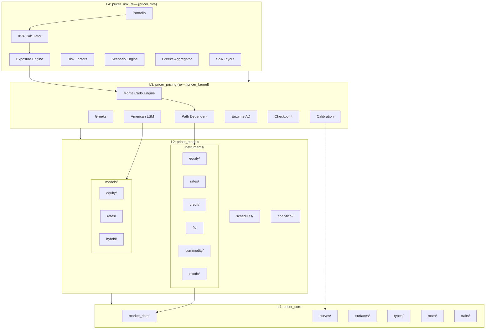
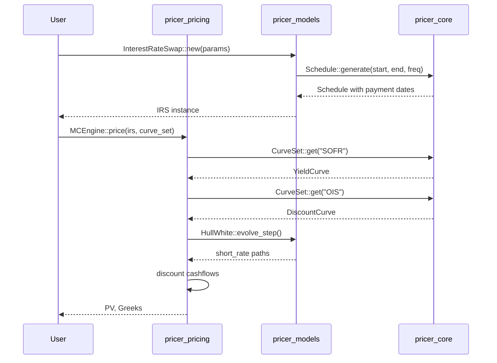
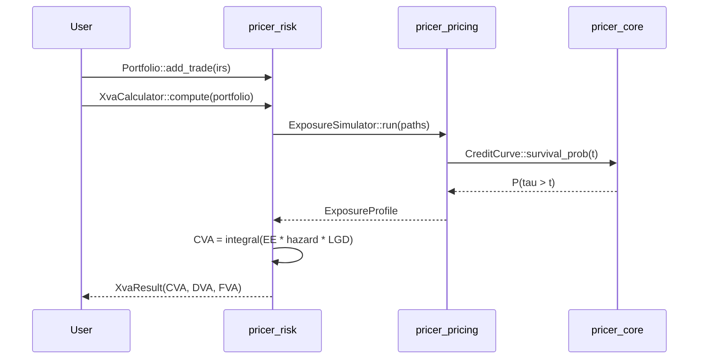
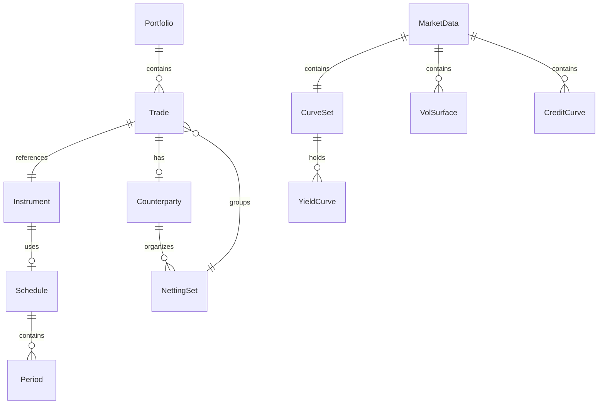

# Technical Design: crate-architecture-redesign

## Overview

**Purpose**: 本設計ã�Eã€�neutryx-rustライブラリã�®ã‚¯ãƒ¬ãƒ¼ãƒˆæ§‹æ�Eã‚’å�Eãƒ�Eƒªãƒ�ティブ評価ã�«å¯¾å¿œã�§ã��るよã�†å†�設計ã�™ã‚‹ã€‚既存ã�E4層アーキãƒ�E‚¯ãƒ�ャを基盤ã�¨ã�—ã�¤ã�¤ã€�æ ªå¼�デリãƒ�ティブã�«åŠ ã�ˆã�¦é‡‘利・クレジãƒ�Eƒˆãƒ»ç‚ºæ›¿ãƒ»ã‚³ãƒ¢ãƒ�E‚£ãƒ�E‚£ãƒ»ã‚¨ã‚­ã‚¾ãƒ�ックãƒ�Eƒªãƒ�ティブをカãƒ�ã�Eã�™ã‚‹æ‹¡å¼µæ€§ã‚’確ä¿�ã�™ã‚‹ã€�E

**Users**: クオンãƒ�E–‹ç™ºè€�E€�リスク管ç��E€�E€�E�ß利トレーダーã€�クレジãƒ�Eƒˆã‚¢ãƒŠãƒªã‚¹ãƒˆã€�ストラクãƒ�ャラーã�Œã€�統一ã�•ã‚Œã�ŸAPIã�§å¤šæ§˜ã�ªãƒ�Eƒªãƒ�ティブ商å“�ã�E評価ã�¨ãƒªã‚¹ã‚¯è¨ˆç®—を実行ã�™ã‚‹ã€�E

**Impact**: 既存ã�Epricer_kernel→pricer_engineã€�pricer_xva→pricer_riskã�¸ã�®å��称変更ã€�instruments/modelsé…�下ã�Eアセãƒ�Eƒˆã‚¯ãƒ©ã‚¹åˆ¥ã‚µãƒ–モジュールå†�構æ�Eã€�æ–°è¦�市場ãƒ�E�Eタ基盤�E�EurveSetã€�CreditCurve�E‰ã�E追加ã€�E

### Goals

- アセãƒ�Eƒˆã‚¯ãƒ©ã‚¹é��ä¾�å­˜ã�Eå•�E“�éš�層設計ã�«ã‚ˆã‚Šã€�æ–°è¦�商å“�追加ã�Œæ—¢å­˜ã‚³ãƒ¼ãƒ‰ã�«å½±éŸ¿ã‚’ä¸�ã�ˆã�ªã��E
- è¤�E•°ã‚¤ãƒ¼ãƒ«ãƒ‰ã‚«ãƒ¼ãƒ–ã�Eクレジãƒ�Eƒˆã‚«ãƒ¼ãƒ–ã�E統一管ç��E¼�EurveSetã€�CreditCurve�E�E
- Hull-Whiteã€�CIRç­‰ã�E金利モãƒ�Eƒ«è¿½åŠ ã�¨ã‚­ãƒ£ãƒªãƒ–レーションフレームワーク
- Enum dispatchパターン�よるEnzyme AD互�性�維�E
- Feature flagã�«ã‚ˆã‚‹ã‚¢ã‚»ãƒ�Eƒˆã‚¯ãƒ©ã‚¹åˆ¥æ�¡ä»¶ä»˜ã��コンパイル

### Non-Goals

- LIBOR Market Model�E�EMM�E‰ã�Eフル実è£�E¼ˆå°�E�¥ãƒ•ã‚§ãƒ¼ã‚º�E�E
- リアルタイムãƒ�ã�Eケãƒ�Eƒˆãƒ�E�Eタフィード統å��E
- GUI/Web UI���E
- 外部ãƒ�E�Eタベã�Eス連æ�º

## Architecture

### Existing Architecture Analysis

ç�¾è¡Œã‚¢ãƒ¼ã‚­ãƒ�E‚¯ãƒ�ャã�¯4層構造をæ�¡ç”¨ã�—ã€�Enzyme AD�E�Eightly Rust�E‰ã‚’L3ã�«éš”離ã�—ã�¦ã��E‚‹ã€�E

**ç�¾è¡Œã�E制ç´�E�¨ç¶­æŒ�ã�™ã�¹ã��パターン**:

- **Enum Dispatch**: `Instrument<T>`ã€�`StochasticModelEnum` â€�Etrait objectsã‚’é�¿ã�‘é�™çš�Eƒ‡ã‚£ã‚¹ãƒ‘ッãƒ�E
- **Generic Float**: å…¨å�‹ã�Œ `T: Float` ã�§ã‚¸ã‚§ãƒ�リãƒ�E‚¯�E�ED互æ�›æ€§�E�E
- **ä¾�存方å��E*: L1→L2→L3→L4ã�®ä¸€æ–¹å�‘ã�Eã�¿
- **SoA Layout**: L4�ベクトル化最��E

**ç�¾è¡Œã�E課é¡�E*:

- å•�E“�ã�Œflat構造ã�§åˆ�E¡�ã�•ã‚Œã�¦ã��E�ªã��E¼�Enstruments/直下ã�«Vanilla, Forward, Swap�E�E
- 金利å•�E“�ã�«å¿�E¦�ã�ªScheduleã€�ã�Eルãƒ�カーブ対応ã�Œä¸�足
- クレジãƒ�Eƒˆã‚«ãƒ¼ãƒ–（ãƒ�ザードレート）ã�E基盤ã�Œæœªæ•´å‚�E

### Architecture Pattern & Boundary Map



**Architecture Integration**:

- **Selected pattern**: 4層アーキãƒ�E‚¯ãƒ�ャ継続ã€�アセãƒ�Eƒˆã‚¯ãƒ©ã‚¹åˆ¥ã‚µãƒ–モジュール追加
- **Domain boundaries**: å��E‚¢ã‚»ãƒ�Eƒˆã‚¯ãƒ©ã‚¹�E�Equity, rates, credit, fx, commodity, exotic�E‰ã�Œç‹¬ç«‹ãƒ¢ã‚¸ãƒ¥ãƒ¼ãƒ«
- **Existing patterns preserved**: Enum dispatch�Generic Float�Builder pattern�SoA layout
- **New components rationale**: CurveSet�Eˆã�Eルãƒ�カーブ管ç��E¼‰ã€�CreditCurve�Eˆãƒ�ザードレート）ã€�Calibrator�Eˆã‚­ãƒ£ãƒªãƒ–レーション�E‰ã€�RiskFactor�Eˆæ„Ÿå¿œåº¦è¨ˆç®—ï¼�E
- **Steering compliance**: 4層åˆ�E›¢ç¶­æŒ�ã€�Enzyme隔離継続ã€�E�™çš�Eƒ‡ã‚£ã‚¹ãƒ‘ッãƒ�優å…�E

### Technology Stack

| Layer | Choice / Version | Role in Feature | Notes |
|-------|------------------|-----------------|-------|
| Language | Rust Edition 2021 | 全層 | nightly-2025-01-15 (L3) |
| AD Backend | Enzyme LLVM 18 | L3 Greeks計�E| L3�� |
| Numeric | num-traits 0.2 | Float trait bounds | 全層�使用 |
| Parallelism | rayon 1.10 | L4 Portfolio並列å�Eç��E| |
| Time | chrono 0.4 | Schedule生æ�Eã€�日付計ç®�E| L1 types |
| RNG | rand 0.8 | Monte Carlo | L3 |
| Serialization | serde 1.0 | Currency�設�E| optional feature |
| Testing | criterion, proptest | ベンãƒ�ã�Eークã€�property testing | |

## System Flows

### IRS評価フロー



### XVA計算フロー



## Requirements Traceability

| Requirement | Summary | Components | Interfaces | Flows |
|-------------|---------|------------|------------|-------|
| 1.1-1.5 | アセãƒ�Eƒˆã‚¯ãƒ©ã‚¹åˆ¥å•�E“�éš�層 | InstrumentEnum, equity/, rates/, credit/, fx/, exotic/, Schedule | Instrument trait | - |
| 2.1-2.5 | �ル�カーブ市場�E�Eタ | CurveSet, CreditCurve, HazardRateCurve, FxVolSurface | YieldCurve, CreditCurve traits | - |
| 3.1-3.5 | 確ç��Eƒ¢ãƒ�Eƒ«æ‹¡å¼µ | HullWhite, CIR, CorrelatedModels, Calibrator | StochasticModel trait | - |
| 4.1-4.5 | 金利ãƒ�Eƒªãƒ�ティãƒ�E| InterestRateSwap, Swaption, CapFloor, Schedule | - | IRS評価フロー |
| 5.1-5.5 | クレジãƒ�Eƒˆãƒ�Eƒªãƒ�ティãƒ�E| CDS, HazardRateCurve, WWR | CreditCurve trait | XVA計算フロー |
| 6.1-6.5 | 為替ãƒ�Eƒªãƒ�ティãƒ�E| FxOption, FxForward, CurrencyPair, GarmanKohlhagen | - | - |
| 7.1-7.6 | レイヤー構æ�E・フォルダ | Crate renaming, submodules, feature flags | - | - |
| 8.1-8.5 | キャリブレーション | Calibrator, LevenbergMarquardt, CalibrationError | Calibrator trait | - |
| 9.1-9.5 | リスクファクター管�E| RiskFactor, GreeksAggregator, ScenarioEngine | RiskFactor trait | - |
| 10.1-10.5 | パフォー�ンス | SoA, Rayon, Workspace, Checkpoint | - | - |
| 11.1-11.8 | エキゾ�ック | VarianceSwap, Cliquet, Autocallable, Rainbow, LSM | - | - |

## Components and Interfaces

### Component Summary

| Component | Domain/Layer | Intent | Req Coverage | Key Dependencies | Contracts |
|-----------|--------------|--------|--------------|------------------|-----------|
| InstrumentEnum | L2 Models | å…¨å•�E“�ã�®é�™çš„ãƒ�E‚£ã‚¹ãƒ‘ッãƒ�E| 1.1-1.3 | pricer_core (P0) | Service |
| CurveSet | L1 Core | �ル�カーブ管�E| 2.1-2.2 | YieldCurve (P0) | Service |
| CreditCurve | L1 Core | クレジãƒ�Eƒˆã‚«ãƒ¼ãƒ–抽象åŒ�E| 2.3, 5.3 | - | Service |
| StochasticModelEnum | L2 Models | 確ç��Eƒ¢ãƒ�Eƒ«ãƒ�E‚£ã‚¹ãƒ‘ッãƒ�E| 3.1-3.4 | pricer_core (P0) | Service |
| Calibrator | L3 Engine | モãƒ�Eƒ«ã‚­ãƒ£ãƒªãƒ–レーション | 3.5, 8.1-8.5 | Solvers (P0) | Service |
| Schedule | L2 Models | 支払日生æ�E | 1.4, 4.5 | chrono (P0) | Service |
| InterestRateSwap | L2 Models | IRSå•�E“�定義 | 4.1-4.2 | Schedule (P0), CurveSet (P1) | State |
| CDS | L2 Models | CDSå•�E“�定義 | 5.1-5.2 | CreditCurve (P0) | State |
| RiskFactor | L1 Core | リスクファクター抽象�E| 9.1-9.2 | - | Service |
| GreeksAggregator | L4 Risk | ãƒ�ã�EトフォリオGreeksé›�E¨�E| 9.3 | GreeksResult (P0) | Service |
| LSM | L3 Engine | Longstaff-Schwartz�E| 11.7 | MC (P0) | Service |

### L1: pricer_core

#### CurveSet

| Field | Detail |
|-------|--------|
| Intent | è¤�E•°ã�®ã‚¤ãƒ¼ãƒ«ãƒ‰ã‚«ãƒ¼ãƒ–ã‚’å��å‰�付ã��ã�§ç®¡ç��E�—ã€�ディスカウンãƒ�Eフォワードカーブã�Eåˆ�E›¢ã‚’å�¯èƒ½ã�«ã�™ã‚‹ |
| Requirements | 2.1, 2.2 |

**Responsibilities & Constraints**

- å��å‰�付ã��カーブï¼�EIS, SOFR, TONAR等）ã�E登録・å�–å¾�E
- ãƒ�E‚£ã‚¹ã‚«ã‚¦ãƒ³ãƒˆã‚«ãƒ¼ãƒ–ã�¨ãƒ•ã‚©ãƒ¯ãƒ¼ãƒ‰ã‚«ãƒ¼ãƒ–ã�Eåˆ�E›¢ç®¡ç��E
- `T: Float`ã�§ã‚¸ã‚§ãƒ�リãƒ�E‚¯�E�ED互æ�›æ€§�E�E

**Dependencies**

- Inbound: pricer_models instruments �Eカーブ��E(P0)
- Internal: YieldCurve trait �Eカーブ実�E(P0)

**Contracts**: Service [x]

##### Service Interface

```rust
pub struct CurveSet<T: Float> {
    curves: HashMap<CurveName, CurveEnum<T>>,
}

#[derive(Clone, Copy, PartialEq, Eq, Hash)]
pub enum CurveName {
    Ois,
    Sofr,
    Tonar,
    Euribor,
    Forward,
    Discount,
    Custom(&'static str),
}

impl<T: Float> CurveSet<T> {
    pub fn new() -> Self;
    pub fn insert(&mut self, name: CurveName, curve: CurveEnum<T>);
    pub fn get(&self, name: CurveName) -> Option<&CurveEnum<T>>;
    pub fn discount_curve(&self) -> Option<&CurveEnum<T>>;
    pub fn forward_curve(&self, name: CurveName) -> Option<&CurveEnum<T>>;
}
```

- Preconditions: name must be valid CurveName variant
- Postconditions: Returns curve reference if exists, None otherwise
- Invariants: All curves in set share same Float type T

#### CreditCurve Trait

| Field | Detail |
|-------|--------|
| Intent | ãƒ�ザードレートã�E生存確ç��E�Eãƒ�Eƒ•ã‚©ãƒ«ãƒˆç¢ºç��E�E計算を抽象åŒ�E|
| Requirements | 2.3, 5.3 |

**Responsibilities & Constraints**

- �ザードレートλ(t)�期間構造管�E
- 生存確�EP(�E> t) = exp(-∫λ(s)ds) �計�E
- ãƒ�Eƒ•ã‚©ãƒ«ãƒˆç¢ºç��EP(Ï�E≤ t) = 1 - P(Ï�E> t)

**Contracts**: Service [x]

##### Service Interface

```rust
pub trait CreditCurve<T: Float> {
    /// Return hazard rate at time t
    fn hazard_rate(&self, t: T) -> Result<T, MarketDataError>;

    /// Return survival probability P(tau > t)
    fn survival_probability(&self, t: T) -> Result<T, MarketDataError>;

    /// Return default probability P(tau <= t)
    fn default_probability(&self, t: T) -> Result<T, MarketDataError> {
        Ok(T::one() - self.survival_probability(t)?)
    }
}

pub struct HazardRateCurve<T: Float> {
    tenors: Vec<T>,
    hazard_rates: Vec<T>,
    interpolation: InterpolationMethod,
}

impl<T: Float> CreditCurve<T> for HazardRateCurve<T> { /* ... */ }
```

#### RiskFactor Trait

| Field | Detail |
|-------|--------|
| Intent | リスクファクターã�®çµ±ä¸€ã‚¤ãƒ³ã‚¿ãƒ¼ãƒ•ã‚§ãƒ¼ã‚¹�Eˆé�ß利ã€�クレジãƒ�Eƒˆã€�FXç­‰ï¼�E|
| Requirements | 9.1 |

**Contracts**: Service [x]

##### Service Interface

```rust
pub trait RiskFactor<T: Float> {
    fn factor_type(&self) -> RiskFactorType;
    fn bump(&self, delta: T) -> Self;
    fn apply_scenario(&self, scenario: &Scenario<T>) -> Self;
}

#[derive(Clone, Copy, Debug)]
pub enum RiskFactorType {
    InterestRate,
    Credit,
    Fx,
    Equity,
    Commodity,
    Volatility,
}
```

### L2: pricer_models

#### InstrumentEnum

| Field | Detail |
|-------|--------|
| Intent | å…¨å•�E“�ã�®é�™çš„ãƒ�E‚£ã‚¹ãƒ‘ッãƒ�ã�«ã‚ˆã‚‹Enum-based多æ�E性 |
| Requirements | 1.1, 1.2, 1.3 |

**Responsibilities & Constraints**

- アセãƒ�Eƒˆã‚¯ãƒ©ã‚¹åˆ¥ã‚µãƒ–enumã�§ã�®å•�E“�åˆ�E¡�E
- `Instrument` traitã�®å®Ÿè£�E¼�Erice, greeks, cashflows�E�E
- Enzyme AD互æ�›ã�®ã�Ÿã‚�ã�®é�™çš„ãƒ�E‚£ã‚¹ãƒ‘ッãƒ�維æŒ�E

**Dependencies**

- Inbound: pricer_pricing �E評価 (P0)
- Outbound: pricer_core types �ECurrency, Date (P0)
- Outbound: pricer_core market_data �EYieldCurve (P0)

**Contracts**: Service [x] / State [x]

##### Service Interface

```rust
pub trait Instrument<T: Float> {
    fn price(&self, market: &MarketData<T>) -> Result<T, PricingError>;
    fn greeks(&self, market: &MarketData<T>, config: &GreeksConfig) -> Result<GreeksResult<T>, PricingError>;
    fn cashflows(&self) -> Vec<Cashflow<T>>;
    fn maturity(&self) -> Date;
    fn currency(&self) -> Currency;
}

#[non_exhaustive]
pub enum InstrumentEnum<T: Float> {
    Equity(EquityInstrument<T>),
    Rates(RatesInstrument<T>),
    Credit(CreditInstrument<T>),
    Fx(FxInstrument<T>),
    Commodity(CommodityInstrument<T>),
    Exotic(ExoticInstrument<T>),
}

#[cfg(feature = "equity")]
pub enum EquityInstrument<T: Float> {
    Vanilla(VanillaOption<T>),
    Barrier(BarrierOption<T>),
    Asian(AsianOption<T>),
    Lookback(LookbackOption<T>),
}

#[cfg(feature = "rates")]
pub enum RatesInstrument<T: Float> {
    Swap(InterestRateSwap<T>),
    Swaption(Swaption<T>),
    Cap(Cap<T>),
    Floor(Floor<T>),
    Fra(ForwardRateAgreement<T>),
}

// Similar enums for Credit, Fx, Commodity, Exotic
```

##### State Management

- State model: å��E•†å“�ã�Eä¸�変構造体ã€�市場ãƒ�E�Eã‚¿ã�¯åˆ¥ç®¡ç��E
- Persistence: Serde serialization (optional feature)
- Concurrency: å•�E“�インスタンスã�¯Send + Sync

#### Schedule

| Field | Detail |
|-------|--------|
| Intent | 金利å•�E“�ã�®æ”¯æ‰•æ—¥ãƒ»è¨ˆç®—期間ã�E日数計算è¦�ç´�E‚’管ç��E|
| Requirements | 1.4, 4.5 |

**Contracts**: Service [x]

##### Service Interface

```rust
pub struct Schedule {
    periods: Vec<Period>,
    payment_dates: Vec<Date>,
    accrual_start: Vec<Date>,
    accrual_end: Vec<Date>,
}

pub struct Period {
    start: Date,
    end: Date,
    payment: Date,
    day_count: DayCountConvention,
}

pub struct ScheduleBuilder {
    start_date: Option<Date>,
    end_date: Option<Date>,
    frequency: Option<Frequency>,
    business_day_convention: BusinessDayConvention,
    day_count: DayCountConvention,
    calendar: Option<Calendar>,
}

impl ScheduleBuilder {
    pub fn new() -> Self;
    pub fn start(self, date: Date) -> Self;
    pub fn end(self, date: Date) -> Self;
    pub fn frequency(self, freq: Frequency) -> Self;
    pub fn business_day_convention(self, conv: BusinessDayConvention) -> Self;
    pub fn day_count(self, dc: DayCountConvention) -> Self;
    pub fn build(self) -> Result<Schedule, ScheduleError>;
}

#[derive(Clone, Copy)]
pub enum Frequency {
    Annual,
    SemiAnnual,
    Quarterly,
    Monthly,
    Weekly,
    Daily,
}

#[derive(Clone, Copy)]
pub enum BusinessDayConvention {
    Following,
    ModifiedFollowing,
    Preceding,
    ModifiedPreceding,
    Unadjusted,
}
```

#### InterestRateSwap

| Field | Detail |
|-------|--------|
| Intent | IRSå•�E“�ã�®å®šç¾©�Eˆå›ºå®šãƒ¬ã‚°ãƒ»å¤‰å‹•ãƒ¬ã‚°ãƒ»ãƒ�ã�Eショナル�E�E|
| Requirements | 4.1, 4.2 |

**Contracts**: State [x]

##### State Management

```rust
pub struct InterestRateSwap<T: Float> {
    pub notional: T,
    pub fixed_leg: FixedLeg<T>,
    pub floating_leg: FloatingLeg<T>,
    pub currency: Currency,
}

pub struct FixedLeg<T: Float> {
    pub schedule: Schedule,
    pub fixed_rate: T,
    pub day_count: DayCountConvention,
}

pub struct FloatingLeg<T: Float> {
    pub schedule: Schedule,
    pub spread: T,
    pub index: RateIndex,
    pub day_count: DayCountConvention,
}

#[derive(Clone, Copy)]
pub enum RateIndex {
    Sofr,
    Tonar,
    Euribor3M,
    Euribor6M,
}
```

#### StochasticModelEnum

| Field | Detail |
|-------|--------|
| Intent | 確ç��Eƒ¢ãƒ�Eƒ«ã�®é�™çš„ãƒ�E‚£ã‚¹ãƒ‘ッãƒ�E¼�EBM, Hull-White, CIR, Hestonç­‰ï¼�E|
| Requirements | 3.1, 3.2, 3.3, 3.4 |

**Contracts**: Service [x]

##### Service Interface

```rust
pub trait StochasticModel<T: Float> {
    type State: StochasticState<T>;
    type Params;

    fn initial_state(&self, spot: T) -> Self::State;
    fn evolve_step(&self, state: &Self::State, dt: T, dw: &[T]) -> Self::State;
    fn brownian_dim(&self) -> usize;
    fn num_factors(&self) -> usize;
}

#[non_exhaustive]
pub enum StochasticModelEnum<T: Float> {
    // Equity models
    Gbm(GeometricBrownianMotion<T>),
    Heston(Heston<T>),
    LocalVol(LocalVolatility<T>),

    // Rates models
    HullWhite(HullWhite<T>),
    Cir(CoxIngersollRoss<T>),
    G2pp(G2PlusPlus<T>),

    // Hybrid
    Correlated(CorrelatedModels<T>),
}

pub struct HullWhite<T: Float> {
    pub mean_reversion: T,      // α
    pub volatility: T,          // �E(or time-dependent)
    pub initial_curve: CurveEnum<T>,
}

pub struct CorrelatedModels<T: Float> {
    pub models: Vec<StochasticModelEnum<T>>,
    pub correlation_matrix: Vec<Vec<T>>,
    pub cholesky: Vec<Vec<T>>,  // Pre-computed Cholesky decomposition
}
```

### L3: pricer_pricing

#### Calibrator

| Field | Detail |
|-------|--------|
| Intent | モãƒ�Eƒ«ãƒ‘ラメータã�®å¸‚å ´ãƒ�E�Eã‚¿ã�¸ã�®ã‚­ãƒ£ãƒªãƒ–レーション |
| Requirements | 3.5, 8.1, 8.2, 8.3, 8.4, 8.5 |

**Dependencies**

- Outbound: pricer_core/math/solvers �ELevenbergMarquardt (P0)
- Outbound: pricer_models �EStochasticModelEnum (P0)

**Contracts**: Service [x]

##### Service Interface

```rust
pub trait Calibrator<T: Float, M> {
    type Target;
    type Error;

    fn calibrate(
        &self,
        model: &mut M,
        targets: &[Self::Target],
    ) -> Result<CalibrationResult<T>, Self::Error>;

    fn objective_function(
        &self,
        params: &[T],
        targets: &[Self::Target],
    ) -> Vec<T>;

    fn constraints(&self) -> Vec<Constraint<T>>;
}

pub struct CalibrationResult<T: Float> {
    pub converged: bool,
    pub iterations: usize,
    pub residual: T,
    pub final_params: Vec<T>,
}

#[derive(Debug)]
pub struct CalibrationError {
    pub kind: CalibrationErrorKind,
    pub residual: f64,
    pub iterations: usize,
    pub message: String,
}

pub enum CalibrationErrorKind {
    NotConverged,
    InvalidConstraint,
    NumericalInstability,
    InsufficientData,
}

pub struct SwaptionCalibrator<T: Float> {
    pub swaption_vols: Vec<SwaptionVolQuote<T>>,
    pub tolerance: T,
    pub max_iterations: usize,
}
```

#### LongstaffSchwartz (LSM)

| Field | Detail |
|-------|--------|
| Intent | Bermudan/American optionã�®æ—©æœŸè¡Œä½¿å¢�E•Œæ�¨å®�E|
| Requirements | 11.7 |

**Contracts**: Service [x]

##### Service Interface

```rust
pub struct LongstaffSchwartz<T: Float> {
    pub basis_functions: BasisFunctionType,
    pub num_basis: usize,
    pub use_two_pass: bool,  // Bias reduction
}

pub enum BasisFunctionType {
    Polynomial(usize),      // degree
    Laguerre(usize),        // number of functions
    Hermite(usize),
}

impl<T: Float> LongstaffSchwartz<T> {
    pub fn new(basis: BasisFunctionType, num_basis: usize) -> Self;

    pub fn compute_continuation_value(
        &self,
        paths: &[Vec<T>],
        payoffs: &[T],
        exercise_times: &[usize],
    ) -> Result<Vec<T>, LsmError>;

    pub fn find_exercise_boundary(
        &self,
        paths: &[Vec<T>],
        payoff_fn: impl Fn(&T, usize) -> T,
    ) -> Result<Vec<T>, LsmError>;
}
```

### L4: pricer_risk

#### GreeksAggregator

| Field | Detail |
|-------|--------|
| Intent | ãƒ�ã�Eトフォリオレベルã�®Deltaã€�Gammaã€�Vegaé›�E¨�E|
| Requirements | 9.3 |

**Contracts**: Service [x]

##### Service Interface

```rust
pub struct GreeksAggregator<T: Float> {
    pub aggregation_method: AggregationMethod,
}

pub enum AggregationMethod {
    Simple,           // Sum of individual Greeks
    RiskWeighted,     // Weighted by notional
    CorrelationAdjusted,
}

impl<T: Float> GreeksAggregator<T> {
    pub fn aggregate(
        &self,
        portfolio: &Portfolio<T>,
        individual_greeks: &[GreeksResult<T>],
    ) -> PortfolioGreeks<T>;
}

pub struct PortfolioGreeks<T: Float> {
    pub delta: HashMap<RiskFactorType, T>,
    pub gamma: HashMap<RiskFactorType, T>,
    pub vega: HashMap<RiskFactorType, T>,
    pub theta: T,
    pub rho: HashMap<CurveName, T>,
    pub credit_delta: HashMap<String, T>,  // by counterparty
}
```

#### ScenarioEngine

| Field | Detail |
|-------|--------|
| Intent | ストレスãƒ�E‚¹ãƒˆã‚·ãƒŠãƒªã‚ªã�®é�©ç”¨ã�¨PnL計ç®�E|
| Requirements | 9.4 |

**Contracts**: Service [x]

##### Service Interface

```rust
pub struct ScenarioEngine<T: Float> {
    pub scenarios: Vec<Scenario<T>>,
}

pub struct Scenario<T: Float> {
    pub name: String,
    pub shifts: Vec<RiskFactorShift<T>>,
}

pub struct RiskFactorShift<T: Float> {
    pub factor_type: RiskFactorType,
    pub shift_type: ShiftType,
    pub value: T,
}

pub enum ShiftType {
    Absolute,
    Relative,
    Parallel,
    Twist,
    Butterfly,
}

impl<T: Float> ScenarioEngine<T> {
    pub fn run_scenario(
        &self,
        portfolio: &Portfolio<T>,
        scenario: &Scenario<T>,
        base_pv: T,
    ) -> ScenarioPnL<T>;

    pub fn run_all_scenarios(
        &self,
        portfolio: &Portfolio<T>,
    ) -> Vec<ScenarioPnL<T>>;
}

pub struct ScenarioPnL<T: Float> {
    pub scenario_name: String,
    pub base_pv: T,
    pub stressed_pv: T,
    pub pnl: T,
    pub breakdown: HashMap<String, T>,  // by trade
}
```

## Data Models

### Domain Model



**Aggregates**:

- `Portfolio`: Tradeé›�E�ˆã�®ãƒ«ãƒ¼ãƒˆã‚¨ãƒ³ãƒ�E‚£ãƒ�E‚£
- `MarketData`: カーブã�Eサーフェスé›�E�ˆã�®ãƒ«ãƒ¼ãƒˆã‚¨ãƒ³ãƒ�E‚£ãƒ�E‚£
- `Instrument`: å•�E“�定義�E�Ealue Object�E�E

**Invariants**:

- Portfolioå†�E�ETradeã�¯ä¸€æ„�ã�EID
- CurveSetã�®å…¨ã‚«ãƒ¼ãƒ–ã�Eå�Œä¸€Floatå�‹T
- Scheduleã�®æœŸé–“ã�¯é‡�è¤�E�ªã�—ã€�E€£ç¶�E

### Logical Data Model

**InstrumentEnum Structure**:

```text
InstrumentEnum<T>
├── Equity(EquityInstrument<T>)
�E  ├── Vanilla(VanillaOption<T>)
�E  ├── Barrier(BarrierOption<T>)
�E  ├── Asian(AsianOption<T>)
�E  └── Lookback(LookbackOption<T>)
├── Rates(RatesInstrument<T>)
�E  ├── Swap(InterestRateSwap<T>)
�E  ├── Swaption(Swaption<T>)
�E  ├── Cap(Cap<T>)
�E  ├── Floor(Floor<T>)
�E  └── Fra(ForwardRateAgreement<T>)
├── Credit(CreditInstrument<T>)
�E  └── Cds(CreditDefaultSwap<T>)
├── Fx(FxInstrument<T>)
�E  ├── Option(FxOption<T>)
�E  └── Forward(FxForward<T>)
├── Commodity(CommodityInstrument<T>)
�E  ├── Forward(CommodityForward<T>)
�E  └── Option(CommodityOption<T>)
└── Exotic(ExoticInstrument<T>)
    ├── VarianceSwap(VarianceSwap<T>)
    ├── Cliquet(Cliquet<T>)
    ├── Autocallable(Autocallable<T>)
    ├── Rainbow(Rainbow<T>)
    └── Quanto(QuantoOption<T>)
```

## Error Handling

### Error Strategy

å��E±¤ã�§å°‚用ã�®ã‚¨ãƒ©ãƒ¼å�‹ã‚’定義ã�—ã€�`thiserror`ã�§æ§‹é€ åŒ–。上ä½�層ã�¯ä¸‹ä½�層ã�®ã‚¨ãƒ©ãƒ¼ã‚’包å�«ã€�E

### Error Categories and Responses

**User Errors (Validation)**:

- `InvalidMaturity`: 満期ã�Œé��å�»ã�¾ã�Ÿã�Eä¸�æ­£
- `InvalidNotional`: ãƒ�ã�Eショナルã�Œè² ã�¾ã�Ÿã�E0
- `MissingCurve`: å¿�E¦�ã�ªã‚«ãƒ¼ãƒ–ã�ŒCurveSetã�«å­˜åœ¨ã�—ã�ªã��E

**System Errors (Runtime)**:

- `NumericalInstability`: 計算中�NaN/Inf発�E
- `CalibrationNotConverged`: キャリブレーション��失�E
- `InsufficientPaths`: MCパス数�足

**Business Logic Errors**:

- `InvalidSchedule`: スケジュール生æ�Eパラメータä¸�æ­£
- `CurrencyMismatch`: 通貨�整�E
- `ModelConstraintViolation`: モãƒ�Eƒ«ãƒ‘ラメータ制ç´�E�•å��E

### Error Types per Crate

```rust
// pricer_core
#[derive(Debug, thiserror::Error)]
pub enum MarketDataError {
    #[error("Invalid maturity: {t}")]
    InvalidMaturity { t: f64 },
    #[error("Curve not found: {name:?}")]
    CurveNotFound { name: CurveName },
    #[error("Interpolation failed: {reason}")]
    InterpolationError { reason: String },
}

// pricer_models
#[derive(Debug, thiserror::Error)]
pub enum PricingError {
    #[error("Market data error: {0}")]
    MarketData(#[from] MarketDataError),
    #[error("Schedule error: {0}")]
    Schedule(#[from] ScheduleError),
    #[error("Invalid instrument: {reason}")]
    InvalidInstrument { reason: String },
}

// pricer_pricing
#[derive(Debug, thiserror::Error)]
pub enum CalibrationError {
    #[error("Calibration did not converge after {iterations} iterations, residual: {residual}")]
    NotConverged { iterations: usize, residual: f64 },
    #[error("Numerical instability: {reason}")]
    NumericalInstability { reason: String },
}
```

## Testing Strategy

### Unit Tests

- `CurveSet`: insert/get/discount_curve/forward_curve�正常系・異常系
- `Schedule`: å�„Frequency Ã�EBusinessDayConventionã�®çµ�E�¿å�ˆã‚�ã��E
- `HullWhite::evolve_step`: 既知解ã�¨ã�®æ¯”è¼�E¼�Etâ†�E極é™�ï¼�E
- `LongstaffSchwartz`: �純�American put����確�E
- `InstrumentEnum`: �variant ��trait method呼�出�E

### Integration Tests

- IRS評価: Schedule生æ�E â†�ECurveSet構ç¯�Eâ†�Eprice()呼ã�³å‡ºã��Eâ†�E既知値ã�¨ã�®æ¯”è¼�E
- Swaption評価: HullWhiteキャリブレーション �EMC価格 �EBlack76解�解��比�E
- CDS評価: HazardRateCurve構ç¯�Eâ†�Eプロãƒ�E‚¯ã‚·ãƒ§ãƒ³/プレミアムレグPV
- Portfolio XVA: è¤�E•°å•�E“� â†�EExposureProfile â†�ECVA/DVA計ç®�E

### Performance Tests

- `criterion`: å��E‚¢ã‚»ãƒ�Eƒˆã‚¯ãƒ©ã‚¹ã�®ä»£è¡¨å•�E“�ã�§ä¾¡æ ¼è¨ˆç®—ã�Eンãƒ�ã�Eーク
- IRS 1000本評価�並列性能
- HullWhiteキャリブレーション��時間
- LSM 50,000パス��Bermudan評価

### Property-Based Tests (proptest)

- `Schedule`: ä»»æ„�ã�Estart/end/frequencyã�§æœŸé–“ã�Œé€£ç¶šã�Eé‡�è¤�E�ªã��E
- `CurveSet`: ä»»æ„�ã�Eカーブ追加é �Eº�ã�§å�Œä¸€çµ�æ�œ
- `InstrumentEnum`: serialize/deserialize�往復一致�E�Eerde feature�E�E

## Optional Sections

### Migration Strategy

**Phase 1: クレート�変更**

1. `pricer_kernel` �E`pricer_pricing` �Cargo.toml変更
2. `pricer_xva` �E`pricer_risk` �Cargo.toml変更
3. Workspace Cargo.toml�更新
4. `pub use`エイリアスã�§æ—§å��を維æŒ�E¼�Eeprecation警告付ã���E�E

```rust
// pricer_pricing/lib.rs
#[deprecated(since = "0.7.0", note = "Use pricer_pricing instead")]
pub use crate as pricer_kernel;
```

**Phase 2: サブモジュールå†�構æ�E**

1. `instruments/`é…�下ã�«equity/, rates/, credit/, fx/, commodity/, exotic/作æ�E
2. 既存商�をequity/�移�E
3. Feature flagをCargo.toml�追加

```toml
[features]
default = ["equity"]
equity = []
rates = []
credit = []
fx = []
commodity = []
exotic = []
all = ["equity", "rates", "credit", "fx", "commodity", "exotic"]
```

**Rollback Triggers**:

- CI/CDãƒ�E‚¹ãƒˆå¤±æ•�E
- ベンãƒ�ã�Eーク10%以上ã�E性能ä½�ä¸�E
- 既存APIã�®æ„�図ã�—ã�ªã��E ´å£�E

### Performance & Scalability

**Target Metrics**:

- IRS�体評価: < 1μs (analytical)
- Portfolio 10,000件並列評価: < 100ms
- MCシミュレーション 100,000パス: < 1s
- キャリブレーション��: < 10 iterations (typical)

**Scaling Approach**:

- Rayon並列化�CPUコア線形スケール�E�E4�E�E
- SoA layout�ベクトル化最��E
- Workspace buffer��利用�アロケーション最�化
