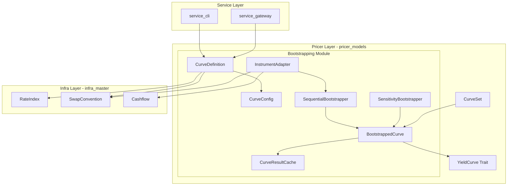
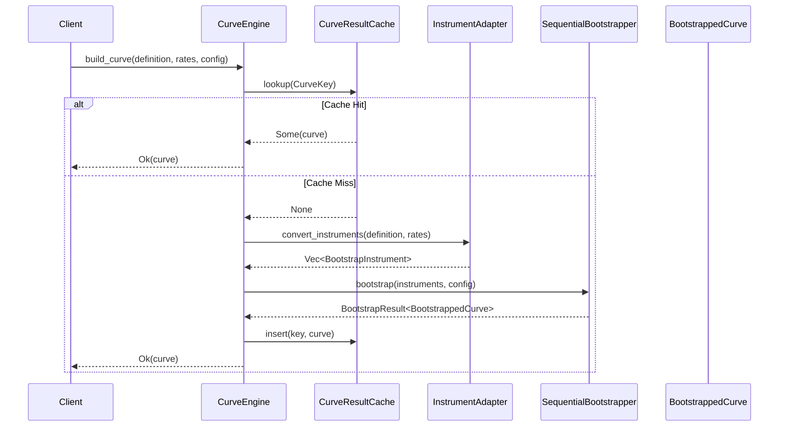
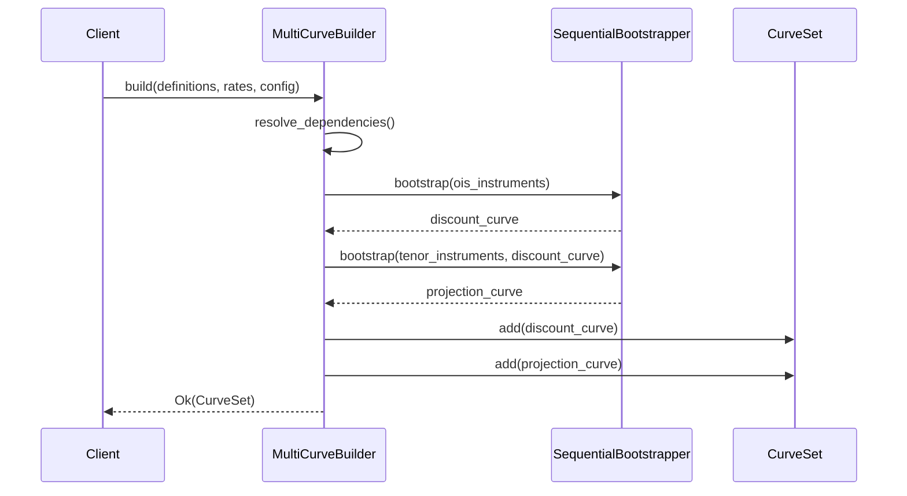
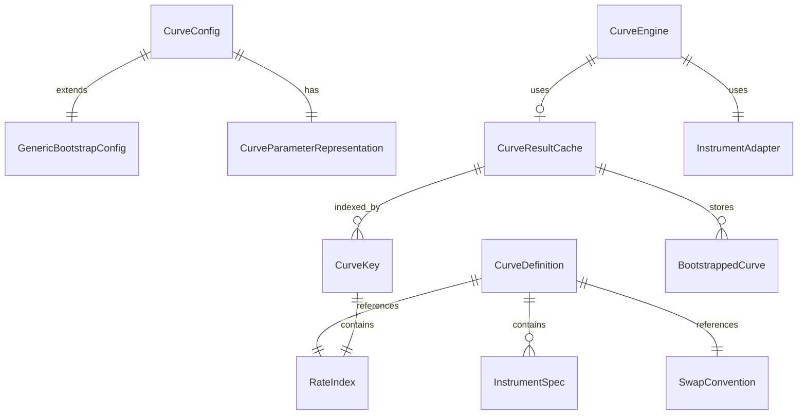

# Technical Design: curve-bootstrap-engine

## Overview

**Purpose**: 本機能は、Index単位でカーブ構築に必要なInstrument集合を宣言的に定義し、Bootstrap手法でParameterCurveを生成する統合エンジンを提供する。既存の`pricer_models/src/market/calibration/bootstrapping/`モジュールを拡張し、`infra_master::trade`の商品定義・コンベンションと統合することで、設定駆動の汎用カーブ構築を実現する。

**Users**: クオンツ開発者、デリバティブプライサー開発者、リスク計算開発者が、カーブ構築・利用・感度計算に本機能を使用する。

**Impact**: 既存の`bootstrapping`モジュールに新規ファイルを追加。`YieldCurve`トレイトに`instantaneous_forward()`メソッドを追加。`GenericBootstrapConfig`にserde対応とパラメータ表現設定を追加。

### Goals

- Index毎のカーブ定義を設定ファイル（JSON）で宣言的に管理
- `infra_master::trade`の商品定義・コンベンションとの統合
- LRUベースの結果キャッシュによる再計算省略
- Enzyme AD対応の感度計算（Jacobian行列）

### Non-Goals

- グローバルオプティマイザによる同時キャリブレーション（将来検討）
- クレジットカーブ・インフレカーブ（本スコープ外）
- Adapter層の新設（A-I-P-Sルールに従いPricer層内で完結）

## Architecture

### Existing Architecture Analysis

**現在のアーキテクチャ**:
- `pricer_models/src/market/calibration/bootstrapping/` に逐次Bootstrap実装
- `SequentialBootstrapper<T>`: Newton-Raphson + Brent fallbackで求解
- `BootstrappedCurve<T>`: `YieldCurve`トレイト実装、discount_factor/zero_rate/forward_rate提供
- `MultiCurveBuilder<T>`: OIS Discount + Tenor Curveの同時構築
- `SensitivityBootstrapper`: Implicit Function Theoremによる感度計算

**統合が必要なコンポーネント**:
- `infra_master::trade::RateIndex`: 金利インデックス定義
- `infra_master::trade::convention::SwapConvention`: スワップコンベンション
- `infra_master::trade::Cashflow`: キャッシュフロー表現

**技術的負債**:
- `BootstrapInstrument`が`infra_master`のコンベンションを使用していない
- 結果キャッシュが存在しない（内部最適化キャッシュのみ）
- serde対応が不完全

### Architecture Pattern & Boundary Map



**Architecture Integration**:
- **Selected pattern**: Extension（既存モジュール拡張）— 既存のテスト・ドキュメントを活用しA-I-P-S準拠
- **Domain boundaries**: `bootstrapping/`モジュール内で定義層・統合層・キャッシュ層を責務分離
- **Existing patterns preserved**: `SequentialBootstrapper`, `BootstrappedCurve`, `MultiCurveBuilder`のAPI維持
- **New components rationale**:
  - `CurveDefinition`: Index→Instrument集合のマッピング（Req 1）
  - `InstrumentAdapter`: infra_master→BootstrapInstrument変換（Req 3）
  - `CurveResultCache`: LRU結果キャッシュ（Req 7）
- **Steering compliance**: A-I-P-S依存ルール維持（Pricer→Infraは許可）

### Technology Stack

| Layer | Choice / Version | Role in Feature | Notes |
|-------|------------------|-----------------|-------|
| Core | `pricer_models` | Bootstrap エンジン、カーブ構築 | 既存モジュール拡張 |
| Foundation | `infra_master` | RateIndex, SwapConvention, Cashflow参照 | 依存追加（A-I-P-S準拠） |
| Caching | `lru` ^0.12 | LRUキャッシュ実装 | 新規依存 |
| Concurrency | `parking_lot` ^0.12 | スレッドセーフRwLock | 既存依存活用 |
| Serialization | `serde` ^1.0 | 設定ファイル読み込み | feature-gated |
| Hashing | `ordered-float` ^4.0 | f64配列のハッシュ化 | 新規依存 |

## System Flows

### Bootstrap Flow（単一カーブ構築）



### Multi-Curve Flow（OIS Discount + Tenor）



## Requirements Traceability

| Requirement | Summary | Components | Interfaces | Flows |
|-------------|---------|------------|------------|-------|
| 1.1-1.6 | Index-Curve Definition | `CurveDefinition`, `InstrumentSpec` | `CurveDefinition::load()` | - |
| 2.1-2.7 | Curve Parameter Config | `CurveConfig`, `CurveParameterRepresentation` | `CurveConfig::new()` | - |
| 3.1-3.6 | Instrument Integration | `InstrumentAdapter` | `InstrumentAdapter::convert()` | Bootstrap Flow |
| 4.1-4.7 | Bootstrap Engine | `SequentialBootstrapper` (既存) | `bootstrap()` | Bootstrap Flow |
| 5.1-5.7 | Generic Curve Interface | `YieldCurve` trait, `BootstrappedCurve` | `discount_factor()`, `instantaneous_forward()` | - |
| 6.1-6.6 | AD Computation Graph | `SensitivityBootstrapper` (既存) | `bootstrap_with_sensitivities()` | - |
| 7.1-7.8 | Curve Caching | `CurveResultCache`, `CurveKey` | `lookup()`, `insert()`, `stats()` | Bootstrap Flow |
| 8.1-8.6 | Multi-Curve Support | `MultiCurveBuilder` (既存), `CurveSet` | `build()`, `build_parallel()` | Multi-Curve Flow |
| 9.1-9.6 | Error Handling | `CurveEngineError` | `thiserror` derive | - |
| 10.1-10.6 | Config Serialization | 全設定型 | `serde` derive | - |

## Components and Interfaces

### Summary Table

| Component | Domain/Layer | Intent | Req Coverage | Key Dependencies | Contracts |
|-----------|--------------|--------|--------------|------------------|-----------|
| `CurveDefinition` | Definition | Index→Instrument集合マッピング | 1.1-1.6 | `RateIndex` (P0), `SwapConvention` (P0) | Service, State |
| `CurveConfig` | Configuration | パラメータ表現・補間器設定 | 2.1-2.7, 10.1-10.6 | `GenericBootstrapConfig` (P0) | Service |
| `InstrumentAdapter` | Integration | infra_master→BootstrapInstrument変換 | 3.1-3.6 | `SwapConvention` (P0), `Cashflow` (P1) | Service |
| `CurveResultCache` | Caching | LRU結果キャッシュ | 7.1-7.8 | `lru` (P0), `parking_lot` (P0) | Service, State |
| `CurveEngine` | Orchestration | カーブ構築オーケストレーション | 全般 | `SequentialBootstrapper` (P0), `CurveResultCache` (P1) | Service |
| `YieldCurve` trait | Interface | 汎用カーブインターフェース | 5.1-5.7 | - | Service |
| `CurveEngineError` | Error | 統合エラー型 | 9.1-9.6 | `BootstrapError` (P0) | - |

---

### Definition Layer

#### CurveDefinition

| Field | Detail |
|-------|--------|
| Intent | Index毎にカーブ構築に必要なInstrument集合を宣言的に定義 |
| Requirements | 1.1, 1.2, 1.3, 1.4, 1.5, 1.6 |

**Responsibilities & Constraints**
- Index（RateIndex）とInstrument仕様のマッピングを保持
- テナーポイント（1M, 3M, 6M, 1Y, 2Y, ..., 50Y）を定義
- コンベンション参照（DayCount, BDC, PaymentFrequency）を含む
- JSON/YAML形式でのシリアライズ/デシリアライズをサポート

**Dependencies**
- Inbound: `CurveEngine` — カーブ構築時の定義参照 (P0)
- Outbound: `infra_master::trade::RateIndex` — Index識別 (P0)
- Outbound: `infra_master::trade::convention::SwapConvention` — コンベンション参照 (P0)

**Contracts**: Service [x] / State [x]

##### Service Interface

```rust
/// Index単位のカーブ定義
#[derive(Debug, Clone)]
#[cfg_attr(feature = "serde", derive(Serialize, Deserialize))]
pub struct CurveDefinition {
    /// カーブ識別子（例: "USD-SOFR", "EUR-ESTR"）
    pub index_key: String,
    /// 対応するRateIndex
    pub rate_index: RateIndex,
    /// Instrument仕様リスト
    pub instruments: Vec<InstrumentSpec>,
    /// 参照コンベンション
    pub convention: SwapConvention,
}

/// Instrument仕様
#[derive(Debug, Clone)]
#[cfg_attr(feature = "serde", derive(Serialize, Deserialize))]
pub struct InstrumentSpec {
    /// Instrument種別
    pub instrument_type: CurveInstrumentType,
    /// テナー（満期）
    pub tenor: Tenor,
    /// オプション: Futures Convexity調整
    pub convexity_adjustment: Option<f64>,
}

/// カーブ構築用Instrument種別
#[derive(Debug, Clone, Copy, PartialEq, Eq)]
#[cfg_attr(feature = "serde", derive(Serialize, Deserialize))]
pub enum CurveInstrumentType {
    /// Overnight Index Swap
    Ois,
    /// Interest Rate Swap
    Irs,
    /// Forward Rate Agreement
    Fra,
    /// Interest Rate Future
    Future,
    /// Deposit
    Deposit,
}

impl CurveDefinition {
    /// JSONファイルからロード
    pub fn load_from_json(path: &Path) -> Result<Self, CurveEngineError>;

    /// デフォルト定義を取得（組み込みIndex用）
    pub fn default_for_index(index: RateIndex) -> Option<Self>;

    /// Instrument仕様を満期順にソート
    pub fn sorted_instruments(&self) -> Vec<&InstrumentSpec>;
}
```

- Preconditions: `instruments`が空でないこと
- Postconditions: ロード成功時、有効な`CurveDefinition`を返す
- Invariants: `rate_index`と`convention.float_index`が整合すること

---

#### CurveConfig

| Field | Detail |
|-------|--------|
| Intent | カーブ構築のパラメータ表現と補間器を設定 |
| Requirements | 2.1, 2.2, 2.3, 2.4, 2.5, 2.6, 2.7 |

**Responsibilities & Constraints**
- パラメータ表現種別（LogDF, ZeroRate, InstantaneousForward）を指定
- 補間器種別（LogLinear, LinearZeroRate, CubicSpline等）を指定
- 外挿設定と負金利許可フラグを管理
- 既存`GenericBootstrapConfig<T>`を拡張

**Dependencies**
- Inbound: `CurveEngine` — 構築設定参照 (P0)
- Outbound: `GenericBootstrapConfig<T>` — 基本設定 (P0)

**Contracts**: Service [x]

##### Service Interface

```rust
/// パラメータ表現種別
#[derive(Debug, Clone, Copy, PartialEq, Eq, Default)]
#[cfg_attr(feature = "serde", derive(Serialize, Deserialize))]
pub enum CurveParameterRepresentation {
    /// log(DF)を格納・補間（デフォルト）
    #[default]
    LogDiscountFactor,
    /// 連続複利ゼロレートを格納・補間
    ZeroRate,
    /// 瞬間フォワードレートを格納・補間
    InstantaneousForward,
}

/// 拡張カーブ設定
#[derive(Debug, Clone)]
#[cfg_attr(feature = "serde", derive(Serialize, Deserialize))]
pub struct CurveConfig<T: Float> {
    /// 基本Bootstrap設定
    #[cfg_attr(feature = "serde", serde(flatten))]
    pub bootstrap: GenericBootstrapConfig<T>,
    /// パラメータ表現種別
    pub parameter_representation: CurveParameterRepresentation,
}

impl<T: Float> CurveConfig<T> {
    /// デフォルト設定を生成
    pub fn new() -> Self;

    /// パラメータ表現と補間器の組み合わせを検証
    pub fn validate(&self) -> Result<(), CurveEngineError>;
}
```

- Preconditions: なし
- Postconditions: `validate()`成功時、有効な設定組み合わせを保証
- Invariants: `parameter_representation`と`interpolation`の互換性

---

### Integration Layer

#### InstrumentAdapter

| Field | Detail |
|-------|--------|
| Intent | infra_masterの商品定義からBootstrapInstrumentへ変換 |
| Requirements | 3.1, 3.2, 3.3, 3.4, 3.5, 3.6 |

**Responsibilities & Constraints**
- `SwapConvention`からOIS/IRS用の`BootstrapInstrument`を生成
- キャッシュフロースケジュールを`infra_master::trade::Cashflow`で展開
- FRA/Futuresの変換をサポート
- Convexity調整を適用（Futures）

**Dependencies**
- Inbound: `CurveEngine` — Instrument変換要求 (P0)
- Outbound: `infra_master::trade::convention::SwapConvention` — コンベンション参照 (P0)
- Outbound: `infra_master::trade::Cashflow` — キャッシュフロー展開 (P1)
- Outbound: `BootstrapInstrument<T>` — 変換先 (P0)

**Contracts**: Service [x]

##### Service Interface

```rust
/// Instrument変換アダプター
pub struct InstrumentAdapter;

impl InstrumentAdapter {
    /// CurveDefinitionとレートからBootstrapInstrumentリストを生成
    pub fn convert<T: Float>(
        definition: &CurveDefinition,
        rates: &[(Tenor, T)],
        valuation_date: Date,
    ) -> Result<Vec<BootstrapInstrument<T>>, CurveEngineError>;

    /// OIS Instrumentを生成
    fn create_ois<T: Float>(
        convention: &SwapConvention,
        tenor: Tenor,
        rate: T,
        valuation_date: Date,
    ) -> Result<BootstrapInstrument<T>, CurveEngineError>;

    /// IRS Instrumentを生成（キャッシュフロー展開あり）
    fn create_irs<T: Float>(
        convention: &SwapConvention,
        tenor: Tenor,
        rate: T,
        valuation_date: Date,
    ) -> Result<BootstrapInstrument<T>, CurveEngineError>;

    /// FRA Instrumentを生成
    fn create_fra<T: Float>(
        convention: &SwapConvention,
        start_tenor: Tenor,
        end_tenor: Tenor,
        rate: T,
        valuation_date: Date,
    ) -> Result<BootstrapInstrument<T>, CurveEngineError>;

    /// Future Instrumentを生成（Convexity調整適用）
    fn create_future<T: Float>(
        tenor: Tenor,
        price: T,
        convexity_adjustment: T,
        valuation_date: Date,
    ) -> Result<BootstrapInstrument<T>, CurveEngineError>;
}
```

- Preconditions: `rates`が`definition.instruments`と同数であること
- Postconditions: 有効な`BootstrapInstrument`リストを返す
- Invariants: 生成されたInstrumentの満期が正順であること

---

### Caching Layer

#### CurveResultCache

| Field | Detail |
|-------|--------|
| Intent | 同一条件でのカーブ再構築を省略するLRUキャッシュ |
| Requirements | 7.1, 7.2, 7.3, 7.4, 7.5, 7.6, 7.7, 7.8 |

**Responsibilities & Constraints**
- (Index, rates_hash, config_hash)をキーとしてカーブをキャッシュ
- LRU方式でエビクション
- スレッドセーフなアクセスを保証（`RwLock`）
- キャッシュ統計（ヒット率、エントリ数）を提供

**Dependencies**
- Inbound: `CurveEngine` — キャッシュ操作 (P0)
- External: `lru::LruCache` — LRU実装 (P0)
- External: `parking_lot::RwLock` — スレッドセーフロック (P0)

**Contracts**: Service [x] / State [x]

##### Service Interface

```rust
use lru::LruCache;
use parking_lot::RwLock;
use std::sync::Arc;

/// キャッシュキー
#[derive(Debug, Clone, PartialEq, Eq, Hash)]
pub struct CurveKey {
    /// RateIndex識別子
    pub index: RateIndex,
    /// 入力レート配列のハッシュ
    pub rates_hash: u64,
    /// 設定のハッシュ
    pub config_hash: u64,
}

/// キャッシュ統計
#[derive(Debug, Clone, Default)]
pub struct CacheStats {
    pub hits: u64,
    pub misses: u64,
    pub entries: usize,
}

impl CacheStats {
    /// ヒット率を計算
    pub fn hit_rate(&self) -> f64;
}

/// スレッドセーフLRU結果キャッシュ
pub struct CurveResultCache<T: Float> {
    cache: Arc<RwLock<LruCache<CurveKey, BootstrappedCurve<T>>>>,
    stats: Arc<RwLock<CacheStats>>,
}

impl<T: Float> CurveResultCache<T> {
    /// 指定サイズでキャッシュを作成
    pub fn new(capacity: usize) -> Self;

    /// キャッシュをルックアップ
    pub fn lookup(&self, key: &CurveKey) -> Option<BootstrappedCurve<T>>;

    /// キャッシュに挿入
    pub fn insert(&self, key: CurveKey, curve: BootstrappedCurve<T>);

    /// キャッシュをクリア
    pub fn clear(&self);

    /// 統計を取得
    pub fn stats(&self) -> CacheStats;

    /// CurveKeyを生成（ハッシュ計算）
    pub fn make_key<C: Hash>(
        index: RateIndex,
        rates: &[T],
        config: &C,
    ) -> CurveKey;
}
```

- Preconditions: `capacity > 0`
- Postconditions: `lookup`/`insert`はスレッドセーフに実行される
- Invariants: キャッシュサイズは`capacity`を超えない

##### State Management

- **State model**: `LruCache<CurveKey, BootstrappedCurve<T>>` + `CacheStats`
- **Persistence**: インメモリのみ（永続化なし）
- **Concurrency strategy**: `RwLock`による読み書きロック、読み取りは並行可能

---

### Orchestration Layer

#### CurveEngine

| Field | Detail |
|-------|--------|
| Intent | カーブ構築のオーケストレーション（定義→変換→構築→キャッシュ） |
| Requirements | 全般 |

**Responsibilities & Constraints**
- `CurveDefinition`と入力レートからカーブを構築
- キャッシュを確認し、ヒット時は再計算をスキップ
- エラーを統合的にハンドリング

**Dependencies**
- Inbound: Service Layer — カーブ構築要求 (P0)
- Outbound: `CurveDefinition` — 定義参照 (P0)
- Outbound: `InstrumentAdapter` — Instrument変換 (P0)
- Outbound: `SequentialBootstrapper` — Bootstrap実行 (P0)
- Outbound: `CurveResultCache` — キャッシュ操作 (P1)

**Contracts**: Service [x]

##### Service Interface

```rust
/// カーブ構築エンジン
pub struct CurveEngine<T: Float> {
    cache: Option<CurveResultCache<T>>,
}

impl<T: Float> CurveEngine<T> {
    /// キャッシュなしでエンジンを作成
    pub fn new() -> Self;

    /// キャッシュ付きでエンジンを作成
    pub fn with_cache(capacity: usize) -> Self;

    /// カーブを構築
    pub fn build_curve(
        &self,
        definition: &CurveDefinition,
        rates: &[(Tenor, T)],
        config: &CurveConfig<T>,
        valuation_date: Date,
    ) -> Result<BootstrappedCurve<T>, CurveEngineError>;

    /// 感度付きでカーブを構築
    pub fn build_curve_with_sensitivities(
        &self,
        definition: &CurveDefinition,
        rates: &[(Tenor, T)],
        config: &CurveConfig<T>,
        valuation_date: Date,
    ) -> Result<BootstrapResultWithSensitivities<T>, CurveEngineError>;

    /// キャッシュ統計を取得
    pub fn cache_stats(&self) -> Option<CacheStats>;

    /// キャッシュをクリア
    pub fn clear_cache(&self);
}
```

- Preconditions: `definition`と`rates`が整合すること
- Postconditions: 成功時、有効な`BootstrappedCurve`を返す
- Invariants: キャッシュ使用時、同一入力は同一出力を返す

---

### Interface Layer

#### YieldCurve Trait Extension

| Field | Detail |
|-------|--------|
| Intent | 汎用カーブインターフェースに`instantaneous_forward`を追加 |
| Requirements | 5.4 |

**Contracts**: Service [x]

##### Service Interface

```rust
/// YieldCurveトレイト拡張（既存トレイトへの追加）
pub trait YieldCurve<T: Float> {
    /// 割引係数を取得
    fn discount_factor(&self, t: T) -> Result<T, MarketDataError>;

    /// ゼロレートを取得（デフォルト実装あり）
    fn zero_rate(&self, t: T) -> Result<T, MarketDataError>;

    /// フォワードレートを取得（デフォルト実装あり）
    fn forward_rate(&self, t1: T, t2: T) -> Result<T, MarketDataError>;

    /// 瞬間フォワードレートを取得（新規追加、デフォルト実装あり）
    ///
    /// # Mathematical Definition
    /// f(t) = -d/dt ln(D(t)) = r(t) + t * dr/dt
    ///
    /// # Default Implementation
    /// 解析微分を使用。補間器が微分を提供しない場合はNotImplementedを返す。
    fn instantaneous_forward(&self, t: T) -> Result<T, MarketDataError> {
        // デフォルト: 補間器の解析微分が必要なためNotImplemented
        // 具体的な実装は BootstrappedCurve で提供
        Err(MarketDataError::NotImplemented {
            feature: "instantaneous_forward requires interpolator derivative".into(),
        })
    }

    /// Pillar点数を取得（オプション、デフォルト実装）
    fn pillar_count(&self) -> Option<usize> { None }

    /// Pillar点を取得（オプション、デフォルト実装）
    fn pillars(&self) -> Option<&[T]> { None }
}
```

**Implementation Note**: `BootstrappedCurve`では補間器の`derivative(t)`メソッドを使用して解析微分を計算する。LogDF表現の場合: `f(t) = -d(log_df)/dt`。ZeroRate表現の場合: `f(t) = r(t) + t * dr/dt`。

---

### Error Handling Layer

#### CurveEngineError

| Field | Detail |
|-------|--------|
| Intent | カーブエンジン全体の統合エラー型 |
| Requirements | 9.1, 9.2, 9.3, 9.4, 9.5, 9.6 |

**Contracts**: -

##### Service Interface

```rust
use thiserror::Error;

/// カーブエンジンエラー
#[derive(Error, Debug, Clone)]
pub enum CurveEngineError {
    /// 設定エラー
    #[error("Configuration error: {field} - {reason}")]
    Configuration {
        field: &'static str,
        reason: String,
    },

    /// Instrumentエラー
    #[error("Instrument error at tenor {tenor}: {reason}")]
    Instrument {
        tenor: String,
        reason: String,
    },

    /// 不完全なInstrument定義
    #[error("Incomplete instrument definition: {0}")]
    IncompleteInstrumentDefinition(String),

    /// 未知のIndex
    #[error("Unknown index: {0}")]
    UnknownIndex(String),

    /// Bootstrapエラー（ラップ）
    #[error("Bootstrap error: {0}")]
    Bootstrap(#[from] BootstrapError),

    /// 補間エラー
    #[error("Interpolation error: {0}")]
    Interpolation(String),

    /// キャッシュエラー
    #[error("Cache error: {0}")]
    Cache(String),

    /// 設定パースエラー
    #[error("Configuration parse error: {0}")]
    ConfigurationParse(String),

    /// 循環依存
    #[error("Circular dependency detected in curve definitions")]
    CircularDependency,

    /// 無効な組み合わせ
    #[error("Invalid configuration: {param_repr:?} is incompatible with {interpolation:?}")]
    InvalidConfiguration {
        param_repr: CurveParameterRepresentation,
        interpolation: BootstrapInterpolation,
    },
}

impl CurveEngineError {
    pub fn configuration(field: &'static str, reason: impl Into<String>) -> Self;
    pub fn instrument(tenor: impl Into<String>, reason: impl Into<String>) -> Self;
    pub fn is_bootstrap_error(&self) -> bool;
}
```

## Data Models

### Domain Model



**Aggregates**:
- `CurveDefinition`: Index定義の集約ルート
- `CurveConfig`: 設定の集約ルート
- `CurveResultCache`: キャッシュの集約ルート

**Business Rules**:
- `CurveDefinition.instruments`は空であってはならない
- `CurveConfig`のパラメータ表現と補間器は互換性がなければならない
- `CurveKey`のハッシュは決定論的でなければならない

## Error Handling

### Error Strategy

`thiserror`を使用した構造化エラーで、各エラー種別に診断情報を含める。

### Error Categories and Responses

**Configuration Errors** (設定エラー):
- `InvalidConfiguration` → パラメータ表現と補間器の組み合わせを確認
- `ConfigurationParse` → JSON/YAMLスキーマを確認

**Instrument Errors** (Instrumentエラー):
- `IncompleteInstrumentDefinition` → 必須フィールドを確認
- `UnknownIndex` → サポートされるIndex一覧を参照

**Bootstrap Errors** (Bootstrapエラー):
- `ConvergenceFailure` → toleranceを緩和、または入力レートを確認
- `ArbitrageDetected` → 入力レートの整合性を確認

**Cache Errors** (キャッシュエラー):
- 内部エラー → キャッシュをクリアして再試行

### Monitoring

- Bootstrap失敗時: maturity, residual, iterationsをログ出力
- キャッシュ統計: ヒット率を定期的にログ出力（デバッグレベル）

## Testing Strategy

### Unit Tests

- `CurveDefinition::load_from_json()` — 有効/無効なJSONでのロードテスト
- `InstrumentAdapter::convert()` — OIS/IRS/FRA/Future各種変換テスト
- `CurveResultCache::lookup()/insert()` — キャッシュヒット/ミステスト
- `CurveConfig::validate()` — 有効/無効な設定組み合わせテスト
- `CurveKey`ハッシュ — 同一入力で同一ハッシュ、異なる入力で異なるハッシュ

### Integration Tests

- `CurveEngine::build_curve()` — 定義→変換→構築の一連フロー
- キャッシュ統合 — 2回目の呼び出しでキャッシュヒット確認
- `MultiCurveBuilder` — OIS Discount + Tenor Curveの同時構築
- `SensitivityBootstrapper`との統合 — 感度計算の整合性

### Performance Tests

- キャッシュヒット時の応答時間（構築時の10%以下）
- 並列アクセス時のスループット（`RwLock`競合評価）
- メモリ使用量（100カーブキャッシュ時のフットプリント）

## Optional Sections

### Performance & Scalability

**Target Metrics**:
- 単一カーブ構築: < 10ms（50 pillar点）
- キャッシュヒット: < 100μs
- キャッシュミス率: < 10%（定常状態）

**Scaling Approaches**:
- LRUキャッシュサイズは設定可能（デフォルト100エントリ）
- `MultiCurveBuilder::build_parallel()`でRayon並列構築

### Migration Strategy

**既存コードへの影響**:
1. `YieldCurve`トレイトに`instantaneous_forward()`追加（破壊的変更）
   - 全実装に対してデフォルト実装を提供して互換性維持
2. `GenericBootstrapConfig`にserde derive追加（非破壊的）
3. 新規ファイル追加（非破壊的）

**Phase Breakdown**:
1. Phase 1: 型定義（`CurveDefinition`, `CurveConfig`）
2. Phase 2: `InstrumentAdapter`実装
3. Phase 3: `CurveResultCache`実装
4. Phase 4: `YieldCurve`トレイト拡張
5. Phase 5: 統合テスト・ベンチマーク

## Supporting References

### Default CurveDefinitions（組み込み定義）

```json
{
  "USD-SOFR": {
    "index_key": "USD-SOFR",
    "rate_index": "Sofr",
    "convention": "usd_sofr",
    "instruments": [
      {"instrument_type": "Ois", "tenor": "1M"},
      {"instrument_type": "Ois", "tenor": "3M"},
      {"instrument_type": "Ois", "tenor": "6M"},
      {"instrument_type": "Ois", "tenor": "1Y"},
      {"instrument_type": "Ois", "tenor": "2Y"},
      {"instrument_type": "Ois", "tenor": "3Y"},
      {"instrument_type": "Ois", "tenor": "5Y"},
      {"instrument_type": "Ois", "tenor": "7Y"},
      {"instrument_type": "Ois", "tenor": "10Y"},
      {"instrument_type": "Ois", "tenor": "15Y"},
      {"instrument_type": "Ois", "tenor": "20Y"},
      {"instrument_type": "Ois", "tenor": "30Y"},
      {"instrument_type": "Ois", "tenor": "50Y"}
    ]
  }
}
```

### File Structure（新規ファイル配置）

```
crates/pricer_models/src/market/calibration/bootstrapping/
├── mod.rs              (既存、pub mod追加)
├── definition.rs       (新規: CurveDefinition, InstrumentSpec)
├── curve_config.rs     (新規: CurveConfig, CurveParameterRepresentation)
├── adapter.rs          (新規: InstrumentAdapter)
├── result_cache.rs     (新規: CurveResultCache, CurveKey, CacheStats)
├── curve_engine.rs     (新規: CurveEngine)
└── engine_error.rs     (新規: CurveEngineError)
```
