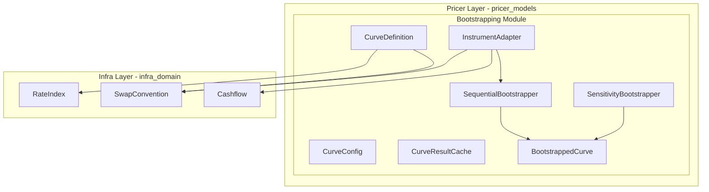

# Technical Design: curve-bootstrap-engine

## Overview

**Purpose**: 本機能は、Index単位でカーブ構築に必要なInstrument集合を宣言的に定義し、Bootstrap手法でParameterCurveを生成する統合エンジンを提供する。既存の`pricer_models/src/market/calibration/bootstrapping/`モジュールを拡張し、`infra_domain::trade`の商品定義・コンベンションと統合することで、設定駆動の汎用カーブ構築を実現する。

**Users**: クオンツ開発者、デリバティブプライサー開発者、リスク計算開発者が、カーブ構築・利用・感度計算に本機能を使用する。

**Impact**: 既存の`bootstrapping`モジュールに新規ファイルを追加。`YieldCurve`トレイトに`instantaneous_forward()`メソッドを追加。`GenericBootstrapConfig`にserde対応とパラメータ表現設定を追加。

### Goals

- Index毎のカーブ定義を設定ファイル（JSON）で宣言的に管理
- `infra_domain::trade`の商品定義・コンベンションとの統合
- LRUベースの結果キャッシュによる再計算省略
- Enzyme AD対応の感度計算（Jacobian行列）

## Architecture

### Existing Architecture Analysis

**現在のアーキテクチャ**:
- `pricer_models/src/market/calibration/bootstrapping/` に逐次Bootstrap実装
- `SequentialBootstrapper<T>`: Newton-Raphson + Brent fallbackで求解
- `BootstrappedCurve<T>`: `YieldCurve`トレイト実装、discount_factor/zero_rate/forward_rate提供
- `MultiCurveBuilder<T>`: OIS Discount + Tenor Curveの同時構築
- `SensitivityBootstrapper`: Implicit Function Theoremによる感度計算

**統合が必要なコンポーネント**:
- `infra_domain::trade::RateIndex`: 金利インデックス定義
- `infra_domain::trade::convention::SwapConvention`: スワップコンベンション
- `infra_domain::trade::Cashflow`: キャッシュフロー表現

**技術的負債**:
- `BootstrapInstrument`が`infra_domain`のコンベンションを使用していない
- 結果キャッシュが存在しない（内部最適化キャッシュのみ）
- serde対応が不完全

### Architecture Pattern & Boundary Map



**Architecture Integration**:
- **Selected pattern**: Extension（既存モジュール拡張）— 既存のテスト・ドキュメントを活用しA-I-P-S準拠
- **Domain boundaries**: `bootstrapping/`モジュール内で定義層・統合層・キャッシュ層を責務分離
- **Existing patterns preserved**: `SequentialBootstrapper`, `BootstrappedCurve`, `MultiCurveBuilder`のAPI維持
- **New components rationale**:
  - `CurveDefinition`: Index→Instrument集合のマッピング（Req 1）
  - `InstrumentAdapter`: infra_domain→BootstrapInstrument変換（Req 3）
  - `CurveResultCache`: LRU結果キャッシュ（Req 7）
- **Steering compliance**: A-I-P-S依存ルール維持（Pricer→Infraは許可）

## System Flows

### Bootstrap Flow（単一カーブ構築）

Client requests curve build → CurveEngine checks Cache → on miss: Adapter converts instruments → Engine bootstraps → Cache stores result → Client receives curve

### Multi-Curve Flow（OIS Discount + Tenor）

Client requests multi-curve → MultiBuilder resolves dependencies → Engine bootstraps OIS discount curve → Engine bootstraps tenor projection curve (using discount curve) → CurveSet aggregates curves → Client receives CurveSet

## Requirements Traceability

| Requirement | Summary | Components |
|-------------|---------|------------|
| 1.1-1.6 | Index-Curve Definition | `CurveDefinition`, `InstrumentSpec` |
| 2.1-2.7 | Curve Parameter Config | `CurveConfig`, `CurveParameterRepresentation` |
| 3.1-3.6 | Instrument Integration | `InstrumentAdapter` |
| 4.1-4.7 | Bootstrap Engine | `SequentialBootstrapper` (既存) |
| 5.1-5.7 | Generic Curve Interface | `YieldCurve` trait, `BootstrappedCurve` |
| 6.1-6.6 | AD Computation Graph | `SensitivityBootstrapper` (既存) |
| 7.1-7.8 | Curve Caching | `CurveResultCache`, `CurveKey` |
| 8.1-8.6 | Multi-Curve Support | `MultiCurveBuilder` (既存), `CurveSet` |
| 9.1-9.6 | Error Handling | `CurveEngineError` |
| 10.1-10.6 | Config Serialization | 全設定型 |

## Components and Interfaces

### Summary Table

| Component | Domain/Layer | Intent | Req Coverage | Key Dependencies |
|-----------|--------------|--------|--------------|------------------|
| `CurveDefinition` | Definition | Index→Instrument集合マッピング | 1.1-1.6 | `RateIndex` (P0), `SwapConvention` (P0) |
| `CurveConfig` | Configuration | パラメータ表現・補間器設定 | 2.1-2.7, 10.1-10.6 | `GenericBootstrapConfig` (P0) |
| `InstrumentAdapter` | Integration | infra_domain→BootstrapInstrument変換 | 3.1-3.6 | `SwapConvention` (P0), `Cashflow` (P1) |
| `CurveResultCache` | Caching | LRU結果キャッシュ | 7.1-7.8 | `lru` (P0), `parking_lot` (P0) |
| `CurveEngine` | Orchestration | カーブ構築オーケストレーション | 全般 | `SequentialBootstrapper` (P0), `CurveResultCache` (P1) |
| `YieldCurve` trait | Interface | 汎用カーブインターフェース | 5.1-5.7 | - |
| `CurveEngineError` | Error | 統合エラー型 | 9.1-9.6 | `BootstrapError` (P0) |

### Definition Layer

#### CurveDefinition

**Intent**: Index毎にカーブ構築に必要なInstrument集合を宣言的に定義

**Requirements**: 1.1, 1.2, 1.3, 1.4, 1.5, 1.6

**Responsibilities**: Index（RateIndex）とInstrument仕様のマッピングを保持、テナーポイント定義、コンベンション参照、JSON/YAMLシリアライズ対応

**Dependencies**: `infra_domain::trade::RateIndex` (P0), `infra_domain::trade::convention::SwapConvention` (P0)

```rust
pub struct CurveDefinition {
    pub index_key: String,
    pub rate_index: RateIndex,
    pub instruments: Vec<InstrumentSpec>,
    pub convention: SwapConvention,
}

pub struct InstrumentSpec {
    pub instrument_type: CurveInstrumentType,
    pub tenor: Tenor,
    pub convexity_adjustment: Option<f64>,
}

pub enum CurveInstrumentType {
    Ois, Irs, Fra, Future, Deposit,
}
```

#### CurveConfig

**Intent**: カーブ構築のパラメータ表現と補間器を設定

**Requirements**: 2.1, 2.2, 2.3, 2.4, 2.5, 2.6, 2.7

```rust
pub enum CurveParameterRepresentation {
    #[default]
    LogDiscountFactor,
    ZeroRate,
    InstantaneousForward,
}

pub struct CurveConfig<T: Float> {
    #[cfg_attr(feature = "serde", serde(flatten))]
    pub bootstrap: GenericBootstrapConfig<T>,
    pub parameter_representation: CurveParameterRepresentation,
}
```

### Integration Layer

#### InstrumentAdapter

**Intent**: infra_domainの商品定義からBootstrapInstrumentへ変換

**Requirements**: 3.1, 3.2, 3.3, 3.4, 3.5, 3.6

```rust
pub struct InstrumentAdapter;

impl InstrumentAdapter {
    pub fn convert<T: Float>(
        definition: &CurveDefinition,
        rates: &[(Tenor, T)],
        valuation_date: Date,
    ) -> Result<Vec<BootstrapInstrument<T>>, CurveEngineError>;
}
```

### Caching Layer

#### CurveResultCache

**Intent**: 同一条件でのカーブ再構築を省略するLRUキャッシュ

**Requirements**: 7.1, 7.2, 7.3, 7.4, 7.5, 7.6, 7.7, 7.8

```rust
#[derive(Debug, Clone, PartialEq, Eq, Hash)]
pub struct CurveKey {
    pub index: RateIndex,
    pub rates_hash: u64,
    pub config_hash: u64,
}

pub struct CurveResultCache<T: Float> {
    cache: Arc<RwLock<LruCache<CurveKey, BootstrappedCurve<T>>>>,
    stats: Arc<RwLock<CacheStats>>,
}
```

### Orchestration Layer

#### CurveEngine

**Intent**: カーブ構築のオーケストレーション（定義→変換→構築→キャッシュ）

```rust
pub struct CurveEngine<T: Float> {
    cache: Option<CurveResultCache<T>>,
}

impl<T: Float> CurveEngine<T> {
    pub fn build_curve(
        &self,
        definition: &CurveDefinition,
        rates: &[(Tenor, T)],
        config: &CurveConfig<T>,
        valuation_date: Date,
    ) -> Result<BootstrappedCurve<T>, CurveEngineError>;
}
```

### Interface Layer

#### YieldCurve Trait Extension

```rust
pub trait YieldCurve<T: Float> {
    fn discount_factor(&self, t: T) -> Result<T, MarketDataError>;
    fn zero_rate(&self, t: T) -> Result<T, MarketDataError>;
    fn forward_rate(&self, t1: T, t2: T) -> Result<T, MarketDataError>;

    /// 新規追加: f(t) = -d/dt ln(D(t))
    fn instantaneous_forward(&self, t: T) -> Result<T, MarketDataError> {
        Err(MarketDataError::NotImplemented {
            feature: "instantaneous_forward requires interpolator derivative".into(),
        })
    }
}
```

### Error Handling Layer

#### CurveEngineError

```rust
#[derive(Error, Debug, Clone)]
pub enum CurveEngineError {
    #[error("Configuration error: {field} - {reason}")]
    Configuration { field: &'static str, reason: String },

    #[error("Instrument error at tenor {tenor}: {reason}")]
    Instrument { tenor: String, reason: String },

    #[error("Bootstrap error: {0}")]
    Bootstrap(#[from] BootstrapError),

    #[error("Invalid configuration: {param_repr:?} is incompatible with {interpolation:?}")]
    InvalidConfiguration {
        param_repr: CurveParameterRepresentation,
        interpolation: BootstrapInterpolation,
    },
}
```

## Data Models

**Aggregates**:
- `CurveDefinition`: Index定義の集約ルート
- `CurveConfig`: 設定の集約ルート
- `CurveResultCache`: キャッシュの集約ルート

**Business Rules**:
- `CurveDefinition.instruments`は空であってはならない
- `CurveConfig`のパラメータ表現と補間器は互換性がなければならない
- `CurveKey`のハッシュは決定論的でなければならない

## Error Handling

### Error Strategy

`thiserror`を使用した構造化エラーで、各エラー種別に診断情報を含める。

**Configuration Errors**: InvalidConfiguration → パラメータ表現と補間器の組み合わせを確認

**Instrument Errors**: IncompleteInstrumentDefinition → 必須フィールドを確認

**Bootstrap Errors**: ConvergenceFailure → toleranceを緩和、または入力レートを確認

**Monitoring**: Bootstrap失敗時に maturity, residual, iterationsをログ出力。キャッシュ統計のヒット率を定期的にログ出力。

## Testing Strategy

**Unit Tests**: CurveDefinition::load_from_json(), InstrumentAdapter::convert(), CurveResultCache::lookup()/insert(), CurveConfig::validate(), CurveKey ハッシュ

**Integration Tests**: CurveEngine::build_curve()の一連フロー、キャッシュ統合、MultiCurveBuilder、SensitivityBootstrapperとの統合

**Performance Tests**: キャッシュヒット時の応答時間（< 100μs）、並列アクセス時のスループット、メモリ使用量（100カーブキャッシュ時）

## Default CurveDefinitions（組み込み定義）

```json
{
  "USD-SOFR": {
    "index_key": "USD-SOFR",
    "rate_index": "Sofr",
    "convention": "usd_sofr",
    "instruments": [
      {"instrument_type": "Ois", "tenor": "1M"},
      {"instrument_type": "Ois", "tenor": "1Y"},
      {"instrument_type": "Ois", "tenor": "5Y"},
      {"instrument_type": "Ois", "tenor": "10Y"},
      {"instrument_type": "Ois", "tenor": "30Y"}
    ]
  }
}
```

## File Structure（新規ファイル配置）

```
crates/pricer_models/src/market/calibration/bootstrapping/
├── mod.rs              (既存、pub mod追加)
├── definition.rs       (新規: CurveDefinition, InstrumentSpec)
├── curve_config.rs     (新規: CurveConfig, CurveParameterRepresentation)
├── adapter.rs          (新規: InstrumentAdapter)
├── result_cache.rs     (新規: CurveResultCache, CurveKey, CacheStats)
├── curve_engine.rs     (新規: CurveEngine)
└── engine_error.rs     (新規: CurveEngineError)
```
