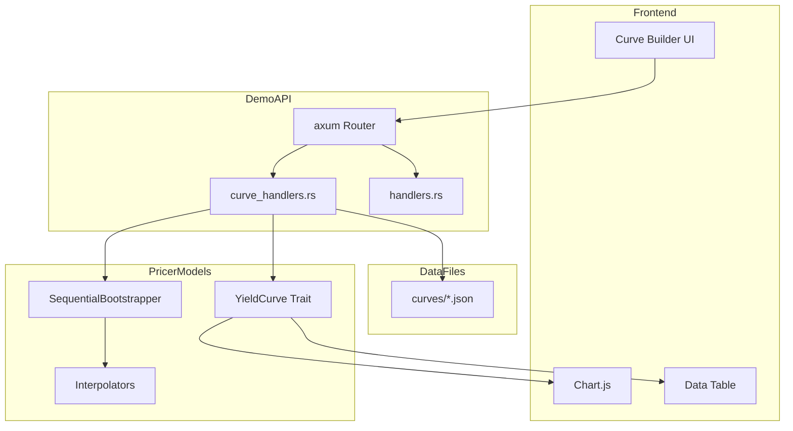
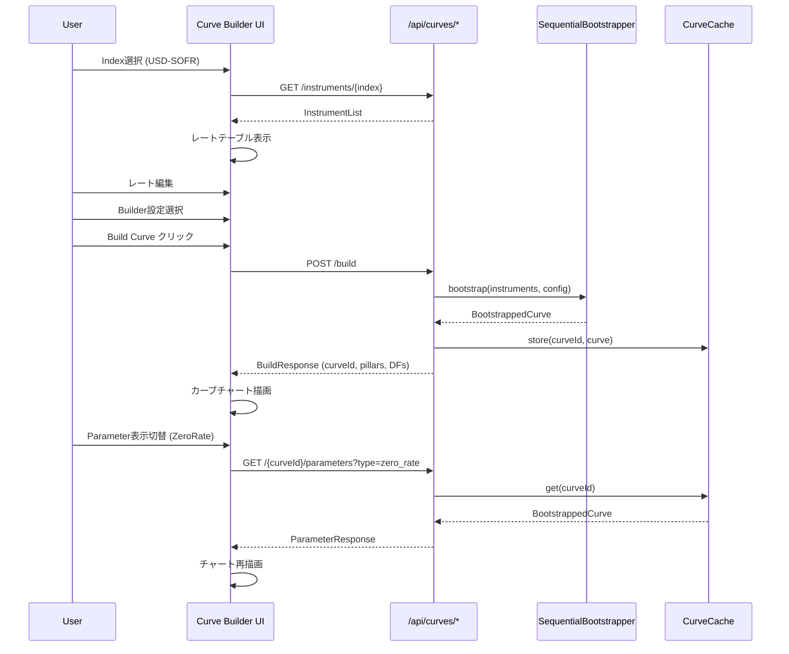

# Design Document: curve-builder-webapp

## Overview

**Purpose**: Demo WebAppのCurve Build画面を精緻化し、Index別Instrument管理、Builderモデル選択、Parameterカーブ表示機能を提供する。

**Users**: 定量アナリスト、トレーダーがカーブ構築・分析ワークフローで使用。

**Impact**: 既存の`#irs-bootstrap-view`からIRS評価機能を分離・削除し、カーブ構築に特化した画面に再構成。

### Goals

- Index別Instrumentリストのファイルベース管理と動的読み込み
- 4種類の補間手法（Linear, LogLinear, CubicSpline, Monotonic）選択
- Discount Factor, Zero Rate, Forward Rateの3モード表示切替
- IRS評価機能のCurve Build画面からの完全削除

### Non-Goals

- IRS評価機能の新規画面への移植（本仕様スコープ外）
- リアルタイム市場データフィード連携
- マルチカーブ（OIS + Tenor）の同時構築UI
- サーバーサイドでのBuilder設定永続化

---

## Architecture

### Existing Architecture Analysis

**現行パターン**:
- A-I-P-S単方向データフロー（Adapter → Infra → Pricer → Service）
- `pricer_models::market::calibration::bootstrapping` にカーブ構築ロジック集約
- Demo層は `demo/gui/src/web/` でaxum Routerベースの REST API提供
- WebSocket経由でリアルタイム更新通知

**維持する制約**:
- Pricer層はService/Adapter層に依存しない
- Demo層はPricer層の計算ロジックを呼び出すのみ
- 静的ディスパッチ（enum）によるEnzyme最適化

### Architecture Pattern & Boundary Map



**Architecture Integration**:
- **Selected Pattern**: ハイブリッド拡張（新規curve_handlers.rs + 既存handlers.rs維持）
- **Domain Boundaries**: CurveBuilder APIは`/api/curves/*`に分離、既存`/api/bootstrap`は維持
- **Existing Patterns Preserved**: axum Router, camelCase JSON, Arc<AppState>パターン
- **New Components Rationale**: curve_handlers.rsで責務分離、pricer_typesは共有
- **Steering Compliance**: A-I-P-S依存ルール遵守、Demo層からPricer層への単方向依存

### Technology Stack

| Layer | Choice / Version | Role in Feature | Notes |
|-------|------------------|-----------------|-------|
| Frontend | Vanilla JS, Chart.js | カーブ表示、レート入力UI | 既存パターン継続 |
| Backend | Rust, axum 0.7 | REST API, 静的ファイル配信 | 既存スタック |
| Data | JSON files | Index別Instrumentリスト | `demo/data/input/curves/` |
| Compute | pricer_models | カーブ構築、Parameter計算 | 既存ライブラリ活用 |

---

## System Flows

### カーブ構築フロー



**Key Decisions**:
- 構築済みカーブはサーバー側でキャッシュ（curveId管理）
- Parameter取得は構築済みカーブから計算（再構築不要）

---

## Requirements Traceability

| Requirement | Summary | Components | Interfaces | Flows |
|-------------|---------|------------|------------|-------|
| 1.1-1.5 | Index別Instrument管理 | CurveDataLoader, InstrumentListResponse | GET /instruments/{index} | - |
| 2.1-2.6 | レート入力UI | RateInputTable (UI), RateImportExport | - | - |
| 3.1-3.5 | Builderモデル選択 | BuilderConfigPanel (UI), BuilderListResponse | GET /builders | - |
| 4.1-4.5 | カーブ構築実行 | CurveBuildHandler, CurveBuildRequest/Response | POST /build | カーブ構築フロー |
| 5.1-5.6 | Parameterカーブ表示 | ParameterDisplayPanel (UI), ParameterResponse | GET /{curveId}/parameters | - |
| 6.1-6.4 | IRS機能削除 | (削除対象) | - | - |
| 7.1-7.6 | API設計 | curve_handlers.rs | 全エンドポイント | - |

---

## Components and Interfaces

### Summary

| Component | Domain/Layer | Intent | Req Coverage | Key Dependencies | Contracts |
|-----------|--------------|--------|--------------|------------------|-----------|
| CurveDataLoader | Backend/Data | Index別Instrumentファイル読み込み | 1.1-1.5 | std::fs (P0) | Service |
| CurveBuildHandler | Backend/API | カーブ構築API | 4.1-4.5, 7.2 | SequentialBootstrapper (P0) | API |
| CurveParameterHandler | Backend/API | Parameter取得API | 5.1-5.6, 7.3 | YieldCurve (P0), CurveCache (P1) | API |
| BuilderListHandler | Backend/API | Builder一覧取得 | 3.1-3.5, 7.4 | - | API |
| InstrumentListHandler | Backend/API | Instrument一覧取得 | 1.1-1.5, 7.1 | CurveDataLoader (P0) | API |
| RateInputTable | Frontend/UI | レート編集テーブル | 2.1-2.6 | - | State |
| ParameterDisplayPanel | Frontend/UI | Parameter表示切替 | 5.1-5.6 | Chart.js (P0) | State |
| BuilderConfigPanel | Frontend/UI | Builder設定UI | 3.1-3.5 | LocalStorage (P1) | State |

---

### Backend / API Layer

#### CurveDataLoader

| Field | Detail |
|-------|--------|
| Intent | `demo/data/input/curves/`からIndex別Instrumentリストを読み込む |
| Requirements | 1.1, 1.2, 1.3, 1.4, 1.5 |

**Responsibilities & Constraints**
- ファイルシステムからJSONファイルを読み込み、InstrumentListに変換
- ファイル不在時はデフォルトInstrumentリストにフォールバック
- サポートIndex: `usd-sofr`, `eur-estr`, `jpy-tona`

**Dependencies**
- Inbound: InstrumentListHandler — Instrumentリスト取得 (P0)
- External: std::fs — ファイル読み込み (P0)

**Contracts**: Service [x]

##### Service Interface

```rust
/// Index別Instrumentリストを読み込む
pub struct CurveDataLoader {
    base_path: PathBuf,
}

impl CurveDataLoader {
    pub fn new(base_path: PathBuf) -> Self;

    /// 指定Indexのインstrumentリストを取得
    /// - index: "usd-sofr", "eur-estr", "jpy-tona"
    /// - Returns: Result<InstrumentList, CurveDataError>
    pub fn load_instruments(&self, index: &str) -> Result<InstrumentList, CurveDataError>;

    /// 利用可能なIndex一覧を取得
    pub fn available_indices(&self) -> Vec<String>;
}
```

- Preconditions: `base_path`が有効なディレクトリ
- Postconditions: 成功時は有効なInstrumentList、失敗時はデフォルトにフォールバック
- Invariants: 返却されるInstrumentListは常に1件以上のInstrumentを含む

---

#### CurveBuildHandler

| Field | Detail |
|-------|--------|
| Intent | POSTリクエストを受けてカーブ構築を実行 |
| Requirements | 4.1, 4.2, 4.3, 4.4, 4.5, 7.2 |

**Responsibilities & Constraints**
- リクエストバリデーション（レート範囲、Instrument数）
- SequentialBootstrapperを使用したカーブ構築
- 構築結果のキャッシュ保存（curveId発行）
- 構築時間の計測

**Dependencies**
- Inbound: axum Router — HTTPリクエスト (P0)
- Outbound: CurveCache — 構築結果保存 (P1)
- External: pricer_models::market::calibration::bootstrapping — カーブ構築 (P0)

**Contracts**: API [x]

##### API Contract

| Method | Endpoint | Request | Response | Errors |
|--------|----------|---------|----------|--------|
| POST | /api/curves/build | CurveBuildRequest | CurveBuildResponse | 400, 422, 500 |

**Request Schema**:
```rust
#[derive(Debug, Deserialize)]
#[serde(rename_all = "camelCase")]
pub struct CurveBuildRequest {
    /// Index識別子 (e.g., "usd-sofr")
    pub index: String,
    /// Instrumentリスト（レート上書き可能）
    pub instruments: Vec<InstrumentInput>,
    /// 補間手法
    pub interpolation: InterpolationMethod,
    /// ブートストラップ手法
    #[serde(default)]
    pub bootstrap_method: BootstrapMethod,
    /// 許容誤差
    #[serde(default = "default_tolerance")]
    pub tolerance: f64,
    /// 最大反復回数
    #[serde(default = "default_max_iterations")]
    pub max_iterations: usize,
}

#[derive(Debug, Deserialize)]
#[serde(rename_all = "camelCase")]
pub struct InstrumentInput {
    pub instrument_type: InstrumentType,
    pub tenor: String,
    pub rate: f64,
}

#[derive(Debug, Clone, Copy, Deserialize)]
#[serde(rename_all = "snake_case")]
pub enum InterpolationMethod {
    Linear,
    LogLinear,
    CubicSpline,
    Monotonic,
}

#[derive(Debug, Clone, Copy, Deserialize, Default)]
#[serde(rename_all = "snake_case")]
pub enum BootstrapMethod {
    #[default]
    Sequential,
    Global,
}
```

**Response Schema**:
```rust
#[derive(Debug, Serialize)]
#[serde(rename_all = "camelCase")]
pub struct CurveBuildResponse {
    /// 構築されたカーブのID（UUID）
    pub curve_id: String,
    /// 構築ステータス
    pub status: BuildStatus,
    /// ピラーポイント（年）
    pub pillars: Vec<f64>,
    /// ディスカウントファクター
    pub discount_factors: Vec<f64>,
    /// ゼロレート
    pub zero_rates: Vec<f64>,
    /// 処理時間（ミリ秒）
    pub processing_time_ms: f64,
    /// 使用Instrument数
    pub instrument_count: usize,
}

#[derive(Debug, Serialize)]
#[serde(rename_all = "snake_case")]
pub enum BuildStatus {
    Success,
    PartialSuccess,
    Failed,
}
```

---

#### CurveParameterHandler

| Field | Detail |
|-------|--------|
| Intent | 構築済みカーブのParameterデータを取得 |
| Requirements | 5.1, 5.2, 5.3, 5.5, 5.6, 7.3 |

**Responsibilities & Constraints**
- curveIdでキャッシュからカーブを取得
- 指定されたParameter種別（DF, ZeroRate, ForwardRate）で計算
- Tenor範囲のカスタマイズ対応

**Dependencies**
- Inbound: axum Router — HTTPリクエスト (P0)
- Outbound: CurveCache — カーブ取得 (P0)
- External: pricer_models::market::curves::YieldCurve — Parameter計算 (P0)

**Contracts**: API [x]

##### API Contract

| Method | Endpoint | Request | Response | Errors |
|--------|----------|---------|----------|--------|
| GET | /api/curves/{curveId}/parameters | Query params | ParameterResponse | 400, 404, 500 |

**Query Parameters**:
- `type`: `discount_factor` | `zero_rate` | `forward_rate` (required)
- `start_year`: 開始年 (optional, default: 0)
- `end_year`: 終了年 (optional, default: 30)
- `grid_interval`: グリッド間隔 (optional, default: 0.25)

**Response Schema**:
```rust
#[derive(Debug, Serialize)]
#[serde(rename_all = "camelCase")]
pub struct ParameterResponse {
    pub curve_id: String,
    pub parameter_type: ParameterType,
    pub data: Vec<ParameterPoint>,
}

#[derive(Debug, Serialize)]
#[serde(rename_all = "camelCase")]
pub struct ParameterPoint {
    pub tenor: f64,
    pub value: f64,
}

#[derive(Debug, Clone, Copy, Serialize, Deserialize)]
#[serde(rename_all = "snake_case")]
pub enum ParameterType {
    DiscountFactor,
    ZeroRate,
    ForwardRate,
}
```

---

#### BuilderListHandler

| Field | Detail |
|-------|--------|
| Intent | 利用可能なBuilderモデル一覧を返却 |
| Requirements | 3.1, 3.2, 7.4 |

**Contracts**: API [x]

##### API Contract

| Method | Endpoint | Request | Response | Errors |
|--------|----------|---------|----------|--------|
| GET | /api/curves/builders | - | BuilderListResponse | 500 |

```rust
#[derive(Debug, Serialize)]
#[serde(rename_all = "camelCase")]
pub struct BuilderListResponse {
    pub interpolation_methods: Vec<InterpolationMethodInfo>,
    pub bootstrap_methods: Vec<BootstrapMethodInfo>,
}

#[derive(Debug, Serialize)]
#[serde(rename_all = "camelCase")]
pub struct InterpolationMethodInfo {
    pub id: String,
    pub name: String,
    pub description: String,
    pub recommended: bool,
}
```

---

#### InstrumentListHandler

| Field | Detail |
|-------|--------|
| Intent | Index別Instrumentリストを返却 |
| Requirements | 1.1, 1.2, 1.3, 1.4, 7.1 |

**Contracts**: API [x]

##### API Contract

| Method | Endpoint | Request | Response | Errors |
|--------|----------|---------|----------|--------|
| GET | /api/curves/instruments/{index} | - | InstrumentListResponse | 400, 404, 500 |

```rust
#[derive(Debug, Serialize)]
#[serde(rename_all = "camelCase")]
pub struct InstrumentListResponse {
    pub index: String,
    pub currency: String,
    pub instruments: Vec<InstrumentInfo>,
}

#[derive(Debug, Serialize)]
#[serde(rename_all = "camelCase")]
pub struct InstrumentInfo {
    pub instrument_type: String,
    pub tenor: String,
    pub tenor_years: f64,
    pub rate: f64,
    pub frequency: String,
}
```

---

### Frontend / UI Layer

#### RateInputTable

| Field | Detail |
|-------|--------|
| Intent | Instrumentレートの編集可能テーブル |
| Requirements | 2.1, 2.2, 2.3, 2.4, 2.5, 2.6 |

**Contracts**: State [x]

##### State Management

```typescript
interface RateInputState {
  index: string;
  instruments: InstrumentRow[];
  originalValues: Map<string, number>;
  hasChanges: boolean;
}

interface InstrumentRow {
  id: string;
  instrumentType: string;
  tenor: string;
  tenorYears: number;
  rate: number;
  isModified: boolean;
}
```

**Implementation Notes**
- Integration: Index選択時にAPIから初期データロード
- Validation: 数値入力時に範囲チェック（-10% ～ +50%）、小数点4桁
- Risks: 大量Instrument時のレンダリング性能（仮想スクロール検討）

---

#### ParameterDisplayPanel

| Field | Detail |
|-------|--------|
| Intent | DF/ZeroRate/ForwardRateのタブ切替表示 |
| Requirements | 5.1, 5.2, 5.3, 5.4 |

**Contracts**: State [x]

##### State Management

```typescript
interface ParameterDisplayState {
  curveId: string | null;
  activeTab: 'discount_factor' | 'zero_rate' | 'forward_rate';
  chartData: ParameterPoint[];
  tableData: ParameterPoint[];
  tenorRange: { start: number; end: number; interval: number };
}
```

**Implementation Notes**
- Integration: タブ切替時にAPIからParameterデータ取得
- Validation: Tenor範囲は0-50年、interval最小0.25年

---

#### BuilderConfigPanel

| Field | Detail |
|-------|--------|
| Intent | 補間手法・ブートストラップ設定のUI |
| Requirements | 3.1, 3.2, 3.3, 3.4, 3.5 |

**Contracts**: State [x]

##### State Management

```typescript
interface BuilderConfigState {
  interpolation: InterpolationMethod;
  bootstrapMethod: BootstrapMethod;
  tolerance: number;
  maxIterations: number;
  presets: BuilderPreset[];
}

interface BuilderPreset {
  id: string;
  name: string;
  config: Omit<BuilderConfigState, 'presets'>;
}
```

**Implementation Notes**
- Integration: プリセットはLocalStorageに保存
- Validation: tolerance範囲 1e-12 ～ 1e-6、maxIterations範囲 10 ～ 1000

---

## Data Models

### Domain Model

**Aggregates**:
- `BuiltCurve`: 構築済みカーブ（curveId, pillars, discountFactors, metadata）
- `InstrumentList`: Index別Instrumentコレクション

**Entities**:
- `Instrument`: 個別Instrument（type, tenor, rate, frequency）

**Value Objects**:
- `InterpolationMethod`, `BootstrapMethod`, `ParameterType`

### Logical Data Model

**Index別Instrumentファイル構造** (`demo/data/input/curves/{index}.json`):

```json
{
  "index": "usd-sofr",
  "currency": "USD",
  "reference_date": "2026-01-23",
  "instruments": [
    {
      "type": "deposit",
      "tenor": "1M",
      "tenor_years": 0.0833,
      "rate": 0.0525,
      "frequency": "annual"
    },
    {
      "type": "ois",
      "tenor": "1Y",
      "tenor_years": 1.0,
      "rate": 0.0480,
      "frequency": "annual"
    },
    {
      "type": "swap",
      "tenor": "5Y",
      "tenor_years": 5.0,
      "rate": 0.0420,
      "frequency": "semi_annual"
    }
  ]
}
```

### Data Contracts & Integration

**API Data Transfer**:
- Request/Response: JSON with camelCase field names
- Validation: serde deserialize with custom validators
- Serialization: serde_json

---

## Error Handling

### Error Categories and Responses

**User Errors (4xx)**:
- 400 Bad Request: 不正なリクエスト形式、バリデーションエラー
- 404 Not Found: 存在しないcurveId、未サポートIndex

**System Errors (5xx)**:
- 500 Internal Server Error: カーブ構築失敗、ファイル読み込みエラー

**Business Logic Errors (422)**:
- 収束エラー: ブートストラップが収束しない場合
- 不正レート: 負のレート、異常値検出

**Error Response Format** (RFC 7807準拠):
```rust
#[derive(Debug, Serialize)]
#[serde(rename_all = "camelCase")]
pub struct ProblemDetails {
    pub r#type: String,
    pub title: String,
    pub status: u16,
    pub detail: String,
    #[serde(skip_serializing_if = "Option::is_none")]
    pub instance: Option<String>,
}
```

---

## Testing Strategy

### Unit Tests
- `CurveDataLoader::load_instruments` - ファイル読み込み、フォールバック
- `CurveBuildRequest` バリデーション
- `InterpolationMethod` シリアライズ/デシリアライズ

### Integration Tests
- `POST /api/curves/build` - 正常系、エラー系
- `GET /api/curves/{curveId}/parameters` - Parameter取得
- Instrumentファイル読み込み → カーブ構築 → Parameter取得のE2Eフロー

### E2E/UI Tests
- Index選択 → レート編集 → Build Curve → チャート表示
- Parameter表示モード切替
- JSON インポート/エクスポート

---

## Performance & Scalability

**Target Metrics**:
- カーブ構築: < 10秒（30 Instruments）
- Parameter取得: < 100ms
- チャートレンダリング: < 500ms

**Optimization**:
- 構築済みカーブのサーバーサイドキャッシュ（HashMap<curveId, BuiltCurve>）
- フロントエンドでのChart.jsデータ再利用
