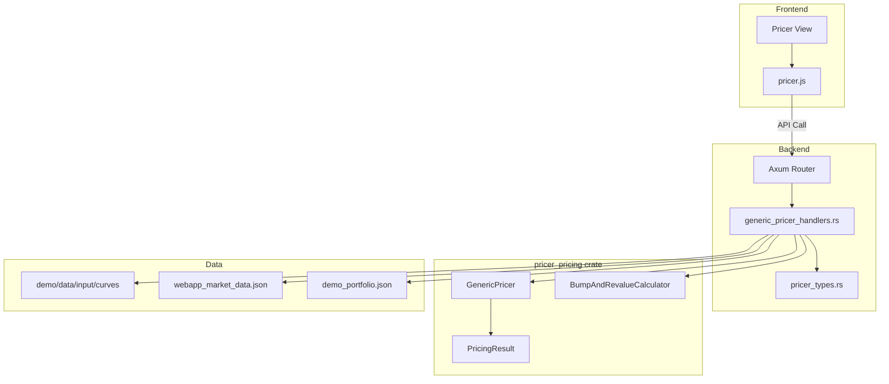
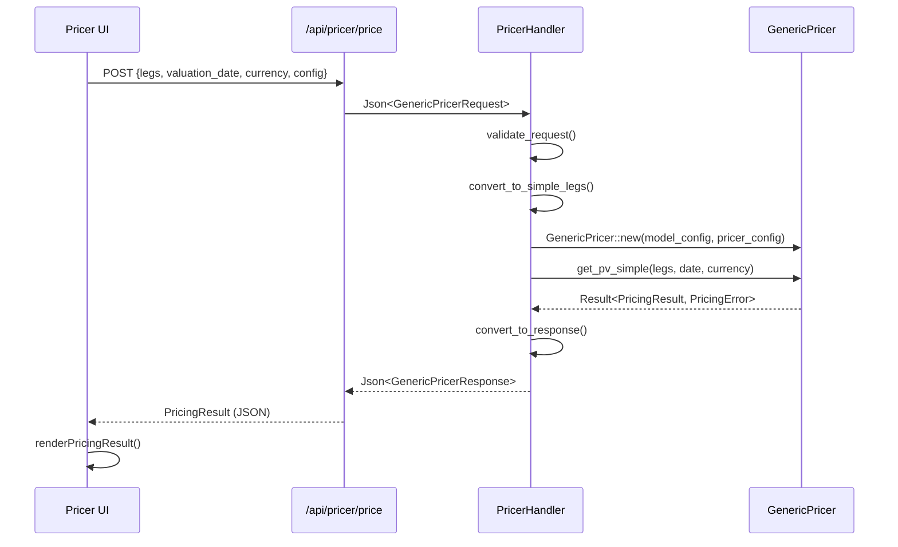
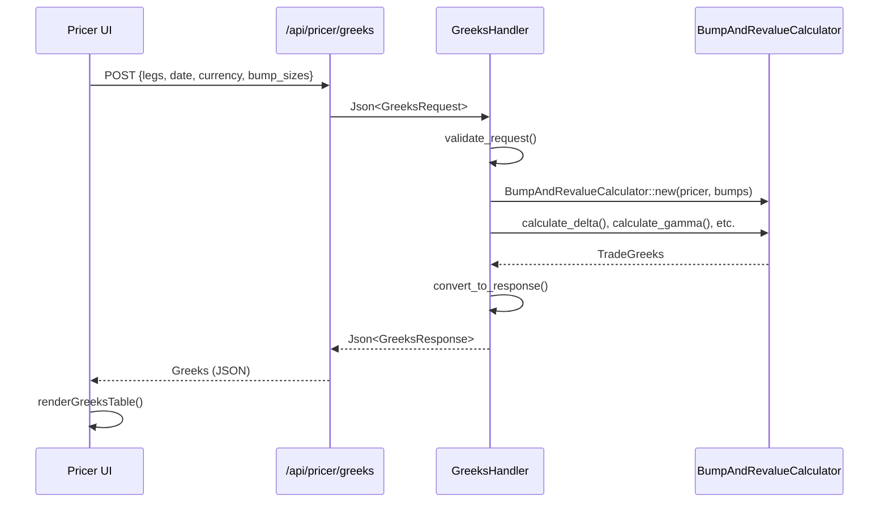
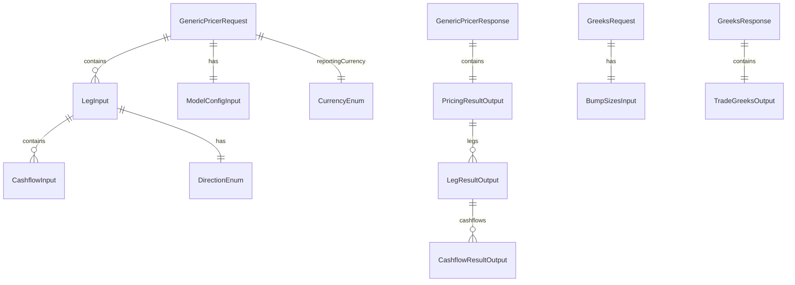

# Design Document: demo-webapp-pricer

## Overview

**Purpose**: Demo WebAppのAnalysisセクションにPricer検証機能を提供し、クオンツ開発者が`GenericPricer::get_pv()`およびGreeks計算の動作を検証できるUIを実装する。

**Users**: クオンツ開発者、リスク管理者がカーブ構築・モデルキャリブレーション後のプライシング検証ワークフローで使用する。

**Impact**: Model Calib画面の下に新規「Pricer」画面を追加し、既存のTrade展開機能とgeneric_pricerモジュールを統合する。

### Goals
- GenericPricer統合によるPV計算と結果表示
- BumpAndRevalueCalculatorによるGreeks計算
- 階層的PricingResult表示（Trade→Leg→Cashflow）
- 結果履歴と比較機能

### Non-Goals
- バッチプライシング（本スコープ外）
- AAD（Enzyme AD）モードのGreeks計算（Bump-and-Revalueのみ）
- マーケットデータのリアルタイム更新
- l1l2-integration feature有効時の実装

## Architecture

### Existing Architecture Analysis

**現行パターン**:
- Axum + State<Arc<AppState>> によるハンドラ構成
- 型定義は `*_types.rs`、ハンドラは `*_handlers.rs` に分離
- フロントエンドは `data-view` 属性によるSPA的ビュー切り替え
- 2パネルレイアウト（入力 + 結果）の一貫したUI

**統合ポイント**:
- `pricer_pricing::generic_pricer` クレートは既に `demo_gui` の依存関係に含まれる
- 既存 `/api/trade/expand` と `/api/curves/*` を活用可能

### Architecture Pattern & Boundary Map



**Architecture Integration**:
- Selected pattern: Hybrid（新規ハンドラ + 既存型拡張）
- Domain boundaries: APIハンドラ層とgeneric_pricerコア層の分離
- Existing patterns preserved: Axum State、JSON Request/Response、Error型
- New components rationale: ハンドラファイル分離で単一責任原則遵守
- Steering compliance: A-I-P-S アーキテクチャ、静的ディスパッチ

### Technology Stack

| Layer | Choice / Version | Role in Feature | Notes |
|-------|------------------|-----------------|-------|
| Frontend | HTML5, Vanilla JS | Pricer UI, 2パネルレイアウト | 既存パターン踏襲 |
| Backend | Axum (workspace) | REST API | 既存フレームワーク |
| Pricer Engine | pricer_pricing (workspace) | GenericPricer, BumpAndRevalueCalculator | 88テスト通過済み |
| Data | JSON files | demo/data/input/ からの読込 | 既存データ形式 |
| Serialization | serde_json (workspace) | Request/Response処理 | 既存依存 |

## System Flows

### Pricing Flow



**Key Decisions**:
- 型変換はバックエンドで実施（Rust型安全性活用）
- GenericPricerはリクエストごとに新規インスタンス生成（ステートレス）
- エラーはPricingErrorをそのままJSON化して返却

### Greeks Calculation Flow



## Requirements Traceability

| Requirement | Summary | Components | Interfaces | Flows |
|-------------|---------|------------|------------|-------|
| 1.1-1.5 | UIナビゲーション | PricerView, pricer.js | - | - |
| 2.1-2.6 | Trade選択 | TradeSelector | GET /api/instruments | - |
| 3.1-3.6 | CF展開・編集 | CashflowEditor | POST /api/trade/expand | - |
| 4.1-4.6 | マーケットデータ | MarketDataPanel | GET /api/curves/* | - |
| 5.1-5.6 | モデル設定 | ModelConfigPanel | - | - |
| 6.1-6.6 | プライシング実行 | PricerHandler | POST /api/pricer/price | PricingFlow |
| 7.1-7.6 | PricingResult表示 | ResultPanel | - | - |
| 8.1-8.7 | Greeks計算 | GreeksHandler | POST /api/pricer/greeks | GreeksFlow |
| 9.1-9.5 | 結果比較 | ComparePanel | - | - |
| 10.1-10.7 | APIエンドポイント | generic_pricer_handlers.rs | POST /api/pricer/* | - |

## Components and Interfaces

### Component Summary

| Component | Domain/Layer | Intent | Req Coverage | Key Dependencies | Contracts |
|-----------|--------------|--------|--------------|------------------|-----------|
| generic_pricer_handlers.rs | Backend | API ハンドラ | 6, 8, 10 | GenericPricer (P0) | API |
| pricer_types.rs (拡張) | Backend | 型定義 | 6, 8, 10 | serde (P0) | - |
| pricer.js | Frontend | UI モジュール | 1-5, 7, 9 | apiClient (P0) | - |
| index.html (拡張) | Frontend | Pricer View | 1 | - | - |

---

### Backend Layer

#### generic_pricer_handlers.rs

| Field | Detail |
|-------|--------|
| Intent | GenericPricerおよびGreeks計算のREST APIハンドラ |
| Requirements | 6.1-6.6, 8.1-8.7, 10.1-10.7 |

**Responsibilities & Constraints**
- `/api/pricer/price` と `/api/pricer/greeks` エンドポイントの提供
- リクエスト検証とレスポンス変換
- GenericPricerインスタンス管理とエラーハンドリング

**Dependencies**
- Inbound: Axum Router — ルーティング (P0)
- Outbound: pricer_pricing::generic_pricer — プライシングエンジン (P0)
- External: なし

**Contracts**: API [x]

##### API Contract

| Method | Endpoint | Request | Response | Errors |
|--------|----------|---------|----------|--------|
| POST | /api/pricer/price | GenericPricerRequest | GenericPricerResponse | 400, 422, 500 |
| POST | /api/pricer/greeks | GreeksRequest | GreeksResponse | 400, 422, 500 |
| GET | /api/pricer/instruments | - | InstrumentTypesResponse | 500 |

**Implementation Notes**
- Integration: mod.rs に `pub mod generic_pricer_handlers;` 追加、build_router() にルート追加
- Validation: `validate_generic_pricer_request()` でパラメータ検証
- Risks: FXレート未対応通貨（CHF）でエラー発生

---

#### pricer_types.rs (拡張)

| Field | Detail |
|-------|--------|
| Intent | GenericPricer関連のRequest/Response型定義 |
| Requirements | 6.2, 8.4, 10.6 |

**Responsibilities & Constraints**
- JSON Serialize/Deserialize対応の型定義
- camelCase フィールド名（JavaScript互換）
- 既存型との一貫性維持

**Dependencies**
- External: serde, serde_json — シリアライゼーション (P0)

**Implementation Notes**
- Integration: 既存 pricer_types.rs に型追加
- Validation: 各型にバリデーション関数追加

---

### Frontend Layer

#### pricer.js

| Field | Detail |
|-------|--------|
| Intent | Pricer UI モジュール（Trade選択、CF編集、結果表示） |
| Requirements | 1.2, 2.1-2.6, 3.1-3.6, 5.1-5.6, 7.1-7.6, 9.1-9.5 |

**Responsibilities & Constraints**
- Pricer画面の状態管理
- API呼び出しと結果レンダリング
- 結果履歴管理（最大5件）

**Dependencies**
- Inbound: app.js — ナビゲーション統合 (P0)
- Outbound: apiClient — API呼び出し (P0)
- External: なし

**Implementation Notes**
- Integration: index.html で `<script src="js/pricer.js">` 読込
- Validation: フォーム入力の即時バリデーション

---

#### index.html (拡張)

| Field | Detail |
|-------|--------|
| Intent | Pricer View セクション追加 |
| Requirements | 1.1-1.5 |

**Implementation Notes**
- Integration: Analysisアコーディオン内、Model Calib後に追加
- 2パネルレイアウト（左：入力パネル、右：結果パネル）

---

## Data Models

### Domain Model



### Data Contracts & Integration

**API Request/Response Schemas**

```typescript
// GenericPricerRequest
interface GenericPricerRequest {
  legs: LegInput[];
  valuationDate: string; // "YYYY-MM-DD" or days since epoch
  reportingCurrency: "USD" | "EUR" | "JPY" | "GBP";
  modelConfig?: ModelConfigInput;
}

interface LegInput {
  currency: "USD" | "EUR" | "JPY" | "GBP";
  direction: "payer" | "receiver";
  cashflows: CashflowInput[];
}

interface CashflowInput {
  paymentDate: string; // "YYYY-MM-DD" or days since epoch
  amount: number;
}

interface ModelConfigInput {
  numPaths?: number;  // default: 10000
  numSteps?: number;  // default: 100
  seed?: number;      // optional
}

// GenericPricerResponse
interface GenericPricerResponse {
  success: boolean;
  totalPv: number;
  reportingCurrency: string;
  legs: LegResultOutput[];
  error?: string;
}

interface LegResultOutput {
  pv: number;
  pvOriginal: number;
  originalCurrency: string;
  fxRate: number;
  direction: string;
  cashflows: CashflowResultOutput[];
}

interface CashflowResultOutput {
  pv: number;
  pvOriginal: number;
  paymentDate: string;
  discountFactor: number;
}

// GreeksRequest
interface GreeksRequest {
  legs: LegInput[];
  valuationDate: string;
  reportingCurrency: string;
  bumpSizes?: BumpSizesInput;
}

interface BumpSizesInput {
  rateBumpBp?: number;  // default: 1.0
  fxBumpPct?: number;   // default: 1.0
  volBumpPct?: number;  // default: 1.0
}

// GreeksResponse
interface GreeksResponse {
  success: boolean;
  delta: number;
  gamma: number;
  theta: number;
  vega: number;
  fxDelta: number;
  error?: string;
}
```

## Error Handling

### Error Strategy
- **Validation Errors (400)**: リクエストパラメータ不正（必須フィールド欠落、範囲外値）
- **Business Errors (422)**: プライシング失敗（FXレート未対応、未対応商品）
- **System Errors (500)**: 予期しない内部エラー

### Error Categories and Responses

**User Errors (4xx)**:
- 必須パラメータ欠落 → フィールド名とエラーメッセージ
- numPaths <= 0 → "numPaths must be positive"
- 未対応通貨 → "Currency CHF is not supported"

**Business Logic Errors (422)**:
- PricingError::FxRateNotFound → "FX rate not found for {base}/{quote}"
- PricingError::UnsupportedInstrument → "Instrument type not supported"

**System Errors (5xx)**:
- 予期しないパニック → "Internal server error"

### Monitoring
- 全APIリクエストのレスポンスタイム記録（既存PerformanceMetrics活用）
- エラー発生時のログ出力（tracing）

## Testing Strategy

### Unit Tests
- `validate_generic_pricer_request()` のバリデーションロジック
- `convert_to_simple_legs()` の型変換
- BumpSizes デフォルト値
- Response型のシリアライゼーション

### Integration Tests
- `/api/pricer/price` エンドポイント E2E
- `/api/pricer/greeks` エンドポイント E2E
- エラーレスポンス検証（400, 422）

### E2E/UI Tests
- Pricer画面ナビゲーション
- Trade入力→プライシング→結果表示フロー
- Greeks計算フロー
- 結果比較機能

## Supporting References

詳細な調査結果と設計決定の背景は [research.md](.kiro/specs/demo-webapp-pricer/research.md) を参照。
