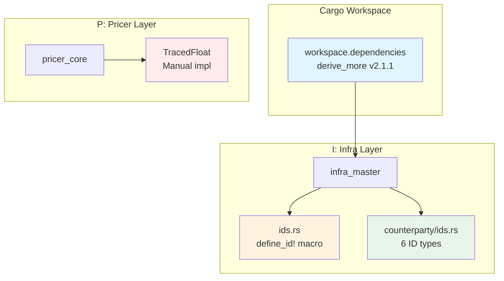

# Technical Design: derive-more-newtype-migration

## Overview

**Purpose**: 本設計は `derive_more` クレートを導入し、New Type パターンにおけるトレイト実装のボイラープレートコードを削減する。金融計算における型安全性を維持しながら、コードの一貫性と保守性を向上させる。

**Users**: Neutryx 開発者が New Type を作成・保守する際に、宣言的なトレイト導出を利用できるようになる。

**Impact**: 既存の手動トレイト実装（Display, From, 算術演算子）を derive マクロに段階的に置き換える。公開 API の変更はなく、後方互換性を維持。

### Goals

- derive_more v2.1.1 をワークスペース依存関係として追加
- ID 型 10 種に Display, From derive を適用（ボイラープレート削減）
- 数値型 NewType に算術演算 derive を適用
- Enzyme AD との互換性を維持
- steering ドキュメントに使用ガイドラインを追加

### Non-Goals

- カスタムロジックを持つ型（TracedFloat, Delta, LegalEntityId, Date）の移行
- derive_more の全機能導入（必要最小限の features のみ）
- 既存の公開 API の変更

---

## Architecture

### Existing Architecture Analysis

**現行パターン**:
1. `define_id!` マクロによる ID 型生成（`infra_master/src/ids.rs`）
2. 手動トレイト実装（`counterparty/ids.rs` の 7 ID 型）
3. カスタムロジックを含む算術演算実装（`TracedFloat`）

**制約**:
- A-I-P-S 依存方向を維持（derive_more は Infra 層で使用）
- Enzyme AD との静的ディスパッチ互換性

### Architecture Pattern & Boundary Map



**Architecture Integration**:
- **Selected pattern**: 既存拡張（Hybrid approach）
- **Domain boundaries**: derive_more は Infra 層（infra_master）で主に使用、Pricer 層は検証後に導入
- **Existing patterns preserved**: `define_id!` マクロは簡略化して維持（`new()`, `as_str()` メソッド生成）
- **New components rationale**: 新規コンポーネントなし、既存型への derive 追加のみ
- **Steering compliance**: A-I-P-S 依存方向維持、British English 命名規則遵守

### Technology Stack

| Layer | Choice / Version | Role in Feature | Notes |
|-------|------------------|-----------------|-------|
| Build | derive_more v2.1.1 | proc-macro トレイト導出 | features: `from`, `display`, `as_ref`, `add`, `mul` |
| Infra | infra_master | ID 型定義 | 主要移行対象 |
| Testing | proptest 1.6 | Property-based testing | 既存ワークスペース依存 |

---

## System Flows

本機能はコンパイル時の proc-macro 展開であり、ランタイムフローは既存と同一のため省略。

---

## Requirements Traceability

| Requirement | Summary | Components | Interfaces | Phase |
|-------------|---------|------------|------------|-------|
| 1.1-1.3 | 依存関係追加 | Cargo.toml | workspace.dependencies | 1 |
| 2.1-2.5 | 算術トレイト導出 | BasisSpread | Add, Sub, Mul, Div | 3 |
| 3.1-3.4 | 変換トレイト導出 | ID 型 10 種 | From, Into | 1, 2 |
| 4.1-4.3 | 表示トレイト導出 | ID 型 10 種 | Display | 1, 2 |
| 5.1-5.4 | 既存移行 | counterparty/ids.rs, ids.rs | - | 1, 2 |
| 6.1-6.3 | AD 互換性 | - | - | 1（検証） |
| 7.1-7.3 | テスト | tests/newtype_derive.rs | proptest | 3 |
| 8.1-8.3 | ドキュメント | steering/ai_rules.md | - | 3 |

---

## Components and Interfaces

### Component Summary

| Component | Domain/Layer | Intent | Req Coverage | Key Dependencies | Contracts |
|-----------|--------------|--------|--------------|------------------|-----------|
| Cargo.toml | Workspace | derive_more 依存追加 | 1.1-1.3 | - | - |
| counterparty/ids.rs | Infra | 6 ID 型の derive 移行 | 3.1-3.4, 4.1-4.3, 5.1-5.4 | derive_more (P0) | - |
| ids.rs | Infra | define_id! マクロ簡略化 | 3.1-3.4, 4.1-4.3 | derive_more (P0) | - |
| BasisSpread | Infra | 数値型 derive 移行 | 2.1-2.5 | derive_more (P0) | - |
| steering/ai_rules.md | Docs | NewType ガイドライン | 8.1-8.3 | - | - |

---

### I: Infra Layer

#### Cargo.toml (Workspace)

| Field | Detail |
|-------|--------|
| Intent | derive_more をワークスペース依存として追加 |
| Requirements | 1.1, 1.2, 1.3 |

**Responsibilities & Constraints**
- `[workspace.dependencies]` に derive_more を追加
- features を最小限に指定（コンパイル時間最適化）
- 全クレートで統一バージョンを使用

**Configuration**

```toml
[workspace.dependencies]
# 既存依存...
derive_more = { version = "2", features = ["from", "display", "as_ref", "add", "mul"] }
```

**Implementation Notes**
- features は段階的に追加可能（Phase 1: `from`, `display`, `as_ref` のみでも可）

---

#### counterparty/ids.rs

| Field | Detail |
|-------|--------|
| Intent | 6 ID 型の手動トレイト実装を derive に移行 |
| Requirements | 3.1-3.4, 4.1-4.3, 5.1-5.4 |

**Responsibilities & Constraints**
- CounterPartyId, NettingSetId, CcpId, IsdaAgreementId, VariationMarginAgreementId, CrossBookNettingAgreementId の移行
- LegalEntityId は除外（バリデーションロジック維持）
- 既存の `new()`, `as_str()` メソッドは維持

**Dependencies**
- Inbound: なし
- Outbound: なし
- External: derive_more (P0)

**Before/After Pattern**

```rust
// === Before ===
#[derive(Clone, Debug, Default, PartialEq, Eq, Hash)]
#[cfg_attr(feature = "serde", derive(serde::Serialize, serde::Deserialize))]
#[cfg_attr(feature = "serde", serde(transparent))]
pub struct CounterPartyId(String);

impl CounterPartyId {
    pub fn new(id: impl Into<String>) -> Self { Self(id.into()) }
    pub fn as_str(&self) -> &str { &self.0 }
}

impl fmt::Display for CounterPartyId {
    fn fmt(&self, f: &mut fmt::Formatter<'_>) -> fmt::Result { write!(f, "{}", self.0) }
}

impl From<String> for CounterPartyId {
    fn from(s: String) -> Self { Self(s) }
}

impl From<&str> for CounterPartyId {
    fn from(s: &str) -> Self { Self(s.to_string()) }
}

// === After ===
use derive_more::{Display, From};

#[derive(Clone, Debug, Default, PartialEq, Eq, Hash, Display, From)]
#[cfg_attr(feature = "serde", derive(serde::Serialize, serde::Deserialize))]
#[cfg_attr(feature = "serde", serde(transparent))]
pub struct CounterPartyId(String);

impl CounterPartyId {
    pub fn new(id: impl Into<String>) -> Self { Self(id.into()) }
    pub fn as_str(&self) -> &str { &self.0 }
}
```

**削減行数**: 約 15 行/型 × 6 型 = 約 90 行削減

---

#### ids.rs (define_id! マクロ)

| Field | Detail |
|-------|--------|
| Intent | マクロを簡略化し、トレイト導出は derive_more に委譲 |
| Requirements | 3.1-3.4, 4.1-4.3 |

**Responsibilities & Constraints**
- TradeId, PortfolioId, BookId の定義
- `new()`, `as_str()`, `AsRef<str>` はマクロで維持
- Display, From は derive_more に移行

**Simplified Macro Pattern**

```rust
use derive_more::{Display, From};

macro_rules! define_id {
    ($(#[$meta:meta])* $name:ident) => {
        $(#[$meta])*
        #[derive(Clone, Debug, Default, PartialEq, Eq, Hash, Display, From)]
        #[cfg_attr(feature = "serde", derive(serde::Serialize, serde::Deserialize))]
        #[cfg_attr(feature = "serde", serde(transparent))]
        pub struct $name(String);

        impl $name {
            #[inline]
            pub fn new(id: impl Into<String>) -> Self { Self(id.into()) }
            #[inline]
            pub fn as_str(&self) -> &str { &self.0 }
        }

        impl AsRef<str> for $name {
            fn as_ref(&self) -> &str { &self.0 }
        }
    };
}
```

**削減効果**: マクロ本体から約 20 行削減

---

#### BasisSpread (数値型)

| Field | Detail |
|-------|--------|
| Intent | 数値型 NewType に算術演算 derive を適用 |
| Requirements | 2.1-2.5 |

**Responsibilities & Constraints**
- `infra_master/trade/instrument_def/xccy.rs` に定義
- Add, Sub, Mul, Div, Display, From を derive

**Pattern**

```rust
use derive_more::{Add, Sub, Mul, Div, Display, From};

#[derive(Debug, Clone, Copy, PartialEq, Add, Sub, Mul, Div, Display, From)]
#[cfg_attr(feature = "serde", derive(serde::Serialize, serde::Deserialize))]
pub struct BasisSpread(f64);

impl BasisSpread {
    pub fn new(value: f64) -> Self { Self(value) }
    pub fn value(&self) -> f64 { self.0 }
}
```

---

### Documentation

#### steering/ai_rules.md 更新

| Field | Detail |
|-------|--------|
| Intent | NewType 作成時の derive_more 使用ガイドライン追加 |
| Requirements | 8.1-8.3 |

**追加セクション**

```markdown
## 5. NewType パターンガイドライン

### derive_more の使用

New Type を作成する際は `derive_more` を使用してボイラープレートを削減する。

**ID 型（String ラッパー）**:
```rust
use derive_more::{Display, From};

#[derive(Clone, Debug, PartialEq, Eq, Hash, Display, From)]
pub struct MyId(String);
```

**数値型（f64 ラッパー）**:
```rust
use derive_more::{Add, Sub, Mul, Div, Display, From};

#[derive(Clone, Copy, PartialEq, Add, Sub, Mul, Div, Display, From)]
pub struct MyValue(f64);
```

### derive_more を使用しない場合

以下の場合は手動実装を維持する:
1. **バリデーションロジック**: コンストラクタで値を検証する型（例: `Delta`, `LegalEntityId`）
2. **カスタム演算**: 演算時に副作用を持つ型（例: `TracedFloat`）
3. **カスタム表示形式**: 特殊なフォーマットが必要な型
```

---

## Data Models

本機能はデータモデル変更なし。既存の NewType 構造体の derive 属性のみ変更。

---

## Error Handling

### Error Strategy

derive_more の導出は全てコンパイル時に処理されるため、ランタイムエラーは発生しない。

**コンパイルエラー**: derive_more が対応していない型構造に適用した場合、コンパイルエラーが発生。明確なエラーメッセージが表示される。

---

## Testing Strategy

### Unit Tests

各移行型に対してトレイト実装の動作確認テストを追加:

```rust
#[cfg(test)]
mod tests {
    use super::*;

    #[test]
    fn test_counter_party_id_display() {
        let id = CounterPartyId::new("CP001");
        assert_eq!(format!("{}", id), "CP001");
    }

    #[test]
    fn test_counter_party_id_from() {
        let id: CounterPartyId = "CP001".into();
        assert_eq!(id.as_str(), "CP001");

        let id: CounterPartyId = String::from("CP002").into();
        assert_eq!(id.as_str(), "CP002");
    }
}
```

### Property-Based Tests (proptest)

算術演算の数学的性質を検証:

```rust
use proptest::prelude::*;

proptest! {
    #[test]
    fn test_basis_spread_add_commutativity(a: f64, b: f64) {
        let bs_a = BasisSpread::new(a);
        let bs_b = BasisSpread::new(b);
        prop_assert_eq!(bs_a + bs_b, bs_b + bs_a);
    }

    #[test]
    fn test_basis_spread_add_associativity(a: f64, b: f64, c: f64) {
        let bs_a = BasisSpread::new(a);
        let bs_b = BasisSpread::new(b);
        let bs_c = BasisSpread::new(c);
        // Note: f64 の精度制限により approx_eq を使用
        let lhs = (bs_a + bs_b) + bs_c;
        let rhs = bs_a + (bs_b + bs_c);
        prop_assert!((lhs.value() - rhs.value()).abs() < 1e-10);
    }
}
```

### Integration Tests

Enzyme AD との互換性検証（Phase 1 完了後）:

```bash
cargo build -p infra_master --features serde
cargo build -p pricer_risk --features enzyme-ad
cargo test -p infra_master
```

---

## Migration Strategy

### Phase Overview


### Phase 1: 依存追加 + counterparty ID 型（Low Risk）

**対象**:
- `Cargo.toml`: workspace.dependencies 追加
- `crates/infra_master/Cargo.toml`: derive_more 依存追加
- `crates/infra_master/src/counterparty/ids.rs`: 6 ID 型移行

**検証**:
- `cargo build -p infra_master`
- `cargo test -p infra_master`
- `cargo build -p pricer_risk --features enzyme-ad`（AD 互換性）

**ロールバック**: Cargo.toml の変更を revert

### Phase 2: define_id! マクロ簡略化（Medium Risk）

**対象**:
- `crates/infra_master/src/ids.rs`: マクロ簡略化
- TradeId, PortfolioId, BookId, RateId 移行

**検証**:
- `cargo build --workspace`
- `cargo test --workspace`

**ロールバック**: 旧マクロ定義を復元

### Phase 3: 数値型 + ドキュメント（Low Risk）

**対象**:
- `crates/infra_master/src/trade/instrument_def/xccy.rs`: BasisSpread
- `.kiro/steering/ai_rules.md`: ガイドライン追加
- テストファイル追加

**検証**:
- `cargo test --workspace`
- proptest 実行

---

## Supporting References

詳細な調査ログは [research.md](.kiro/specs/derive-more-newtype-migration/research.md) を参照。

- derive_more バージョン情報と feature 選定根拠
- Enzyme AD 互換性調査結果
- 移行対象・除外リストの詳細
