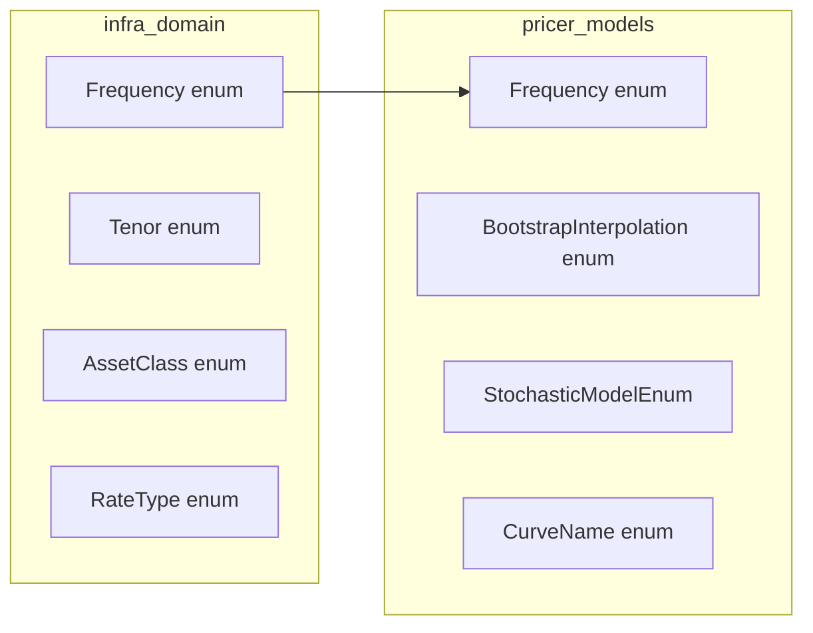

# Technical Design Document

## Overview

**Purpose**: 本機能は、Neutryx プライシングライブラリの各種 enum 型について、アルファベット順ではなく業務上自然な順序（ドメイン標準）をデフォルトとして統一する。

**Users**: クオンツ開発者、マーケットデータ担当者、リスク管理者が、enum のイテレーションや比較時に業務直感に沿った順序で操作できるようになる。

**Impact**: `Frequency` enum の variant 順序を変更し、`BootstrapInterpolation` の順序を微調整する。その他の enum はドキュメント追加のみ。

### Goals
- `Frequency` を高頻度→低頻度（Daily→Annual）の順序に変更
- `BootstrapInterpolation` を業界使用頻度順に調整
- 既存の正しい順序（Tenor, AssetClass, RateType 等）を維持
- 各 enum にドキュメントで並び順の理由を明記
- serde の name-based serialization による後方互換性維持

### Non-Goals
- 新しい enum variant の追加
- 既存の enum variant 名の変更
- `Ord` trait 以外の順序付けメカニズム導入

## Architecture

### Existing Architecture Analysis

本機能は既存の enum 定義を修正するリファクタリングであり、アーキテクチャ変更は発生しない。

**影響を受けるクレート**:
- `infra_domain`: `Frequency` enum（time/frequency.rs）
- `pricer_models`: `Frequency` enum（bootstrapping/instrument.rs）、`BootstrapInterpolation` enum

**既存パターン**:
- Rust の `#[derive(PartialOrd, Ord)]` は enum variant の宣言順を使用
- serde はデフォルトで variant 名による文字列シリアライゼーション

### Architecture Pattern & Boundary Map



**Architecture Integration**:
- Selected pattern: In-place refactoring（variant 順序変更のみ）
- Domain boundaries: 各 enum は定義元クレートの責務内
- Existing patterns preserved: `Ord` 派生、serde 統合
- Steering compliance: A-I-P-S レイヤー構造維持

### Technology Stack

| Layer | Choice / Version | Role in Feature | Notes |
|-------|------------------|-----------------|-------|
| Infra | infra_domain | Frequency, Tenor, AssetClass, RateType 定義 | 変更対象 |
| Pricer | pricer_models | BootstrapInterpolation, StochasticModelEnum, CurveName 定義 | 一部変更 |

## Requirements Traceability

| Requirement | Summary | Components | Interfaces | Flows |
|-------------|---------|------------|------------|-------|
| 1.1-1.4 | Frequency を高頻度→低頻度順に | Frequency (infra_domain, pricer_models) | Ord, periods_per_year() | - |
| 2.1-2.3 | RateType をアセットクラス別に | RateType (infra_domain) | Ord | - |
| 3.1-3.3 | StochasticModelEnum を複雑度順に | StochasticModelEnum (pricer_models) | Ord | - |
| 4.1-4.2 | BootstrapInterpolation を使用頻度順に | BootstrapInterpolation (pricer_models) | Default | - |
| 5.1-5.2 | CurveName を論理グループ順に | CurveName (pricer_models) | Ord | - |
| 6.1-6.5 | 既存正順序の維持 | Tenor, AssetClass, QuoteType, DayCounter, BDC | - | - |
| 7.1-7.3 | Serde 後方互換性 | 全対象 enum | Serialize, Deserialize | - |
| 8.1-8.2 | ドキュメント追加 | 全対象 enum | Doc comments | - |

## Components and Interfaces

| Component | Domain/Layer | Intent | Req Coverage | Key Dependencies | Contracts |
|-----------|--------------|--------|--------------|------------------|-----------|
| Frequency | infra_domain/time | 支払頻度定義 | 1.1-1.4 | - | Ord, Display |
| RateType | infra_domain/market | レートタイプ定義 | 2.1-2.3 | - | Ord |
| StochasticModelEnum | pricer_models/models | 確率モデル列挙 | 3.1-3.3 | GBM, Heston, SABR, HW, CIR | Ord |
| BootstrapInterpolation | pricer_models/market | 補間方式定義 | 4.1-4.2 | - | Default |
| CurveName | pricer_models/market | カーブ名定義 | 5.1-5.2 | - | Ord |

### infra_domain Layer

#### Frequency

| Field | Detail |
|-------|--------|
| Intent | 支払頻度を高頻度→低頻度の業務順序で定義 |
| Requirements | 1.1, 1.2, 1.3, 1.4 |

**Responsibilities & Constraints**
- 支払頻度（Daily〜Annual）を表現
- `Ord` 派生で `Daily < Weekly < ... < Annual` を保証
- `periods_per_year()` で年間支払回数を返却

**Dependencies**
- Inbound: pricer_models::instruments - 支払スケジュール生成 (P1)
- Outbound: なし

**Contracts**: Service [ ] / API [ ] / Event [ ] / Batch [ ] / State [ ]

##### Service Interface
```rust
/// Payment frequency ordered from highest (Daily) to lowest (Annual).
///
/// Ordering rationale: Financial schedules typically progress from
/// higher frequency to lower frequency when iterating payment dates.
#[derive(Debug, Clone, Copy, PartialEq, Eq, Hash, PartialOrd, Ord, Default)]
#[cfg_attr(feature = "serde", derive(Serialize, Deserialize))]
pub enum Frequency {
    /// Daily payments (252 business days per year)
    Daily,
    /// Weekly payments (52 per year)
    Weekly,
    /// Monthly payments (12 per year)
    #[default]
    Monthly,
    /// Quarterly payments (4 per year)
    Quarterly,
    /// Semi-annual payments (2 per year)
    SemiAnnual,
    /// Annual payments (1 per year)
    Annual,
}

impl Frequency {
    /// Returns the number of payment periods per year.
    ///
    /// # Values
    /// - Daily: 252 (business days convention)
    /// - Weekly: 52
    /// - Monthly: 12
    /// - Quarterly: 4
    /// - SemiAnnual: 2
    /// - Annual: 1
    pub fn periods_per_year(&self) -> u32;
}
```

**Implementation Notes**
- Integration: 既存コードは variant 名で match するため影響なし
- Validation: `Ord` 派生テストで順序検証
- Risks: `Ord` 依存コードの動作変更（意図した変更）

---

### pricer_models Layer

#### BootstrapInterpolation

| Field | Detail |
|-------|--------|
| Intent | カーブ構築の補間方式を業界使用頻度順で定義 |
| Requirements | 4.1, 4.2 |

**Responsibilities & Constraints**
- 補間方式（LogLinear〜MonotonicCubic）を表現
- `Default` で `LogLinear` を返却
- 業界使用頻度順に並べる

**Dependencies**
- Inbound: bootstrapping::CurveBootstrapper - 補間方式選択 (P0)
- Outbound: pricer_core::math::interpolators (P0)

**Contracts**: Service [ ] / API [ ] / Event [ ] / Batch [ ] / State [ ]

##### Service Interface
```rust
/// Bootstrap interpolation methods ordered by industry usage frequency.
///
/// Ordering rationale: LogLinear is the industry default for discount
/// curves. FlatForward is second most common. Spline methods are
/// typically used for presentation or specific curve requirements.
#[derive(Debug, Clone, Copy, PartialEq, Eq, Hash, Default)]
#[cfg_attr(feature = "serde", derive(Serialize, Deserialize))]
pub enum BootstrapInterpolation {
    /// Log-linear interpolation (default) - piecewise constant forward rates.
    #[default]
    LogLinear,
    /// Flat forward interpolation - constant forward between pillars.
    FlatForward,
    /// Linear interpolation on zero rates.
    LinearZeroRate,
    /// Cubic spline interpolation on zero rates.
    CubicSpline,
    /// Monotonic cubic interpolation - prevents arbitrage.
    MonotonicCubic,
}
```

**Implementation Notes**
- Integration: `match` パターンは variant 名ベースで影響なし
- Validation: `Default::default()` テストで LogLinear 確認

---

#### StochasticModelEnum

| Field | Detail |
|-------|--------|
| Intent | 確率モデルを複雑度順で定義 |
| Requirements | 3.1, 3.2, 3.3 |

**Responsibilities & Constraints**
- 確率モデル（GBM〜CIR）を複雑度順に表現
- feature-flag で rates モデルを条件付きコンパイル

**Contracts**: Service [ ] / API [ ] / Event [ ] / Batch [ ] / State [ ]

##### Service Interface
```rust
/// Stochastic models ordered by increasing complexity.
///
/// Ordering rationale: GBM is the simplest baseline (1-factor, constant vol).
/// Heston/SABR add stochastic volatility (2-factor). HullWhite/CIR are
/// specialized rate models (1-factor with mean reversion).
///
/// Complexity levels:
/// - Level 1 (Basic): GBM
/// - Level 2 (Intermediate): Heston, SABR
/// - Level 3 (Specialized): HullWhite, CIR
#[derive(Debug, Clone)]
pub enum StochasticModelEnum<T: Float> {
    /// Geometric Brownian Motion (simplest, 1-factor)
    GBM(GBMModel<T>),
    /// Heston stochastic volatility (2-factor)
    Heston(HestonModel<T>),
    /// SABR stochastic volatility (2-factor)
    SABR(SABRModel<T>),
    /// Hull-White one-factor rate model
    #[cfg(feature = "rates")]
    HullWhite(HullWhiteModel<T>),
    /// Cox-Ingersoll-Ross rate model
    #[cfg(feature = "rates")]
    CIR(CIRModel<T>),
}
```

**Implementation Notes**
- Integration: 既存順序が正しいため変更不要、ドキュメント追加のみ

---

#### RateType (Documentation Only)

| Field | Detail |
|-------|--------|
| Intent | レートタイプをアセットクラス別にグループ化 |
| Requirements | 2.1, 2.2, 2.3 |

##### Service Interface
```rust
/// Rate types grouped by asset class.
///
/// Ordering rationale: Interest rate instruments first (core curve
/// building inputs), then FX instruments (secondary), then volatility.
/// Within interest rates: money market → derivatives (increasing maturity).
///
/// Groups:
/// - Interest Rates: Deposit, Fra, Futures, Swap, Ois, BasisSwap
/// - FX: FxSpot, FxForward
/// - Volatility: Vol
#[derive(Debug, Clone, Copy, PartialEq, Eq, Hash, PartialOrd, Ord)]
pub enum RateType {
    // Interest Rate instruments (ordered by typical maturity)
    Deposit,
    Fra,
    Futures,
    Swap,
    Ois,
    BasisSwap,
    // FX instruments
    FxSpot,
    FxForward,
    // Volatility
    Vol,
}
```

**Implementation Notes**
- Integration: 既存順序が正しいため変更不要、ドキュメント追加のみ

---

#### CurveName (Documentation Only)

| Field | Detail |
|-------|--------|
| Intent | カーブ名を論理グループ順で定義 |
| Requirements | 5.1, 5.2 |

##### Service Interface
```rust
/// Curve names grouped by rate type and region.
///
/// Ordering rationale: Overnight risk-free rates first (primary
/// discounting), then interbank rates, then functional types,
/// then custom for extensibility.
///
/// Groups:
/// - Overnight RFR: Ois, Sofr, Tonar
/// - Interbank: Euribor
/// - Functional: Forward, Discount
/// - Extension: Custom
#[derive(Debug, Clone, Copy, PartialEq, Eq, Hash)]
pub enum CurveName {
    Ois,
    Sofr,
    Tonar,
    Euribor,
    Forward,
    Discount,
    Custom(&'static str),
}
```

**Implementation Notes**
- Integration: 既存順序が正しいため変更不要、ドキュメント追加のみ

## Data Models

### Domain Model

本機能はデータモデル変更なし。enum variant の順序は論理的なメタデータであり、永続化には影響しない。

### Data Contracts & Integration

**Serde Serialization**:
- すべての対象 enum は name-based serialization を使用
- variant 順序変更はシリアライゼーション形式に影響なし
- デシリアライゼーションは variant 名でマッチングするため後方互換

```rust
// 例: Frequency::Monthly は "Monthly" として serialise
// 順序変更前後で同じ JSON 表現
{"frequency": "Monthly"}
```

## Error Handling

### Error Strategy

本機能でエラーハンドリングの変更なし。

### Error Categories

N/A - リファクタリングのため新規エラーなし。

## Testing Strategy

### Unit Tests

1. **Frequency Ord テスト**
   - `assert!(Frequency::Daily < Frequency::Weekly)`
   - `assert!(Frequency::Weekly < Frequency::Monthly)`
   - 全 variant ペアの順序検証

2. **Frequency periods_per_year テスト**
   - Daily: 252, Weekly: 52, Monthly: 12, Quarterly: 4, SemiAnnual: 2, Annual: 1

3. **BootstrapInterpolation Default テスト**
   - `assert_eq!(BootstrapInterpolation::default(), BootstrapInterpolation::LogLinear)`

4. **Serde ラウンドトリップテスト**
   - 各 enum variant の serialize → deserialize 往復確認
   - 順序変更前後で同一 JSON 表現を確認

### Integration Tests

1. **Frequency ソートテスト**
   - `Vec<Frequency>` をソートして期待順序を確認

2. **既存テスト回帰確認**
   - `cargo test --workspace` で全テスト通過を確認

## Optional Sections

### Migration Strategy

**Phase 1: ドキュメント追加**
- 既存順序が正しい enum（RateType, StochasticModelEnum, CurveName）にドキュメント追加

**Phase 2: Frequency 順序変更**
- infra_domain::Frequency の variant 順序を変更
- pricer_models::bootstrapping::Frequency の順序を同期

**Phase 3: BootstrapInterpolation 調整**
- FlatForward を2番目に移動

**Phase 4: テスト追加・検証**
- 新規テスト追加
- 回帰テスト実行

**Rollback Trigger**: 予期しない Ord 依存コードの動作変更が発生した場合
