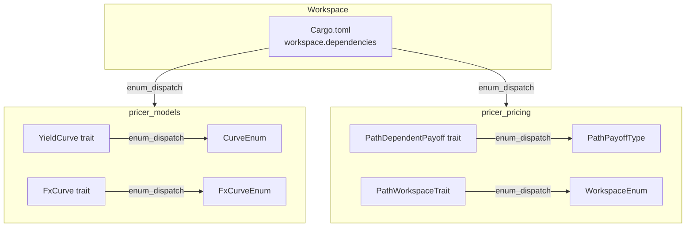
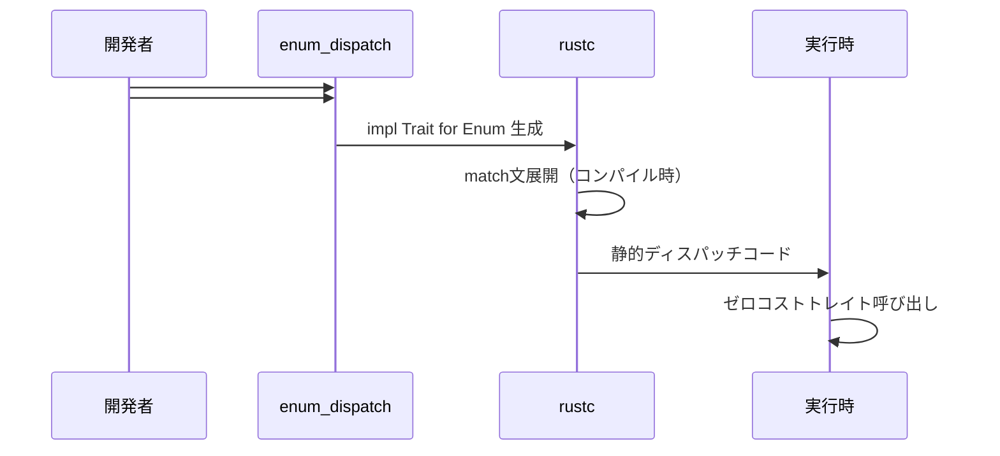

# Technical Design: enum-dispatch-migration

## Overview

**Purpose**: 本設計は、Neutryx デリバティブ価格計算ライブラリにおける `enum_dispatch` クレートの導入により、Enum-Trait 間のボイラープレートコードを排除する技術設計を定義する。

**Users**: クオンツ開発者およびライブラリメンテナが、新規バリアント追加時の手動 `match` 文実装を省略し、保守性を向上させる。

**Impact**: `pricer_models` および `pricer_pricing` クレートの4つの Enum に対し、手動トレイト実装を `enum_dispatch` マクロ生成コードに置換する。約139行のボイラープレートを削除し、Enzyme AD との互換性を維持する。

### Goals

- `enum_dispatch` クレートをワークスペースに導入し、4つの対象 Enum を移行する
- 既存の公開 API と動作を完全に維持する
- Enzyme AD との互換性を検証し、問題がある場合は該当 Enum を除外する
- コードベースの一貫性と品質基準を維持する

### Non-Goals

- `StochasticModelEnum` の移行（関連型制約のため技術的に不可能）
- 新規トレイトの設計または既存トレイトの変更
- パフォーマンス最適化（移行後の性能は同等を目標とする）
- 他の Enum の調査（将来的なスコープ）

## Architecture

### Existing Architecture Analysis

現行アーキテクチャでは、Enum に対するトレイト実装が手動 `match` 文で行われている：

```text
pricer_models/src/market.rs
├── CurveEnum<T> impl YieldCurve<T>     → 3メソッド × 2バリアント = 6 match 文
├── FxCurveEnum<T> impl FxCurve<T>      → 3メソッド × 3バリアント = 9 match 文

pricer_pricing/src/methods/
├── path_dependent/payoff_type.rs
│   └── PathPayoffType<T> (inherent)    → 3メソッド × 4バリアント = 12 match 文
└── mc/workspace_enum.rs
    └── WorkspaceEnum impl PathWorkspaceTrait → 10+メソッド × 2バリアント = 20+ match 文
```

**保持すべきパターン**:
- A-I-P-S 依存方向（Pricer 層内で完結）
- ジェネリクス `<T: Float>` による型安全性
- Enzyme AD 互換の静的ディスパッチ

### Architecture Pattern & Boundary Map



**Architecture Integration**:
- **選択パターン**: Macro-based trait forwarding（`enum_dispatch` による静的ディスパッチ）
- **ドメイン境界**: 各クレート内で独立した移行（`pricer_models` と `pricer_pricing`）
- **既存パターン保持**: ジェネリクス `<T: Float>`、Enzyme AD 互換性
- **新規コンポーネント**: なし（依存関係追加のみ）
- **Steering 準拠**: 静的ディスパッチ優先、A-I-P-S 依存方向維持

### Technology Stack

| Layer | Choice / Version | Role in Feature | Notes |
|-------|------------------|-----------------|-------|
| Backend / Services | `enum_dispatch` 0.3.x | トレイト実装マクロ生成 | 同一クレート制約あり |
| Build System | Cargo workspace inheritance | 依存関係管理 | `{ workspace = true }` パターン |
| Testing | `cargo test --workspace` | 移行検証 | 既存テストで回帰確認 |
| AD Backend | Enzyme LLVM plugin | 互換性検証 | nightly ビルドで検証 |

## System Flows

### enum_dispatch マクロ展開フロー



## Requirements Traceability

| Requirement | Summary | Components | Interfaces | Flows |
|-------------|---------|------------|------------|-------|
| 1.1-1.4 | 依存関係追加 | Cargo.toml | - | - |
| 2.1-2.3 | 対象 Enum 識別 | - | - | - |
| 3.1-3.5 | StochasticModelEnum | **除外** | - | - |
| 4.1-4.5 | CurveEnum 移行 | market.rs | YieldCurve<T> | マクロ展開 |
| 5.1-5.4 | PathPayoffType 移行 | payoff_type.rs | PathDependentPayoff<T> | マクロ展開 |
| 6.1-6.4 | Enzyme AD 検証 | 全対象 | - | 検証テスト |
| 7.1-7.5 | コード品質 | 全ファイル | - | CI/CD |
| 8.1-8.4 | 後方互換性 | 公開 API | - | - |

**Requirement 3（StochasticModelEnum）の除外**:
Gap Analysis により、`StochasticModel` トレイトが関連型（`State`, `Params`）を持つことが判明。`enum_dispatch` は関連型をサポートしないため、要件3は技術的に実現不可能。現行の inherent methods 実装を維持する。

## Components and Interfaces

### Summary Table

| Component | Domain/Layer | Intent | Req Coverage | Key Dependencies | Contracts |
|-----------|--------------|--------|--------------|------------------|-----------|
| Workspace Cargo.toml | Build | enum_dispatch 依存追加 | 1.1-1.4 | - | - |
| YieldCurve trait | pricer_models/market | カーブトレイトにマクロ適用 | 4.1-4.2 | pricer_core::Float (P0) | Service |
| CurveEnum | pricer_models/market | enum_dispatch 属性付与 | 4.2-4.5 | YieldCurve (P0) | - |
| FxCurve trait | pricer_models/market | FXカーブトレイトにマクロ適用 | 4.1-4.2 | YieldCurve (P0) | Service |
| FxCurveEnum | pricer_models/market | enum_dispatch 属性付与 | 4.2-4.5 | FxCurve (P0) | - |
| PathDependentPayoff trait | pricer_pricing/path_dependent | ペイオフトレイトにマクロ適用 | 5.1 | pricer_core::Float (P0) | Service |
| PathPayoffType | pricer_pricing/path_dependent | enum_dispatch 属性付与 | 5.2-5.4 | PathDependentPayoff (P0) | - |
| PathWorkspaceTrait | pricer_pricing/mc | ワークスペーストレイトにマクロ適用 | - | - | Service |
| WorkspaceEnum | pricer_pricing/mc | enum_dispatch 属性付与 | - | PathWorkspaceTrait (P0) | - |

---

### pricer_models Layer

#### YieldCurve<T> Trait（移行対象）

| Field | Detail |
|-------|--------|
| Intent | イールドカーブの抽象インターフェース定義、enum_dispatch 属性付与 |
| Requirements | 4.1 |

**Before Migration**:
```rust
pub trait YieldCurve<T: Float> {
    fn discount_factor(&self, t: T) -> Result<T, MarketDataError>;
    fn zero_rate(&self, t: T) -> Result<T, MarketDataError>;
    fn forward_rate(&self, t1: T, t2: T) -> Result<T, MarketDataError>;
}
```

**After Migration**:
```rust
#[enum_dispatch]
pub trait YieldCurve<T: Float> {
    fn discount_factor(&self, t: T) -> Result<T, MarketDataError>;
    fn zero_rate(&self, t: T) -> Result<T, MarketDataError>;
    fn forward_rate(&self, t1: T, t2: T) -> Result<T, MarketDataError>;
}
```

**Implementation Notes**:
- `use enum_dispatch::enum_dispatch;` インポートを追加
- トレイト定義にデフォルト実装があるメソッド（`zero_rate`, `forward_rate`）は、各バリアント型でオーバーライド可能
- ジェネリクス `<T: Float>` は `enum_dispatch` でサポート

---

#### CurveEnum<T>（移行対象）

| Field | Detail |
|-------|--------|
| Intent | YieldCurve トレイトの静的ディスパッチ Enum |
| Requirements | 4.2, 4.3, 4.4, 4.5 |

**Before Migration**:
```rust
pub enum CurveEnum<T: Float> {
    Flat(curves::FlatCurve<T>),
    Bootstrapped(curves::BootstrappedCurve<T>),
}

impl<T: Float> curves::YieldCurve<T> for CurveEnum<T> {
    fn discount_factor(&self, t: T) -> Result<T, MarketDataError> {
        match self {
            Self::Flat(c) => c.discount_factor(t),
            Self::Bootstrapped(c) => c.discount_factor(t),
        }
    }
    // ... zero_rate, forward_rate 同様
}
```

**After Migration**:
```rust
#[enum_dispatch(YieldCurve<T>)]
pub enum CurveEnum<T: Float> {
    Flat(curves::FlatCurve<T>),
    Bootstrapped(curves::BootstrappedCurve<T>),
}

// impl YieldCurve for CurveEnum は自動生成（削除）
```

**Dependencies**:
- Inbound: pricer_pricing, pricer_risk — カーブ参照 (P0)
- Outbound: curves::FlatCurve, curves::BootstrappedCurve — バリアント型 (P0)

**Implementation Notes**:
- 手動 `impl<T: Float> curves::YieldCurve<T> for CurveEnum<T>` ブロック全体を削除
- `FlatCurve<T>` と `BootstrappedCurve<T>` は既に `YieldCurve<T>` を実装している必要がある
- 既存テスト（bootstrapping tests）で回帰確認

---

#### FxCurve<T> Trait（移行対象）

| Field | Detail |
|-------|--------|
| Intent | FXカーブの抽象インターフェース定義 |
| Requirements | 4.1（FxCurve版） |

**After Migration**:
```rust
#[enum_dispatch]
pub trait FxCurve<T: Float> {
    fn forward(&self, t: T) -> Result<T, MarketDataError>;
    fn spot(&self) -> T;
    fn currency_pair(&self) -> CurrencyPair;
}
```

---

#### FxCurveEnum<T>（移行対象）

| Field | Detail |
|-------|--------|
| Intent | FxCurve トレイトの静的ディスパッチ Enum |
| Requirements | 4.2-4.5（FxCurve版） |

**After Migration**:
```rust
#[enum_dispatch(FxCurve<T>)]
pub enum FxCurveEnum<T: Float> {
    Flat(fx_curves::FlatFxCurve<T>),
    IrpFlat(fx_curves::IrpFxCurve<T, curves::FlatCurve<T>, curves::FlatCurve<T>>),
    IrpGeneric(fx_curves::IrpFxCurve<T, CurveEnum<T>, CurveEnum<T>>),
}
```

---

### pricer_pricing Layer

#### PathDependentPayoff<T> Trait（移行対象）

| Field | Detail |
|-------|--------|
| Intent | パス依存ペイオフの抽象インターフェース定義 |
| Requirements | 5.1 |

**After Migration**:
```rust
#[enum_dispatch]
pub trait PathDependentPayoff<T: Float>: Send + Sync {
    fn compute(&self, path: &[T], observer: &PathObserver<T>) -> T;
    fn required_observations(&self) -> ObservationType;
    fn smoothing_epsilon(&self) -> T;
}
```

---

#### PathPayoffType<T>（移行対象）

| Field | Detail |
|-------|--------|
| Intent | PathDependentPayoff トレイトの静的ディスパッチ Enum |
| Requirements | 5.2, 5.3, 5.4 |

**Before Migration**:
```rust
impl<T: Float + Send + Sync> PathPayoffType<T> {
    pub fn compute(&self, path: &[T], observer: &PathObserver<T>) -> T {
        match self {
            PathPayoffType::AsianArithmetic(payoff) => payoff.compute(path, observer),
            PathPayoffType::AsianGeometric(payoff) => payoff.compute(path, observer),
            PathPayoffType::Barrier(payoff) => payoff.compute(path, observer),
            PathPayoffType::Lookback(payoff) => payoff.compute(path, observer),
        }
    }
    // ... required_observations, smoothing_epsilon 同様
}
```

**After Migration**:
```rust
#[enum_dispatch(PathDependentPayoff<T>)]
pub enum PathPayoffType<T: Float> {
    AsianArithmetic(AsianArithmeticPayoff<T>),
    AsianGeometric(AsianGeometricPayoff<T>),
    Barrier(BarrierPayoff<T>),
    Lookback(LookbackPayoff<T>),
}

// inherent methods を trait methods に変換
// is_asian(), is_barrier(), is_lookback() は inherent のまま維持
```

**Dependencies**:
- Inbound: MonteCarloPricer — ペイオフ計算 (P0)
- Outbound: AsianArithmeticPayoff, BarrierPayoff, etc. — バリアント型 (P0)

**Implementation Notes**:
- 既存の `compute()`, `required_observations()`, `smoothing_epsilon()` inherent methods を `PathDependentPayoff` トレイトメソッドに移行
- `is_asian()`, `is_barrier()`, `is_lookback()` はトレイトメソッドではなく、inherent methods として維持
- Enzyme AD 検証：Monte Carlo シミュレーション内での微分可能性を確認

---

#### PathWorkspaceTrait（移行対象）

| Field | Detail |
|-------|--------|
| Intent | ワークスペースの抽象インターフェース定義 |
| Requirements | 補助 |

**After Migration**:
```rust
#[enum_dispatch]
pub trait PathWorkspaceTrait: Send + Sync {
    fn num_paths(&self) -> usize;
    fn num_steps(&self) -> usize;
    fn layout(&self) -> PathLayout;
    fn get_path_value(&self, path_idx: usize, step_idx: usize) -> f64;
    fn set_path_value(&mut self, path_idx: usize, step_idx: usize, value: f64);
    fn get_step_slice(&self, step_idx: usize) -> Option<&[f64]>;
    fn get_step_slice_mut(&mut self, step_idx: usize) -> Option<&mut [f64]>;
    fn get_path_slice(&self, path_idx: usize) -> Option<&[f64]>;
    fn get_path_slice_mut(&mut self, path_idx: usize) -> Option<&mut [f64]>;
}
```

---

#### WorkspaceEnum（移行対象）

| Field | Detail |
|-------|--------|
| Intent | PathWorkspaceTrait の静的ディスパッチ Enum |
| Requirements | 補助 |

**After Migration**:
```rust
#[enum_dispatch(PathWorkspaceTrait)]
pub enum WorkspaceEnum {
    PathFirst(PathWorkspace),
    TimeStepFirst(TimeStepFirstWorkspace),
}

// 70+行の手動 impl 削除
```

**Implementation Notes**:
- ジェネリクスなし（`f64` 固定）のため、最もシンプルな移行
- `ensure_capacity`, `reset`, `reset_fast` は inherent methods として維持

## Data Models

本フィーチャーではデータモデルの変更は発生しない。既存の型定義はすべて維持される。

## Error Handling

### Error Strategy

移行後のエラー処理は既存と同一。`enum_dispatch` マクロはエラー型を変更しない。

| Error Category | Before | After |
|---------------|--------|-------|
| `MarketDataError` | `YieldCurve::discount_factor` | 同一 |
| `None` return | `PathWorkspaceTrait::get_step_slice` | 同一 |

### Compile-time Errors

`enum_dispatch` マクロは以下のコンパイルエラーを生成する可能性がある：

| エラー | 原因 | 対処 |
|-------|------|------|
| `trait not found` | トレイト定義が `#[enum_dispatch]` より後に出現 | トレイト定義を先に記述 |
| `variant type doesn't implement trait` | バリアント型がトレイトを未実装 | バリアント型に `impl Trait` を追加 |
| `associated types not supported` | トレイトに関連型が存在 | 移行対象から除外（StochasticModel） |

## Testing Strategy

### Unit Tests

1. **YieldCurve dispatch tests** - `CurveEnum::Flat` と `CurveEnum::Bootstrapped` の `discount_factor`, `zero_rate`, `forward_rate` 呼び出し
2. **FxCurve dispatch tests** - `FxCurveEnum` 全バリアントの `forward`, `spot` 呼び出し
3. **PathPayoffType dispatch tests** - 各ペイオフタイプの `compute` 結果が移行前と同一
4. **WorkspaceEnum dispatch tests** - 全メソッドのバリアント間動作一貫性

### Integration Tests

1. **Bootstrapping integration** - `CurveEnum` を使用したカーブブートストラップ
2. **Monte Carlo path pricing** - `PathPayoffType` を使用したパス依存オプション価格計算
3. **Workspace layout switching** - `WorkspaceEnum` による PathFirst/TimeStepFirst 切り替え

### Enzyme AD Verification (Requirement 6)

1. **Nightly build verification** - `cargo +nightly build -p pricer_pricing --features all`
2. **AD correctness test** - `PathPayoffType` を使用した Greeks 計算結果を bump-and-revalue と比較
3. **Performance benchmark** - 移行前後の Monte Carlo 価格計算速度比較

## Optional Sections

### Performance & Scalability

**Target Metrics**:
- 移行後の性能は移行前と同等以上
- コンパイル時間増加は10%以内

**Measurement**:
- `criterion` ベンチマーク（`pricer_pricing/benches/`）
- `cargo build --timings` でコンパイル時間計測

### Migration Strategy


**Phase 1**: Cargo.toml に `enum_dispatch` 依存追加
**Phase 2-3**: `pricer_models` の Enum 移行（低リスク、Enzyme 非依存）
**Phase 4-5**: `pricer_pricing` の Enum 移行（Enzyme 関連、検証必要）
**Phase 6**: Enzyme AD 互換性の最終検証
**Phase 7**: CI/CD パイプラインでの品質確認

**Rollback Trigger**: Enzyme AD 互換性問題が発覚した場合、該当 Enum の移行をロールバックし、手動 `match` を復元

## Supporting References

### enum_dispatch 構文リファレンス

**ジェネリクストレイトの構文**:
```rust
#[enum_dispatch]
trait MyTrait<T: Float> { ... }

#[enum_dispatch(MyTrait<T>)]
enum MyEnum<T: Float> { ... }
```

**複数トレイトの適用**:
```rust
#[enum_dispatch(TraitA, TraitB)]
enum MyEnum { ... }
```

詳細な調査結果は [research.md](./research.md) を参照。
