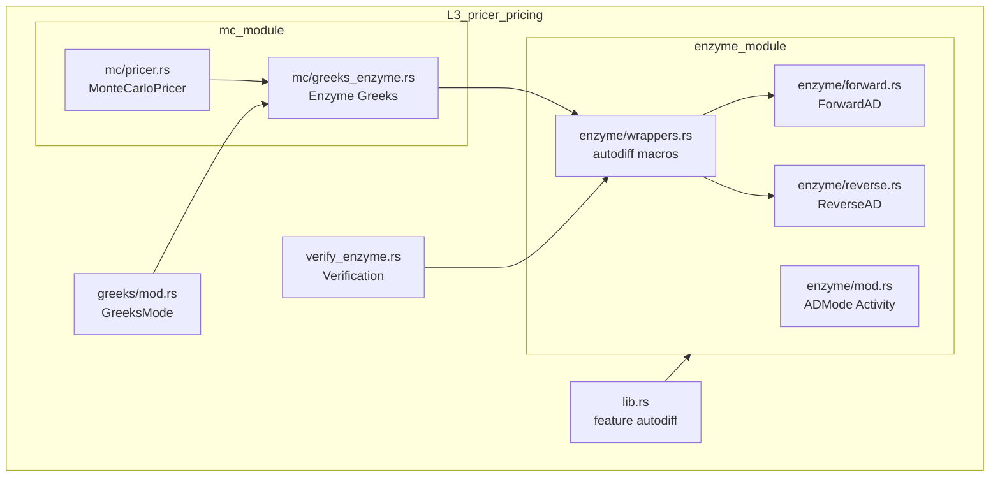
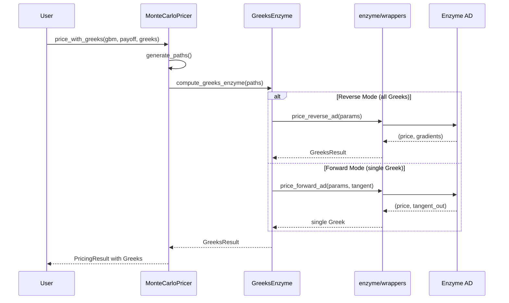

# Design Document: enzyme-autodiff-integration

## Overview

**Purpose**: Enzyme LLVM-level ADの `#[autodiff]` マクロを pricer_pricing クレートに本格統合し、高性能Greeks計算を実現する。

**Users**: クオンツ開発者、デリバティブトレーダー、リスク管理チームが Monte Carlo シミュレーションでのリアルタイム Greeks 計算に使用する。

**Impact**: 現在の有限差分近似（Phase 3.0 placeholder）を Enzyme 自動微分に置き換え、5倍以上の高速化を実現。

### Goals

- Enzyme `#[autodiff_forward]` / `#[autodiff_reverse]` マクロの本格統合
- `MonteCarloPricer::price_with_greeks()` での Enzyme AD 利用
- num-dual / 有限差分との検証による正確性保証
- stable Rust との互換性維持（graceful degradation）

### Non-Goals

- 他クレート（pricer_core, pricer_models等）への Enzyme 依存導入
- カスタム LLVM パス開発
- GPU/CUDA 対応（将来検討）

---

## Architecture

### Existing Architecture Analysis

**現在の構造**:
- `enzyme/mod.rs`: `ADMode`, `Activity` enum、`gradient()` 有限差分 placeholder
- `mc/pricer.rs`: `price_with_greeks()` bump-and-revalue 実装
- `greeks/`: `GreeksConfig`, `GreeksMode`, `GreeksResult<T>`
- Feature flags: `enzyme-ad` (llvm-sys), `l1l2-integration`

**制約**:
- pricer_pricing は L3 として他 Pricer クレートから独立
- nightly-2025-01-15 ツールチェーン使用
- 静的ディスパッチ（enum）パターン維持

### Architecture Pattern & Boundary Map



**Architecture Integration**:
- Selected pattern: Hybrid（既存拡張 + 新規サブモジュール）
- Domain boundaries: enzyme/ モジュール内で AD ロジックを完結
- Existing patterns preserved: `ADMode`, `Activity`, `GreeksMode` enum
- New components rationale: forward.rs/reverse.rs で Forward/Reverse mode を分離
- Steering compliance: L3 独立性維持、static dispatch 継続

### Technology Stack

| Layer | Choice / Version | Role in Feature | Notes |
|-------|------------------|-----------------|-------|
| Language | Rust nightly-2025-01-15 | `#![feature(autodiff)]` 有効化 | stable fallback あり |
| AD Backend | Enzyme LLVM 18 | 自動微分エンジン | `-Zautodiff=Enable` |
| Build | Cargo + feature flags | `enzyme-ad` feature gate | CI で両モードテスト |
| Testing | approx, proptest | 数値検証 | 相対誤差 1e-6 以内 |

---

## System Flows

### Greeks Calculation Flow (Enzyme Mode)



**Key Decisions**:
- Reverse mode を全 Greeks 一括計算に使用（効率的）
- Forward mode は単一 Greek 計算用に提供（Delta のみ等）
- fallback は `GreeksMode::BumpAndRevalue` で既存実装を使用

---

## Requirements Traceability

| Requirement | Summary | Components | Interfaces | Flows |
|-------------|---------|------------|------------|-------|
| 1.1-1.4 | Nightly feature 有効化 | lib.rs, Cargo.toml | cfg_attr | - |
| 2.1-2.5 | Forward mode AD | enzyme/forward.rs, wrappers.rs | ForwardAD<T>, autodiff_forward | Greeks Flow |
| 3.1-3.5 | Reverse mode AD | enzyme/reverse.rs, wrappers.rs | ReverseAD<T>, autodiff_reverse | Greeks Flow |
| 4.1-4.6 | MC Pricer 統合 | mc/greeks_enzyme.rs | GreeksEnzyme trait | Greeks Flow |
| 5.1-5.5 | 検証・正確性 | verify_enzyme.rs | VerificationResult | - |
| 6.1-6.5 | Enzyme 対応関数 | enzyme/smooth.rs | smooth_payoff | - |
| 7.1-7.5 | パフォーマンス | benches/enzyme_bench.rs | - | - |
| 8.1-8.5 | CI 統合 | .github/workflows/ci.yml | - | - |

---

## Components and Interfaces

| Component | Domain/Layer | Intent | Req Coverage | Key Dependencies | Contracts |
|-----------|--------------|--------|--------------|------------------|-----------|
| enzyme/wrappers.rs | L3/AD | Enzyme マクロラッパー | 2.1-2.2, 3.1-3.2 | Enzyme (P0) | Service |
| enzyme/forward.rs | L3/AD | Forward mode 型 | 2.3-2.5 | wrappers (P0) | Service |
| enzyme/reverse.rs | L3/AD | Reverse mode 型, GammaAD | 3.3-3.5, 4.2 | wrappers (P0) | Service |
| mc/greeks_enzyme.rs | L3/MC | Greeks 計算統合 + チェックポイント | 4.1-4.6 | wrappers (P0), mc/pricer (P1) | Service |
| verify_enzyme.rs | L3/Test | AD 検証 | 5.1-5.5 | wrappers (P0) | - |

### L3/AD Layer

#### enzyme/wrappers.rs

| Field | Detail |
|-------|--------|
| Intent | Enzyme `#[autodiff_*]` マクロを適用したラッパー関数群 |
| Requirements | 2.1, 2.2, 3.1, 3.2 |

**Responsibilities & Constraints**
- `#[autodiff_forward]` / `#[autodiff_reverse]` マクロ適用
- Activity annotation による微分対象指定
- 有限差分 fallback（enzyme-ad feature 無効時）

**Dependencies**
- External: Enzyme LLVM plugin — AD 実行 (P0)
- Inbound: enzyme/forward.rs, enzyme/reverse.rs — 型定義 (P1)

**Contracts**: Service [x]

##### Service Interface

```rust
/// Forward mode AD wrapper
/// Requirement 2.1, 2.2
#[cfg(feature = "enzyme-ad")]
#[autodiff_forward(d_price_spot, Dual, Const, Const, Const, Dual)]
pub fn price_european_primal(
    spot: f64,
    strike: f64,
    rate: f64,
    vol: f64,
    time: f64,
) -> f64;

/// Reverse mode AD wrapper
/// Requirement 3.1, 3.2
#[cfg(feature = "enzyme-ad")]
#[autodiff_reverse(d_price_all, Active, Duplicated, Const, Duplicated, Duplicated, Duplicated)]
pub fn price_european_adjoint(
    spot: &f64,
    d_spot: &mut f64,
    strike: f64,
    rate: &f64,
    d_rate: &mut f64,
    vol: &f64,
    d_vol: &mut f64,
    time: &f64,
    d_time: &mut f64,
) -> f64;

/// Fallback implementation (enzyme-ad disabled)
#[cfg(not(feature = "enzyme-ad"))]
pub fn price_european_delta_fd(
    spot: f64,
    strike: f64,
    rate: f64,
    vol: f64,
    time: f64,
    bump: f64,
) -> f64;
```

- Preconditions: 入力パラメータは有限値
- Postconditions: 微分値は数学的に正しい
- Invariants: Enzyme 無効時は有限差分で同等の結果

**Implementation Notes**
- Integration: `#![feature(autodiff)]` が lib.rs で有効化されている必要あり
- Validation: `debug_assert!` で NaN/Inf チェック
- Risks: Enzyme API 変更時は CI で即座に検出

---

#### enzyme/forward.rs

| Field | Detail |
|-------|--------|
| Intent | Forward mode AD の型安全ラッパー |
| Requirements | 2.3, 2.4, 2.5 |

**Responsibilities & Constraints**
- `ForwardAD<T>` 型による tangent 値管理
- 単一パラメータ微分の効率的計算

**Dependencies**
- Inbound: wrappers.rs — マクロ実装 (P0)

**Contracts**: Service [x]

##### Service Interface

```rust
/// Forward mode AD result
/// Requirement 2.4
pub struct ForwardAD<T> {
    /// Primal value
    pub value: T,
    /// Tangent (derivative) value
    pub tangent: T,
}

impl<T: Float> ForwardAD<T> {
    /// Create from primal with zero tangent
    pub fn constant(value: T) -> Self;

    /// Create with tangent seed
    pub fn variable(value: T, tangent: T) -> Self;

    /// Extract derivative
    pub fn derivative(&self) -> T;
}

/// Compute single Greek using forward mode
/// Requirement 2.3, 2.5
pub fn compute_delta_forward(
    gbm: &GbmParams,
    payoff: &PayoffParams,
) -> ForwardAD<f64>;
```

---

#### enzyme/reverse.rs

| Field | Detail |
|-------|--------|
| Intent | Reverse mode AD の型安全ラッパー |
| Requirements | 3.3, 3.4, 3.5 |

**Responsibilities & Constraints**
- `ReverseAD<T>` 型による adjoint 値管理
- 全パラメータ勾配の一括計算

**Dependencies**
- Inbound: wrappers.rs — マクロ実装 (P0)

**Contracts**: Service [x]

##### Service Interface

```rust
/// Reverse mode AD gradients (first-order)
/// Requirement 3.4
pub struct ReverseAD<T> {
    /// Primal value
    pub value: T,
    /// Gradient with respect to spot (Delta)
    pub d_spot: T,
    /// Gradient with respect to rate (Rho)
    pub d_rate: T,
    /// Gradient with respect to volatility (Vega)
    pub d_vol: T,
    /// Gradient with respect to time (Theta)
    pub d_time: T,
}

/// Second-order derivative result (Gamma)
/// Requirement 4.2 (Gamma support)
pub struct GammaAD<T> {
    /// First derivative (Delta)
    pub delta: T,
    /// Second derivative (Gamma = ∂²V/∂S²)
    pub gamma: T,
}

impl<T: Float> ReverseAD<T> {
    /// Compute all first-order gradients in single reverse pass
    /// Requirement 3.3, 3.5
    pub fn compute_all_greeks(
        gbm: &GbmParams,
        payoff: &PayoffParams,
    ) -> Self;

    /// Convert to GreeksResult
    pub fn to_greeks_result(&self) -> GreeksResult<T>;
}

impl<T: Float> GammaAD<T> {
    /// Compute Gamma using nested AD (Forward-over-Reverse)
    /// Falls back to finite difference on Delta if nested AD unavailable
    /// Requirement 4.2
    pub fn compute_gamma(
        gbm: &GbmParams,
        payoff: &PayoffParams,
    ) -> Self;
}
```

---

### L3/MC Layer

#### mc/greeks_enzyme.rs

| Field | Detail |
|-------|--------|
| Intent | MonteCarloPricer への Enzyme AD 統合 |
| Requirements | 4.1, 4.2, 4.3, 4.4, 4.5, 4.6 |

**Responsibilities & Constraints**
- `price_with_greeks()` 内部での Enzyme 呼び出し
- 並列シミュレーション時の adjoint 集約
- path-dependent オプションでの Enzyme 自動チェックポイント活用

**Dependencies**
- Inbound: mc/pricer.rs — MonteCarloPricer (P0)
- Inbound: enzyme/wrappers.rs — AD 実行 (P0)

##### Checkpointing Strategy

- Enzyme 内部自動チェックポイント機能を使用（LLVM レベルで最適化）
- 既存 `checkpoint/` モジュールは Enzyme 外部の状態保存用途に限定
- path 長 1000+ での メモリ使用量監視が必要

**Contracts**: Service [x]

##### Service Interface

```rust
/// Enzyme-based Greeks calculation trait
/// Requirement 4.1
pub trait GreeksEnzyme {
    /// Compute Greeks using Enzyme AD
    fn compute_greeks_enzyme(
        &self,
        gbm: &GbmParams,
        payoff: &PayoffParams,
        greeks: &[Greek],
    ) -> GreeksResult<f64>;
}

impl GreeksEnzyme for MonteCarloPricer {
    fn compute_greeks_enzyme(
        &self,
        gbm: &GbmParams,
        payoff: &PayoffParams,
        greeks: &[Greek],
    ) -> GreeksResult<f64> {
        // Requirement 4.2: Delta, Gamma, Vega, Theta, Rho
        // Requirement 4.4: Thread-safe aggregation
        // Requirement 4.6: Fallback when enzyme-ad disabled
    }
}

/// Thread-local adjoint accumulator
/// Requirement 4.4
pub struct AdjointAccumulator {
    pub d_spot: f64,
    pub d_vol: f64,
    pub d_rate: f64,
    pub d_time: f64,
    pub count: usize,
}

impl AdjointAccumulator {
    pub fn new() -> Self;
    pub fn accumulate(&mut self, adj: &ReverseAD<f64>);
    pub fn reduce(self, other: Self) -> Self;
}
```

**Implementation Notes**
- Integration: `rayon::iter::ParallelIterator::reduce` で adjoint 集約
- Validation: 各スレッドで NaN チェック
- Risks: 大量パス時のメモリ使用量増加

---

## Data Models

### Domain Model

**Aggregates**:
- `GreeksResult<T>`: Greeks 計算結果の集約ルート
- `ForwardAD<T>`: Forward mode 計算の値オブジェクト
- `ReverseAD<T>`: Reverse mode 計算の値オブジェクト（一次微分）
- `GammaAD<T>`: Nested AD による二次微分（Gamma）の値オブジェクト

**Business Rules**:
- Greeks 計算は常に数値的に安定した結果を返す
- NaN/Inf は計算エラーとして扱う
- fallback mode は enzyme-ad 無効時に自動適用

---

## Error Handling

### Error Strategy

- **Enzyme 未インストール**: ビルド時エラー（feature gate 未満足）
- **数値エラー (NaN/Inf)**: `PricingError::NumericalInstability`
- **Activity ミスマッチ**: コンパイル時エラー（マクロ展開）

### Error Categories and Responses

**Build Errors** (compile-time):
- LLVM 18 未検出 → `build.rs` でエラーメッセージ
- feature mismatch → Cargo エラー

**Runtime Errors**:
- NaN 検出 → fallback 計算または early return
- Timeout → 計算打ち切り

---

## Testing Strategy

### Unit Tests

- `enzyme/wrappers.rs`: 各 `#[autodiff_*]` 関数の勾配検証
- `enzyme/forward.rs`: `ForwardAD<T>` 演算テスト
- `enzyme/reverse.rs`: `ReverseAD<T>` 全勾配テスト
- `mc/greeks_enzyme.rs`: MC + Enzyme 統合テスト

### Integration Tests

- Enzyme vs num-dual 比較（相対誤差 1e-6 以内）
- Enzyme vs 有限差分比較
- Black-Scholes analytical Greeks 比較
- 並列実行時の結果一致性

### Performance Tests

- `criterion` ベンチマーク: Enzyme vs 有限差分速度比較
- `iai-callgrind`: 命令数ベース回帰検出
- 10,000 パス MC: 100ms 以内完了確認

---

## Performance & Scalability

### Target Metrics

| Metric | Target | Measurement |
|--------|--------|-------------|
| Greeks 計算速度 | 有限差分比 5x 高速 | criterion benchmark |
| MC 10k paths + Greeks | < 100ms | criterion benchmark |
| 並列スケーリング | 線形 | 8 core 測定 |

### Optimization Techniques

- Reverse mode で全 Greeks 一括計算
- Thread-local adjoint で競合回避
- LLVM LTO で最適化

---

## Migration Strategy

### Phase 1: 基本統合

1. `lib.rs` に `#![cfg_attr(feature = "enzyme-ad", feature(autodiff))]` 追加
2. `enzyme/wrappers.rs` に基本 `#[autodiff_*]` 関数追加
3. 既存テストで動作確認

### Phase 2: MC Pricer 統合

1. `mc/greeks_enzyme.rs` 新規作成
2. `price_with_greeks()` を `GreeksMode` で分岐
3. 並列 adjoint 集約実装

### Phase 3: 検証・最適化

1. num-dual / 有限差分比較テスト追加
2. criterion ベンチマーク追加
3. パフォーマンスチューニング

### Rollback Triggers

- Enzyme API 変更によるビルド失敗 → fallback mode 使用
- 数値精度問題 → 有限差分にロールバック
