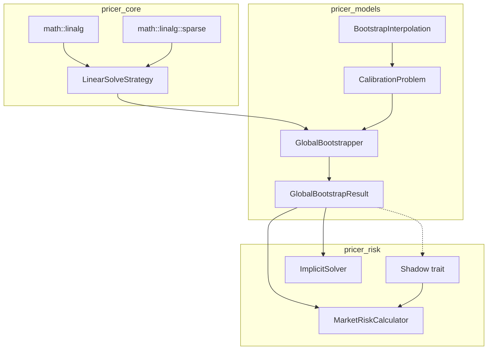
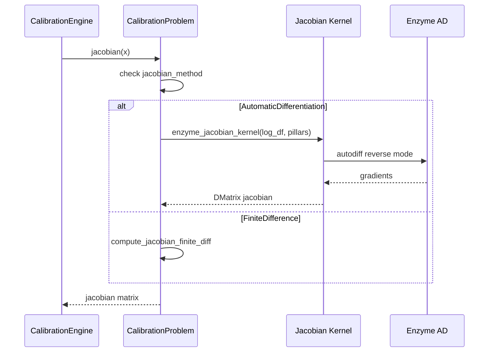
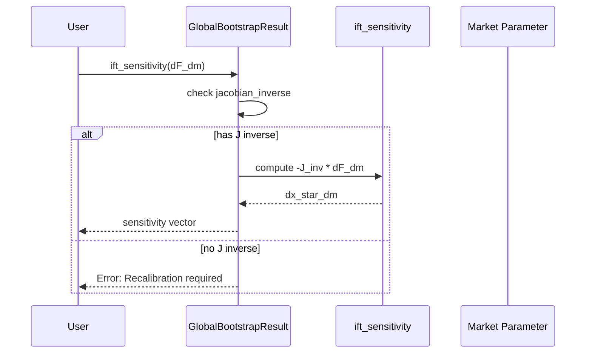
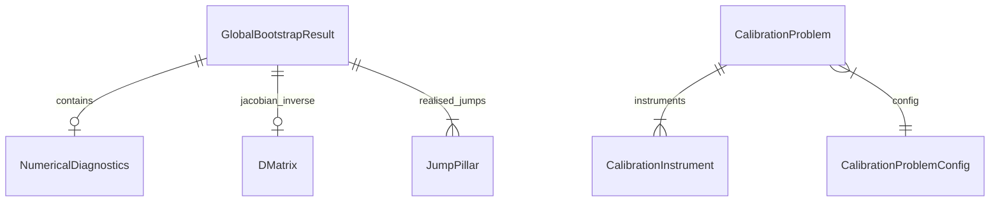

# Technical Design: enzyme-ift-bootstrap

## Overview

**Purpose**: Enzyme AD による Global Bootstrapping の Jacobian 計算最適化と、Implicit Function Theorem (IFT) を用いた効率的な感度抽出機能を提供します。

**Users**: クオンツ開発者、リスク管理者が、機械精度の感度計算とキャリブレーション後の O(1) Greeks 計算を実現します。

**Impact**: 現在の有限差分法による Jacobian 計算を Enzyme AD に置き換え、疎行列アルゴリズムへの拡張性を確保します。

### Goals

- Enzyme AD による機械精度 Jacobian 計算（1e-12 相対誤差以内）
- IFT による効率的な市場感度抽出（J⁻¹ キャッシュ活用）
- 疎行列向け LinearSolveStrategy 拡張（CSR フォーマット対応）
- 数値安定性モニタリング（条件数、正則化）
- pricer_risk AAD Binder との統合

### Non-Goals

- GMRES 等の反復解法（Phase 2 として分離）
- MonotonicCubic, NaturalCubicSpline 補間の完全 AD 対応（既存補間優先）
- GPU 並列化（将来の別仕様として検討）

## Architecture

### Existing Architecture Analysis

現在の Global Bootstrapping アーキテクチャ:

```
pricer_models::builder::curve::global
├── GlobalBootstrapper<T>        # Newton-Raphson ソルバー
├── GlobalBootstrapConfig<T>     # 設定（tolerance, max_iterations, jacobian_method）
├── GlobalBootstrapResult<T>     # 結果（curve, jacobian_inverse, residual_history）
└── CalibrationEngine<T, S>      # LinearSolveStrategy プラガブル設計
```

**統合ポイント**:
- `CalibrationProblem::jacobian()` — JacobianMethod による Jacobian 計算
- `GlobalBootstrapResult::jacobian_inverse` — IFT 用 J⁻¹ キャッシュ
- `LinearSolveStrategy<T>` trait — アルゴリズム切替の拡張ポイント

### Architecture Pattern & Boundary Map



**Architecture Integration**:
- **Selected pattern**: Strategy パターン（LinearSolveStrategy）による疎行列アルゴリズム拡張
- **Domain/feature boundaries**:
  - pricer_core: 疎行列データ構造と基本演算
  - pricer_models: Enzyme AD Jacobian 計算、IFT 感度メソッド
  - pricer_risk: Shadow 実装、AAD Binder 統合
- **Existing patterns preserved**: A-I-P-S 依存方向、feature-gated 実装
- **New components rationale**: `sparse/` モジュールは pricer_core の独立した関心事として分離
- **Steering compliance**: 単方向データフロー維持、static dispatch 推奨

### Technology Stack

| Layer | Choice / Version | Role in Feature | Notes |
|-------|------------------|-----------------|-------|
| Linear Algebra | nalgebra-sparse 0.10+ | CSR/CSC 疎行列フォーマット | nalgebra との型互換性 |
| AD Backend | Enzyme LLVM 18 | Reverse-mode AD | nightly-2025-01-15 必須 |
| Iterative Solvers | (Phase 2) | GMRES 反復解法 | scirs2-sparse 候補 |

## System Flows

### Enzyme AD Jacobian 計算フロー



### IFT 感度抽出フロー



## Requirements Traceability

| Requirement | Summary | Components | Interfaces | Flows |
|-------------|---------|------------|------------|-------|
| 1.1-1.5 | Enzyme AD Jacobian | CalibrationProblem, EnzymeJacobianKernel | jacobian(), enzyme_jacobian_kernel() | Jacobian 計算フロー |
| 2.1-2.5 | 微分可能補間 | BootstrappedCurve, InterpolatorEnum | discount_factor_with_gradient() | — |
| 3.1-3.5 | IFT 感度抽出 | GlobalBootstrapResult | ift_sensitivity(), ift_sensitivity_batch() | IFT 感度フロー |
| 4.1-4.5 | 疎行列 Strategy | SparseCholeskyStrategy, SparseLUStrategy | sparse_solve(), decompose_sparse() | — |
| 5.1-5.5 | 数値安定性 | GlobalBootstrapper, NumericalDiagnostics | validate_jacobian_quality(), condition_number() | — |
| 6.1-6.5 | Feature Flag | GlobalBootstrapConfig, CalibrationProblemConfig | with_jacobian_method() | — |
| 7.1-7.5 | AAD Binder 統合 | GlobalBootstrapResult, MarketRiskCalculator | Shadow impl, accept_bootstrap_result() | — |

## Components and Interfaces

| Component | Domain/Layer | Intent | Req Coverage | Key Dependencies | Contracts |
|-----------|--------------|--------|--------------|------------------|-----------|
| SparseCholeskyStrategy | pricer_core::linalg | 対称正定値疎行列の Cholesky 分解 | 4.1, 4.2 | nalgebra-sparse (P0) | Service |
| SparseLUStrategy | pricer_core::linalg | 一般疎行列の LU 分解 | 4.1, 4.4 | nalgebra-sparse (P0) | Service |
| EnzymeJacobianKernel | pricer_models::builder | Enzyme AD による Jacobian 計算 | 1.1-1.4 | Enzyme (P0), CalibrationProblem (P0) | Service |
| GlobalBootstrapResult (拡張) | pricer_models::builder | IFT 感度メソッド追加 | 3.1-3.5 | DMatrix (P0) | Service |
| NumericalDiagnostics | pricer_models::builder | 数値安定性レポート | 5.1-5.5 | — | State |
| Shadow for GlobalBootstrapResult | pricer_risk::greeks::ad | AAD 勾配蓄積 | 7.3 | Shadow trait (P0) | Service |

### pricer_core::math::linalg

#### SparseMatrix (Type Aliases)

| Field | Detail |
|-------|--------|
| Intent | 疎行列型エイリアスと変換ユーティリティ |
| Requirements | 4.1 |

**Responsibilities & Constraints**
- CSR (Compressed Sparse Row) フォーマットのラッパー型定義
- `DMatrix<T>` との相互変換
- スパース率計算ユーティリティ

**Dependencies**
- External: nalgebra-sparse — CSR/CSC 実装 (P0)

**Contracts**: Service [x]

##### Service Interface

```rust
/// CSR 疎行列型エイリアス
pub type CsrMatrix<T> = nalgebra_sparse::CsrMatrix<T>;
pub type CscMatrix<T> = nalgebra_sparse::CscMatrix<T>;

/// 密行列から疎行列への変換
pub fn to_csr<T: RealField + Copy>(
    dense: &DMatrix<T>,
    threshold: T,
) -> CsrMatrix<T>;

/// 疎行列から密行列への変換
pub fn to_dense<T: RealField + Copy>(
    sparse: &CsrMatrix<T>,
) -> DMatrix<T>;

/// スパース率計算 (非ゼロ要素 / 全要素)
pub fn sparsity_ratio<T: RealField + Copy>(
    matrix: &DMatrix<T>,
    threshold: T,
) -> f64;
```

- Preconditions: matrix は正方行列
- Postconditions: 変換は数値的に等価
- Invariants: threshold 未満の値はゼロとして扱う

#### SparseLUStrategy

| Field | Detail |
|-------|--------|
| Intent | 一般疎行列の LU 分解による線形システム解法 |
| Requirements | 4.1, 4.4 |

**Responsibilities & Constraints**
- CSR フォーマット疎行列の LU 分解
- 分解結果のキャッシュ（繰り返し solve 用）
- 70% 以上のスパース率で自動選択

**Dependencies**
- Inbound: CalibrationEngine — 疎行列解法 (P0)
- External: nalgebra-sparse — SparseLU (P0)

**Contracts**: Service [x]

##### Service Interface

```rust
#[derive(Debug, Clone)]
pub struct SparseLUStrategy<T: RealField + Copy> {
    csr_matrix: Option<CsrMatrix<T>>,
    lu_factors: Option<SparseLU<T>>,
    sparsity_threshold: T,
}

impl<T: RealField + Copy + Float> LinearSolveStrategy<T> for SparseLUStrategy<T> {
    fn decompose(&mut self, matrix: &DMatrix<T>) -> Result<(), LinearAlgebraError>;
    fn solve(&self, b: &[T]) -> Result<Vec<T>, LinearAlgebraError>;
    fn inverse(&self) -> Result<DMatrix<T>, LinearAlgebraError>;
    fn name(&self) -> &'static str { "Sparse LU Decomposition" }
}

impl<T: RealField + Copy + Float> SparseLUStrategy<T> {
    /// CSR 行列を直接受け付ける decompose
    pub fn decompose_sparse(&mut self, csr: &CsrMatrix<T>) -> Result<(), LinearAlgebraError>;

    /// スパース率が閾値を超えているかチェック
    pub fn is_sparse_beneficial(&self, matrix: &DMatrix<T>) -> bool;
}
```

- Preconditions: 行列は正則（非特異）
- Postconditions: decompose 後、solve と inverse が利用可能
- Invariants: LU 分解は decompose 呼び出し時のみ実行

**Implementation Notes**
- Integration: 既存 LUStrategy と同一インターフェース
- Validation: 対角ゼロチェック、スパース率閾値検証
- Risks: nalgebra-sparse の SparseLU が RealField 制約を満たすか要確認

### pricer_models::builder

#### EnzymeJacobianKernel

| Field | Detail |
|-------|--------|
| Intent | Enzyme AD による Jacobian 行列の reverse-mode 計算 |
| Requirements | 1.1, 1.2, 1.3, 1.4 |

**Responsibilities & Constraints**
- `#[autodiff]` マクロによる微分可能カーネル
- 各行の勾配を並列計算（1 回の forward + n 回の reverse）
- 失敗時の有限差分フォールバック

**Dependencies**
- Inbound: CalibrationProblem — Jacobian 計算 (P0)
- External: Enzyme AD — #[autodiff] (P0)

**Contracts**: Service [x]

##### Service Interface

```rust
/// Enzyme AD による Jacobian 計算カーネル
#[cfg(feature = "enzyme-ad")]
pub mod enzyme_jacobian {
    use std::autodiff::autodiff;

    /// 単一残差の勾配計算
    #[autodiff(d_residual_kernel, Reverse, Duplicated, Const, Duplicated)]
    pub fn residual_kernel(
        log_df: &[f64],
        pillars: &[f64],
        instrument_idx: usize,
        output: &mut f64,
    );

    /// Jacobian 行列全体の計算
    pub fn compute_enzyme_jacobian(
        problem: &CalibrationProblem<f64, impl CalibrationInstrument<f64>>,
        log_df: &[f64],
    ) -> Result<DMatrix<f64>, CalibrationError>;
}

/// Jacobian 計算結果とメタデータ
pub struct JacobianResult<T: Float> {
    pub matrix: DMatrix<T>,
    pub method_used: JacobianMethod,
    pub computation_time_us: u64,
    pub fallback_used: bool,
}
```

- Preconditions: enzyme-ad feature 有効、log_df.len() == pillars.len()
- Postconditions: Jacobian 行列は n_instruments × n_pillars
- Invariants: fallback_used == true の場合、method_used は FiniteDifference

**Implementation Notes**
- Integration: CalibrationProblem::jacobian() から呼び出し
- Validation: Enzyme 計算失敗時は warn! ログ出力後にフォールバック
- Risks: nightly 依存、Windows サポート未確認

#### GlobalBootstrapResult (拡張)

| Field | Detail |
|-------|--------|
| Intent | IFT 感度抽出メソッドと数値診断情報の追加 |
| Requirements | 3.1, 3.3, 3.4, 5.5 |

**Responsibilities & Constraints**
- `ift_sensitivity` メソッドによる ∂x*/∂m 計算
- バッチ市場パラメータ感度のサポート
- NumericalDiagnostics フィールドの追加

**Dependencies**
- Inbound: ImplicitSolver, MarketRiskCalculator — 感度計算 (P0)

**Contracts**: Service [x] / State [x]

##### Service Interface

```rust
impl<T: Float + RealField> GlobalBootstrapResult<T> {
    /// IFT による単一市場パラメータ感度計算
    ///
    /// ∂x*/∂m = -J⁻¹ · ∂F/∂m
    ///
    /// # Arguments
    /// * `dF_dm` - 残差関数の市場パラメータ微分 (n_instruments,)
    ///
    /// # Returns
    /// * `Ok(Vec<T>)` - ピラー値の感度 (n_pillars,)
    /// * `Err(IftError::NoJacobianInverse)` - J⁻¹ がキャッシュされていない
    pub fn ift_sensitivity(&self, dF_dm: &[T]) -> Result<Vec<T>, IftError>;

    /// IFT によるバッチ市場パラメータ感度計算
    ///
    /// # Arguments
    /// * `dF_dm_batch` - 残差関数の市場パラメータ微分行列 (n_instruments × n_params)
    ///
    /// # Returns
    /// * `Ok(DMatrix<T>)` - ピラー値の感度行列 (n_pillars × n_params)
    pub fn ift_sensitivity_batch(&self, dF_dm_batch: &DMatrix<T>) -> Result<DMatrix<T>, IftError>;

    /// J⁻¹ が利用可能かチェック
    pub fn can_compute_ift(&self) -> bool;
}

/// IFT 計算エラー
#[derive(Debug, Clone, thiserror::Error)]
pub enum IftError {
    #[error("Jacobian inverse not cached. Recalibrate with store_jacobian_inverse=true")]
    NoJacobianInverse,

    #[error("Dimension mismatch: expected {expected}, got {got}")]
    DimensionMismatch { expected: usize, got: usize },
}
```

- Preconditions: jacobian_inverse.is_some() for ift_sensitivity
- Postconditions: 結果ベクトルの長さは n_pillars
- Invariants: J⁻¹ は calibrate 後に不変

##### State Management

```rust
/// 数値診断情報
#[derive(Debug, Clone)]
pub struct NumericalDiagnostics<T: Float> {
    /// Jacobian 条件数（推定値）
    pub condition_number: Option<T>,
    /// 残差ノルム履歴
    pub residual_history: Vec<T>,
    /// 適用された正則化
    pub regularisation_applied: Option<RegularisationType>,
    /// Jacobian 品質検証結果
    pub jacobian_quality: JacobianQuality,
}

#[derive(Debug, Clone, Copy, PartialEq, Eq)]
pub enum RegularisationType {
    None,
    Tikhonov { damping: f64 },
    LevenbergMarquardt { lambda: f64 },
}

#[derive(Debug, Clone, Copy, PartialEq, Eq)]
pub enum JacobianQuality {
    Good,
    Warning { reason: &'static str },
    Poor { reason: &'static str },
}
```

#### CalibrationProblem (拡張)

| Field | Detail |
|-------|--------|
| Intent | Jacobian 品質検証と Enzyme AD 統合 |
| Requirements | 1.1, 5.3, 5.4 |

**Responsibilities & Constraints**
- `validate_jacobian_quality` メソッド追加
- JacobianMethod::AutomaticDifferentiation の完全実装
- AD 不安定時の自動フォールバック

**Dependencies**
- Outbound: EnzymeJacobianKernel — AD 計算 (P0)

**Contracts**: Service [x]

##### Service Interface

```rust
impl<T, I> CalibrationProblem<T, I>
where
    T: Float + RealField + Copy,
    I: CalibrationInstrument<T> + Clone,
{
    /// Jacobian 行列の品質検証
    ///
    /// NaN, Inf, 近ゼロ対角要素をチェック
    pub fn validate_jacobian_quality(
        &self,
        jacobian: &DMatrix<T>,
    ) -> JacobianQuality;

    /// Enzyme AD による Jacobian 計算（feature-gated）
    #[cfg(feature = "enzyme-ad")]
    pub fn compute_jacobian_enzyme(
        &self,
        log_df: &[T],
    ) -> Result<JacobianResult<T>, CalibrationError>;
}
```

### pricer_risk::greeks::ad

#### Shadow for GlobalBootstrapResult

| Field | Detail |
|-------|--------|
| Intent | GlobalBootstrapResult の AAD 勾配蓄積サポート |
| Requirements | 7.3 |

**Responsibilities & Constraints**
- Shadow trait 実装
- discount_factors のみを active input として扱う
- curve, jacobian_inverse 等は const

**Dependencies**
- Inbound: MarketRiskCalculator — 勾配蓄積 (P0)

**Contracts**: Service [x]

##### Service Interface

```rust
impl Shadow for GlobalBootstrapResult<f64> {
    fn zero_out(&mut self) {
        // Active inputs: discount_factors
        self.discount_factors.zero_out();
        self.residual_norm = 0.0;

        // pricing_errors if present
        if let Some(ref mut errors) = self.pricing_errors {
            errors.zero_out();
        }

        // jacobian_inverse は const（AAD では J⁻¹ は固定）
        // curve は zero_out 不要（discount_factors から再構築）
    }
}
```

## Data Models

### Domain Model

**Aggregates**:
- `GlobalBootstrapResult<T>` — キャリブレーション結果の集約ルート
- `NumericalDiagnostics<T>` — 数値診断の Value Object

**Entities**:
- `CalibrationProblem<T, I>` — キャリブレーション問題のエンティティ

**Value Objects**:
- `JacobianResult<T>` — Jacobian 計算結果
- `IftError` — IFT エラー型

**Business Rules**:
- J⁻¹ は store_jacobian_inverse=true の場合のみキャッシュ
- 条件数が max_condition_number を超えた場合は Tikhonov 正則化を適用
- Enzyme AD 失敗時は自動的に有限差分にフォールバック

### Logical Data Model



## Error Handling

### Error Strategy

エラーは Result 型で伝播、回復可能なエラーはフォールバック機構で処理。

### Error Categories and Responses

**User Errors (400 equivalent)**:
- `IftError::NoJacobianInverse` — store_jacobian_inverse=true で再キャリブレーション
- `IftError::DimensionMismatch` — 入力次元の確認

**System Errors (500 equivalent)**:
- `CalibrationError::NumericalInstability` — ログ警告、damping 適用
- `LinearAlgebraError::SingularMatrix` — 正則化または別アルゴリズム試行

**Business Logic Errors**:
- `JacobianQuality::Poor` — 警告ログ、続行は可能

### Monitoring

- Jacobian 品質警告は `warn!` マクロで出力
- 条件数超過は `GlobalBootstrapResult::numerical_diagnostics` に記録
- Enzyme フォールバック発生は `JacobianResult::fallback_used` で追跡

## Testing Strategy

### Unit Tests

- `SparseLUStrategy::decompose` — CSR 変換と LU 分解の正確性
- `GlobalBootstrapResult::ift_sensitivity` — IFT 計算の数値精度
- `CalibrationProblem::validate_jacobian_quality` — NaN/Inf/ゼロ対角検出
- `Shadow for GlobalBootstrapResult` — zero_out の正確性

### Integration Tests

- Enzyme Jacobian vs 有限差分 — 1e-8 相対誤差以内
- IFT 感度 vs bump-and-recalibrate — 1e-8 相対誤差以内
- 疎行列 Strategy vs 密行列 Strategy — 数値的等価性

### Performance Tests

- 大規模行列（100+ pillars）での疎行列 Strategy パフォーマンス
- Enzyme AD vs 有限差分のスピードアップ率
- IFT バッチ感度のスケーラビリティ

## Optional Sections

### Security Considerations

- Enzyme AD は LLVM プラグインとして動作、信頼された環境でのみ使用
- 外部入力バリデーションは CalibrationInstrument レベルで実施

### Performance & Scalability

**Target Metrics**:
- 疎行列 Strategy: スパース率 70%+ で密行列より 2x 以上高速
- Enzyme AD: 有限差分比 10x 以上のスピードアップ（n_pillars > 10）
- IFT バッチ: O(n²) から O(n) への計算量削減

**Scaling Approach**:
- 疎行列は大規模問題（100+ pillars）で効果発揮
- Enzyme AD は問題サイズに依存しない一定のオーバーヘッド

### Migration Strategy

**Phase 1: 基盤構築 (1-2 days)**
- `pricer_core/src/math/linalg/sparse/` モジュール作成
- SparseMatrix 型エイリアスと変換ユーティリティ
- SparseLUStrategy 実装

**Phase 2: Enzyme AD 統合 (2-3 days)**
- EnzymeJacobianKernel 実装
- CalibrationProblem::jacobian への統合
- フォールバック機構

**Phase 3: IFT & AAD Binder (2-3 days)**
- GlobalBootstrapResult::ift_sensitivity 実装
- NumericalDiagnostics 追加
- Shadow trait 実装

**Phase 4: 数値安定性 (1-2 days)**
- validate_jacobian_quality 実装
- Tikhonov 正則化統合
- 条件数モニタリング

**Rollback Strategy**:
- 全機能は feature-gated、無効化でフォールバック
- 既存 API は後方互換性維持
