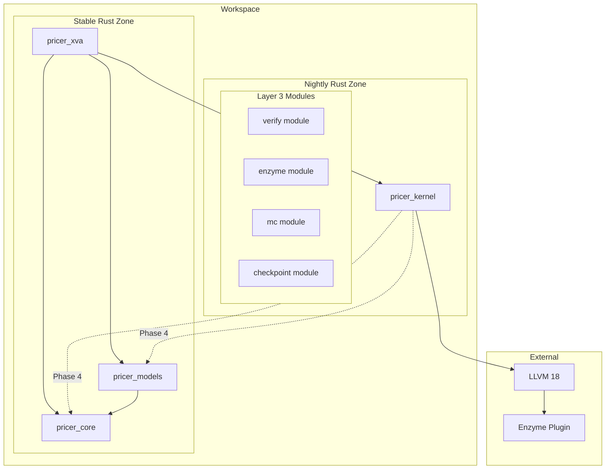
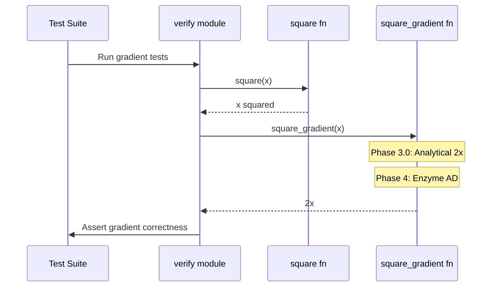
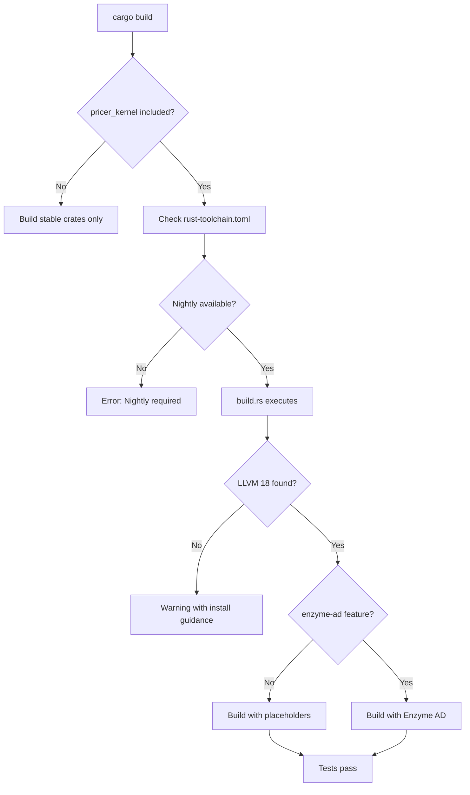

# Design Document: Enzyme Infrastructure Setup

## Overview

**Purpose**: This feature establishes the foundational automatic differentiation infrastructure within the `pricer_kernel` crate (Layer 3), enabling LLVM-level gradient computation via Enzyme for high-performance financial derivative pricing.

**Users**: Quantitative developers and researchers utilising the XVA pricing library will benefit from automatic gradient computation without manual derivative implementations.

**Impact**: Creates the isolated Layer 3 crate with nightly Rust toolchain, LLVM bindings, and verification infrastructure, maintaining strict separation from stable crates (L1/L2/L4).

### Goals

- Establish `pricer_kernel` crate with proper workspace integration and isolation
- Configure Rust nightly toolchain with LLVM 18 Enzyme plugin support
- Implement gradient verification test (`f(x) = x * x` returns gradient = `2x`)
- Enable CI/CD compatibility with stable workspace builds

### Non-Goals

- Full Enzyme integration with `#[autodiff]` macros (Phase 4)
- Monte Carlo kernel implementation (Phase 4)
- Integration with pricer_core traits (Phase 4)
- GPU acceleration setup (future phase)

## Architecture

### Existing Architecture Analysis

The 4-layer architecture isolates experimental technology to Layer 3:

```
L1 (pricer_core)    -> Foundation (Stable Rust)
L2 (pricer_models)  -> Business Logic (Stable Rust)
L3 (pricer_kernel)  -> AD Engine (Nightly Rust + Enzyme) <- THIS FEATURE
L4 (pricer_xva)     -> Application (Stable Rust)
```

**Current State**: pricer_kernel exists with placeholder implementation, rust-toolchain.toml, and llvm-sys dependency. This design formalises and extends the infrastructure.

### Architecture Pattern and Boundary Map



**Architecture Integration**:

- **Selected pattern**: Layer isolation with feature-flag controlled Enzyme activation
- **Domain boundaries**: L3 isolated from L1/L2 in Phase 3.0; integration deferred to Phase 4
- **Existing patterns preserved**: 4-layer architecture, workspace member structure, naming conventions
- **New components rationale**: verify module provides validation infrastructure; enzyme module (placeholder) encapsulates AD bindings
- **Steering compliance**: Follows structure.md layer principles and tech.md toolchain requirements

### Technology Stack

| Layer | Choice / Version | Role in Feature | Notes |
|-------|------------------|-----------------|-------|
| Language | Rust Edition 2021 | Core implementation | Workspace-inherited |
| Toolchain | nightly-2025-01-15 | Enzyme feature support | Pinned for reproducibility |
| LLVM Bindings | llvm-sys 180 | LLVM 18 FFI | Required for Enzyme |
| AD Backend | Enzyme LLVM plugin | Gradient computation | Placeholder in Phase 3.0 |
| Testing | approx 0.5 | Floating-point comparison | Workspace dependency |

## System Flows

### Gradient Computation Flow (Phase 3.0 Placeholder)



### Build Flow with Enzyme Validation



## Requirements Traceability

| Requirement | Summary | Components | Interfaces | Flows |
|-------------|---------|------------|------------|-------|
| 1.1-1.5 | Crate creation and workspace integration | pricer_kernel crate, Cargo.toml | Workspace member API | Build flow |
| 2.1-2.4 | Nightly toolchain configuration | rust-toolchain.toml | Toolchain override | Build flow |
| 3.1-3.5 | LLVM and Enzyme dependency configuration | Cargo.toml, build.rs | llvm-sys, env vars | Build validation |
| 4.1-4.4 | Enzyme autodiff module structure | enzyme module | autodiff macro/fn | Gradient flow |
| 5.1-5.5 | Gradient verification test | verify module | square, square_gradient | Test flow |
| 6.1-6.4 | Build isolation and CI compatibility | Workspace config | --exclude flag | CI pipeline |
| 7.1-7.3 | Documentation and developer guidance | Doc comments, README | Crate docs | N/A |

## Components and Interfaces

| Component | Domain/Layer | Intent | Req Coverage | Key Dependencies | Contracts |
|-----------|--------------|--------|--------------|------------------|-----------|
| pricer_kernel crate | L3/AD Engine | Enzyme AD infrastructure | 1.1-1.5, 6.1-6.4 | llvm-sys (P0) | Crate manifest |
| rust-toolchain.toml | L3/Toolchain | Enforce nightly Rust | 2.1-2.4 | rustup (P0) | Toolchain spec |
| build.rs | L3/Build | Validate Enzyme prerequisites | 3.1-3.5 | LLVM 18 (P1) | Build script |
| enzyme module | L3/AD | Autodiff bindings | 4.1-4.4 | Enzyme plugin (P1) | Service |
| verify module | L3/Test | Gradient verification | 5.1-5.5 | approx (P2) | Service |

### L3 / AD Engine

#### pricer_kernel Crate Manifest

| Field | Detail |
|-------|--------|
| Intent | Define Layer 3 crate with Enzyme dependencies and workspace integration |
| Requirements | 1.1, 1.2, 1.3, 1.4, 1.5, 6.3 |

**Responsibilities and Constraints**

- Define crate metadata with workspace inheritance
- Declare llvm-sys dependency for LLVM 18 bindings
- Specify feature flags for Enzyme activation
- Maintain zero dependencies on pricer_core/pricer_models/pricer_xva

**Dependencies**

- External: llvm-sys 180 - LLVM FFI bindings (P0)
- External: num-traits - Numeric abstractions (P2)
- Dev: approx - Floating-point testing (P2)

**Contracts**: Service [ ] / API [ ] / Event [ ] / Batch [ ] / State [ ]

##### Crate Manifest Contract

```toml
[package]
name = "pricer_kernel"
version.workspace = true
edition.workspace = true
description = "Enzyme LLVM-level automatic differentiation engine for XVA pricing"

[dependencies]
llvm-sys = "180"
num-traits.workspace = true

[dev-dependencies]
approx.workspace = true

[features]
default = []
enzyme-ad = []
```

**Implementation Notes**

- Integration: Workspace member registration in root Cargo.toml
- Validation: `cargo build --workspace --exclude pricer_kernel` must succeed on stable
- Risks: llvm-sys build requires LLVM 18 headers/libraries

---

#### rust-toolchain.toml

| Field | Detail |
|-------|--------|
| Intent | Enforce nightly-2025-01-15 toolchain for pricer_kernel |
| Requirements | 2.1, 2.2, 2.3, 2.4 |

**Responsibilities and Constraints**

- Pin nightly channel to specific date for reproducibility
- Include rustfmt and clippy components
- Override workspace default toolchain for L3 only

**Contracts**: State [x]

##### Toolchain State Contract

```toml
[toolchain]
channel = "nightly-2025-01-15"
components = ["rustfmt", "clippy", "llvm-tools-preview"]
```

**Implementation Notes**

- Integration: Located at `crates/pricer_kernel/rust-toolchain.toml`
- Validation: Building without nightly installed produces clear error
- Risks: Nightly API instability; mitigated by version pinning

---

#### build.rs

| Field | Detail |
|-------|--------|
| Intent | Validate LLVM 18 and Enzyme plugin availability at build time |
| Requirements | 3.2, 3.3, 3.4, 3.5 |

**Responsibilities and Constraints**

- Check LLVM 18 availability via llvm-config
- Emit cargo warnings if prerequisites missing
- Output installation guidance on failure
- Set RUSTFLAGS for Enzyme plugin loading (when enzyme-ad feature enabled)

**Dependencies**

- External: LLVM 18 installation - llvm-config binary (P1)
- External: Enzyme plugin - LLVMEnzyme-18.so (P1, optional for Phase 3.0)

**Contracts**: Service [x]

##### Build Script Interface

```rust
/// Build script for pricer_kernel.
///
/// Validates LLVM 18 availability and emits configuration.
fn main() {
    // Check LLVM version
    validate_llvm_version();

    // Emit Enzyme plugin path if available
    if cfg!(feature = "enzyme-ad") {
        configure_enzyme_plugin();
    }

    // Emit cargo directives
    println!("cargo:rerun-if-env-changed=LLVM_CONFIG");
    println!("cargo:rerun-if-env-changed=ENZYME_LIB");
}

/// Validates LLVM 18 is installed.
///
/// # Errors
/// Emits cargo:warning with installation guidance if LLVM 18 not found.
fn validate_llvm_version() -> Result<(), BuildError>;

/// Configures RUSTFLAGS for Enzyme plugin loading.
fn configure_enzyme_plugin();
```

**Implementation Notes**

- Integration: Executed during `cargo build -p pricer_kernel`
- Validation: Clear error messages with URLs for LLVM/Enzyme installation
- Risks: Environment-specific paths; mitigated by LLVM_CONFIG env var support

---

#### enzyme Module

| Field | Detail |
|-------|--------|
| Intent | Encapsulate Enzyme autodiff bindings and macros |
| Requirements | 4.1, 4.2, 4.3, 4.4 |

**Responsibilities and Constraints**

- Export `autodiff` function/macro for gradient computation
- Provide type-safe wrappers around Enzyme intrinsics
- Re-export from lib.rs for public API

**Dependencies**

- External: Enzyme LLVM plugin - Actual AD computation (P1)
- Inbound: verify module - Uses autodiff for gradient tests (P2)

**Contracts**: Service [x]

##### Enzyme Service Interface

```rust
//! Enzyme autodiff bindings for pricer_kernel.
//!
//! Phase 3.0: Placeholder module structure.
//! Phase 4: Full Enzyme integration with #[autodiff] macros.

/// Activity annotations for autodiff parameters.
#[derive(Clone, Copy, Debug)]
pub enum Activity {
    /// Parameter is constant (not differentiated).
    Const,
    /// Parameter carries dual/tangent value (forward mode).
    Dual,
    /// Parameter is active (reverse mode accumulation).
    Active,
    /// Parameter is duplicated with shadow (reverse mode).
    Duplicated,
}

/// Compute gradient of function f at point x using Enzyme.
///
/// # Phase 3.0
/// Returns placeholder value; actual Enzyme integration in Phase 4.
pub fn gradient<F>(f: F, x: f64) -> f64
where
    F: Fn(f64) -> f64;
```

**Implementation Notes**

- Integration: Module at `src/enzyme/mod.rs`, re-exported from `lib.rs`
- Validation: Phase 4 will use `#![feature(autodiff)]` and actual macros
- Risks: Enzyme API stability; placeholder allows safe fallback

---

#### verify Module

| Field | Detail |
|-------|--------|
| Intent | Provide gradient verification tests for Enzyme infrastructure validation |
| Requirements | 5.1, 5.2, 5.3, 5.4, 5.5 |

**Responsibilities and Constraints**

- Implement `square(x) = x * x` test function
- Implement `square_gradient(x)` returning gradient (2x)
- Assert correctness at multiple test points (1.0, 2.0, 5.0)
- Use approx crate for floating-point comparison

**Dependencies**

- Inbound: Test suite - Executes verification tests (P0)
- External: approx - Floating-point assertions (P2)

**Contracts**: Service [x]

##### Verification Service Interface

```rust
//! Enzyme gradient verification utilities.

/// Compute f(x) = x * x for verification.
///
/// # Arguments
/// * `x` - Input value
///
/// # Returns
/// x squared (the square of input)
#[inline]
pub fn square(x: f64) -> f64;

/// Compute gradient of f(x) = x * x at point x.
///
/// # Mathematical Definition
/// f(x) = x * x, f'(x) = 2x
///
/// # Arguments
/// * `x` - Point at which to evaluate gradient
///
/// # Returns
/// 2x (the gradient of x squared at x)
///
/// # Phase 3.0
/// Uses analytical derivative (2x) as placeholder.
#[inline]
pub fn square_gradient(x: f64) -> f64;
```

**Implementation Notes**

- Integration: Module at `src/verify/mod.rs` (existing), `src/verify_enzyme.rs` for dedicated tests
- Validation: Tests at x = 1.0, 2.0, 5.0 with epsilon tolerance 1e-10
- Risks: Placeholder passes without Enzyme; test naming indicates Phase 3.0 status

## Data Models

### Domain Model

No persistent data models for this infrastructure feature. The domain consists of:

- **Value objects**: `f64` inputs and outputs for gradient functions
- **Invariants**: `square_gradient(x) == 2 * x` (within floating-point tolerance)

## Error Handling

### Error Strategy

Build-time validation with clear guidance; runtime functions are infallible for f64 inputs.

### Error Categories and Responses

**Build Errors** (compile-time):

- Missing LLVM 18 -> cargo:warning with installation URL
- Missing nightly toolchain -> rustup error with install command
- Missing Enzyme plugin (with enzyme-ad feature) -> cargo:warning with guidance

**Test Errors** (runtime):

- Gradient mismatch -> approx assertion failure with expected/actual values

### Monitoring

- Build script outputs validation status to cargo
- Test suite reports pass/fail for gradient verification

## Testing Strategy

### Unit Tests

1. `test_square_value` - Verify `square(x)` returns x squared for multiple inputs
2. `test_square_gradient` - Verify gradient equals 2x at x = 3.0
3. `test_square_gradient_at_zero` - Verify gradient is 0 at x = 0
4. `test_square_gradient_negative` - Verify gradient for negative values
5. `test_finite_difference_approximation` - Validate against numerical derivative

### Integration Tests

1. `test_workspace_exclude_build` - Verify `--workspace --exclude pricer_kernel` builds on stable
2. `test_nightly_build` - Verify pricer_kernel builds with nightly toolchain
3. `test_verify_module_exports` - Verify public API exports correctly

### CI/CD Tests

1. Stable job: `cargo build --workspace --exclude pricer_kernel`
2. Nightly job: `cargo +nightly build -p pricer_kernel`
3. Nightly tests: `cargo +nightly test -p pricer_kernel`

## Optional Sections

### Security Considerations

Not applicable for this infrastructure feature. No user input, network calls, or sensitive data handling.

### Performance and Scalability

- **Phase 3.0**: Placeholder implementation has O(1) complexity
- **Phase 4**: Enzyme AD performance benchmarks to be established
- **Target**: Gradient computation within 2x of primal function cost (typical for reverse-mode AD)

## Supporting References

### Enzyme Autodiff Macro Syntax

```rust
// Forward mode differentiation
#[autodiff_forward(df, Dual, Const, Dual)]
pub fn f(x: &[f64], y: f64) -> f64 { ... }

// Reverse mode differentiation
#[autodiff_reverse(df, Duplicated, Const, Active)]
pub fn f(x: &mut [f64], y: f64) -> f64 { ... }

// Activity annotations:
// - Const: Parameter not differentiated
// - Dual: Forward mode tangent
// - Active: Reverse mode scalar
// - Duplicated: Reverse mode with shadow buffer
// - DuplicatedOnly: Shadow only, no primal
```

### Environment Configuration

```bash
# LLVM 18 installation (Ubuntu/Debian)
wget https://apt.llvm.org/llvm.sh
chmod +x llvm.sh
sudo ./llvm.sh 18

# Enzyme plugin path
export ENZYME_LIB=/usr/local/lib/LLVMEnzyme-18.so

# Build with Enzyme
export RUSTFLAGS="-C llvm-args=-load=$ENZYME_LIB"
cargo +nightly build -p pricer_kernel --features enzyme-ad
```
