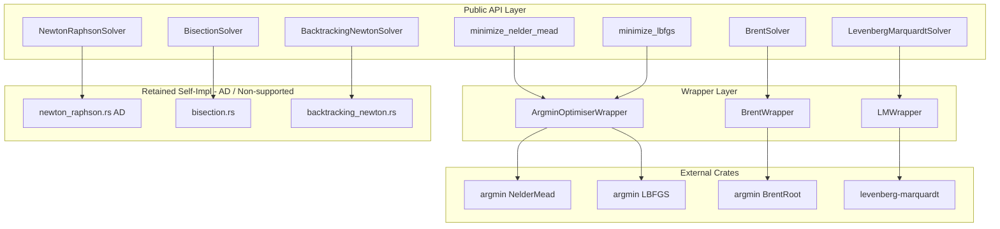

# Design Document: external-numerics-migration

## Overview

**Purpose**: 本機能は、pricer_core の数値計算モジュール（optimisers, solvers）を外部クレートベースの実装に移行し、約 1,500 行の自前アルゴリズムコードを薄いラッパーに置き換える。

**Users**: クオンツ開発者、リスク計算担当者、ライブラリメンテナーが、保守コスト削減と数値的堅牢性向上の恩恵を受ける。

**Impact**: 既存の公開 API を維持しつつ、内部実装を argmin、levenberg-marquardt クレートに委譲。コードベースの大幅な軽量化と、コミュニティ主導の継続的改善へのアクセスを実現。

### Goals

- 自前実装の Nelder-Mead、L-BFGS、Brent、LM を外部クレートに移行
- 既存の公開 API 完全互換を維持
- AD 互換性（num-dual / Enzyme）を保持
- 約 1,500 行のアルゴリズムコードを ~300 行のラッパーコードに削減

### Non-Goals

- faer による線形代数バックエンド置換（Phase 2 で評価、Req 4）
- 新規最適化アルゴリズムの追加
- 公開 API の破壊的変更

## Architecture

> 詳細な調査結果は `research.md` を参照。本セクションでは設計判断とコントラクトを記載。

### Existing Architecture Analysis

**現行構造**:
```
pricer_core/src/math/
├── optimisers/
│   ├── mod.rs          # 公開 API
│   ├── nelder_mead.rs  # 自前実装 (~330行)
│   ├── lbfgs.rs        # 自前実装 (~440行)
│   ├── config.rs       # 設定型
│   ├── result.rs       # 結果型
│   └── error.rs        # エラー型
└── solvers/
    ├── mod.rs          # 公開 API
    ├── brent.rs        # 自前実装 (~470行)
    ├── newton_raphson.rs    # 自前実装 (~450行) + AD
    ├── bisection.rs         # 自前実装 (~200行)
    ├── backtracking_newton.rs  # 自前実装 (~250行)
    ├── levenberg_marquardt.rs  # 自前実装 (~740行)
    └── config.rs       # 設定型
```

**移行後構造**:
```
pricer_core/src/math/
├── optimisers/
│   ├── mod.rs          # 公開 API（変更なし）
│   ├── argmin_wrapper.rs   # argmin ラッパー (新規)
│   ├── config.rs       # 設定型（変更なし）
│   ├── result.rs       # 結果型（変更なし）
│   └── error.rs        # エラー型（External 追加）
└── solvers/
    ├── mod.rs          # 公開 API（変更なし）
    ├── brent_wrapper.rs    # argmin BrentRoot ラッパー (新規)
    ├── lm_wrapper.rs       # levenberg-marquardt ラッパー (新規)
    ├── newton_raphson.rs   # AD 対応のため保持（Req 5.4）
    ├── bisection.rs        # 簡易実装のため保持
    ├── backtracking_newton.rs  # roots 非対応のため保持（Req 2.6）
    └── config.rs       # 設定型（変更なし）
```

### Architecture Pattern & Boundary Map



**Architecture Integration**:
- **Selected pattern**: Wrapper Pattern + AD Fallback（`research.md` Decision 1）
- **Domain boundaries**: Wrapper 層が外部クレートの API 差異を吸収
- **Existing patterns preserved**: `OptimisationResult`, `SolverConfig`, `LMResult`, エラー型
- **Retained components rationale**:
  - `newton_raphson.rs`: Dual64 AD 対応（Req 5.4）
  - `bisection.rs`: 簡易実装（~200行）、外部依存追加のコストに見合わない
  - `backtracking_newton.rs`: roots/argmin 非対応の backtracking line search（Req 2.6）
- **Steering compliance**: A-I-P-S レイヤー維持、Pricer 内部完結

### Technology Stack

| Layer | Choice / Version | Role in Feature | Notes |
|-------|------------------|-----------------|-------|
| Optimisation | argmin 0.10, argmin-math 0.4 | Nelder-Mead, L-BFGS | workspace 既存 |
| Root-finding | argmin 0.10 (BrentRoot) | Brent | workspace 既存 |
| Least Squares | levenberg-marquardt 0.14 | LM solver | 新規追加 |
| Linear Algebra | nalgebra 0.33 (既存) | LM の行列操作 | 変更なし |
| AD | num-dual 0.9 (既存) | Newton-Raphson AD | 変更なし |

> faer の評価は Requirement 4 で定義。詳細は `research.md` の「faer クレートの評価」を参照。Phase 2 で optional `faer-backend` feature として検討。

## Requirements Traceability

| Requirement | Summary | Components | Interfaces | Flows |
|-------------|---------|------------|------------|-------|
| 1.1 | Nelder-Mead argmin 委譲 | ArgminOptimiserWrapper | CostFunction | NM → Wrapper → argmin |
| 1.2 | L-BFGS argmin 委譲 | ArgminOptimiserWrapper | Gradient | LBFGS → Wrapper → argmin |
| 1.3 | L-BFGS numerical gradient | ArgminOptimiserWrapper | finitediff | LBFGS_num → Wrapper |
| 1.4-1.6 | 既存 API/Config/Result 維持 | ConfigConverter, ResultConverter | - | - |
| 1.7 | エラー変換 | ArgminOptimiserWrapper | OptimisationError::External | - |
| 1.8 | 自前実装削除 | - | - | Cleanup |
| 2.1 | Brent argmin 委譲 | BrentWrapper | CostFunction | Brent → Wrapper → argmin |
| 2.2 | Bisection | (保持) BisectionSolver | - | - |
| 2.3 | Newton-Raphson | (保持) NewtonRaphsonSolver | - | AD 対応 |
| 2.4-2.5 | 既存 API/Config 維持 | - | - | - |
| 2.6 | BacktrackingNewton 保持 | BacktrackingNewtonSolver | - | roots 非対応 |
| 2.7-2.8 | 自前実装削除/エラー | BrentWrapper | SolverError::External | Cleanup |
| 3.1 | LM 委譲 | LMWrapper | LeastSquaresProblem | LM → Wrapper → lm-crate |
| 3.2-3.4 | 既存 Config/Result 維持 | ConfigConverter | - | - |
| 3.5 | 自前実装削除 | - | - | Cleanup |
| 4.1-4.6 | faer 評価 | (Phase 2) BenchmarkSuite | - | 評価後判断 |
| 5.1 | Float ジェネリック維持 | 全 Wrapper | - | - |
| 5.2 | ArgminOp AD 対応 | ArgminOptimiserWrapper | - | - |
| 5.3-5.4 | Dual64 検証/find_root_ad 保持 | NewtonRaphsonSolver | - | - |
| 5.5 | AD fallback | NewtonRaphsonSolver | - | - |
| 6.1-6.5 | テスト互換 | All | - | RegressionTests |
| 7.1-7.6 | 依存管理 | Cargo.toml | - | FeatureFlags |
| 8.1-8.4 | ドキュメント | mod.rs docs | - | - |

## Components and Interfaces

| Component | Domain/Layer | Intent | Req Coverage | Key Dependencies | Contracts |
|-----------|--------------|--------|--------------|------------------|-----------|
| ArgminOptimiserWrapper | math/optimisers | argmin への委譲 | 1.1-1.8 | argmin (P0) | Service |
| BrentWrapper | math/solvers | argmin BrentRoot への委譲 | 2.1, 2.7-2.8 | argmin (P0) | Service |
| LMWrapper | math/solvers | levenberg-marquardt への委譲 | 3.1-3.5 | levenberg-marquardt (P0), nalgebra (P0) | Service |
| ConfigConverter | math/optimisers | Config → argmin パラメータ変換 | 1.4-1.6 | - | Internal |
| ResultConverter | math/optimisers | argmin 結果 → OptimisationResult | 1.6 | - | Internal |

### math/optimisers

#### ArgminOptimiserWrapper

| Field | Detail |
|-------|--------|
| Intent | argmin クレートの NelderMead, LBFGS を公開 API に適合させる |
| Requirements | 1.1, 1.2, 1.3, 1.4, 1.5, 1.6, 1.7, 1.8 |

**Responsibilities & Constraints**
- 公開関数 `minimize_nelder_mead`, `minimize_lbfgs`, `minimize_lbfgs_numerical` の内部実装を argmin に委譲
- `NelderMeadConfig`, `LbfgsConfig` から argmin builder パラメータへの変換
- argmin エラーから `OptimisationError` への変換

**Dependencies**
- Outbound: argmin::solver::neldermead::NelderMead — 最適化実行 (P0)
- Outbound: argmin::solver::quasinewton::LBFGS — 最適化実行 (P0)
- Outbound: argmin::solver::linesearch::MoreThuente — L-BFGS line search (P0)
- External: argmin, argmin-math — 最適化フレームワーク (P0)

**Contracts**: Service [x]

##### Service Interface

```rust
/// CostFunction アダプター（目的関数ラッパー）
struct ObjectiveFn<F> {
    f: F,
}

impl<F> CostFunction for ObjectiveFn<F>
where
    F: Fn(&[f64]) -> f64,
{
    type Param = Vec<f64>;
    type Output = f64;

    fn cost(&self, p: &Self::Param) -> Result<Self::Output, argmin::core::Error>;
}

/// Gradient アダプター（勾配付き目的関数ラッパー）
struct GradientFn<F> {
    f: F,
}

impl<F> CostFunction for GradientFn<F>
where
    F: Fn(&[f64]) -> (f64, Vec<f64>),
{
    type Param = Vec<f64>;
    type Output = f64;

    fn cost(&self, p: &Self::Param) -> Result<Self::Output, argmin::core::Error>;
}

impl<F> Gradient for GradientFn<F>
where
    F: Fn(&[f64]) -> (f64, Vec<f64>),
{
    type Param = Vec<f64>;
    type Gradient = Vec<f64>;

    fn gradient(&self, p: &Self::Param) -> Result<Self::Gradient, argmin::core::Error>;
}

/// Config 変換
fn nelder_mead_config_to_argmin(config: &NelderMeadConfig, x0: &[f64])
    -> Result<NelderMead<Vec<f64>, f64>, OptimisationError>;

fn lbfgs_config_to_argmin(config: &LbfgsConfig)
    -> LBFGS<MoreThuente<Vec<f64>, Vec<f64>, f64>, Vec<f64>, Vec<f64>, f64>;

/// 結果変換
fn argmin_result_to_optimisation_result(
    result: &ArgminResult<IterState<Vec<f64>, (), (), (), (), f64>>,
    iterations: u64,
    func_evals: u64,
) -> OptimisationResult;
```

**Implementation Notes**
- Integration: `#[cfg(feature = "external-numerics")]` でゲート、デフォルト有効
- Validation: 空の初期点は `OptimisationError::InvalidInput` を返す
- Risks: argmin API 変更時の互換性維持（バージョン固定で軽減）

---

#### ConfigConverter

| Field | Detail |
|-------|--------|
| Intent | pricer_core Config 型を argmin パラメータに変換 |
| Requirements | 1.4, 1.5, 2.5 |

**Responsibilities & Constraints**
- `NelderMeadConfig` → argmin NelderMead builder 呼び出し
- `LbfgsConfig` → argmin LBFGS + MoreThuente 設定
- `SolverConfig` → argmin Executor max_iters 設定

**Contracts**: (Internal utility, no public contract)

##### Conversion Mappings

| pricer_core | argmin | Notes |
|-------------|--------|-------|
| `NelderMeadConfig.alpha` | `.with_alpha()` | 反射係数 |
| `NelderMeadConfig.gamma` | `.with_gamma()` | 拡大係数 |
| `NelderMeadConfig.rho` | `.with_rho()` | 収縮係数 |
| `NelderMeadConfig.sigma` | `.with_sigma()` | 縮小係数 |
| `NelderMeadConfig.base.abs_tol` | `.with_sd_tolerance()` | 収束許容誤差 |
| `NelderMeadConfig.base.max_iterations` | Executor `.max_iters()` | 最大反復回数 |
| `LbfgsConfig.m` | `LBFGS::new(_, m)` | メモリサイズ |
| `LbfgsConfig.c1`, `c2` | MoreThuente パラメータ | Wolfe 条件 |

---

### math/solvers

#### BrentWrapper

| Field | Detail |
|-------|--------|
| Intent | argmin BrentRoot を BrentSolver 互換で提供 |
| Requirements | 2.1, 2.4, 2.5, 2.7, 2.8 |

**Responsibilities & Constraints**
- `BrentSolver::find_root` の内部実装を argmin BrentRoot に委譲
- ブラケット検証とエラー変換
- 既存の `SolverConfig` との互換維持
- 注意: ジェネリック `T: Float` は f64 に制限される（argmin 制約）

**Dependencies**
- Outbound: argmin::solver::brent::BrentRoot — 求根実行 (P0)
- External: argmin — 最適化フレームワーク (P0)

**Contracts**: Service [x]

##### Service Interface

```rust
/// BrentSolver の argmin 委譲実装（f64 専用）
impl BrentSolver<f64> {
    /// argmin BrentRoot を使用した求根
    pub fn find_root<F>(&self, f: F, a: f64, b: f64) -> Result<f64, SolverError>
    where
        F: Fn(f64) -> f64;
}

/// CostFunction アダプター（求根用）
struct RootFn<F> {
    f: F,
}

impl<F> CostFunction for RootFn<F>
where
    F: Fn(f64) -> f64,
{
    type Param = f64;
    type Output = f64;

    fn cost(&self, x: &Self::Param) -> Result<Self::Output, argmin::core::Error>;
}

/// エラー変換
fn argmin_error_to_solver_error(err: argmin::core::Error) -> SolverError;
```

**Implementation Notes**
- Integration: 既存の `find_root` メソッドを内部で argmin に委譲
- Validation: `f(a) * f(b) > 0` の場合 `SolverError::NoBracket`
- Limitation: f32 は引き続き自前実装を使用

---

#### LMWrapper

| Field | Detail |
|-------|--------|
| Intent | levenberg-marquardt クレートを LevenbergMarquardtSolver 互換で提供 |
| Requirements | 3.1, 3.2, 3.3, 3.4, 3.5 |

**Responsibilities & Constraints**
- `LevenbergMarquardtSolver::solve` の内部実装を levenberg-marquardt に委譲
- クロージャベース残差関数を `LeastSquaresProblem` トレイトに適合
- `LMConfig` から levenberg-marquardt ハイパーパラメータへの変換
- `MinimizationReport` から `LMResult` への変換

**Dependencies**
- Outbound: levenberg_marquardt::LevenbergMarquardt — LM 実行 (P0)
- External: levenberg-marquardt, nalgebra — 非線形最小二乗 (P0)

**Contracts**: Service [x]

##### Service Interface

```rust
/// LeastSquaresProblem アダプター
struct ResidualProblem<F> {
    residuals_fn: F,
    params: DVector<f64>,
    n_residuals: usize,
}

impl<F> LeastSquaresProblem<f64, Dyn, Dyn> for ResidualProblem<F>
where
    F: Fn(&[f64]) -> Vec<f64>,
{
    type ParameterStorage = Owned<f64, Dyn>;
    type ResidualStorage = Owned<f64, Dyn>;
    type JacobianStorage = Owned<f64, Dyn, Dyn>;

    fn set_params(&mut self, params: &DVector<f64>);
    fn params(&self) -> DVector<f64>;
    fn residuals(&self) -> Option<DVector<f64>>;
    fn jacobian(&self) -> Option<DMatrix<f64>> { None } // 数値微分
}

/// LMConfig から levenberg-marquardt 設定への変換
fn lm_config_to_lm_crate(config: &LMConfig) -> LevenbergMarquardt<f64>;

/// MinimizationReport から LMResult への変換
fn lm_report_to_result(
    problem: &ResidualProblem<impl Fn(&[f64]) -> Vec<f64>>,
    report: &MinimizationReport<f64>,
) -> LMResult;
```

**Implementation Notes**
- Integration: 既存 `solve` メソッドを内部で置換
- Validation: パラメータ数と残差数の整合性チェック
- Risks: Jacobian 自動計算のパフォーマンス（数値微分、argmin と同様）

---

## Error Handling

### Error Strategy

外部クレートのエラーを pricer_core のエラー型に変換し、ユーザーに一貫したエラーインターフェースを提供。

### Error Categories and Responses

**Optimisation Errors (OptimisationError)**:
- `InvalidInput` → argmin パラメータ検証失敗（空の初期点など）
- `NotConverged { iterations }` → argmin TerminationReason::MaxItersReached
- `NumericalError(String)` → argmin 数値問題
- `External(String)` → argmin::core::Error のラップ（**新規追加**）

**Solver Errors (SolverError)**:
- `NoBracket { a, b }` → ブラケット検証失敗（変更なし）
- `MaxIterationsExceeded { iterations }` → argmin/lm 反復上限到達
- `NumericalInstability(String)` → 数値発散
- `External(String)` → 外部クレートエラーのラップ（**新規追加**）

### Monitoring

- 外部クレートの verbose/callback は `OptimisationConfig.verbose` で制御
- エラー時は元のエラーメッセージを保持してラップ
- 反復回数・関数評価回数は `OptimisationResult`/`LMResult` に格納

---

## Testing Strategy

### Unit Tests

1. **Config 変換テスト**: `NelderMeadConfig` → argmin パラメータの正確な変換
2. **Result 変換テスト**: argmin 結果 → `OptimisationResult` フィールドマッピング
3. **エラー変換テスト**: argmin エラー → `OptimisationError::External` 変換
4. **LM Problem 構築テスト**: クロージャ → `LeastSquaresProblem` 適合

### Integration Tests (Req 6.1-6.5)

1. **Rosenbrock 関数**: Nelder-Mead と L-BFGS の収束確認
2. **√2 求根**: Brent solver の精度確認（tolerance 1e-10）
3. **Beale 関数**: Nelder-Mead の多次元収束確認
4. **SABR キャリブレーション**: LM solver のエンドツーエンド確認（pricer_models）
5. **既存テスト回帰**: 全既存テストのパス確認

### Regression Tests (Req 6.2, 6.3)

1. **数値精度比較**: 自前実装 vs 外部クレート、tolerance 10x 以内
2. **反復回数比較**: 外部クレート反復回数 ≤ 2x 自前実装
3. **収束特性**: 同一入力で収束成功/失敗の一致

### Performance Tests (bench/)

1. **bench_nelder_mead_argmin_vs_self**: 自前実装と argmin の比較
2. **bench_lbfgs_argmin_vs_self**: 自前実装と argmin の比較
3. **bench_brent_argmin_vs_self**: 自前実装と argmin の比較
4. **bench_lm_crate_vs_self**: 自前実装と levenberg-marquardt の比較

---

## Migration Strategy

### Phase 1: Dependency Setup (Req 7.1-7.6)

1. `Cargo.toml` (workspace) に `levenberg-marquardt = "0.14"` 追加
2. `pricer_core/Cargo.toml` に依存追加:
   - `argmin = { workspace = true, optional = true }`
   - `argmin-math = { workspace = true, optional = true }`
   - `levenberg-marquardt = { workspace = true, optional = true }`
3. Feature flag `external-numerics = ["dep:argmin", "dep:argmin-math", "dep:levenberg-marquardt"]` 追加（デフォルト有効）
4. `cargo tree --duplicates` で重複確認

### Phase 2: Wrapper Implementation (Req 1-3, 5)

1. `optimisers/argmin_wrapper.rs` 作成（NelderMead, LBFGS）
2. `solvers/brent_wrapper.rs` 作成
3. `solvers/lm_wrapper.rs` 作成
4. 公開関数の内部実装をラッパーに切り替え（`#[cfg(feature)]` 分岐）
5. 既存実装を `#[cfg(not(feature))]` でフォールバックとして保持

### Phase 3: Validation (Req 6)

1. 全既存テスト実行 (`cargo test --all-features`)
2. 回帰ベンチマーク実行 (`cargo bench`)
3. 数値結果の差異検証（tolerance 10x、iterations 2x）

### Phase 4: Cleanup (Req 1.8, 2.7, 3.5)

1. フォールバックコード削除（検証成功後）
2. `#[cfg]` 分岐を外部クレート実装のみに統一
3. ドキュメント更新（Req 8）
4. CHANGELOG 更新

### Rollback Triggers

- 既存テストの 5% 以上が失敗
- ベンチマークでスループット 20% 以上低下
- AD 機能（`find_root_ad`）の互換性問題発生

---

## Documentation (Req 8.1-8.4)

### Module Documentation Updates

**optimisers/mod.rs**:
```rust
//! ## Backend
//!
//! This module delegates to the `argmin` crate for optimisation algorithms.
//! The `argmin` backend provides well-tested, performant implementations with
//! features like checkpointing and observers.
//!
//! ## AD Compatibility
//!
//! All public functions support automatic differentiation via `Dual64` from
//! `num-dual` when gradients are provided by the caller.
```

**solvers/mod.rs**:
```rust
//! ## Backend
//!
//! Root-finding algorithms use a mix of backends:
//! - `BrentSolver`: argmin BrentRoot (f64 only)
//! - `NewtonRaphsonSolver`: Self-implemented with AD support (`find_root_ad`)
//! - `BisectionSolver`: Self-implemented
//! - `BacktrackingNewtonSolver`: Self-implemented
//! - `LevenbergMarquardtSolver`: levenberg-marquardt crate
```

### Deprecation Attributes

None required（API シグネチャ変更なし）。

### CHANGELOG Entry

```markdown
## [Unreleased]

### Changed
- **pricer_core/math/optimisers**: Nelder-Mead, L-BFGS now delegate to `argmin` crate
- **pricer_core/math/solvers**: Brent solver now delegates to `argmin` BrentRoot
- **pricer_core/math/solvers**: Levenberg-Marquardt now delegates to `levenberg-marquardt` crate

### Added
- `OptimisationError::External` variant for external crate errors
- `SolverError::External` variant for external crate errors
- Feature flag `external-numerics` (enabled by default)

### Removed
- Self-implemented algorithm code for Nelder-Mead, L-BFGS, Brent, LM (~1500 lines)
```

---

## Supporting References

### argmin Executor Pattern

```rust
use argmin::core::{Executor, State};
use argmin::solver::neldermead::NelderMead;

// 完全な実行パターン
let result = Executor::new(problem, solver)
    .configure(|state| {
        state
            .param(initial_params)
            .max_iters(config.base.max_iterations as u64)
    })
    .run()?;

// 結果の取得
let best_param = result.state().get_best_param().unwrap();
let best_cost = result.state().get_best_cost();
let iterations = result.state().get_iter();
let func_evals = result.state().get_func_counts();
let terminated = result.state().is_terminated();
```

### levenberg-marquardt Minimization Pattern

```rust
use levenberg_marquardt::{LevenbergMarquardt, MinimizationReport};
use nalgebra::{DVector, DMatrix};

let problem = ResidualProblem::new(residuals_fn, initial_params);
let (final_problem, report) = LevenbergMarquardt::new()
    .with_patience(config.max_iterations)
    .with_scale_diag(true)
    .minimize(problem);

if report.termination.was_successful() {
    let params = final_problem.params();
    let residual_ss = report.objective_function;
    // ...
}
```

### Research Log Reference

詳細な調査結果、設計判断の背景、リスク評価は `research.md` を参照。

- argmin/roots/faer クレートの評価
- Wrapper Pattern の選定理由
- AD 互換性の制約分析
- 数値精度・収束特性の考慮事項
