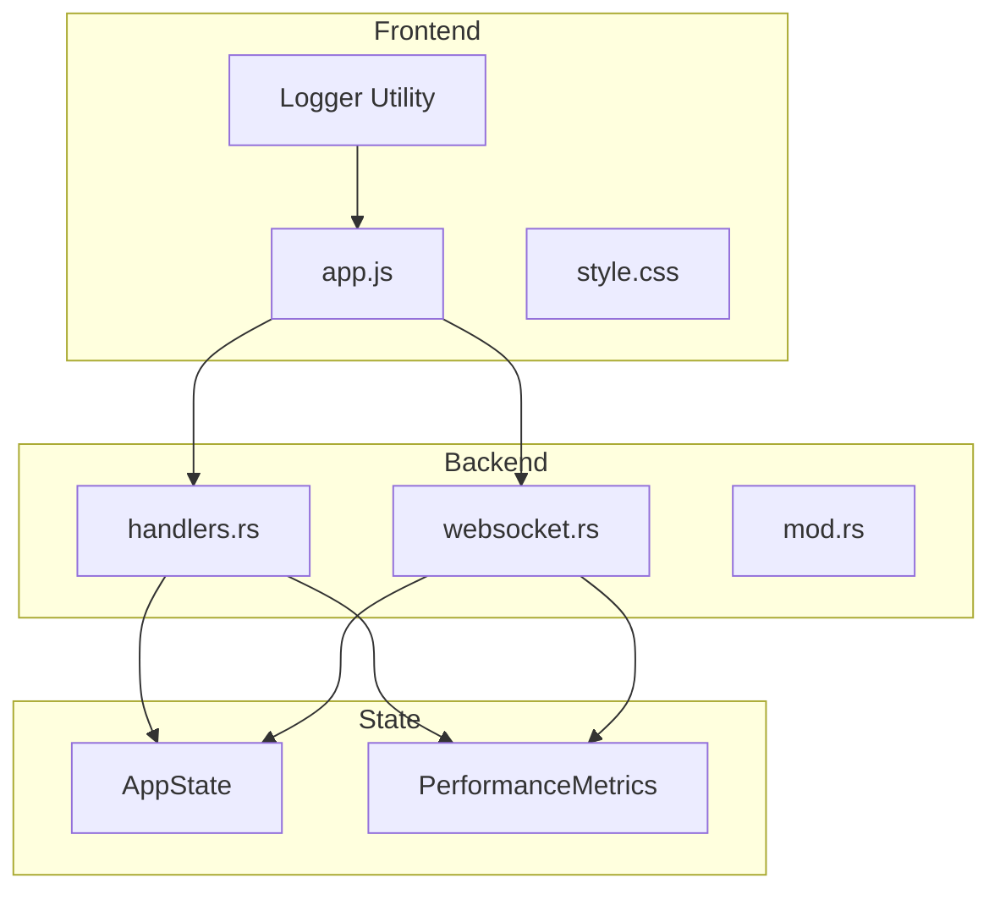
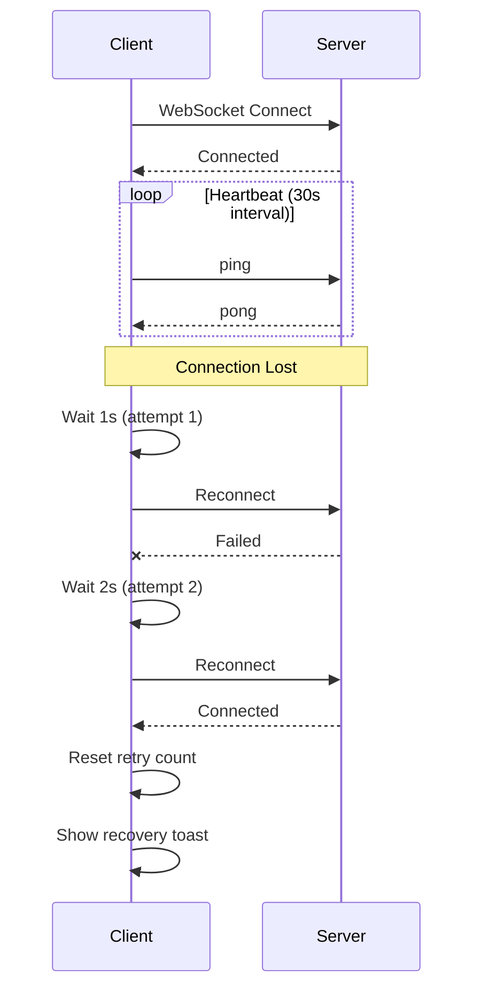
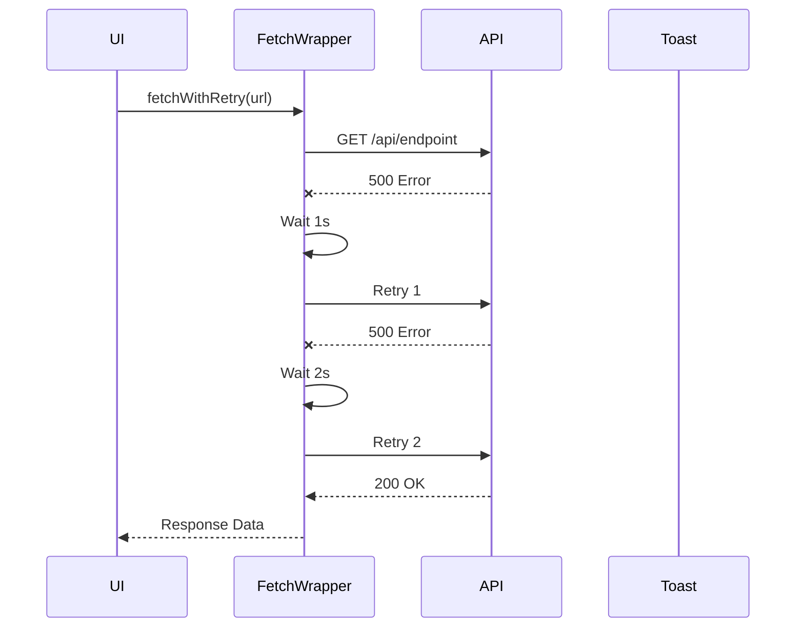

# Technical Design: Frictional Bank Web App Polish

## Overview

**Purpose**: Frictional Bank Web Dashboardの品質向上を実現し、本番運用に適した安定性・保守性・アクセシビリティを提供する。

**Users**: 運用担当者、トレーダー、開発者、DevOps担当者、セキュリティ担当者、品質保証担当者、視覚障害を持つユーザー

**Impact**: 既存のデモダッシュボードを本番グレードの品質に引き上げ、デバッグログ制御、エラーハンドリング強化、アクセシビリティ改善を実現する。

### Goals

- デバッグログの本番環境対応と構造化ログ基盤の確立
- 未実装機能（Zoom）の完成とWebSocket安定性の強化
- エラーハンドリング・ローディング状態の改善によるUX向上
- WCAG 2.1 AA準拠のアクセシビリティ確保
- テストカバレッジ80%以上の達成

### Non-Goals

- app.jsの完全モジュール分割（将来課題）
- 外部監視システム（Prometheus/Grafana）統合
- E2Eテストフレームワーク導入
- パフォーマンスの大幅最適化（現状維持）

---

## Architecture

### Existing Architecture Analysis

**現行アーキテクチャ**:
- **Backend**: Axum WebサーバーがREST API（`/api/*`）とWebSocket（`/api/ws`）を提供
- **Frontend**: 単一`app.js`（350KB+）がすべてのUI/ロジックを担当
- **State Management**: グローバル`state`オブジェクトで状態管理

**既存パターン**:
- 環境変数: `FB_*`プレフィックス（`FB_CORS_ORIGINS`、`FB_CSP`）
- Toast通知: `showToast(type, title, message, duration)`
- Dialog管理: `openDialog()`/`closeDialog()`with focus trap
- WebSocket: broadcast channel経由のリアルタイム更新

**制約**:
- app.jsの肥大化回避（新規大規模機能は別ファイル検討）
- vendorディレクトリ: ローカルライブラリのみ（CDN禁止）
- CSP: `script-src 'self'`維持

### Architecture Pattern & Boundary Map



**Architecture Integration**:
- Selected pattern: Hybrid（新規ユーティリティ＋既存拡張）
- Domain boundaries: Frontend（logger.js）/ Backend（metrics.rs拡張）/ Shared（state管理）
- Existing patterns preserved: FB_*環境変数、Toast API、Dialog focus trap
- New components rationale: Logger分離により責務明確化、テスト容易性向上
- Steering compliance: Demo Layerパターン維持、A-I-P-S非依存

### Technology Stack

| Layer | Choice / Version | Role in Feature | Notes |
|-------|------------------|-----------------|-------|
| Frontend | JavaScript ES6+ | Logger utility, UI enhancements | 新規`logger.js`追加 |
| Frontend | Chart.js (既存) | Exposure Chart zoom | scale操作で実装 |
| Frontend | D3.js (既存) | Graph zoom（実装済み） | 変更なし |
| Backend | Axum 0.7 | REST API `/api/metrics` | 新規endpoint追加 |
| Backend | tokio-tungstenite | WebSocket ping/pong | 既存、クライアント側強化 |
| Testing | cargo-tarpaulin | Coverage measurement | 新規導入 |

---

## System Flows

### WebSocket Reconnection Flow



**Key Decisions**:
- Exponential backoff: 1s→2s→4s→8s→16s→30s（max）
- 最大試行回数: 10回、超過時は手動介入要求
- Heartbeat: 30秒間隔、10秒タイムアウト

### API Error Handling Flow



---

## Requirements Traceability

| Requirement | Summary | Components | Interfaces | Flows |
|-------------|---------|------------|------------|-------|
| 1.1-1.5 | デバッグログ本番対応 | Logger, ConfigManager | LoggerService | - |
| 2.1-2.6 | Zoom機能完成 | ExposureChartZoom | ZoomController | - |
| 3.1-3.7 | エラーハンドリング | ToastManager, FetchWrapper | ToastService, RetryService | API Error Flow |
| 4.1-4.6 | WebSocket安定性 | WebSocketManager | ReconnectService | Reconnection Flow |
| 5.1-5.6 | ローディング状態 | SkeletonLoader | LoadingStateService | - |
| 6.1-6.5 | レスポンシブデザイン | ResponsiveManager | - | - |
| 7.1-7.6 | キーボードナビゲーション | KeyboardManager | FocusService | - |
| 8.1-8.5 | 構造化ログ | Logger | LoggerService | - |
| 9.1-9.5 | パフォーマンス監視 | PerformanceMonitor, MetricsHandler | MetricsAPI | - |
| 10.1-10.5 | CSP最適化 | CSPManager | - | - |
| 11.1-11.5 | テストカバレッジ | TestSuite | - | - |
| 12.1-12.6 | アクセシビリティ | A11yManager | - | - |
| 13.1-13.6 | テーマ安定化 | ThemeManager | - | - |

---

## Components and Interfaces

| Component | Domain/Layer | Intent | Req Coverage | Key Dependencies | Contracts |
|-----------|--------------|--------|--------------|------------------|-----------|
| Logger | Frontend/Utility | 構造化ログ出力 | 1, 8 | ConfigManager (P0) | Service |
| ConfigManager | Frontend/Utility | 環境変数管理 | 1, 8 | - | State |
| WebSocketManager | Frontend/Network | WS接続管理 | 4 | Logger (P1), state (P0) | Service, State |
| ToastManager | Frontend/UI | 通知表示 | 3 | - | Service |
| FetchWrapper | Frontend/Network | API通信 | 3, 9 | Logger (P1), ToastManager (P1) | Service |
| ExposureChartZoom | Frontend/UI | チャートズーム | 2 | Chart.js (P0) | Service |
| SkeletonLoader | Frontend/UI | ローディング表示 | 5 | state (P0) | State |
| MetricsHandler | Backend/API | メトリクス提供 | 9 | AppState (P0) | API |
| PerformanceMetrics | Backend/State | メトリクス保持 | 9 | - | State |

### Frontend / Utility

#### Logger

| Field | Detail |
|-------|--------|
| Intent | 構造化ログ出力とデバッグモード制御 |
| Requirements | 1.1, 1.2, 1.3, 1.4, 1.5, 8.1, 8.2, 8.3, 8.4, 8.5 |

**Responsibilities & Constraints**:
- 集中化されたログ出力インターフェース提供
- ログレベル（DEBUG/INFO/WARN/ERROR）によるフィルタリング
- コンポーネント名prefix自動付与
- 本番環境でのデバッグログ抑制

**Dependencies**:
- Inbound: AppJS modules — ログ出力 (P0)
- External: ConfigManager — FB_DEBUG_MODE, FB_LOG_LEVEL取得 (P0)

**Contracts**: Service [x] / State [x]

##### Service Interface

```typescript
interface LoggerService {
  debug(component: string, message: string, data?: Record<string, unknown>): void;
  info(component: string, message: string, data?: Record<string, unknown>): void;
  warn(component: string, message: string, data?: Record<string, unknown>): void;
  error(component: string, message: string, data?: Record<string, unknown>): void;
  setLevel(level: LogLevel): void;
  isDebugEnabled(): boolean;
}

type LogLevel = 'DEBUG' | 'INFO' | 'WARN' | 'ERROR';
```

- Preconditions: ConfigManager初期化済み
- Postconditions: ログレベル以上のログがconsoleに出力
- Invariants: タイムスタンプ、コンポーネント名が常に含まれる

##### State Management

```typescript
interface LoggerState {
  level: LogLevel;
  debugEnabled: boolean;
}
```

- State model: シングルトン、window.FB_Logger経由でアクセス
- Persistence: なし（セッション内のみ）
- Concurrency strategy: 単一スレッド（JS）

**Implementation Notes**:
- Integration: app.js冒頭でlogger.js読み込み、既存console.log置換
- Validation: FB_LOG_LEVEL値の妥当性チェック（不正値はINFOにフォールバック）
- Risks: 既存console.log置換漏れ、パフォーマンス影響（最小限）

---

#### ConfigManager

| Field | Detail |
|-------|--------|
| Intent | 環境変数・設定値の集中管理 |
| Requirements | 1.1, 8.5 |

**Responsibilities & Constraints**:
- FB_DEBUG_MODE、FB_LOG_LEVEL環境変数の取得
- HTMLテンプレート経由で注入された設定の解析
- デフォルト値の提供

**Dependencies**:
- External: HTML data attributes / inline script — 設定注入 (P0)

**Contracts**: State [x]

##### State Management

```typescript
interface ConfigState {
  debugMode: boolean;
  logLevel: LogLevel;
  initialized: boolean;
}
```

- Persistence: HTML埋め込み経由（サーバー側環境変数→HTML→JS）
- Concurrency strategy: 初期化時のみ書き込み、以降読み取り専用

**Implementation Notes**:
- Integration: `<script>` タグ内でwindow.__FB_CONFIG__として注入
- Validation: 未設定時のデフォルト（debugMode: false, logLevel: 'INFO'）

---

### Frontend / Network

#### WebSocketManager

| Field | Detail |
|-------|--------|
| Intent | WebSocket接続の安定管理と再接続制御 |
| Requirements | 4.1, 4.2, 4.3, 4.4, 4.5, 4.6 |

**Responsibilities & Constraints**:
- Exponential backoff再接続（1s→2s→4s→8s→16s→30s max）
- Heartbeat ping送信（30秒間隔）
- 接続状態UI更新
- 最大試行回数制限（10回）

**Dependencies**:
- Inbound: AppJS — メッセージ受信ハンドラ (P0)
- Outbound: Logger — 接続状態ログ (P1)
- External: state.ws — WebSocket instance (P0)

**Contracts**: Service [x] / State [x]

##### Service Interface

```typescript
interface WebSocketService {
  connect(): void;
  disconnect(): void;
  send(message: string): void;
  getState(): WebSocketState;
  resetRetryCount(): void;
}

type WebSocketState = 'connecting' | 'connected' | 'disconnected' | 'reconnecting' | 'failed';
```

- Preconditions: API_BASE定義済み
- Postconditions: 接続成功時state.ws設定、UI更新
- Invariants: 再接続試行中は重複接続しない

##### State Management

```typescript
interface WebSocketManagerState {
  connectionState: WebSocketState;
  retryCount: number;
  retryDelay: number;
  lastPingTime: number | null;
  heartbeatTimer: number | null;
}
```

- Persistence: メモリ内のみ
- Concurrency strategy: タイマーベース非同期処理

**Implementation Notes**:
- Integration: 既存connectWebSocket関数を拡張
- Validation: ping応答タイムアウト（10秒）で接続断定
- Risks: ネットワーク状態判定の誤検出

---

#### FetchWrapper

| Field | Detail |
|-------|--------|
| Intent | API通信のエラーハンドリングとリトライ制御 |
| Requirements | 3.1, 3.2, 3.3, 3.4, 3.5, 3.6, 9.1, 9.3 |

**Responsibilities & Constraints**:
- ネットワークエラー/HTTP 5xx/4xxの分類処理
- Exponential backoffリトライ（最大3回）
- 日本語エラーメッセージ表示
- API応答時間計測

**Dependencies**:
- Outbound: ToastManager — エラー通知 (P1)
- Outbound: Logger — 通信ログ (P1)
- Outbound: PerformanceMonitor — タイミング記録 (P2)

**Contracts**: Service [x]

##### Service Interface

```typescript
interface FetchService {
  fetchWithRetry<T>(
    url: string,
    options?: RequestInit,
    config?: FetchConfig
  ): Promise<T>;
}

interface FetchConfig {
  maxRetries?: number;        // default: 3
  retryDelay?: number;        // default: 1000ms
  timeout?: number;           // default: 30000ms
  showToast?: boolean;        // default: true
  onRetry?: (attempt: number) => void;
}
```

- Preconditions: ネットワーク利用可能
- Postconditions: 成功時JSONパース済みデータ返却、失敗時例外スロー
- Invariants: リトライ中は同一リクエスト重複しない

**Implementation Notes**:
- Integration: 既存fetchJson関数を拡張
- Validation: HTTP status codeによるエラー分類
- Risks: リトライによるサーバー負荷

---

### Frontend / UI

#### ToastManager

| Field | Detail |
|-------|--------|
| Intent | 通知表示とリトライアクション提供 |
| Requirements | 3.1, 3.2, 3.3, 3.4, 4.4 |

**Responsibilities & Constraints**:
- エラー種別に応じた日本語メッセージ表示
- リトライボタン付きToast表示
- ローディングインジケーター表示

**Dependencies**:
- External: #toast-container DOM — Toast表示先 (P0)

**Contracts**: Service [x]

##### Service Interface

```typescript
interface ToastService {
  showToast(config: ToastConfig): ToastInstance;
  showError(error: ApiError, onRetry?: () => void): ToastInstance;
  showSuccess(message: string): ToastInstance;
  showReconnected(): ToastInstance;
}

interface ToastConfig {
  type: 'success' | 'error' | 'warning' | 'info';
  title: string;
  message: string;
  duration?: number;
  action?: {
    label: string;
    onClick: () => void;
  };
  showLoading?: boolean;
}

interface ToastInstance {
  dismiss(): void;
  setLoading(loading: boolean): void;
}
```

- Preconditions: #toast-container DOM存在
- Postconditions: Toast DOM追加、duration後自動削除
- Invariants: 同時表示Toast数制限なし

**Implementation Notes**:
- Integration: 既存showToast関数を拡張、action parameterを追加
- Validation: duration最小値（1000ms）
- Risks: Toast過多によるUI混雑

---

#### ExposureChartZoom

| Field | Detail |
|-------|--------|
| Intent | Exposure Chartのズーム操作制御 |
| Requirements | 2.1, 2.2, 2.3, 2.4, 2.5, 2.6 |

**Responsibilities & Constraints**:
- ズームイン/アウト（20%ステップ）
- リセット（100%、中央位置）
- ズーム範囲制限（50%-200%）
- ズームインジケーター更新

**Dependencies**:
- External: state.charts.exposure — Chart.js instance (P0)
- External: #zoom-in, #zoom-out, #zoom-reset DOM — 操作ボタン (P0)

**Contracts**: Service [x]

##### Service Interface

```typescript
interface ZoomController {
  zoomIn(): void;
  zoomOut(): void;
  reset(): void;
  getZoomLevel(): number;
  setZoomLevel(level: number): void;
}
```

- Preconditions: Chart.jsインスタンス初期化済み
- Postconditions: チャートスケール更新、インジケーター更新
- Invariants: ズームレベルは0.5-2.0範囲内

**Implementation Notes**:
- Integration: 既存initZoomControls関数を実装
- Validation: ズーム範囲境界チェック
- Risks: Chart.jsバージョン互換性

---

#### SkeletonLoader

| Field | Detail |
|-------|--------|
| Intent | データ読み込み中のスケルトン表示制御 |
| Requirements | 5.1, 5.2, 5.3, 5.4, 5.5, 5.6 |

**Responsibilities & Constraints**:
- パネル別スケルトンDOM表示/非表示
- 3秒タイムアウト時メッセージ表示
- スムーズなコンテンツ遷移

**Dependencies**:
- External: DOM elements — スケルトン表示先 (P0)
- External: state — ローディング状態 (P0)

**Contracts**: State [x]

##### State Management

```typescript
interface LoadingState {
  portfolio: boolean;
  risk: boolean;
  exposure: boolean;
  timeout: boolean;
}
```

- Persistence: メモリ内のみ
- Concurrency strategy: 状態変更時DOM同期更新

**Implementation Notes**:
- Integration: 各fetchXxx関数の前後でstate更新
- Validation: タイムアウト検出（3秒）
- Risks: 状態不整合（ローディング解除漏れ）

---

### Backend / API

#### MetricsHandler

| Field | Detail |
|-------|--------|
| Intent | パフォーマンスメトリクスのAPI提供 |
| Requirements | 9.4, 9.5 |

**Responsibilities & Constraints**:
- `/api/metrics` endpoint提供
- API応答時間統計提供
- WebSocket接続数提供

**Dependencies**:
- Inbound: Router — HTTP GET /api/metrics (P0)
- External: AppState — メトリクス状態 (P0)

**Contracts**: API [x]

##### API Contract

| Method | Endpoint | Request | Response | Errors |
|--------|----------|---------|----------|--------|
| GET | /api/metrics | - | MetricsResponse | 500 |

```rust
#[derive(Serialize)]
pub struct MetricsResponse {
    pub api_response_times: ApiResponseTimes,
    pub websocket_connections: u32,
    pub websocket_message_latency_ms: f64,
    pub uptime_seconds: u64,
}

#[derive(Serialize)]
pub struct ApiResponseTimes {
    pub portfolio_avg_ms: f64,
    pub exposure_avg_ms: f64,
    pub risk_avg_ms: f64,
    pub graph_avg_ms: f64,
}
```

**Implementation Notes**:
- Integration: handlers.rsに追加、build_routerに登録
- Validation: メトリクス未収集時はデフォルト値
- Risks: メトリクス収集オーバーヘッド（最小限）

---

### Backend / State

#### PerformanceMetrics

| Field | Detail |
|-------|--------|
| Intent | パフォーマンスメトリクスの状態保持 |
| Requirements | 9.1, 9.2, 9.3, 9.5 |

**Responsibilities & Constraints**:
- API応答時間の累積記録
- WebSocket接続数追跡
- 1秒超過時の警告ログ出力

**Dependencies**:
- Inbound: Handlers — タイミング記録 (P0)
- Inbound: WebSocket — 接続追跡 (P0)

**Contracts**: State [x]

##### State Management

```rust
pub struct PerformanceMetrics {
    pub portfolio_times: RwLock<Vec<u64>>,
    pub exposure_times: RwLock<Vec<u64>>,
    pub risk_times: RwLock<Vec<u64>>,
    pub graph_times: RwLock<Vec<u64>>,
    pub ws_connections: AtomicU32,
    pub ws_message_latencies: RwLock<Vec<u64>>,
    pub start_time: Instant,
}
```

- Persistence: メモリ内のみ（再起動でリセット）
- Concurrency strategy: RwLockで読み書き分離、AtomicU32で接続数

**Implementation Notes**:
- Integration: AppStateにフィールド追加
- Validation: 配列サイズ制限（直近1000件）
- Risks: メモリ使用量増加（制限付き）

---

## Data Models

### Domain Model

**Frontend State拡張**:

```typescript
// 既存stateオブジェクトへの追加
interface ExtendedState {
  // 既存フィールド...

  // 新規: WebSocket管理
  wsManager: {
    connectionState: WebSocketState;
    retryCount: number;
    retryDelay: number;
    lastPingTime: number | null;
    heartbeatTimer: number | null;
  };

  // 新規: ローディング状態
  loading: {
    portfolio: boolean;
    risk: boolean;
    exposure: boolean;
    timeout: boolean;
  };
}
```

### Logical Data Model

**Backend AppState拡張**:

```rust
pub struct AppState {
    // 既存フィールド
    pub tx: broadcast::Sender<String>,
    pub graph_cache: RwLock<GraphCache>,
    pub graph_subscriptions: RwLock<HashSet<String>>,

    // 新規: パフォーマンスメトリクス
    pub metrics: PerformanceMetrics,
}
```

---

## Error Handling

### Error Strategy

- **User Errors (4xx)**: コンテキスト適切な日本語メッセージ表示
- **System Errors (5xx)**: "サーバーエラー: しばらく経ってから再試行してください"
- **Network Errors**: "ネットワークエラー: サーバーに接続できません" + リトライボタン

### Error Categories and Responses

| Error Type | HTTP Status | Japanese Message | Action |
|------------|-------------|------------------|--------|
| Network Error | - | ネットワークエラー: サーバーに接続できません | リトライボタン |
| Server Error | 5xx | サーバーエラー: しばらく経ってから再試行してください | リトライボタン |
| Not Found | 404 | データが見つかりません | - |
| Bad Request | 400 | リクエストが不正です | - |
| Unauthorized | 401 | 認証が必要です | - |

### Monitoring

- Logger.warn() でエラー詳細ログ出力
- CSP違反は専用listenerでWARNログ出力
- API応答1秒超過時にPerformanceMonitorでWARN出力

---

## Testing Strategy

### Unit Tests (Rust Backend)

- `handlers::get_metrics` - メトリクスJSON応答
- `handlers::*` - 既存handler拡張部分
- `websocket::handle_ping` - ping/pong処理
- `AppState::metrics` - メトリクス記録/取得
- `PerformanceMetrics::record_*` - 各メトリクス記録

### Integration Tests (Rust Backend)

- API-WebSocket連携: `/api/metrics`がWS接続数を正しく反映
- エラーパス: 不正リクエストに対する適切なレスポンス
- 負荷テスト: 複数同時接続時のメトリクス整合性

### Frontend Tests (Manual/E2E候補)

- Logger: ログレベルフィルタリング
- WebSocket: 再接続シーケンス（ネットワーク切断シミュレーション）
- Toast: リトライボタン動作
- Zoom: 範囲制限遵守

### Coverage Target

- `demo/gui/src/web/`: 80%以上（cargo-tarpaulin計測）

---

## Optional Sections

### Security Considerations

**CSP強化** (Req 10):
- `script-src 'self'`維持（vendor/ディレクトリのみ）
- 将来的にnonce導入検討（inline script排除後）
- CSP violation report-uri設定

**ログセキュリティ** (Req 1):
- 本番環境でAPI応答・内部状態をログ出力しない
- FB_DEBUG_MODE=true時のみ詳細ログ許可

### Performance & Scalability

**フロントエンド**:
- Logger: 同期console出力、オーバーヘッド最小
- WebSocket heartbeat: 30秒間隔で負荷軽減

**バックエンド**:
- メトリクス記録: 直近1000件制限でメモリ上限設定
- 統計計算: 読み取り時にオンデマンド計算

### Accessibility (Req 12)

- ARIA labels: 全インタラクティブ要素に付与
- ARIA live regions: Toast通知、接続状態表示
- Color contrast: 4.5:1以上確保
- Reduce motion: `prefers-reduced-motion`対応済み
- Table headers: `<th scope="col">`/`<th scope="row">`適用

---

## Supporting References

### エラーメッセージマッピング

| Error Code | English (Current) | Japanese (New) |
|------------|-------------------|----------------|
| NETWORK | "Network error" | "ネットワークエラー: サーバーに接続できません" |
| SERVER_5XX | "Server error" | "サーバーエラー: しばらく経ってから再試行してください" |
| NOT_FOUND | "Not found" | "データが見つかりません" |
| TIMEOUT | "Request timeout" | "リクエストがタイムアウトしました" |
| WS_DISCONNECTED | "Disconnected" | "オフライン" |
| WS_RECONNECTED | "Reconnected" | "接続が復旧しました" |
| LOADING_SLOW | - | "読み込みに時間がかかっています..." |

### ファイル変更一覧

| File | Change Type | Description |
|------|-------------|-------------|
| `demo/gui/static/logger.js` | 新規 | Logger utility |
| `demo/gui/static/app.js` | 修正 | console.log置換、WebSocket強化、Toast拡張、Zoom実装 |
| `demo/gui/static/style.css` | 修正 | スケルトンDOM用スタイル追加 |
| `demo/gui/static/index.html` | 修正 | スケルトンDOM追加、logger.js読み込み、Config注入 |
| `demo/gui/src/web/mod.rs` | 修正 | AppState拡張、/api/metrics route追加 |
| `demo/gui/src/web/handlers.rs` | 修正 | get_metrics handler追加、タイミング計測 |
| `demo/gui/src/web/websocket.rs` | 修正 | ping/pong強化（既存対応済み、確認のみ） |
