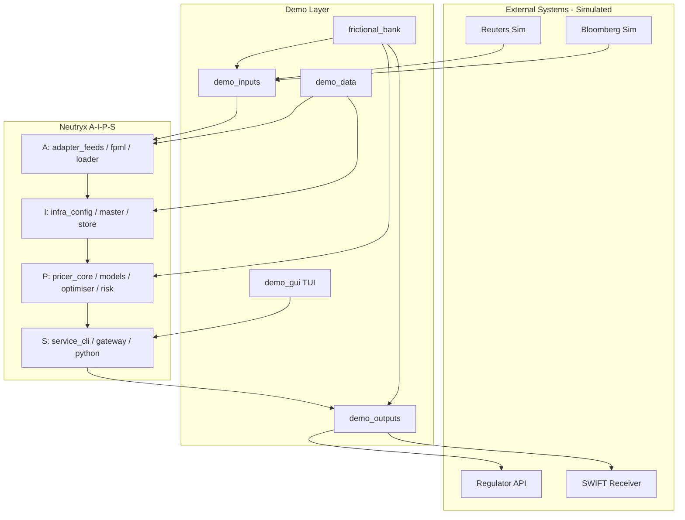
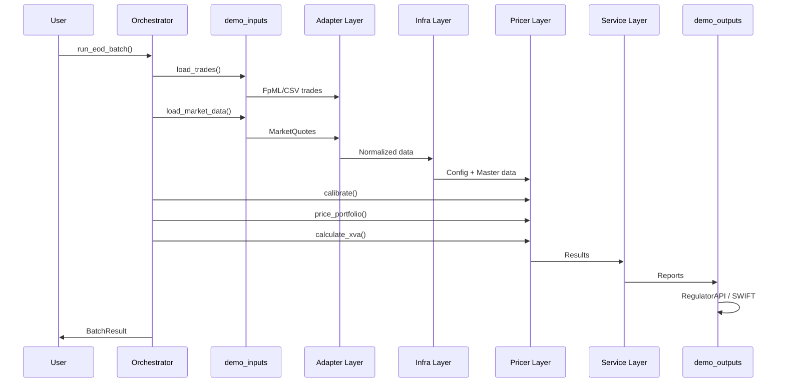
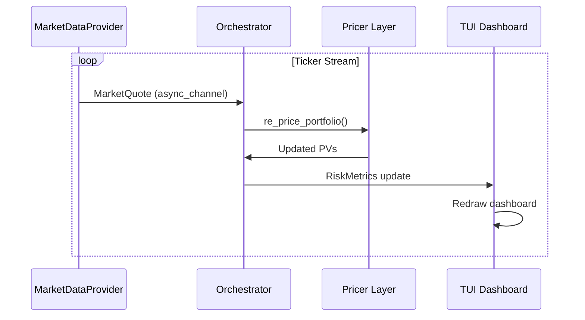
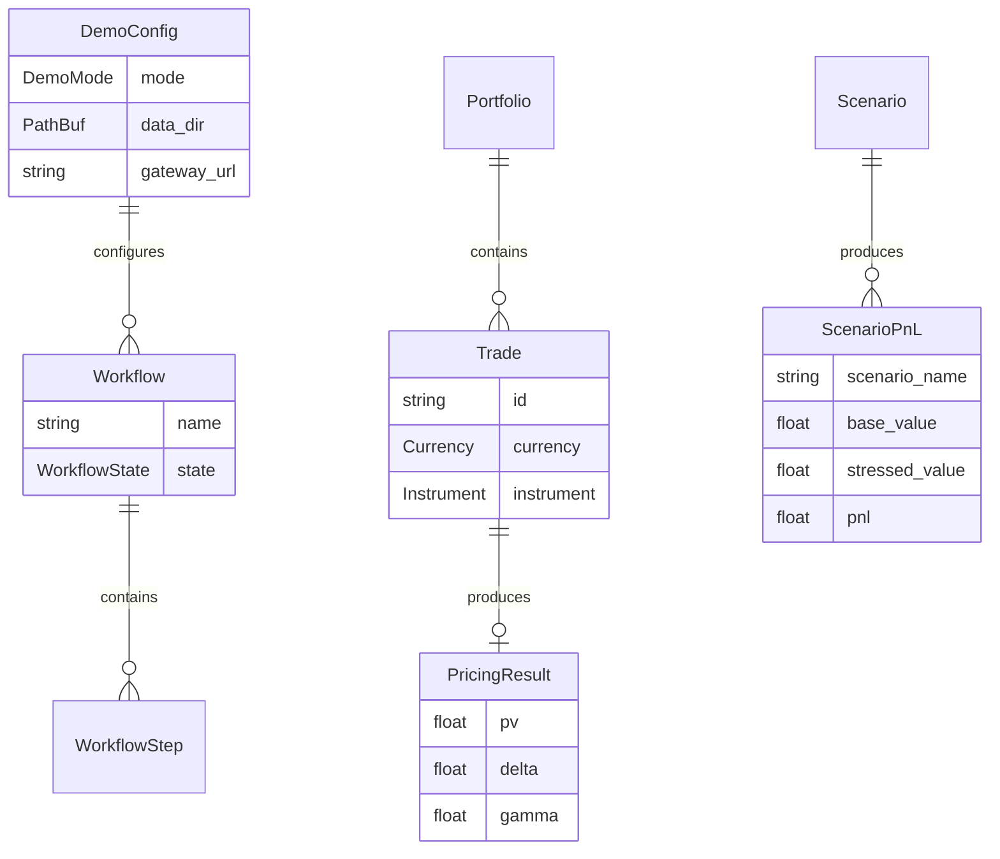

# Technical Design: FrictionalBank Demo System

## Overview

**Purpose**: FrictionalBankは、Neutryxライブラリの全機能を統合的にデモンストレーションする仮想銀行システムを提供する。A-I-P-Sアーキテクチャの正しいデータフローを実演し、開発者・エンドユーザー向けの参照実装として機能する。

**Users**:
- デモ実行者: EODバッチ、イントラデイ、ストレステストシナリオを実行
- クオンツアナリスト: Jupyterノートブックでインタラクティブ分析
- アーキテクト: A-I-P-Sデータフロー準拠の検証

**Impact**: 既存demo/inputs、demo/outputsをworkspaceに統合し、新規demo/frictional_bank、demo/gui、demo/data、demo/notebooksを追加。

### Goals
- Neutryxの全機能（プライシング、キャリブレーション、リスク計算、XVA）を統合デモ
- A-I-P-Sアーキテクチャの正しいデータフローを実演
- 3つのデモシナリオ（EODバッチ、イントラデイ、ストレステスト）を実行可能に
- ratatuiベースのターミナルダッシュボードでリアルタイム監視

### Non-Goals
- 本番環境での使用（デモ/教育目的のみ）
- pricer_pricing/Enzyme依存（frictional_bankはpricer_pricing除外）
- Webダッシュボード（Phase 7、オプション）
- 実際の外部システム接続（モックのみ）

---

## Architecture

### Existing Architecture Analysis

**既存コンポーネント（活用）**:
- `demo/inputs/`: MarketDataProvider trait、BloombergSim、ReutersSim、SyntheticGenerator
- `demo/outputs/`: ReportSink trait、RegulatorApi、SwiftReceiver、WebSocketSink
- `pricer_risk::demo`: DemoTrade、run_portfolio_pricing（Pull-then-Push）
- `pricer_risk::scenarios`: ScenarioEngine、PresetScenario

**既存パターン**:
- async_channel経由のストリーム配信
- tokioランタイム
- trait-based抽象化（MarketDataProvider、ReportSink）

**制約**:
- workspace.membersにdemo/未登録
- service_gatewayはpricer_pricingに非依存（プレースホルダー実装）

### Architecture Pattern & Boundary Map



**Architecture Integration**:
- **Selected pattern**: Event-driven + Layered Hybrid（EODはシーケンシャル、イントラデイはイベント駆動）
- **Domain boundaries**: Demo層はA-I-P-S層の外側に位置し、Adapter入力とService出力のみと接続
- **Existing patterns preserved**: MarketDataProvider trait、ReportSink trait、Pull-then-Push
- **New components rationale**:
  - frictional_bank: ワークフロー統合オーケストレーター
  - demo_gui: ユーザーインターフェース（TUI）
  - demo_data: サンプルデータセット
- **Steering compliance**: A-I-P-Sデータフロー厳守、demo層の独立性維持

### Technology Stack

| Layer | Choice / Version | Role in Feature | Notes |
|-------|------------------|-----------------|-------|
| TUI Framework | ratatui 0.29 + crossterm 0.28 | ターミナルダッシュボード | イミディエイトモードレンダリング |
| Async Runtime | tokio 1.42 | 非同期ワークフロー実行 | workspace既存 |
| Channels | async-channel 2.3 | コンポーネント間通信 | demo/inputs既存 |
| HTTP Client | reqwest 0.12 | TUI→service_gateway通信 | REST API呼び出し |
| Serialization | serde + serde_json | データシリアライズ | workspace既存 |
| Configuration | toml 0.8 | demo_config.toml読込 | workspace既存 |

---

## System Flows

### EODバッチ処理フロー



**Key Decisions**:
- 処理順序はA-I-P-S厳守
- 各ステップで進捗コールバック発火
- エラー発生時はログ記録後続行（非致命的）

### リアルタイムイントラデイフロー



---

## Requirements Traceability

| Requirement | Summary | Components | Interfaces | Flows |
|-------------|---------|------------|------------|-------|
| 1.1-1.7 | サンプルデータ | DemoData | FileLoader | - |
| 2.1-2.4 | マーケットデータプロバイダー | BloombergSim, ReutersSim | MarketDataProvider | Intraday |
| 2.5-2.7 | 取引データソース | FpmlGenerator, FrontOffice | TradeSource | EOD |
| 2.8-2.9 | ファイルソース | CsvGenerator | FileGenerator | EOD |
| 3.1-3.3 | 規制当局システム | RegulatorApi, AuditStore | - | EOD |
| 3.4-3.6 | 決済システム | SwiftReceiver, NettingEngine | - | EOD |
| 3.7-3.9 | リスクダッシュボード | WebSocketSink, MetricsStore | - | Intraday |
| 3.10-3.11 | レポート出力 | FileWriter, EmailSender | ReportSink | EOD |
| 4.1-4.4 | EODバッチ | EodBatchWorkflow | DemoWorkflow | EOD |
| 4.5-4.7 | イントラデイ | IntradayWorkflow | DemoWorkflow | Intraday |
| 4.8-4.9 | ストレステスト | StressTestWorkflow | DemoWorkflow | StressTest |
| 4.10-4.11 | デモ設定 | DemoConfig | - | - |
| 5.1-5.8 | ターミナルUI | TuiApp | App, Screen | - |
| 6.1-6.7 | Jupyter連携 | Notebooks | service_python | - |
| 7.1-7.5 | A-I-P-Sフロー | All | - | All |
| 9.1-9.8 | 非機能要件 | All | - | - |

---

## Components and Interfaces

### Summary Table

| Component | Domain/Layer | Intent | Req Coverage | Key Dependencies | Contracts |
|-----------|--------------|--------|--------------|------------------|-----------|
| DemoData | demo/data | サンプルデータ提供 | 1.1-1.7 | - | - |
| EodBatchWorkflow | frictional_bank/orchestrator | EODバッチ実行 | 4.1-4.4 | demo_inputs (P0), pricer_risk (P0) | Service |
| IntradayWorkflow | frictional_bank/orchestrator | リアルタイム処理 | 4.5-4.7 | MarketDataProvider (P0) | Service, Event |
| StressTestWorkflow | frictional_bank/orchestrator | ストレステスト | 4.8-4.9 | ScenarioEngine (P0) | Service |
| DemoConfig | frictional_bank/config | 設定管理 | 4.10-4.11 | toml (P1) | - |
| TuiApp | demo_gui/tui | ターミナルダッシュボード | 5.1-5.8 | ratatui (P0), reqwest (P1) | State |
| Notebooks | demo/notebooks | Jupyter連携 | 6.1-6.7 | service_python (P0) | - |

---

### Demo Layer

#### DemoData

| Field | Detail |
|-------|--------|
| Intent | サンプルデータファイルを提供 |
| Requirements | 1.1-1.7 |

**Responsibilities & Constraints**
- 取引、マーケットデータ、設定、カレンダーのサンプルファイル提供
- CSV/JSON/XML形式で人間可読
- adapter_loader互換フォーマット

**Structure**:
```text
demo/data/
├── input/
│   ├── trades/
│   │   ├── equity_book.csv
│   │   ├── rates_book.csv
│   │   ├── fx_book.csv
│   │   └── sample_irs.xml
│   ├── market_data/
│   │   ├── yield_curves/usd_ois.csv
│   │   ├── volatility/equity_vol.csv
│   │   └── credit_spreads/spreads.csv
│   └── counterparties/
│       ├── counterparties.csv
│       └── netting_sets.csv
├── config/
│   ├── neutryx.toml
│   ├── demo_config.toml
│   └── calendars/holidays_2026.csv
└── output/
    └── .gitkeep
```

---

### Orchestrator Layer

#### EodBatchWorkflow

| Field | Detail |
|-------|--------|
| Intent | EODバッチワークフローを実行 |
| Requirements | 4.1-4.4 |

**Responsibilities & Constraints**
- A-I-P-S順序でシーケンシャル処理実行
- 進捗コールバック発火
- エラー発生時はログ記録後続行

**Dependencies**
- Inbound: DemoConfig — 設定読込 (P1)
- Outbound: demo_inputs — 取引/マーケットデータ取得 (P0)
- Outbound: pricer_risk::demo — ポートフォリオプライシング (P0)
- Outbound: demo_outputs — レポート送信 (P0)

**Contracts**: Service [x]

##### Service Interface
```rust
/// デモワークフロー共通trait
pub trait DemoWorkflow: Send + Sync {
    /// ワークフロー名
    fn name(&self) -> &str;

    /// ワークフロー実行
    async fn run(&self, config: &DemoConfig, progress: ProgressCallback) -> WorkflowResult;

    /// キャンセル
    async fn cancel(&self);
}

/// 進捗コールバック型
pub type ProgressCallback = Box<dyn Fn(WorkflowStep, f64) + Send + Sync>;

/// ワークフローステップ
pub enum WorkflowStep {
    LoadingTrades,
    LoadingMarketData,
    Calibrating,
    Pricing,
    CalculatingXva,
    GeneratingReports,
    SendingOutputs,
    Completed,
}

/// ワークフロー結果
pub struct WorkflowResult {
    pub success: bool,
    pub duration_ms: u64,
    pub trades_processed: usize,
    pub errors: Vec<String>,
}
```

**Implementation Notes**
- Integration: demo_inputs::preludeからTradeSource、MarketDataProvider使用
- Validation: 取引データの必須フィールド検証
- Risks: pricer_risk::demo依存、Enzyme不要を維持

---

#### IntradayWorkflow

| Field | Detail |
|-------|--------|
| Intent | リアルタイムティッカー処理 |
| Requirements | 4.5-4.7 |

**Responsibilities & Constraints**
- MarketDataProviderストリーム購読
- ティッカー受信時にポートフォリオ再評価
- リスクメトリクス更新をTUIに通知

**Dependencies**
- Inbound: MarketDataProvider — ティッカーストリーム (P0)
- Outbound: risk_dashboard — メトリクス送信 (P1)

**Contracts**: Service [x] / Event [x]

##### Event Contract
- **Published events**: RiskMetricsUpdated { portfolio_pv, delta, gamma, vega, timestamp }
- **Subscribed events**: MarketQuote (async_channel Receiver)
- **Delivery guarantees**: Best-effort、順序保証なし

---

#### StressTestWorkflow

| Field | Detail |
|-------|--------|
| Intent | シナリオベースストレステスト実行 |
| Requirements | 4.8-4.9 |

**Responsibilities & Constraints**
- pricer_risk::scenarios::ScenarioEngine活用
- PresetScenario選択可能
- シナリオ別P&L計算

**Dependencies**
- Outbound: ScenarioEngine — シナリオ実行 (P0)
- Outbound: PresetScenario — 定義済みシナリオ (P1)

**Contracts**: Service [x]

##### Service Interface
```rust
impl StressTestWorkflow {
    /// プリセットシナリオでストレステスト実行
    pub async fn run_preset(
        &self,
        presets: Vec<PresetScenarioType>,
        config: &DemoConfig,
        progress: ProgressCallback,
    ) -> StressTestResult;
}

pub enum PresetScenarioType {
    InterestRateUp100bp,
    InterestRateDown100bp,
    VolatilityUp20Pct,
    CreditEventDefault,
}

pub struct StressTestResult {
    pub scenario_results: Vec<ScenarioResult<f64>>,
    pub worst_case_pnl: f64,
}
```

---

#### DemoConfig

| Field | Detail |
|-------|--------|
| Intent | デモ設定の読込・管理 |
| Requirements | 4.10-4.11 |

**Responsibilities & Constraints**
- demo_config.tomlからの設定読込
- 環境変数オーバーライド対応
- デモモード選択（full/quick/custom）

**Contracts**: State [x]

##### State Management
```rust
#[derive(Debug, Clone, Deserialize)]
pub struct DemoConfig {
    /// デモモード
    pub mode: DemoMode,
    /// データディレクトリ
    pub data_dir: PathBuf,
    /// 取引件数上限（quickモード用）
    pub max_trades: Option<usize>,
    /// ログレベル
    pub log_level: String,
    /// service_gateway URL
    pub gateway_url: String,
}

#[derive(Debug, Clone, Copy, Deserialize)]
pub enum DemoMode {
    Full,
    Quick,
    Custom,
}

impl DemoConfig {
    pub fn load(path: &Path) -> Result<Self, ConfigError>;
    pub fn with_env_override(self) -> Self;
}
```

---

### TUI Layer

#### TuiApp

| Field | Detail |
|-------|--------|
| Intent | ターミナルダッシュボード提供 |
| Requirements | 5.1-5.8 |

**Responsibilities & Constraints**
- ratatuiベースのイミディエイトモードレンダリング
- 画面切替: Dashboard / Portfolio / Risk / TradeBlotter
- service_gateway REST API経由でデータ取得

**Dependencies**
- External: ratatui 0.29 — TUIレンダリング (P0)
- External: crossterm 0.28 — ターミナルバックエンド (P0)
- External: reqwest 0.12 — REST API呼び出し (P1)
- Outbound: service_gateway — /portfolio, /exposure エンドポイント (P0)

**Contracts**: State [x]

##### State Management
```rust
/// TUIアプリケーション状態
pub struct TuiApp {
    /// 現在の画面
    current_screen: Screen,
    /// ポートフォリオデータ
    portfolio_data: Option<PortfolioData>,
    /// リスクメトリクス
    risk_metrics: Option<RiskMetrics>,
    /// 取引一覧
    trades: Vec<TradeRow>,
    /// 選択中の取引インデックス
    selected_trade: usize,
    /// 終了フラグ
    should_quit: bool,
}

/// 画面enum
pub enum Screen {
    Dashboard,
    Portfolio,
    Risk,
    TradeBlotter,
}

impl TuiApp {
    pub fn new() -> Self;
    pub fn handle_key(&mut self, key: KeyEvent);
    pub fn draw(&self, frame: &mut Frame);
    pub async fn refresh_data(&mut self, client: &ApiClient);
}
```

**Implementation Notes**
- Integration: crossterm EventStream経由でキー入力処理
- Validation: API応答の型チェック
- Risks: ネットワーク遅延時のUI応答性

---

### Notebooks

| Field | Detail |
|-------|--------|
| Intent | Jupyterノートブックでのデモ提供 |
| Requirements | 6.1-6.7 |

**Structure**:
```text
demo/notebooks/
├── 01_pricing_demo.ipynb       # バニラオプション、フォワード
├── 02_calibration_demo.ipynb   # Heston, SABR, Hull-White
├── 03_risk_analysis.ipynb      # Greeks, シナリオ分析
├── 04_xva_calculation.ipynb    # CVA, DVA, FVA
└── 05_performance_bench.ipynb  # Enzyme vs num-dual
```

**Dependencies**
- External: service_python — PyO3バインディング (P0)
- External: matplotlib/plotly — 可視化 (P1)

---

## Data Models

### Domain Model



### Data Contracts & Integration

**API Data Transfer** (TUI → service_gateway):
```rust
// Request
#[derive(Serialize)]
pub struct PortfolioRequest {
    pub instruments: Vec<PriceRequest>,
    pub compute_greeks: Option<bool>,
}

// Response
#[derive(Deserialize)]
pub struct PortfolioResponse {
    pub results: Vec<PriceResponse>,
    pub total_value: f64,
}
```

---

## Error Handling

### Error Strategy

```rust
#[derive(Debug, thiserror::Error)]
pub enum DemoError {
    #[error("Configuration error: {0}")]
    Config(#[from] ConfigError),

    #[error("Data loading error: {0}")]
    DataLoad(String),

    #[error("Workflow execution error: {0}")]
    Workflow(String),

    #[error("API communication error: {0}")]
    Api(#[from] reqwest::Error),

    #[error("TUI rendering error: {0}")]
    Tui(#[from] std::io::Error),
}
```

### Error Categories and Responses
- **User Errors**: 設定ファイル不在 → デフォルト値使用、警告表示
- **System Errors**: API接続失敗 → リトライ、キャッシュデータ表示
- **Business Logic Errors**: 取引データ不正 → 該当取引スキップ、ログ記録

---

## Testing Strategy

### Unit Tests
- `DemoConfig::load()` — TOML解析、デフォルト値
- `EodBatchWorkflow::run()` — モックdemo_inputs使用
- `TuiApp::handle_key()` — 画面遷移ロジック

### Integration Tests
- EODバッチ E2E — サンプルデータ使用、全ステップ実行
- TUI → service_gateway — REST API呼び出し検証

### E2E/UI Tests
- TUIスモークテスト — 起動→画面切替→終了
- Jupyterノートブック実行 — 全セル実行成功

---

## Performance & Scalability

**Target Metrics**:
- EODバッチ 100取引: < 60秒
- リアルタイム再評価: < 100ms
- TUI描画: 60+ FPS

**Optimization**:
- pricer_risk::demoのRayon並列処理活用
- TUIはdiff-based再描画（ratatui標準）
- APIレスポンスキャッシュ（TUI側）

---

## Supporting References

詳細な調査ログは [research.md](./research.md) を参照。
