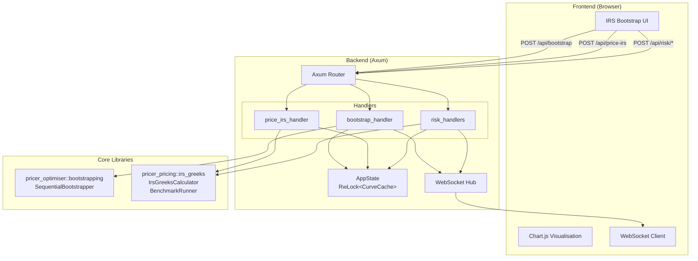
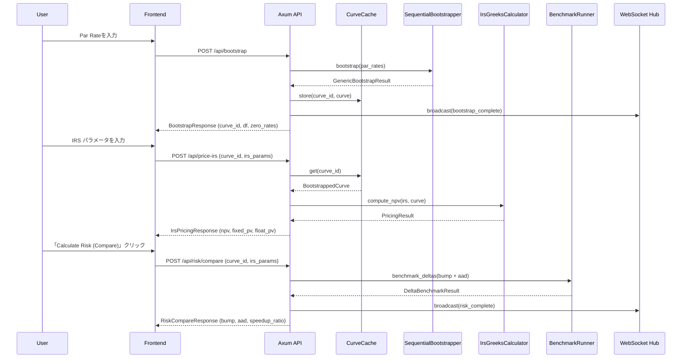
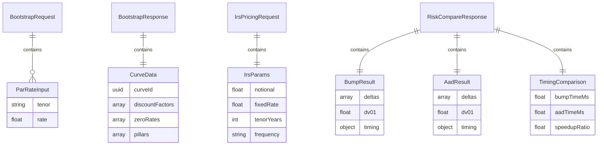
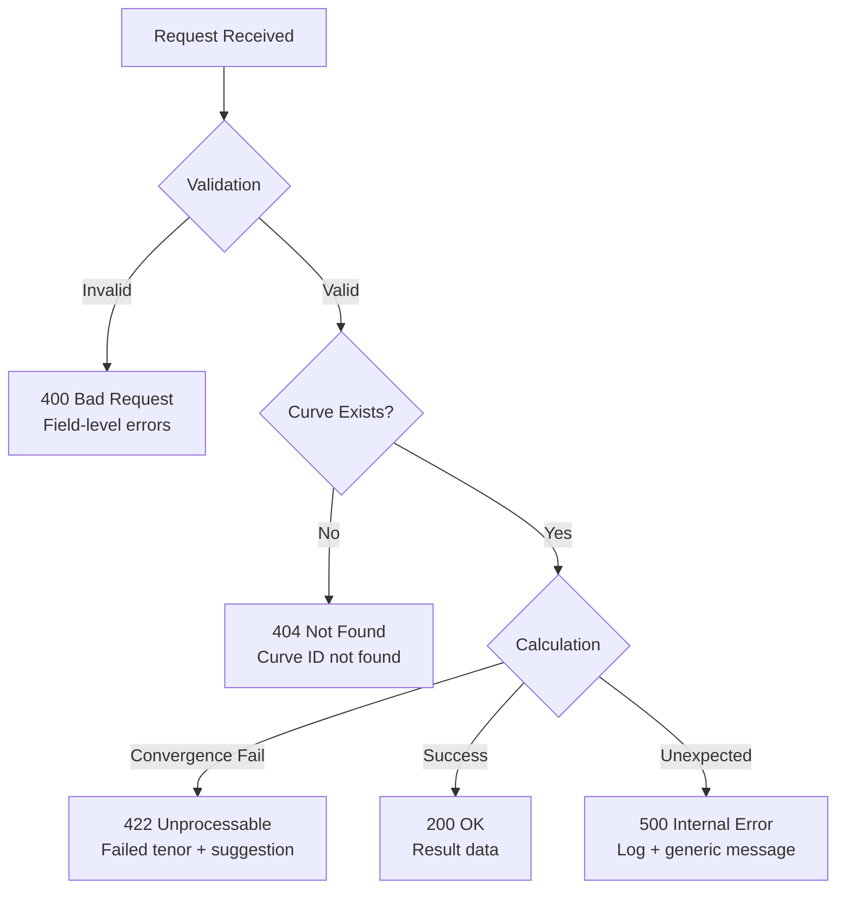

# Design Document: IRS Bootstrap & Risk

## Overview

**Purpose**: 本機能は、FrictionalBank WebAppのPricerタブに「IRS Bootstrap & Risk」サブビューを追加し、マーケットで観測されるIRS Par Rateからイールドカーブを構築し、IRS時価評価とリスク計算（Bump法/AAD法）を経過時間比較付きで提供する。

**Users**: クオンツ、トレーダー、リスク管理者、エンドユーザーが、実務的なイールドカーブ構築とAADの性能優位性を体験するインタラクティブなデモとして利用する。

**Impact**: 既存のBlack-Scholes的なシンプルプライシング機能に加え、実務レベルのカーブ構築・リスク計算機能を追加し、Neutryxライブラリの高度な機能を可視化する。

### Goals

- Par Rate入力からのイールドカーブ・ブートストラップ構築
- ブートストラップされたカーブを使用したIRS時価評価
- Bump法とAAD法によるカーブ感応度（Delta）計算
- 両手法の計算時間比較表示（Speedup Ratio）
- リアルタイムWebSocket通知によるマルチクライアント連携

### Non-Goals

- 複数カーブ（OIS + Tenor）の同時ブートストラップ（将来拡張）
- カーブの永続化・データベース保存
- 認証・認可機能（デモ用途のため）
- プロダクション向けの高可用性設計

## Architecture

### Existing Architecture Analysis

本機能は既存のFrictionalBank WebApp基盤を拡張する：

- **WebApp基盤**: Axum + WebSocket + Chart.js（成熟）
- **バックエンドモジュール**: `pricer_optimiser::bootstrapping`、`pricer_pricing::irs_greeks`（完全実装済み）
- **既存パターン**: RESTful API（camelCase JSON）、`AppState` 共有、`BroadcastMessage` WebSocket

### Architecture Pattern & Boundary Map



**Architecture Integration**:
- **Selected pattern**: ハイブリッドアプローチ（既存拡張 + IIFE名前空間分離）
- **Domain boundaries**: API層 → Core Libraries、状態は AppState で管理
- **Existing patterns preserved**: `handlers.rs` パターン、`pricer_types.rs` 型定義、WebSocketブロードキャスト
- **New components rationale**: 新規エンドポイント5つ、新規API型、カーブキャッシュ
- **Steering compliance**: A-I-P-S 依存ルール遵守（Service → Pricer）

### Technology Stack

| Layer | Choice / Version | Role in Feature | Notes |
|-------|------------------|-----------------|-------|
| Frontend | HTML/CSS/JS + Chart.js | UI入力・結果表示・可視化 | 既存インフラ活用 |
| Backend | Axum 0.7+ | REST API + WebSocket | 既存パターン |
| Core | pricer_optimiser, pricer_pricing | Bootstrap, IRS Greeks | 完全実装済み |
| State | RwLock<HashMap> | カーブキャッシュ | インメモリ |
| Serialisation | Serde (camelCase) | JSON API | 既存規約 |

## System Flows

### ブートストラップ → プライシング → リスク計算フロー



**Flow Decisions**:
- カーブIDベースのステートフル設計により、複数リクエスト間でカーブを再利用
- WebSocketブロードキャストにより他クライアントへの通知を実現
- AAD未対応時は `aad_available: false` でフォールバック

## Requirements Traceability

| Requirement | Summary | Components | Interfaces | Flows |
|-------------|---------|------------|------------|-------|
| **1.1-1.6** | Par Rate入力UI | IrsBootstrapForm | BootstrapRequest | Bootstrap Flow |
| **2.1-2.6** | イールドカーブ構築 | bootstrap_handler, SequentialBootstrapper | POST /api/bootstrap | Bootstrap Flow |
| **3.1-3.6** | IRS時価評価 | price_irs_handler, IrsGreeksCalculator | POST /api/price-irs | Pricing Flow |
| **4.1-4.6** | Bump法リスク | risk_bump_handler, BenchmarkRunner | POST /api/risk/bump | Risk Flow |
| **5.1-5.6** | AAD法リスク | risk_aad_handler, BenchmarkRunner | POST /api/risk/aad | Risk Flow |
| **6.1-6.6** | 経過時間比較 | risk_compare_handler, TimingStats | POST /api/risk/compare | Risk Flow |
| **7.1-7.6** | UI/UX | IrsBootstrapView, StepIndicator | N/A | All Flows |
| **8.1-8.4** | WebSocket通知 | websocket_handler, BroadcastMessage | WS Events | All Flows |
| **9.1-9.8** | バックエンドAPI | All handlers | All endpoints | All Flows |

## Components and Interfaces

### Component Summary

| Component | Domain/Layer | Intent | Req Coverage | Key Dependencies | Contracts |
|-----------|--------------|--------|--------------|------------------|-----------|
| bootstrap_handler | API | Par RateからBootstrap実行 | 2.1-2.6 | SequentialBootstrapper (P0) | API |
| price_irs_handler | API | IRS時価評価 | 3.1-3.6 | IrsGreeksCalculator (P0), CurveCache (P0) | API |
| risk_bump_handler | API | Bump法Delta計算 | 4.1-4.6 | BenchmarkRunner (P0) | API |
| risk_aad_handler | API | AAD法Delta計算 | 5.1-5.6 | BenchmarkRunner (P0) | API |
| risk_compare_handler | API | 両手法比較実行 | 6.1-6.6 | BenchmarkRunner (P0) | API |
| CurveCache | State | カーブの保持・取得 | 2.3, 3.2 | N/A | State |
| IrsBootstrapView | UI | 3ステップワークフロー | 7.1-7.6 | All handlers (P0) | N/A |

### Backend / API Layer

#### bootstrap_handler

| Field | Detail |
|-------|--------|
| Intent | Par RateリストからBootstrapを実行しカーブを構築 |
| Requirements | 2.1, 2.2, 2.3, 2.4, 2.5 |

**Responsibilities & Constraints**
- Par Rateのバリデーション（正値、数値）
- SequentialBootstrapperを使用したカーブ構築
- 構築されたカーブをCurveCacheに保存
- 処理時間の計測

**Dependencies**
- Outbound: SequentialBootstrapper — カーブ構築 (P0)
- Outbound: CurveCache — カーブ保存 (P0)
- Outbound: WebSocket Hub — 完了通知 (P1)

**Contracts**: API [x]

##### API Contract

| Method | Endpoint | Request | Response | Errors |
|--------|----------|---------|----------|--------|
| POST | /api/bootstrap | BootstrapRequest | BootstrapResponse | 400, 422 |

#### price_irs_handler

| Field | Detail |
|-------|--------|
| Intent | ブートストラップされたカーブを使用してIRSのNPVを計算 |
| Requirements | 3.2, 3.3, 3.4 |

**Responsibilities & Constraints**
- カーブIDからCurveCacheを取得
- IRSパラメータのバリデーション
- NPV、固定レグPV、変動レグPVの計算
- 計算時間の計測（マイクロ秒）

**Dependencies**
- Inbound: CurveCache — カーブ取得 (P0)
- Outbound: IrsGreeksCalculator — NPV計算 (P0)

**Contracts**: API [x]

##### API Contract

| Method | Endpoint | Request | Response | Errors |
|--------|----------|---------|----------|--------|
| POST | /api/price-irs | IrsPricingRequest | IrsPricingResponse | 400, 404, 422 |

#### risk_compare_handler

| Field | Detail |
|-------|--------|
| Intent | Bump法とAAD法の両方でDelta計算を実行し比較結果を返却 |
| Requirements | 4.1-4.6, 5.1-5.6, 6.1-6.4 |

**Responsibilities & Constraints**
- BenchmarkRunnerを使用したベンチマーク実行
- 両手法のDelta結果と計算時間の収集
- Speedup Ratioの計算
- AAD未対応時のフォールバック処理

**Dependencies**
- Inbound: CurveCache — カーブ取得 (P0)
- Outbound: BenchmarkRunner — ベンチマーク実行 (P0)
- Outbound: WebSocket Hub — 完了通知 (P1)

**Contracts**: API [x]

##### API Contract

| Method | Endpoint | Request | Response | Errors |
|--------|----------|---------|----------|--------|
| POST | /api/risk/bump | RiskRequest | RiskBumpResponse | 400, 404, 422 |
| POST | /api/risk/aad | RiskRequest | RiskAadResponse | 400, 404, 422 |
| POST | /api/risk/compare | RiskRequest | RiskCompareResponse | 400, 404, 422 |

### State Management Layer

#### CurveCache

| Field | Detail |
|-------|--------|
| Intent | ブートストラップされたカーブのインメモリキャッシュ |
| Requirements | 2.3, 3.2 |

**Responsibilities & Constraints**
- UUID によるカーブID管理
- 複数カーブの同時保持
- スレッドセーフなアクセス（RwLock）
- TTL ベースの自動クリーンアップ（オプション）

**Contracts**: State [x]

##### State Management

```rust
pub struct CurveCache {
    curves: RwLock<HashMap<Uuid, CachedCurve>>,
}

pub struct CachedCurve {
    pub curve: BootstrappedCurve<f64>,
    pub pillars: Vec<f64>,
    pub discount_factors: Vec<f64>,
    pub created_at: Instant,
}
```

- **State model**: HashMap<Uuid, CachedCurve>
- **Persistence**: インメモリのみ（サーバー再起動で喪失）
- **Concurrency**: RwLock による読み書き分離

## Data Models

### Domain Model



### Data Contracts & Integration

#### API Request/Response Schemas

```typescript
// Bootstrap API
interface BootstrapRequest {
  parRates: ParRateInput[];
  interpolation?: "linear" | "log_linear";  // default: "log_linear"
}

interface ParRateInput {
  tenor: string;      // "1Y", "2Y", "3Y", "5Y", "7Y", "10Y", "15Y", "20Y", "30Y"
  rate: number;       // 0.025 = 2.5%
}

interface BootstrapResponse {
  curveId: string;    // UUID
  pillars: number[];  // [1.0, 2.0, 3.0, ...]
  discountFactors: number[];
  zeroRates: number[];
  processingTimeMs: number;
}

// IRS Pricing API
interface IrsPricingRequest {
  curveId: string;
  notional: number;
  fixedRate: number;
  tenorYears: number;
  paymentFrequency: "annual" | "semi_annual" | "quarterly";
}

interface IrsPricingResponse {
  npv: number;
  fixedLegPv: number;
  floatLegPv: number;
  processingTimeUs: number;
}

// Risk Compare API
interface RiskRequest {
  curveId: string;
  notional: number;
  fixedRate: number;
  tenorYears: number;
  paymentFrequency: "annual" | "semi_annual" | "quarterly";
  bumpSizeBps?: number;  // default: 1
}

interface RiskCompareResponse {
  bump: RiskMethodResult;
  aad: RiskMethodResult | null;  // null if AAD unavailable
  aadAvailable: boolean;
  speedupRatio: number | null;   // null if AAD unavailable
  comparison: TimingComparison;
}

interface RiskMethodResult {
  deltas: DeltaResult[];
  dv01: number;
  timing: TimingStats;
}

interface DeltaResult {
  tenor: string;
  delta: number;
  processingTimeUs: number;
}

interface TimingStats {
  meanUs: number;
  stdDevUs: number;
  minUs: number;
  maxUs: number;
  totalMs: number;
}

interface TimingComparison {
  bumpTotalMs: number;
  aadTotalMs: number | null;
  speedupRatio: number | null;
}
```

#### WebSocket Event Schemas

```typescript
// WebSocket Events
type WebSocketEvent =
  | { type: "bootstrap_complete"; data: BootstrapCompleteEvent }
  | { type: "risk_complete"; data: RiskCompleteEvent }
  | { type: "calculation_error"; data: CalculationErrorEvent };

interface BootstrapCompleteEvent {
  curveId: string;
  tenorCount: number;
  processingTimeMs: number;
}

interface RiskCompleteEvent {
  curveId: string;
  method: "bump" | "aad" | "compare";
  dv01: number;
  speedupRatio: number | null;
}

interface CalculationErrorEvent {
  operation: string;
  error: string;
  failedTenor?: string;
}
```

## Error Handling

### Error Strategy

エラーは検出場所で分類し、適切なHTTPステータスコードとユーザーフレンドリーなメッセージを返却する。

### Error Categories and Responses

**User Errors (4xx)**:
- `400 Bad Request`: Par Rate バリデーションエラー（負値、非数値、テナー不正）
- `404 Not Found`: 指定された curve_id が存在しない

**Business Logic Errors (422)**:
- Bootstrap収束失敗 → 失敗テナーを明示、入力値の調整を提案
- IRS計算エラー → パラメータの問題を説明

**System Errors (5xx)**:
- `500 Internal Server Error`: 予期しないエラー → ログ記録、汎用メッセージ



### Error Response Schema

```typescript
interface ErrorResponse {
  error: string;           // Error type
  message: string;         // User-friendly message
  details?: {
    field?: string;        // For validation errors
    tenor?: string;        // For bootstrap failures
    suggestion?: string;   // Remediation hint
  };
}
```

## Testing Strategy

### Unit Tests

- `BootstrapRequest` / `IrsPricingRequest` のバリデーションロジック
- `CurveCache` の CRUD 操作（追加、取得、存在確認）
- Par Rate → テナー年数変換ユーティリティ
- TimingStats 計算ロジック（mean, std_dev, min, max）
- Speedup Ratio 計算（ゼロ除算対策含む）

### Integration Tests

- Bootstrap → Pricing フロー（正常系）
- Bootstrap → Risk Compare フロー（正常系）
- 不正な curve_id での 404 エラー
- Bootstrap 収束失敗時の 422 エラー
- WebSocket イベントブロードキャスト

### E2E/UI Tests

- Par Rate 入力 → Bootstrap → カーブ可視化
- IRS パラメータ入力 → Pricing → NPV 表示
- Risk Compare → Delta テーブル + 速度比較チャート表示
- 3ステップワークフローの状態遷移
- モバイル / デスクトップレスポンシブ表示

### Performance Tests

- 9テナーBootstrapの処理時間（目標: < 100ms）
- 9テナーDelta計算（Bump）の処理時間
- 9テナーDelta計算（AAD）の処理時間
- 10回繰り返しベンチマークの安定性

## Optional Sections

### Performance & Scalability

**Target Metrics**:
- Bootstrap処理: < 100ms（9テナー）
- PV計算: < 1ms
- Bump法Delta（全テナー）: < 50ms
- AAD法Delta（全テナー）: < 5ms（enzyme-ad有効時）
- Speedup Ratio目標: 10x以上

**Measurement**:
- 各APIレスポンスに処理時間を含める
- BenchmarkRunnerの統計機能を活用

### Security Considerations

- デモ用途のため認証・認可は対象外
- 入力バリデーションによるインジェクション防止
- CORS設定は既存WebApp設定に従う

---

_作成日: 2026-01-14_
_言語: 日本語 (spec.json.language: ja)_
