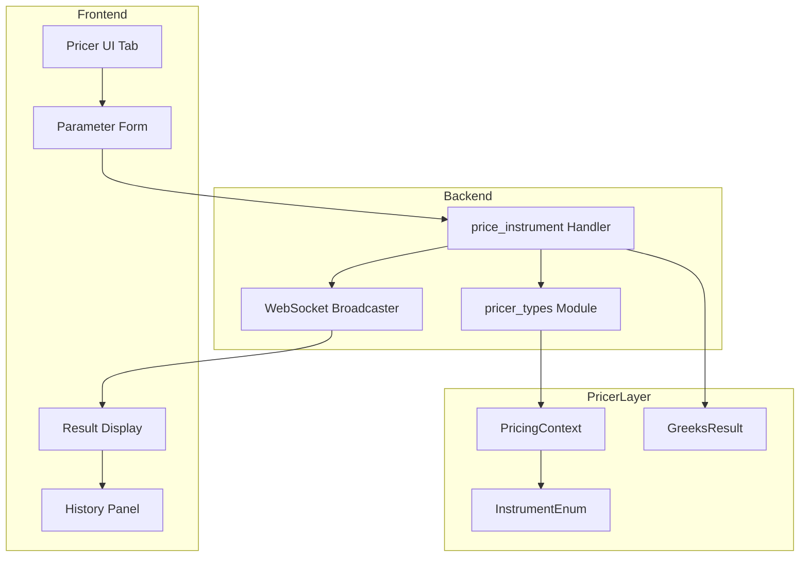
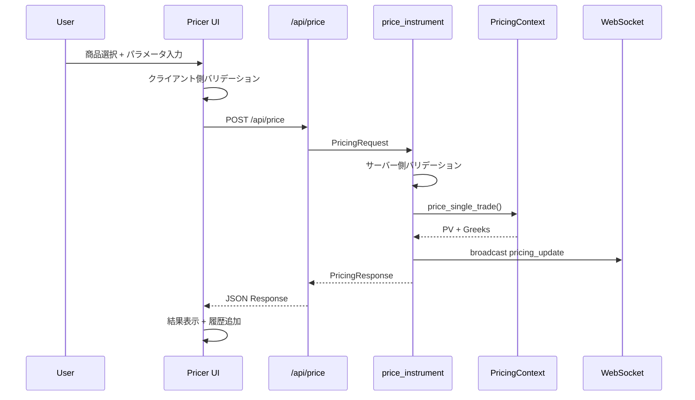
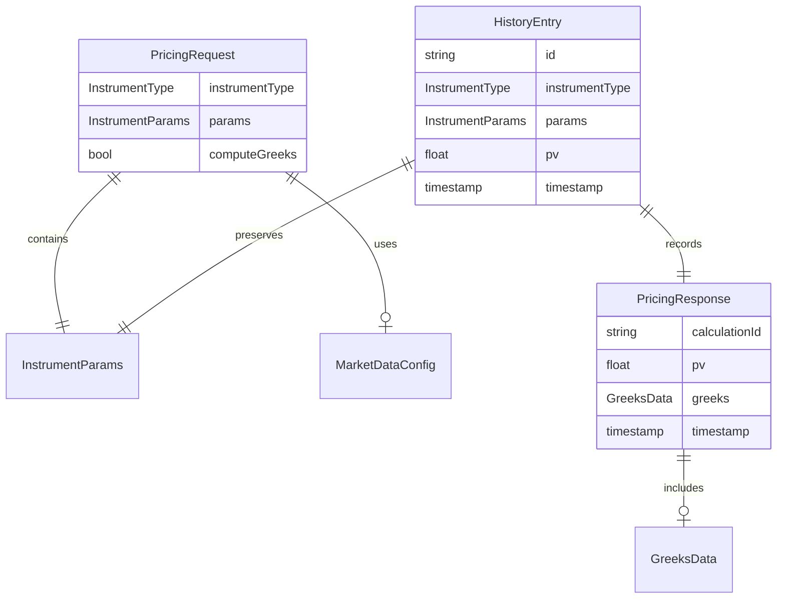

# 技術設計書: FrictionalBank WebApp プライサー

## Overview

**Purpose**: FrictionalBank WebAppにインタラクティブなデリバティブ価格計算機能を提供し、トレーダーおよびクオンツアナリストがリアルタイムで価格とGreeksを確認できるようにする。

**Users**: トレーダー、リスクマネージャー、クオンツアナリストが以下のワークフローで使用：
- 商品選択とパラメータ入力による即座の価格計算
- Greeks（Delta、Gamma、Vega、Theta、Rho）によるリスク特性把握
- 計算履歴を用いたシナリオ比較分析

**Impact**: 既存のFrictionalBank WebApp（`demo/gui/`）を拡張し、新規「Pricer」タブを追加。既存のポートフォリオ/リスク機能には影響なし。

### Goals

- 商品選択から価格計算結果表示までの一貫したUXを提供
- pricer_pricing（L3）の3段階ロケットパターンを活用した正確な価格計算
- 既存WebSocket基盤を活用したリアルタイム更新
- デモ用途に適した簡略化された市場データの提供

### Non-Goals

- 本番運用向けの完全なInstrument定義（`demo.rs`の簡略版を使用）
- 外部市場データソースとの連携（ハードコードされたデモデータを使用）
- 認証/認可機能（デモ環境のため不要）
- Enzyme AD統合（num-dual fallbackモードを使用）

## Architecture

### Existing Architecture Analysis

現在のFrictionalBank WebAppは以下のアーキテクチャを採用：

| パターン | 実装 | 本機能への適用 |
|---------|------|---------------|
| REST API | axum `/api/*` | 新規 `/api/price` エンドポイント追加 |
| WebSocket | `/api/ws` broadcast | `pricing_update` メッセージタイプ追加 |
| 状態管理 | `Arc<AppState>` | 計算履歴をAppStateに追加 |
| フロントエンド | SPA (index.html + app.js) | 新規「Pricer」タブ追加 |

**維持すべき既存パターン**:
- `(StatusCode, Json<T>)` エラー応答形式
- `serde` によるcamelCaseシリアライゼーション
- `RealTimeUpdate` WebSocketメッセージ構造

### Architecture Pattern & Boundary Map



**Architecture Integration**:
- **Selected pattern**: ハイブリッドアプローチ（バックエンド拡張 + フロントエンドタブ追加）
- **Domain boundaries**: プライサー機能は既存ポートフォリオ/リスク機能と分離、独立した型定義ファイル
- **Existing patterns preserved**: REST API構造、WebSocketブロードキャスト、AppState管理
- **New components rationale**: `pricer_types.rs`で型定義を分離し、handlers.rsの肥大化を防止
- **Steering compliance**: A-I-P-S依存方向を遵守（ServiceレイヤーがPricerレイヤーを呼び出し）

### Technology Stack

| Layer | Choice / Version | Role in Feature | Notes |
|-------|------------------|-----------------|-------|
| Frontend | HTML5 + Vanilla JS | 動的フォーム、結果表示 | 既存app.jsを拡張 |
| Backend | axum 0.7 | REST API + WebSocket | 既存ルーターを拡張 |
| Pricer | pricer_pricing (L3) | 価格計算エンジン | PricingContext活用 |
| Models | pricer_models (L2) | 商品/モデル定義 | demo.rs簡略版 |
| Serialization | serde + serde_json | JSON変換 | camelCase for JS interop |

## System Flows

### 価格計算フロー



**Key Decisions**:
- REST API（POST）を使用し、WebSocketはリアルタイム更新通知に限定
- バリデーションはクライアント側とサーバー側の両方で実施
- 計算完了時にWebSocketでブロードキャストし、マルチクライアント対応

## Requirements Traceability

| Requirement | Summary | Components | Interfaces | Flows |
|-------------|---------|------------|------------|-------|
| 1.1, 1.2, 1.3 | 商品選択UI | PricerUI, InstrumentSelector | - | - |
| 2.1, 2.2, 2.3, 2.4, 2.5 | パラメータ入力 | ParameterForm, FormValidator | PricingRequest | - |
| 3.1, 3.2, 3.3, 3.4, 3.5 | 価格計算 | price_instrument Handler | PricingRequest, PricingResponse | 価格計算フロー |
| 4.1, 4.2, 4.3, 4.4 | Greeks表示 | GreeksDisplay | GreeksData | - |
| 5.1, 5.2, 5.3, 5.4, 5.5 | バックエンド統合 | PricerService, PricingContext | - | 価格計算フロー |
| 6.1, 6.2, 6.3, 6.4 | 市場データ | DemoMarketData | MarketDataConfig | - |
| 7.1, 7.2, 7.3, 7.4 | 計算履歴 | HistoryPanel, HistoryStore | HistoryEntry | - |
| 8.1, 8.2, 8.3, 8.4 | レスポンシブUI | PricerUI CSS | - | - |

## Components and Interfaces

### Component Summary

| Component | Domain/Layer | Intent | Req Coverage | Key Dependencies | Contracts |
|-----------|--------------|--------|--------------|------------------|-----------|
| pricer_types | Backend/Types | リクエスト/レスポンス型定義 | 2, 3, 4, 5 | serde (P0) | API |
| price_instrument | Backend/Handler | 価格計算APIハンドラー | 3, 5 | pricer_pricing (P0), pricer_types (P0) | API, Service |
| pricing_update | Backend/WebSocket | 計算完了通知 | 3.2 | websocket.rs (P0) | Event |
| PricerUI | Frontend/UI | プライサータブUI | 1, 2, 8 | app.js (P0) | State |
| HistoryStore | Frontend/State | 計算履歴管理 | 7 | LocalStorage (P1) | State |

### Backend / Types Layer

#### pricer_types Module

| Field | Detail |
|-------|--------|
| Intent | プライサーAPI用のリクエスト/レスポンス型を定義 |
| Requirements | 2.1-2.5, 3.1-3.5, 4.1-4.4, 5.1-5.5 |

**Responsibilities & Constraints**
- プライサーAPI専用の型定義を集約
- JSONシリアライゼーション対応（camelCase）
- pricer_modelsとの型マッピングを担当

**Dependencies**
- Outbound: serde, serde_json — シリアライゼーション (P0)
- Outbound: pricer_models::demo — InstrumentEnum参照 (P0)

**Contracts**: API [x]

##### API Contract

**PricingRequest**

```rust
/// 価格計算リクエスト
#[derive(Debug, Clone, Deserialize)]
#[serde(rename_all = "camelCase")]
pub struct PricingRequest {
    /// 商品タイプ
    pub instrument_type: InstrumentType,
    /// 商品パラメータ
    pub params: InstrumentParams,
    /// 市場データ設定（オプション）
    pub market_data: Option<MarketDataConfig>,
    /// Greeks計算フラグ
    pub compute_greeks: bool,
}

/// 商品タイプ
#[derive(Debug, Clone, Deserialize)]
#[serde(rename_all = "snake_case")]
pub enum InstrumentType {
    EquityVanillaOption,
    FxOption,
    Irs,
}

/// 商品パラメータ（商品タイプ別）
#[derive(Debug, Clone, Deserialize)]
#[serde(untagged)]
pub enum InstrumentParams {
    EquityOption(EquityOptionParams),
    FxOption(FxOptionParams),
    Irs(IrsParams),
}

/// Equity Vanilla Option パラメータ
#[derive(Debug, Clone, Deserialize)]
#[serde(rename_all = "camelCase")]
pub struct EquityOptionParams {
    pub spot: f64,
    pub strike: f64,
    pub expiry_years: f64,
    pub volatility: f64,
    pub rate: f64,
    pub option_type: OptionType,
}

/// FX Option パラメータ
#[derive(Debug, Clone, Deserialize)]
#[serde(rename_all = "camelCase")]
pub struct FxOptionParams {
    pub spot: f64,
    pub strike: f64,
    pub expiry_years: f64,
    pub domestic_rate: f64,
    pub foreign_rate: f64,
    pub volatility: f64,
    pub option_type: OptionType,
}

/// IRS パラメータ
#[derive(Debug, Clone, Deserialize)]
#[serde(rename_all = "camelCase")]
pub struct IrsParams {
    pub notional: f64,
    pub fixed_rate: f64,
    pub tenor_years: f64,
}

/// オプションタイプ
#[derive(Debug, Clone, Deserialize)]
#[serde(rename_all = "lowercase")]
pub enum OptionType {
    Call,
    Put,
}
```

**PricingResponse**

```rust
/// 価格計算レスポンス
#[derive(Debug, Clone, Serialize)]
#[serde(rename_all = "camelCase")]
pub struct PricingResponse {
    /// 計算ID（履歴用）
    pub calculation_id: String,
    /// 商品タイプ
    pub instrument_type: InstrumentType,
    /// 現在価値
    pub pv: f64,
    /// Greeks（オプション）
    pub greeks: Option<GreeksData>,
    /// 計算タイムスタンプ
    pub timestamp: i64,
}

/// Greeks データ
#[derive(Debug, Clone, Serialize)]
#[serde(rename_all = "camelCase")]
pub struct GreeksData {
    pub delta: f64,
    pub gamma: f64,
    pub vega: f64,
    pub theta: f64,
    pub rho: f64,
}

/// エラーレスポンス
#[derive(Debug, Clone, Serialize)]
#[serde(rename_all = "camelCase")]
pub struct PricingErrorResponse {
    pub error_type: String,
    pub message: String,
    pub field: Option<String>,
}
```

| Method | Endpoint | Request | Response | Errors |
|--------|----------|---------|----------|--------|
| POST | /api/price | PricingRequest | PricingResponse | 400 (ValidationError), 422 (PricingError), 500 |

**Implementation Notes**
- Integration: handlers.rsに新規ハンドラー追加、mod.rsにルート登録
- Validation: 必須パラメータ、数値範囲（正数、0-1の確率等）をサーバー側で検証
- Risks: InstrumentParams untagged enumは順序依存、テストで検証必要

---

### Backend / Handler Layer

#### price_instrument Handler

| Field | Detail |
|-------|--------|
| Intent | 価格計算リクエストを処理し、PricingContextを使用して計算を実行 |
| Requirements | 3.1, 3.2, 3.4, 3.5, 5.1-5.5 |

**Responsibilities & Constraints**
- PricingRequestのバリデーション
- pricer_modelsへの型変換
- PricingContextを使用した価格計算実行
- Greeks計算（オプション）
- WebSocketへのブロードキャスト

**Dependencies**
- Inbound: axum Router — HTTPリクエスト (P0)
- Outbound: pricer_pricing::context — PricingContext (P0)
- Outbound: pricer_models::demo — InstrumentEnum, ModelEnum (P0)
- Outbound: websocket.rs — broadcast_pricing_update (P1)

**Contracts**: API [x] / Service [x]

##### Service Interface

```rust
/// 価格計算サービス（内部）
pub async fn price_instrument(
    State(state): State<Arc<AppState>>,
    Json(request): Json<PricingRequest>,
) -> Result<Json<PricingResponse>, (StatusCode, Json<PricingErrorResponse>)>;
```

- Preconditions: request.paramsが商品タイプに適合していること
- Postconditions: PricingResponseにPVが含まれること、compute_greeks=trueの場合はgreeksも含まれること
- Invariants: pricer層エラーは422として返却

**Implementation Notes**
- Integration: 既存のget_portfolio, get_risk_metricsハンドラーと同様のパターン
- Validation: 早期バリデーションでpricer層呼び出し前にエラー検出
- Risks: InstrumentEnum/ModelEnum構築時の型不一致

---

### Backend / WebSocket Layer

#### pricing_update Message

| Field | Detail |
|-------|--------|
| Intent | 価格計算完了をリアルタイムでクライアントに通知 |
| Requirements | 3.2 |

**Responsibilities & Constraints**
- 既存のRealTimeUpdate構造を拡張
- ブロードキャストによるマルチクライアント対応

**Dependencies**
- Inbound: price_instrument Handler — 計算完了通知 (P1)
- Outbound: tokio broadcast — メッセージ配信 (P0)

**Contracts**: Event [x]

##### Event Contract

```rust
impl RealTimeUpdate {
    /// 価格計算完了イベント
    pub fn pricing_update(response: &PricingResponse) -> Self {
        Self {
            update_type: "pricing".to_string(),
            timestamp: chrono::Utc::now().timestamp_millis(),
            data: serde_json::json!({
                "calculationId": response.calculation_id,
                "instrumentType": response.instrument_type,
                "pv": response.pv,
                "greeks": response.greeks,
            }),
        }
    }
}
```

- Published events: `pricing` (update_type)
- Subscribed events: なし
- Ordering / delivery guarantees: Best effort（broadcast channel）

---

### Frontend / UI Layer

#### PricerUI Component

| Field | Detail |
|-------|--------|
| Intent | プライサータブのメインUIコンテナ |
| Requirements | 1.1-1.3, 2.1-2.5, 8.1-8.4 |

**Responsibilities & Constraints**
- 商品選択ドロップダウン
- 動的パラメータフォーム生成
- 結果表示パネル
- レスポンシブレイアウト

**Dependencies**
- Inbound: index.html — タブコンテナ (P0)
- Outbound: /api/price — REST API呼び出し (P0)
- Outbound: HistoryStore — 履歴管理 (P1)

**Contracts**: State [x]

##### State Management

```javascript
// プライサー状態
const pricerState = {
    selectedInstrument: null,  // 'equityVanillaOption' | 'fxOption' | 'irs'
    params: {},                // 商品パラメータ
    isCalculating: false,      // 計算中フラグ
    result: null,              // PricingResponse
    error: null,               // エラー情報
};

// 商品選択時の処理
function onInstrumentChange(instrumentType) {
    pricerState.selectedInstrument = instrumentType;
    pricerState.params = getDefaultParams(instrumentType);
    renderParameterForm(instrumentType);
}

// 計算実行
async function calculatePrice() {
    pricerState.isCalculating = true;
    pricerState.error = null;
    renderLoadingState();

    try {
        const response = await fetch('/api/price', {
            method: 'POST',
            headers: { 'Content-Type': 'application/json' },
            body: JSON.stringify({
                instrumentType: pricerState.selectedInstrument,
                params: pricerState.params,
                computeGreeks: true,
            }),
        });

        if (!response.ok) {
            const error = await response.json();
            throw new Error(error.message);
        }

        pricerState.result = await response.json();
        historyStore.add(pricerState.result);
        renderResult(pricerState.result);
    } catch (e) {
        pricerState.error = e.message;
        renderError(pricerState.error);
    } finally {
        pricerState.isCalculating = false;
    }
}
```

**Implementation Notes**
- Integration: 既存のダッシュボードタブシステムに統合
- Validation: HTML5 form validation + カスタムバリデーション
- Risks: 大量入力時のパフォーマンス（軽微）

---

#### HistoryStore Component

| Field | Detail |
|-------|--------|
| Intent | 計算履歴をセッション内で管理 |
| Requirements | 7.1-7.4 |

**Responsibilities & Constraints**
- 直近10件の計算結果を保持
- LocalStorageへの永続化（オプション）
- 履歴項目クリックでパラメータ復元

**Contracts**: State [x]

##### State Management

```javascript
// 履歴ストア
const historyStore = {
    entries: [],  // HistoryEntry[]
    maxEntries: 10,

    add(result) {
        const entry = {
            id: result.calculationId,
            instrumentType: result.instrumentType,
            pv: result.pv,
            timestamp: result.timestamp,
            params: { ...pricerState.params },
        };
        this.entries.unshift(entry);
        if (this.entries.length > this.maxEntries) {
            this.entries.pop();
        }
        this.persist();
        renderHistoryPanel();
    },

    restore(id) {
        const entry = this.entries.find(e => e.id === id);
        if (entry) {
            pricerState.selectedInstrument = entry.instrumentType;
            pricerState.params = { ...entry.params };
            renderParameterForm(entry.instrumentType);
        }
    },

    persist() {
        localStorage.setItem('pricerHistory', JSON.stringify(this.entries));
    },

    load() {
        const saved = localStorage.getItem('pricerHistory');
        if (saved) {
            this.entries = JSON.parse(saved);
        }
    },
};
```

## Data Models

### Domain Model



**Aggregates**:
- `PricingRequest`: 計算リクエストの集約ルート
- `HistoryEntry`: 履歴エントリの集約ルート（フロントエンドのみ）

**Business Rules**:
- 1リクエスト = 1計算結果
- 履歴は最大10件、FIFO方式で古いものを削除

### Logical Data Model

**Structure Definition**:
- `InstrumentParams`: discriminated union（商品タイプ別）
- `GreeksData`: オプション商品のみ有効（IRSはDelta/Rhoのみ）
- `HistoryEntry`: クライアント側のみ、サーバー永続化なし

**Consistency & Integrity**:
- 計算リクエストはステートレス（サーバー側で状態保持なし）
- 履歴はクライアントLocalStorageで永続化

## Error Handling

### Error Strategy

| エラータイプ | HTTPコード | 対応 |
|-------------|-----------|------|
| ValidationError | 400 | フィールドレベルエラー表示 |
| PricingError | 422 | 計算エラーメッセージ表示 |
| ServerError | 500 | 一般エラーメッセージ表示 |

### Error Categories and Responses

**User Errors (4xx)**:
- 必須パラメータ未入力 → フィールドハイライト + エラーメッセージ
- 数値範囲外 → 許容範囲を示すエラーメッセージ
- 不正な商品タイプ → サポート商品一覧を表示

**System Errors (5xx)**:
- pricer層例外 → 422 PricingErrorとして返却
- 内部エラー → 500 + ログ記録

### Monitoring

- エラーログ: `tracing::warn!` / `tracing::error!` でログ出力
- メトリクス: 計算成功/失敗カウント（将来的な拡張）

## Testing Strategy

### Unit Tests

1. **pricer_types**: PricingRequest/Responseのシリアライゼーション
2. **price_instrument**: バリデーションロジック
3. **InstrumentParams**: 商品タイプ別パラメータ変換
4. **HistoryStore**: 履歴追加/削除/永続化

### Integration Tests

1. **POST /api/price**: 正常系（各商品タイプ）
2. **POST /api/price**: 異常系（バリデーションエラー）
3. **WebSocket pricing_update**: ブロードキャスト配信
4. **Pricer統合**: PricingContext経由の計算実行

### E2E Tests

1. **商品選択→パラメータ入力→計算**: 基本フロー
2. **エラー表示**: バリデーションエラー時のUI
3. **履歴管理**: 履歴追加・復元フロー
4. **レスポンシブ**: タブレット/デスクトップレイアウト

## Performance & Scalability

**Target Metrics**:
- 価格計算レイテンシ: < 100ms（単一商品）
- UI応答: < 50ms（フォーム操作）

**Optimization**:
- 計算はサーバー側で同期実行（軽量なため非同期化不要）
- WebSocketブロードキャストで複数クライアント対応

## Supporting References

### 変更対象ファイル一覧

| ファイル | 変更タイプ | 内容 |
|---------|-----------|------|
| `demo/gui/src/web/pricer_types.rs` | 新規作成 | リクエスト/レスポンス型定義 |
| `demo/gui/src/web/handlers.rs` | 拡張 | price_instrumentハンドラー追加 |
| `demo/gui/src/web/websocket.rs` | 拡張 | pricing_updateメッセージ追加 |
| `demo/gui/src/web/mod.rs` | 拡張 | ルート追加、pricer_typesモジュール公開 |
| `demo/gui/static/index.html` | 拡張 | Pricerタブ追加 |
| `demo/gui/static/app.js` | 拡張 | プライサーロジック追加 |
| `demo/gui/static/style.css` | 拡張 | プライサースタイル追加 |

### デフォルト市場データ

```rust
/// デモ用デフォルト市場データ
pub fn default_market_data() -> (CurveEnum, VolSurfaceEnum) {
    let curve = CurveEnum::Flat(FlatCurve { rate: 0.05 });
    let vol = VolSurfaceEnum::Sabr(SabrVolSurface { alpha: 0.3 });
    (curve, vol)
}
```
