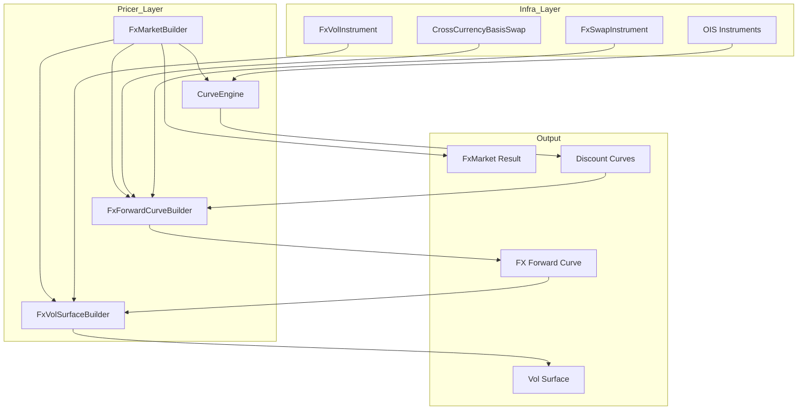
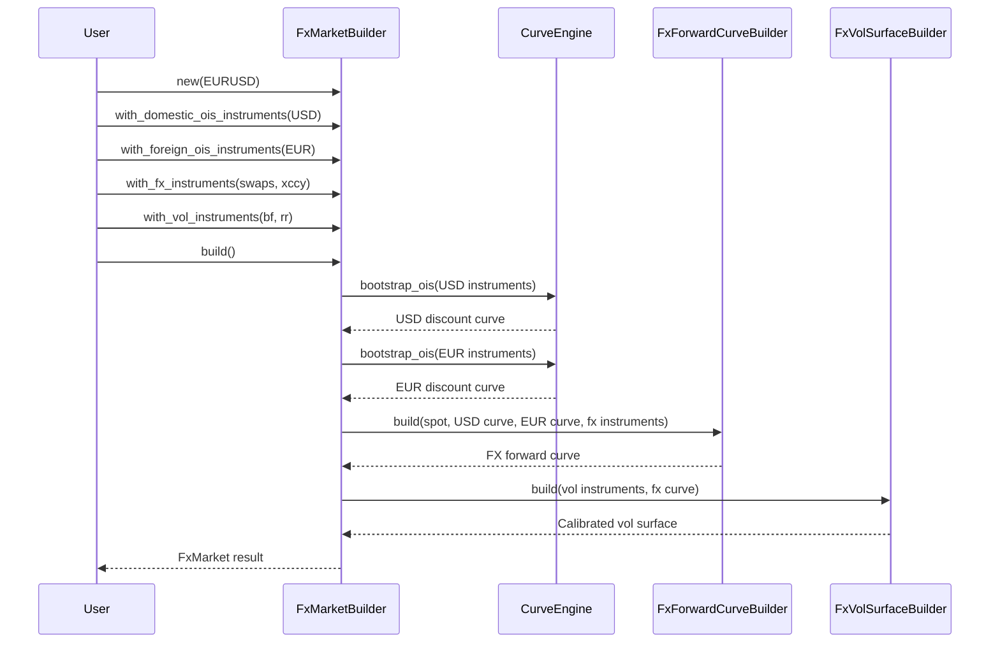

# Technical Design: fx-vol-surface-calibration

## Overview

本設計書は、FXボラティリティサーフェスカリブレーションシステムの技術設計を定義する。エンドツーエンドのワークフロー（OISカーブ → FXフォワードカーブ → VolSurface）を`FxMarketBuilder`で統合し、既存の`SequentialBootstrapper<T>`と`CurveEngine`を最大限再利用する。

**Key Design Decisions**:
1. **Hybrid Approach**: 既存コンポーネントの拡張と新規モジュール作成の組み合わせ
2. **A-I-P-S準拠**: インストルメント定義は`infra_domain`、計算ロジックは`pricer_models`に配置
3. **Generic `<T: Float>`**: 全コンポーネントでAAD互換性を維持
4. **Phase-based Implementation**: 4フェーズでリスク分散

---

### Goals
- OIS Instruments → Discount Curves → FX Forward Curve → Vol Surface の依存チェーンを正しく構築
- EURUSD/USDJPYを含むG10通貨ペアのBF/RRインストルメントサポート
- SABR/SVI補間器によるスマイル補間
- 遅延評価・キャッシュによるパフォーマンス最適化
- AAD計算グラフのインストルメントまでの拡張
- Demo WebAppでのインタラクティブな可視化

## Requirements Traceability

| Requirement | Summary | Components | Interfaces | Phase |
|-------------|---------|------------|------------|-------|
| 1.1-1.7 | FxVolInstrument定義 | `FxVolInstrument`, `FxVolConvention` | - | 1 |
| 2.1-2.7 | VolSurface設定 | `FxVolSurfaceConfig`, `InterpolatorType` | - | 1 |
| 3.1-3.7 | FxVolSurfaceBuilder | `FxVolSurfaceBuilder<T>` | `build()` | 2 |
| 4.1-4.7 | CalibratedFxVolSurface | `CalibratedFxVolSurface<T>` | `VolatilitySurface` trait | 2 |
| 5.1-5.7 | 遅延評価・キャッシュ | `LazyFxVolSurface<T>` | `invalidate()` | 2 |
| 6.1-6.7 | AADサポート | `VolSurfaceSensitivity<T>` | `Differentiable` trait | 2 |
| 7.1-7.7 | FxSwapInstrument | `FxSwapInstrument`, `FxSwapConvention` | - | 1 |
| 8.1-8.7 | CrossCurrencyBasisSwap | `CrossCurrencyBasisSwap`, `XccyBasisConvention` | - | 1 |
| 9.1-9.7 | FxCurve trait | `FxCurve<T>`, `CalibratedFxCurve<T>` | `forward_rate()` | 2 |
| 10.1-10.8 | FxForwardCurveBuilder | `FxForwardCurveBuilder<T>` | `build()` | 2 |
| 11.1-11.8 | FxMarketBuilder | `FxMarketBuilder<T>` | `build()`, partial builds | 3 |
| 12.1-12.9 | Demo WebApp | Handlers, Types | REST endpoints | 4 |
| 13.1-13.8 | クリーンアップ | - | - | 4 |
| 14.1-14.7 | 型安全性 | Newtypes, Error types | `thiserror` | 1-4 |

---

## Architecture

### High-Level Architecture



### Dependency Chain

```
OIS Instruments (Req 11.2)
    ↓ CurveEngine.bootstrap()
Discount Curves (domestic, foreign)
    ↓ FxForwardCurveBuilder.build()
FX Forward Curve (Req 10.2)
    ↓ FxVolSurfaceBuilder.build()
Vol Surface (Req 3.2)
```

### A-I-P-S Layer Mapping

| Layer | Components | Crate |
|-------|------------|-------|
| **I (Infra)** | FxVolInstrument, FxSwapInstrument, CrossCurrencyBasisSwap, Conventions | `infra_domain` |
| **P (Pricer)** | FxCurve, FxVolSurface, Builders, LazyWrappers | `pricer_models` |
| **S (Service/Demo)** | REST handlers, WebSocket (future) | `demo/gui` |

---

### Affected Layers

| Layer | Technology | Role |
|-------|------------|------|
| Numeric | `num-traits`, `num-dual` | Generic Float, AD support |
| Optimisation | `argmin` (existing) | SABR calibration |
| Interpolation | Custom (`pricer_core::math::interpolators`) | Smile/expiry interpolation |
| Serialisation | `serde` | API types |
| Web | `axum`, `tower-http` | REST endpoints |
| Error | `thiserror` | Structured errors |

**No new external dependencies required** - all functionality available through existing workspace crates.

---

## System Flows

### FxMarketBuilder End-to-End Flow



### Vol Surface Calibration Flow

*[Mermaid diagram omitted]*

---

## Components & Interface Contracts

### Component Summary

| Component | Domain | Intent | Requirements | Dependencies |
|-----------|--------|--------|--------------|--------------|
| `FxVolInstrument` | Infra | BF/RR/ATMインストルメント定義 | 1.1-1.7 | Currency, Tenor |
| `FxVolConvention` | Infra | マーケットコンベンション | 1.5 | DeltaType |
| `FxSwapInstrument` | Infra | FXスワップ定義 | 7.1-7.7 | CurrencyPair |
| `CrossCurrencyBasisSwap` | Infra | XCCYベーシススワップ | 8.1-8.7 | Currency, RateIndex |
| `FxVolSurfaceConfig` | Pricer | 補間器設定 | 2.1-2.7 | InterpolatorType |
| `FxCurve<T>` | Pricer | FXカーブtrait | 9.1-9.7 | Float |
| `CalibratedFxCurve<T>` | Pricer | 構築済みFXカーブ | 9.5, 10.2 | FxCurve |
| `FxForwardCurveBuilder<T>` | Pricer | FXカーブ構築 | 10.1-10.8 | SequentialBootstrapper |
| `CalibratedFxVolSurface<T>` | Pricer | 構築済みVolSurface | 4.1-4.7 | VolatilitySurface |
| `FxVolSurfaceBuilder<T>` | Pricer | VolSurface構築 | 3.1-3.7 | SabrCalibrator |
| `LazyFxVolSurface<T>` | Pricer | 遅延評価ラッパー | 5.1-5.7 | Arc, RwLock |
| `FxMarketBuilder<T>` | Pricer | E2Eオーケストレーター | 11.1-11.8 | CurveEngine |

---

### Component: FxVolInstrument

**Location**: `infra_domain/src/trade/instrument_def/fx_vol.rs`

**Intent**: BF/RR/ATMインストルメントを標準的なマーケットコンベンションで表現

**Requirements**: 1.1-1.7

**Contracts**: State

```rust
/// FX Volatility Instrument variants
pub enum FxVolInstrument {
/// Delta newtype with validation (0 < delta <= 50)
#[derive(Debug, Clone, Copy, PartialEq)]
pub struct Delta(f64);
/// FX Vol Convention specification
pub struct FxVolConvention {
    // ... implementation omitted ...
```

**Implementation Notes**:
- USDJPY: `DeltaType::PremiumAdjustedDelta`、EURUSD: `DeltaType::SpotDelta` をデフォルトとする
- Builder patternは`FxVolInstrumentBuilder`として別途提供
- Validation: Delta range (0, 50]、expiry > reference date

---

### Component: FxSwapInstrument

**Location**: `infra_domain/src/trade/instrument_def/fx.rs` (extension)

**Intent**: 短期FXフォワードポイント構築のためのFXスワップ表現

**Requirements**: 7.1-7.7

**Contracts**: State

```rust
/// FX Swap Instrument for forward point bootstrapping
pub struct FxSwapInstrument {
/// Swap points with scaling factor
#[derive(Debug, Clone, Copy)]
pub struct SwapPoints {
/// Standard FX Swap tenors
pub enum FxSwapTenor {
pub struct FxSwapConvention {
    // ... implementation omitted ...
```

**Implementation Notes**:
- 既存`FxSwap` structと共存、段階的移行
- Scaling factorは通貨ペアごとに異なる（USDJPY: 100, EURUSD: 10000）

---

### Component: CrossCurrencyBasisSwap

**Location**: `infra_domain/src/trade/instrument_def/xccy.rs` (new)

**Intent**: 中長期FXカーブ構築のためのXCCYベーシススワップ表現

**Requirements**: 8.1-8.7

**Contracts**: State

```rust
/// Cross-Currency Basis Swap
pub struct CrossCurrencyBasisSwap {
/// Basis spread newtype (in basis points)
#[derive(Debug, Clone, Copy)]
pub struct BasisSpread(f64);
/// XCCY Swap leg
pub struct XccyLeg {
/// XCCY Basis Convention
pub struct XccyBasisConvention {
    // ... implementation omitted ...
```

**Implementation Notes**:
- MTM (resettable) vs Non-MTM のサポート
- Spread適用legは設定可能（通常はforeign leg）

---

### Component: FxCurve<T> Trait

**Location**: `pricer_models/src/market/fx_calibration/curve.rs` (new)

**Intent**: FXフォワードカーブの統一インターフェース

**Requirements**: 9.1-9.7

**Contracts**: Service

```rust
/// FX Forward Curve trait
pub trait FxCurve<T: Float>: Send + Sync {
    /// Forward rate at expiry T
    /// Forward points at expiry T
    /// Spot rate
    /// Domestic discount factor
    /// Foreign discount factor
    /// Currency pair
/// Calibrated FX Curve implementation
    // ... implementation omitted ...
```

**Implementation Notes**:
- `Arc<dyn YieldCurve<T>>` で underlying discount curve を保持
- Extrapolation policy: Flat, Linear, Error

---

### Component: FxForwardCurveBuilder<T>

**Location**: `pricer_models/src/market/fx_calibration/builder.rs` (new)

**Intent**: FXスワップ + XCCYベーシススワップからFXフォワードカーブを構築

**Requirements**: 10.1-10.8

**Contracts**: Service

```rust
/// FX Forward Curve Builder
pub struct FxForwardCurveBuilder<T: Float> {
pub struct FxCurveConfig {
    // ... implementation omitted ...
```

**Implementation Notes**:
- 内部で`SequentialBootstrapper<T>`を再利用
- Tenor blending: linear interpolation in transition range
- Diagnostic output: per-instrument repricing error

---

### Component: CalibratedFxVolSurface<T>

**Location**: `pricer_models/src/market/fx_calibration/surface.rs` (new)

**Intent**: カリブレーション済みVolSurfaceからボラティリティを補間取得

**Requirements**: 4.1-4.7

**Contracts**: Service

```rust
/// Calibrated FX Vol Surface
pub struct CalibratedFxVolSurface<T: Float> {
/// Per-expiry calibrated smile
pub struct CalibratedSmile<T: Float> {
    /// Delta-space volatility query
    /// Extract single-expiry smile
    // ... implementation omitted ...
```

**Implementation Notes**:
- `VolatilitySurface` trait実装で既存pricing codeとの互換性維持
- SABR/SVI parametric interpolation in strike dimension
- Expiry interpolation: linear on variance

---

### Component: FxVolSurfaceBuilder<T>

**Location**: `pricer_models/src/market/fx_calibration/builder.rs`

**Intent**: CurveBuilderと同様のAPIでVolSurfaceをカリブレーション

**Requirements**: 3.1-3.7

**Contracts**: Service

```rust
/// FX Vol Surface Builder
pub struct FxVolSurfaceBuilder<T: Float> {
pub struct FxVolSurfaceConfig {
pub struct CalibrationDiagnostics {
    // ... implementation omitted ...
```

---

### Component: LazyFxVolSurface<T>

**Location**: `pricer_models/src/market/fx_calibration/lazy.rs` (new)

**Intent**: VolSurfaceの評価を遅延実行しキャッシュ

**Requirements**: 5.1-5.7

**Contracts**: Service, State

```rust
/// Lazy FX Vol Surface with deferred calibration
pub struct LazyFxVolSurface<T: Float> {
    /// Get or calibrate surface
    /// Invalidate cache
    /// Get cache statistics
#[derive(Default, Clone)]
pub struct CacheStats {
    // ... implementation omitted ...
```

---

### Component: FxMarketBuilder<T>

**Location**: `pricer_models/src/market/fx_calibration/market_builder.rs` (new)

**Intent**: OISカーブからVolSurfaceまでの依存チェーンを一括構築

**Requirements**: 11.1-11.8

**Contracts**: Service

```rust
/// End-to-end FX Market Builder
pub struct FxMarketBuilder<T: Float> {
pub struct FxInstruments {
    /// Build complete FX market
    /// Partial build: discount curves only
    /// Partial build: FX curve only (requires discount curves)
/// Complete FX Market result
pub struct FxMarket<T: Float> {
    // ... implementation omitted ...
```

---

## Data Models

### Domain Model

*[Mermaid diagram omitted]*

### Newtypes (Req 14)

```rust
// Value types with validation
pub struct Delta(f64);         // 0 < delta <= 50
pub struct Strike(f64);        // strike > 0
pub struct Vol(f64);           // vol > 0
pub struct ForwardPoints(f64); // any
pub struct BasisSpread(f64);   // in basis points
```

---

## Error Handling

### Error Type Hierarchy

```rust
/// Top-level FX Market error
#[derive(Debug, thiserror::Error)]
pub enum FxMarketError {
    #[error("Domestic curve error: {0}")]
    #[error("Foreign curve error: {0}")]
    #[error("FX curve error: {0}")]
    #[error("Vol surface error: {0}")]
    #[error("Build step failed at: {step}")]
/// FX Curve specific errors
    // ... implementation omitted ...
```

---

## Testing Strategy

### Unit Tests

| Component | Test Focus |
|-----------|------------|
| `FxVolInstrument` | Delta validation, convention defaults |
| `FxSwapInstrument` | Forward rate calculation, date validation |
| `CrossCurrencyBasisSwap` | Currency mismatch detection |
| `CalibratedFxCurve` | Forward rate interpolation, extrapolation |
| `CalibratedFxVolSurface` | Vol query, delta-strike conversion |

### Integration Tests

| Test | Components | Validation |
|------|------------|------------|
| FX Curve Bootstrap | FxForwardCurveBuilder, SequentialBootstrapper | Reprice input instruments |
| Vol Surface Calibration | FxVolSurfaceBuilder, SabrCalibrator | Reprice BF/RR quotes |
| E2E Market Build | FxMarketBuilder | Full dependency chain |

### Property-Based Tests

```rust
#[proptest]
fn delta_strike_roundtrip(delta in 0.01..0.5f64) {
    let strike = delta_to_strike(delta, forward, vol, expiry);
    let recovered = strike_to_delta(strike, forward, vol, expiry);
    prop_assert!((delta - recovered).abs() < 1e-10);
}

#[proptest]
fn vol_surface_monotonicity(expiry in 0.1..5.0f64) {
    // ATM vol should be local minimum for typical market conditions
}
```

---

## Implementation Phases

### Phase 1: Core Types (Infra)
- `FxVolInstrument`, `FxVolConvention`
- `FxSwapInstrument`, `FxSwapConvention`
- `CrossCurrencyBasisSwap`, `XccyBasisConvention`
- Newtypes: `Delta`, `Strike`, `Vol`, `ForwardPoints`, `BasisSpread`

### Phase 2: Builders (Pricer)
- `FxCurve<T>` trait, `CalibratedFxCurve<T>`
- `FxForwardCurveBuilder<T>`
- `CalibratedFxVolSurface<T>`
- `FxVolSurfaceBuilder<T>`
- `LazyFxVolSurface<T>`
- `VolSurfaceSensitivity<T>`

### Phase 3: Integration (Pricer)
- `FxMarketBuilder<T>`
- `FxMarket<T>` result type
- Partial build methods

### Phase 4: WebApp & Cleanup (Demo)
- `/api/fxcurve/build` endpoint
- `/api/fxvol/calibrate` endpoint
- `/api/fxvol/smile` endpoint
- Deprecated code removal
- Steering document updates

---

## Open Questions

1. **WebSocket Protocol**: Phase 2以降でメッセージフォーマット詳細化
2. **D3.js Graph Format**: 計算グラフのJSON構造詳細
3. **Error i18n**: 日本語/英語エラーメッセージ対応

---

## References

- [gap-analysis.md](gap-analysis.md) - 既存コード分析
- [research.md](research.md) - 技術調査ログ
- [requirements.md](requirements.md) - 要件定義
