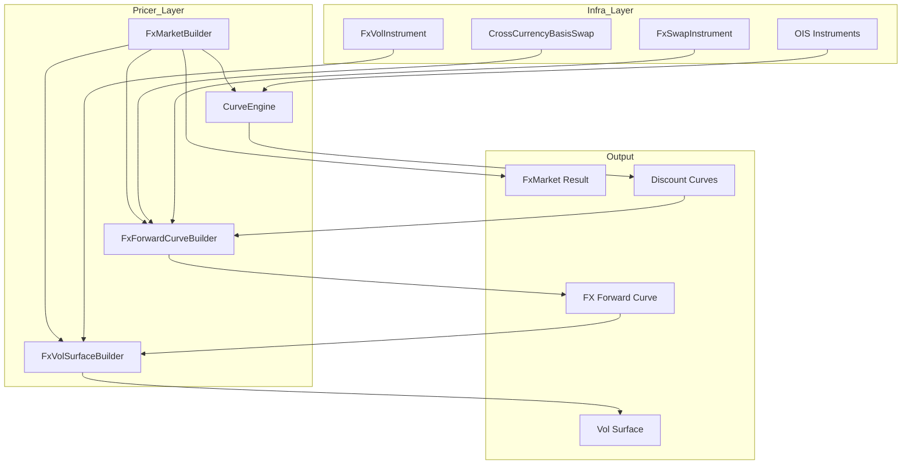
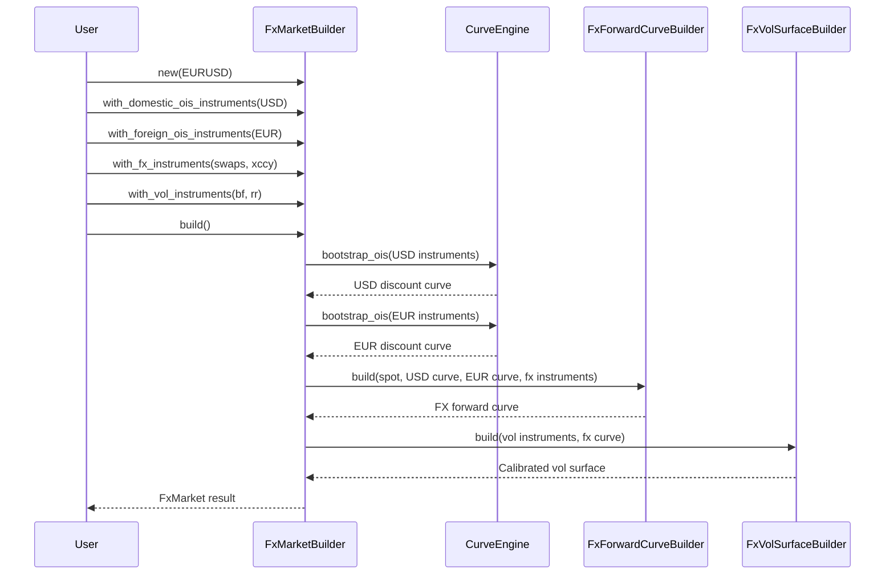
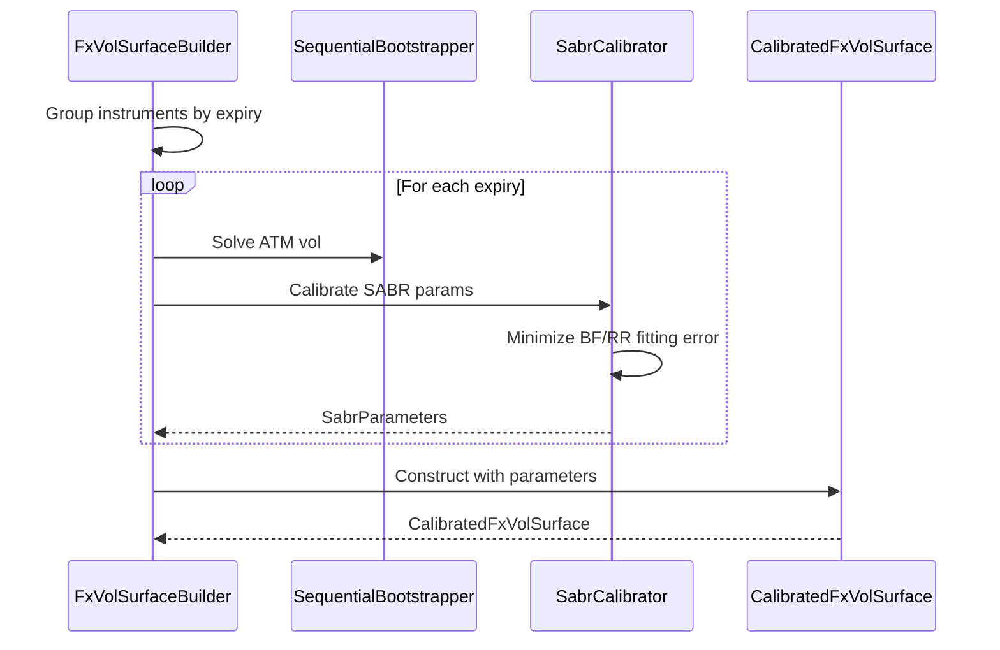
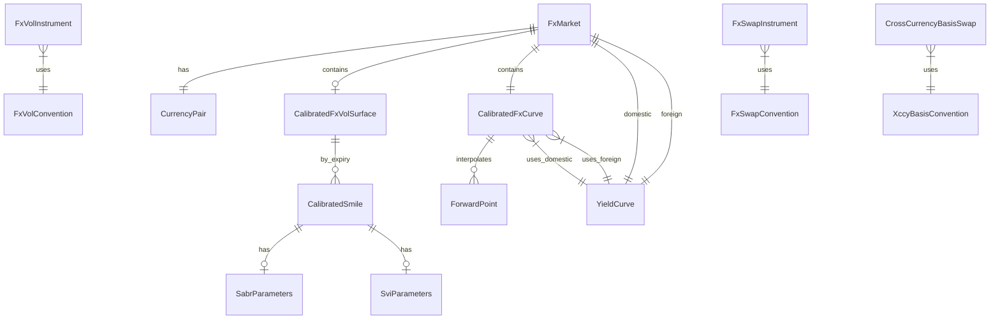

# Technical Design: fx-vol-surface-calibration

## Overview

本設計書は、FXボラティリティサーフェスカリブレーションシステムの技術設計を定義する。エンドツーエンドのワークフロー（OISカーブ → FXフォワードカーブ → VolSurface）を`FxMarketBuilder`で統合し、既存の`SequentialBootstrapper<T>`と`CurveEngine`を最大限再利用する。

**Key Design Decisions**:
1. **Hybrid Approach**: 既存コンポーネントの拡張と新規モジュール作成の組み合わせ
2. **A-I-P-S準拠**: インストルメント定義は`infra_domain`、計算ロジックは`pricer_models`に配置
3. **Generic `<T: Float>`**: 全コンポーネントでAAD互換性を維持
4. **Phase-based Implementation**: 4フェーズでリスク分散

---

## Goals and Non-Goals

### Goals
- OIS Instruments → Discount Curves → FX Forward Curve → Vol Surface の依存チェーンを正しく構築
- EURUSD/USDJPYを含むG10通貨ペアのBF/RRインストルメントサポート
- SABR/SVI補間器によるスマイル補間
- 遅延評価・キャッシュによるパフォーマンス最適化
- AAD計算グラフのインストルメントまでの拡張
- Demo WebAppでのインタラクティブな可視化

### Non-Goals
- 本番WebSocket real-time更新（Phase 2以降）
- エキゾチックFXオプション（バリアー、ダブルノータッチ等）の直接サポート
- 複数通貨間のクロスガンマ計算

---

## Requirements Traceability

| Requirement | Summary | Components | Interfaces | Phase |
|-------------|---------|------------|------------|-------|
| 1.1-1.7 | FxVolInstrument定義 | `FxVolInstrument`, `FxVolConvention` | - | 1 |
| 2.1-2.7 | VolSurface設定 | `FxVolSurfaceConfig`, `InterpolatorType` | - | 1 |
| 3.1-3.7 | FxVolSurfaceBuilder | `FxVolSurfaceBuilder<T>` | `build()` | 2 |
| 4.1-4.7 | CalibratedFxVolSurface | `CalibratedFxVolSurface<T>` | `VolatilitySurface` trait | 2 |
| 5.1-5.7 | 遅延評価・キャッシュ | `LazyFxVolSurface<T>` | `invalidate()` | 2 |
| 6.1-6.7 | AADサポート | `VolSurfaceSensitivity<T>` | `Differentiable` trait | 2 |
| 7.1-7.7 | FxSwapInstrument | `FxSwapInstrument`, `FxSwapConvention` | - | 1 |
| 8.1-8.7 | CrossCurrencyBasisSwap | `CrossCurrencyBasisSwap`, `XccyBasisConvention` | - | 1 |
| 9.1-9.7 | FxCurve trait | `FxCurve<T>`, `CalibratedFxCurve<T>` | `forward_rate()` | 2 |
| 10.1-10.8 | FxForwardCurveBuilder | `FxForwardCurveBuilder<T>` | `build()` | 2 |
| 11.1-11.8 | FxMarketBuilder | `FxMarketBuilder<T>` | `build()`, partial builds | 3 |
| 12.1-12.9 | Demo WebApp | Handlers, Types | REST endpoints | 4 |
| 13.1-13.8 | クリーンアップ | - | - | 4 |
| 14.1-14.7 | 型安全性 | Newtypes, Error types | `thiserror` | 1-4 |

---

## Architecture

### High-Level Architecture



### Dependency Chain

```
OIS Instruments (Req 11.2)
    ↓ CurveEngine.bootstrap()
Discount Curves (domestic, foreign)
    ↓ FxForwardCurveBuilder.build()
FX Forward Curve (Req 10.2)
    ↓ FxVolSurfaceBuilder.build()
Vol Surface (Req 3.2)
```

### A-I-P-S Layer Mapping

| Layer | Components | Crate |
|-------|------------|-------|
| **I (Infra)** | FxVolInstrument, FxSwapInstrument, CrossCurrencyBasisSwap, Conventions | `infra_domain` |
| **P (Pricer)** | FxCurve, FxVolSurface, Builders, LazyWrappers | `pricer_models` |
| **S (Service/Demo)** | REST handlers, WebSocket (future) | `demo/gui` |

---

## Technology Stack

### Affected Layers

| Layer | Technology | Role |
|-------|------------|------|
| Numeric | `num-traits`, `num-dual` | Generic Float, AD support |
| Optimisation | `argmin` (existing) | SABR calibration |
| Interpolation | Custom (`pricer_core::math::interpolators`) | Smile/expiry interpolation |
| Serialisation | `serde` | API types |
| Web | `axum`, `tower-http` | REST endpoints |
| Error | `thiserror` | Structured errors |

**No new external dependencies required** - all functionality available through existing workspace crates.

---

## System Flows

### FxMarketBuilder End-to-End Flow



### Vol Surface Calibration Flow



---

## Components & Interface Contracts

### Component Summary

| Component | Domain | Intent | Requirements | Dependencies |
|-----------|--------|--------|--------------|--------------|
| `FxVolInstrument` | Infra | BF/RR/ATMインストルメント定義 | 1.1-1.7 | Currency, Tenor |
| `FxVolConvention` | Infra | マーケットコンベンション | 1.5 | DeltaType |
| `FxSwapInstrument` | Infra | FXスワップ定義 | 7.1-7.7 | CurrencyPair |
| `CrossCurrencyBasisSwap` | Infra | XCCYベーシススワップ | 8.1-8.7 | Currency, RateIndex |
| `FxVolSurfaceConfig` | Pricer | 補間器設定 | 2.1-2.7 | InterpolatorType |
| `FxCurve<T>` | Pricer | FXカーブtrait | 9.1-9.7 | Float |
| `CalibratedFxCurve<T>` | Pricer | 構築済みFXカーブ | 9.5, 10.2 | FxCurve |
| `FxForwardCurveBuilder<T>` | Pricer | FXカーブ構築 | 10.1-10.8 | SequentialBootstrapper |
| `CalibratedFxVolSurface<T>` | Pricer | 構築済みVolSurface | 4.1-4.7 | VolatilitySurface |
| `FxVolSurfaceBuilder<T>` | Pricer | VolSurface構築 | 3.1-3.7 | SabrCalibrator |
| `LazyFxVolSurface<T>` | Pricer | 遅延評価ラッパー | 5.1-5.7 | Arc, RwLock |
| `FxMarketBuilder<T>` | Pricer | E2Eオーケストレーター | 11.1-11.8 | CurveEngine |

---

### Component: FxVolInstrument

**Location**: `infra_domain/src/trade/instrument_def/fx_vol.rs`

**Intent**: BF/RR/ATMインストルメントを標準的なマーケットコンベンションで表現

**Requirements**: 1.1-1.7

**Contracts**: State

```rust
/// FX Volatility Instrument variants
pub enum FxVolInstrument {
    Atm {
        currency_pair: CurrencyPair,
        expiry: NaiveDate,
        vol: f64,
        convention: FxVolConvention,
    },
    Butterfly {
        currency_pair: CurrencyPair,
        expiry: NaiveDate,
        delta: Delta,
        vol_spread: f64,
        convention: FxVolConvention,
    },
    RiskReversal {
        currency_pair: CurrencyPair,
        expiry: NaiveDate,
        delta: Delta,
        vol_spread: f64,
        convention: FxVolConvention,
    },
    DeltaQuoted {
        currency_pair: CurrencyPair,
        expiry: NaiveDate,
        delta: Delta,
        vol: f64,
        option_type: OptionType,
        convention: FxVolConvention,
    },
}

/// Delta newtype with validation (0 < delta <= 50)
#[derive(Debug, Clone, Copy, PartialEq)]
pub struct Delta(f64);

impl Delta {
    pub fn new(value: f64) -> Result<Self, FxVolInstrumentError> {
        if value <= 0.0 || value > 50.0 {
            return Err(FxVolInstrumentError::InvalidDelta(value));
        }
        Ok(Self(value))
    }

    pub fn value(&self) -> f64 { self.0 }
}

/// FX Vol Convention specification
pub struct FxVolConvention {
    pub delta_type: DeltaType,
    pub premium_currency: Currency,
    pub cut_off: CutOffTime,
    pub calendar: Calendar,
    pub day_count: DayCountConvention,
}

impl Default for FxVolConvention {
    fn default() -> Self {
        Self {
            delta_type: DeltaType::SpotDelta,
            premium_currency: Currency::USD,
            cut_off: CutOffTime::NewYork10am,
            calendar: Calendar::NewYork,
            day_count: DayCountConvention::Act365,
        }
    }
}
```

**Implementation Notes**:
- USDJPY: `DeltaType::PremiumAdjustedDelta`、EURUSD: `DeltaType::SpotDelta` をデフォルトとする
- Builder patternは`FxVolInstrumentBuilder`として別途提供
- Validation: Delta range (0, 50]、expiry > reference date

---

### Component: FxSwapInstrument

**Location**: `infra_domain/src/trade/instrument_def/fx.rs` (extension)

**Intent**: 短期FXフォワードポイント構築のためのFXスワップ表現

**Requirements**: 7.1-7.7

**Contracts**: State

```rust
/// FX Swap Instrument for forward point bootstrapping
pub struct FxSwapInstrument {
    pub currency_pair: CurrencyPair,
    pub near_date: NaiveDate,
    pub far_date: NaiveDate,
    pub spot_rate: f64,
    pub swap_points: SwapPoints,
    pub convention: FxSwapConvention,
}

/// Swap points with scaling factor
#[derive(Debug, Clone, Copy)]
pub struct SwapPoints {
    pub value: f64,
    pub scaling_factor: f64, // typically 10000 for EURUSD
}

impl SwapPoints {
    pub fn to_forward_rate(&self, spot: f64) -> f64 {
        spot + self.value / self.scaling_factor
    }
}

/// Standard FX Swap tenors
pub enum FxSwapTenor {
    ON,  // Overnight
    TN,  // Tom-Next
    SN,  // Spot-Next
    W1,  // 1 Week
    W2,  // 2 Weeks
    M1, M2, M3, M6, M9,
    Y1,  // 1 Year
}

pub struct FxSwapConvention {
    pub spot_lag: u32,
    pub settlement_calendar: Calendar,
    pub business_day_convention: BusinessDayConvention,
}

impl FxSwapInstrument {
    pub fn implied_forward_rate(&self) -> f64 {
        self.swap_points.to_forward_rate(self.spot_rate)
    }
}
```

**Implementation Notes**:
- 既存`FxSwap` structと共存、段階的移行
- Scaling factorは通貨ペアごとに異なる（USDJPY: 100, EURUSD: 10000）

---

### Component: CrossCurrencyBasisSwap

**Location**: `infra_domain/src/trade/instrument_def/xccy.rs` (new)

**Intent**: 中長期FXカーブ構築のためのXCCYベーシススワップ表現

**Requirements**: 8.1-8.7

**Contracts**: State

```rust
/// Cross-Currency Basis Swap
pub struct CrossCurrencyBasisSwap {
    pub domestic_currency: Currency,
    pub foreign_currency: Currency,
    pub notional: f64,
    pub maturity: NaiveDate,
    pub domestic_leg: XccyLeg,
    pub foreign_leg: XccyLeg,
    pub basis_spread: BasisSpread,
    pub convention: XccyBasisConvention,
}

/// Basis spread newtype (in basis points)
#[derive(Debug, Clone, Copy)]
pub struct BasisSpread(f64);

impl BasisSpread {
    pub fn from_bps(bps: f64) -> Self { Self(bps) }
    pub fn as_decimal(&self) -> f64 { self.0 / 10000.0 }
}

/// XCCY Swap leg
pub struct XccyLeg {
    pub currency: Currency,
    pub rate_index: RateIndex,
    pub payment_frequency: Frequency,
    pub day_count: DayCountConvention,
}

/// XCCY Basis Convention
pub struct XccyBasisConvention {
    pub notional_exchange: NotionalExchange,
    pub mark_to_market: bool,
    pub spread_leg: SpreadLeg,
}

pub enum NotionalExchange {
    Initial,
    Final,
    Both,
    None,
}

pub enum SpreadLeg {
    Domestic,
    Foreign,
}

/// Standard XCCY tenors
pub enum XccyTenor {
    Y2, Y3, Y4, Y5, Y7, Y10, Y15, Y20, Y25, Y30,
}
```

**Implementation Notes**:
- MTM (resettable) vs Non-MTM のサポート
- Spread適用legは設定可能（通常はforeign leg）

---

### Component: FxCurve<T> Trait

**Location**: `pricer_models/src/market/fx_calibration/curve.rs` (new)

**Intent**: FXフォワードカーブの統一インターフェース

**Requirements**: 9.1-9.7

**Contracts**: Service

```rust
/// FX Forward Curve trait
pub trait FxCurve<T: Float>: Send + Sync {
    /// Forward rate at expiry T
    fn forward_rate(&self, expiry: T) -> Result<T, FxCurveError>;

    /// Forward points at expiry T
    fn forward_points(&self, expiry: T) -> Result<T, FxCurveError>;

    /// Spot rate
    fn spot_rate(&self) -> T;

    /// Domestic discount factor
    fn discount_factor_domestic(&self, t: T) -> Result<T, FxCurveError>;

    /// Foreign discount factor
    fn discount_factor_foreign(&self, t: T) -> Result<T, FxCurveError>;

    /// Currency pair
    fn currency_pair(&self) -> CurrencyPair;
}

/// Calibrated FX Curve implementation
pub struct CalibratedFxCurve<T: Float> {
    currency_pair: CurrencyPair,
    spot_rate: T,
    forward_points: InterpolatedCurve<T>,
    domestic_curve: Arc<dyn YieldCurve<T>>,
    foreign_curve: Arc<dyn YieldCurve<T>>,
    extrapolation: ExtrapolationPolicy,
}

impl<T: Float> FxCurve<T> for CalibratedFxCurve<T> {
    fn forward_rate(&self, expiry: T) -> Result<T, FxCurveError> {
        let points = self.forward_points.interpolate(expiry)?;
        Ok(self.spot_rate + points)
    }

    fn spot_rate(&self) -> T { self.spot_rate }

    // ... other methods
}
```

**Implementation Notes**:
- `Arc<dyn YieldCurve<T>>` で underlying discount curve を保持
- Extrapolation policy: Flat, Linear, Error

---

### Component: FxForwardCurveBuilder<T>

**Location**: `pricer_models/src/market/fx_calibration/builder.rs` (new)

**Intent**: FXスワップ + XCCYベーシススワップからFXフォワードカーブを構築

**Requirements**: 10.1-10.8

**Contracts**: Service

```rust
/// FX Forward Curve Builder
pub struct FxForwardCurveBuilder<T: Float> {
    currency_pair: CurrencyPair,
    spot_rate: Option<T>,
    domestic_curve: Option<Arc<dyn YieldCurve<T>>>,
    foreign_curve: Option<Arc<dyn YieldCurve<T>>>,
    fx_swaps: Vec<FxSwapInstrument>,
    xccy_swaps: Vec<CrossCurrencyBasisSwap>,
    config: FxCurveConfig,
}

impl<T: Float> FxForwardCurveBuilder<T> {
    pub fn new(currency_pair: CurrencyPair) -> Self { ... }

    pub fn with_spot_rate(mut self, spot: T) -> Self { ... }

    pub fn with_domestic_curve(mut self, curve: Arc<dyn YieldCurve<T>>) -> Self { ... }

    pub fn with_foreign_curve(mut self, curve: Arc<dyn YieldCurve<T>>) -> Self { ... }

    pub fn with_fx_swaps(mut self, swaps: Vec<FxSwapInstrument>) -> Self { ... }

    pub fn with_xccy_basis_swaps(mut self, swaps: Vec<CrossCurrencyBasisSwap>) -> Self { ... }

    pub fn build(self) -> Result<CalibratedFxCurve<T>, FxCurveError> {
        // 1. Validate inputs
        let domestic = self.domestic_curve.ok_or(FxCurveError::MissingDiscountCurve)?;
        let foreign = self.foreign_curve.ok_or(FxCurveError::MissingDiscountCurve)?;

        // 2. Bootstrap short-term from FX swaps
        let short_term_points = self.bootstrap_fx_swaps(&domestic, &foreign)?;

        // 3. Bootstrap long-term from XCCY
        let long_term_points = self.bootstrap_xccy_swaps(&domestic, &foreign)?;

        // 4. Blend at transition tenor (1Y-2Y)
        let blended = self.blend_tenor_points(short_term_points, long_term_points)?;

        // 5. Construct curve
        Ok(CalibratedFxCurve::new(...))
    }

    fn blend_tenor_points(&self, short: Vec<(T, T)>, long: Vec<(T, T)>) -> Result<...> {
        // Linear blending in 1Y-2Y transition range
        // Configured via FxCurveConfig
    }
}

pub struct FxCurveConfig {
    pub transition_start: f64,  // default: 1.0 (1Y)
    pub transition_end: f64,    // default: 2.0 (2Y)
    pub interpolation: InterpolationType,
    pub extrapolation: ExtrapolationPolicy,
    pub priority: InstrumentPriority,
}
```

**Implementation Notes**:
- 内部で`SequentialBootstrapper<T>`を再利用
- Tenor blending: linear interpolation in transition range
- Diagnostic output: per-instrument repricing error

---

### Component: CalibratedFxVolSurface<T>

**Location**: `pricer_models/src/market/fx_calibration/surface.rs` (new)

**Intent**: カリブレーション済みVolSurfaceからボラティリティを補間取得

**Requirements**: 4.1-4.7

**Contracts**: Service

```rust
/// Calibrated FX Vol Surface
pub struct CalibratedFxVolSurface<T: Float> {
    currency_pair: CurrencyPair,
    reference_date: NaiveDate,
    smiles: BTreeMap<NaiveDate, CalibratedSmile<T>>,
    fx_curve: Arc<dyn FxCurve<T>>,
    config: FxVolSurfaceConfig,
}

/// Per-expiry calibrated smile
pub struct CalibratedSmile<T: Float> {
    expiry: NaiveDate,
    atm_vol: T,
    sabr_params: Option<SabrParameters<T>>,
    svi_params: Option<SviParameters<T>>,
    interpolator_type: InterpolatorType,
}

impl<T: Float> VolatilitySurface<T> for CalibratedFxVolSurface<T> {
    fn vol(&self, expiry: f64, strike: f64) -> Result<T, VolSurfaceError> {
        let smile = self.get_interpolated_smile(expiry)?;
        smile.vol_at_strike(strike)
    }
}

impl<T: Float> CalibratedFxVolSurface<T> {
    /// Delta-space volatility query
    pub fn vol_by_delta(&self, expiry: f64, delta: f64) -> Result<T, VolSurfaceError> {
        let smile = self.get_interpolated_smile(expiry)?;
        smile.vol_at_delta(delta)
    }

    /// Extract single-expiry smile
    pub fn smile(&self, expiry: f64) -> Result<VolSmile<T>, VolSurfaceError> { ... }
}
```

**Implementation Notes**:
- `VolatilitySurface` trait実装で既存pricing codeとの互換性維持
- SABR/SVI parametric interpolation in strike dimension
- Expiry interpolation: linear on variance

---

### Component: FxVolSurfaceBuilder<T>

**Location**: `pricer_models/src/market/fx_calibration/builder.rs`

**Intent**: CurveBuilderと同様のAPIでVolSurfaceをカリブレーション

**Requirements**: 3.1-3.7

**Contracts**: Service

```rust
/// FX Vol Surface Builder
pub struct FxVolSurfaceBuilder<T: Float> {
    currency_pair: CurrencyPair,
    instruments: Vec<FxVolInstrument>,
    config: FxVolSurfaceConfig,
    fx_curve: Option<Arc<dyn FxCurve<T>>>,
    diagnostics: CalibrationDiagnostics,
}

impl<T: Float> FxVolSurfaceBuilder<T> {
    pub fn new(currency_pair: CurrencyPair) -> Self { ... }

    pub fn with_instruments(mut self, instruments: Vec<FxVolInstrument>) -> Self { ... }

    pub fn with_config(mut self, config: FxVolSurfaceConfig) -> Self { ... }

    pub fn with_fx_curve(mut self, curve: Arc<dyn FxCurve<T>>) -> Self { ... }

    pub fn build(self) -> Result<CalibratedFxVolSurface<T>, CalibrationError> {
        let fx_curve = self.fx_curve.ok_or(CalibrationError::MissingFxCurve)?;

        // Group instruments by expiry
        let by_expiry = self.group_by_expiry();

        // Calibrate each expiry
        let mut smiles = BTreeMap::new();
        for (expiry, instruments) in by_expiry {
            let smile = self.calibrate_smile(expiry, instruments, &fx_curve)?;
            smiles.insert(expiry, smile);
        }

        Ok(CalibratedFxVolSurface::new(
            self.currency_pair,
            smiles,
            fx_curve,
            self.config,
        ))
    }

    fn calibrate_smile(&self, ...) -> Result<CalibratedSmile<T>, CalibrationError> {
        match self.config.interpolator_type {
            InterpolatorType::Sabr => self.calibrate_sabr_smile(...),
            InterpolatorType::SviRaw => self.calibrate_svi_smile(...),
            InterpolatorType::Flat => self.calibrate_flat_smile(...),
            _ => todo!(),
        }
    }
}

pub struct FxVolSurfaceConfig {
    pub interpolator_type: InterpolatorType,
    pub expiry_interpolation: ExpiryInterpolation,
    pub extrapolation: ExtrapolationPolicy,
    pub sabr_config: Option<SabrConfig>,
}

pub struct CalibrationDiagnostics {
    pub iterations: usize,
    pub residual: f64,
    pub converged: bool,
    pub per_instrument_errors: Vec<(String, f64)>,
}
```

---

### Component: LazyFxVolSurface<T>

**Location**: `pricer_models/src/market/fx_calibration/lazy.rs` (new)

**Intent**: VolSurfaceの評価を遅延実行しキャッシュ

**Requirements**: 5.1-5.7

**Contracts**: Service, State

```rust
/// Lazy FX Vol Surface with deferred calibration
pub struct LazyFxVolSurface<T: Float> {
    builder: FxVolSurfaceBuilder<T>,
    cache: Arc<RwLock<Option<CalibratedFxVolSurface<T>>>>,
    stats: Arc<RwLock<CacheStats>>,
}

impl<T: Float> LazyFxVolSurface<T> {
    pub fn new(builder: FxVolSurfaceBuilder<T>) -> Self {
        Self {
            builder,
            cache: Arc::new(RwLock::new(None)),
            stats: Arc::new(RwLock::new(CacheStats::default())),
        }
    }

    /// Get or calibrate surface
    pub fn get_or_calibrate(&self) -> Result<&CalibratedFxVolSurface<T>, CalibrationError> {
        {
            let cache = self.cache.read().unwrap();
            if cache.is_some() {
                self.stats.write().unwrap().record_hit();
                return Ok(cache.as_ref().unwrap());
            }
        }

        self.stats.write().unwrap().record_miss();
        let surface = self.builder.clone().build()?;
        *self.cache.write().unwrap() = Some(surface);
        Ok(self.cache.read().unwrap().as_ref().unwrap())
    }

    /// Invalidate cache
    pub fn invalidate(&self) {
        *self.cache.write().unwrap() = None;
    }

    /// Get cache statistics
    pub fn stats(&self) -> CacheStats {
        self.stats.read().unwrap().clone()
    }
}

#[derive(Default, Clone)]
pub struct CacheStats {
    pub hits: usize,
    pub misses: usize,
    pub invalidations: usize,
}
```

---

### Component: FxMarketBuilder<T>

**Location**: `pricer_models/src/market/fx_calibration/market_builder.rs` (new)

**Intent**: OISカーブからVolSurfaceまでの依存チェーンを一括構築

**Requirements**: 11.1-11.8

**Contracts**: Service

```rust
/// End-to-end FX Market Builder
pub struct FxMarketBuilder<T: Float> {
    currency_pair: CurrencyPair,
    domestic_ois_instruments: Vec<BootstrapInstrument>,
    foreign_ois_instruments: Vec<BootstrapInstrument>,
    fx_instruments: FxInstruments,
    vol_instruments: Vec<FxVolInstrument>,
    prebuilt_domestic: Option<Arc<dyn YieldCurve<T>>>,
    prebuilt_foreign: Option<Arc<dyn YieldCurve<T>>>,
    config: FxMarketConfig,
}

pub struct FxInstruments {
    pub fx_swaps: Vec<FxSwapInstrument>,
    pub xccy_swaps: Vec<CrossCurrencyBasisSwap>,
}

impl<T: Float> FxMarketBuilder<T> {
    pub fn new(currency_pair: CurrencyPair) -> Self { ... }

    pub fn with_domestic_ois_instruments(mut self, instruments: Vec<BootstrapInstrument>) -> Self { ... }

    pub fn with_foreign_ois_instruments(mut self, instruments: Vec<BootstrapInstrument>) -> Self { ... }

    pub fn with_fx_instruments(mut self, instruments: FxInstruments) -> Self { ... }

    pub fn with_vol_instruments(mut self, instruments: Vec<FxVolInstrument>) -> Self { ... }

    pub fn with_prebuilt_domestic_curve(mut self, curve: Arc<dyn YieldCurve<T>>) -> Self { ... }

    pub fn with_prebuilt_foreign_curve(mut self, curve: Arc<dyn YieldCurve<T>>) -> Self { ... }

    /// Build complete FX market
    pub fn build(self) -> Result<FxMarket<T>, FxMarketError> {
        // 1. Build/use domestic curve
        let domestic = self.build_or_use_domestic()?;

        // 2. Build/use foreign curve
        let foreign = self.build_or_use_foreign()?;

        // 3. Build FX curve
        let fx_curve = FxForwardCurveBuilder::new(self.currency_pair)
            .with_spot_rate(self.config.spot_rate)
            .with_domestic_curve(domestic.clone())
            .with_foreign_curve(foreign.clone())
            .with_fx_swaps(self.fx_instruments.fx_swaps)
            .with_xccy_basis_swaps(self.fx_instruments.xccy_swaps)
            .build()?;

        // 4. Build vol surface (optional)
        let vol_surface = if !self.vol_instruments.is_empty() {
            Some(FxVolSurfaceBuilder::new(self.currency_pair)
                .with_instruments(self.vol_instruments)
                .with_fx_curve(Arc::new(fx_curve.clone()))
                .with_config(self.config.vol_config.clone())
                .build()?)
        } else {
            None
        };

        Ok(FxMarket {
            currency_pair: self.currency_pair,
            domestic_curve: domestic,
            foreign_curve: foreign,
            fx_curve: Arc::new(fx_curve),
            vol_surface,
        })
    }

    /// Partial build: discount curves only
    pub fn build_discount_curves(self) -> Result<(Arc<dyn YieldCurve<T>>, Arc<dyn YieldCurve<T>>), FxMarketError> { ... }

    /// Partial build: FX curve only (requires discount curves)
    pub fn build_fx_curve(self, domestic: Arc<dyn YieldCurve<T>>, foreign: Arc<dyn YieldCurve<T>>)
        -> Result<CalibratedFxCurve<T>, FxMarketError> { ... }

    fn build_or_use_domestic(&self) -> Result<Arc<dyn YieldCurve<T>>, FxMarketError> {
        if let Some(curve) = &self.prebuilt_domestic {
            return Ok(curve.clone());
        }
        // Use CurveEngine to bootstrap
        let engine = CurveEngine::new(self.config.domestic_curve_config.clone());
        engine.bootstrap(&self.domestic_ois_instruments)
            .map(Arc::new)
            .map_err(FxMarketError::DomesticCurveError)
    }
}

/// Complete FX Market result
pub struct FxMarket<T: Float> {
    pub currency_pair: CurrencyPair,
    pub domestic_curve: Arc<dyn YieldCurve<T>>,
    pub foreign_curve: Arc<dyn YieldCurve<T>>,
    pub fx_curve: Arc<dyn FxCurve<T>>,
    pub vol_surface: Option<CalibratedFxVolSurface<T>>,
}
```

---

## Data Models

### Domain Model



### Newtypes (Req 14)

```rust
// Value types with validation
pub struct Delta(f64);         // 0 < delta <= 50
pub struct Strike(f64);        // strike > 0
pub struct Vol(f64);           // vol > 0
pub struct ForwardPoints(f64); // any
pub struct BasisSpread(f64);   // in basis points
```

---

## Error Handling

### Error Type Hierarchy

```rust
/// Top-level FX Market error
#[derive(Debug, thiserror::Error)]
pub enum FxMarketError {
    #[error("Domestic curve error: {0}")]
    DomesticCurveError(#[from] BootstrapError),

    #[error("Foreign curve error: {0}")]
    ForeignCurveError(#[from] BootstrapError),

    #[error("FX curve error: {0}")]
    FxCurveError(#[from] FxCurveError),

    #[error("Vol surface error: {0}")]
    VolSurfaceError(#[from] CalibrationError),

    #[error("Build step failed at: {step}")]
    PartialBuildFailure {
        step: String,
        partial_results: PartialFxMarket,
    },
}

/// FX Curve specific errors
#[derive(Debug, thiserror::Error)]
pub enum FxCurveError {
    #[error("Missing discount curve: {currency}")]
    MissingDiscountCurve { currency: Currency },

    #[error("Invalid swap dates: near {near} >= far {far}")]
    InvalidSwapDates { near: NaiveDate, far: NaiveDate },

    #[error("Bootstrap failed to converge")]
    BootstrapNotConverged,

    #[error("Extrapolation beyond bounds: {expiry}")]
    ExtrapolationError { expiry: f64 },
}

/// FX Vol Instrument errors
#[derive(Debug, thiserror::Error)]
pub enum FxVolInstrumentError {
    #[error("Invalid delta: {0} (must be 0 < delta <= 50)")]
    InvalidDelta(f64),

    #[error("Invalid expiry: {0} (must be future date)")]
    InvalidExpiry(NaiveDate),
}

/// Calibration errors
#[derive(Debug, thiserror::Error)]
pub enum CalibrationError {
    #[error("Missing FX curve")]
    MissingFxCurve,

    #[error("Calibration did not converge after {iterations} iterations, residual: {residual}")]
    NotConverged { iterations: usize, residual: f64 },

    #[error("Numerical instability: {context}")]
    NumericalInstability { context: String },

    #[error("Incompatible interpolators: {0}")]
    IncompatibleInterpolators(String),
}
```

---

## Testing Strategy

### Unit Tests

| Component | Test Focus |
|-----------|------------|
| `FxVolInstrument` | Delta validation, convention defaults |
| `FxSwapInstrument` | Forward rate calculation, date validation |
| `CrossCurrencyBasisSwap` | Currency mismatch detection |
| `CalibratedFxCurve` | Forward rate interpolation, extrapolation |
| `CalibratedFxVolSurface` | Vol query, delta-strike conversion |

### Integration Tests

| Test | Components | Validation |
|------|------------|------------|
| FX Curve Bootstrap | FxForwardCurveBuilder, SequentialBootstrapper | Reprice input instruments |
| Vol Surface Calibration | FxVolSurfaceBuilder, SabrCalibrator | Reprice BF/RR quotes |
| E2E Market Build | FxMarketBuilder | Full dependency chain |

### Property-Based Tests

```rust
#[proptest]
fn delta_strike_roundtrip(delta in 0.01..0.5f64) {
    let strike = delta_to_strike(delta, forward, vol, expiry);
    let recovered = strike_to_delta(strike, forward, vol, expiry);
    prop_assert!((delta - recovered).abs() < 1e-10);
}

#[proptest]
fn vol_surface_monotonicity(expiry in 0.1..5.0f64) {
    // ATM vol should be local minimum for typical market conditions
}
```

---

## Implementation Phases

### Phase 1: Core Types (Infra)
- `FxVolInstrument`, `FxVolConvention`
- `FxSwapInstrument`, `FxSwapConvention`
- `CrossCurrencyBasisSwap`, `XccyBasisConvention`
- Newtypes: `Delta`, `Strike`, `Vol`, `ForwardPoints`, `BasisSpread`

### Phase 2: Builders (Pricer)
- `FxCurve<T>` trait, `CalibratedFxCurve<T>`
- `FxForwardCurveBuilder<T>`
- `CalibratedFxVolSurface<T>`
- `FxVolSurfaceBuilder<T>`
- `LazyFxVolSurface<T>`
- `VolSurfaceSensitivity<T>`

### Phase 3: Integration (Pricer)
- `FxMarketBuilder<T>`
- `FxMarket<T>` result type
- Partial build methods

### Phase 4: WebApp & Cleanup (Demo)
- `/api/fxcurve/build` endpoint
- `/api/fxvol/calibrate` endpoint
- `/api/fxvol/smile` endpoint
- Deprecated code removal
- Steering document updates

---

## Open Questions

1. **WebSocket Protocol**: Phase 2以降でメッセージフォーマット詳細化
2. **D3.js Graph Format**: 計算グラフのJSON構造詳細
3. **Error i18n**: 日本語/英語エラーメッセージ対応

---

## References

- [gap-analysis.md](gap-analysis.md) - 既存コード分析
- [research.md](research.md) - 技術調査ログ
- [requirements.md](requirements.md) - 要件定義
