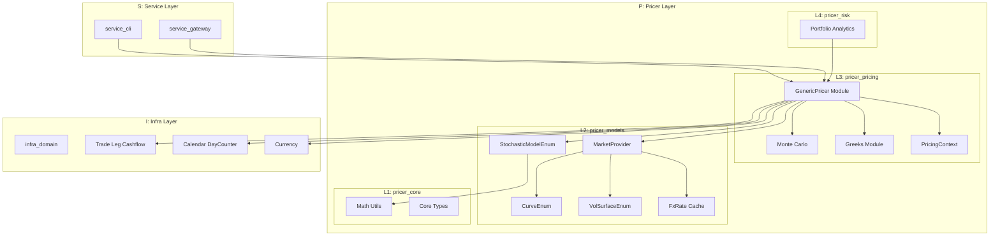
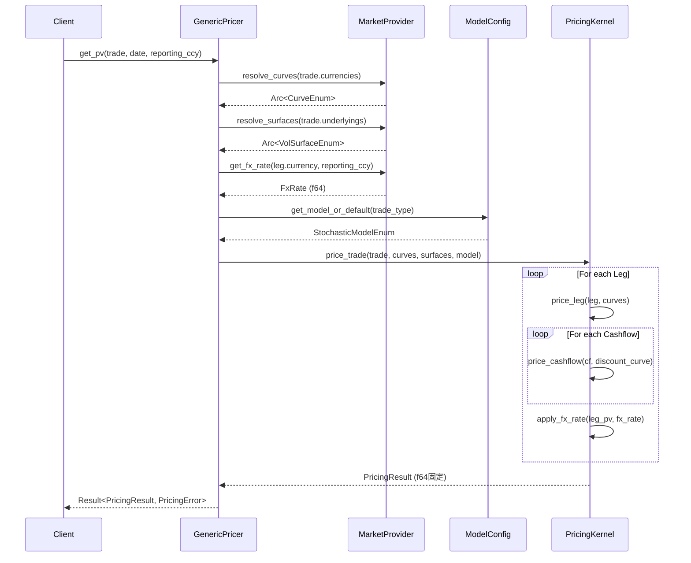

# Technical Design: Generic Pricer Engine

## Overview

**Purpose**: 本機能は、`pricer_pricing`クレート（L3層）に統一されたプライシングAPIを提供し、クオンツ開発者が様々な金融商品を一貫した方法で評価できるようにする。

**Users**: クオンツ開発者およびリスク管理者が、単一商品プライシング、ポートフォリオレベルのバッチプライシング、Greeks計算に使用する。

**Impact**: 既存の3-stage rocketパターンを拡張し、`generic_pricer/`モジュールとして新規追加。既存コードへの影響は最小限。

### Goals

- Trade/Leg/Cashflow階層に対応した統一プライシングAPI（`get_pv`, `get_greeks`）の提供
- `MarketProvider`、`StochasticModelEnum`、`CurveEnum`、`VolSurfaceEnum`との統合
- 任意の粒度（Cashflow、Leg、Trade、Path）でのPV内訳アクセス
- Rayon並列処理によるバッチプライシングサポート
- Enzyme AD互換性の維持

## Architecture

### Existing Architecture Analysis

**現行パターン**:
- 3-stage rocket: Definition (L2) → Linking (PricingContext) → Execution (pure kernel)
- `PricingContext`は`discount_curve`と`adjustment_vol`のみ保持
- 静的ディスパッチ（enum）でEnzyme最適化を維持

**尊重すべき既存境界**:
- A-I-P-S依存方向（pricer_pricingはinfra_domain、pricer_modelsに依存可、逆は不可）
- pricer_pricingはnightly Rust + Enzyme必須
- pricer_modelsのマーケットデータ構造（CurveEnum, VolSurfaceEnum, MarketProvider）

### Architecture Pattern & Boundary Map



**Architecture Integration**:
- **Selected pattern**: 新規モジュール追加（Option B）、既存の3-stage rocketを拡張
- **Domain boundaries**: `generic_pricer/`モジュールがTrade → PV変換の責務を持つ
- **Existing patterns preserved**: 静的ディスパッチ、Arc-cached market data、Builderパターン
- **New components rationale**: `GenericPricer`トレイト、`PricingResult`階層、`ModelConfig`/`PricerConfig`
- **Steering compliance**: A-I-P-S依存方向維持、Enzyme互換静的ディスパッチ

## System Flows

### Single Trade Pricing Flow



**Key Decisions**:
- `reporting_currency`は必須引数（リスク計算の前提条件）
- Stage 2（リンキング）でマーケットデータ解決（カーブ、サーフェス、FxRate）
- Stage 3（カーネル）ではHashMap lookupなし
- FxRateは`MarketProvider::get_fx_rate()`で直接取得（FxConverter廃止）
- `PricingResult`はf64固定（ADはget_greeks()のみ必要）
- 失敗時は`PricingError`で具体的なエラーコンテキストを返す

### Batch Pricing Flow

*[Mermaid diagram omitted]*

**Key Decisions**:
- マーケットデータは`Arc`で共有、各スレッドはread-onlyアクセス
- 部分失敗を許容し、成功/失敗を商品別に返す

---

## Requirements Traceability

| Requirement | Summary | Components | Interfaces | Flows |
|-------------|---------|------------|------------|-------|
| 1.1 | get_pv(valuation_date, reporting_ccy) | GenericPricer, PricingKernel | GenericPricer::get_pv | Single Trade Pricing |
| 1.2 | ※廃止（reporting_currencyはget_pvの必須引数） | - | - | - |
| 1.3 | get_greeks(date, config) | GenericPricer, GreeksCalculator | GenericPricer::get_greeks | Greeks Calculation |
| 1.4 | PricingResult<T>型 | PricingResult | - | - |
| 1.5 | MissingMarketDataエラー | PricingError | - | - |
| 2.1 | MarketProvider/MarketSnapshot | GenericPricerContext | GenericPricerContext::new | Single Trade Pricing |
| 2.2 | CurveEnumサポート | PricingKernel | - | - |
| 2.3 | VolSurfaceEnumサポート | PricingKernel | - | - |
| 2.4 | CurveSet解決 | MarketResolver | MarketProvider::resolve_curve | Single Trade Pricing |
| 2.5 | CurveNotFound/SurfaceNotFoundエラー | MarketDataError | - | - |
| 3.1 | ModelConfig構造体 | ModelConfig | ModelConfigBuilder | - |
| 3.2 | StochasticModelEnumサポート | PricingKernel | - | - |
| 3.3 | デフォルトモデル選択 | ModelSelector | ModelSelector::default_for | - |
| 3.4 | キャリブレーション連携 | ModelConfig | ModelConfig::from_calibration | - |
| 3.5 | ModelConfig Builder | ModelConfigBuilder | ModelConfigBuilder::build | - |
| 3.6 | InvalidModelParameterエラー | ConfigError | - | - |
| 4.1 | PricerConfig構造体 | PricerConfig | PricerConfigBuilder | - |
| 4.2 | AADモード | GreeksCalculator | GreeksConfig::mode | Greeks Calculation |
| 4.3 | BumpAndRevalueモード | GreeksCalculator | GreeksConfig::mode | Greeks Calculation |
| 4.4 | PricerConfig Builder | PricerConfigBuilder | PricerConfigBuilder::build | - |
| 4.5 | スレッドローカルバッファ | BufferPool | ThreadLocalPool | Batch Pricing |
| 5.1 | Trade入力 | GenericPricer | GenericPricer::price_trade | Single Trade Pricing |
| 5.2 | InstrumentEnum入力 | GenericPricer | GenericPricer::price_instrument | Single Trade Pricing |
| 5.3 | Leg/Cashflowパース | PricingKernel | - | Single Trade Pricing |
| 5.4 | 静的ディスパッチ | All enums | - | - |
| 5.5 | UnsupportedInstrumentエラー | PricingError | - | - |
| 6.1 | Currency列挙型 | All components | - | - |
| 6.2 | 為替レート換算 | GenericPricer | MarketProvider::get_fx_rate | Single Trade Pricing |
| 6.3 | PricingResult階層構造 | PricingResult, LegPricingResult, CashflowPricingResult | PricingResult::by_leg, by_cashflow | - |
| 6.4 | ※廃止（Leg単位でoriginal_currency保持、group_by_currency()で集計） | PricingResult | PricingResult::group_by_currency | - |
| 6.5 | by_leg() | PricingResult | PricingResult::by_leg | - |
| 6.6 | by_cashflow() | PricingResult | PricingResult::by_cashflow | - |
| 6.7 | by_path() | PricingResult | PricingResult::by_path | - |
| 6.8 | FxRateNotFoundエラー | MarketDataError | - | - |
| 6.9 | デフォルト通貨設定 | PricerConfig | PricerConfig::default_currency | - |
| 7.1 | Calendar/DayCounter/Frequency | DateUtils | - | - |
| 7.2 | 営業日調整 | DateUtils | Calendar::adjust | - |
| 7.3 | time_to_maturity計算 | DateUtils | DateUtils::year_fraction | - |
| 7.4 | カーブテナー補間 | CurveEnum | CurveEnum::discount_factor | - |
| 7.5 | NaiveDate使用 | All components | - | - |
| 8.1 | price_batch() | BatchPricer | BatchPricer::price_batch | Batch Pricing |
| 8.2 | Rayon並列処理 | BatchPricer | - | Batch Pricing |
| 8.3 | Arc-cachedマーケット | MarketProvider | - | Batch Pricing |
| 8.4 | BatchPricingResult | BatchPricingResult | - | - |
| 8.5 | 部分エラー継続 | BatchPricer | - | Batch Pricing |

---

## Components and Interfaces

### Summary Table

| Component | Domain/Layer | Intent | Req Coverage | Key Dependencies | Contracts |
|-----------|--------------|--------|--------------|------------------|-----------|
| GenericPricer | L3/generic_pricer | 統一プライシングAPI提供 | 1.1-1.5, 5.1-5.5, 6.2 | MarketProvider(P0), ModelConfig(P0), PricerConfig(P1) | Service |
| PricingKernel | L3/generic_pricer | Trade→PV変換の純粋計算 | 1.1, 5.3, 5.4 | CurveEnum(P0), VolSurfaceEnum(P1) | Service |
| ModelConfig | L3/generic_pricer | モデル・シミュレーション設定 | 3.1-3.6 | StochasticModelEnum(P0) | State |
| PricerConfig | L3/generic_pricer | プライサー設定 | 4.1-4.5, 6.9 | GreeksConfig(P0), Currency(P1) | State |
| PricingResult | L3/generic_pricer | 階層的プライシング結果（Leg単位） | 1.4, 6.3-6.7 | LegPricingResult(P0) | State |
| BatchPricer | L3/generic_pricer | バッチプライシング | 8.1-8.5 | GenericPricer(P0), Rayon(P0) | Service |
| DateUtils | L3/generic_pricer | 日付計算ヘルパー | 7.1-7.5 | infra_domain::time(P0) | Service |

**設計変更点**:
- `GenericPricer`: trait → concrete struct（単一実装で十分）
- `PricingResult`: `T: Float`ジェネリック → `f64`固定（ADはGreeksのみ必要）
- `CurrencyBreakdown`: 廃止 → Leg単位で通貨情報を保持（Enzyme AD互換性向上）
- `FxConverter`: 廃止 → `MarketProvider::get_fx_rate()`を直接使用（過剰な抽象化を排除）
- `get_pv()`: `reporting_currency`を必須引数に（リスク計算の前提条件）

---

### L3: pricer_pricing/generic_pricer

#### GenericPricer (Concrete Struct)

| Field | Detail |
|-------|--------|
| Intent | Trade/InstrumentEnumに対する統一プライシングAPI |
| Requirements | 1.1, 1.2, 1.3, 1.4, 1.5, 5.1, 5.2, 6.2 |

**Responsibilities & Constraints**
- TradeまたはInstrumentEnumを受け取り、`PricingResult`（f64固定）を返す
- `reporting_currency`を必須引数として受け取り、FX換算を実行
- マーケットデータ解決（Stage 2）とカーネル実行（Stage 3）の調整
- `get_greeks()`のみ`T: Float`ジェネリックでEnzyme AD対応

**Dependencies**
- Inbound: service_cli, service_gateway, pricer_risk — プライシングAPI呼び出し (P0)
- Outbound: MarketProvider — マーケットデータ取得、FxRate取得 (P0)
- Outbound: PricingKernel — 実際の計算実行 (P0)
- External: rayon — 並列処理 (P1)

**Contracts**: Service [x]

##### Service Interface

```rust
/// 汎用プライサー（具象構造体）
/// traitは不要 — 単一実装で十分
pub struct GenericPricer {
    /// 新しいGenericPricerを作成
    /// 評価日時点のPVを計算（報告通貨必須）
    /// reporting_currencyはリスク計算の前提条件
    /// Greeks計算（Enzyme AD対応、ジェネリック）
    // ... implementation omitted ...
```

- Preconditions: `trade`が有効なTrade構造、`valuation_date`が妥当な日付、`reporting_currency`が有効
- Postconditions: 成功時はPricingResult（f64）を返却、失敗時はPricingErrorで具体的理由
- Invariants: 同一入力に対して同一結果（決定論的、seedが同じ場合）

**Implementation Notes**
- Integration: 具象構造体として直接使用（traitなし）
- FX換算: `MarketProvider::get_fx_rate()`を直接呼び出し（FxConverterは不要）
- Validation: Trade有効性チェック、マーケットデータ存在確認
- Risks: マーケットデータ欠落時のエラーハンドリング

---

#### ModelConfig

| Field | Detail |
|-------|--------|
| Intent | モデルタイプとシミュレーションパラメータの設定 |
| Requirements | 3.1, 3.2, 3.3, 3.4, 3.5, 3.6 |

**Responsibilities & Constraints**
- `StochasticModelEnum`選択とシミュレーションパラメータ（パス数、ステップ数、シード）の保持
- Builderパターンで構築
- パラメータ検証（num_paths > 0、num_steps > 0等）

**Dependencies**
- Inbound: GenericPricer — モデル設定取得 (P0)
- Outbound: StochasticModelEnum — モデル定義 (P0)
- Outbound: pricer_models::market::calibration — キャリブレーション結果取得 (P1)

**Contracts**: State [x]

##### State Management

```rust
/// モデル構成
#[derive(Debug, Clone)]
pub struct ModelConfig {
    /// 使用するモデル（None時はデフォルト選択）
    /// シミュレーションパス数
    /// 時間ステップ数
    /// 乱数シード（再現性確保用）
/// ModelConfig Builder
#[derive(Debug, Default)]
    // ... implementation omitted ...
```

- Persistence: メモリ内のみ（永続化なし）
- Consistency: 不変（immutable after build）
- Concurrency: Clone可能、スレッド間共有安全

---

#### PricerConfig

| Field | Detail |
|-------|--------|
| Intent | Greeks計算モードと出力設定 |
| Requirements | 4.1, 4.2, 4.3, 4.4, 4.5, 6.9 |

**Responsibilities & Constraints**
- GreeksConfig（計算モード、バンプ幅）の保持
- デフォルト出力通貨の設定
- スレッドローカルバッファ使用フラグ

**Dependencies**
- Inbound: GenericPricer — 設定取得 (P0)
- Outbound: GreeksConfig — Greeks設定 (P0)
- Outbound: Currency — 通貨定義 (P1)

**Contracts**: State [x]

##### State Management

```rust
/// プライサー構成
#[derive(Debug, Clone)]
pub struct PricerConfig {
    /// Greeks計算設定
    /// デフォルト出力通貨
    /// スレッドローカルバッファ使用
/// PricerConfig Builder
#[derive(Debug, Default)]
pub struct PricerConfigBuilder {
    // ... implementation omitted ...
```

---

#### PricingResult

| Field | Detail |
|-------|--------|
| Intent | 階層的プライシング結果（Trade → Leg → Cashflow）、f64固定 |
| Requirements | 1.4, 6.3, 6.5, 6.6, 6.7 |

**Responsibilities & Constraints**
- Trade/Leg/Cashflow階層に対応したPV内訳の保持
- **Leg単位で通貨情報を保持**（CurrencyBreakdown廃止、Enzyme AD互換性向上）
- MCシミュレーション時のパス分布（オプション）
- **f64固定**（ADはget_greeks()のみ必要、PV結果にはジェネリック不要）

**Dependencies**
- Inbound: GenericPricer — 結果返却 (P0)
- Outbound: LegPricingResult — Leg単位結果 (P0)

**Contracts**: State [x]

##### State Management

```rust
/// プライシング結果（Trade単位、f64固定）
/// ADはget_greeks()のみ必要なため、PricingResultはジェネリック不要
#[derive(Debug, Clone)]
pub struct PricingResult {
    /// 合計PV（報告通貨建て）
    /// 各Legの結果
    /// パス分布（MC計算時のみ）
    /// 報告通貨
    /// Leg単位のPV集計を返す
    // ... implementation omitted ...
```

**設計根拠**:
- `CurrencyBreakdown`廃止: `HashMap<Currency, T>`はEnzyme ADと相性が悪い（動的割り当て）
- Leg単位で`original_currency`と`fx_rate`を保持することで、必要時に`group_by_currency()`で集計可能
- `f64`固定: PV計算結果にADは不要、`get_greeks()`のみがEnzyme対応必要

---

#### BatchPricer

| Field | Detail |
|-------|--------|
| Intent | 複数商品の並列バッチプライシング |
| Requirements | 8.1, 8.2, 8.3, 8.4, 8.5 |

**Responsibilities & Constraints**
- Rayon並列処理による複数商品同時プライシング
- Arc-cachedマーケットデータの共有
- 部分失敗時の継続処理
- スレッドローカルバッファプールの管理

**Dependencies**
- Inbound: service_cli, pricer_risk — バッチ呼び出し (P0)
- Outbound: GenericPricer — 個別プライシング (P0)
- Outbound: MarketProvider — マーケットデータ共有 (P0)
- External: rayon — 並列処理 (P0)

**Contracts**: Service [x]

##### Service Interface

```rust
/// バッチプライサー
pub struct BatchPricer<'a> {
    /// バッチプライシング実行
/// バッチプライシング結果
#[derive(Debug)]
pub struct BatchPricingResult {
    /// 成功したプライシング結果
    /// 失敗したプライシング
    /// 処理統計
    // ... implementation omitted ...
```

- Preconditions: `trades`が空でない、`market`が有効
- Postconditions: 全商品が成功または失敗として分類
- Invariants: 部分失敗でも他商品の処理は継続

---

---

**FxConverter廃止**:
- `FxConverter`は過剰な抽象化のため削除
- FX換算は`GenericPricer`内で`MarketProvider::get_fx_rate()`を直接呼び出し
- クロスレート計算が必要な場合は`MarketProvider`側で対応

---

## Data Models

### Domain Model

*[Mermaid diagram omitted]*

**Aggregates**:
- `PricingResult`: 単一プライシングの結果集約
- `BatchPricingResult`: バッチプライシングの結果集約

**Entities**:
- `Trade`, `Leg`, `Cashflow`（既存、infra_domain）

**Value Objects**:
- `ModelConfig`, `PricerConfig`, `CurrencyBreakdown`, `PathDistribution`

**Invariants**:
- `PricingResult.total_pv` = Σ(legs.pv * direction.sign())
- `CurrencyBreakdown.total_pv` = Σ(pv_by_currency.values())変換後

---

## Error Handling

### Error Strategy

Generic Pricer Engineは以下のエラー戦略を採用:

1. **Fail Fast**: 入力検証（Trade構造、設定パラメータ）は早期に実行
2. **Graceful Degradation**: バッチ処理では部分失敗を許容
3. **Contextual Errors**: エラーメッセージに具体的なコンテキスト（TradeId、通貨ペア等）を含む

### Error Categories and Responses

**User Errors (4xx equivalent)**:
- `ConfigError::InvalidModelParameter` — 不正なモデルパラメータ（num_paths = 0等）
- `PricingError::UnsupportedInstrument` — 未対応の商品タイプ

**System Errors (5xx equivalent)**:
- `PricingError::MissingMarketData` — 必要なマーケットデータが欠落
- `MarketDataError::CurveNotFound` — 指定されたカーブが存在しない
- `MarketDataError::SurfaceNotFound` — 指定されたサーフェスが存在しない
- `MarketDataError::FxRateNotFound` — 為替レートが利用不可

**Business Logic Errors**:
- モデルキャリブレーション失敗 — CalibrationError

### Error Types Extension

```rust
/// ConfigError: 設定関連エラー
#[derive(Debug, Clone, thiserror::Error)]
pub enum ConfigError {
    #[error("Invalid model parameter: {0}")]
    #[error("Invalid pricer config: {0}")]
/// MarketDataError拡張（既存に追加）
#[derive(Debug, Clone, thiserror::Error)]
pub enum MarketDataError {
    #[error("FX rate not found: {base}/{quote}")]
    // ... implementation omitted ...
```

---

## Testing Strategy

### Unit Tests

- `ModelConfig::validate()` — パラメータ検証（num_paths > 0、num_steps > 0）
- `PricerConfig::validate()` — 設定検証（default_currency有効性）
- `PricingResult::by_leg()` — Leg単位集計の正確性
- `PricingResult::by_cashflow()` — Cashflow単位集計の正確性
- `CurrencyBreakdown::from_legs()` — 通貨別集計の正確性

### Integration Tests

- `GenericPricer::get_pv()` — Trade → PV変換のE2E
- `GenericPricer::get_pv_with_currency()` — 通貨換算を含むプライシング
- `BatchPricer::price_batch()` — 並列バッチプライシング
- `FxConverter::convert()` — 為替換算の正確性
- Market data resolution — CurveSet/VolSurfaceEnum解決

### Performance Tests

- バッチプライシング並列効率 — 8コアで80%以上のスケーリング
- メモリ使用量 — 1000商品バッチで許容範囲内
- スレッドローカルバッファ効果 — アロケーション削減の確認

---

## Optional Sections
