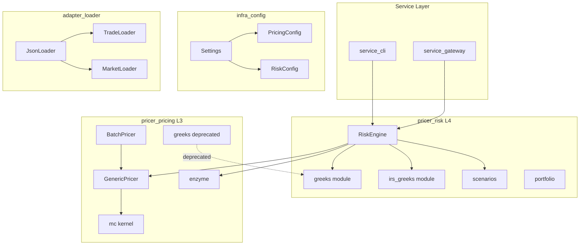
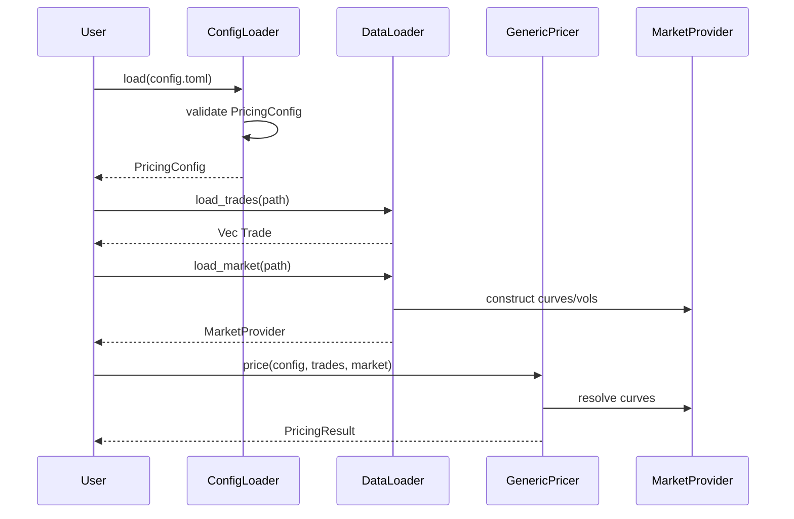
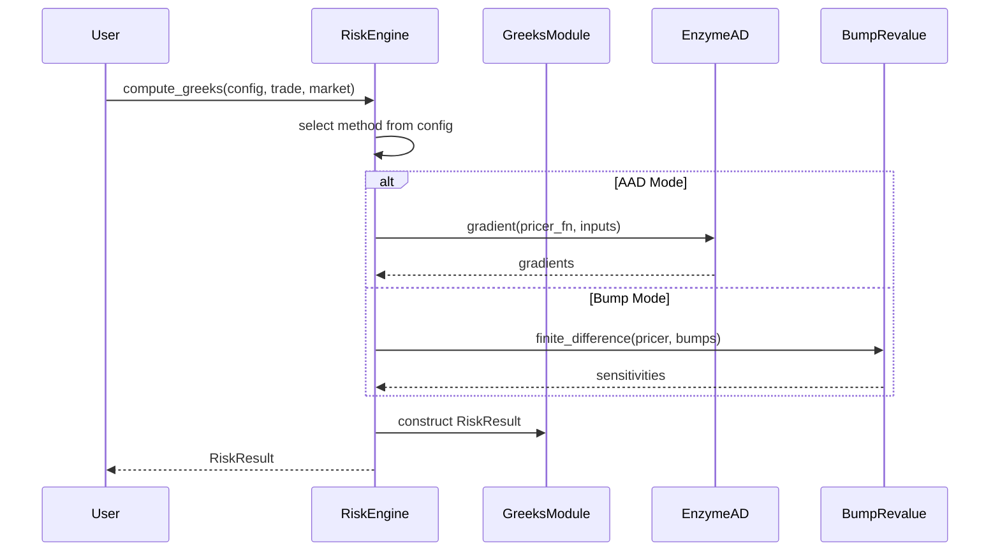
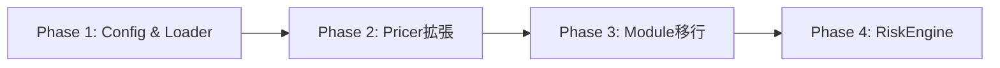
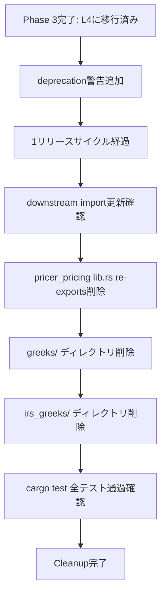

# Technical Design: generic-pricing-risk-engine

## Overview

**Purpose**: 本機能は、計算設定ファイル（TOML/JSON）と入力データ（約定・マーケット・CSA）に基づく汎用プライシングエンジンおよびリスク計算エンジンを提供する。クオンツ開発者・リスク管理者・運用担当者が、単一取引からポートフォリオレベルまで一貫したインターフェースで価格計算とGreeks計算を実行可能にする。

**Users**: クオンツ開発者（設定駆動型計算パイプライン構築）、リスク管理者（ポートフォリオGreeks集約）、運用担当者（エラー診断・監視）

**Impact**: 既存`pricer_pricing::greeks`/`irs_greeks`モジュールを`pricer_risk`へ移行し、L4クレートをリスク計算の中心とする。`infra_config`に計算設定スキーマを追加、`adapter_loader`にJSONローダーを追加する。

### Goals

- 計算設定ファイル（TOML/JSON）による価格計算・リスク計算パラメータの一元管理
- 単一取引およびポートフォリオレベルの汎用プライシング
- AAD/Bump選択可能な汎用リスク計算エンジン（`pricer_risk::engine::RiskEngine`）
- `greeks/`・`irs_greeks/`モジュールのL3→L4移行（段階的deprecation）
- Service層（service_cli/service_gateway）との統合準備

### Non-Goals

- 新規商品モデル（Instrument）の追加
- Enzyme AADの実装変更（既存L3実装を利用）
- service_cli/service_gatewayの再有効化（統合ポイント定義のみ）
- リアルタイムストリーミング価格配信

## Architecture

### Existing Architecture Analysis

**現行パターン**:
- A-I-P-S階層: Adapter→Infra→Pricer(L1-L4)→Service
- L3 (`pricer_pricing`): Enzyme AD、MC kernel、`greeks/`、`irs_greeks/`
- L4 (`pricer_risk`): portfolio/, exposure/, xva/, scenarios/
- 依存方向: L4→L3→L2→L1（逆方向禁止）

**維持すべき制約**:
- Feature flag: `l1l2-integration`, `enzyme-ad` による条件コンパイル
- Builder pattern: `ModelConfig`, `PricerConfig`, `GreeksConfig`
- 構造化エラー: `thiserror::Error` + variant-specific context

**解消する技術的負債**:
- `greeks/`/`irs_greeks/`のL3配置（リスク計算責務がL3に分散）

### Architecture Pattern & Boundary Map



**Architecture Integration**:
- **Selected pattern**: Facade Pattern — `RiskEngine` がL4統合ファサードとして既存コンポーネントを統合
- **Domain boundaries**: 設定(infra_config) / ローダー(adapter_loader) / プライシング(L3) / リスク(L4) / サービス(Service)
- **Existing patterns preserved**: Builder pattern, Feature flag, 構造化エラー, Rayon並列
- **New components rationale**: `RiskEngine`(統合API)、`JsonLoader`(新データソース)、`PricingConfig`/`RiskConfig`(設定駆動化)
- **Steering compliance**: A-I-P-S依存方向、British English命名

### Technology Stack

| Layer | Choice / Version | Role in Feature | Notes |
|-------|------------------|-----------------|-------|
| Backend / Pricer | Rust nightly-2025-01-15 | L3 Enzyme AD integration | enzyme-ad feature時のみ |
| Backend / Risk | Rust stable | L4 RiskEngine, greeks移行 | 通常ビルドはstable |
| Config | config 0.14+ / toml 0.8+ | TOML/JSON設定読み込み | 既存Settingsパターン |
| Serialization | serde 1.x / serde_json 1.x | JSON入出力 | 既存パターン |
| Parallelism | rayon 1.x | ポートフォリオ並列処理 | 既存BatchPricer活用 |
| Error Handling | thiserror 2.x | 構造化エラー型 | 既存パターン |

## System Flows

### 設定駆動プライシングフロー



### リスク計算フロー



**Key Decisions**:
- AAD/Bump選択は`RiskConfig.greeks_method`で決定
- L4 `RiskEngine`からL3 `enzyme::gradient`を直接呼び出し（依存方向遵守）

## Requirements Traceability

| Requirement | Summary | Components | Interfaces | Flows |
|-------------|---------|------------|------------|-------|
| 1.1-1.5 | 計算設定ファイル構造 | PricingConfig, RiskConfig, ConfigLoader | Settings, ConfigError | 設定読み込み |
| 2.1-2.5 | 入力データローダー | JsonLoader, TradeLoader, MarketLoader | DataLoader trait, LoaderError | データ読み込み |
| 3.1-3.5 | 単一取引プライシング | GenericPricer拡張 | price_with_config() | プライシングフロー |
| 4.1-4.5 | ポートフォリオプライシング | PortfolioPricer | price_portfolio() | ポートフォリオフロー |
| 5.1-5.5 | リスク計算エンジン | RiskEngine | compute_greeks() | リスク計算フロー |
| 6.1-6.5 | モジュール移行 | greeks/, irs_greeks/ (L4) | deprecated re-exports (L3) | N/A |
| 7.1-7.5 | リスク設定柔軟性 | RiskConfig, BumpConfig | per-factor bump sizes | リスク計算フロー |
| 8.1-8.5 | エラーハンドリング | PricingError, RiskError, ConfigError | diagnostic fields | 全フロー |
| 9.1-9.5 | Service統合準備 | async wrappers | JSON-serializable types | Service呼び出し |

## Components and Interfaces

| Component | Domain/Layer | Intent | Req Coverage | Key Dependencies | Contracts |
|-----------|--------------|--------|--------------|------------------|-----------|
| PricingConfig | infra_config | 価格計算パラメータ定義 | 1.1-1.5 | Settings (P0) | State |
| RiskConfig | infra_config | リスク計算パラメータ定義 | 1.1-1.5, 7.1-7.5 | Settings (P0) | State |
| JsonLoader | adapter_loader | JSONファイル読み込み | 2.1-2.5 | serde_json (P0) | Service |
| TradeLoader | adapter_loader | 約定データ変換 | 2.1 | infra_master::Trade (P0) | Service |
| MarketLoader | adapter_loader | マーケットデータ変換 | 2.2 | pricer_models::Market (P0) | Service |
| GenericPricer拡張 | pricer_pricing | 設定駆動プライシング | 3.1-3.5 | ModelConfig (P0), MarketProvider (P0) | Service |
| PortfolioPricer | pricer_pricing | ポートフォリオ並列処理 | 4.1-4.5 | BatchPricer (P0), Rayon (P1) | Service |
| RiskEngine | pricer_risk | 統合リスク計算ファサード | 5.1-5.5, 9.1-9.5 | enzyme (P0), GreeksConfig (P0) | Service, API |
| greeks (L4) | pricer_risk | Greeks計算型・設定 | 6.1-6.4 | num_traits (P1) | State |
| irs_greeks (L4) | pricer_risk | IRS Greeks計算 | 6.1-6.2 | greeks (P0) | Service |
| RiskResult | pricer_risk | リスク計算結果 | 5.5, 8.2 | serde (P1) | State |

### infra_config Layer

#### PricingConfig

| Field | Detail |
|-------|--------|
| Intent | 価格計算パラメータの構造化定義 |
| Requirements | 1.1, 1.3, 1.4, 1.5 |

**Responsibilities & Constraints**
- 価格計算に必要なすべてのパラメータを単一構造体で管理
- TOML/JSON両形式からのデシリアライズをサポート
- 必須フィールドのバリデーション（valuation_date, currency）

**Dependencies**
- Inbound: Settings — 設定ファイル統合 (P0)
- External: serde, chrono — シリアライズ、日付処理 (P1)

**Contracts**: State [x]

##### State Management

```rust
#[derive(Debug, Clone, Deserialize, Serialize)]
pub struct PricingConfig {
    /// 評価日（YYYY-MM-DD形式）
    pub valuation_date: chrono::NaiveDate,
    /// 報告通貨
    pub reporting_currency: String,
    /// プライシング手法（"analytical" | "monte_carlo"）
    #[serde(default = "default_pricing_method")]
    pub pricing_method: PricingMethod,
    /// モンテカルロパラメータ（monte_carlo時のみ）
    #[serde(default)]
    pub monte_carlo: Option<MonteCarloParams>,
    /// マーケットデータパス
    pub market_data_path: PathBuf,
    /// 約定データパス
    pub trade_data_path: PathBuf,
    /// CSAデータパス（オプション）
    #[serde(default)]
    pub csa_data_path: Option<PathBuf>,
    /// 並列処理有効化
    #[serde(default = "default_true")]
    pub parallel_enabled: bool,
}

#[derive(Debug, Clone, Deserialize, Serialize, Default)]
pub enum PricingMethod {
    #[default]
    Analytical,
    MonteCarlo,
}

#[derive(Debug, Clone, Deserialize, Serialize)]
pub struct MonteCarloParams {
    pub num_paths: usize,
    pub num_steps: usize,
    #[serde(default)]
    pub seed: Option<u64>,
}
```

- Persistence: 設定ファイル（config/*.toml）から読み込み
- Consistency: 起動時に一度読み込み、ランタイム中は不変
- Concurrency: Read-only、Arc共有可能

**Implementation Notes**
- Integration: 既存`Settings::load()`に`pricing`セクション追加
- Validation: `PricingConfig::validate() -> Result<(), ConfigError>` で全フィールド検証
- Risks: 設定ファイルパスの存在確認は読み込み時に実施

#### RiskConfig

| Field | Detail |
|-------|--------|
| Intent | リスク計算パラメータの構造化定義 |
| Requirements | 1.2, 7.1-7.5 |

**Responsibilities & Constraints**
- Greeks計算手法（AAD/Bump）の選択
- リスクファクター種別ごとのbump size設定
- 計算対象Greeksの選択

**Dependencies**
- Inbound: Settings — 設定ファイル統合 (P0)
- External: serde — シリアライズ (P1)

**Contracts**: State [x]

##### State Management

```rust
#[derive(Debug, Clone, Deserialize, Serialize)]
pub struct RiskConfig {
    /// Greeks計算手法
    #[serde(default)]
    pub greeks_method: GreeksMethod,
    /// bump size設定
    #[serde(default)]
    pub bump_sizes: BumpSizes,
    /// 計算対象Greeks
    #[serde(default)]
    pub target_greeks: Vec<GreekType>,
    /// 二次Greeks計算時の並列/直列選択
    #[serde(default)]
    pub second_order_mode: SecondOrderMode,
    /// シナリオベースGreeks設定
    #[serde(default)]
    pub scenarios: Option<ScenarioConfig>,
}

#[derive(Debug, Clone, Deserialize, Serialize, Default)]
pub enum GreeksMethod {
    #[default]
    Bump,
    Aad,
}

#[derive(Debug, Clone, Deserialize, Serialize)]
pub struct BumpSizes {
    /// Rate bump (default: 1bp = 0.0001)
    #[serde(default = "default_rate_bump")]
    pub rate: f64,
    /// Vol bump (default: 1% = 0.01)
    #[serde(default = "default_vol_bump")]
    pub vol: f64,
    /// Spot bump (default: 1% = 0.01)
    #[serde(default = "default_spot_bump")]
    pub spot: f64,
}

#[derive(Debug, Clone, Copy, Deserialize, Serialize)]
pub enum GreekType {
    Delta, Gamma, Vega, Theta, Rho, Vanna, Volga,
}

#[derive(Debug, Clone, Deserialize, Serialize, Default)]
pub enum SecondOrderMode {
    #[default]
    Parallel,
    Serial,
}
```

**Implementation Notes**
- Integration: 既存`Settings::load()`に`risk`セクション追加
- Validation: `enzyme-ad` feature無効時にAAD選択でエラー

### adapter_loader Layer

#### JsonLoader

| Field | Detail |
|-------|--------|
| Intent | JSONファイルの汎用読み込みとパース |
| Requirements | 2.1-2.5 |

**Responsibilities & Constraints**
- JSONファイルからの型付きデシリアライズ
- globパターンによるバッチ読み込み
- パースエラー時の詳細な位置情報提供

**Dependencies**
- External: serde_json, glob — JSON解析、ファイルマッチング (P0)

**Contracts**: Service [x]

##### Service Interface

```rust
pub struct JsonLoader;

impl JsonLoader {
    /// 単一JSONファイルを読み込み
    pub fn load<T: DeserializeOwned>(path: impl AsRef<Path>) -> Result<T, LoaderError>;

    /// globパターンで複数ファイルを読み込み
    pub fn load_glob<T: DeserializeOwned>(pattern: &str) -> Result<Vec<T>, LoaderError>;
}
```

- Preconditions: ファイルパスが存在し読み取り可能
- Postconditions: 有効なJSON構造かつ型Tにデシリアライズ可能
- Invariants: ファイルシステムへの副作用なし

#### TradeLoader

| Field | Detail |
|-------|--------|
| Intent | 約定JSONデータをTrade構造体に変換 |
| Requirements | 2.1 |

**Responsibilities & Constraints**
- JSONスキーマから`infra_master::trade::Trade`への変換
- 必須フィールド検証（trade_id, instrument, currency）

**Dependencies**
- Inbound: JsonLoader — ファイル読み込み (P0)
- Outbound: infra_master::trade — Trade型 (P0)

**Contracts**: Service [x]

##### Service Interface

```rust
pub struct TradeLoader;

impl TradeLoader {
    /// 約定JSONを読み込みTradeに変換
    pub fn load(path: impl AsRef<Path>) -> Result<Trade, LoaderError>;

    /// 複数約定を読み込み
    pub fn load_portfolio(path: impl AsRef<Path>) -> Result<Vec<Trade>, LoaderError>;
}
```

#### MarketLoader

| Field | Detail |
|-------|--------|
| Intent | マーケットデータJSONをMarketProvider構築用オブジェクトに変換 |
| Requirements | 2.2 |

**Responsibilities & Constraints**
- カーブ、ボラティリティサーフェスのJSON→構造体変換
- MarketProviderへのデータ投入

**Dependencies**
- Inbound: JsonLoader — ファイル読み込み (P0)
- Outbound: pricer_models::market — CurveEnum, VolSurfaceEnum (P0)

**Contracts**: Service [x]

##### Service Interface

```rust
pub struct MarketLoader;

impl MarketLoader {
    /// マーケットデータJSONを読み込み
    pub fn load(path: impl AsRef<Path>) -> Result<MarketData, LoaderError>;
}

pub struct MarketData {
    pub curves: Vec<CurveData>,
    pub vol_surfaces: Vec<VolSurfaceData>,
    pub fx_spots: HashMap<CurrencyPair, f64>,
}
```

### pricer_pricing Layer (Extensions)

#### GenericPricer拡張

| Field | Detail |
|-------|--------|
| Intent | 設定ファイル駆動のプライシングインターフェース追加 |
| Requirements | 3.1-3.5 |

**Responsibilities & Constraints**
- 既存`GenericPricer`への設定読み込みコンストラクタ追加
- `PricingConfig`からの`ModelConfig`/`PricerConfig`自動構築

**Dependencies**
- Inbound: PricingConfig — 計算設定 (P0)
- Outbound: ModelConfig, PricerConfig — 既存設定型 (P0)

**Contracts**: Service [x]

##### Service Interface

```rust
impl GenericPricer {
    /// 設定ファイルからプライサーを構築
    pub fn from_config(config: &PricingConfig) -> Result<Self, ConfigError>;

    /// 設定駆動プライシング
    pub fn price_with_config(
        &self,
        trade: &Trade,
        market: &MarketProvider,
        config: &PricingConfig,
    ) -> Result<PricingResult, PricingError>;
}
```

#### PortfolioPricer

| Field | Detail |
|-------|--------|
| Intent | ポートフォリオレベルの集約付き並列プライシング |
| Requirements | 4.1-4.5 |

**Responsibilities & Constraints**
- 通貨/netting set/book別の集約
- 個別取引失敗時も全体継続（partial success）
- 実行統計（成功/失敗数、処理時間）

**Dependencies**
- Inbound: BatchPricer — 並列処理基盤 (P0)
- External: rayon — 並列イテレータ (P1)

**Contracts**: Service [x]

##### Service Interface

```rust
pub struct PortfolioPricer {
    pricer: GenericPricer,
    config: PricingConfig,
}

impl PortfolioPricer {
    pub fn new(config: &PricingConfig) -> Result<Self, ConfigError>;

    pub fn price_portfolio(
        &self,
        trades: &[Trade],
        market: &MarketProvider,
    ) -> PortfolioPricingResult;
}

pub struct PortfolioPricingResult {
    pub successes: Vec<(TradeId, PricingResult)>,
    pub failures: Vec<(TradeId, PricingError)>,
    pub aggregations: PortfolioAggregations,
    pub stats: ExecutionStats,
}

pub struct PortfolioAggregations {
    pub by_currency: HashMap<Currency, f64>,
    pub by_netting_set: HashMap<NettingSetId, f64>,
    pub by_book: HashMap<String, f64>,
}

pub struct ExecutionStats {
    pub total_count: usize,
    pub success_count: usize,
    pub failure_count: usize,
    pub elapsed_ms: u64,
}
```

### pricer_risk Layer

#### RiskEngine

| Field | Detail |
|-------|--------|
| Intent | 統合リスク計算ファサード（AAD/Bump選択、単一/ポートフォリオ対応） |
| Requirements | 5.1-5.5, 9.1-9.5 |

**Responsibilities & Constraints**
- `RiskConfig`に基づくGreeks計算手法の選択
- L3 `enzyme::gradient`への委譲（AADモード時）
- 既存`scenarios::*`との統合
- async-compatibleインターフェース提供

**Dependencies**
- Inbound: RiskConfig — リスク計算設定 (P0)
- Outbound: enzyme — AAD計算 (P0), GreeksAggregator — 集約 (P1)
- External: pricer_pricing::enzyme — gradient関数 (P0)

**Contracts**: Service [x] / API [x]

##### Service Interface

```rust
pub struct RiskEngine {
    config: RiskConfig,
}

impl RiskEngine {
    pub fn new(config: RiskConfig) -> Self;

    /// 単一取引のGreeks計算
    pub fn compute_greeks(
        &self,
        trade: &Trade,
        market: &MarketProvider,
    ) -> Result<RiskResult, RiskError>;

    /// ポートフォリオGreeks計算
    pub fn compute_portfolio_greeks(
        &self,
        trades: &[Trade],
        market: &MarketProvider,
    ) -> Result<PortfolioRiskResult, RiskError>;

    /// async wrapper for Service layer
    pub async fn compute_greeks_async(
        &self,
        trade: &Trade,
        market: &MarketProvider,
    ) -> Result<RiskResult, RiskError>;
}
```

- Preconditions: market contains required curves/surfaces
- Postconditions: RiskResult contains requested Greeks
- Invariants: AAD mode requires enzyme-ad feature

##### API Contract

| Method | Endpoint | Request | Response | Errors |
|--------|----------|---------|----------|--------|
| POST | /api/risk/greeks | GreeksRequest | RiskResult | 400, 422, 500 |
| POST | /api/risk/portfolio-greeks | PortfolioGreeksRequest | PortfolioRiskResult | 400, 422, 500 |

**Implementation Notes**
- Integration: `demo/gui/web/risk_engine_handlers.rs` + `risk_engine_types.rs`
- Validation: `enzyme-ad` feature check at runtime for AAD mode
- Risks: Enzyme nightly dependency propagation

#### greeks (L4移行)

| Field | Detail |
|-------|--------|
| Intent | Greeks計算型・設定をL4で正式公開 |
| Requirements | 6.1, 6.4 |

**Responsibilities & Constraints**
- `GreeksConfig`, `GreeksMode`, `GreeksResult<T>`の提供
- L3からのdeprecated re-export維持（移行期間）

**Dependencies**
- Outbound: num_traits — Float trait bound (P1)

**Contracts**: State [x]

##### State Management

```rust
// pricer_risk/src/greeks/mod.rs
pub use config::{GreeksConfig, GreeksConfigBuilder, GreeksConfigError, GreeksMode};
pub use error::GreeksError;
pub use result::GreeksResult;

// pricer_pricing/src/lib.rs (deprecated re-export)
#[deprecated(since = "0.8.0", note = "Use pricer_risk::greeks instead")]
pub use pricer_risk::greeks::{GreeksConfig, GreeksMode, GreeksResult};
```

#### RiskResult

| Field | Detail |
|-------|--------|
| Intent | リスク計算結果の構造化 |
| Requirements | 5.5, 8.2 |

**Responsibilities & Constraints**
- 計算されたGreeks値
- 使用した計算手法
- パフォーマンスメトリクス

**Dependencies**
- External: serde — JSON serialization (P1)

**Contracts**: State [x]

##### State Management

```rust
#[derive(Debug, Clone, Serialize, Deserialize)]
pub struct RiskResult {
    pub trade_id: String,
    pub greeks: ComputedGreeks,
    pub method: GreeksMethod,
    pub metrics: PerformanceMetrics,
}

#[derive(Debug, Clone, Serialize, Deserialize)]
pub struct ComputedGreeks {
    pub delta: Option<f64>,
    pub gamma: Option<f64>,
    pub vega: Option<f64>,
    pub theta: Option<f64>,
    pub rho: Option<f64>,
    pub vanna: Option<f64>,
    pub volga: Option<f64>,
}

#[derive(Debug, Clone, Serialize, Deserialize)]
pub struct PerformanceMetrics {
    pub computation_time_ms: u64,
    pub memory_usage_bytes: Option<u64>,
}

#[derive(Debug, Clone, Serialize, Deserialize)]
pub struct PortfolioRiskResult {
    pub results: Vec<RiskResult>,
    pub failures: Vec<(String, RiskError)>,
    pub aggregations: AggregatedGreeks,
    pub stats: ExecutionStats,
}

#[derive(Debug, Clone, Serialize, Deserialize)]
pub struct AggregatedGreeks {
    pub by_risk_factor: HashMap<RiskFactorId, f64>,
    pub by_currency: HashMap<String, ComputedGreeks>,
    pub by_tenor_bucket: HashMap<String, f64>,
}
```

## Data Models

### Domain Model

**Aggregates**:
- `Portfolio`: 取引コレクションのルートエンティティ
- `Trade`: 個別取引エンティティ
- `MarketProvider`: マーケットデータ集約

**Value Objects**:
- `PricingConfig`, `RiskConfig`: 不変設定オブジェクト
- `PricingResult`, `RiskResult`: 計算結果

**Domain Events**:
- 本機能ではイベント発行なし（同期計算）

### Logical Data Model

**Configuration Schema** (TOML):

```toml
[pricing]
valuation_date = "2026-01-25"
reporting_currency = "USD"
pricing_method = "monte_carlo"
market_data_path = "data/market.json"
trade_data_path = "data/trades.json"
parallel_enabled = true

[pricing.monte_carlo]
num_paths = 100000
num_steps = 252

[risk]
greeks_method = "bump"
target_greeks = ["delta", "gamma", "vega"]
second_order_mode = "parallel"

[risk.bump_sizes]
rate = 0.0001
vol = 0.01
spot = 0.01
```

**Trade JSON Schema**:

```json
{
  "trade_id": "T001",
  "instrument": {
    "type": "vanilla_option",
    "strike": 100.0,
    "expiry": "2026-06-25",
    "payoff": "call",
    "exercise": "european"
  },
  "currency": "USD",
  "counterparty_id": "CP001",
  "netting_set_id": "NS001",
  "notional": 1000000.0
}
```

## Error Handling

### Error Strategy

- **Fail Fast**: 設定バリデーションは起動時に完全実施
- **Partial Success**: ポートフォリオ計算は個別失敗を記録し継続
- **Structured Context**: 全エラーにtrade_id、データ識別子、計算ステップを含む

### Error Categories and Responses

**Configuration Errors (ConfigError)**:
- `MissingField { field }`: 必須フィールド欠落
- `InvalidValue { field, reason }`: 値検証失敗
- `FileNotFound { path }`: 設定ファイル不在
- `ParseError { path, location, message }`: パース失敗

**Pricing Errors (PricingError)**:
- 既存エラー型を拡張（`MissingMarketData`, `UnsupportedInstrument`等）

**Risk Errors (RiskError)**:

```rust
#[derive(Debug, Clone, Error)]
pub enum RiskError {
    #[error("Greeks calculation failed: {reason} (trade_id: {trade_id:?})")]
    CalculationFailed {
        trade_id: Option<String>,
        reason: String,
        partial_results: Option<ComputedGreeks>,
    },

    #[error("AAD mode requires enzyme-ad feature")]
    AadNotAvailable,

    #[error("Numerical instability: {description} (value: {value})")]
    NumericalInstability {
        description: String,
        value: f64,
        suggested_mitigation: String,
    },

    #[error("Market data error: {0}")]
    MarketData(#[from] PricingError),

    #[error("Configuration error: {0}")]
    Config(#[from] ConfigError),
}
```

### Monitoring

- 全エラーは`tracing::error!`でログ出力
- `PerformanceMetrics`で計算時間を記録
- 失敗率はExecutionStats経由で取得可能

## Testing Strategy

### Unit Tests

- `PricingConfig::validate()` — 必須フィールド検証
- `RiskConfig::validate()` — bump_sizes範囲検証
- `JsonLoader::load<T>()` — 型別デシリアライズ
- `RiskEngine::select_method()` — AAD/Bump選択ロジック
- `PortfolioAggregations::aggregate()` — 通貨/netting set集約

### Integration Tests

- 設定ファイル読み込み→プライシング→結果検証
- ポートフォリオ並列処理（Rayon）→集約検証
- AADモード（enzyme-ad feature有効時）→Bumpモードとの結果比較
- L3 deprecated import → コンパイル警告確認

### E2E/UI Tests

- Demo GUI: `/api/risk/greeks` エンドポイント呼び出し
- Demo GUI: `/api/risk/portfolio-greeks` バッチ処理

### Performance Tests

- ポートフォリオ1000取引並列処理のスループット
- AAD vs Bump 速度比較（10+ テナー）
- メモリ使用量監視（MemoryMonitor統合）

## Optional Sections

### Security Considerations

- 設定ファイルパスのディレクトリトラバーサル防止（`canonicalize()`使用）
- 認証情報は設定ファイルに含めない（環境変数経由）

### Performance & Scalability

- ポートフォリオ並列処理: Rayon work-stealing
- AADメモリ効率: 既存checkpointing機構活用
- 大規模ポートフォリオ: バッチサイズ制御（`parallel::DEFAULT_BATCH_SIZE`）

### Migration Strategy

**Phase 1: 設定・ローダー追加** (非破壊的)
- `infra_config`に`PricingConfig`, `RiskConfig`追加
- `adapter_loader`に`json/`モジュール追加

**Phase 2: Pricer拡張** (非破壊的)
- `GenericPricer::from_config()` 追加
- `PortfolioPricer` 追加

**Phase 3: モジュール移行** (段階的破壊的)
- `greeks/`, `irs_greeks/` を `pricer_risk` にコピー
- L3に `#[deprecated]` 付きre-export追加
- 1リリースサイクル後にL3から削除

**Phase 4: RiskEngine統合** (非破壊的)
- `pricer_risk::engine::RiskEngine` 追加
- Demo handler追加



## Code Cleanup (削除対象コード)

本実装完了後に**完全削除**する既存コードの一覧。段階的deprecation期間（1リリースサイクル）終了後に実施。

### 削除対象ファイル一覧

#### pricer_pricing/src/greeks/ (5ファイル, ~1,279 LOC)

| ファイル | 行数 | 移行先 | 削除理由 |
|---------|------|--------|----------|
| `crates/pricer_pricing/src/greeks/mod.rs` | 21 | `pricer_risk::greeks` | L4に移行完了 |
| `crates/pricer_pricing/src/greeks/config.rs` | 315 | `pricer_risk::greeks::config` | L4に移行完了 |
| `crates/pricer_pricing/src/greeks/error.rs` | 280 | `pricer_risk::greeks::error` | L4に移行完了 |
| `crates/pricer_pricing/src/greeks/result.rs` | 298 | `pricer_risk::greeks::result` | L4に移行完了 |
| `crates/pricer_pricing/src/greeks/tests.rs` | 365 | `pricer_risk::greeks::tests` | L4に移行完了 |

#### pricer_pricing/src/irs_greeks/ (9ファイル, ~7,248 LOC)

| ファイル | 行数 | 移行先 | 削除理由 |
|---------|------|--------|----------|
| `crates/pricer_pricing/src/irs_greeks/mod.rs` | 104 | `pricer_risk::irs_greeks` | L4に移行完了 |
| `crates/pricer_pricing/src/irs_greeks/config.rs` | 138 | `pricer_risk::irs_greeks::config` | L4に移行完了 |
| `crates/pricer_pricing/src/irs_greeks/error.rs` | 93 | `pricer_risk::irs_greeks::error` | L4に移行完了 |
| `crates/pricer_pricing/src/irs_greeks/result.rs` | 204 | `pricer_risk::irs_greeks::result` | L4に移行完了 |
| `crates/pricer_pricing/src/irs_greeks/calculator.rs` | 519 | `pricer_risk::irs_greeks::calculator` | L4に移行完了 |
| `crates/pricer_pricing/src/irs_greeks/lazy_evaluator.rs` | 2,039 | `pricer_risk::irs_greeks::lazy_evaluator` | L4に移行完了 |
| `crates/pricer_pricing/src/irs_greeks/benchmark.rs` | 1,651 | `pricer_risk::irs_greeks::benchmark` | L4に移行完了 |
| `crates/pricer_pricing/src/irs_greeks/xva_demo.rs` | 1,488 | `pricer_risk::irs_greeks::xva_demo` | L4に移行完了 |
| `crates/pricer_pricing/src/irs_greeks/tests.rs` | 1,012 | `pricer_risk::irs_greeks::tests` | L4に移行完了 |

**合計: 14ファイル, ~8,527 LOC 削除**

### 削除対象re-exports (pricer_pricing/src/lib.rs)

以下のpub use文を削除（現在 lines 166-181）:

```rust
// 削除対象 (28 re-exports)
pub use greeks::{GreeksConfig, GreeksConfigBuilder, GreeksConfigError, GreeksError, GreeksMode, GreeksResult};

#[cfg(feature = "l1l2-integration")]
pub use irs_greeks::{
    BenchmarkConfig, BenchmarkError, BenchmarkRunner, CacheKey, CacheState, CacheStats,
    CachedResult, DeltaBenchmarkResult, DependencyGraph, ExposureProfile, FullBenchmarkResult,
    IrsDeltaResult, IrsGreeksCalculator, IrsGreeksConfig, IrsGreeksError, IrsGreeksResult,
    IrsLazyEvaluator, PvBenchmarkResult, ScalabilityResult, SingleDeltaBenchmarkResult, SwapId,
    SwapParams, TenorPoint, TimingStats, XvaCreditParams, XvaDemoConfig, XvaDemoError,
    XvaDemoRunner, XvaResult, XvaSensitivityBenchmark,
};
```

### 更新が必要なimport文 (5ファイル)

以下のファイルのimport文を `pricer_pricing::*` → `pricer_risk::*` に変更:

| ファイル | 変更内容 |
|---------|----------|
| `crates/pricer_risk/src/scenarios/greeks_by_factor.rs` | `use pricer_pricing::greeks::*` → 削除（同一crate内参照に） |
| `crates/pricer_risk/src/scenarios/irs_greeks_by_factor.rs` | `use pricer_pricing::irs_greeks::*` → 削除（同一crate内参照に） |
| `crates/pricer_risk/src/parallel/portfolio_greeks.rs` | `use pricer_pricing::greeks::*` → 削除（同一crate内参照に） |
| `crates/pricer_risk/benches/risk.rs` | `use pricer_pricing::greeks::*` → `use pricer_risk::greeks::*` |
| `crates/pricer_pricing/src/generic_pricer/greeks_calculator.rs` | 独自`BumpSizes` → `pricer_risk::greeks::GreeksConfig`を使用 |

### 削除対象の重複コード

| ファイル | コード | 行数 | 代替 |
|---------|--------|------|------|
| `crates/pricer_pricing/src/generic_pricer/greeks_calculator.rs` | `struct BumpSizes` | ~50 | `pricer_risk::greeks::GreeksConfig` |

### モジュール宣言の削除 (pricer_pricing/src/lib.rs)

```rust
// 削除対象 (lines 149-154)
pub mod greeks;

#[cfg(feature = "l1l2-integration")]
pub mod irs_greeks;
```

### Cleanup実行順序



### 削除後の検証チェックリスト

- [ ] `cargo build --all-features` 成功
- [ ] `cargo test --all-features` 全テスト通過
- [ ] `cargo doc --all-features` ドキュメント生成成功
- [ ] `pricer_pricing` から Greeks 関連の pub API が消失していることを確認
- [ ] `pricer_risk` から全 Greeks 型がエクスポートされていることを確認
- [ ] Demo GUI が正常動作することを確認

### 削除による効果

| メトリクス | 削除前 | 削除後 | 削減量 |
|-----------|--------|--------|--------|
| pricer_pricing LOC | ~15,000 | ~6,500 | ~8,500 (-57%) |
| pricer_pricing モジュール数 | 12 | 10 | -2 |
| 重複コード | あり | なし | 完全解消 |
| アーキテクチャ違反 | Greeks in L3 | 解消 | A-I-P-S準拠 |

## Supporting References

詳細な調査ログ、アーキテクチャパターン評価、設計決定の経緯については [research.md](./research.md) を参照。
