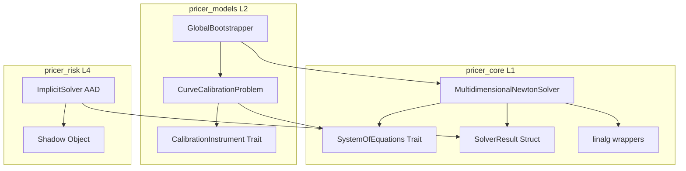
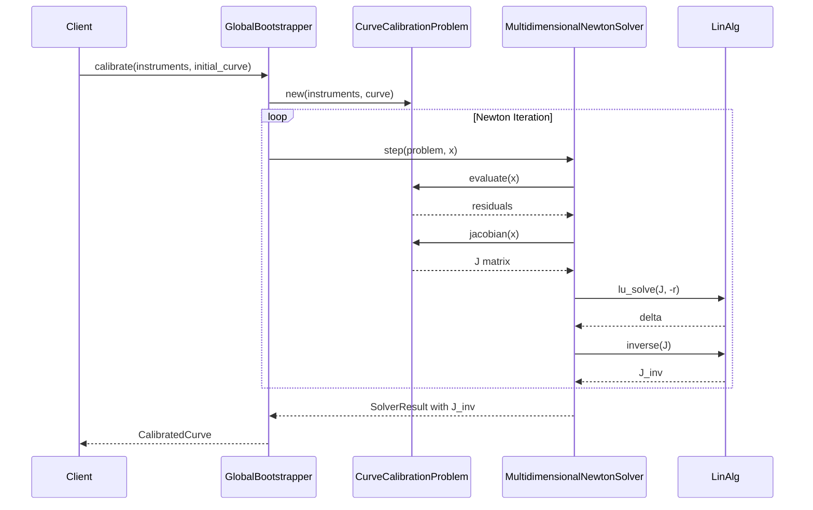
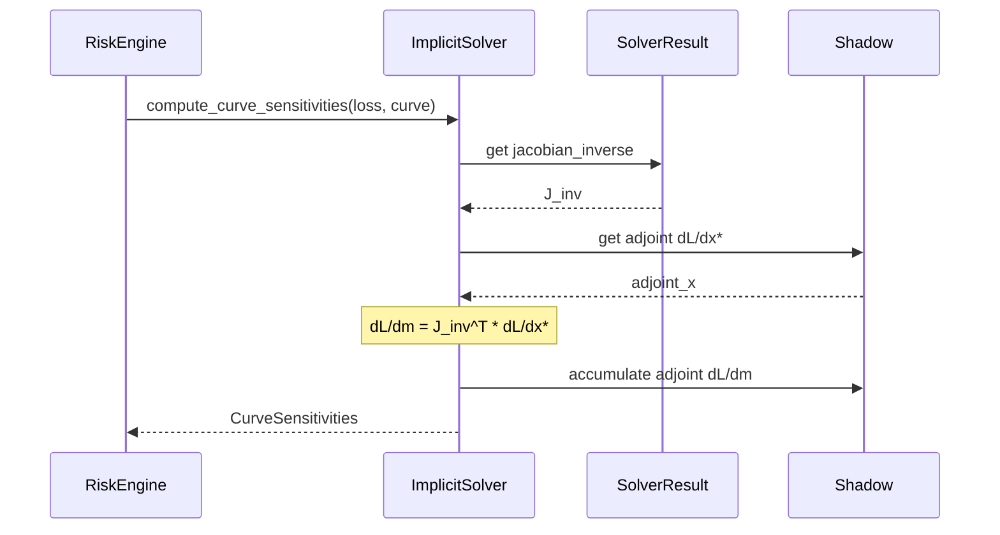
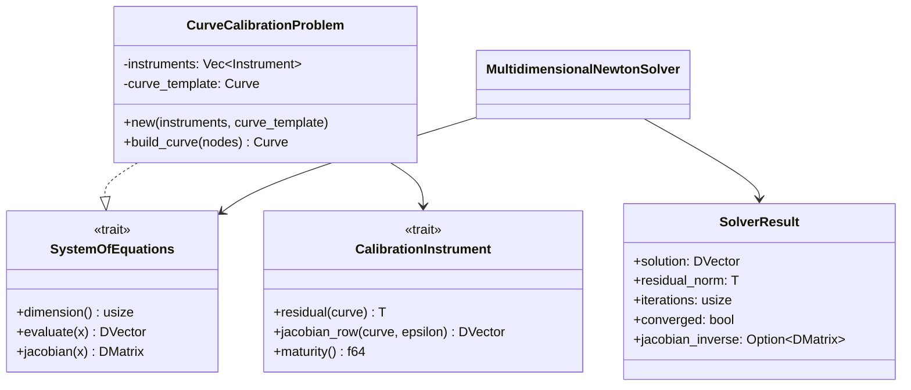

# Technical Design: Global Curve Builder

## Overview

**Purpose**: 本機能は、行列計算（連立方程式）を用いたイールドカーブ構築と、陰関数定理によるAAD (Adjoint Algorithmic Differentiation) 統合を提供する。

**Users**: クオンツ開発者およびリスク管理者が、金利デリバティブの価格計算とリスク感応度計算に使用する。

**Impact**: 既存の `SequentialBootstrapper` を `GlobalBootstrapper` で置換し、全商品を同時に解くグローバルソルバーアプローチを実現する。

### Goals
- 多次元Newton-Raphsonソルバーによる全商品同時キャリブレーション
- Jacobian逆行列を通じたAAD統合（陰関数定理）
- Float generics (`T: RealField`) によるAD互換性
- 既存 `pricer_core/math/linalg` との統合

### Non-Goals
- スパース行列対応（30商品程度は密行列で十分）
- Enzyme `#[enzyme_rules]` の完全実装（finite differenceフォールバックを優先）
- Dual-curve（複数カーブ同時キャリブレーション）は本フェーズでは対象外

## Architecture

### Existing Architecture Analysis

現在のアーキテクチャ:
- `SequentialBootstrapper<T>`: 1商品ずつ逐次的に解く
- `BootstrapInstrument<T>` enum: OIS, IRS, FRA, Future variants
- `newton_raphson.rs`: 1次元Newton-Raphson（スカラー）
- `linalg/wrappers.rs`: nalgebra ラッパー（LU, Cholesky, inverse）

**制約**:
- A-I-P-S 依存関係: `pricer_core` (L1) → `pricer_models` (L2) → `pricer_risk` (L4)
- Float generics必須（AD互換性）

### Architecture Pattern & Boundary Map



**Architecture Integration**:
- Selected pattern: **既存コンポーネント拡張** — 新規モジュールを最小限に抑え、既存パターン踏襲
- Domain boundaries: L1（数学）→ L2（金融モデル）→ L4（リスク/AAD）
- Existing patterns preserved: Config/Result パターン、Float generics、LinearAlgebraError
- Steering compliance: A-I-P-S 依存関係遵守

### Technology Stack

| Layer | Choice / Version | Role in Feature | Notes |
|-------|------------------|-----------------|-------|
| Linear Algebra | nalgebra (existing) | DMatrix, DVector, LU/Cholesky | RealField + Copy バウンド |
| Numeric | num-traits (existing) | Float trait bounds | AD互換 |
| Error Handling | thiserror (existing) | SolverError拡張 | 既存パターン |
| AAD Backend | Enzyme (pricer_risk) | Adjoint計算 | Finite difference fallback |

## System Flows

### Curve Calibration Flow



### AAD Gradient Flow



## Requirements Traceability

| Requirement | Summary | Components | Interfaces | Flows |
|-------------|---------|------------|------------|-------|
| 1 | 多次元Newton-Raphson | MultidimensionalNewtonSolver | SystemOfEquations | Calibration Flow |
| 2 | SystemOfEquations trait | SystemOfEquations | evaluate, jacobian | Calibration Flow |
| 3 | SolverResult | SolverResult | solution, jacobian_inverse | Both Flows |
| 4 | CurveCalibrationProblem | CurveCalibrationProblem | SystemOfEquations impl | Calibration Flow |
| 5 | CalibrationInstrument trait | CalibrationInstrument | residual, jacobian_row | Calibration Flow |
| 6 | AAD陰関数定理 | ImplicitSolver | compute_curve_sensitivities | AAD Flow |
| 7 | 線形代数演算 | linalg wrappers | lu_solve, inverse | Both Flows |
| 8 | GlobalBootstrapper | GlobalBootstrapper | calibrate | Calibration Flow |
| 9 | エラーハンドリング | SolverError | 拡張バリアント | Both Flows |
| 10 | パフォーマンス | All | - | - |
| 11 | テスト | All | - | - |

## Components and Interfaces

### Component Summary

| Component | Domain/Layer | Intent | Req Coverage | Key Dependencies | Contracts |
|-----------|--------------|--------|--------------|------------------|-----------|
| SystemOfEquations | pricer_core/math | 連立方程式の抽象化 | 2 | - | Trait |
| MultidimensionalNewtonSolver | pricer_core/math | 多次元Newton-Raphson | 1, 3, 7, 9 | SystemOfEquations, linalg | Service |
| SolverResult | pricer_core/math | ソルバー結果構造体 | 3 | - | State |
| CalibrationInstrument | pricer_models/market | キャリブレーション商品トレイト | 5 | - | Trait |
| CurveCalibrationProblem | pricer_models/market | カーブキャリブレーション問題 | 4 | SystemOfEquations, CalibrationInstrument | Service |
| GlobalBootstrapper | pricer_models/market | グローバルブートストラッパー | 8 | CurveCalibrationProblem, MultidimensionalNewtonSolver | Service |
| ImplicitSolver | pricer_risk/enzyme | AAD陰関数定理統合 | 6 | SolverResult, Shadow | Service |

### pricer_core (L1)

#### SystemOfEquations

| Field | Detail |
|-------|--------|
| Intent | 連立方程式 F(x) = 0 の統一インターフェース |
| Requirements | 2 |

**Responsibilities & Constraints**
- 評価関数 `evaluate(x)` と Jacobian `jacobian(x)` を提供
- 次元情報 `dimension()` を公開
- 数値Jacobianのデフォルト実装を提供

**Contracts**: Trait [x]

##### Trait Interface
```rust
use nalgebra::{DMatrix, DVector, RealField};
use crate::types::SolverError;

/// 連立方程式 F(x) = 0 を表すトレイト
pub trait SystemOfEquations<T: RealField + Copy> {
    /// 方程式の次元（変数および残差の数）
    fn dimension(&self) -> usize;

    /// 残差ベクトル F(x) を評価
    fn evaluate(&self, x: &DVector<T>) -> Result<DVector<T>, SolverError>;

    /// Jacobian行列 ∂F/∂x を計算
    fn jacobian(&self, x: &DVector<T>) -> Result<DMatrix<T>, SolverError>;

    /// 数値Jacobian（デフォルト実装）
    fn jacobian_numerical(&self, x: &DVector<T>, epsilon: T) -> Result<DMatrix<T>, SolverError> {
        // 有限差分によるJacobian近似
        // デフォルト実装を提供
    }
}
```
- Preconditions: `x.len() == dimension()`
- Postconditions: `evaluate(x).len() == dimension()`, `jacobian(x).shape() == (n, n)`
- Invariants: Jacobianは正則であること（収束保証のため）

#### MultidimensionalNewtonSolver

| Field | Detail |
|-------|--------|
| Intent | 多次元Newton-Raphson法による非線形方程式求解 |
| Requirements | 1, 3, 7, 9 |

**Responsibilities & Constraints**
- 収束判定（残差ノルム、パラメータ変化量）
- Jacobian逆行列の計算と返却
- 最大反復回数による終了

**Dependencies**
- Inbound: CurveCalibrationProblem — SystemOfEquations実装 (P0)
- Outbound: linalg::lu_solve, linalg::inverse — 線形代数演算 (P0)

**Contracts**: Service [x] / State [x]

##### Service Interface
```rust
use nalgebra::{DMatrix, DVector, RealField};
use crate::types::SolverError;

/// Newton-Raphsonソルバー設定
#[derive(Debug, Clone, Copy)]
pub struct NewtonConfig<T: RealField> {
    /// 残差ノルムの収束許容誤差
    pub tolerance: T,
    /// パラメータ変化量の収束許容誤差
    pub param_tolerance: T,
    /// 最大反復回数
    pub max_iterations: usize,
    /// 数値Jacobianのイプシロン
    pub jacobian_epsilon: T,
}

/// ソルバー結果
#[derive(Debug, Clone)]
pub struct SolverResult<T: RealField> {
    /// 解ベクトル x*
    pub solution: DVector<T>,
    /// 最終残差ノルム
    pub residual_norm: T,
    /// 反復回数
    pub iterations: usize,
    /// 収束フラグ
    pub converged: bool,
    /// Jacobian逆行列（AAD用）
    pub jacobian_inverse: Option<DMatrix<T>>,
}

/// 多次元Newton-Raphsonソルバー
pub struct MultidimensionalNewtonSolver<T: RealField> {
    config: NewtonConfig<T>,
}

impl<T: RealField + Copy> MultidimensionalNewtonSolver<T> {
    pub fn new(config: NewtonConfig<T>) -> Self;

    /// 方程式系を解く
    pub fn solve<S: SystemOfEquations<T>>(
        &self,
        system: &S,
        initial_guess: DVector<T>,
    ) -> Result<SolverResult<T>, SolverError>;
}
```
- Preconditions: `initial_guess.len() == system.dimension()`
- Postconditions: `result.solution.len() == system.dimension()`
- Invariants: `jacobian_inverse` は収束時にのみ `Some`

##### State Management
- State model: Stateless（各呼び出しが独立）
- Persistence: なし（計算結果は呼び出し元が管理）
- Concurrency: スレッドセーフ（`&self` メソッド）

**Implementation Notes**
- Integration: 既存 `solvers/` モジュールに `multidim_newton.rs` として追加
- Validation: 次元チェック、Jacobian正則性チェック
- Risks: Jacobian特異（近傍）時の数値不安定性 → LU分解のピボット検出で対応

### pricer_models (L2)

#### CalibrationInstrument

| Field | Detail |
|-------|--------|
| Intent | キャリブレーション商品の統一インターフェース |
| Requirements | 5 |

**Responsibilities & Constraints**
- 残差計算 `residual(curve)`
- Jacobian行寄与 `jacobian_row(curve, row_index)`
- 感応度計算のためのカーブアクセス

**Contracts**: Trait [x]

##### Trait Interface
```rust
use nalgebra::{DVector, RealField};

/// キャリブレーション商品トレイト
pub trait CalibrationInstrument<T: RealField + Copy, C> {
    /// 商品の残差（市場価格 - モデル価格）
    fn residual(&self, curve: &C) -> T;

    /// Jacobian行への寄与（残差のカーブ感応度）
    fn jacobian_row(&self, curve: &C, epsilon: T) -> DVector<T>;

    /// 満期（ソート用）
    fn maturity(&self) -> f64;
}
```
- Preconditions: `curve` は有効なカーブオブジェクト
- Postconditions: `jacobian_row` の長さはカーブのノード数と一致

#### CurveCalibrationProblem

| Field | Detail |
|-------|--------|
| Intent | カーブキャリブレーションを SystemOfEquations として表現 |
| Requirements | 4 |

**Responsibilities & Constraints**
- 商品群の残差をベクトル化
- Jacobian行列の構築
- カーブノード値の更新

**Dependencies**
- Inbound: GlobalBootstrapper — 問題設定 (P0)
- Outbound: CalibrationInstrument — 商品評価 (P0)
- Outbound: SystemOfEquations — トレイト実装 (P0)

**Contracts**: Service [x]

##### Service Interface
```rust
use nalgebra::{DMatrix, DVector, RealField};
use crate::types::SolverError;

/// カーブキャリブレーション問題
pub struct CurveCalibrationProblem<'a, T, C, I>
where
    T: RealField + Copy,
    I: CalibrationInstrument<T, C>,
{
    instruments: &'a [I],
    curve_template: C,
    _phantom: PhantomData<T>,
}

impl<'a, T, C, I> CurveCalibrationProblem<'a, T, C, I>
where
    T: RealField + Copy,
    I: CalibrationInstrument<T, C>,
    C: Clone,
{
    pub fn new(instruments: &'a [I], curve_template: C) -> Self;

    /// カーブノード値からカーブオブジェクトを再構築
    fn build_curve(&self, nodes: &DVector<T>) -> C;
}

impl<'a, T, C, I> SystemOfEquations<T> for CurveCalibrationProblem<'a, T, C, I>
where
    T: RealField + Copy,
    I: CalibrationInstrument<T, C>,
    C: Clone,
{
    fn dimension(&self) -> usize { self.instruments.len() }

    fn evaluate(&self, x: &DVector<T>) -> Result<DVector<T>, SolverError> {
        let curve = self.build_curve(x);
        // 各商品の残差を収集
    }

    fn jacobian(&self, x: &DVector<T>) -> Result<DMatrix<T>, SolverError> {
        let curve = self.build_curve(x);
        // 各商品のjacobian_rowを行として構築
    }
}
```

#### GlobalBootstrapper

| Field | Detail |
|-------|--------|
| Intent | グローバルカーブブートストラッピングのオーケストレーション |
| Requirements | 8 |

**Responsibilities & Constraints**
- 商品ソート（満期順）
- ソルバー呼び出し
- 結果のカーブオブジェクト変換

**Dependencies**
- Inbound: Client — キャリブレーション要求 (P0)
- Outbound: CurveCalibrationProblem — 問題構築 (P0)
- Outbound: MultidimensionalNewtonSolver — 求解 (P0)

**Contracts**: Service [x]

##### Service Interface
```rust
use nalgebra::RealField;

/// グローバルブートストラッパー設定
#[derive(Debug, Clone)]
pub struct GlobalBootstrapConfig<T: RealField> {
    pub solver_config: NewtonConfig<T>,
    pub store_jacobian_inverse: bool,
}

/// ブートストラップ結果
#[derive(Debug, Clone)]
pub struct BootstrapResult<T: RealField, C> {
    pub curve: C,
    pub iterations: usize,
    pub converged: bool,
    pub jacobian_inverse: Option<DMatrix<T>>,
}

/// グローバルブートストラッパー
pub struct GlobalBootstrapper<T: RealField> {
    config: GlobalBootstrapConfig<T>,
}

impl<T: RealField + Copy> GlobalBootstrapper<T> {
    pub fn new(config: GlobalBootstrapConfig<T>) -> Self;

    /// カーブをキャリブレーション
    pub fn calibrate<C, I>(
        &self,
        instruments: &[I],
        initial_curve: C,
    ) -> Result<BootstrapResult<T, C>, SolverError>
    where
        I: CalibrationInstrument<T, C>,
        C: Clone;
}
```

### pricer_risk (L4)

#### ImplicitSolver

| Field | Detail |
|-------|--------|
| Intent | 陰関数定理によるAADカーブ感応度計算 |
| Requirements | 6 |

**Responsibilities & Constraints**
- Jacobian逆行列の転置乗算
- Shadow bufferへのadjoint蓄積
- Finite difference fallback

**Dependencies**
- Inbound: RiskEngine — 感応度計算要求 (P0)
- Outbound: SolverResult — Jacobian逆行列取得 (P0)
- Outbound: Shadow — Adjoint蓄積 (P0)

**Contracts**: Service [x]

##### Service Interface
```rust
use nalgebra::{DMatrix, DVector, RealField};

/// カーブ感応度結果
pub struct CurveSensitivities<T: RealField> {
    /// 市場データに対する感応度 ∂L/∂m
    pub market_sensitivities: DVector<T>,
}

/// 陰関数定理ソルバー
pub struct ImplicitSolver;

impl ImplicitSolver {
    /// カーブ感応度を計算
    ///
    /// 陰関数定理: ∂L/∂m = J⁻ᵀ · ∂L/∂x*
    pub fn compute_curve_sensitivities<T: RealField + Copy>(
        jacobian_inverse: &DMatrix<T>,
        adjoint_x: &DVector<T>,
    ) -> CurveSensitivities<T> {
        let j_inv_t = jacobian_inverse.transpose();
        let market_sensitivities = &j_inv_t * adjoint_x;
        CurveSensitivities { market_sensitivities }
    }

    /// Finite difference fallback
    pub fn compute_curve_sensitivities_fd<T, F>(
        loss_fn: F,
        curve_nodes: &DVector<T>,
        epsilon: T,
    ) -> CurveSensitivities<T>
    where
        T: RealField + Copy,
        F: Fn(&DVector<T>) -> T;
}
```

## Data Models

### Domain Model



**Entities**:
- `SolverResult<T>`: ソルバー結果（解、収束情報、Jacobian逆行列）
- `NewtonConfig<T>`: ソルバー設定
- `BootstrapResult<T, C>`: ブートストラップ結果

**Value Objects**:
- `DVector<T>`: 解ベクトル
- `DMatrix<T>`: Jacobian行列

**Business Rules**:
- 商品数 = カーブノード数（正方系）
- 収束判定: 残差ノルム < tolerance AND パラメータ変化量 < param_tolerance

## Error Handling

### Error Strategy

既存の `SolverError` を拡張し、多次元ソルバー固有のエラーを追加。

### Error Categories and Responses

**Solver Errors**:
- `MaxIterationsExceeded` → 残差情報と共に返却、呼び出し元で許容判定
- `SingularJacobian` → LU分解のピボット検出で早期検出、エラー返却
- `DimensionMismatch` → 入力検証時にエラー返却

**Linear Algebra Errors**:
- `LinearAlgebraError::SingularMatrix` → `SolverError::SingularJacobian` に変換

### SolverError拡張
```rust
#[derive(Error, Debug)]
pub enum SolverError {
    // 既存
    #[error("Maximum iterations exceeded: {iterations} iterations, residual = {residual}")]
    MaxIterationsExceeded { iterations: usize, residual: f64 },

    #[error("Derivative near zero")]
    DerivativeNearZero,

    // 新規追加
    #[error("Singular Jacobian: min pivot = {min_pivot}")]
    SingularJacobian { min_pivot: f64 },

    #[error("Dimension mismatch: expected {expected}, got {got}")]
    DimensionMismatch { expected: usize, got: usize },

    // 既存
    #[error("Numerical instability: {0}")]
    NumericalInstability(String),

    #[error("External error: {0}")]
    External(String),
}
```

## Testing Strategy

### Unit Tests
- `SystemOfEquations` トレイトのデフォルト実装（数値Jacobian）
- `MultidimensionalNewtonSolver` の収束テスト（線形・二次関数）
- `SolverResult` のJacobian逆行列検証
- `CalibrationInstrument` 実装の残差計算
- エラーケース（特異Jacobian、次元不整合）

### Integration Tests
- `CurveCalibrationProblem` + `MultidimensionalNewtonSolver` 統合
- `GlobalBootstrapper` end-to-end（既存SequentialBootstrapperとの結果比較）
- `ImplicitSolver` AAD計算（finite differenceとの比較）

### Performance Tests
- 30商品キャリブレーション時間
- Jacobian逆行列計算のオーバーヘッド
- AAD vs Bump-and-Revalue 速度比較

## Performance & Scalability

**Target metrics**:
- 30商品キャリブレーション: < 10ms
- Jacobian逆行列計算: < 1ms（30x30行列）
- AAD感応度計算: < 0.5ms

**Optimisation techniques**:
- nalgebra SIMD最適化の活用
- Jacobian逆行列の遅延計算（`store_jacobian_inverse` フラグ）
- 数値Jacobianの並列評価検討（将来）
