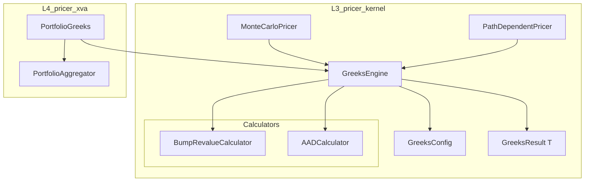
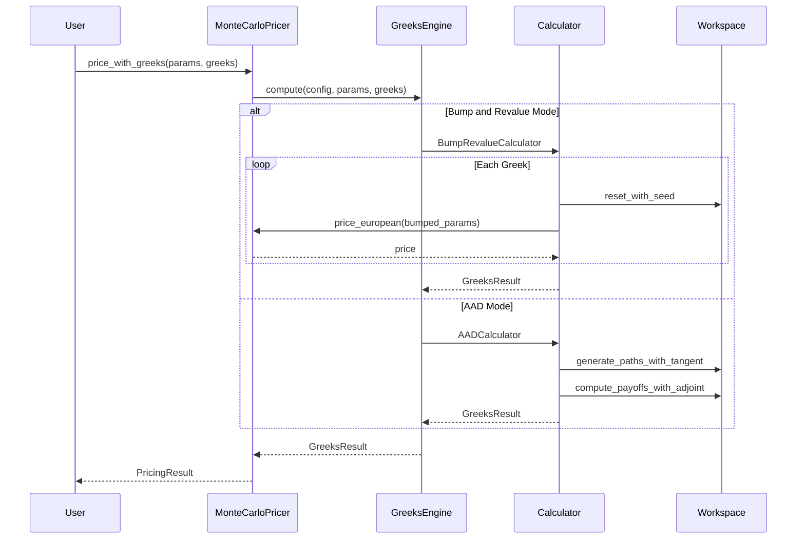
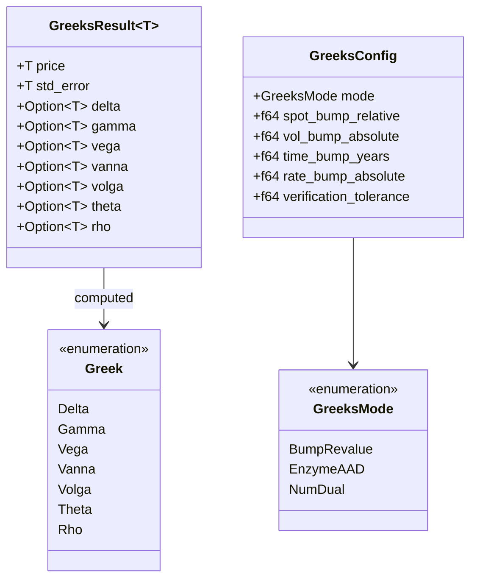

# Design Document: Greeks Calculation

## Overview

**Purpose**: デリバティブのリスク感応度指標（Greeks）を効率的に計算し、ヘッジ戦略とリスク管理を支援する。

**Users**: クオンツ開発者、リスク管理者、ポートフォリオマネージャーがヘッジポジションの構築、リスク分析、規制対応に活用。

**Impact**: 既存のMonteCarloPricerを拡張し、一次Greeks（Delta, Vega, Theta, Rho）、二次Greeks（Gamma, Vanna, Volga）、および複数計算モード（Bump-and-Revalue、AAD）をサポートする統合Greeksエンジンを提供。

### Goals
- 一次・二次Greeksの統一的な計算インターフェース
- Bump-and-RevalueとEnzyme AADの両方をサポート
- num-dualモードによる検証機能
- パス依存オプションおよびポートフォリオレベルのGreeks集約

### Non-Goals
- 解析的Greeks公式の実装（pricer_modelsのanalyticalモジュールで対応）
- リアルタイムストリーミングGreeks（将来フェーズ）
- GPU並列化（将来フェーズ）

## Architecture

### Existing Architecture Analysis

現在のpricer_kernelには以下のGreeks関連実装が存在：

- `Greek` enum: Delta, Gamma, Vega, Theta, Rhoを定義
- `PricingResult`: f64固定型の結果構造体
- `MonteCarloPricer::price_with_greeks()`: bump-and-revalueによる計算
- `MonteCarloPricer::price_with_delta_ad()`: 手動タンジェント伝播（forward-mode AD）

**課題**:
- PricingResultがf64固定でAD非互換
- Vanna/Volga（二次クロス微分）未実装
- バンプ幅がハードコード
- Enzyme統合未完了

### Architecture Pattern & Boundary Map



**Architecture Integration**:
- **Selected pattern**: Strategy pattern（計算モード切り替え）+ Builder pattern（設定）
- **Domain boundaries**: GreeksEngine（L3）は計算ロジック、PortfolioGreeks（L4）は集約ロジック
- **Existing patterns preserved**: MonteCarloPricerのAPI維持、PathDependentPayoff trait活用
- **New components rationale**: GreeksEngineは計算ロジックの分離、GreeksResult<T>はAD互換性
- **Steering compliance**: 4層アーキテクチャ維持、static dispatch、smooth approximations

### Technology Stack

| Layer | Choice / Version | Role in Feature | Notes |
|-------|------------------|-----------------|-------|
| Backend | Rust Edition 2021 | Greeks計算エンジン | L3: nightly-2025-01-15 |
| AD Backend | Enzyme LLVM 18 / num-dual 0.8 | 自動微分 | feature flag切り替え |
| Parallelization | rayon | ポートフォリオ並列計算 | L4での使用 |
| Testing | approx, proptest, criterion | 検証・ベンチマーク | 精度・性能テスト |

## System Flows

### Greeks Calculation Flow



**Key Decisions**:
- シード復元による再現性確保（bump-and-revalue）
- ワークスペース再利用によるメモリ効率化
- 計算モードは実行時に選択可能

## Requirements Traceability

| Requirement | Summary | Components | Interfaces | Flows |
|-------------|---------|------------|------------|-------|
| 1.1-1.5 | 一次Greeks計算 | GreeksEngine, BumpRevalueCalculator | GreeksResult | Greeks Calculation Flow |
| 2.1-2.4 | 二次Greeks計算 | GreeksEngine, BumpRevalueCalculator | GreeksResult | Greeks Calculation Flow |
| 3.1-3.4 | Bump-and-Revalue | BumpRevalueCalculator, GreeksConfig | compute_with_bump | Greeks Calculation Flow |
| 4.1-4.4 | Enzyme AAD | AADCalculator | compute_with_aad | Greeks Calculation Flow |
| 5.1-5.4 | num-dual検証 | VerificationEngine | VerificationResult | N/A |
| 6.1-6.5 | Greeks結果構造体 | GreeksResult<T> | N/A | N/A |
| 7.1-7.4 | パス依存Greeks | PathDependentGreeksEngine | compute_path_dependent | Greeks Calculation Flow |
| 8.1-8.4 | ポートフォリオGreeks | PortfolioGreeks | aggregate | N/A |

## Components and Interfaces

| Component | Domain/Layer | Intent | Req Coverage | Key Dependencies | Contracts |
|-----------|--------------|--------|--------------|------------------|-----------|
| GreeksResult | L3/Types | Greeks計算結果の統一型 | 6.1-6.5 | num-traits (P0) | State |
| GreeksConfig | L3/Config | バンプ幅・計算モード設定 | 3.3, 5.4 | None | State |
| GreeksEngine | L3/Engine | Greeks計算の統合エンジン | 1-7 | MonteCarloPricer (P0) | Service |
| BumpRevalueCalculator | L3/Calculator | 有限差分法による計算 | 3.1-3.4 | GreeksConfig (P0) | Service |
| AADCalculator | L3/Calculator | Enzyme AADによる計算 | 4.1-4.4 | Enzyme (P0) | Service |
| VerificationEngine | L3/Verify | Enzyme vs num-dual検証 | 5.1-5.4 | GreeksEngine (P0) | Service |
| PortfolioGreeks | L4/Portfolio | ポートフォリオ集約 | 8.1-8.4 | GreeksEngine (P0), rayon (P1) | Service |

### L3 / Types

#### GreeksResult<T>

| Field | Detail |
|-------|--------|
| Intent | Greeks計算結果を保持するジェネリック構造体 |
| Requirements | 6.1, 6.2, 6.3, 6.4, 6.5 |

**Responsibilities & Constraints**
- 一次Greeks（delta, vega, theta, rho）と二次Greeks（gamma, vanna, volga）を保持
- 未計算のGreeksはOption::Noneで表現
- T: Floatトレイト境界でAD互換性を確保

**Dependencies**
- Inbound: GreeksEngine — 計算結果格納 (P0)
- External: num-traits::Float — ジェネリック浮動小数点 (P0)
- External: serde — シリアライズ（optional feature） (P2)

**Contracts**: State [x]

##### State Management
```rust
#[derive(Clone, Debug, Default)]
#[cfg_attr(feature = "serde", derive(Serialize, Deserialize))]
pub struct GreeksResult<T: Float> {
    pub price: T,
    pub std_error: T,
    // First-order Greeks
    pub delta: Option<T>,
    pub vega: Option<T>,
    pub theta: Option<T>,
    pub rho: Option<T>,
    // Second-order Greeks
    pub gamma: Option<T>,
    pub vanna: Option<T>,
    pub volga: Option<T>,
}

// Type alias for backward compatibility
pub type PricingResult = GreeksResult<f64>;
```

- State model: Immutable after creation
- Persistence: In-memory only
- Concurrency: Send + Sync（Tの制約により）

### L3 / Config

#### GreeksConfig

| Field | Detail |
|-------|--------|
| Intent | Greeks計算のパラメータ設定 |
| Requirements | 3.3, 5.4 |

**Responsibilities & Constraints**
- バンプ幅（相対/絶対）の設定
- 計算モード（Bump/AAD/Dual）の選択
- 検証許容誤差の設定

**Dependencies**
- Inbound: GreeksEngine — 設定参照 (P0)

**Contracts**: State [x]

##### State Management
```rust
#[derive(Clone, Debug)]
pub struct GreeksConfig {
    /// Calculation mode
    pub mode: GreeksMode,
    /// Relative bump for spot (default: 0.01)
    pub spot_bump_relative: f64,
    /// Absolute bump for volatility (default: 0.01)
    pub vol_bump_absolute: f64,
    /// Time bump in years (default: 1/252)
    pub time_bump_years: f64,
    /// Rate bump absolute (default: 0.01)
    pub rate_bump_absolute: f64,
    /// Verification tolerance (default: 1e-6)
    pub verification_tolerance: f64,
}

#[derive(Clone, Copy, Debug, PartialEq, Eq)]
pub enum GreeksMode {
    /// Bump-and-revalue (finite differences)
    BumpRevalue,
    /// Enzyme AAD (requires enzyme-mode feature)
    #[cfg(feature = "enzyme-mode")]
    EnzymeAAD,
    /// num-dual forward-mode AD
    #[cfg(feature = "num-dual-mode")]
    NumDual,
}

impl GreeksConfig {
    pub fn builder() -> GreeksConfigBuilder { ... }
}
```

### L3 / Engine

#### GreeksEngine

| Field | Detail |
|-------|--------|
| Intent | Greeks計算の統合オーケストレーション |
| Requirements | 1.1-1.5, 2.1-2.4, 3.1-3.4, 4.1-4.4, 7.1-7.4 |

**Responsibilities & Constraints**
- 計算モードに応じた適切なCalculatorの選択
- 入力パラメータの検証
- 結果のGreeksResult<T>への変換

**Dependencies**
- Inbound: MonteCarloPricer — Greeks計算要求 (P0)
- Outbound: BumpRevalueCalculator — bump計算 (P0)
- Outbound: AADCalculator — AAD計算 (P1)
- External: PathDependentPayoff — パス依存計算 (P1)

**Contracts**: Service [x]

##### Service Interface
```rust
pub struct GreeksEngine<'a> {
    pricer: &'a mut MonteCarloPricer,
    config: GreeksConfig,
}

impl<'a> GreeksEngine<'a> {
    /// Creates a new GreeksEngine with the given pricer and config.
    pub fn new(pricer: &'a mut MonteCarloPricer, config: GreeksConfig) -> Self;

    /// Computes selected Greeks for European options.
    pub fn compute_european(
        &mut self,
        gbm: GbmParams,
        payoff: PayoffParams,
        discount_factor: f64,
        greeks: &[Greek],
    ) -> GreeksResult<f64>;

    /// Computes selected Greeks for path-dependent options.
    pub fn compute_path_dependent(
        &mut self,
        gbm: GbmParams,
        payoff: PathPayoffType<f64>,
        discount_factor: f64,
        greeks: &[Greek],
    ) -> GreeksResult<f64>;

    /// Computes all Greeks at once.
    pub fn compute_all(
        &mut self,
        gbm: GbmParams,
        payoff: PayoffParams,
        discount_factor: f64,
    ) -> GreeksResult<f64>;
}
```

- Preconditions: pricer initialized, config valid
- Postconditions: GreeksResult contains requested Greeks
- Invariants: 同一シードで再現可能な結果

**Implementation Notes**
- Integration: MonteCarloPricerの既存メソッドを内部利用
- Validation: GbmParams, PayoffParamsの範囲チェック
- Risks: Enzyme未インストール時のAADモードエラー

### L3 / Calculator

#### BumpRevalueCalculator

| Field | Detail |
|-------|--------|
| Intent | 有限差分法によるGreeks計算 |
| Requirements | 3.1, 3.2, 3.3, 3.4 |

**Responsibilities & Constraints**
- 中心差分法による一次Greeks計算
- 三点差分法による二次Greeks計算
- シード復元による再現性確保

**Dependencies**
- Inbound: GreeksEngine — 計算委譲 (P0)
- Outbound: MonteCarloPricer — 価格計算 (P0)

**Contracts**: Service [x]

##### Service Interface
```rust
pub struct BumpRevalueCalculator<'a> {
    pricer: &'a mut MonteCarloPricer,
    config: &'a GreeksConfig,
}

impl<'a> BumpRevalueCalculator<'a> {
    /// Computes Delta using central differences.
    pub fn compute_delta(&mut self, gbm: GbmParams, payoff: PayoffParams, df: f64) -> f64;

    /// Computes Gamma using three-point formula.
    pub fn compute_gamma(&mut self, gbm: GbmParams, payoff: PayoffParams, df: f64) -> f64;

    /// Computes Vanna (d²V/dS∂σ) using cross-differences.
    pub fn compute_vanna(&mut self, gbm: GbmParams, payoff: PayoffParams, df: f64) -> f64;

    /// Computes Volga (d²V/dσ²) using three-point formula.
    pub fn compute_volga(&mut self, gbm: GbmParams, payoff: PayoffParams, df: f64) -> f64;
}
```

### L4 / Portfolio

#### PortfolioGreeks

| Field | Detail |
|-------|--------|
| Intent | ポートフォリオレベルのGreeks集約 |
| Requirements | 8.1, 8.2, 8.3, 8.4 |

**Responsibilities & Constraints**
- 個別取引Greeksの並列計算
- ネッティングセット単位での集約
- SoA形式でのメモリ効率化

**Dependencies**
- Inbound: Application code — ポートフォリオGreeks要求 (P0)
- Outbound: GreeksEngine — 個別Greeks計算 (P0)
- External: rayon — 並列処理 (P1)

**Contracts**: Service [x]

##### Service Interface
```rust
pub struct PortfolioGreeks {
    config: GreeksConfig,
}

impl PortfolioGreeks {
    /// Computes Greeks for all trades in parallel.
    pub fn compute_portfolio<T: Trade>(
        &self,
        trades: &[T],
        market_data: &MarketData,
    ) -> Vec<GreeksResult<f64>>;

    /// Aggregates Greeks by netting set.
    pub fn aggregate_by_netting_set(
        &self,
        results: &[GreeksResult<f64>],
        netting_sets: &[NettingSet],
    ) -> HashMap<NettingSetId, GreeksResult<f64>>;
}
```

## Data Models

### Domain Model



**Aggregates**: GreeksResult<T>はGreeks計算の結果集約体
**Entities**: なし（状態を持たない計算ドメイン）
**Value Objects**: GreeksConfig, Greek enum
**Domain Events**: なし
**Business Rules**:
- 二次Greeksは一次Greeks計算後のみ有効
- Vanna/Volgaは数値安定性のためsmooth近似必須

## Error Handling

### Error Strategy
構造化エラー型による明示的なエラー処理。

### Error Categories and Responses
**User Errors (4xx equivalent)**:
- InvalidConfig: バンプ幅が負または極端な値 → 設定ガイダンス
- InvalidParams: GbmParams/PayoffParamsが無効 → パラメータ修正指示

**System Errors (5xx equivalent)**:
- EnzymeNotAvailable: enzyme-mode feature未有効 → フォールバック提案
- ComputationFailed: 数値計算エラー → smooth epsilon調整提案

**Business Logic Errors (422 equivalent)**:
- InsufficientPaths: パス数不足で統計的有意性低下 → パス数増加提案

### Monitoring
- criterionベンチマーク: Greeks計算時間の回帰テスト
- proptest: 数学的不変量の検証（put-call parity等）

## Testing Strategy

### Unit Tests
- GreeksResult: 各フィールドのアクセサ、Default実装
- GreeksConfig: Builder pattern、バリデーション
- BumpRevalueCalculator: 各Greek計算の数値検証
- Vanna/Volga: 数値安定性、smooth近似の効果

### Integration Tests
- GreeksEngine + MonteCarloPricer: 統合フロー
- put-call parity: Delta(Call) - Delta(Put) = 1の検証
- Enzyme vs num-dual: 結果一致性検証（verification_toleranceの範囲内）

### Performance Tests
- Greeks計算のベンチマーク（criterion）
- ポートフォリオ並列計算のスケーラビリティ
- メモリ使用量の回帰テスト

## Optional Sections

### Performance & Scalability
- **Target**: 10,000パスで1ms以内のGreeks計算
- **Scaling**: Rayonによるポートフォリオ並列化
- **Optimization**: ワークスペース再利用、シード復元による最小再計算
