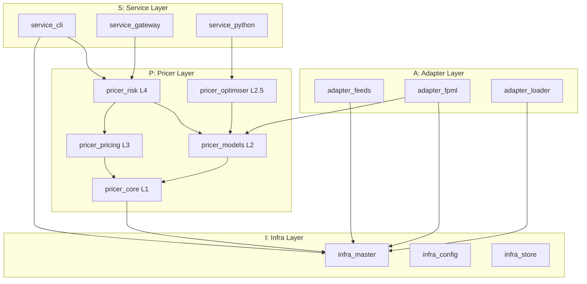
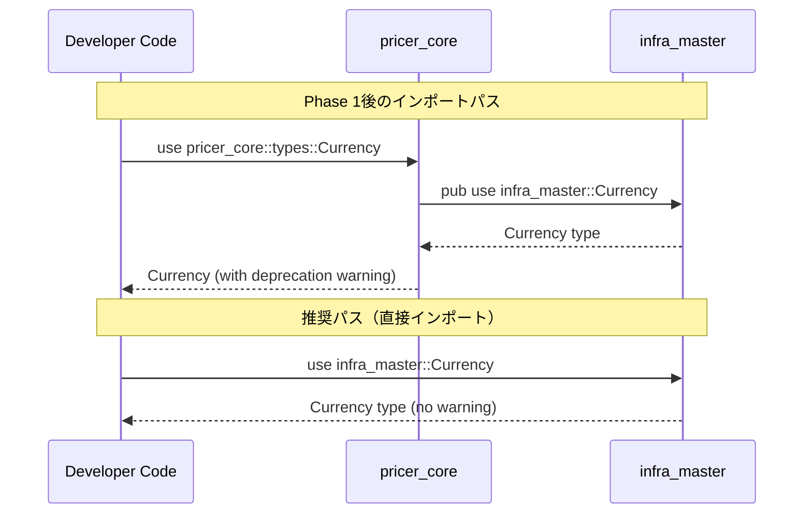
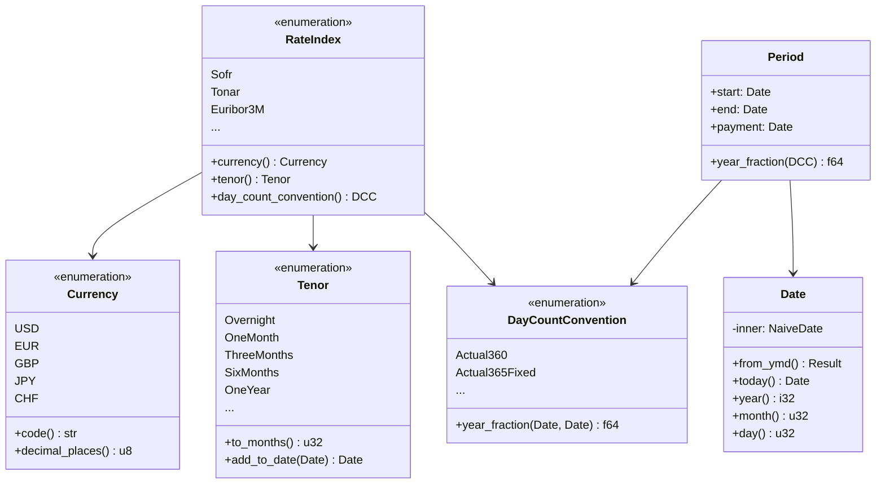
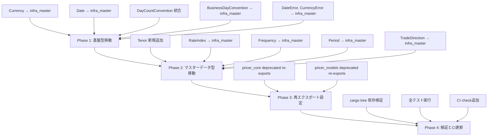

# Design Document

## Overview

**Purpose**: 本設計はA-I-P-Sアーキテクチャの依存関係ルール違反を解消し、基本型（primitives）とマスターデータ型を適切なレイヤーに配置することで、コードベース全体の一貫性と保守性を向上させる。

**Users**:
- Neutryx開発者（全レイヤー）がinfra_masterから基本型を安全にインポート可能になる
- Adapterレイヤー開発者がCurrency, RateIndex等のマスターデータに直接アクセス可能になる

**Impact**: pricer_core、pricer_models、infra_masterの3クレートに渡る型定義の再配置。後方互換性は再エクスポートにより維持。

### Goals
- A-I-P-Sアーキテクチャルール「InfraはPricerに依存しない」の完全遵守
- `DayCountConvention`の重複定義解消と統一
- 基本型（Currency, Date, BusinessDayConvention）のinfra_masterへの集約
- マスターデータ型（RateIndex, Frequency, Period, Direction）のinfra_masterへの移動
- 後方互換性維持による段階的移行パスの提供

### Non-Goals
- ジェネリック型（`CurrencyPair<T>`, `ExerciseStyle<T>`）の移動（AD互換性のためpricer_coreに残留）
- 計算ロジックを含む型（`PayoffType`の`evaluate()`等）の移動
- `time_to_maturity()`等の数学関数の移動（pricer_coreの責務）
- 新しい基本型の追加（Tenor以外）

## Architecture

### Existing Architecture Analysis

**現在のA-I-P-S依存関係**:
```
infra_master: 依存なし（独立）
pricer_core: 依存なし（L1基盤）
pricer_models: pricer_core に依存（L2）
```

**問題点**:
1. `Currency`, `Date`等がpricer_coreに定義 → infra_masterから使用不可
2. `DayCountConvention`がpricer_coreとinfra_masterの両方に存在（重複）
3. `RateIndex`, `Frequency`等がpricer_modelsに定義 → Adapterから使用不可

### Architecture Pattern & Boundary Map



**Architecture Integration**:
- **Selected pattern**: Direct Move + Re-export（型移動と後方互換性再エクスポート）
- **Domain boundaries**: infra_masterが基本型の単一ソース、pricer_coreは再エクスポートのみ
- **Existing patterns preserved**: A-I-P-S一方向依存、静的ディスパッチ、フィーチャーフラグ分離
- **New components rationale**: `Tenor`型新規追加（RateIndexの依存先として必要）
- **Steering compliance**: structure.md、tech.mdの原則を維持

### Technology Stack

| Layer | Choice / Version | Role in Feature | Notes |
|-------|------------------|-----------------|-------|
| Core Types | Rust Edition 2021 | 型定義とトレイト実装 | stable互換維持 |
| Date/Time | chrono | Date型の内部実装 | 既存依存、変更なし |
| Serialisation | serde (optional) | JSON/TOML変換 | フィーチャーフラグ維持 |
| Error Handling | thiserror | 構造化エラー型 | 既存パターン継続 |

## System Flows

### 型移動とインポート解決フロー



## Requirements Traceability

| Requirement | Summary | Components | Interfaces | Flows |
|-------------|---------|------------|------------|-------|
| 1.1-1.5 | 基本型のinfra_master移動 | Currency, Date, DayCountConvention, BusinessDayConvention | infra_master public API | 型インポート |
| 2.1-2.4 | DayCountConvention統一 | DayCountConvention | year_fraction() | 日数計算 |
| 3.1-3.5 | pricer_core再エクスポート | pricer_core::types | deprecated re-exports | インポート解決 |
| 4.1-4.4 | エラー型移動 | DateError, CurrencyError | Result types | エラーハンドリング |
| 5.1-5.4 | Calendar統合 | Calendar | add_business_days(), is_business_day() | 営業日計算 |
| 6.1-6.3 | serdeフィーチャー維持 | All moved types | Serialize, Deserialize | シリアライゼーション |
| 7.1-7.4 | 依存関係検証 | CI check | cargo tree | ビルド検証 |
| 8.1-8.5 | RateIndex移動 | RateIndex | currency(), tenor(), day_count_convention() | 金利指標参照 |
| 9.1-9.4 | Frequency移動 | Frequency | months_per_period(), periods_per_year() | スケジュール生成 |
| 10.1-10.4 | Period移動 | Period | accrual_days(), year_fraction() | 期間計算 |
| 11.1-11.4 | TradeDirection統合 | TradeDirection, SwapDirection | From traits | 方向変換 |
| 12.1-12.3 | CsaTerms Currency統合 | CsaTerms | collateral_currency field | 型安全性 |
| 13.1-13.4 | Tenor追加 | Tenor | to_months(), add_to_date() | 期間表現 |

## Components and Interfaces

| Component | Domain/Layer | Intent | Req Coverage | Key Dependencies | Contracts |
|-----------|--------------|--------|--------------|------------------|-----------|
| Currency | infra_master | ISO 4217通貨コード表現 | 1.1, 12.1 | None (P0) | Service |
| Date | infra_master | 型安全な日付ラッパー | 1.2, 5.1 | chrono (P0) | Service |
| DayCountConvention | infra_master | 日数計算規約 | 1.3, 2.1-2.4 | Date (P0) | Service |
| BusinessDayConvention | infra_master | 営業日調整規約 | 1.4, 5.2 | None (P0) | Service |
| DateError | infra_master | 日付エラー型 | 4.1, 4.3 | thiserror (P0) | Service |
| CurrencyError | infra_master | 通貨エラー型 | 4.2, 4.4 | thiserror (P0) | Service |
| Tenor | infra_master | 金融期間表現 | 13.1-13.4 | Date (P1) | Service |
| RateIndex | infra_master | ベンチマーク金利指標 | 8.1-8.5 | Currency, Tenor, DayCountConvention (P1) | Service |
| Frequency | infra_master | 支払頻度 | 9.1-9.4 | None (P0) | Service |
| Period | infra_master | 単一accrual期間 | 10.1-10.4 | Date, DayCountConvention (P1) | Service |
| TradeDirection | infra_master | 汎用取引方向 | 11.1-11.2 | None (P0) | Service |
| SwapDirection | infra_master | スワップ取引方向 | 11.2 | None (P0) | Service |

### infra_master Layer

#### Currency

| Field | Detail |
|-------|--------|
| Intent | ISO 4217通貨コードの型安全な表現 |
| Requirements | 1.1, 12.1-12.3 |

**Responsibilities & Constraints**
- ISO 4217準拠の通貨コード管理
- 小数点以下桁数（decimal places）のメタデータ提供
- `#[non_exhaustive]`で将来の通貨追加に対応

**Dependencies**
- Inbound: None
- Outbound: None
- External: None

**Contracts**: Service [x]

##### Service Interface
```rust
#[non_exhaustive]
#[derive(Copy, Clone, Debug, PartialEq, Eq, Hash)]
#[cfg_attr(feature = "serde", derive(Serialize, Deserialize))]
pub enum Currency {
    USD, EUR, GBP, JPY, CHF,
}

impl Currency {
    pub fn code(&self) -> &'static str;
    pub fn decimal_places(&self) -> u8;
}

impl FromStr for Currency {
    type Err = CurrencyError;
    fn from_str(s: &str) -> Result<Self, CurrencyError>;
}

impl Display for Currency { /* ... */ }
```
- Preconditions: None
- Postconditions: 常に有効なISO 4217コードを返す
- Invariants: `code()`は常に3文字の大文字

#### Date

| Field | Detail |
|-------|--------|
| Intent | chrono::NaiveDateの型安全ラッパー |
| Requirements | 1.2, 5.1-5.3 |

**Responsibilities & Constraints**
- ISO 8601形式のパースとフォーマット
- 日付算術（加算、減算）
- 無効な日付の拒否（Result型）

**Dependencies**
- Inbound: None
- Outbound: None
- External: chrono (P0)

**Contracts**: Service [x]

##### Service Interface
```rust
#[derive(Copy, Clone, Debug, PartialEq, Eq, PartialOrd, Ord, Hash)]
#[cfg_attr(feature = "serde", derive(Serialize, Deserialize))]
#[cfg_attr(feature = "serde", serde(transparent))]
pub struct Date(NaiveDate);

impl Date {
    pub fn from_ymd(year: i32, month: u32, day: u32) -> Result<Self, DateError>;
    pub fn today() -> Self;
    pub fn parse(s: &str) -> Result<Self, DateError>;
    pub fn into_inner(self) -> NaiveDate;
    pub fn year(&self) -> i32;
    pub fn month(&self) -> u32;
    pub fn day(&self) -> u32;
}

impl Sub for Date { type Output = i64; }
impl Add<i64> for Date { type Output = Date; }
impl FromStr for Date { type Err = DateError; }
impl Display for Date { /* YYYY-MM-DD */ }
```
- Preconditions: `from_ymd`は有効なグレゴリオ暦日付
- Postconditions: 常に有効な日付を保持
- Invariants: 内部NaiveDateは常に有効

#### DayCountConvention

| Field | Detail |
|-------|--------|
| Intent | 統一された日数計算規約（ISDA準拠） |
| Requirements | 1.3, 2.1-2.4 |

**Responsibilities & Constraints**
- 7種類のISDA標準day count conventionをサポート
- year fraction計算メソッド提供
- pricer_core版とinfra_master版の統合

**Dependencies**
- Inbound: None
- Outbound: Date (P0)
- External: chrono (P0)

**Contracts**: Service [x]

##### Service Interface
```rust
#[non_exhaustive]
#[derive(Debug, Clone, Copy, PartialEq, Eq, Hash, Default)]
#[cfg_attr(feature = "serde", derive(Serialize, Deserialize))]
pub enum DayCountConvention {
    Actual360,
    #[default]
    Actual365Fixed,
    Actual36525,
    ActualActualIsda,
    Thirty360Bond,
    Thirty360European,
    ThirtyE360Isda,
}

impl DayCountConvention {
    pub fn name(&self) -> &'static str;
    pub fn year_fraction(&self, start: NaiveDate, end: NaiveDate) -> f64;
    pub fn year_fraction_dates(&self, start: Date, end: Date) -> f64;
}

impl FromStr for DayCountConvention { type Err = String; }
impl Display for DayCountConvention { /* ... */ }
```
- Preconditions: `year_fraction`では`start <= end`（そうでなければpanic）
- Postconditions: 常に有限のf64値を返す
- Invariants: 同一日付間のyear_fractionは0.0

#### BusinessDayConvention

| Field | Detail |
|-------|--------|
| Intent | 営業日調整規約の型安全な表現 |
| Requirements | 1.4, 5.2 |

**Responsibilities & Constraints**
- 5種類の営業日調整規約をサポート
- Calendar型との連携（調整メソッドはCalendarで実装）

**Dependencies**
- Inbound: None
- Outbound: None
- External: None

**Contracts**: Service [x]

##### Service Interface
```rust
#[non_exhaustive]
#[derive(Debug, Clone, Copy, PartialEq, Eq, Hash)]
#[cfg_attr(feature = "serde", derive(Serialize, Deserialize))]
pub enum BusinessDayConvention {
    Following,
    ModifiedFollowing,
    Preceding,
    ModifiedPreceding,
    Unadjusted,
}

impl BusinessDayConvention {
    pub fn name(&self) -> &'static str;
    pub fn code(&self) -> &'static str;
}

impl FromStr for BusinessDayConvention { type Err = String; }
impl Display for BusinessDayConvention { /* ... */ }
```

#### Tenor

| Field | Detail |
|-------|--------|
| Intent | 金融期間（3M, 1Y等）の型安全な表現 |
| Requirements | 13.1-13.4 |

**Responsibilities & Constraints**
- 標準金融tenorのenum表現
- 日付算術（tenor加算）
- RateIndexの依存先として機能

**Dependencies**
- Inbound: RateIndex (P1)
- Outbound: Date (P1)
- External: None

**Contracts**: Service [x]

##### Service Interface
```rust
#[non_exhaustive]
#[derive(Debug, Clone, Copy, PartialEq, Eq, Hash)]
#[cfg_attr(feature = "serde", derive(Serialize, Deserialize))]
pub enum Tenor {
    Overnight,  // ON
    OneWeek,    // 1W
    TwoWeeks,   // 2W
    OneMonth,   // 1M
    TwoMonths,  // 2M
    ThreeMonths, // 3M
    SixMonths,  // 6M
    NineMonths, // 9M
    OneYear,    // 1Y
    TwoYears,   // 2Y
    ThreeYears, // 3Y
    FiveYears,  // 5Y
    SevenYears, // 7Y
    TenYears,   // 10Y
    FifteenYears, // 15Y
    TwentyYears, // 20Y
    ThirtyYears, // 30Y
}

impl Tenor {
    pub fn code(&self) -> &'static str;
    pub fn to_months(&self) -> u32;
    pub fn to_days(&self) -> u32;  // approximate
    pub fn add_to_date(&self, date: Date, eom_rule: EndOfMonthRule) -> Date;
}

impl FromStr for Tenor { type Err = String; }
impl Display for Tenor { /* e.g., "3M", "1Y" */ }

/// 月末日処理ルール
#[derive(Debug, Clone, Copy, PartialEq, Eq, Hash, Default)]
pub enum EndOfMonthRule {
    /// 月末日の場合、結果も月末日に調整（例: 1/31 + 1M = 2/28）
    #[default]
    Adjust,
    /// 月末日の場合でも、日付をそのまま適用（例: 1/31 + 1M = 2/28、無効なら最終日）
    Preserve,
    /// 月末ルールを適用しない（単純に月数を加算、無効なら最終日にフォールバック）
    None,
}
```
- Preconditions: None
- Postconditions: `add_to_date`は常に有効な日付を返す
- Invariants: `to_months()`は`OneYear` = 12

**月末処理ルールの詳細**:
- `EndOfMonthRule::Adjust`（デフォルト）: 開始日が月末の場合、結果日も月末に調整。金融市場の標準的な慣行
  - 例: 2024-01-31 + 1M = 2024-02-29（閏年）
  - 例: 2024-02-29 + 1M = 2024-03-31
- `EndOfMonthRule::Preserve`: 日を維持しようとし、無効な場合は月末にフォールバック
  - 例: 2024-01-31 + 1M = 2024-02-29（31日が存在しないため）
- `EndOfMonthRule::None`: 単純な月加算、無効日は月末にフォールバック

#### RateIndex

| Field | Detail |
|-------|--------|
| Intent | ベンチマーク金利指標のマスターデータ |
| Requirements | 8.1-8.5 |

**Responsibilities & Constraints**
- 主要ベンチマーク金利指標の定義
- 関連メタデータ（通貨、テナー、DCC）の提供
- Adapterからの参照データとして機能

**Dependencies**
- Inbound: pricer_models (re-export)
- Outbound: Currency (P1), Tenor (P1), DayCountConvention (P1)
- External: None

**Contracts**: Service [x]

##### Service Interface
```rust
#[non_exhaustive]
#[derive(Debug, Clone, Copy, PartialEq, Eq, Hash)]
#[cfg_attr(feature = "serde", derive(Serialize, Deserialize))]
pub enum RateIndex {
    Sofr,       // USD overnight
    Tonar,      // JPY overnight
    Euribor3M,  // EUR 3M
    Euribor6M,  // EUR 6M
    Sonia,      // GBP overnight
    Saron,      // CHF overnight
}

impl RateIndex {
    pub fn currency(&self) -> Currency;
    pub fn tenor(&self) -> Tenor;
    pub fn day_count_convention(&self) -> DayCountConvention;
    pub fn name(&self) -> &'static str;
}
```

#### Frequency

| Field | Detail |
|-------|--------|
| Intent | 支払頻度のマスターデータ |
| Requirements | 9.1-9.4 |

**Responsibilities & Constraints**
- 標準支払頻度の定義
- 期間計算メソッドの提供

**Dependencies**
- Inbound: pricer_models (re-export)
- Outbound: None
- External: None

**Contracts**: Service [x]

##### Service Interface
```rust
#[derive(Debug, Clone, Copy, PartialEq, Eq, Hash)]
#[cfg_attr(feature = "serde", derive(Serialize, Deserialize))]
pub enum Frequency {
    Annual,
    SemiAnnual,
    Quarterly,
    Monthly,
    Weekly,
    Daily,
}

impl Frequency {
    pub fn months_per_period(&self) -> u32;
    pub fn periods_per_year(&self) -> u32;
}
```

#### Period

| Field | Detail |
|-------|--------|
| Intent | 単一accrual期間の構造体 |
| Requirements | 10.1-10.4 |

**Responsibilities & Constraints**
- 開始日、終了日、支払日の保持
- 日数・year fraction計算

**Dependencies**
- Inbound: pricer_models (re-export)
- Outbound: Date (P0), DayCountConvention (P1)
- External: None

**Contracts**: Service [x]

##### Service Interface
```rust
#[derive(Debug, Clone, Copy, PartialEq)]
#[cfg_attr(feature = "serde", derive(Serialize, Deserialize))]
pub struct Period {
    pub start: Date,
    pub end: Date,
    pub payment: Date,
}

impl Period {
    pub fn new(start: Date, end: Date, payment: Date) -> Self;
    pub fn accrual_days(&self) -> i64;
    pub fn year_fraction(&self, day_count: DayCountConvention) -> f64;
}
```

#### TradeDirection / SwapDirection

| Field | Detail |
|-------|--------|
| Intent | 汎用取引方向の表現 |
| Requirements | 11.1-11.4 |

**Responsibilities & Constraints**
- Long/Shortの汎用方向
- PayFixed/ReceiveFixedのスワップ方向
- 相互変換トレイト
- **Note**: `sign()`等の計算メソッドはinfra_masterには含めない（num_traits依存を避けるため）。pricer_modelsの再エクスポート側で拡張実装を提供

**Dependencies**
- Inbound: pricer_models (re-export with extension)
- Outbound: None
- External: None

**Contracts**: Service [x]

##### Service Interface (infra_master)
```rust
// infra_master: 基本enum定義のみ（計算メソッドなし）
#[derive(Debug, Clone, Copy, PartialEq, Eq, Hash)]
#[cfg_attr(feature = "serde", derive(Serialize, Deserialize))]
pub enum TradeDirection {
    Long,
    Short,
}

#[derive(Debug, Clone, Copy, PartialEq, Eq, Hash)]
#[cfg_attr(feature = "serde", derive(Serialize, Deserialize))]
pub enum SwapDirection {
    PayFixed,
    ReceiveFixed,
}

// 相互変換のみ（計算不要）
impl From<SwapDirection> for TradeDirection { /* PayFixed -> Short, ReceiveFixed -> Long */ }
```

##### Extension Interface (pricer_models)
```rust
// pricer_models: 計算メソッドを拡張トレイトで提供
pub use infra_master::{TradeDirection, SwapDirection};

pub trait TradeDirectionExt {
    fn sign<T: num_traits::Float>(&self) -> T;
}

impl TradeDirectionExt for TradeDirection {
    fn sign<T: num_traits::Float>(&self) -> T {
        match self {
            TradeDirection::Long => T::one(),
            TradeDirection::Short => -T::one(),
        }
    }
}

pub trait SwapDirectionExt {
    fn fixed_leg_sign<T: num_traits::Float>(&self) -> T;
}

impl SwapDirectionExt for SwapDirection {
    fn fixed_leg_sign<T: num_traits::Float>(&self) -> T {
        match self {
            SwapDirection::PayFixed => -T::one(),
            SwapDirection::ReceiveFixed => T::one(),
        }
    }
}
```

### pricer_core Layer (Re-exports)

#### Deprecated Re-exports

| Field | Detail |
|-------|--------|
| Intent | 後方互換性のための再エクスポート |
| Requirements | 3.1-3.5 |

**Implementation Notes**
- Integration: `pub use infra_master::{Currency, Date, ...};`を`#[deprecated]`付きで提供
- Validation: コンパイル時deprecation警告
- Risks: 移行期間後の削除タイミング決定が必要

```rust
// crates/pricer_core/src/types/mod.rs

#[deprecated(since = "0.9.0", note = "Use infra_master::Currency instead")]
pub use infra_master::Currency;

#[deprecated(since = "0.9.0", note = "Use infra_master::Date instead")]
pub use infra_master::Date;

#[deprecated(since = "0.9.0", note = "Use infra_master::DayCountConvention instead")]
pub use infra_master::DayCountConvention;

#[deprecated(since = "0.9.0", note = "Use infra_master::BusinessDayConvention instead")]
pub use infra_master::BusinessDayConvention;

#[deprecated(since = "0.9.0", note = "Use infra_master::DateError instead")]
pub use infra_master::DateError;

#[deprecated(since = "0.9.0", note = "Use infra_master::CurrencyError instead")]
pub use infra_master::CurrencyError;
```

## Data Models

### Domain Model



## Error Handling

### Error Categories and Responses

**User Errors** (Invalid Input):
- `DateError::InvalidDate` → 無効な年月日の組み合わせ
- `DateError::ParseError` → ISO 8601形式でないパース失敗
- `CurrencyError::UnknownCurrency` → 未知の通貨コード

**System Errors**:
- None（この機能は純粋な型定義のため）

### Error Types

```rust
// infra_master::error

use thiserror::Error;

#[derive(Debug, Error)]
pub enum DateError {
    #[error("Invalid date: {year}-{month:02}-{day:02}")]
    InvalidDate { year: i32, month: u32, day: u32 },

    #[error("Failed to parse date: {0}")]
    ParseError(String),
}

#[derive(Debug, Error)]
pub enum CurrencyError {
    #[error("Unknown currency code: {0}")]
    UnknownCurrency(String),
}
```

## Testing Strategy

### Unit Tests
- `Currency::from_str`の大文字小文字非依存パース
- `Date::from_ymd`の境界値（閏年2/29、無効日付）
- `DayCountConvention::year_fraction`の各convention正確性
- `Tenor::add_to_date`の月末処理
- `RateIndex::currency`の正しいマッピング

### Integration Tests
- `pricer_core`からの再エクスポートが正しく動作
- deprecation警告の発生確認
- `Calendar`と`Date`の連携（営業日計算）
- `Period`と`DayCountConvention`の連携（year fraction計算）

### Property-Based Tests
- `DayCountConvention::year_fraction`の加法性（yf(a,c) ≈ yf(a,b) + yf(b,c)）
- `Date`算術の整合性（date + n - n = date）
- `Tenor::to_months`と`add_to_date`の整合性

## Migration Strategy



### Phase Breakdown

1. **Phase 1: 基盤型移動**（最初に実行、他の型の依存先）
   - Rollback trigger: ビルド失敗、テスト失敗
   - Validation: `cargo build -p infra_master`, `cargo test -p infra_master`

2. **Phase 2: マスターデータ型移動**（Phase 1完了後）
   - Rollback trigger: pricer_modelsのビルド失敗
   - Validation: `cargo build --workspace`, `cargo test --workspace`

3. **Phase 3: 再エクスポート設定**（後方互換性確保）
   - Rollback trigger: 既存コードのコンパイルエラー
   - Validation: deprecation警告の発生確認

4. **Phase 4: 検証とCI更新**
   - Rollback trigger: 依存関係ルール違反
   - Validation: `cargo tree -p infra_master`で禁止依存なし
