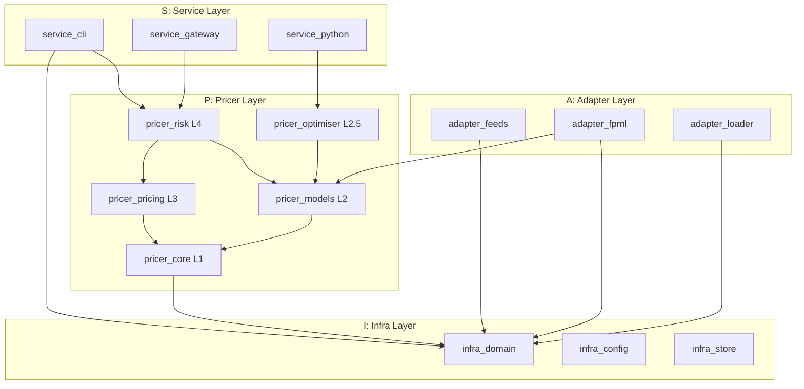
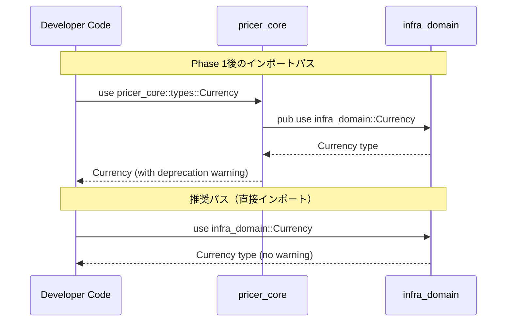

# Design Document

## Overview

**Purpose**: 本設計はA-I-P-Sアーキテクチャの依存関係ルール違反を解消し、基本型（primitives）とマスターデータ型を適切なレイヤーに配置することで、コードベース全体の一貫性と保守性を向上させる。

**Users**:
- Neutryx開発者（全レイヤー）がinfra_domainから基本型を安全にインポート可能になる
- Adapterレイヤー開発者がCurrency, RateIndex等のマスターデータに直接アクセス可能になる

**Impact**: pricer_core、pricer_models、infra_domainの3クレートに渡る型定義の再配置。後方互換性は再エクスポートにより維持。

### Goals
- A-I-P-Sアーキテクチャルール「InfraはPricerに依存しない」の完全遵守
- `DayCountConvention`の重複定義解消と統一
- 基本型（Currency, Date, BusinessDayConvention）のinfra_domainへの集約
- マスターデータ型（RateIndex, Frequency, Period, Direction）のinfra_domainへの移動
- 後方互換性維持による段階的移行パスの提供

## Architecture

### Existing Architecture Analysis

**現在のA-I-P-S依存関係**:
```
infra_domain: 依存なし（独立）
pricer_core: 依存なし（L1基盤）
pricer_models: pricer_core に依存（L2）
```

**問題点**:
1. `Currency`, `Date`等がpricer_coreに定義 → infra_domainから使用不可
2. `DayCountConvention`がpricer_coreとinfra_domainの両方に存在（重複）
3. `RateIndex`, `Frequency`等がpricer_modelsに定義 → Adapterから使用不可

### Architecture Pattern & Boundary Map



**Architecture Integration**:
- **Selected pattern**: Direct Move + Re-export（型移動と後方互換性再エクスポート）
- **Domain boundaries**: infra_domainが基本型の単一ソース、pricer_coreは再エクスポートのみ
- **Existing patterns preserved**: A-I-P-S一方向依存、静的ディスパッチ、フィーチャーフラグ分離
- **New components rationale**: `Tenor`型新規追加（RateIndexの依存先として必要）
- **Steering compliance**: structure.md、tech.mdの原則を維持

## System Flows

### 型移動とインポート解決フロー



## Requirements Traceability

| Requirement | Summary | Components | Interfaces | Flows |
|-------------|---------|------------|------------|-------|
| 1.1-1.5 | 基本型のinfra_domain移動 | Currency, Date, DayCountConvention, BusinessDayConvention | infra_domain public API | 型インポート |
| 2.1-2.4 | DayCountConvention統一 | DayCountConvention | year_fraction() | 日数計算 |
| 3.1-3.5 | pricer_core再エクスポート | pricer_core::types | deprecated re-exports | インポート解決 |
| 4.1-4.4 | エラー型移動 | DateError, CurrencyError | Result types | エラーハンドリング |
| 5.1-5.4 | Calendar統合 | Calendar | add_business_days(), is_business_day() | 営業日計算 |
| 6.1-6.3 | serdeフィーチャー維持 | All moved types | Serialize, Deserialize | シリアライゼーション |
| 7.1-7.4 | 依存関係検証 | CI check | cargo tree | ビルド検証 |
| 8.1-8.5 | RateIndex移動 | RateIndex | currency(), tenor(), day_count_convention() | 金利指標参照 |
| 9.1-9.4 | Frequency移動 | Frequency | months_per_period(), periods_per_year() | スケジュール生成 |
| 10.1-10.4 | Period移動 | Period | accrual_days(), year_fraction() | 期間計算 |
| 11.1-11.4 | TradeDirection統合 | TradeDirection, SwapDirection | From traits | 方向変換 |
| 12.1-12.3 | CsaTerms Currency統合 | CsaTerms | collateral_currency field | 型安全性 |
| 13.1-13.4 | Tenor追加 | Tenor | to_months(), add_to_date() | 期間表現 |

## Components and Interfaces

| Component | Domain/Layer | Intent | Req Coverage | Key Dependencies | Contracts |
|-----------|--------------|--------|--------------|------------------|-----------|
| Currency | infra_domain | ISO 4217通貨コード表現 | 1.1, 12.1 | None (P0) | Service |
| Date | infra_domain | 型安全な日付ラッパー | 1.2, 5.1 | chrono (P0) | Service |
| DayCountConvention | infra_domain | 日数計算規約 | 1.3, 2.1-2.4 | Date (P0) | Service |
| BusinessDayConvention | infra_domain | 営業日調整規約 | 1.4, 5.2 | None (P0) | Service |
| DateError | infra_domain | 日付エラー型 | 4.1, 4.3 | thiserror (P0) | Service |
| CurrencyError | infra_domain | 通貨エラー型 | 4.2, 4.4 | thiserror (P0) | Service |
| Tenor | infra_domain | 金融期間表現 | 13.1-13.4 | Date (P1) | Service |
| RateIndex | infra_domain | ベンチマーク金利指標 | 8.1-8.5 | Currency, Tenor, DayCountConvention (P1) | Service |
| Frequency | infra_domain | 支払頻度 | 9.1-9.4 | None (P0) | Service |
| Period | infra_domain | 単一accrual期間 | 10.1-10.4 | Date, DayCountConvention (P1) | Service |
| TradeDirection | infra_domain | 汎用取引方向 | 11.1-11.2 | None (P0) | Service |
| SwapDirection | infra_domain | スワップ取引方向 | 11.2 | None (P0) | Service |

### infra_domain Layer

#### Currency

##### Service Interface
```rust
#[non_exhaustive]
#[derive(Copy, Clone, Debug, PartialEq, Eq, Hash)]
#[cfg_attr(feature = "serde", derive(Serialize, Deserialize))]
pub enum Currency {
    // ... implementation omitted ...
```
- Preconditions: None
- Postconditions: 常に有効なISO 4217コードを返す
- Invariants: `code()`は常に3文字の大文字

#### Date

##### Service Interface
```rust
#[derive(Copy, Clone, Debug, PartialEq, Eq, PartialOrd, Ord, Hash)]
#[cfg_attr(feature = "serde", derive(Serialize, Deserialize))]
#[cfg_attr(feature = "serde", serde(transparent))]
pub struct Date(NaiveDate);
    // ... implementation omitted ...
```
- Preconditions: `from_ymd`は有効なグレゴリオ暦日付
- Postconditions: 常に有効な日付を保持
- Invariants: 内部NaiveDateは常に有効

#### DayCountConvention

##### Service Interface
```rust
#[non_exhaustive]
#[derive(Debug, Clone, Copy, PartialEq, Eq, Hash, Default)]
#[cfg_attr(feature = "serde", derive(Serialize, Deserialize))]
pub enum DayCountConvention {
    #[default]
    // ... implementation omitted ...
```
- Preconditions: `year_fraction`では`start <= end`（そうでなければpanic）
- Postconditions: 常に有限のf64値を返す
- Invariants: 同一日付間のyear_fractionは0.0

#### BusinessDayConvention

##### Service Interface
```rust
#[non_exhaustive]
#[derive(Debug, Clone, Copy, PartialEq, Eq, Hash)]
#[cfg_attr(feature = "serde", derive(Serialize, Deserialize))]
pub enum BusinessDayConvention {
    // ... implementation omitted ...
```

#### Tenor

##### Service Interface
```rust
#[non_exhaustive]
#[derive(Debug, Clone, Copy, PartialEq, Eq, Hash)]
#[cfg_attr(feature = "serde", derive(Serialize, Deserialize))]
pub enum Tenor {
/// 月末日処理ルール
#[derive(Debug, Clone, Copy, PartialEq, Eq, Hash, Default)]
pub enum EndOfMonthRule {
    /// 月末日の場合、結果も月末日に調整（例: 1/31 + 1M = 2/28）
    #[default]
    // ... implementation omitted ...
```
- Preconditions: None
- Postconditions: `add_to_date`は常に有効な日付を返す
- Invariants: `to_months()`は`OneYear` = 12

**月末処理ルールの詳細**:
- `EndOfMonthRule::Adjust`（デフォルト）: 開始日が月末の場合、結果日も月末に調整。金融市場の標準的な慣行
  - 例: 2024-01-31 + 1M = 2024-02-29（閏年）
  - 例: 2024-02-29 + 1M = 2024-03-31
- `EndOfMonthRule::Preserve`: 日を維持しようとし、無効な場合は月末にフォールバック
  - 例: 2024-01-31 + 1M = 2024-02-29（31日が存在しないため）
- `EndOfMonthRule::None`: 単純な月加算、無効日は月末にフォールバック

#### RateIndex

##### Service Interface
```rust
#[non_exhaustive]
#[derive(Debug, Clone, Copy, PartialEq, Eq, Hash)]
#[cfg_attr(feature = "serde", derive(Serialize, Deserialize))]
pub enum RateIndex {
    // ... implementation omitted ...
```

#### Frequency

##### Service Interface
```rust
#[derive(Debug, Clone, Copy, PartialEq, Eq, Hash)]
#[cfg_attr(feature = "serde", derive(Serialize, Deserialize))]
pub enum Frequency {
    Annual,
    SemiAnnual,
    Quarterly,
    Monthly,
    Weekly,
    Daily,
}

impl Frequency {
    pub fn months_per_period(&self) -> u32;
    pub fn periods_per_year(&self) -> u32;
}
```

#### Period

##### Service Interface
```rust
#[derive(Debug, Clone, Copy, PartialEq)]
#[cfg_attr(feature = "serde", derive(Serialize, Deserialize))]
pub struct Period {
    pub start: Date,
    pub end: Date,
    pub payment: Date,
}

impl Period {
    pub fn new(start: Date, end: Date, payment: Date) -> Self;
    pub fn accrual_days(&self) -> i64;
    pub fn year_fraction(&self, day_count: DayCountConvention) -> f64;
}
```

#### TradeDirection / SwapDirection

##### Service Interface (infra_domain)
```rust
#[derive(Debug, Clone, Copy, PartialEq, Eq, Hash)]
#[cfg_attr(feature = "serde", derive(Serialize, Deserialize))]
pub enum TradeDirection {
#[derive(Debug, Clone, Copy, PartialEq, Eq, Hash)]
#[cfg_attr(feature = "serde", derive(Serialize, Deserialize))]
pub enum SwapDirection {
    // ... implementation omitted ...
```

##### Extension Interface (pricer_models)
```rust
pub trait TradeDirectionExt {
pub trait SwapDirectionExt {
    // ... implementation omitted ...
```

### pricer_core Layer (Re-exports)

#### Deprecated Re-exports

```rust
#[deprecated(since = "0.9.0", note = "Use infra_domain::Currency instead")]
#[deprecated(since = "0.9.0", note = "Use infra_domain::Date instead")]
#[deprecated(since = "0.9.0", note = "Use infra_domain::DayCountConvention instead")]
#[deprecated(since = "0.9.0", note = "Use infra_domain::BusinessDayConvention instead")]
#[deprecated(since = "0.9.0", note = "Use infra_domain::DateError instead")]
#[deprecated(since = "0.9.0", note = "Use infra_domain::CurrencyError instead")]
    // ... implementation omitted ...
```
## Data Models

### Domain Model

*[Mermaid diagram omitted]*

## Error Handling

### Error Categories and Responses

**User Errors** (Invalid Input):
- `DateError::InvalidDate` → 無効な年月日の組み合わせ
- `DateError::ParseError` → ISO 8601形式でないパース失敗
- `CurrencyError::UnknownCurrency` → 未知の通貨コード

**System Errors**:
- None（この機能は純粋な型定義のため）

### Error Types

```rust
#[derive(Debug, Error)]
pub enum DateError {
    #[error("Invalid date: {year}-{month:02}-{day:02}")]
    #[error("Failed to parse date: {0}")]
#[derive(Debug, Error)]
pub enum CurrencyError {
    #[error("Unknown currency code: {0}")]
    // ... implementation omitted ...
```

## Testing Strategy

### Unit Tests
- `Currency::from_str`の大文字小文字非依存パース
- `Date::from_ymd`の境界値（閏年2/29、無効日付）
- `DayCountConvention::year_fraction`の各convention正確性
- `Tenor::add_to_date`の月末処理
- `RateIndex::currency`の正しいマッピング

### Integration Tests
- `pricer_core`からの再エクスポートが正しく動作
- deprecation警告の発生確認
- `Calendar`と`Date`の連携（営業日計算）
- `Period`と`DayCountConvention`の連携（year fraction計算）

### Property-Based Tests
- `DayCountConvention::year_fraction`の加法性（yf(a,c) ≈ yf(a,b) + yf(b,c)）
- `Date`算術の整合性（date + n - n = date）
- `Tenor::to_months`と`add_to_date`の整合性

*[Mermaid diagram omitted]*
### Phase Breakdown

1. **Phase 1: 基盤型移動**（最初に実行、他の型の依存先）
   - Rollback trigger: ビルド失敗、テスト失敗
   - Validation: `cargo build -p infra_domain`, `cargo test -p infra_domain`

2. **Phase 2: マスターデータ型移動**（Phase 1完了後）
   - Rollback trigger: pricer_modelsのビルド失敗
   - Validation: `cargo build --workspace`, `cargo test --workspace`

3. **Phase 3: 再エクスポート設定**（後方互換性確保）
   - Rollback trigger: 既存コードのコンパイルエラー
   - Validation: deprecation警告の発生確認

4. **Phase 4: 検証とCI更新**
   - Rollback trigger: 依存関係ルール違反
   - Validation: `cargo tree -p infra_domain`で禁止依存なし
