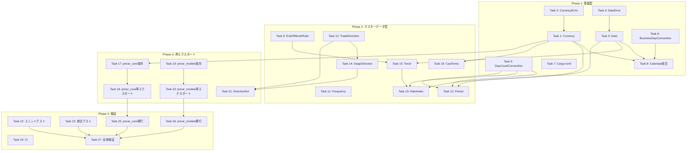

# Implementation Tasks

## Phase 1: 基盤型移動（infra_master拡張）

### Task 1: Currency型のinfra_master実装 (P)
**Requirements:** 1.1, 6.1

**Description:**
`infra_master`クレートに`Currency` enum を新規実装する。ISO 4217通貨コードの型安全な表現を提供し、`serde`フィーチャーフラグ対応を含める。

**Acceptance Criteria:**
- [ ] `crates/infra_master/src/currency.rs`を新規作成
- [ ] `Currency` enum（USD, EUR, GBP, JPY, CHF）を定義
- [ ] `#[non_exhaustive]`属性を追加
- [ ] `code() -> &'static str`メソッドを実装
- [ ] `decimal_places() -> u8`メソッドを実装
- [ ] `FromStr`, `Display`トレイトを実装
- [ ] `#[cfg_attr(feature = "serde", derive(Serialize, Deserialize))]`を追加
- [ ] `lib.rs`でpub exportを追加

### Task 2: CurrencyError型のinfra_master実装 (P)
**Requirements:** 4.2, 4.4

**Description:**
`infra_master`クレートに`CurrencyError` enum を新規実装する。`thiserror`を使用した構造化エラー型を提供する。

**Acceptance Criteria:**
- [ ] `crates/infra_master/src/error.rs`に`CurrencyError`を追加
- [ ] `UnknownCurrency(String)`バリアントを定義
- [ ] `thiserror::Error`deriveマクロを使用
- [ ] `lib.rs`でpub exportを追加

### Task 3: Date型のinfra_master実装 (P)
**Requirements:** 1.2, 5.1, 6.1

**Description:**
`infra_master`クレートに`Date` struct を新規実装する。`chrono::NaiveDate`のラッパーとして型安全な日付表現を提供する。

**Acceptance Criteria:**
- [ ] `crates/infra_master/src/date.rs`を新規作成
- [ ] `Date(NaiveDate)`newtype structを定義
- [ ] `from_ymd(year, month, day) -> Result<Self, DateError>`を実装
- [ ] `today() -> Self`を実装
- [ ] `parse(s: &str) -> Result<Self, DateError>`を実装
- [ ] `into_inner() -> NaiveDate`を実装
- [ ] `year()`, `month()`, `day()`アクセサを実装
- [ ] `Sub`, `Add<i64>`演算子を実装
- [ ] `FromStr`, `Display`トレイトを実装
- [ ] `#[cfg_attr(feature = "serde", derive(Serialize, Deserialize))]`を追加
- [ ] `serde(transparent)`属性を追加
- [ ] `lib.rs`でpub exportを追加

### Task 4: DateError型のinfra_master実装 (P)
**Requirements:** 4.1, 4.3

**Description:**
`infra_master`クレートに`DateError` enum を新規実装する。日付関連エラーの構造化表現を提供する。

**Acceptance Criteria:**
- [ ] `crates/infra_master/src/error.rs`に`DateError`を追加
- [ ] `InvalidDate { year, month, day }`バリアントを定義
- [ ] `ParseError(String)`バリアントを定義
- [ ] `thiserror::Error`deriveマクロを使用
- [ ] `lib.rs`でpub exportを追加

### Task 5: DayCountConvention統合（既存infra_master版の拡張）
**Requirements:** 1.3, 2.1-2.4, 6.1

**Description:**
`infra_master`の既存`DayCountConvention`を拡張し、7つのISDA標準バリアントを持つ統一版として完成させる。`pricer_core`版との差異を解消する。

**Acceptance Criteria:**
- [ ] 既存`infra_master::DayCountConvention`の7バリアントを確認（Actual360, Actual365Fixed, Actual36525, ActualActualIsda, Thirty360Bond, Thirty360European, ThirtyE360Isda）
- [ ] バリアント名を`pricer_core`版と統一（**エイリアスは追加しない、直接修正のみ**）
- [ ] `name() -> &'static str`メソッドを追加
- [ ] `year_fraction_dates(start: Date, end: Date) -> f64`メソッドを追加
- [ ] `FromStr`, `Display`トレイトを実装（未実装の場合）
- [ ] `#[cfg_attr(feature = "serde", derive(Serialize, Deserialize))]`を追加
- [ ] `#[non_exhaustive]`を追加

### Task 6: BusinessDayConvention型のinfra_master実装 (P)
**Requirements:** 1.4, 5.2, 6.1

**Description:**
`infra_master`クレートに`BusinessDayConvention` enum を新規実装する。営業日調整規約の型安全な表現を提供する。

**Acceptance Criteria:**
- [ ] `crates/infra_master/src/business_day.rs`を新規作成
- [ ] `BusinessDayConvention` enum（Following, ModifiedFollowing, Preceding, ModifiedPreceding, Unadjusted）を定義
- [ ] `#[non_exhaustive]`属性を追加
- [ ] `name() -> &'static str`メソッドを実装
- [ ] `code() -> &'static str`メソッドを実装
- [ ] `FromStr`, `Display`トレイトを実装
- [ ] `#[cfg_attr(feature = "serde", derive(Serialize, Deserialize))]`を追加
- [ ] `lib.rs`でpub exportを追加

### Task 7: Cargo.toml更新（infra_master依存関係追加）
**Requirements:** 6.3, 7.1

**Description:**
`infra_master/Cargo.toml`にフィーチャーフラグとオプショナル依存を追加する。

**Acceptance Criteria:**
- [ ] `serde = { version = "1", optional = true }`を追加（未追加の場合）
- [ ] `thiserror`依存を確認
- [ ] `[features]`セクションに`serde = ["dep:serde"]`を追加
- [ ] pricer_*, service_*, adapter_*への依存がないことを確認

### Task 8: Calendar統合（Dateとの連携）
**Requirements:** 5.1-5.4

**Description:**
既存`infra_master::Calendar`を新しい`Date`型と連携させる。`add_business_days`と`is_business_day`のシグネチャを更新する。

**Acceptance Criteria:**
- [ ] `Calendar::is_business_day(date: Date) -> bool`に更新
- [ ] `Calendar::add_business_days(date: Date, n: i32) -> Date`に更新
- [ ] `BusinessDayConvention`を`Calendar::adjust`メソッドで使用
- [ ] 既存テストを新しいシグネチャに更新

## Phase 2: マスターデータ型移動

### Task 9: EndOfMonthRule型のinfra_master実装
**Requirements:** 13.4

**Description:**
`infra_master`クレートに`EndOfMonthRule` enum を新規実装する。月末日処理ルールを型安全に表現する。

**Acceptance Criteria:**
- [ ] `crates/infra_master/src/tenor.rs`に`EndOfMonthRule`を追加
- [ ] `Adjust`（デフォルト）, `Preserve`, `None`バリアントを定義
- [ ] `#[derive(Default)]`で`Adjust`をデフォルトに設定
- [ ] `#[cfg_attr(feature = "serde", derive(Serialize, Deserialize))]`を追加
- [ ] `lib.rs`でpub exportを追加

### Task 10: Tenor型のinfra_master実装
**Requirements:** 13.1-13.4

**Description:**
`infra_master`クレートに`Tenor` enum を新規実装する。金融期間（3M, 6M, 1Y等）の型安全な表現を提供する。

**Acceptance Criteria:**
- [ ] `crates/infra_master/src/tenor.rs`を新規作成
- [ ] `Tenor` enum（Overnight, OneWeek, TwoWeeks, OneMonth, TwoMonths, ThreeMonths, SixMonths, NineMonths, OneYear, TwoYears, ThreeYears, FiveYears, SevenYears, TenYears, FifteenYears, TwentyYears, ThirtyYears）を定義
- [ ] `#[non_exhaustive]`属性を追加
- [ ] `code() -> &'static str`メソッドを実装（"ON", "1W", "3M"等）
- [ ] `to_months() -> u32`メソッドを実装
- [ ] `to_days() -> u32`メソッドを実装（概算）
- [ ] `add_to_date(date: Date, eom_rule: EndOfMonthRule) -> Date`メソッドを実装
- [ ] `FromStr`, `Display`トレイトを実装
- [ ] `#[cfg_attr(feature = "serde", derive(Serialize, Deserialize))]`を追加
- [ ] `lib.rs`でpub exportを追加

### Task 11: Frequency型のinfra_master実装 (P)
**Requirements:** 9.1-9.4

**Description:**
`infra_master`クレートに`Frequency` enum を新規実装する。支払頻度の型安全な表現を提供する。

**Acceptance Criteria:**
- [ ] `crates/infra_master/src/frequency.rs`を新規作成
- [ ] `Frequency` enum（Annual, SemiAnnual, Quarterly, Monthly, Weekly, Daily）を定義
- [ ] `months_per_period() -> u32`メソッドを実装
- [ ] `periods_per_year() -> u32`メソッドを実装
- [ ] `FromStr`, `Display`トレイトを実装
- [ ] `#[cfg_attr(feature = "serde", derive(Serialize, Deserialize))]`を追加
- [ ] `lib.rs`でpub exportを追加

### Task 12: Period型のinfra_master実装
**Requirements:** 10.1-10.4

**Description:**
`infra_master`クレートに`Period` struct を新規実装する。単一accrual期間の構造体を提供する。

**Acceptance Criteria:**
- [ ] `crates/infra_master/src/period.rs`を新規作成
- [ ] `Period`構造体（`start: Date`, `end: Date`, `payment: Date`）を定義
- [ ] `new(start, end, payment) -> Self`を実装
- [ ] `accrual_days() -> i64`メソッドを実装
- [ ] `year_fraction(day_count: DayCountConvention) -> f64`メソッドを実装
- [ ] `#[cfg_attr(feature = "serde", derive(Serialize, Deserialize))]`を追加
- [ ] `lib.rs`でpub exportを追加

### Task 13: TradeDirection型のinfra_master実装 (P)
**Requirements:** 11.1-11.2

**Description:**
`infra_master`クレートに`TradeDirection` enum を新規実装する。汎用取引方向の型安全な表現を提供する。**`sign()`メソッドは含めない**（pricer_modelsの拡張トレイトで提供）。

**Acceptance Criteria:**
- [ ] `crates/infra_master/src/direction.rs`を新規作成
- [ ] `TradeDirection` enum（Long, Short）を定義
- [ ] `#[cfg_attr(feature = "serde", derive(Serialize, Deserialize))]`を追加
- [ ] `lib.rs`でpub exportを追加

### Task 14: SwapDirection型のinfra_master実装 (P)
**Requirements:** 11.2

**Description:**
`infra_master`クレートに`SwapDirection` enum を新規実装する。スワップ取引方向の型安全な表現を提供する。

**Acceptance Criteria:**
- [ ] `crates/infra_master/src/direction.rs`に`SwapDirection`を追加
- [ ] `SwapDirection` enum（PayFixed, ReceiveFixed）を定義
- [ ] `From<SwapDirection> for TradeDirection`を実装
- [ ] `#[cfg_attr(feature = "serde", derive(Serialize, Deserialize))]`を追加
- [ ] `lib.rs`でpub exportを追加

### Task 15: RateIndex型のinfra_master実装
**Requirements:** 8.1-8.5

**Description:**
`infra_master`クレートに`RateIndex` enum を新規実装する。ベンチマーク金利指標のマスターデータを提供する。

**Acceptance Criteria:**
- [ ] `crates/infra_master/src/rate_index.rs`を新規作成
- [ ] `RateIndex` enum（Sofr, Tonar, Euribor3M, Euribor6M, Sonia, Saron）を定義
- [ ] `#[non_exhaustive]`属性を追加
- [ ] `currency() -> Currency`メソッドを実装
- [ ] `tenor() -> Tenor`メソッドを実装
- [ ] `day_count_convention() -> DayCountConvention`メソッドを実装
- [ ] `name() -> &'static str`メソッドを実装
- [ ] `#[cfg_attr(feature = "serde", derive(Serialize, Deserialize))]`を追加
- [ ] `lib.rs`でpub exportを追加

### Task 16: CsaTerms型のCurrency統合
**Requirements:** 12.1-12.3

**Description:**
既存`infra_master::CsaTerms`の`collateral_currency`フィールドを`String`から`Currency`型に変更する。

**Acceptance Criteria:**
- [ ] `CsaTerms`の`collateral_currency: String`を`collateral_currency: Currency`に変更
- [ ] 関連するコンストラクタ/ファクトリメソッドを更新
- [ ] 既存テストを新しい型に更新

## Phase 3: 再エクスポート設定

### Task 17: pricer_core依存関係更新
**Requirements:** 3.3, 7.2

**Description:**
`pricer_core/Cargo.toml`に`infra_master`依存を追加し、型の再エクスポートを可能にする。

**Acceptance Criteria:**
- [ ] `Cargo.toml`に`infra_master = { path = "../infra_master" }`を追加
- [ ] フィーチャーフラグを同期（serde）

### Task 18: pricer_core deprecated再エクスポート（基盤型）
**Requirements:** 3.1-3.5

**Description:**
`pricer_core`から`infra_master`の基盤型をdeprecated属性付きで再エクスポートする。

**Acceptance Criteria:**
- [ ] `types/mod.rs`に`#[deprecated]`付き`pub use infra_master::Currency;`を追加
- [ ] `types/mod.rs`に`#[deprecated]`付き`pub use infra_master::Date;`を追加
- [ ] `types/mod.rs`に`#[deprecated]`付き`pub use infra_master::DayCountConvention;`を追加
- [ ] `types/mod.rs`に`#[deprecated]`付き`pub use infra_master::BusinessDayConvention;`を追加
- [ ] `types/mod.rs`に`#[deprecated]`付き`pub use infra_master::DateError;`を追加
- [ ] `types/mod.rs`に`#[deprecated]`付き`pub use infra_master::CurrencyError;`を追加
- [ ] 元の型定義ファイル（currency.rs, time.rs等）を削除またはdeprecation注記

### Task 19: pricer_models依存関係更新
**Requirements:** 8.5, 9.4, 10.4, 11.3

**Description:**
`pricer_models/Cargo.toml`に`infra_master`依存を追加（既存の場合は確認）し、型の再エクスポートを可能にする。

**Acceptance Criteria:**
- [ ] `Cargo.toml`に`infra_master`依存を確認/追加
- [ ] フィーチャーフラグを同期

### Task 20: pricer_models deprecated再エクスポート（マスターデータ型）
**Requirements:** 8.5, 9.4, 10.4, 11.3

**Description:**
`pricer_models`から`infra_master`のマスターデータ型をdeprecated属性付きで再エクスポートする。

**Acceptance Criteria:**
- [ ] `instruments/rates/mod.rs`に`#[deprecated]`付き`pub use infra_master::RateIndex;`を追加
- [ ] `schedules/mod.rs`に`#[deprecated]`付き`pub use infra_master::Frequency;`を追加
- [ ] `schedules/mod.rs`に`#[deprecated]`付き`pub use infra_master::Period;`を追加
- [ ] 元の型定義を削除またはdeprecation注記

### Task 21: TradeDirectionExt拡張トレイト実装（pricer_models）
**Requirements:** 11.1-11.4

**Description:**
`pricer_models`に`TradeDirectionExt`と`SwapDirectionExt`拡張トレイトを実装し、`sign()`等の計算メソッドを提供する。

**Acceptance Criteria:**
- [ ] `crates/pricer_models/src/direction_ext.rs`を新規作成
- [ ] `TradeDirectionExt`トレイト（`fn sign<T: Float>(&self) -> T`）を定義
- [ ] `impl TradeDirectionExt for TradeDirection`を実装
- [ ] `SwapDirectionExt`トレイト（`fn fixed_leg_sign<T: Float>(&self) -> T`）を定義
- [ ] `impl SwapDirectionExt for SwapDirection`を実装
- [ ] `pub use infra_master::{TradeDirection, SwapDirection};`を追加
- [ ] `lib.rs`でpub exportを追加
- [ ] 既存の`sign()`呼び出し箇所を更新

## Phase 4: 検証とCI更新

### Task 22: infra_masterユニットテスト
**Requirements:** 1-6, 8-13

**Description:**
移動した全型のユニットテストを`infra_master`に追加する。

**Acceptance Criteria:**
- [ ] `Currency::from_str`の大文字小文字非依存テスト
- [ ] `Date::from_ymd`の境界値テスト（閏年、無効日付）
- [ ] `DayCountConvention::year_fraction`の各conventionテスト
- [ ] `Tenor::add_to_date`の月末処理テスト（EndOfMonthRule各パターン）
- [ ] `RateIndex`メソッドのテスト
- [ ] `Frequency`メソッドのテスト
- [ ] `Period::year_fraction`のテスト
- [ ] `TradeDirection`/`SwapDirection`の変換テスト

### Task 23: 統合テスト（再エクスポート検証）
**Requirements:** 3.1-3.5, 7.1-7.4

**Description:**
`pricer_core`と`pricer_models`からの再エクスポートが正しく動作することを検証する統合テストを追加する。

**Acceptance Criteria:**
- [ ] `pricer_core`からの再エクスポートインポートテスト
- [ ] `pricer_models`からの再エクスポートインポートテスト
- [ ] deprecation警告の発生確認
- [ ] 型の互換性テスト（infra_master版とre-export版が同一型）

### Task 24: CI依存関係チェック追加
**Requirements:** 7.3-7.4

**Description:**
CIパイプラインに`infra_master`の依存関係検証チェックを追加する。

**Acceptance Criteria:**
- [ ] `cargo tree -p infra_master`で禁止依存チェックスクリプト作成
- [ ] CIワークフローにチェックステップ追加
- [ ] pricer_*, service_*, adapter_*への依存がある場合失敗するように設定

### Task 25: 既存コード移行（pricer_core内部）
**Requirements:** 1-7

**Description:**
`pricer_core`内部の既存コードを`infra_master`からのインポートに移行する。

**Acceptance Criteria:**
- [ ] `pricer_core`内の`Currency`使用箇所を`infra_master::Currency`に更新
- [ ] `pricer_core`内の`Date`使用箇所を`infra_master::Date`に更新
- [ ] `pricer_core`内の`DayCountConvention`使用箇所を`infra_master::DayCountConvention`に更新
- [ ] 元の型定義ファイルを削除

### Task 26: 既存コード移行（pricer_models内部）
**Requirements:** 8-11

**Description:**
`pricer_models`内部の既存コードを`infra_master`からのインポートに移行する。

**Acceptance Criteria:**
- [ ] `pricer_models`内の`RateIndex`使用箇所を`infra_master::RateIndex`に更新
- [ ] `pricer_models`内の`Frequency`使用箇所を`infra_master::Frequency`に更新
- [ ] `pricer_models`内の`Period`使用箇所を`infra_master::Period`に更新
- [ ] `pricer_models`内のDirection型使用箇所を更新
- [ ] 元の型定義ファイルを削除

### Task 27: ワークスペース全体ビルド検証
**Requirements:** 7.1-7.4

**Description:**
ワークスペース全体のビルドとテストを実行し、移行が正常に完了したことを検証する。

**Acceptance Criteria:**
- [ ] `cargo build --workspace`が成功
- [ ] `cargo test --workspace`が成功
- [ ] `cargo clippy --workspace`で新しい警告なし（deprecation以外）
- [ ] `cargo doc --workspace`が成功

## タスク依存関係

## 並列実行可能タスク

**(P)** マーカー付きタスクは他のタスクと並列実行可能：

**Phase 1内並列グループ:**
- Task 1, 2 (Currency + CurrencyError)
- Task 3, 4 (Date + DateError)
- Task 6 (BusinessDayConvention)
- Task 7 (Cargo.toml)

**Phase 2内並列グループ:**
- Task 11 (Frequency)
- Task 13, 14 (TradeDirection + SwapDirection)

**Phase 3内並列グループ:**
- Task 17, 19 (依存関係更新)
