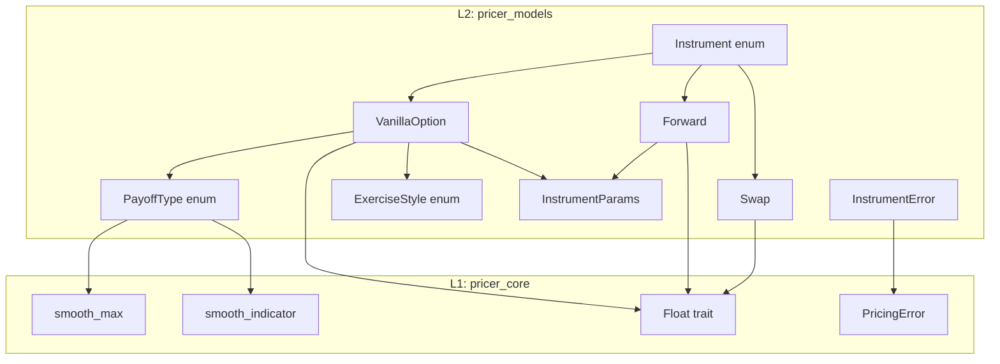
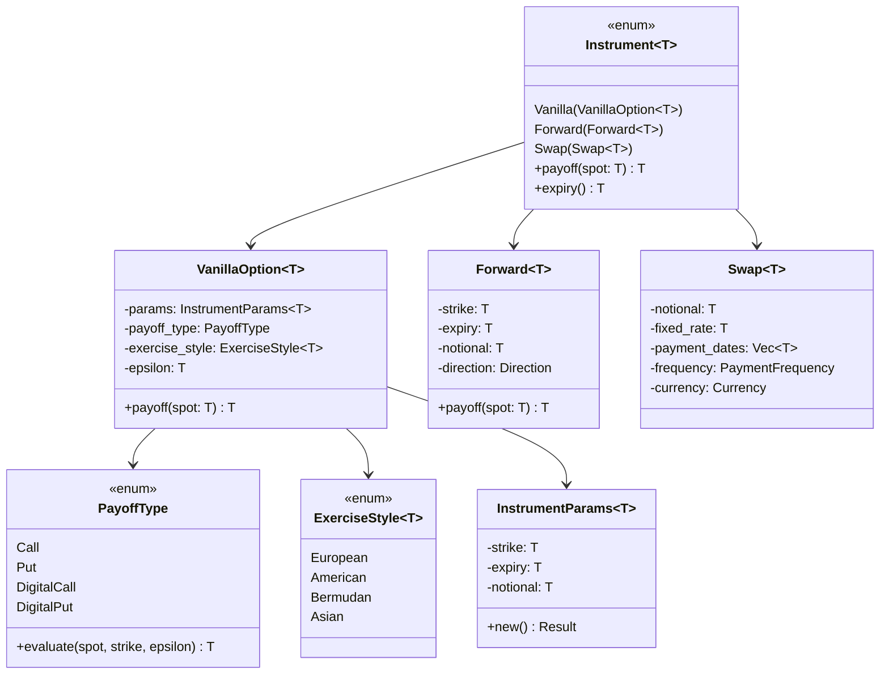

# Design Document

## Overview

**Purpose**: 本機能は pricer_models に金融商品定義を提供し、enum dispatch アーキテクチャによる Enzyme AD 互換のプライシングを実現する。

**Users**: クオンツ開発者がデリバティブ商品の定義とペイオフ計算を行う。

**Impact**: pricer_models/instruments/ モジュールを実装し、L2 ビジネスロジック層を完成させる。

### Goals
- Enzyme AD 互換の enum dispatch による商品定義
- smooth_max / smooth_indicator を活用した微分可能ペイオフ
- T: Float ジェネリクスによる f64/Dual64 両対応

### Non-Goals
- Monte Carlo パス生成（L3 pricer_kernel の責務）
- 解析解実装（Phase 2.3 Analytical Models で対応）
- エキゾチックオプション（将来フェーズで拡張）

## Architecture

### Architecture Pattern & Boundary Map



**Architecture Integration**:
- **Selected pattern**: Enum Dispatch — 静的ディスパッチで Enzyme 最適化
- **Domain boundaries**: instruments モジュールは商品定義のみ、プライシングは analytical/models が担当
- **Existing patterns preserved**: T: Float ジェネリクス、thiserror エラー型
- **New components rationale**: PayoffType 分離でペイオフロジック再利用
- **Steering compliance**: static dispatch via enum 原則を遵守

### Technology Stack

| Layer | Choice / Version | Role in Feature | Notes |
|-------|------------------|-----------------|-------|
| Core | pricer_core | Float trait, smoothing 関数, エラー型 | 依存 |
| Business Logic | pricer_models | Instrument 定義, Payoff 計算 | 本機能 |
| Numeric | num-traits | Float trait bounds | 既存依存 |
| Error | thiserror | InstrumentError 定義 | 既存パターン |

## Requirements Traceability

| Requirement | Summary | Components | Interfaces | Flows |
|-------------|---------|------------|------------|-------|
| 1.1-1.5 | Instrument enum 定義 | Instrument | payoff(), params() | N/A |
| 2.1-2.5 | PayoffType enum 定義 | PayoffType | evaluate() | N/A |
| 3.1-3.5 | InstrumentParams 構造体 | InstrumentParams | new(), accessors | N/A |
| 4.1-4.5 | VanillaOption 構造体 | VanillaOption | payoff() | N/A |
| 5.1-5.5 | ExerciseStyle enum | ExerciseStyle | N/A | N/A |
| 6.1-6.5 | Forward 構造体 | Forward | payoff() | N/A |
| 7.1-7.5 | Swap 構造体 | Swap | N/A | N/A |
| 8.1-8.5 | InstrumentError | InstrumentError | N/A | N/A |
| 9.1-9.5 | Smooth Payoff | PayoffType | evaluate() | N/A |
| 10.1-10.5 | AD 互換性 | All | N/A | N/A |

## Components and Interfaces

| Component | Domain/Layer | Intent | Req Coverage | Key Dependencies | Contracts |
|-----------|--------------|--------|--------------|------------------|-----------|
| Instrument | instruments | 商品タイプの統一表現 | 1.1-1.5 | VanillaOption, Forward, Swap (P0) | Service |
| PayoffType | instruments | ペイオフタイプ定義 | 2.1-2.5 | smooth_max, smooth_indicator (P0) | Service |
| InstrumentParams | instruments | 共通パラメータ | 3.1-3.5 | Float (P0) | Service |
| VanillaOption | instruments | バニラオプション | 4.1-4.5 | PayoffType, ExerciseStyle, InstrumentParams (P0) | Service |
| ExerciseStyle | instruments | 行使スタイル | 5.1-5.5 | Float (P0) | Service |
| Forward | instruments | フォワード契約 | 6.1-6.5 | Float (P0) | Service |
| Swap | instruments | スワップ契約 | 7.1-7.5 | Float, Currency (P0) | Service |
| InstrumentError | instruments | エラー型 | 8.1-8.5 | PricingError (P0) | Service |

### Instruments Layer

#### InstrumentError

| Field | Detail |
|-------|--------|
| Intent | 商品操作のエラーハンドリング |
| Requirements | 8.1, 8.2, 8.3, 8.4, 8.5 |

**Responsibilities & Constraints**
- 商品構築・ペイオフ計算のエラーを表現
- PricingError への変換を提供

**Dependencies**
- Outbound: PricingError — エラー変換 (P0)

**Contracts**: Service [x]

##### Service Interface
```rust
#[derive(Error, Debug, Clone, PartialEq)]
pub enum InstrumentError {
    #[error("Invalid strike: K = {strike}")]
    InvalidStrike { strike: f64 },

    #[error("Invalid expiry: T = {expiry}")]
    InvalidExpiry { expiry: f64 },

    #[error("Invalid notional: N = {notional}")]
    InvalidNotional { notional: f64 },

    #[error("Payoff computation error: {message}")]
    PayoffError { message: String },

    #[error("Invalid parameter: {message}")]
    InvalidParameter { message: String },
}

impl From<InstrumentError> for PricingError {
    fn from(err: InstrumentError) -> Self;
}
```

#### PayoffType

| Field | Detail |
|-------|--------|
| Intent | Call/Put/Digital ペイオフの微分可能実装 |
| Requirements | 2.1, 2.2, 2.3, 2.4, 2.5, 9.1, 9.2, 9.3, 9.4, 9.5 |

**Responsibilities & Constraints**
- smooth_max を使用した Call/Put ペイオフ
- smooth_indicator を使用した Digital ペイオフ
- epsilon パラメータによる滑らかさ制御

**Dependencies**
- External: pricer_core::math::smoothing — smooth_max, smooth_indicator (P0)

**Contracts**: Service [x]

##### Service Interface
```rust
#[derive(Debug, Clone, Copy, PartialEq)]
pub enum PayoffType {
    Call,
    Put,
    DigitalCall,
    DigitalPut,
}

impl PayoffType {
    /// Evaluate the payoff for given spot and strike.
    ///
    /// Uses smooth approximations for AD compatibility.
    pub fn evaluate<T: Float>(
        &self,
        spot: T,
        strike: T,
        epsilon: T,
    ) -> T;
}
```
- Preconditions: spot > 0, strike > 0, epsilon > 0
- Postconditions: Returns smooth payoff value
- Invariants: AD tape consistency maintained

**Implementation Notes**
- Integration: smooth_max(spot - strike, 0, epsilon) for Call
- Validation: epsilon > 0 assertion
- Risks: 極端な epsilon 値で数値不安定

#### InstrumentParams

| Field | Detail |
|-------|--------|
| Intent | 共通商品パラメータの集約 |
| Requirements | 3.1, 3.2, 3.3, 3.4, 3.5 |

**Responsibilities & Constraints**
- strike, expiry, notional の格納
- 構築時バリデーション

**Dependencies**
- External: num_traits::Float (P0)

**Contracts**: Service [x]

##### Service Interface
```rust
#[derive(Debug, Clone, Copy, PartialEq)]
pub struct InstrumentParams<T: Float> {
    strike: T,
    expiry: T,
    notional: T,
}

impl<T: Float> InstrumentParams<T> {
    pub fn new(strike: T, expiry: T, notional: T) -> Result<Self, InstrumentError>;
    pub fn strike(&self) -> T;
    pub fn expiry(&self) -> T;
    pub fn notional(&self) -> T;
}
```
- Preconditions: strike > 0, expiry > 0
- Postconditions: Valid params instance
- Invariants: All fields positive

#### ExerciseStyle

| Field | Detail |
|-------|--------|
| Intent | オプション行使スタイル定義 |
| Requirements | 5.1, 5.2, 5.3, 5.4, 5.5 |

**Responsibilities & Constraints**
- European/American/Bermudan/Asian の区別
- Bermudan: 行使日リスト格納
- Asian: 平均化パラメータ格納

**Dependencies**
- External: num_traits::Float (P0)

**Contracts**: Service [x]

##### Service Interface
```rust
#[derive(Debug, Clone, PartialEq)]
pub enum ExerciseStyle<T: Float> {
    European,
    American,
    Bermudan { exercise_dates: Vec<T> },
    Asian {
        averaging_start: T,
        averaging_end: T,
        num_observations: usize,
    },
}
```

#### VanillaOption

| Field | Detail |
|-------|--------|
| Intent | バニラオプションの統合表現 |
| Requirements | 4.1, 4.2, 4.3, 4.4, 4.5, 10.1, 10.2, 10.3, 10.4, 10.5 |

**Responsibilities & Constraints**
- InstrumentParams, PayoffType, ExerciseStyle の組み合わせ
- 微分可能ペイオフ計算

**Dependencies**
- Inbound: PayoffType — ペイオフ評価 (P0)
- Inbound: ExerciseStyle — 行使スタイル (P0)
- Inbound: InstrumentParams — パラメータ (P0)

**Contracts**: Service [x]

##### Service Interface
```rust
#[derive(Debug, Clone)]
pub struct VanillaOption<T: Float> {
    params: InstrumentParams<T>,
    payoff_type: PayoffType,
    exercise_style: ExerciseStyle<T>,
    epsilon: T,
}

impl<T: Float> VanillaOption<T> {
    pub fn new(
        params: InstrumentParams<T>,
        payoff_type: PayoffType,
        exercise_style: ExerciseStyle<T>,
        epsilon: T,
    ) -> Self;

    pub fn payoff(&self, spot: T) -> T;
    pub fn params(&self) -> &InstrumentParams<T>;
    pub fn payoff_type(&self) -> PayoffType;
    pub fn exercise_style(&self) -> &ExerciseStyle<T>;
}
```

#### Forward

| Field | Detail |
|-------|--------|
| Intent | フォワード契約の定義 |
| Requirements | 6.1, 6.2, 6.3, 6.4, 6.5 |

**Responsibilities & Constraints**
- Long/Short ディレクション
- 線形ペイオフ (smooth 不要)

**Dependencies**
- External: num_traits::Float (P0)

**Contracts**: Service [x]

##### Service Interface
```rust
#[derive(Debug, Clone, Copy, PartialEq)]
pub enum Direction {
    Long,
    Short,
}

#[derive(Debug, Clone, Copy)]
pub struct Forward<T: Float> {
    strike: T,
    expiry: T,
    notional: T,
    direction: Direction,
}

impl<T: Float> Forward<T> {
    pub fn new(
        strike: T,
        expiry: T,
        notional: T,
        direction: Direction,
    ) -> Result<Self, InstrumentError>;

    pub fn payoff(&self, spot: T) -> T;
}
```
- Postconditions: Long returns notional * (spot - strike), Short returns notional * (strike - spot)

#### Swap

| Field | Detail |
|-------|--------|
| Intent | 金利スワップの基本定義 |
| Requirements | 7.1, 7.2, 7.3, 7.4, 7.5 |

**Responsibilities & Constraints**
- 固定レート、名目元本、支払頻度
- 支払日バリデーション

**Dependencies**
- External: num_traits::Float (P0)
- External: Currency (P1)

**Contracts**: Service [x]

##### Service Interface
```rust
#[derive(Debug, Clone, Copy, PartialEq)]
pub enum PaymentFrequency {
    Annual,
    SemiAnnual,
    Quarterly,
    Monthly,
}

#[derive(Debug, Clone)]
pub struct Swap<T: Float> {
    notional: T,
    fixed_rate: T,
    payment_dates: Vec<T>,
    frequency: PaymentFrequency,
    currency: Currency,
}

impl<T: Float> Swap<T> {
    pub fn new(
        notional: T,
        fixed_rate: T,
        payment_dates: Vec<T>,
        frequency: PaymentFrequency,
        currency: Currency,
    ) -> Result<Self, InstrumentError>;
}
```

#### Instrument Enum

| Field | Detail |
|-------|--------|
| Intent | 全商品タイプの統一表現 |
| Requirements | 1.1, 1.2, 1.3, 1.4, 1.5 |

**Responsibilities & Constraints**
- 静的ディスパッチによる Enzyme 最適化
- 各バリアントで具体型を保持

**Dependencies**
- Inbound: VanillaOption, Forward, Swap (P0)

**Contracts**: Service [x]

##### Service Interface
```rust
#[derive(Debug, Clone)]
pub enum Instrument<T: Float> {
    Vanilla(VanillaOption<T>),
    Forward(Forward<T>),
    Swap(Swap<T>),
}

impl<T: Float> Instrument<T> {
    /// Compute the payoff for the instrument at given spot.
    pub fn payoff(&self, spot: T) -> T;

    /// Return the expiry time of the instrument.
    pub fn expiry(&self) -> T;
}
```

## Data Models

### Domain Model



### Logical Data Model

**Structure Definition**:
- Instrument enum: 商品タイプのルートエンティティ
- VanillaOption: オプション商品の集約
- PayoffType: 値オブジェクト（ペイオフ種別）
- ExerciseStyle: 値オブジェクト（行使スタイル）
- InstrumentParams: 値オブジェクト（共通パラメータ）

**Consistency & Integrity**:
- 構築時バリデーションで不変条件を保証
- T: Float 制約で型安全性を確保

## Error Handling

### Error Strategy
- 構築時バリデーションで早期失敗
- Result<T, InstrumentError> によるエラー伝播
- PricingError への変換で統一エラーハンドリング

### Error Categories and Responses
**User Errors**: InvalidStrike, InvalidExpiry, InvalidNotional → 明確なエラーメッセージ
**Business Logic Errors**: PayoffError → 計算失敗の詳細を提供

## Testing Strategy

### Unit Tests
- PayoffType::evaluate for Call/Put/Digital with various spot/strike combinations
- InstrumentParams validation (positive values only)
- Forward payoff calculation for Long/Short directions
- ExerciseStyle enum variants

### Integration Tests
- VanillaOption payoff calculation with smooth approximations
- Instrument enum dispatch to correct payoff methods
- InstrumentError to PricingError conversion

### AD Compatibility Tests
- Dual64 instantiation and payoff calculation
- Derivative propagation verification
- smooth_max / smooth_indicator integration

### Property-based Tests
- Payoff non-negativity for vanilla options
- Put-Call parity approximation (where applicable)
- Smoothing epsilon convergence
