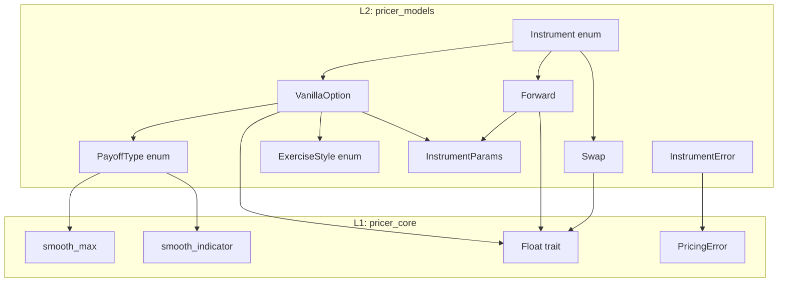
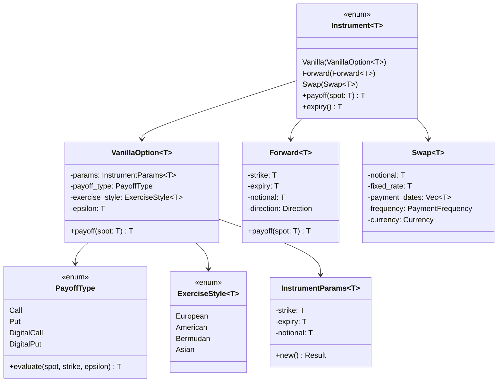

# Design Document

## Overview

**Purpose**: 本機能は pricer_models に金融商品定義を提供し、enum dispatch アーキテクチャによる Enzyme AD 互換のプライシングを実現する。

**Users**: クオンツ開発者がデリバティブ商品の定義とペイオフ計算を行う。

**Impact**: pricer_models/instruments/ モジュールを実装し、L2 ビジネスロジック層を完成させる。

### Goals
- Enzyme AD 互換の enum dispatch による商品定義
- smooth_max / smooth_indicator を活用した微分可能ペイオフ
- T: Float ジェネリクスによる f64/Dual64 両対応

## Architecture

### Architecture Pattern & Boundary Map


```mermaid
graph TB
    subgraph L2_pricer_models[L2: pricer_models]
        Instrument[Instrument enum]
        VanillaOption[VanillaOption]
        Forward[Forward]
        Swap[Swap]
        PayoffType[PayoffType enum]
        ExerciseStyle[ExerciseStyle enum]
        InstrumentParams[InstrumentParams]
        InstrumentError[InstrumentError]
    end

    subgraph L1_pricer_core[L1: pricer_core]
        SmoothMax[smooth_max]
        SmoothIndicator[smooth_indicator]
        Float[Float trait]
        PricingError[PricingError]
    end

    Instrument --> VanillaOption
    Instrument --> Forward
    Instrument --> Swap
    VanillaOption --> PayoffType
    VanillaOption --> ExerciseStyle
    VanillaOption --> InstrumentParams
    Forward --> InstrumentParams
    PayoffType --> SmoothMax
    PayoffType --> SmoothIndicator
    InstrumentError --> PricingError
    VanillaOption --> Float
    Forward --> Float
    Swap --> Float
```

**Architecture Integration**:
- **Selected pattern**: Enum Dispatch — 静的ディスパッチで Enzyme 最適化
- **Domain boundaries**: instruments モジュールは商品定義のみ、プライシングは analytical/models が担当
- **Existing patterns preserved**: T: Float ジェネリクス、thiserror エラー型
- **New components rationale**: PayoffType 分離でペイオフロジック再利用
- **Steering compliance**: static dispatch via enum 原則を遵守

## Requirements Traceability

| Requirement | Summary | Components | Interfaces | Flows |
|-------------|---------|------------|------------|-------|
| 1.1-1.5 | Instrument enum 定義 | Instrument | payoff(), params() | N/A |
| 2.1-2.5 | PayoffType enum 定義 | PayoffType | evaluate() | N/A |
| 3.1-3.5 | InstrumentParams 構造体 | InstrumentParams | new(), accessors | N/A |
| 4.1-4.5 | VanillaOption 構造体 | VanillaOption | payoff() | N/A |
| 5.1-5.5 | ExerciseStyle enum | ExerciseStyle | N/A | N/A |
| 6.1-6.5 | Forward 構造体 | Forward | payoff() | N/A |
| 7.1-7.5 | Swap 構造体 | Swap | N/A | N/A |
| 8.1-8.5 | InstrumentError | InstrumentError | N/A | N/A |
| 9.1-9.5 | Smooth Payoff | PayoffType | evaluate() | N/A |
| 10.1-10.5 | AD 互換性 | All | N/A | N/A |

## Components and Interfaces

| Component | Domain/Layer | Intent | Req Coverage | Key Dependencies | Contracts |
|-----------|--------------|--------|--------------|------------------|-----------|
| Instrument | instruments | 商品タイプの統一表現 | 1.1-1.5 | VanillaOption, Forward, Swap (P0) | Service |
| PayoffType | instruments | ペイオフタイプ定義 | 2.1-2.5 | smooth_max, smooth_indicator (P0) | Service |
| InstrumentParams | instruments | 共通パラメータ | 3.1-3.5 | Float (P0) | Service |
| VanillaOption | instruments | バニラオプション | 4.1-4.5 | PayoffType, ExerciseStyle, InstrumentParams (P0) | Service |
| ExerciseStyle | instruments | 行使スタイル | 5.1-5.5 | Float (P0) | Service |
| Forward | instruments | フォワード契約 | 6.1-6.5 | Float (P0) | Service |
| Swap | instruments | スワップ契約 | 7.1-7.5 | Float, Currency (P0) | Service |
| InstrumentError | instruments | エラー型 | 8.1-8.5 | PricingError (P0) | Service |

### Instruments Layer

#### InstrumentError

##### Service Interface
```rust
#[derive(Error, Debug, Clone, PartialEq)]
pub enum InstrumentError {
    #[error("Invalid strike: K = {strike}")]
    #[error("Invalid expiry: T = {expiry}")]
    #[error("Invalid notional: N = {notional}")]
    #[error("Payoff computation error: {message}")]
    #[error("Invalid parameter: {message}")]
    // ... implementation omitted ...
```

#### PayoffType

##### Service Interface
```rust
#[derive(Debug, Clone, Copy, PartialEq)]
pub enum PayoffType {
    /// Evaluate the payoff for given spot and strike.
    ///
    /// Uses smooth approximations for AD compatibility.
    // ... implementation omitted ...
```
- Preconditions: spot > 0, strike > 0, epsilon > 0
- Postconditions: Returns smooth payoff value
- Invariants: AD tape consistency maintained

**Implementation Notes**
- Integration: smooth_max(spot - strike, 0, epsilon) for Call
- Validation: epsilon > 0 assertion
- Risks: 極端な epsilon 値で数値不安定

#### InstrumentParams

##### Service Interface
```rust
#[derive(Debug, Clone, Copy, PartialEq)]
pub struct InstrumentParams<T: Float> {
    strike: T,
    expiry: T,
    notional: T,
}

impl<T: Float> InstrumentParams<T> {
    pub fn new(strike: T, expiry: T, notional: T) -> Result<Self, InstrumentError>;
    pub fn strike(&self) -> T;
    pub fn expiry(&self) -> T;
    pub fn notional(&self) -> T;
}
```
- Preconditions: strike > 0, expiry > 0
- Postconditions: Valid params instance
- Invariants: All fields positive

#### ExerciseStyle

##### Service Interface
```rust
#[derive(Debug, Clone, PartialEq)]
pub enum ExerciseStyle<T: Float> {
    European,
    American,
    Bermudan { exercise_dates: Vec<T> },
    Asian {
        averaging_start: T,
        averaging_end: T,
        num_observations: usize,
    },
}
```

#### VanillaOption

##### Service Interface
```rust
#[derive(Debug, Clone)]
pub struct VanillaOption<T: Float> {
    // ... implementation omitted ...
```

#### Forward

##### Service Interface
```rust
#[derive(Debug, Clone, Copy, PartialEq)]
pub enum Direction {
#[derive(Debug, Clone, Copy)]
pub struct Forward<T: Float> {
    // ... implementation omitted ...
```
- Postconditions: Long returns notional * (spot - strike), Short returns notional * (strike - spot)

#### Swap

##### Service Interface
```rust
#[derive(Debug, Clone, Copy, PartialEq)]
pub enum PaymentFrequency {
#[derive(Debug, Clone)]
pub struct Swap<T: Float> {
    // ... implementation omitted ...
```

#### Instrument Enum

##### Service Interface
```rust
#[derive(Debug, Clone)]
pub enum Instrument<T: Float> {
    Vanilla(VanillaOption<T>),
    Forward(Forward<T>),
    Swap(Swap<T>),
}

impl<T: Float> Instrument<T> {
    /// Compute the payoff for the instrument at given spot.
    pub fn payoff(&self, spot: T) -> T;

    /// Return the expiry time of the instrument.
    pub fn expiry(&self) -> T;
}
```

## Data Models

### Domain Model


```mermaid
classDiagram
    class Instrument~T~ {
        <<enum>>
        Vanilla(VanillaOption~T~)
        Forward(Forward~T~)
        Swap(Swap~T~)
        +payoff(spot: T) T
        +expiry() T
    }

    class VanillaOption~T~ {
        -params: InstrumentParams~T~
        -payoff_type: PayoffType
        -exercise_style: ExerciseStyle~T~
        -epsilon: T
        +payoff(spot: T) T
    }

    class PayoffType {
        <<enum>>
        Call
        Put
        DigitalCall
        DigitalPut
        +evaluate(spot, strike, epsilon) T
    }

    class ExerciseStyle~T~ {
        <<enum>>
        European
        American
        Bermudan
        Asian
    }

    class InstrumentParams~T~ {
        -strike: T
        -expiry: T
        -notional: T
        +new() Result
    }

    class Forward~T~ {
        -strike: T
        -expiry: T
        -notional: T
        -direction: Direction
        +payoff(spot: T) T
    }

    class Swap~T~ {
        -notional: T
        -fixed_rate: T
        -payment_dates: Vec~T~
        -frequency: PaymentFrequency
        -currency: Currency
    }

    Instrument --> VanillaOption
    Instrument --> Forward
    Instrument --> Swap
    VanillaOption --> PayoffType
    VanillaOption --> ExerciseStyle
    VanillaOption --> InstrumentParams
```

### Logical Data Model

**Structure Definition**:
- Instrument enum: 商品タイプのルートエンティティ
- VanillaOption: オプション商品の集約
- PayoffType: 値オブジェクト（ペイオフ種別）
- ExerciseStyle: 値オブジェクト（行使スタイル）
- InstrumentParams: 値オブジェクト（共通パラメータ）

**Consistency & Integrity**:
- 構築時バリデーションで不変条件を保証
- T: Float 制約で型安全性を確保

## Error Handling

### Error Strategy
- 構築時バリデーションで早期失敗
- Result<T, InstrumentError> によるエラー伝播
- PricingError への変換で統一エラーハンドリング

### Error Categories and Responses
**User Errors**: InvalidStrike, InvalidExpiry, InvalidNotional → 明確なエラーメッセージ
**Business Logic Errors**: PayoffError → 計算失敗の詳細を提供

## Testing Strategy

### Unit Tests
- PayoffType::evaluate for Call/Put/Digital with various spot/strike combinations
- InstrumentParams validation (positive values only)
- Forward payoff calculation for Long/Short directions
- ExerciseStyle enum variants

### Integration Tests
- VanillaOption payoff calculation with smooth approximations
- Instrument enum dispatch to correct payoff methods
- InstrumentError to PricingError conversion

### AD Compatibility Tests
- Dual64 instantiation and payoff calculation
- Derivative propagation verification
- smooth_max / smooth_indicator integration

### Property-based Tests
- Payoff non-negativity for vanilla options
- Put-Call parity approximation (where applicable)
- Smoothing epsilon convergence
