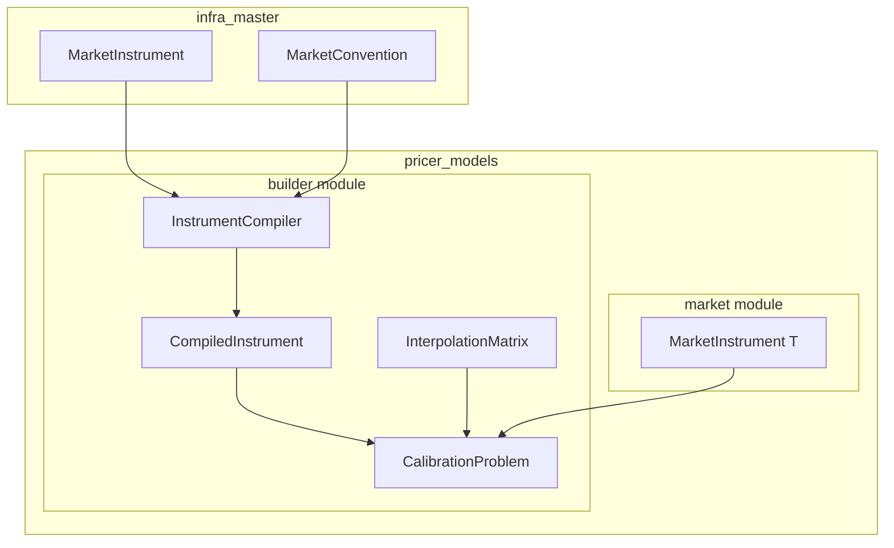
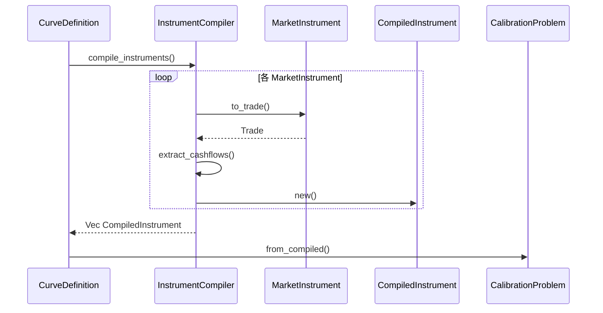
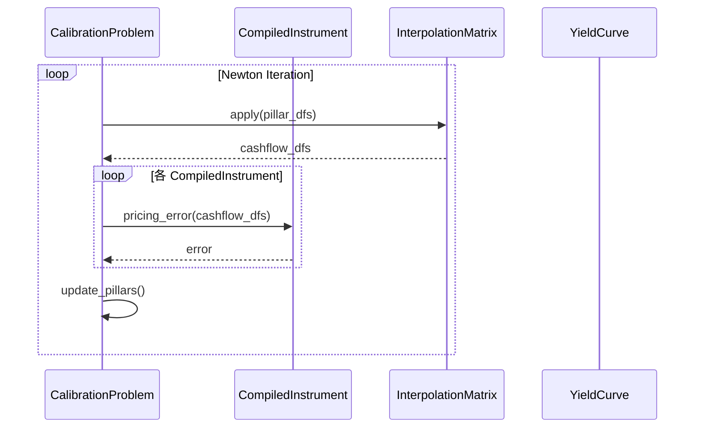
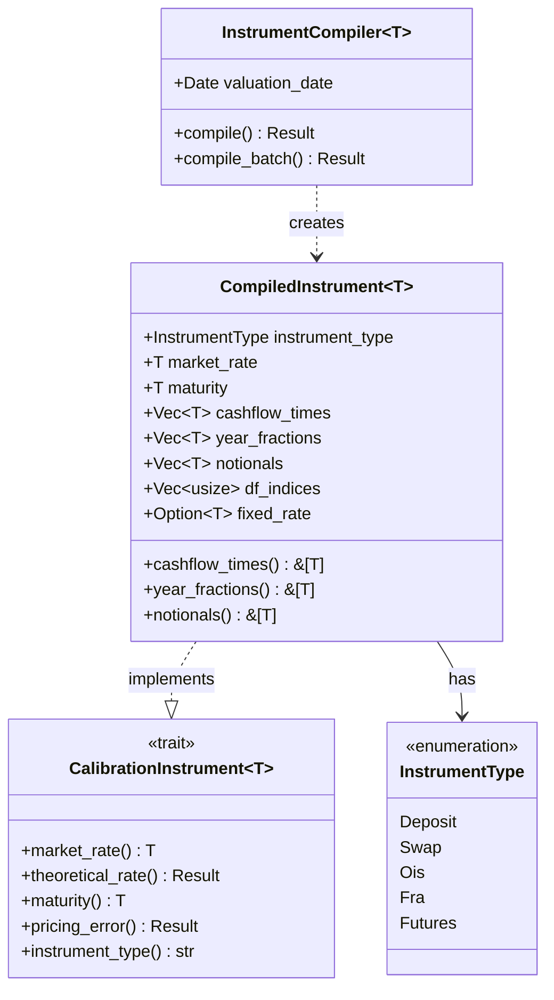

# Technical Design: instrument-precompile

---
**Purpose**: `CalibrationProblem` イテレーション中の冗長計算を排除し、Newton法の収束速度を向上させる。
---

## Overview

**Purpose**: 本機能は、`infra_master::market::MarketInstrument` を静的なキャッシュフロー集合（`CompiledInstrument`）へ事前コンパイルすることで、キャリブレーションループのパフォーマンスを向上させる。

**Users**: 量的開発者およびキャリブレーションエンジンが、カーブキャリブレーション処理で本機能を使用する。

**Impact**: 既存の `CalibrationProblem` のイテレーション性能を改善し、イテレーションごとのカレンダー演算・コンベンション参照を排除する。

### Goals
- イテレーション中の冗長計算（カレンダー演算、コンベンション参照）を排除
- 10商品キャリブレーションで 30% 以上の速度向上を達成
- A-I-P-S アーキテクチャの依存関係ルールを維持

### Non-Goals
- CSR (Compressed Sparse Row) 形式への完全移行（Phase 2 で検討）
- SIMD 最適化の完全実装（メモリレイアウトのみ準備）
- XCcyBasis, FxForward, FxSwap 商品のサポート

## Architecture

> 詳細な調査結果は `research.md` を参照。

### Existing Architecture Analysis

現在のキャリブレーションフローは以下の構造を持つ：

1. `CurveDefinition` が `MarketInstrument` のリストを保持
2. `CalibrationProblem` が各イテレーションで `MarketInstrument::to_trade()` を呼び出し
3. `to_trade()` は毎回カレンダー演算とコンベンション参照を実行
4. `InterpolationMatrix` は Dense 形式で DF 補間を実行

**課題**:
- `to_trade()` のイテレーションごとの呼び出しによるオーバーヘッド
- カレンダー演算の重複実行
- コンベンション参照のキャッシュ不足

### Architecture Pattern & Boundary Map



**Architecture Integration**:
- **Selected pattern**: Compiler パターン（既存 `TradeCompiler` を参照）
- **Domain/feature boundaries**: `InstrumentCompiler` は `pricer_models::builder` に配置し、`infra_master` 型を入力として受け取り、`pricer_models` 固有型を出力
- **Existing patterns preserved**: `TradeCompiler<T>` トレイトパターン、`CalibrationInstrument<T>` トレイト
- **New components rationale**: `CompiledInstrument<T>` は事前計算済みキャッシュフローを保持し、イテレーション効率を向上
- **Steering compliance**: A-I-P-S 依存関係ルールを維持（Pricer → Infra のみ）

### Technology Stack

| Layer | Choice / Version | Role in Feature | Notes |
|-------|------------------|-----------------|-------|
| Backend | Rust 1.75+ | InstrumentCompiler, CompiledInstrument 実装 | 既存環境と同一 |
| Data | nalgebra 0.32 | InterpolationMatrix Dense 形式 | 既存依存 |
| Testing | criterion 0.5 | パフォーマンスベンチマーク | 新規追加 |
| Error | thiserror 1.0 | CompileError 構造化エラー | 既存依存 |

## System Flows

### コンパイルフロー



**Key Decisions**:
- コンパイルはイテレーション外で 1 回のみ実行
- `to_trade()` 呼び出しはコンパイル時のみ発生
- コンパイル結果は `CalibrationProblem` が所有

### キャリブレーションイテレーションフロー



**Key Decisions**:
- イテレーション中はメモリアロケーションなし
- DF 取得はベクトル積のみで完結
- カレンダー演算・コンベンション参照は発生しない

## Requirements Traceability

| Requirement | Summary | Components | Interfaces | Flows |
|-------------|---------|------------|------------|-------|
| 1.1-1.5 | Instrument Compiler Infrastructure | InstrumentCompiler, CompiledInstrument | InstrumentCompiler::compile() | コンパイルフロー |
| 2.1-2.5 | CalibrationProblem Integration | CalibrationProblem | from_compiled(), from_curve_definition() | コンパイルフロー |
| 3.1-3.5 | Efficient Pricing Error | CompiledInstrument | CalibrationInstrument<T> | イテレーションフロー |
| 4.1-4.5 | Interpolation Matrix | InterpolationMatrix | apply() | イテレーションフロー |
| 5.1-5.5 | Domain Separation | InstrumentCompiler | compile() | コンパイルフロー |
| 6.1-6.5 | Backward Compatibility | CalibrationProblem | new() | - |
| 7.1-7.5 | Performance Verification | Benchmarks | - | - |
| 8.1-8.5 | Error Handling | CompileError | - | コンパイルフロー |

## Components and Interfaces

| Component | Domain/Layer | Intent | Req Coverage | Key Dependencies | Contracts |
|-----------|--------------|--------|--------------|------------------|-----------|
| InstrumentCompiler | builder | MarketInstrument をコンパイル | 1, 5, 8 | MarketInstrument (P0) | Service |
| CompiledInstrument | builder | 事前計算済みキャッシュフロー保持 | 1, 3 | - | Service, State |
| CalibrationProblem | builder | キャリブレーション実行 | 2, 6 | CompiledInstrument (P0), InterpolationMatrix (P1) | Service |
| InterpolationMatrix | builder | DF 補間行列 | 4 | nalgebra (P1) | Service |
| CompileError | builder | コンパイルエラー型 | 8 | thiserror (P2) | - |

### Builder Layer

#### InstrumentCompiler

| Field | Detail |
|-------|--------|
| Intent | MarketInstrument を CompiledInstrument に変換するコンパイラ |
| Requirements | 1.1, 1.2, 1.3, 1.4, 1.5, 5.1, 5.2, 5.3, 5.4, 8.1, 8.2, 8.3, 8.4, 8.5 |

**Responsibilities & Constraints**
- MarketInstrument からキャッシュフロー情報を抽出し、事前計算
- Deposit, Swap, OIS, FRA, Futures のみサポート
- XCcyBasis, FxForward, FxSwap は UnsupportedInstrument エラー

**Dependencies**
- Inbound: CurveDefinition — コンパイル要求 (P0)
- External: infra_master::market::MarketInstrument — 入力型 (P0)

**Contracts**: Service [x] / API [ ] / Event [ ] / Batch [ ] / State [ ]

##### Service Interface

```rust
/// キャリブレーション商品のコンパイラ
pub struct InstrumentCompiler<T: Float> {
    valuation_date: Date,
    _marker: PhantomData<T>,
}

impl<T: Float> InstrumentCompiler<T> {
    /// 新しいコンパイラを作成
    pub fn new(valuation_date: Date) -> Self;

    /// 単一の MarketInstrument をコンパイル
    pub fn compile(
        &self,
        instrument: &infra_master::market::MarketInstrument,
    ) -> Result<CompiledInstrument<T>, CompileError>;

    /// バッチコンパイル
    pub fn compile_batch<'a, I>(
        &self,
        instruments: I,
    ) -> Result<Vec<CompiledInstrument<T>>, CompileError>
    where
        I: IntoIterator<Item = &'a infra_master::market::MarketInstrument>;
}
```

- Preconditions: valuation_date が有効な営業日
- Postconditions: 返却された CompiledInstrument は全キャッシュフローが事前計算済み
- Invariants: コンパイル後は元の MarketInstrument への参照を保持しない

**Implementation Notes**
- Integration: `to_trade()` を内部で呼び出し、キャッシュフローを抽出
- Validation: 満期日、年率係数、コンベンション整合性を検証
- Risks: `to_trade()` の内部変更による影響

---

#### CompiledInstrument

| Field | Detail |
|-------|--------|
| Intent | 事前計算済みキャッシュフローを保持する構造体 |
| Requirements | 1.1, 1.2, 3.1, 3.2, 3.3, 3.4, 3.5 |

**Responsibilities & Constraints**
- キャッシュフロー日付、年率係数、想定元本を不変で保持
- CalibrationInstrument<T> トレイトを実装
- イテレーション中のメモリアロケーションを防止

**Dependencies**
- Inbound: InstrumentCompiler — 生成元 (P0)
- Inbound: CalibrationProblem — 評価 (P0)

**Contracts**: Service [x] / API [ ] / Event [ ] / Batch [ ] / State [x]

##### Service Interface

```rust
/// 事前計算済みキャリブレーション商品
#[derive(Debug, Clone)]
pub struct CompiledInstrument<T: Float> {
    /// 商品タイプ識別子
    instrument_type: InstrumentType,
    /// 市場レート
    market_rate: T,
    /// 満期（年率）
    maturity: T,
    /// キャッシュフロー日付（時間軸）
    cashflow_times: Vec<T>,
    /// 年率係数
    year_fractions: Vec<T>,
    /// 想定元本
    notionals: Vec<T>,
    /// DF インデックス（InterpolationMatrix 用）
    df_indices: Vec<usize>,
    /// 固定レート（該当する場合）
    fixed_rate: Option<T>,
}

impl<T: Float> CompiledInstrument<T> {
    /// キャッシュフロー時間を取得
    pub fn cashflow_times(&self) -> &[T];

    /// 年率係数を取得
    pub fn year_fractions(&self) -> &[T];

    /// 想定元本を取得
    pub fn notionals(&self) -> &[T];
}
```

##### State Management

- State model: 不変構造体、コンパイル後は変更不可
- Persistence: メモリ内のみ、シリアライズ対象外
- Concurrency: 読み取り専用のため競合なし

##### CalibrationInstrument<T> Implementation

```rust
impl<T: Float> CalibrationInstrument<T> for CompiledInstrument<T> {
    fn market_rate(&self) -> T {
        self.market_rate
    }

    fn theoretical_rate<C: YieldCurve<T>>(&self, curve: &C) -> Result<T, MarketDataError> {
        // DF 取得とベクトル積のみで計算
        // カレンダー演算なし
    }

    fn maturity(&self) -> T {
        self.maturity
    }

    fn pricing_error<C: YieldCurve<T>>(&self, curve: &C) -> Result<T, MarketDataError> {
        Ok(self.theoretical_rate(curve)? - self.market_rate)
    }

    fn instrument_type(&self) -> &'static str {
        self.instrument_type.as_str()
    }
}
```

**Implementation Notes**
- Integration: 既存 CalibrationInstrument<T> トレイトとの互換性維持
- Validation: コンストラクタで不変条件を検証
- Risks: 型パラメータ T の精度による数値誤差

---

#### CalibrationProblem Integration

| Field | Detail |
|-------|--------|
| Intent | 既存 CalibrationProblem へのコンパイル統合 |
| Requirements | 2.1, 2.2, 2.3, 2.4, 2.5, 6.1, 6.2, 6.3, 6.4, 6.5 |

**Responsibilities & Constraints**
- 既存 API との後方互換性を維持
- 新規 `from_compiled()` メソッドを追加
- コンパイル済み商品の所有権を管理

**Dependencies**
- Inbound: CurveBuilder — キャリブレーション実行 (P0)
- Outbound: CompiledInstrument — 評価 (P0)
- Outbound: InterpolationMatrix — DF 補間 (P1)

**Contracts**: Service [x] / API [ ] / Event [ ] / Batch [ ] / State [ ]

##### Service Interface (Extension)

```rust
impl<T: Float, I: CalibrationInstrument<T>> CalibrationProblem<T, I> {
    /// 既存 API（後方互換性維持）
    pub fn new(instruments: Vec<I>, /* ... */) -> Self;
}

impl<T: Float> CalibrationProblem<T, CompiledInstrument<T>> {
    /// コンパイル済み商品から構築（新規 API）
    pub fn from_compiled(
        instruments: Vec<CompiledInstrument<T>>,
        interpolation_matrix: InterpolationMatrix<T>,
        /* ... */
    ) -> Self;

    /// CurveDefinition から構築（新規 API）
    pub fn from_curve_definition(
        definition: &CurveDefinition,
        valuation_date: Date,
    ) -> Result<Self, CompileError>;
}
```

**Implementation Notes**
- Integration: `from_curve_definition()` で内部的に InstrumentCompiler を使用
- Validation: コンパイルエラー時は部分状態を残さない
- Risks: 既存テストへの影響

---

#### InterpolationMatrix Enhancement

| Field | Detail |
|-------|--------|
| Intent | DF 補間の効率化 |
| Requirements | 4.1, 4.2, 4.3, 4.4, 4.5 |

**Responsibilities & Constraints**
- キャッシュフロー日付からピラー日付への補間係数を事前計算
- Phase 1: Dense 形式を維持、SIMD 対応メモリレイアウト
- Phase 2: CSR 形式への移行を検討

**Dependencies**
- Inbound: CalibrationProblem — DF 計算 (P0)
- External: nalgebra — 行列演算 (P1)

**Contracts**: Service [x] / API [ ] / Event [ ] / Batch [ ] / State [ ]

##### Service Interface (Extension)

```rust
impl<T: Float> InterpolationMatrix<T> {
    /// 既存メソッド維持
    pub fn interpolate(&self, pillar_dfs: &[T]) -> Vec<T>;

    /// ベクトル積による一括 DF 計算（新規）
    pub fn apply(&self, pillar_dfs: &DVector<T>) -> DVector<T>;

    /// log-linear 補間用（新規）
    pub fn apply_log_linear(&self, pillar_log_dfs: &DVector<T>) -> DVector<T>;
}
```

**Implementation Notes**
- Integration: 既存 `interpolate()` との互換性維持
- Validation: 補間係数の正規化検証
- Risks: Dense 形式のメモリ使用量（大規模カーブで顕在化）

---

#### CompileError

| Field | Detail |
|-------|--------|
| Intent | コンパイルエラーの構造化表現 |
| Requirements | 8.1, 8.2, 8.3, 8.4, 8.5, 1.3, 1.5 |

**Responsibilities & Constraints**
- thiserror を使用した構造化エラー
- 問題商品のインデックスとレートIDを含む

**Dependencies**
- External: thiserror — エラー派生マクロ (P2)

**Contracts**: Service [ ] / API [ ] / Event [ ] / Batch [ ] / State [ ]

##### Error Definitions

```rust
use thiserror::Error;

#[derive(Error, Debug)]
pub enum CompileError {
    #[error("Invalid maturity for instrument {index}: {rate_id}")]
    InvalidMaturity {
        index: usize,
        rate_id: String,
    },

    #[error("Invalid year fraction at index {index} for instrument {rate_id}")]
    InvalidYearFraction {
        index: usize,
        rate_id: String,
    },

    #[error("Convention mismatch for instrument {index}: {rate_id}")]
    ConventionMismatch {
        index: usize,
        rate_id: String,
    },

    #[error("Invalid convention for instrument {index}: {rate_id}")]
    InvalidConvention {
        index: usize,
        rate_id: String,
    },

    #[error("Unsupported instrument type at index {index}: {instrument_type}")]
    UnsupportedInstrument {
        index: usize,
        instrument_type: String,
    },
}
```

## Data Models

### Domain Model



**Invariants**:
- `cashflow_times`, `year_fractions`, `notionals` は同じ長さ
- `cashflow_times` は昇順
- `year_fractions` は全て正
- `maturity` は最後の `cashflow_times` と一致

### Logical Data Model

**CompiledInstrument<T> 構造**:
- `instrument_type`: 商品タイプ識別（enum、1 byte）
- `market_rate`: 市場レート（T、8 bytes for f64）
- `maturity`: 満期年率（T）
- `cashflow_times`: キャッシュフロー時間軸（Vec<T>）
- `year_fractions`: 年率係数（Vec<T>）
- `notionals`: 想定元本（Vec<T>）
- `df_indices`: InterpolationMatrix インデックス（Vec<usize>）
- `fixed_rate`: 固定レート（Option<T>）

**メモリレイアウト**:
- AoS (Array of Structures) 形式を採用
- 単一商品のフィールドが連続配置
- 将来の SoA 変換のためにアクセサを提供

## Error Handling

### Error Strategy

コンパイル時にすべての検証を完了し、イテレーション中のエラーを防止する。

### Error Categories and Responses

**Business Logic Errors (CompileError)**:
- `InvalidMaturity`: 満期日が評価日より前 → 商品インデックスとレートIDを報告
- `InvalidYearFraction`: 負の年率係数 → 問題のキャッシュフローインデックスを報告
- `ConventionMismatch`: コンベンションと商品タイプの不整合 → 期待値と実際値を報告
- `InvalidConvention`: 無効なコンベンション → コンベンション名を報告
- `UnsupportedInstrument`: 未サポート商品タイプ → 商品タイプ名を報告

### Monitoring

- コンパイル完了時: 商品数、総キャッシュフロー数、コンパイル時間をログ出力
- エラー発生時: ERROR レベルで問題商品の詳細を出力

## Testing Strategy

### Unit Tests
- `InstrumentCompiler::compile()` の正常系（各商品タイプ）
- `InstrumentCompiler::compile()` のエラーケース（各 CompileError バリアント）
- `CompiledInstrument::theoretical_rate()` の計算精度
- `InterpolationMatrix::apply()` の結果検証

### Integration Tests
- `CalibrationProblem::from_curve_definition()` のエンドツーエンドフロー
- 既存 `CalibrationProblem::new()` との後方互換性
- コンパイル済み商品でのキャリブレーション収束確認

### Performance Tests
- `criterion` ベンチマーク: コンパイル前後の pricing_error 計算時間比較
- 10 商品キャリブレーション: イテレーションあたり 30% 以上の速度向上確認
- メモリ使用量: 20% 未満の増加確認

## Performance & Scalability

### Target Metrics
- イテレーションあたりの pricing_error 計算: 30% 以上の速度向上
- コンパイル時間: キャリブレーション全体の 5% 未満
- メモリ使用量増加: 20% 未満

### Measurement Strategy
- `criterion` クレートによる再現可能なベンチマーク
- コンパイル前後の比較テスト
- メモリプロファイリング（`heaptrack` または `valgrind`）

### Optimization Techniques
- イテレーション外でのコンパイル（1回のみ）
- Dense 行列によるベクトル積（BLAS 最適化活用）
- 連続メモリレイアウトによるキャッシュ効率向上

---

_生成日: 2026-02-06_
_ドキュメントバージョン: 1.0_
