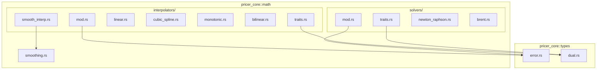
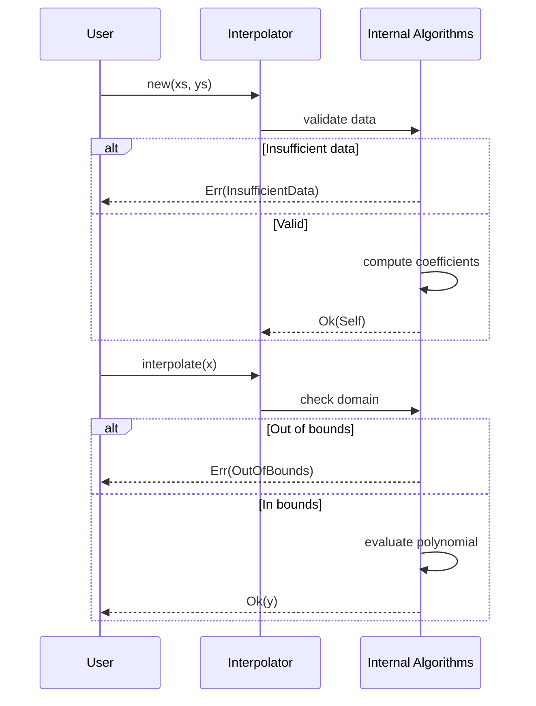
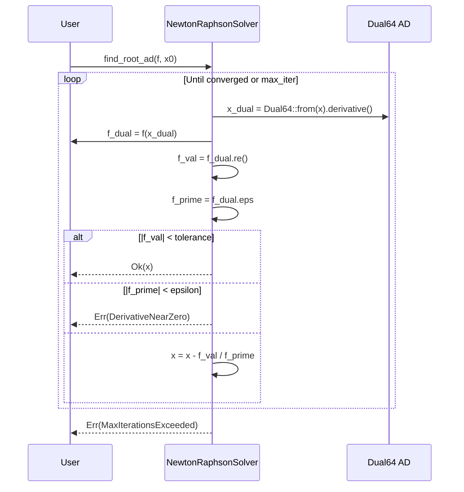

# Technical Design: Interpolation and Solvers

## Overview

**Purpose**: This feature delivers foundational numerical methods infrastructure to Layer 1 (pricer_core), enabling interpolation of market data curves and root-finding for calibration tasks.

**Users**: Quantitative developers building pricing models in L2 (pricer_models) and L3 (pricer_kernel) will utilise these components for yield curve construction, volatility surface interpolation, and implied volatility solving.

**Impact**: Extends the existing `math` module with two new submodules (`interpolators`, `solvers`) following established patterns from `smoothing.rs`.

### Goals
- Provide generic `Interpolator<T>` and `RootFinder<T>` traits compatible with `f64` and `Dual64`
- Implement Linear, Cubic Spline, and Monotonic 1D interpolators
- Implement Bilinear 2D interpolator for surfaces
- Implement Newton-Raphson (with AD support) and Brent root finders
- Deliver branch-free `smooth_interp` using existing smoothing primitives
- Maintain full automatic differentiation compatibility for sensitivity calculations

### Non-Goals
- Higher-order interpolation (bicubic, tricubic) — deferred to future phases
- Parallel interpolation for vectorised queries — L4 responsibility
- Caching or memoisation of interpolation results
- Multi-dimensional root finding (Newton system solvers)

## Architecture

### Existing Architecture Analysis

The `math` module currently provides:
- `smoothing.rs`: Differentiable approximations (`smooth_max`, `smooth_min`, `smooth_indicator`, `smooth_abs`)
- Pattern: Generic functions with `T: num_traits::Float` bounds
- Error handling: Via `PricingError` in `types/error.rs`

Integration points:
- `smooth_indicator` used by `smooth_interp` for segment blending
- `types::dual::DualNumber` alias for AD compatibility
- Error patterns guide new `InterpolationError` and `SolverError` definitions

### Architecture Pattern & Boundary Map



**Architecture Integration**:
- **Selected pattern**: Module-based organisation with trait abstraction
- **Domain boundaries**: Interpolators and solvers as separate submodules under `math`
- **Existing patterns preserved**: Generic `T: Float` bounds, test co-location, error enum design
- **New components rationale**: Traits define contracts; concrete implementations per algorithm
- **Steering compliance**: L1 foundation layer, stable Rust, no external solver dependencies

### Technology Stack

| Layer | Choice / Version | Role in Feature | Notes |
|-------|------------------|-----------------|-------|
| Numeric | `num-traits ^0.2` | Float trait bounds | Existing workspace dependency |
| AD | `num-dual ^0.10` (optional) | `Dual64` for gradient propagation | Feature-gated `num-dual-mode` |
| Error | `thiserror ^1.0` | Error derive macros | Existing workspace dependency |
| Serialisation | `serde ^1.0` (optional) | Error type serialisation | Feature-gated `serde` |
| Testing | `approx ^0.5`, `proptest ^1.0` | Numeric comparisons, property tests | Existing dev-dependencies |

## System Flows

### Interpolation Flow



### Root Finding Flow (Newton-Raphson AD)



## Requirements Traceability

| Requirement | Summary | Components | Interfaces | Flows |
|-------------|---------|------------|------------|-------|
| 1.1-1.6 | Interpolator trait infrastructure | `traits.rs` | `Interpolator<T>` | Interpolation Flow |
| 2.1-2.5 | Linear interpolation | `linear.rs` | `LinearInterpolator` | Interpolation Flow |
| 3.1-3.6 | Cubic spline interpolation | `cubic_spline.rs` | `CubicSplineInterpolator` | Interpolation Flow |
| 4.1-4.6 | Monotonic interpolation | `monotonic.rs` | `MonotonicInterpolator` | Interpolation Flow |
| 5.1-5.6 | Smooth interpolation function | `smooth_interp.rs` | `smooth_interp()` | — |
| 6.1-6.6 | Bilinear 2D interpolation | `bilinear.rs` | `BilinearInterpolator` | Interpolation Flow |
| 7.1-7.5 | RootFinder trait infrastructure | `solver_traits.rs` | `RootFinder<T>` | Root Finding Flow |
| 8.1-8.5 | Newton-Raphson solver | `newton_raphson.rs` | `NewtonRaphsonSolver` | Root Finding Flow |
| 9.1-9.5 | Brent's method solver | `brent.rs` | `BrentSolver` | Root Finding Flow |
| 10.1-10.5 | Error types | `error.rs` | `InterpolationError`, `SolverError` | All flows |
| 11.1-11.5 | AD compatibility | All components | — | — |
| 12.1-12.6 | Module organisation | `mod.rs` files | — | — |

## Components and Interfaces

| Component | Domain/Layer | Intent | Req Coverage | Key Dependencies | Contracts |
|-----------|--------------|--------|--------------|------------------|-----------|
| `Interpolator<T>` | math/interpolators | Generic interpolation trait | 1.1-1.6 | `num_traits::Float` | Service |
| `LinearInterpolator` | math/interpolators | Piecewise linear interpolation | 2.1-2.5 | `Interpolator` | Service |
| `CubicSplineInterpolator` | math/interpolators | Natural cubic spline | 3.1-3.6 | `Interpolator` | Service |
| `MonotonicInterpolator` | math/interpolators | Fritsch-Carlson monotonic | 4.1-4.6 | `Interpolator` | Service |
| `smooth_interp` | math/interpolators | Branch-free smooth interpolation | 5.1-5.6 | `smooth_indicator` | — |
| `BilinearInterpolator` | math/interpolators | 2D grid interpolation | 6.1-6.6 | — | Service |
| `RootFinder<T>` | math/solvers | Generic root-finding trait | 7.1-7.5 | `num_traits::Float` | Service |
| `NewtonRaphsonSolver` | math/solvers | Newton-Raphson with AD | 8.1-8.5 | `RootFinder`, `Dual64` | Service |
| `BrentSolver` | math/solvers | Brent's bracketing method | 9.1-9.5 | `RootFinder` | Service |
| `InterpolationError` | types/error | Interpolation error enum | 10.1-10.2 | `thiserror` | — |
| `SolverError` | types/error | Solver error enum | 10.1-10.2 | `thiserror` | — |

### Interpolators Domain

#### Interpolator Trait

| Field | Detail |
|-------|--------|
| Intent | Define generic contract for 1D interpolation |
| Requirements | 1.1, 1.2, 1.3, 1.4, 1.6 |

**Responsibilities & Constraints**
- Define `interpolate(x: T) -> Result<T, InterpolationError>` method
- Define `domain() -> (T, T)` for bounds checking
- Generic over `T: Float` to support `f64` and `Dual64`

**Dependencies**
- External: `num_traits::Float` — numeric operations (P0)

**Contracts**: Service [x]

##### Service Interface
```rust
pub trait Interpolator<T: Float> {
    /// Interpolate value at point x.
    fn interpolate(&self, x: T) -> Result<T, InterpolationError>;

    /// Return the valid domain (x_min, x_max).
    fn domain(&self) -> (T, T);
}
```
- Preconditions: Interpolator constructed with valid data
- Postconditions: Returns interpolated value or appropriate error
- Invariants: `domain().0 <= domain().1`

#### LinearInterpolator

| Field | Detail |
|-------|--------|
| Intent | Piecewise linear interpolation between data points |
| Requirements | 2.1, 2.2, 2.3, 2.4, 2.5 |

**Responsibilities & Constraints**
- Store sorted (x, y) pairs
- Binary search for segment selection
- Linear interpolation formula: `y = y0 + (y1 - y0) * (x - x0) / (x1 - x0)`

**Dependencies**
- Inbound: Caller provides `(xs, ys)` slices
- Outbound: None

**Contracts**: Service [x]

##### Service Interface
```rust
pub struct LinearInterpolator<T: Float> {
    xs: Vec<T>,
    ys: Vec<T>,
}

impl<T: Float> LinearInterpolator<T> {
    /// Construct from x and y data points. Sorts if unsorted.
    pub fn new(xs: &[T], ys: &[T]) -> Result<Self, InterpolationError>;
}

impl<T: Float> Interpolator<T> for LinearInterpolator<T> {
    fn interpolate(&self, x: T) -> Result<T, InterpolationError>;
    fn domain(&self) -> (T, T);
}
```

**Implementation Notes**
- Sort data points at construction if not already sorted
- Use `partition_point` for O(log n) segment lookup
- Division by zero impossible due to sorted unique x values

#### CubicSplineInterpolator

| Field | Detail |
|-------|--------|
| Intent | Natural cubic spline with C² continuity |
| Requirements | 3.1, 3.2, 3.3, 3.4, 3.5, 3.6 |

**Responsibilities & Constraints**
- Solve tridiagonal system for second derivatives (Thomas algorithm)
- Store polynomial coefficients (a, b, c, d) per segment
- Natural boundary conditions: M₀ = Mₙ = 0

**Dependencies**
- Inbound: Caller provides `(xs, ys)` slices (min 3 points)
- Internal: Tridiagonal solver utility

**Contracts**: Service [x]

##### Service Interface
```rust
pub struct CubicSplineInterpolator<T: Float> {
    xs: Vec<T>,
    // Coefficients: y = a + b*(x-xi) + c*(x-xi)² + d*(x-xi)³
    coeffs: Vec<SplineCoeffs<T>>,
}

struct SplineCoeffs<T> {
    a: T, b: T, c: T, d: T,
}

impl<T: Float> CubicSplineInterpolator<T> {
    /// Construct natural cubic spline. Requires at least 3 points.
    pub fn new(xs: &[T], ys: &[T]) -> Result<Self, InterpolationError>;
}
```

**Implementation Notes**
- Thomas algorithm for O(n) coefficient computation
- Coefficients computed once at construction
- Segment lookup via binary search

#### MonotonicInterpolator

| Field | Detail |
|-------|--------|
| Intent | Preserve monotonicity using Fritsch-Carlson method |
| Requirements | 4.1, 4.2, 4.3, 4.4, 4.5, 4.6 |

**Responsibilities & Constraints**
- Validate input data is monotonic
- Compute Hermite slopes with monotonicity correction
- Store slopes per point for Hermite evaluation

**Dependencies**
- Inbound: Monotonic `(xs, ys)` data
- Outbound: Error if non-monotonic

**Contracts**: Service [x]

##### Service Interface
```rust
pub struct MonotonicInterpolator<T: Float> {
    xs: Vec<T>,
    ys: Vec<T>,
    slopes: Vec<T>,
}

impl<T: Float> MonotonicInterpolator<T> {
    /// Construct monotonic interpolator. Errors if data not monotonic.
    pub fn new(xs: &[T], ys: &[T]) -> Result<Self, InterpolationError>;
}
```

**Implementation Notes**
- Fritsch-Carlson algorithm from `research.md`
- Check monotonicity via consecutive differences
- Hermite basis functions for evaluation

#### smooth_interp Function

| Field | Detail |
|-------|--------|
| Intent | Branch-free differentiable interpolation for Enzyme AD |
| Requirements | 5.1, 5.2, 5.3, 5.4, 5.5, 5.6 |

**Responsibilities & Constraints**
- Use `smooth_indicator` for soft segment selection
- Sum weighted linear interpolations
- No `if` branches on Float values

**Dependencies**
- External: `crate::math::smoothing::smooth_indicator` (P0)

##### Service Interface
```rust
/// Smooth linear interpolation without conditional branches.
///
/// Uses sigmoid-based blending for Enzyme AD compatibility.
pub fn smooth_interp<T: Float>(
    xs: &[T],
    ys: &[T],
    x: T,
    epsilon: T,
) -> Result<T, InterpolationError>;
```

**Implementation Notes**
- Weight for segment i: `w_i = smooth_indicator(x - x_i, ε) - smooth_indicator(x - x_{i+1}, ε)`
- Normalise weights: `w_i / Σw_j`
- Converges to linear interpolation as ε → 0

#### BilinearInterpolator

| Field | Detail |
|-------|--------|
| Intent | 2D grid interpolation for volatility surfaces |
| Requirements | 6.1, 6.2, 6.3, 6.4, 6.5, 6.6 |

**Responsibilities & Constraints**
- Store 2D grid with sorted x and y axes
- Bilinear formula across four corner points
- Propagate partial derivatives for AD

**Dependencies**
- Inbound: 2D grid data `(xs, ys, zs)`

**Contracts**: Service [x]

##### Service Interface
```rust
pub struct BilinearInterpolator<T: Float> {
    xs: Vec<T>,
    ys: Vec<T>,
    zs: Vec<Vec<T>>, // zs[i][j] = z(xs[i], ys[j])
}

impl<T: Float> BilinearInterpolator<T> {
    pub fn new(xs: &[T], ys: &[T], zs: &[&[T]]) -> Result<Self, InterpolationError>;

    /// Interpolate at (x, y).
    pub fn interpolate(&self, x: T, y: T) -> Result<T, InterpolationError>;

    /// Domain in x dimension.
    pub fn domain_x(&self) -> (T, T);

    /// Domain in y dimension.
    pub fn domain_y(&self) -> (T, T);
}
```

**Implementation Notes**
- Standard bilinear formula: `(1-u)(1-v)z00 + u(1-v)z10 + (1-u)v*z01 + uv*z11`
- Grid lookup via binary search on both axes

### Solvers Domain

#### RootFinder Trait

| Field | Detail |
|-------|--------|
| Intent | Define generic contract for root-finding algorithms |
| Requirements | 7.1, 7.2, 7.3, 7.4, 7.5 |

**Responsibilities & Constraints**
- Define method signature for finding roots
- Support configurable tolerance and max iterations
- Accept generic function closures

**Contracts**: Service [x]

##### Service Interface
```rust
/// Configuration for root-finding algorithms.
pub struct SolverConfig<T: Float> {
    pub tolerance: T,
    pub max_iterations: usize,
}

impl<T: Float> Default for SolverConfig<T> {
    fn default() -> Self {
        Self {
            tolerance: T::from(1e-10).unwrap(),
            max_iterations: 100,
        }
    }
}
```

#### NewtonRaphsonSolver

| Field | Detail |
|-------|--------|
| Intent | Newton-Raphson root finding with optional AD |
| Requirements | 8.1, 8.2, 8.3, 8.4, 8.5 |

**Responsibilities & Constraints**
- Standard iteration: `x_{n+1} = x_n - f(x_n) / f'(x_n)`
- AD mode: Extract derivative from `Dual64` evaluation
- Guard against zero derivative

**Dependencies**
- External: `num_dual::Dual64` for AD mode (P0)

**Contracts**: Service [x]

##### Service Interface
```rust
pub struct NewtonRaphsonSolver<T: Float> {
    config: SolverConfig<T>,
}

impl<T: Float> NewtonRaphsonSolver<T> {
    pub fn new(config: SolverConfig<T>) -> Self;

    /// Find root given f and f'.
    pub fn find_root<F, G>(&self, f: F, f_prime: G, x0: T) -> Result<T, SolverError>
    where
        F: Fn(T) -> T,
        G: Fn(T) -> T;
}

#[cfg(feature = "num-dual-mode")]
impl NewtonRaphsonSolver<f64> {
    /// Find root using automatic differentiation.
    pub fn find_root_ad<F>(&self, f: F, x0: f64) -> Result<f64, SolverError>
    where
        F: Fn(Dual64) -> Dual64;
}
```

**Implementation Notes**
- AD mode: `f(Dual64::from(x).derivative())` yields value and derivative
- Check `|f'(x)| < small_epsilon` before division
- Return early if `|f(x)| < tolerance`

#### BrentSolver

| Field | Detail |
|-------|--------|
| Intent | Robust bracketing root finder without derivatives |
| Requirements | 9.1, 9.2, 9.3, 9.4, 9.5 |

**Responsibilities & Constraints**
- Require valid bracket: `f(a) * f(b) < 0`
- Combine bisection, secant, inverse quadratic interpolation
- Guaranteed convergence for continuous functions

**Contracts**: Service [x]

##### Service Interface
```rust
pub struct BrentSolver<T: Float> {
    config: SolverConfig<T>,
}

impl<T: Float> BrentSolver<T> {
    pub fn new(config: SolverConfig<T>) -> Self;

    /// Find root in bracket [a, b].
    pub fn find_root<F>(&self, f: F, a: T, b: T) -> Result<T, SolverError>
    where
        F: Fn(T) -> T;
}
```

**Implementation Notes**
- Full Brent algorithm with mflag for step selection
- Swap a, b to maintain `|f(b)| <= |f(a)|`
- Use bisection as fallback when interpolation steps too large

### Error Types

| Field | Detail |
|-------|--------|
| Intent | Domain-specific error enums for interpolation and solving |
| Requirements | 10.1, 10.2, 10.3, 10.4, 10.5 |

##### Service Interface
```rust
use thiserror::Error;

#[derive(Error, Debug, Clone, PartialEq)]
pub enum InterpolationError {
    #[error("Query point {x} outside valid domain [{min}, {max}]")]
    OutOfBounds { x: f64, min: f64, max: f64 },

    #[error("Insufficient data points: got {got}, need at least {need}")]
    InsufficientData { got: usize, need: usize },

    #[error("Data is not monotonic at index {index}")]
    NonMonotonicData { index: usize },

    #[error("Invalid input: {0}")]
    InvalidInput(String),
}

#[derive(Error, Debug, Clone, PartialEq)]
pub enum SolverError {
    #[error("Failed to converge after {iterations} iterations")]
    MaxIterationsExceeded { iterations: usize },

    #[error("Derivative near zero at x = {x}")]
    DerivativeNearZero { x: f64 },

    #[error("No bracket: f({a}) and f({b}) have same sign")]
    NoBracket { a: f64, b: f64 },

    #[error("Numerical instability: {0}")]
    NumericalInstability(String),
}
```

**Implementation Notes**
- Use `thiserror` for `Error` and `Display` derives
- Store `f64` for error context (avoid generic complexity in errors)
- Feature-gate serde derives under `serde` feature

## Data Models

### Domain Model

**Interpolator Aggregate**:
- **Entities**: `LinearInterpolator`, `CubicSplineInterpolator`, `MonotonicInterpolator`, `BilinearInterpolator`
- **Value Objects**: `SplineCoeffs<T>`, data point pairs `(x, y)`
- **Invariants**:
  - Data sorted by x-coordinate
  - Minimum point requirements per type
  - Monotonicity for `MonotonicInterpolator`

**Solver Aggregate**:
- **Entities**: `NewtonRaphsonSolver`, `BrentSolver`
- **Value Objects**: `SolverConfig<T>`
- **Invariants**:
  - Tolerance > 0
  - max_iterations > 0

### Logical Data Model

**Interpolator Storage**:
```
LinearInterpolator:
  xs: Vec<T>     -- sorted x coordinates
  ys: Vec<T>     -- corresponding y values

CubicSplineInterpolator:
  xs: Vec<T>
  coeffs: Vec<{a, b, c, d}>  -- polynomial per segment

MonotonicInterpolator:
  xs: Vec<T>
  ys: Vec<T>
  slopes: Vec<T>  -- Hermite slopes per point

BilinearInterpolator:
  xs: Vec<T>      -- x axis (n points)
  ys: Vec<T>      -- y axis (m points)
  zs: Vec<Vec<T>> -- n x m grid values
```

## Error Handling

### Error Strategy
- Return `Result<T, Error>` for all fallible operations
- Use specific error variants for actionable diagnostics
- Preserve context (indices, values) for debugging

### Error Categories and Responses

**Input Validation Errors**:
- `InsufficientData` → check data length before construction
- `NonMonotonicData` → verify monotonicity or use different interpolator
- `InvalidInput` → validate inputs at boundaries

**Runtime Errors**:
- `OutOfBounds` → caller should check domain or handle extrapolation
- `MaxIterationsExceeded` → increase iterations or improve initial guess
- `DerivativeNearZero` → use Brent instead of Newton-Raphson
- `NoBracket` → find valid bracketing interval

## Testing Strategy

### Unit Tests
1. **Linear interpolation accuracy**: Verify exact interpolation at known points
2. **Cubic spline C² continuity**: Check second derivative continuity at knots
3. **Monotonic preservation**: Verify output monotonicity matches input
4. **Smooth interp convergence**: Verify convergence to linear as ε → 0
5. **Newton-Raphson convergence**: Solve known equations (x² - 2 = 0)
6. **Brent bracket validation**: Verify error on invalid brackets

### Integration Tests
1. **Dual64 gradient propagation**: Verify gradients through all interpolators
2. **AD vs finite difference**: Compare gradients within tolerance
3. **Solver + interpolator**: Inverse interpolation via root finding

### Property-Based Tests (proptest)
1. **Interpolation at knots**: `interp(x_i) == y_i` for all input points
2. **Monotonic output**: For monotonic input, output respects ordering
3. **Spline bounds**: Cubic spline within reasonable range of data
4. **Solver convergence**: For smooth functions with roots, solver finds them

### AD Verification Tests
1. **All interpolators with Dual64**: Verify finite, correct gradients
2. **Gradient vs finite difference**: Within 1e-6 relative tolerance
3. **Newton AD vs explicit derivative**: Identical convergence behaviour

## Performance & Scalability

**Complexity Targets**:
| Operation | Target | Notes |
|-----------|--------|-------|
| Linear interpolation | O(log n) | Binary search |
| Cubic spline construction | O(n) | Thomas algorithm |
| Cubic spline interpolation | O(log n) | Binary search + polynomial eval |
| Monotonic interpolation | O(log n) | Binary search + Hermite eval |
| Bilinear interpolation | O(log n + log m) | Two binary searches |
| Newton-Raphson iteration | O(1) | Per iteration |
| Brent iteration | O(1) | Per iteration |

**Memory**:
- Interpolators: O(n) for 1D, O(n×m) for 2D
- Spline coefficients: 4 × n floats overhead

