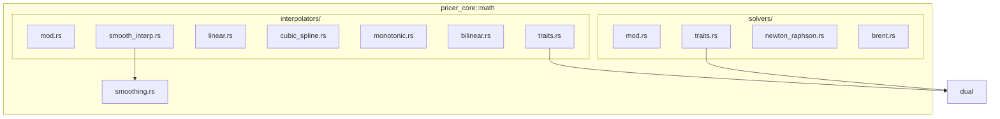
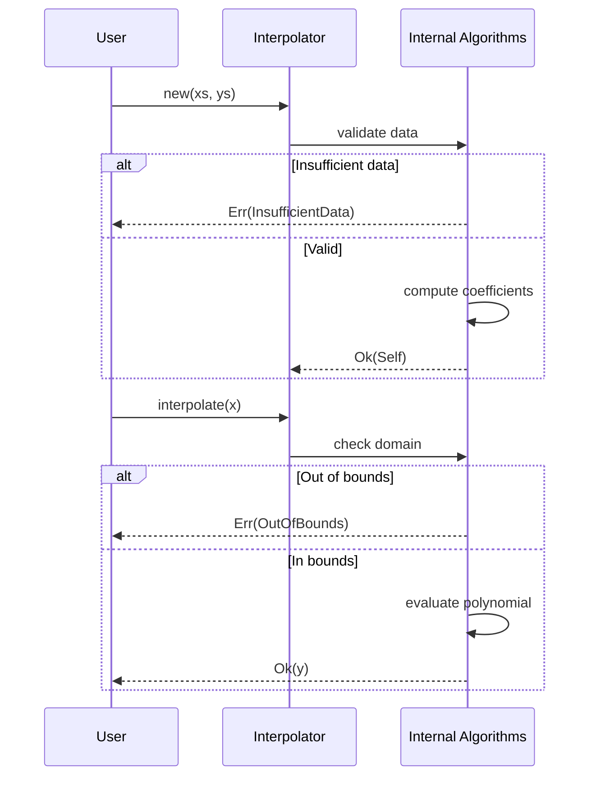

# Technical Design: Interpolation and Solvers

## Overview

**Purpose**: Delivers foundational numerical methods infrastructure to Layer 1 (pricer_core), enabling interpolation of market data curves and root-finding for calibration tasks.

**Users**: Quantitative developers building pricing models in L2 (pricer_models) and L3 (pricer_kernel).

**Impact**: Extends the existing `math` module with two new submodules (`interpolators`, `solvers`).

### Goals
- Provide generic `Interpolator<T>` and `RootFinder<T>` traits compatible with `f64` and `Dual64`
- Implement Linear, Cubic Spline, and Monotonic 1D interpolators
- Implement Bilinear 2D interpolator for surfaces
- Implement Newton-Raphson (with AD support) and Brent root finders
- Deliver branch-free `smooth_interp` using existing smoothing primitives
- Maintain full automatic differentiation compatibility for sensitivity calculations

## Architecture

### Existing Architecture Analysis

The `math` module currently provides:
- `smoothing.rs`: Differentiable approximations (`smooth_max`, `smooth_min`, `smooth_indicator`, `smooth_abs`)
- Pattern: Generic functions with `T: num_traits::Float` bounds
- Error handling: Via `PricingError` in `types/error.rs`

Integration points:
- `smooth_indicator` used by `smooth_interp` for segment blending
- `types::dual::DualNumber` alias for AD compatibility
- Error patterns guide new `InterpolationError` and `SolverError` definitions

### Architecture Pattern & Boundary Map


```mermaid
graph TB
    subgraph pricer_core_math[pricer_core::math]
        smoothing[smoothing.rs]

        subgraph interpolators[interpolators/]
            interp_mod[mod.rs]
            interp_traits[traits.rs]
            linear[linear.rs]
            cubic_spline[cubic_spline.rs]
            monotonic[monotonic.rs]
            bilinear[bilinear.rs]
            smooth_interp_fn[smooth_interp.rs]
        end

        subgraph solvers[solvers/]
            solver_mod[mod.rs]
            solver_traits[traits.rs]
            newton_raphson[newton_raphson.rs]
            brent[brent.rs]
        end
    end

    smooth_interp_fn --> smoothing
    interp_traits --> dual
    solver_traits --> dual
```

**Architecture Integration**:
- **Selected pattern**: Module-based organisation with trait abstraction
- **Domain boundaries**: Interpolators and solvers as separate submodules under `math`
- **Existing patterns preserved**: Generic `T: Float` bounds, test co-location, error enum design
- **New components rationale**: Traits define contracts; concrete implementations per algorithm
- **Steering compliance**: L1 foundation layer, stable Rust, no external solver dependencies

## System Flows

### Interpolation Flow


```mermaid
sequenceDiagram
    participant User
    participant Interpolator
    participant Internal as Internal Algorithms

    User->>Interpolator: new(xs, ys)
    Interpolator->>Internal: validate data
    alt Insufficient data
        Internal-->>User: Err(InsufficientData)
    else Valid
        Internal->>Internal: compute coefficients
        Internal-->>Interpolator: Ok(Self)
    end

    User->>Interpolator: interpolate(x)
    Interpolator->>Internal: check domain
    alt Out of bounds
        Internal-->>User: Err(OutOfBounds)
    else In bounds
        Internal->>Internal: evaluate polynomial
        Internal-->>User: Ok(y)
    end
```

## Requirements Traceability

| Requirement | Summary | Components | Interfaces |
|-------------|---------|------------|------------|
| 1.1-1.6 | Interpolator trait infrastructure | `traits.rs` | `Interpolator<T>` |
| 2.1-2.5 | Linear interpolation | `linear.rs` | `LinearInterpolator` |
| 3.1-3.6 | Cubic spline interpolation | `cubic_spline.rs` | `CubicSplineInterpolator` |
| 4.1-4.6 | Monotonic interpolation | `monotonic.rs` | `MonotonicInterpolator` |
| 5.1-5.6 | Smooth interpolation function | `smooth_interp.rs` | `smooth_interp()` |
| 6.1-6.6 | Bilinear 2D interpolation | `bilinear.rs` | `BilinearInterpolator` |
| 7.1-7.5 | RootFinder trait infrastructure | `solver_traits.rs` | `RootFinder<T>` |
| 8.1-8.5 | Newton-Raphson solver | `newton_raphson.rs` | `NewtonRaphsonSolver` |
| 9.1-9.5 | Brent's method solver | `brent.rs` | `BrentSolver` |
| 10.1-10.5 | Error types | `error.rs` | `InterpolationError`, `SolverError` |
| 11.1-11.5 | AD compatibility | All components | — |
| 12.1-12.6 | Module organisation | `mod.rs` files | — |

## Components and Interfaces

| Component | Domain/Layer | Intent | Req Coverage | Key Dependencies |
|-----------|--------------|--------|--------------|------------------|
| `Interpolator<T>` | math/interpolators | Generic interpolation trait | 1.1-1.6 | `num_traits::Float` |
| `LinearInterpolator` | math/interpolators | Piecewise linear interpolation | 2.1-2.5 | `Interpolator` |
| `CubicSplineInterpolator` | math/interpolators | Natural cubic spline | 3.1-3.6 | `Interpolator` |
| `MonotonicInterpolator` | math/interpolators | Fritsch-Carlson monotonic | 4.1-4.6 | `Interpolator` |
| `smooth_interp` | math/interpolators | Branch-free smooth interpolation | 5.1-5.6 | `smooth_indicator` |
| `BilinearInterpolator` | math/interpolators | 2D grid interpolation | 6.1-6.6 | — |
| `RootFinder<T>` | math/solvers | Generic root-finding trait | 7.1-7.5 | `num_traits::Float` |
| `NewtonRaphsonSolver` | math/solvers | Newton-Raphson with AD | 8.1-8.5 | `RootFinder`, `Dual64` |
| `BrentSolver` | math/solvers | Brent's bracketing method | 9.1-9.5 | `RootFinder` |
| `InterpolationError` | types/error | Interpolation error enum | 10.1-10.2 | `thiserror` |
| `SolverError` | types/error | Solver error enum | 10.1-10.2 | `thiserror` |

### Interpolator Trait

**Intent**: Define generic contract for 1D interpolation

**Responsibilities**: Define `interpolate(x: T) -> Result<T, InterpolationError>` and `domain() -> (T, T)` methods. Generic over `T: Float` to support `f64` and `Dual64`.

```rust
pub trait Interpolator<T: Float> {
    fn interpolate(&self, x: T) -> Result<T, InterpolationError>;
    fn domain(&self) -> (T, T);
}
```

### LinearInterpolator

**Intent**: Piecewise linear interpolation between data points

**Responsibilities**: Store sorted (x, y) pairs, binary search for segment selection, linear formula: `y = y0 + (y1 - y0) * (x - x0) / (x1 - x0)`

```rust
pub struct LinearInterpolator<T: Float> {
    xs: Vec<T>,
    ys: Vec<T>,
}

impl<T: Float> LinearInterpolator<T> {
    pub fn new(xs: &[T], ys: &[T]) -> Result<Self, InterpolationError>;
}
```

### CubicSplineInterpolator

**Intent**: Natural cubic spline with C² continuity

**Responsibilities**: Solve tridiagonal system for second derivatives (Thomas algorithm), store polynomial coefficients (a, b, c, d) per segment, natural boundary conditions: M₀ = Mₙ = 0

```rust
pub struct CubicSplineInterpolator<T: Float> {
    xs: Vec<T>,
    coeffs: Vec<SplineCoeffs<T>>,
}
```

### MonotonicInterpolator

**Intent**: Preserve monotonicity using Fritsch-Carlson method

**Responsibilities**: Validate input data is monotonic, compute Hermite slopes with monotonicity correction

```rust
pub struct MonotonicInterpolator<T: Float> {
    xs: Vec<T>,
    ys: Vec<T>,
    slopes: Vec<T>,
}
```

### smooth_interp Function

**Intent**: Branch-free differentiable interpolation for Enzyme AD

**Responsibilities**: Use `smooth_indicator` for soft segment selection, sum weighted linear interpolations, no `if` branches on Float values

```rust
pub fn smooth_interp<T: Float>(
    xs: &[T],
    ys: &[T],
    x: T,
    epsilon: T,
) -> Result<T, InterpolationError>;
```

### BilinearInterpolator

**Intent**: 2D grid interpolation for volatility surfaces

**Responsibilities**: Store 2D grid with sorted x and y axes, bilinear formula across four corner points

```rust
pub struct BilinearInterpolator<T: Float> {
    xs: Vec<T>,
    ys: Vec<T>,
    zs: Vec<Vec<T>>,
}
```

### NewtonRaphsonSolver

**Intent**: Newton-Raphson root finding with optional AD

**Responsibilities**: Standard iteration: `x_{n+1} = x_n - f(x_n) / f'(x_n)`, AD mode: Extract derivative from `Dual64` evaluation

```rust
pub struct NewtonRaphsonSolver<T: Float> {
    config: SolverConfig<T>,
}

impl<T: Float> NewtonRaphsonSolver<T> {
    pub fn find_root<F, G>(&self, f: F, f_prime: G, x0: T) -> Result<T, SolverError>
    where
        F: Fn(T) -> T,
        G: Fn(T) -> T;
}

#[cfg(feature = "num-dual-mode")]
impl NewtonRaphsonSolver<f64> {
    pub fn find_root_ad<F>(&self, f: F, x0: f64) -> Result<f64, SolverError>
    where
        F: Fn(Dual64) -> Dual64;
}
```

### BrentSolver

**Intent**: Robust bracketing root finder without derivatives

**Responsibilities**: Require valid bracket: `f(a) * f(b) < 0`, combine bisection, secant, inverse quadratic interpolation

```rust
pub struct BrentSolver<T: Float> {
    config: SolverConfig<T>,
}
```

### Error Types

```rust
#[derive(Error, Debug, Clone, PartialEq)]
pub enum InterpolationError {
    #[error("Query point {x} outside valid domain [{min}, {max}]")]
    OutOfBounds { x: f64, min: f64, max: f64 },

    #[error("Insufficient data points: got {got}, need at least {need}")]
    InsufficientData { got: usize, need: usize },

    #[error("Data is not monotonic at index {index}")]
    NonMonotonicData { index: usize },

    #[error("Invalid input: {0}")]
    InvalidInput(String),
}

#[derive(Error, Debug, Clone, PartialEq)]
pub enum SolverError {
    #[error("Failed to converge after {iterations} iterations")]
    MaxIterationsExceeded { iterations: usize },

    #[error("Derivative near zero at x = {x}")]
    DerivativeNearZero { x: f64 },

    #[error("No bracket: f({a}) and f({b}) have same sign")]
    NoBracket { a: f64, b: f64 },

    #[error("Numerical instability: {0}")]
    NumericalInstability(String),
}
```

## Data Models

### Domain Model

**Interpolator Aggregate**:
- **Entities**: `LinearInterpolator`, `CubicSplineInterpolator`, `MonotonicInterpolator`, `BilinearInterpolator`
- **Value Objects**: `SplineCoeffs<T>`, data point pairs `(x, y)`
- **Invariants**: Data sorted by x-coordinate, minimum point requirements per type, monotonicity for `MonotonicInterpolator`

**Solver Aggregate**:
- **Entities**: `NewtonRaphsonSolver`, `BrentSolver`
- **Value Objects**: `SolverConfig<T>`
- **Invariants**: Tolerance > 0, max_iterations > 0

## Error Handling

### Error Strategy
- Return `Result<T, Error>` for all fallible operations
- Use specific error variants for actionable diagnostics
- Preserve context (indices, values) for debugging

### Error Categories

**Input Validation**: `InsufficientData`, `NonMonotonicData`, `InvalidInput`

**Runtime Errors**: `OutOfBounds`, `MaxIterationsExceeded`, `DerivativeNearZero`, `NoBracket`

## Testing Strategy

### Unit Tests
1. Linear interpolation accuracy at known points
2. Cubic spline C² continuity at knots
3. Monotonic preservation verification
4. Newton-Raphson convergence (x² - 2 = 0)
5. Brent bracket validation

### Integration Tests
1. Dual64 gradient propagation through all interpolators
2. AD vs finite difference comparison
3. Solver + interpolator: inverse interpolation via root finding

### Property-Based Tests
1. Interpolation at knots: `interp(x_i) == y_i`
2. Monotonic output for monotonic input
3. Solver convergence for smooth functions with roots
