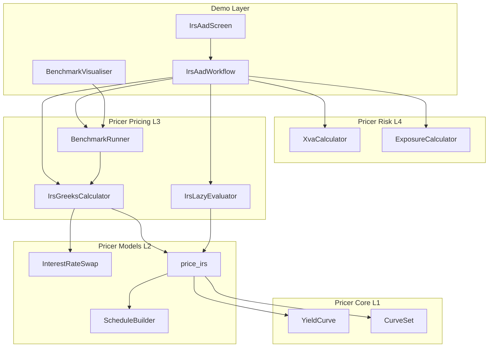
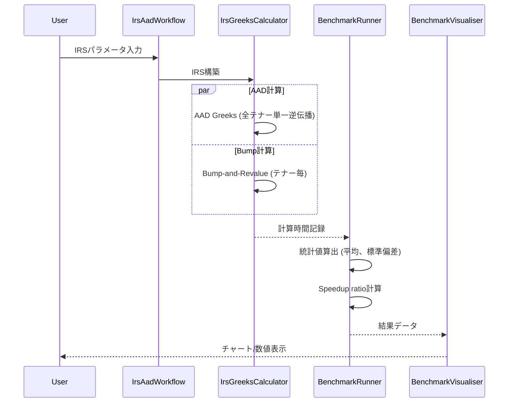
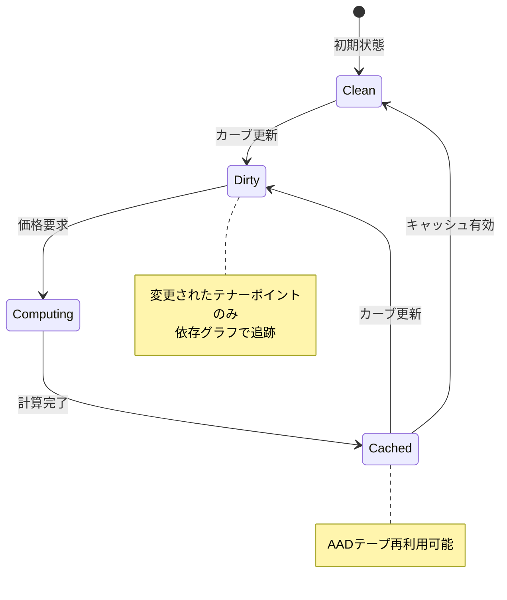

# IRS AAD Demo 技術設計書

## Overview

**Purpose**: 本機能は、金利スワップ(IRS)を題材としてAAD(Adjoint Algorithmic Differentiation)の性能優位性を実証するデモシステムを提供する。クオンツアナリスト、リスク管理者、学習者がBump-and-Revalue方式との比較を通じてAADの高速性を体験できる。

**Users**:
- クオンツアナリスト: IRS価格評価とGreeks計算の検証
- リスク管理者: DV01、テナーDelta、XVA感応度の高速計算
- 学習者: AADの動作原理と性能優位性の視覚的理解

**Impact**: FrictionalBankデモシステムに新たなワークフロー(IRS AAD Demo)を追加し、既存のEOD Batch、Intraday、Stress Testワークフローと並列で動作する。pricer_pricingのEnzyme ADインフラストラクチャを活用し、IRS固有のGreeks計算機能を拡張する。

### Goals

- IRS価格評価とAAD Greeks計算の統合デモ環境の構築
- AAD vs Bump-and-Revalueの性能差を定量的に可視化
- LazyValuation機能によるキャッシュと依存関係追跡の実証
- XVA(CVA/DVA)計算におけるAAD感応度計算のデモンストレーション
- FrictionalBank TUI/Web統合による対話的なユーザー体験の提供

### Non-Goals

- 本番環境向けの完全なIRS価格評価エンジンの実装
- 複数通貨スワップ、クロスカレンシースワップの対応
- リアルタイム市場データ連携
- 規制報告向けのXVA計算(SA-CCR、FRTB等)
- Enzyme ADの内部実装詳細の変更

## Architecture

### Existing Architecture Analysis

本設計は既存のアーキテクチャを拡張する形で実装される。

**活用する既存コンポーネント**:
- `pricer_models::instruments::rates::InterestRateSwap<T>`: IRS構造体とスケジュール
- `pricer_models::instruments::rates::pricing::price_irs`: IRS価格評価関数
- `pricer_pricing::enzyme::greeks::GreeksEnzyme`: Enzyme ADトレイト
- `pricer_pricing::greeks::{GreeksConfig, GreeksMode, GreeksResult}`: Greeks計算基盤
- `pricer_risk::xva::XvaCalculator`: XVA計算エンジン
- `pricer_risk::exposure::ExposureCalculator`: エクスポージャー計算
- `demo::frictional_bank::workflow::DemoWorkflow`: ワークフロー基盤

**既存パターンの踏襲**:
- A-I-P-S依存方向の厳守
- Static Dispatch (`enum`) による Enzyme最適化
- `#[autodiff]` マクロによるAAD統合
- `DemoWorkflow` トレイトによるワークフロー実装

### Architecture Pattern & Boundary Map



**Architecture Integration**:
- **Selected pattern**: Extension (既存システムの拡張)
- **Domain boundaries**: Demo Layer新規追加、Pricer Pricing L3に新モジュール追加
- **Existing patterns preserved**: DemoWorkflow trait、GreeksEnzyme trait、A-I-P-S依存方向
- **New components rationale**: IRS固有のDelta/DV01計算、LazyValuation、ベンチマーク実行が必要
- **Steering compliance**: pricer_pricingのみnightly、他はstable Rust対応を維持

### Technology Stack

| Layer | Choice / Version | Role in Feature | Notes |
|-------|------------------|-----------------|-------|
| Demo / TUI | ratatui 0.28+, crossterm | IRS AADデモ画面、チャート表示 | 既存demo/guiパターン踏襲 |
| Demo / Web | axum, tokio-tungstenite | WebSocket配信、Chart.js連携 | 既存Web dashboard拡張 |
| Pricer / AD | Enzyme (LLVM 18)、`#[autodiff]` | AAD計算、逆伝播Greeks | nightly-2025-01-15必須 |
| Pricer / Benchmark | std::time::Instant、criterion (optional) | ナノ秒精度計測 | criterionはLLVM 18環境でのみ |
| Pricer / Cache | std::collections::HashMap、Arc | LazyValuation依存グラフ | 追加外部依存なし |
| Data / Output | serde_json、markdown生成 | ベンチマーク結果出力 | JSON/Markdown形式 |

## System Flows

### AAD vs Bump-and-Revalue 計算フロー



### LazyValuation 依存関係更新フロー



## Requirements Traceability

| Requirement | Summary | Components | Interfaces | Flows |
|-------------|---------|------------|------------|-------|
| 1.1, 1.2, 1.3, 1.4, 1.5 | IRS価格評価 | IrsGreeksCalculator, InterestRateSwap | IrsPricingService | 計算フロー |
| 2.1, 2.2, 2.3, 2.4, 2.5, 2.6 | AAD Greeks計算 | IrsGreeksCalculator, BenchmarkRunner | GreeksService | AAD計算フロー |
| 3.1, 3.2, 3.3, 3.4, 3.5 | LazyValuation | IrsLazyEvaluator | LazyEvaluatorService | 依存関係更新フロー |
| 4.1, 4.2, 4.3, 4.4, 4.5, 4.6 | XVA計算デモ | XvaCalculator, ExposureCalculator | XvaDemoService | 計算フロー |
| 5.1, 5.2, 5.3, 5.4, 5.5 | 性能ベンチマーク | BenchmarkRunner | BenchmarkService | 計算フロー |
| 6.1, 6.2, 6.3, 6.4, 6.5, 6.6 | FrictionalBank統合 | IrsAadWorkflow, IrsAadScreen | WorkflowService | 全フロー |
| 7.1, 7.2, 7.3, 7.4, 7.5, 7.6 | 教育的可視化 | BenchmarkVisualiser, IrsAadScreen | VisualisationService | 可視化フロー |

## Components and Interfaces

| Component | Domain/Layer | Intent | Req Coverage | Key Dependencies (P0/P1) | Contracts |
|-----------|--------------|--------|--------------|--------------------------|-----------|
| IrsGreeksCalculator | pricer_pricing L3 | IRS Greeks計算 (AAD/Bump) | 1.1-1.5, 2.1-2.6 | InterestRateSwap (P0), price_irs (P0), GreeksEnzyme (P0) | Service |
| IrsLazyEvaluator | pricer_pricing L3 | キャッシュと依存関係追跡 | 3.1-3.5 | CurveSet (P0), IrsGreeksCalculator (P1) | Service, State |
| BenchmarkRunner | pricer_pricing L3 | 性能計測と統計 | 5.1-5.5 | IrsGreeksCalculator (P0) | Service |
| IrsAadWorkflow | demo/frictional_bank | ワークフロー実行 | 6.1-6.6 | DemoWorkflow (P0), IrsGreeksCalculator (P0), XvaCalculator (P1) | Service |
| IrsAadScreen | demo/gui | TUI画面描画 | 6.2, 6.3, 7.1-7.6 | ratatui (P0), BenchmarkVisualiser (P1) | State |
| BenchmarkVisualiser | demo/gui | 可視化コンポーネント | 7.1-7.6 | BenchmarkRunner (P0), ratatui Chart (P1) | State |

### Pricer Pricing L3

#### IrsGreeksCalculator

| Field | Detail |
|-------|--------|
| Intent | IRSのPV、DV01、テナーDeltaをAADおよびBump-and-Revalueで計算 |
| Requirements | 1.1, 1.2, 1.3, 1.4, 1.5, 2.1, 2.2, 2.3, 2.4, 2.5, 2.6 |

**Responsibilities & Constraints**
- IRS NPV計算の実行 (price_irs関数のラッパー)
- AADモードでの全テナーDelta単一逆伝播計算
- Bump-and-Revalueモードでの有限差分計算
- DV01 (1bp金利変動に対するPV変化) の算出
- 計算結果の精度検証 (1e-6相対誤差)
- 計算時間のナノ秒精度記録

**Dependencies**
- Inbound: IrsAadWorkflow, BenchmarkRunner - Greeks計算要求 (P0)
- Outbound: InterestRateSwap - IRS構造体 (P0)
- Outbound: price_irs, price_fixed_leg, price_floating_leg - 価格評価関数 (P0)
- External: Enzyme `#[autodiff]` - LLVM ADプラグイン (P0)

**Contracts**: Service [x] / API [ ] / Event [ ] / Batch [ ] / State [ ]

##### Service Interface

```rust
/// IRS Greeks計算器
///
/// AADおよびBump-and-Revalue方式でIRSのGreeksを計算する。
/// Generic over T: Float for AD compatibility.
pub struct IrsGreeksCalculator<T: Float> {
    config: IrsGreeksConfig,
    _phantom: PhantomData<T>,
}

impl<T: Float> IrsGreeksCalculator<T> {
    /// 新しい計算器を構築
    pub fn new(config: IrsGreeksConfig) -> Self;

    /// IRSのNPVを計算
    pub fn compute_npv(
        &self,
        swap: &InterestRateSwap<T>,
        curves: &CurveSet<T>,
        valuation_date: Date,
    ) -> Result<T, IrsGreeksError>;

    /// DV01を計算 (1bp並行シフト感応度)
    pub fn compute_dv01(
        &self,
        swap: &InterestRateSwap<T>,
        curves: &CurveSet<T>,
        valuation_date: Date,
    ) -> Result<T, IrsGreeksError>;

    /// 全テナーDeltaを計算 (AADモード: 単一逆伝播)
    pub fn compute_tenor_deltas_aad(
        &self,
        swap: &InterestRateSwap<T>,
        curves: &CurveSet<T>,
        valuation_date: Date,
        tenor_points: &[T],
    ) -> Result<IrsDeltaResult<T>, IrsGreeksError>;

    /// 全テナーDeltaを計算 (Bump-and-Revalueモード)
    pub fn compute_tenor_deltas_bump(
        &self,
        swap: &InterestRateSwap<T>,
        curves: &CurveSet<T>,
        valuation_date: Date,
        tenor_points: &[T],
        bump_size: T,
    ) -> Result<IrsDeltaResult<T>, IrsGreeksError>;

    /// 計算モードを指定してDeltaを計算
    pub fn compute_deltas(
        &self,
        swap: &InterestRateSwap<T>,
        curves: &CurveSet<T>,
        valuation_date: Date,
        tenor_points: &[T],
        mode: GreeksMode,
    ) -> Result<IrsGreeksResult<T>, IrsGreeksError>;
}

/// IRS Greeks計算設定
#[derive(Clone, Debug)]
pub struct IrsGreeksConfig {
    /// Bump幅 (デフォルト: 1bp = 0.0001)
    pub bump_size: f64,
    /// 許容相対誤差 (デフォルト: 1e-6)
    pub tolerance: f64,
    /// 計算モード
    pub mode: GreeksMode,
}

/// IRS Delta計算結果
#[derive(Clone, Debug)]
pub struct IrsDeltaResult<T: Float> {
    /// テナーポイント (年)
    pub tenors: Vec<T>,
    /// 各テナーのDelta値
    pub deltas: Vec<T>,
    /// DV01 (並行シフト感応度)
    pub dv01: T,
    /// 計算時間 (ナノ秒)
    pub compute_time_ns: u64,
}

/// IRS Greeks計算結果 (モード比較用)
#[derive(Clone, Debug)]
pub struct IrsGreeksResult<T: Float> {
    /// NPV
    pub npv: T,
    /// AAD計算結果
    pub aad_result: Option<IrsDeltaResult<T>>,
    /// Bump-and-Revalue計算結果
    pub bump_result: Option<IrsDeltaResult<T>>,
    /// 精度検証結果 (相対誤差)
    pub accuracy_check: Option<Vec<T>>,
}

/// IRS Greeks計算エラー
#[derive(Debug, thiserror::Error)]
pub enum IrsGreeksError {
    #[error("Invalid swap parameters: {0}")]
    InvalidSwap(String),
    #[error("Curve not found: {0}")]
    CurveNotFound(String),
    #[error("AAD computation failed: {0}")]
    AadFailed(String),
    #[error("Accuracy check failed: max relative error {0} exceeds tolerance {1}")]
    AccuracyCheckFailed(f64, f64),
}
```

- Preconditions: 有効なIRSオブジェクト、適切なCurveSet、valuation_date <= 満期日
- Postconditions: 計算結果が返却、計算時間が記録
- Invariants: AAD結果とBump結果の差分が許容誤差以内

**Implementation Notes**
- Integration: `#[autodiff]`マクロによりprice_irs関数をAAD対応に変換
- Validation: tenor_pointsが昇順、bump_sizeが正値であることを検証
- Risks: Enzyme ADが利用不可の場合、Bump-and-Revalueにフォールバック

#### IrsLazyEvaluator

| Field | Detail |
|-------|--------|
| Intent | 市場データ更新時の最小再計算とAADテープ再利用 |
| Requirements | 3.1, 3.2, 3.3, 3.4, 3.5 |

**Responsibilities & Constraints**
- 依存関係グラフの構築と管理
- カーブ変更の追跡と影響範囲の特定
- 計算結果のキャッシュ管理
- AADテープの再利用判定
- キャッシュ無効化時の自動再計算トリガー

**Dependencies**
- Inbound: IrsAadWorkflow - 価格評価要求 (P0)
- Outbound: IrsGreeksCalculator - Greeks計算実行 (P0)
- Outbound: CurveSet - カーブデータ参照 (P0)

**Contracts**: Service [x] / API [ ] / Event [ ] / Batch [ ] / State [x]

##### Service Interface

```rust
/// Lazy Evaluator for IRS pricing
///
/// 依存関係グラフを管理し、変更された入力のみを再計算する。
pub struct IrsLazyEvaluator<T: Float> {
    cache: HashMap<CacheKey, CachedResult<T>>,
    dependency_graph: DependencyGraph,
    tape_cache: Option<AadTapeCache>,
}

impl<T: Float> IrsLazyEvaluator<T> {
    /// 新しいLazy Evaluatorを構築
    pub fn new() -> Self;

    /// キャッシュ済み結果または新規計算結果を取得
    pub fn get_or_compute(
        &mut self,
        swap: &InterestRateSwap<T>,
        curves: &CurveSet<T>,
        valuation_date: Date,
        calculator: &IrsGreeksCalculator<T>,
    ) -> Result<IrsGreeksResult<T>, IrsGreeksError>;

    /// カーブ更新を通知
    pub fn notify_curve_update(&mut self, curve_name: CurveName, tenor: T);

    /// 全キャッシュを無効化
    pub fn invalidate_all(&mut self);

    /// AADテープを再利用可能かチェック
    pub fn can_reuse_tape(&self, swap_id: &str) -> bool;

    /// キャッシュ統計を取得
    pub fn cache_stats(&self) -> CacheStats;
}

/// キャッシュキー
#[derive(Hash, Eq, PartialEq, Clone)]
struct CacheKey {
    swap_hash: u64,
    curve_version: u64,
    valuation_date: Date,
}

/// 依存関係グラフ
struct DependencyGraph {
    /// カーブテナー → 依存するスワップID
    curve_dependencies: HashMap<(CurveName, u32), HashSet<String>>,
}

/// キャッシュ統計
#[derive(Clone, Debug, Default)]
pub struct CacheStats {
    pub hits: u64,
    pub misses: u64,
    pub invalidations: u64,
    pub tape_reuses: u64,
}
```

##### State Management

- State model: 各IRSの計算結果とAADテープをキャッシュ
- Persistence: メモリ内のみ (セッション単位)
- Concurrency: Arc<RwLock<_>>による読み取り優先ロック

#### BenchmarkRunner

| Field | Detail |
|-------|--------|
| Intent | AAD vs Bump-and-Revalue性能計測と統計分析 |
| Requirements | 5.1, 5.2, 5.3, 5.4, 5.5 |

**Responsibilities & Constraints**
- 複数回計測による統計値算出 (平均、標準偏差、最小、最大)
- スピードアップ比率の計算
- テナー数スケーラビリティ計測
- 結果のJSON/Markdown出力

**Dependencies**
- Inbound: IrsAadWorkflow, BenchmarkVisualiser - ベンチマーク実行要求 (P0)
- Outbound: IrsGreeksCalculator - 計測対象関数 (P0)

**Contracts**: Service [x] / API [ ] / Event [ ] / Batch [ ] / State [ ]

##### Service Interface

```rust
/// ベンチマーク実行器
pub struct BenchmarkRunner {
    config: BenchmarkConfig,
}

impl BenchmarkRunner {
    /// 新しいベンチマーク実行器を構築
    pub fn new(config: BenchmarkConfig) -> Self;

    /// PV計算ベンチマークを実行
    pub fn benchmark_pv<T: Float>(
        &self,
        swap: &InterestRateSwap<T>,
        curves: &CurveSet<T>,
        valuation_date: Date,
    ) -> BenchmarkResult;

    /// Delta計算ベンチマーク (AAD vs Bump) を実行
    pub fn benchmark_deltas<T: Float>(
        &self,
        swap: &InterestRateSwap<T>,
        curves: &CurveSet<T>,
        valuation_date: Date,
        tenor_points: &[T],
    ) -> DeltaBenchmarkResult;

    /// スケーラビリティベンチマークを実行
    pub fn benchmark_scalability<T: Float>(
        &self,
        swap: &InterestRateSwap<T>,
        curves: &CurveSet<T>,
        valuation_date: Date,
        tenor_counts: &[usize],
    ) -> ScalabilityResult;

    /// 結果をJSON形式で出力
    pub fn to_json(&self, result: &DeltaBenchmarkResult) -> String;

    /// 結果をMarkdown形式で出力
    pub fn to_markdown(&self, result: &DeltaBenchmarkResult) -> String;
}

/// ベンチマーク設定
#[derive(Clone, Debug)]
pub struct BenchmarkConfig {
    /// 反復回数 (デフォルト: 100)
    pub iterations: usize,
    /// ウォームアップ回数 (デフォルト: 10)
    pub warmup: usize,
}

/// Delta計算ベンチマーク結果
#[derive(Clone, Debug, serde::Serialize)]
pub struct DeltaBenchmarkResult {
    /// AAD計測統計
    pub aad_stats: TimingStats,
    /// Bump計測統計
    pub bump_stats: TimingStats,
    /// スピードアップ比率 (bump_mean / aad_mean)
    pub speedup_ratio: f64,
    /// テナー数
    pub tenor_count: usize,
}

/// 計測統計
#[derive(Clone, Debug, serde::Serialize)]
pub struct TimingStats {
    pub mean_ns: f64,
    pub std_dev_ns: f64,
    pub min_ns: u64,
    pub max_ns: u64,
}

/// スケーラビリティ結果
#[derive(Clone, Debug, serde::Serialize)]
pub struct ScalabilityResult {
    /// テナー数 → ベンチマーク結果
    pub results: Vec<(usize, DeltaBenchmarkResult)>,
}
```

### Demo Layer

#### IrsAadWorkflow

| Field | Detail |
|-------|--------|
| Intent | FrictionalBank統合のワークフロー実装 |
| Requirements | 6.1, 6.2, 6.3, 6.4, 6.5, 6.6 |

**Responsibilities & Constraints**
- DemoWorkflowトレイトの実装
- IRSパラメータ入力の処理
- 計算モード選択 (AAD/Bump-and-Revalue)
- 結果のフォーマットと表示
- WebSocket経由のリアルタイム配信

**Dependencies**
- Inbound: FrictionalBank main, TUI screens - ワークフロー実行 (P0)
- Outbound: IrsGreeksCalculator - Greeks計算 (P0)
- Outbound: BenchmarkRunner - ベンチマーク実行 (P0)
- Outbound: XvaCalculator - XVA計算 (P1)
- Outbound: ExposureCalculator - エクスポージャー計算 (P1)

**Contracts**: Service [x] / API [ ] / Event [ ] / Batch [ ] / State [ ]

##### Service Interface

```rust
/// IRS AADデモワークフロー
pub struct IrsAadWorkflow {
    calculator: IrsGreeksCalculator<f64>,
    lazy_evaluator: IrsLazyEvaluator<f64>,
    benchmark_runner: BenchmarkRunner,
    xva_calculator: XvaCalculator,
    cancelled: Arc<AtomicBool>,
}

#[async_trait]
impl DemoWorkflow for IrsAadWorkflow {
    fn name(&self) -> &str { "IRS AAD Demo" }

    async fn run(
        &self,
        config: &DemoConfig,
        progress: Option<ProgressCallback>,
    ) -> Result<WorkflowResult, DemoError>;

    async fn cancel(&self);
}

impl IrsAadWorkflow {
    /// 新しいワークフローを構築
    pub fn new(config: IrsAadConfig) -> Self;

    /// IRSパラメータからスワップを構築
    pub fn build_swap(&self, params: &IrsParams) -> Result<InterestRateSwap<f64>, DemoError>;

    /// 単一計算を実行 (インタラクティブモード)
    pub async fn compute_single(
        &self,
        params: &IrsParams,
        mode: GreeksMode,
    ) -> Result<IrsComputeResult, DemoError>;

    /// ベンチマークを実行
    pub async fn run_benchmark(
        &self,
        params: &IrsParams,
    ) -> Result<DeltaBenchmarkResult, DemoError>;

    /// XVAデモを実行
    pub async fn run_xva_demo(
        &self,
        params: &IrsParams,
        credit_params: &CreditParams,
    ) -> Result<XvaDemoResult, DemoError>;
}

/// IRS入力パラメータ
#[derive(Clone, Debug)]
pub struct IrsParams {
    pub notional: f64,
    pub fixed_rate: f64,
    pub start_date: Date,
    pub end_date: Date,
    pub currency: Currency,
    pub direction: SwapDirection,
    pub rate_index: RateIndex,
}

/// IRS計算結果
#[derive(Clone, Debug)]
pub struct IrsComputeResult {
    pub npv: f64,
    pub dv01: f64,
    pub deltas: IrsDeltaResult<f64>,
    pub compute_time_ns: u64,
    pub mode: GreeksMode,
}

/// XVAデモ結果
#[derive(Clone, Debug)]
pub struct XvaDemoResult {
    pub cva: f64,
    pub dva: f64,
    pub cva_delta: Vec<f64>,
    pub aad_time_ns: u64,
    pub bump_time_ns: u64,
    pub speedup_ratio: f64,
}
```

#### BenchmarkVisualiser (Summary-only)

| Field | Detail |
|-------|--------|
| Intent | TUI/Webでのベンチマーク結果可視化 |
| Requirements | 7.1, 7.2, 7.3, 7.4, 7.5, 7.6 |
| Key Dependencies | BenchmarkRunner (P0), ratatui Chart (P1) |
| Contracts | State |

**Implementation Notes**
- TUI: ratatuiのChart widgetで速度比較バーチャート、スケーラビリティ折れ線グラフ
- Web: Chart.js互換JSONデータ出力
- 精度検証結果 (AAD vs Bump差分) のテーブル表示

## Data Models

### Domain Model

**Aggregates**:
- `InterestRateSwap<T>`: 既存。FixedLeg、FloatingLegを保持
- `IrsGreeksResult<T>`: 計算結果集約。NPV、Deltas、計算時間を保持

**Value Objects**:
- `IrsParams`: 入力パラメータ (不変)
- `IrsDeltaResult<T>`: Delta計算結果
- `TimingStats`: 計測統計

**Domain Events** (将来拡張):
- `CurveUpdated`: カーブ更新イベント
- `ComputationCompleted`: 計算完了イベント

**Business Rules**:
- Notionalは正値であること
- start_date < end_date
- bump_sizeは0.0001 (1bp) 以上
- 許容誤差 (tolerance) は1e-6以下

### Logical Data Model

**IRS計算結果構造**:

```rust
/// テナーDelta結果の内部表現
struct TenorDeltaData {
    tenors: Vec<f64>,      // [0.25, 0.5, 1.0, 2.0, ...]
    aad_deltas: Vec<f64>,  // AAD計算結果
    bump_deltas: Vec<f64>, // Bump計算結果
    errors: Vec<f64>,      // 相対誤差
}
```

**ベンチマーク結果のスキーマ (JSON)**:

```json
{
  "benchmark_type": "delta_comparison",
  "timestamp": "2026-01-13T12:00:00Z",
  "swap_params": {
    "notional": 1000000.0,
    "fixed_rate": 0.03,
    "tenor_years": 5
  },
  "results": {
    "tenor_count": 20,
    "aad": {
      "mean_ns": 15000,
      "std_dev_ns": 500,
      "min_ns": 14000,
      "max_ns": 16500
    },
    "bump": {
      "mean_ns": 300000,
      "std_dev_ns": 5000,
      "min_ns": 290000,
      "max_ns": 320000
    },
    "speedup_ratio": 20.0
  }
}
```

## Error Handling

### Error Strategy

本デモシステムは教育目的のため、エラーはユーザーに対して分かりやすく表示する。

### Error Categories and Responses

**User Errors (入力エラー)**:
- 負の想定元本 → "Notional must be positive"
- 無効な日付範囲 → "Start date must be before end date"
- サポート外通貨 → "Currency {X} is not supported"

**System Errors (計算エラー)**:
- Enzyme AD利用不可 → Bump-and-Revalueへ自動フォールバック + 警告表示
- カーブ未設定 → "Discount curve not found. Please configure curve set."
- 計算タイムアウト → "Computation timed out after {N} seconds"

**Business Logic Errors (精度エラー)**:
- AAD vs Bump差分超過 → "Accuracy check failed: max error {E} > tolerance {T}"

### Monitoring

- 各計算の実行時間をナノ秒精度でログ
- キャッシュヒット率の追跡 (CacheStats)
- AADフォールバック発生回数の記録

## Testing Strategy

### Unit Tests
- `IrsGreeksCalculator::compute_npv`: ATM/ITM/OTMスワップでのNPV検証
- `IrsGreeksCalculator::compute_dv01`: 既知のDV01値との比較
- `IrsGreeksCalculator::compute_tenor_deltas_aad`: AAD結果とBump結果の一致検証
- `IrsLazyEvaluator::notify_curve_update`: キャッシュ無効化動作
- `BenchmarkRunner::benchmark_deltas`: 統計計算の正確性

### Integration Tests
- IrsAadWorkflow + IrsGreeksCalculator: 完全なワークフロー実行
- FrictionalBank TUI + IrsAadScreen: 画面遷移とイベント処理
- WebSocket配信: リアルタイムデータ更新

### E2E Tests
- 5年ATMスワップの完全なベンチマークサイクル
- パラメータ変更による即時再計算
- 複数スワップポートフォリオのXVA計算

### Performance Tests
- 20テナーポイントでのAAD vs Bump速度比較
- 100回反復での計測安定性
- メモリ使用量 (LazyEvaluatorキャッシュ)

## Optional Sections

### Performance & Scalability

**Target Metrics**:
- AADによる全テナーDelta計算: < 100μs (20テナーポイント)
- Bump-and-Revalue比でのスピードアップ: > 10x
- LazyEvaluatorキャッシュヒット時: < 1μs

**Scaling Approach**:
- テナー数に対してAADはO(1)逆伝播、BumpはO(n)
- 複数IRSポートフォリオはRayonによる並列処理

### Security Considerations

本デモシステムはローカル実行のため、セキュリティリスクは限定的。WebSocket使用時はlocalhost限定とする。
