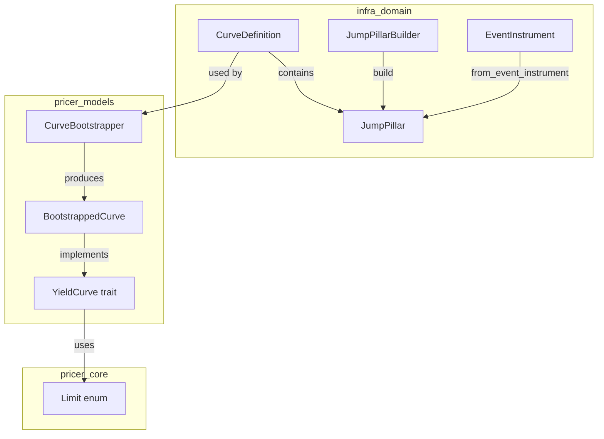
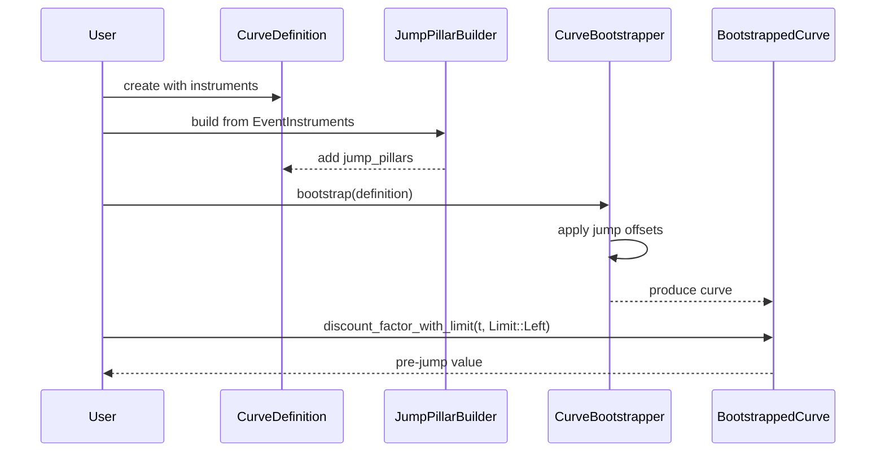
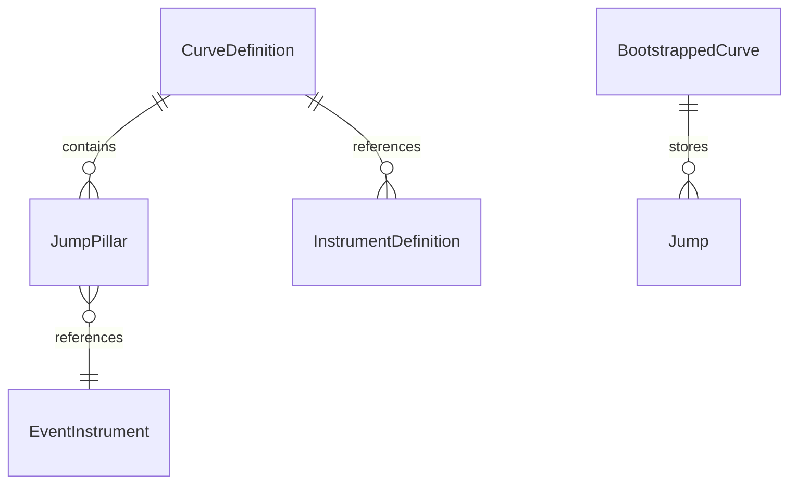

# Design Document: Jump-Aware Curve Definition

## Overview

**Purpose**: 中央銀行会合などのイベントに起因する金利の不連続性（ジャンプ）を曲線構築プロセスで明示的に扱う機能を提供する。

**Users**: Quant developers および curve calibrators が、政策金利発表日等における不連続性を考慮した曲線構築を実行する。

**Impact**: `CurveDefinition` を拡張し、`JumpPillar` 構造を追加。内挿アルゴリズムが左極限・右極限を分離して扱えるようになり、フォワードカーブの振動を防止する。

### Goals

- JumpPillar を CurveDefinition に統合し、曲線構築で考慮可能にする
- 内挿インターフェースで左極限・右極限の分離取得をサポート
- EventInstrument から JumpPillar への自動変換機能を提供
- 後方互換性を完全に維持する

### Non-Goals

- リアルタイム市場データフィードからの自動 JumpPillar 生成（将来スコープ）
- Web UI でのジャンプ可視化（別スペックで対応）
- Enzyme AD によるジャンプパラメータ微分（Phase 2）

## Architecture

### Existing Architecture Analysis

- **CurveDefinition**: `infra_domain/market/definition/curve.rs` に存在。instruments, calibration_method, interpolation を保持
- **EventInstrument**: `infra_domain/market/event_instrument.rs` に存在。expected_spread, confidence, rate_index を保持
- **YieldCurve trait**: `pricer_models/market.rs` で `enum_dispatch` パターン実装済み
- **CurveBootstrapper**: 逐次ブートストラップで Newton-Raphson ソルバー使用

### Architecture Pattern & Boundary Map



**Architecture Integration**:
- **Selected pattern**: ハイブリッド（定義は新規ファイル、実装は既存拡張）
- **Domain boundaries**: infra_domain（定義）→ pricer_models（実装）の A-I-P-S 依存方向維持
- **Existing patterns preserved**: Builder パターン、enum_dispatch、serde feature flag
- **New components rationale**: JumpPillar を分離ファイルとして責務明確化
- **Steering compliance**: 静的ディスパッチ、後方互換性、British English 命名規則

### Technology Stack

| Layer | Choice / Version | Role in Feature | Notes |
|-------|------------------|-----------------|-------|
| Backend | Rust Edition 2021 | JumpPillar, Limit 実装 | Stable toolchain |
| Data | serde (feature-gated) | JSON シリアライズ | 既存パターン踏襲 |
| Testing | approx, proptest | 数値精度・プロパティテスト | 既存依存 |

## System Flows

### ジャンプ付き曲線構築フロー



**Key Decisions**:
- ジャンプオフセットは discount factor の log 空間で適用
- 複数ジャンプは時系列順に累積適用

## Requirements Traceability

| Requirement | Summary | Components | Interfaces | Flows |
|-------------|---------|------------|------------|-------|
| 1.1 | CurveDefinition に jump_pillars フィールド | CurveDefinition | with_jump_pillars() | - |
| 1.2 | JumpPillar 日付範囲検証 | CurveDefinition | validate() | - |
| 1.3 | JumpPillar フィールド定義 | JumpPillar | new(), accessors | - |
| 1.4 | EventInstrument からの変換 | JumpPillar | from_event_instrument() | - |
| 1.5 | serde シリアライズ | CurveDefinition, JumpPillar | Serialize/Deserialize | - |
| 2.1 | Limit 指定サポート | Limit, YieldCurve | discount_factor_with_limit() | 曲線構築 |
| 2.2-2.5 | 左極限・右極限取得 | BootstrappedCurve | discount_factor_with_limit() | - |
| 2.6 | BootstrappedCurve 実装 | BootstrappedCurve | - | - |
| 3.1 | CurveBootstrapper 定義受入 | CurveBootstrapper | bootstrap_with_jumps() | 曲線構築 |
| 3.2 | ジャンプオフセット適用 | CurveBootstrapper | - | 曲線構築 |
| 3.3-3.6 | キャリブレーション拡張 | CurveBootstrapper | effective_jump_at() | - |
| 4.1-4.5 | JumpPillarBuilder | JumpPillarBuilder | build(), filter methods | - |
| 5.1-5.5 | フォワードレート整合性 | BootstrappedCurve | forward_rate_with_limit() | - |
| 6.1-6.6 | バリデーション | CurveDefinition, CurveDefError | validate_jump_pillars() | - |
| 7.1-7.5 | 後方互換性 | All | デフォルト値、既存 API 維持 | - |

## Components and Interfaces

### Summary

| Component | Domain/Layer | Intent | Req Coverage | Key Dependencies | Contracts |
|-----------|--------------|--------|--------------|------------------|-----------|
| JumpPillar | infra_domain | ジャンプ定義 | 1.3, 1.4, 1.5 | Date, EventInstrument | State |
| JumpPillarBuilder | infra_domain | EventInstrument 変換 | 4.1-4.5 | EventInstrument, RateIndex | Service |
| CurveDefinition (拡張) | infra_domain | 曲線レシピ | 1.1, 1.2, 6.1-6.6 | JumpPillar | State |
| Limit | pricer_core | 極限指定 | 2.1 | - | State |
| BootstrappedCurve (拡張) | pricer_models | 曲線実装 | 2.2-2.6, 5.1-5.5 | YieldCurve, Limit | Service |
| CurveBootstrapper (拡張) | pricer_models | キャリブレーション | 3.1-3.6 | CurveDefinition | Service |

---

### infra_domain::market::definition

#### JumpPillar

| Field | Detail |
|-------|--------|
| Intent | 中央銀行会合等のイベント日におけるジャンプ幅を定義 |
| Requirements | 1.3, 1.4, 1.5 |

**Responsibilities & Constraints**
- ジャンプ発生日、予想幅（bps）、信頼度、イベント参照を保持
- 不変条件: confidence ∈ [0.0, 1.0]

**Dependencies**
- Inbound: CurveDefinition — jump_pillars フィールドとして包含 (P0)
- External: EventInstrument — from_event_instrument 変換元 (P1)

**Contracts**: State [x]

##### State Management

```rust
#[derive(Debug, Clone, PartialEq)]
#[cfg_attr(feature = "serde", derive(Serialize, Deserialize))]
#[cfg_attr(feature = "serde", serde(rename_all = "camelCase"))]
pub struct JumpPillar {
    pub jump_date: Date,
    pub expected_jump_bps: f64,
    pub event_reference: Option<String>,
    pub confidence: f64,
}

impl JumpPillar {
    pub fn new(
        jump_date: Date,
        expected_jump_bps: f64,
        confidence: f64,
    ) -> Self;

    pub fn with_event_reference(self, ref_id: impl Into<String>) -> Self;

    pub fn from_event_instrument(event: &EventInstrument) -> Self;

    pub fn jump_date(&self) -> Date;
    pub fn expected_jump_bps(&self) -> f64;
    pub fn confidence(&self) -> f64;
    pub fn weighted_jump_bps(&self) -> f64; // expected_jump_bps * confidence
}
```

- **State model**: 不変構造体
- **Persistence & consistency**: serde feature でシリアライズ対応

---

#### JumpPillarBuilder

| Field | Detail |
|-------|--------|
| Intent | EventInstrument リストから JumpPillar リストを生成 |
| Requirements | 4.1, 4.2, 4.3, 4.4, 4.5 |

**Responsibilities & Constraints**
- RateIndex フィルタリング、日付範囲フィルタ、信頼度閾値フィルタを提供
- 時系列順にソートして返却

**Dependencies**
- Inbound: User code — Builder 利用 (P0)
- External: EventInstrument — 変換元データ (P0)

**Contracts**: Service [x]

##### Service Interface

```rust
pub struct JumpPillarBuilder {
    events: Vec<EventInstrument>,
    rate_index_filter: Option<RateIndex>,
    date_range: Option<(Date, Date)>,
    min_confidence: f64,
}

impl JumpPillarBuilder {
    pub fn new(events: Vec<EventInstrument>) -> Self;
    pub fn with_rate_index(self, index: RateIndex) -> Self;
    pub fn with_date_range(self, start: Date, end: Date) -> Self;
    pub fn with_min_confidence(self, threshold: f64) -> Self;
    pub fn build(self) -> Vec<JumpPillar>;
}
```

- **Preconditions**: events が空でも可（空リスト返却）
- **Postconditions**: 結果は jump_date 昇順ソート
- **Invariants**: min_confidence ∈ [0.0, 1.0]

---

#### CurveDefinition (拡張)

| Field | Detail |
|-------|--------|
| Intent | 曲線構築レシピに JumpPillar サポートを追加 |
| Requirements | 1.1, 1.2, 6.1-6.6, 7.1-7.5 |

**Responsibilities & Constraints**
- 既存フィールド維持、jump_pillars をオプショナル追加
- validate() でジャンプ関連検証を追加

**Contracts**: State [x]

##### State Management

```rust
// 既存 CurveDefinition に追加
pub struct CurveDefinition {
    // ... existing fields ...

    #[cfg_attr(feature = "serde", serde(default, skip_serializing_if = "Vec::is_empty"))]
    pub jump_pillars: Vec<JumpPillar>,
}

impl CurveDefinition {
    pub fn with_jump_pillars(mut self, pillars: Vec<JumpPillar>) -> Self;
    pub fn with_jump_pillar(mut self, pillar: JumpPillar) -> Self;
    pub fn jump_pillar_count(&self) -> usize;
    pub fn has_jumps(&self) -> bool;
}
```

**Validation 追加**

```rust
pub enum CurveDefError {
    // ... existing variants ...
    DuplicateJumpDate(Date),
    InvalidConfidence { date: Date, value: f64 },
    JumpWouldCauseNegativeDF { date: Date, jump_bps: f64 },
}
```

---

### pricer_core::types

#### Limit

| Field | Detail |
|-------|--------|
| Intent | 内挿クエリ時の極限指定 |
| Requirements | 2.1 |

**Contracts**: State [x]

```rust
#[derive(Debug, Clone, Copy, PartialEq, Eq, Default)]
pub enum Limit {
    /// ジャンプ前の値（左極限）
    Left,
    /// ジャンプ後の値（右極限）
    Right,
    /// 連続値（ジャンプなし or 右極限をデフォルト）
    #[default]
    Continuous,
}
```

---

### pricer_models::market::curves

#### BootstrappedCurve (拡張)

| Field | Detail |
|-------|--------|
| Intent | ジャンプ対応の discount factor 計算 |
| Requirements | 2.2-2.6, 5.1-5.5 |

**Responsibilities & Constraints**
- jumps フィールドで累積ジャンプオフセット管理
- Limit 指定による左極限・右極限の分離返却

**Dependencies**
- Inbound: Pricing code — discount_factor 呼び出し (P0)
- Outbound: YieldCurve trait — trait 実装 (P0)

**Contracts**: Service [x]

##### Service Interface

```rust
// 既存 BootstrappedCurve に追加
pub struct BootstrappedCurve<T: Float> {
    // ... existing fields ...
    jumps: Vec<(T, T)>, // (time, cumulative_jump_offset)
}

impl<T: Float> BootstrappedCurve<T> {
    pub fn with_jumps(self, jumps: Vec<(T, T)>) -> Self;

    /// Limit 指定付き discount factor 計算
    pub fn discount_factor_with_limit(
        &self,
        t: T,
        limit: Limit,
    ) -> Result<T, MarketDataError>;

    /// ジャンプを考慮したフォワードレート
    pub fn forward_rate_with_limit(
        &self,
        t1: T,
        t2: T,
        limit: Limit,
    ) -> Result<T, MarketDataError>;

    /// フォワードレートを連続成分とジャンプ成分に分解
    pub fn decompose_forward_rate(
        &self,
        t1: T,
        t2: T,
    ) -> Result<ForwardRateDecomposition<T>, MarketDataError>;
}

pub struct ForwardRateDecomposition<T> {
    pub continuous: T,
    pub jump: T,
    pub total: T,
}
```

- **Preconditions**: t >= 0
- **Postconditions**: 返却 discount factor > 0
- **Invariants**: jumps は time 昇順ソート

---

#### CurveBootstrapper (拡張)

| Field | Detail |
|-------|--------|
| Intent | JumpPillar を考慮した曲線キャリブレーション |
| Requirements | 3.1-3.6 |

**Contracts**: Service [x]

##### Service Interface

```rust
impl CurveBootstrapper {
    /// JumpPillar 付き CurveDefinition からブートストラップ
    pub fn bootstrap_with_definition<I>(
        &self,
        definition: &CurveDefinition,
        instruments: &[I],
    ) -> Result<BootstrappedCurve<f64>, BootstrapError>
    where
        I: CalibrationInstrument<f64> + Clone;

    /// 指定日における累積ジャンプ量取得
    pub fn effective_jump_at(&self, t: f64, jumps: &[JumpPillar]) -> f64;
}
```

**Implementation Notes**
- ジャンプ日を跨ぐ商品評価時、累積オフセットを discount factor に適用
- debug_logging 有効時、適用ジャンプ情報をログ出力

---

## Data Models

### Domain Model



**Aggregates**:
- `CurveDefinition` は JumpPillar を所有（aggregate root）
- `BootstrappedCurve` は内部 Jump リストを所有

**Invariants**:
- JumpPillar.confidence ∈ [0.0, 1.0]
- JumpPillar.jump_date は曲線範囲内
- 同一日に複数 JumpPillar 禁止

---

## Error Handling

### Error Categories and Responses

**Validation Errors** (CurveDefError):
- `DuplicateJumpDate` → 重複日付のエラーメッセージ
- `InvalidConfidence` → 有効範囲外の信頼度指定
- `JumpWouldCauseNegativeDF` → 負の discount factor を招くジャンプ

**Runtime Errors** (MarketDataError):
- `InterpolationFailed` → ジャンプ適用後の補間失敗

### Monitoring

- ブートストラップ時のジャンプ適用ログ（debug level）
- 大きなジャンプ幅（>100bps）の警告ログ

---

## Testing Strategy

### Unit Tests

- `JumpPillar::new` - フィールド初期化
- `JumpPillar::from_event_instrument` - EventInstrument 変換
- `JumpPillarBuilder::build` - フィルタリング動作
- `CurveDefinition::validate` - ジャンプ関連検証
- `BootstrappedCurve::discount_factor_with_limit` - 左極限・右極限

### Integration Tests

- 単一ジャンプ付き曲線のブートストラップと再価格付け
- 複数ジャンプ付き曲線のフォワードレート計算
- JumpPillar なしの後方互換性確認

### Property-Based Tests (proptest)

- 任意の JumpPillar 列に対して discount factor 単調性
- 連続成分 + ジャンプ成分 = 合計フォワードレート

---

## Performance & Scalability

**Target metrics**:
- ジャンプ検索: O(log n) where n = jump count（BTreeMap 使用）
- 追加メモリ: JumpPillar 1件あたり ~48 bytes

**Optimization**:
- jumps ベクタは事前ソート済み、二分探索で検索
