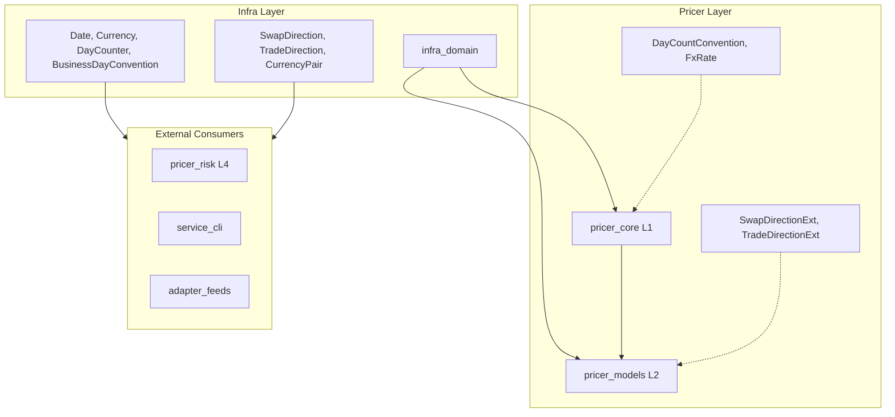
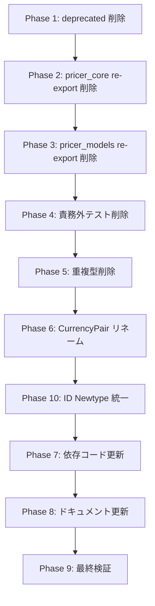

# Technical Design Document

## Overview

**Purpose**: A-I-P-S アーキテクチャの層責務を厳格に遵守するため、クロスレイヤー re-export、重複型定義、責務外テスト、deprecated モジュールを徹底的に削除する。

**Users**: Neutryx 開発者が正しいインポートパスを使用し、型定義の重複なく開発できるようになる。

**Impact**: `pricer_core` および `pricer_models` の公開 API から `infra_domain` 型の re-export を削除。依存コード（12ファイル）のインポート文を更新。

### Goals

- deprecated `infra_domain::convention` モジュールの完全削除
- クロスレイヤー re-export の排除（P層 → I層）
- 重複型定義の統一（`DayCount`, `BusinessDayAdjustment` → `infra_domain` 型使用）
- `CurrencyPair` 名前衝突の解決（`FxRate<T>` へリネーム）
- 責務外テストの削除
- **ID 型安全性の統一**: Stringly Typed を Newtype パターンで解消し、ID 取り違えをコンパイル時に検出

### Non-Goals

- `SpotDateConvention` の `infra_domain` 移動（将来の課題として保留）
- `pricer_core::types::time::DayCountConvention` の削除（独自の簡略型として保持）
- 新規機能の追加（ID Newtype 化は既存概念の型安全化であり、新機能ではない）

## Architecture

### Existing Architecture Analysis

**現在の問題点**:

```text
[現状の違反パターン]

pricer_core (L1) ──pub use──> infra_domain (I)  ❌ 層違反
     │
     └── types/mod.rs: pub use infra_domain::{Date, Currency, ...}
     └── types/time.rs: pub use infra_domain::{Date, DayCounter, ...}
     └── types/error.rs: pub use infra_domain::{CurrencyError, DateError}

pricer_models (L2) ──pub use──> infra_domain (I)  ❌ 層違反
     │
     └── lib.rs: pub use infra_domain::{SwapDirection, TradeDirection}
     └── bootstrapping/date_utils.rs: DayCount, BusinessDayAdjustment (重複定義)
```

**A-I-P-S 依存ルール**:
- P層（Pricer）は I層（Infra）に依存可能だが、re-export すべきではない
- 型は責務に応じた最低レイヤーに一箇所のみ定義

### Architecture Pattern & Boundary Map



**Architecture Integration**:
- **Selected pattern**: 直接インポート強制（re-export 排除）
- **Domain boundaries**: I層の型は I層でのみ定義、P層は独自拡張のみ公開
- **Existing patterns preserved**: A-I-P-S 一方向依存
- **New components rationale**: なし（削除のみ）
- **Steering compliance**: `structure.md` の依存ルールに完全準拠

### Technology Stack

| Layer | Choice / Version | Role in Feature | Notes |
|-------|------------------|-----------------|-------|
| Backend | Rust Edition 2021 | 全変更対象 | 既存 |
| Build | Cargo workspace | ビルド検証 | 既存 |
| Test | cargo test | 回帰テスト | 既存 |
| Lint | cargo clippy | 警告検出 | 既存 |

## Requirements Traceability

| Requirement | Summary | Components | Interfaces | Flows |
|-------------|---------|------------|------------|-------|
| 1.1-1.4 | deprecated convention 削除 | infra_domain | N/A | 削除フロー |
| 2.1-2.5 | pricer_core re-export 削除 | pricer_core::types | N/A | import 更新 |
| 3.1-3.3 | pricer_models re-export 削除 | pricer_models | N/A | import 更新 |
| 4.1-4.3 | 責務外テスト削除 | pricer_core::tests | N/A | テスト削除 |
| 5.1-5.6 | 重複型定義削除 | date_utils | DateCalculator | 型置換 |
| 6.1-6.4 | CurrencyPair リネーム | currency_pair | FxRate<T> | 全参照更新 |
| 7.1-7.9 | 依存コード更新 | 12ファイル | N/A | import 更新 |
| 8.1-8.4 | ドキュメント更新 | steering | N/A | 記述更新 |
| 9.1-9.5 | ビルド・テスト検証 | workspace | N/A | 検証フロー |
| 10.1-10.8 | ID Newtype 統一 | infra_domain::ids, trade, pricer_risk | Service | 型置換・統合 |

## Components and Interfaces

| Component | Domain/Layer | Intent | Req Coverage | Key Dependencies | Contracts |
|-----------|--------------|--------|--------------|------------------|-----------|
| infra_domain::convention | I | 削除対象モジュール | 1.1-1.4 | N/A | N/A |
| pricer_core::types | L1 | re-export 削除対象 | 2.1-2.5 | infra_domain | N/A |
| pricer_models::lib | L2 | re-export 削除対象 | 3.1-3.3 | infra_domain | N/A |
| pricer_core::tests | L1 | テスト削除対象 | 4.1-4.3 | N/A | N/A |
| date_utils | L2 | 重複型削除対象 | 5.1-5.6 | infra_domain | Service |
| currency_pair | L1 | リネーム対象 | 6.1-6.4 | infra_domain | Service |
| infra_domain::ids | I | ID Newtype 統一 | 10.1-10.8 | N/A | Service |
| infra_domain::trade | I | TradeId/Metadata 更新 | 10.3-10.5 | infra_domain::ids | Service |
| pricer_risk::portfolio::ids | L4 | re-export 化 | 10.6 | infra_domain::ids | N/A |

### Infra Layer

#### infra_domain::convention（削除対象）

| Field | Detail |
|-------|--------|
| Intent | trade::convention への re-export シム（deprecated） |
| Requirements | 1.1, 1.2, 1.3, 1.4 |

**Responsibilities & Constraints**
- 後方互換性のためだけに存在
- `trade::convention` への re-export のみ
- 0.9.0 での削除が予定済み

**Dependencies**
- Inbound: なし（使用箇所ゼロ）
- Outbound: `trade::convention` への re-export

**Contracts**: 削除により全契約解消

**Implementation Notes**
- 削除: `src/convention/mod.rs` ファイル
- 削除: `src/convention/` ディレクトリ
- 削除: `lib.rs` の `pub mod convention;`

### Pricer Core Layer (L1)

#### pricer_core::types::mod.rs（re-export 削除）

| Field | Detail |
|-------|--------|
| Intent | 型モジュールから infra_domain re-export を削除 |
| Requirements | 2.1 |

**削除対象コード**:
```rust
// 削除: Line 36
pub use infra_domain::{BusinessDayConvention, Currency, Date, DayCounter};
```

#### pricer_core::types::time.rs（re-export 削除）

| Field | Detail |
|-------|--------|
| Intent | time モジュールから infra_domain re-export を削除 |
| Requirements | 2.2, 2.5 |

**削除対象コード**:
```rust
// 削除: Line 28
pub use infra_domain::{BusinessDayConvention, Date, DayCounter};
```

**保持対象**:
- `DayCountConvention` enum（pricer_core 独自の簡略型）
- `time_to_maturity`, `time_to_maturity_dates` 関数

#### pricer_core::types::error.rs（re-export 削除）

| Field | Detail |
|-------|--------|
| Intent | error モジュールから infra_domain re-export を削除 |
| Requirements | 2.3 |

**削除対象コード**:
```rust
// 削除: Line 14
pub use infra_domain::{CurrencyError, DateError};
```

#### pricer_core::types::currency_pair.rs（リネーム）

| Field | Detail |
|-------|--------|
| Intent | CurrencyPair<T> を FxRate<T> にリネーム |
| Requirements | 6.1, 6.2, 6.3, 6.4 |

**Contracts**: Service [x]

##### Service Interface（更新後）
```rust
/// FX為替レート（AD対応ジェネリック型）
///
/// `infra_domain::CurrencyPair` は instrument 定義用（spot rate なし）、
/// `FxRate<T>` は pricing 用（spot rate あり、AD 対応）。
pub struct FxRate<T: Float> {
    base: Currency,
    quote: Currency,
    spot: T,
}

impl<T: Float> FxRate<T> {
    pub fn new(base: Currency, quote: Currency, spot: T) -> Result<Self, CurrencyError>;
    pub fn base(&self) -> Currency;
    pub fn quote(&self) -> Currency;
    pub fn spot(&self) -> T;
    pub fn invert(&self) -> Self;
}
```

### Pricer Models Layer (L2)

#### pricer_models::lib.rs（re-export 削除）

| Field | Detail |
|-------|--------|
| Intent | lib.rs から infra_domain re-export を削除 |
| Requirements | 3.1, 3.2 |

**削除対象コード**:
```rust
// 削除: Line 57
pub use infra_domain::{SwapDirection, TradeDirection};
```

**保持対象**:
```rust
// 保持: pricer_models 独自の拡張 trait
pub use direction_ext::{SwapDirectionExt, TradeDirectionExt};
```

#### pricer_models::market::calibration::bootstrapping::date_utils.rs（重複型削除）

| Field | Detail |
|-------|--------|
| Intent | 重複型定義を削除し infra_domain 型を使用 |
| Requirements | 5.1, 5.2, 5.3, 5.4, 5.5, 5.6 |

**削除対象**:
- `BusinessDayAdjustment` enum（Line 77-108）
- `DayCount` enum（Line 114-166）

**置換マッピング**:
| 旧型 | 新型 |
|------|------|
| `BusinessDayAdjustment::Following` | `BusinessDayConvention::Following` |
| `BusinessDayAdjustment::ModifiedFollowing` | `BusinessDayConvention::ModifiedFollowing` |
| `BusinessDayAdjustment::Preceding` | `BusinessDayConvention::Preceding` |
| `DayCount::Act360` | `DayCounter::Actual360` |
| `DayCount::Act365Fixed` | `DayCounter::Actual365Fixed` |
| `DayCount::Thirty360` | `DayCounter::Thirty360Bond` |

**Contracts**: Service [x]

##### Service Interface（更新後）
```rust
use infra_domain::{BusinessDayConvention, DayCounter};

pub struct DateCalculator {
    spot_convention: SpotDateConvention,
    business_day_convention: BusinessDayConvention,  // 変更
    day_counter: DayCounter,  // 変更
}

impl DateCalculator {
    pub fn year_fraction(&self, start: NaiveDate, end: NaiveDate) -> f64;
    pub fn adjust(&self, date: NaiveDate) -> NaiveDate;
}
```

### Infra Layer - ID 型統一

#### infra_domain::ids（新規モジュール）

| Field | Detail |
|-------|--------|
| Intent | 全 ID 型を Newtype パターンで一元管理 |
| Requirements | 10.1, 10.2, 10.8 |

**Contracts**: Service [x]

##### Service Interface
```rust
//! Strongly-typed identifier types for domain entities.
//!
//! This module provides newtypes for all ID fields, preventing
//! accidental misuse of identifiers (e.g., passing a TradeId where
//! a CounterpartyId is expected).

use std::fmt;

/// Macro to generate ID newtypes with common implementations.
macro_rules! define_id {
    ($name:ident, $doc:literal) => {
        #[doc = $doc]
        #[derive(Clone, Debug, PartialEq, Eq, Hash)]
        #[cfg_attr(feature = "serde", derive(serde::Serialize, serde::Deserialize))]
        pub struct $name(String);

        impl $name {
            /// Creates a new identifier.
            #[inline]
            pub fn new(id: impl Into<String>) -> Self { Self(id.into()) }

            /// Returns the identifier as a string slice.
            #[inline]
            pub fn as_str(&self) -> &str { &self.0 }
        }

        impl fmt::Display for $name {
            fn fmt(&self, f: &mut fmt::Formatter<'_>) -> fmt::Result {
                write!(f, "{}", self.0)
            }
        }

        impl From<&str> for $name {
            fn from(s: &str) -> Self { Self::new(s) }
        }

        impl From<String> for $name {
            fn from(s: String) -> Self { Self(s) }
        }
    };
}

define_id!(TradeId, "Unique identifier for a trade.");
define_id!(CounterpartyId, "Unique identifier for a counterparty.");
define_id!(PortfolioId, "Unique identifier for a portfolio.");
define_id!(BookId, "Unique identifier for a trading book.");
define_id!(IssuerId, "Unique identifier for a bond issuer.");
define_id!(NettingSetId, "Unique identifier for a netting set.");
define_id!(LegalEntityId, "Unique identifier for a legal entity.");
define_id!(CcpId, "Unique identifier for a central counterparty.");
```

**Implementation Notes**:
- マクロにより boilerplate を削減しつつ、各 ID 型は別々の型として扱われる
- `Default` は意図的に実装しない（空 ID の暗黙生成を防止）
- `CounterpartyId` と `NettingSetId` のみ `Default` を実装（既存互換性のため）

#### infra_domain::trade::trade.rs（更新）

| Field | Detail |
|-------|--------|
| Intent | TradeId を Newtype に変更、TradeMetadata を ID 型で更新 |
| Requirements | 10.3, 10.4, 10.5 |

**削除対象**:
```rust
// 削除: Line 12
pub type TradeId = String;
```

**更新後の TradeMetadata**:
```rust
use crate::ids::{CounterpartyId, PortfolioId, BookId};

/// Trade metadata.
#[derive(Debug, Clone, PartialEq, Default)]
#[cfg_attr(feature = "serde", derive(serde::Serialize, serde::Deserialize))]
pub struct TradeMetadata {
    /// Date the trade was executed.
    pub trade_date: Option<Date>,
    /// Counterparty identifier.
    pub counterparty: Option<CounterpartyId>,
    /// Portfolio identifier.
    pub portfolio: Option<PortfolioId>,
    /// Trading book identifier.
    pub book: Option<BookId>,
}
```

**更新後の TradeType::Bond**:
```rust
use crate::ids::IssuerId;

/// Bond or fixed income security.
Bond {
    /// Issuer identifier.
    issuer_id: Option<IssuerId>,
    /// Seniority level.
    seniority: Option<String>,
},
```

#### pricer_risk::portfolio::ids（re-export 化）

| Field | Detail |
|-------|--------|
| Intent | 独自定義を削除し infra_domain から re-export |
| Requirements | 10.6 |

**更新後**:
```rust
//! Identifier types for portfolio entities.
//!
//! Re-exported from infra_domain for backward compatibility.

pub use infra_domain::ids::{CounterpartyId, NettingSetId, TradeId};
```

## Data Models

### Domain Model

本仕様はデータモデルの型安全化を含む。実質的なデータ構造変更はなく、型のリネームと Newtype 化のみ。

**変更サマリー**:
- `CurrencyPair<T>` → `FxRate<T>`: 名前変更のみ、構造は同一
- `BusinessDayAdjustment` → `BusinessDayConvention`: 外部型への置換
- `DayCount` → `DayCounter`: 外部型への置換
- `TradeId: String` → `TradeId(String)`: Newtype 化（Stringly Typed 解消）
- `TradeMetadata.counterparty: Option<String>` → `Option<CounterpartyId>`: Newtype 化
- `TradeMetadata.portfolio: Option<String>` → `Option<PortfolioId>`: Newtype 化
- `TradeMetadata.book: Option<String>` → `Option<BookId>`: Newtype 化
- `TradeType::Bond.issuer_id: Option<String>` → `Option<IssuerId>`: Newtype 化

## Error Handling

### Error Strategy

- ビルドエラー: 各タスク完了後に `cargo check --workspace` で即時検出
- テスト失敗: `cargo test --workspace` で回帰確認
- Clippy 警告: `cargo clippy --workspace -- -D warnings` で警告をエラー扱い

## Testing Strategy

### Unit Tests
- `pricer_core::types::time` テスト更新（DayCountConvention の独自テストは保持）
- `date_utils` テスト更新（infra_domain 型を使用）

### Integration Tests
- `cargo test --workspace`: 全クレートの回帰テスト
- `cargo clippy --workspace`: 静的解析

### Build Verification
- `cargo build --workspace`: 全クレートのビルド成功
- `cargo doc --workspace --no-deps`: ドキュメント生成成功

## Migration Strategy



**Phase 10 詳細（ID Newtype 統一）**:
1. `infra_domain::ids` モジュールを新設（全 ID Newtype を定義）
2. `infra_domain::trade::trade.rs` から型エイリアスを削除、`ids` モジュールを使用
3. `TradeMetadata` と `TradeType::Bond` を Newtype ID で更新
4. `pricer_risk::portfolio::ids` を re-export 方式に変更
5. 依存コード（テスト含む）を更新

**各フェーズ完了条件**: `cargo check --workspace` 成功

**ロールバック**: Git で各フェーズ前の状態に復元可能
