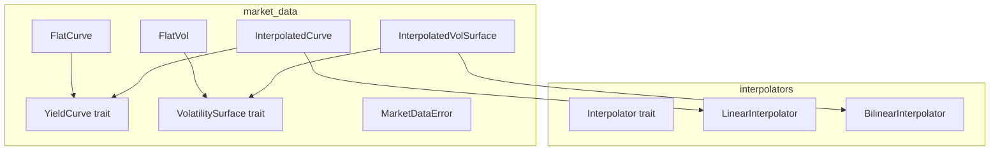

# Design Document: Market Data Structures

## Overview

**Purpose**: 本機能は、定量金融プライシングのためのイールドカーブとボラティリティサーフェス抽象化を提供する。

**Users**: クオンツ開発者がオプション・金利デリバティブのプライシングモデルで使用する。

**Impact**: `pricer_core` crate に新規 `market_data` モジュールを追加し、既存の interpolators インフラストラクチャと統合する。

### Goals
- YieldCurve trait と FlatCurve / InterpolatedCurve 実装の提供
- VolatilitySurface trait と FlatVol / InterpolatedVolSurface 実装の提供
- `T: Float` ジェネリクスによる Enzyme AD 互換性の確保
- 既存 `pricer_core::math::interpolators` との統合

## Architecture

### Existing Architecture Analysis

既存アーキテクチャ:
- `pricer_core::math::interpolators`: `Interpolator<T>` trait、`LinearInterpolator`、`BilinearInterpolator`
- `pricer_core::types::error`: `InterpolationError`、`PricingError`
- `pricer_core::traits`: `Float` trait (num_traits からの re-export)

統合ポイント:
- `InterpolatedCurve` は内部で `LinearInterpolator` を利用
- `InterpolatedVolSurface` は内部で `BilinearInterpolator` を利用
- `MarketDataError` は `InterpolationError` からの変換を提供

### Architecture Pattern & Boundary Map



**Architecture Integration**:
- Selected pattern: Trait-based polymorphism with concrete implementations (Box<dyn> 禁止、Enzyme 互換)
- Domain boundaries: `market_data` モジュールが curves/surfaces を所有、interpolators は再利用
- Existing patterns preserved: `T: Float` ジェネリクス、Result-based エラーハンドリング
- New components rationale: 市場データ抽象化はプライシングロジックから分離すべき
- Steering compliance: 静的 dispatch、AD 互換性維持

## Requirements Traceability

| Requirement | Summary | Components | Interfaces | Flows |
|-------------|---------|------------|------------|-------|
| 1.1-1.5 | YieldCurve trait 定義 | YieldCurve | discount_factor, zero_rate, forward_rate | - |
| 2.1-2.5 | FlatCurve 実装 | FlatCurve | YieldCurve trait | - |
| 3.1-3.6 | InterpolatedCurve 実装 | InterpolatedCurve | YieldCurve trait | Pillar interpolation |
| 4.1-4.5 | VolatilitySurface trait 定義 | VolatilitySurface | volatility, domain | - |
| 5.1-5.4 | FlatVol 実装 | FlatVol | VolatilitySurface trait | - |
| 6.1-6.6 | InterpolatedVolSurface 実装 | InterpolatedVolSurface | VolatilitySurface trait | 2D interpolation |
| 7.1-7.5 | MarketDataError 定義 | MarketDataError | From<InterpolationError> | - |
| 8.1-8.5 | Generic 互換性 | All | T: Float | AD propagation |

## Components and Interfaces

| Component | Domain/Layer | Intent | Req Coverage | Key Dependencies | Contracts |
|-----------|--------------|--------|--------------|------------------|-----------|
| YieldCurve | market_data/trait | 割引因子・レート計算インターフェース | 1.1-1.5 | Float (P0) | Service |
| FlatCurve | market_data/impl | 定数レートカーブ | 2.1-2.5 | YieldCurve (P0) | Service |
| InterpolatedCurve | market_data/impl | 補間ベースカーブ | 3.1-3.6 | YieldCurve (P0), LinearInterpolator (P0) | Service |
| VolatilitySurface | market_data/trait | Vol 検索インターフェース | 4.1-4.5 | Float (P0) | Service |
| FlatVol | market_data/impl | 定数 Vol サーフェス | 5.1-5.4 | VolatilitySurface (P0) | Service |
| InterpolatedVolSurface | market_data/impl | 補間ベース Vol サーフェス | 6.1-6.6 | VolatilitySurface (P0), BilinearInterpolator (P0) | Service |
| MarketDataError | market_data/error | 市場データエラー型 | 7.1-7.5 | InterpolationError (P1) | - |

### market_data/trait

#### YieldCurve

**Intent**: 割引因子、ゼロレート、フォワードレート計算の統一インターフェース

**Responsibilities & Constraints**
- 時間 t に対する割引因子 D(t) の計算
- ゼロレート r(t) の導出: r(t) = -ln(D(t))/t
- フォワードレート f(t1, t2) の導出
- 負の満期に対するエラーハンドリング

**Dependencies**: num_traits::Float — ジェネリック数値演算 (P0)

**Service Interface**
```rust
pub trait YieldCurve<T: Float> {
    fn discount_factor(&self, t: T) -> Result<T, MarketDataError>;
    fn zero_rate(&self, t: T) -> Result<T, MarketDataError> {
        let df = self.discount_factor(t)?;
        if t <= T::zero() {
            return Err(MarketDataError::InvalidMaturity { t: t.to_f64().unwrap_or(0.0) });
        }
        Ok(-df.ln() / t)
    }
    fn forward_rate(&self, t1: T, t2: T) -> Result<T, MarketDataError>;
}
```

#### VolatilitySurface

**Intent**: ストライク/満期によるインプライドボラティリティ検索

**Responsibilities & Constraints**
- (strike, expiry) に対するボラティリティ σ(K, T) の取得
- 有効ドメインの提供
- 境界外クエリに対するエラーハンドリング

**Service Interface**
```rust
pub trait VolatilitySurface<T: Float> {
    fn volatility(&self, strike: T, expiry: T) -> Result<T, MarketDataError>;
    fn strike_domain(&self) -> (T, T);
    fn expiry_domain(&self) -> (T, T);
}
```

### market_data/impl

#### FlatCurve

**Intent**: 定数金利による単純イールドカーブ

**Responsibilities & Constraints**
- 単一の金利パラメータ r を保持
- D(t) = exp(-r * t) を計算
- 全満期に対して同一のゼロレート/フォワードレートを返す

**Service Interface**
```rust
#[derive(Debug, Clone, Copy)]
pub struct FlatCurve<T: Float> {
    rate: T,
}

impl<T: Float> FlatCurve<T> {
    pub fn new(rate: T) -> Self;
    pub fn rate(&self) -> T;
}

impl<T: Float> YieldCurve<T> for FlatCurve<T> {
    fn discount_factor(&self, t: T) -> Result<T, MarketDataError>;
    fn zero_rate(&self, t: T) -> Result<T, MarketDataError>;
    fn forward_rate(&self, t1: T, t2: T) -> Result<T, MarketDataError>;
}
```

#### InterpolatedCurve

**Intent**: ピラーポイントによる補間イールドカーブ

**Responsibilities & Constraints**
- テナーとレートのピラーポイントを保持
- 指定された補間方式でゼロレートを補間
- Log-linear 補間オプション（割引因子に対して）

**Service Interface**
```rust
#[derive(Debug, Clone, Copy, PartialEq, Eq)]
pub enum CurveInterpolation {
    Linear,
    LogLinear,
}

#[derive(Debug, Clone)]
pub struct InterpolatedCurve<T: Float> {
    tenors: Vec<T>,
    rates: Vec<T>,
    method: CurveInterpolation,
    allow_extrapolation: bool,
}

impl<T: Float> InterpolatedCurve<T> {
    pub fn new(
        tenors: &[T],
        rates: &[T],
        method: CurveInterpolation,
        allow_extrapolation: bool,
    ) -> Result<Self, MarketDataError>;
    pub fn domain(&self) -> (T, T);
}
```

#### FlatVol

**Intent**: 定数ボラティリティサーフェス

**Service Interface**
```rust
#[derive(Debug, Clone, Copy)]
pub struct FlatVol<T: Float> {
    sigma: T,
}

impl<T: Float> FlatVol<T> {
    pub fn new(sigma: T) -> Self;
    pub fn sigma(&self) -> T;
}
```

#### InterpolatedVolSurface

**Intent**: グリッドデータによる補間ボラティリティサーフェス

**Service Interface**
```rust
#[derive(Debug, Clone)]
pub struct InterpolatedVolSurface<T: Float> {
    strikes: Vec<T>,
    expiries: Vec<T>,
    vols: Vec<Vec<T>>,
    allow_extrapolation: bool,
}

impl<T: Float> InterpolatedVolSurface<T> {
    pub fn new(
        strikes: &[T],
        expiries: &[T],
        vols: &[&[T]],
        allow_extrapolation: bool,
    ) -> Result<Self, MarketDataError>;
}
```

### market_data/error

#### MarketDataError

**Intent**: 市場データ操作のエラーハンドリング

```rust
use thiserror::Error;

#[derive(Error, Debug, Clone, PartialEq)]
pub enum MarketDataError {
    #[error("Invalid maturity: t = {t}")]
    InvalidMaturity { t: f64 },

    #[error("Invalid strike: K = {strike}")]
    InvalidStrike { strike: f64 },

    #[error("Invalid expiry: T = {expiry}")]
    InvalidExpiry { expiry: f64 },

    #[error("Out of bounds: {x} not in [{min}, {max}]")]
    OutOfBounds { x: f64, min: f64, max: f64 },

    #[error("Interpolation error: {0}")]
    Interpolation(#[from] InterpolationError),

    #[error("Insufficient data: got {got}, need {need}")]
    InsufficientData { got: usize, need: usize },
}

impl From<MarketDataError> for PricingError {
    fn from(err: MarketDataError) -> Self {
        PricingError::InvalidInput(err.to_string())
    }
}
```

## Data Models

### Domain Model

**Aggregates**:
- YieldCurve: 時間軸上の金利構造を表現
- VolatilitySurface: ストライク×満期の2次元ボラティリティ構造を表現

**Value Objects**:
- `CurveInterpolation`: 補間方式 enum
- Pillar points (tenor, rate) pairs
- Vol grid (strike, expiry, vol) tuples

**Invariants**:
- Discount factors must be positive: D(t) > 0
- No-arbitrage: D(t1) >= D(t2) for t1 <= t2
- Volatilities must be positive: σ > 0

## Error Handling

### Error Strategy
Result-based エラーハンドリング、early return パターン

### Error Categories and Responses
- **User Errors**: InvalidMaturity, InvalidStrike, InvalidExpiry — 入力検証で即座に拒否
- **System Errors**: OutOfBounds — ドメイン外クエリ、extrapolation 許可時は回復可能
- **Business Logic Errors**: InsufficientData — 構築時の検証

### Monitoring
- Debug trait 実装で構造体状態をログ可能
- thiserror による Display 実装でエラーメッセージ標準化

## Testing Strategy

### Unit Tests
1. FlatCurve: discount_factor, zero_rate, forward_rate の数学的正確性
2. InterpolatedCurve: 補間精度、境界動作、extrapolation
3. FlatVol: 定数返却、入力検証
4. InterpolatedVolSurface: 2D 補間精度、グリッド境界
5. MarketDataError: From trait 変換、Display 出力

### Integration Tests
1. YieldCurve + プライシングモデル統合
2. VolatilitySurface + オプションプライシング統合
3. Dual64 による AD 微分検証

### AD Compatibility Tests
1. FlatCurve with Dual64: 金利感応度 (delta) 伝播
2. InterpolatedCurve with Dual64: 補間を通じた微分連続性
3. VolatilitySurface with Dual64: vega 計算の正確性
